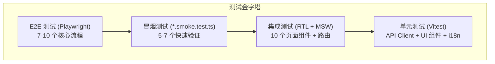

# 技术设计文档：后端管理平台测试体系

## 概述

本设计文档为 DRP 后端管理平台（`frontend/`）建立从零到一的自动化测试体系。项目基于 React 19 + TypeScript + Vite + D3.js 构建，包含 10 个管理页面和 1 个监管看板，当前零测试覆盖。

测试体系采用四层金字塔架构：
- **单元测试**：API 客户端、UI 组件库、i18n 纯函数
- **集成测试**：页面组件（API 调用 + 状态管理 + 用户交互）
- **冒烟测试**：核心流程最小可验证路径
- **E2E 测试**：Playwright 浏览器自动化

技术栈选型：Vitest + React Testing Library + MSW + Playwright

## 架构

### 测试金字塔



### 测试基础设施架构

```mermaid
graph LR
    subgraph "测试运行时"
        V[Vitest] --> JSDOM[jsdom 环境]
        V --> COV[Istanbul 覆盖率]
        PW[Playwright] --> BROWSER[Chromium]
    end
    subgraph "Mock 层"
        MSW[MSW Server] --> H[handlers.ts<br/>API Mock 处理器]
        WS_MOCK[WebSocket Mock] --> HOOK[useRiskEvents 测试]
    end
    subgraph "测试工具"
        RTL[React Testing Library]
        UE[user-event]
        JDOM[@testing-library/jest-dom]
    end
    V --> MSW
    V --> RTL
    RTL --> UE
    RTL --> JDOM
```

### 目录结构

```
frontend/
├── src/
│   └── test/
│       ├── setup.ts                    # 全局测试配置（jest-dom + MSW 生命周期）
│       └── mocks/
│           ├── handlers.ts             # MSW API mock 处理器
│           └── server.ts               # MSW setupServer 实例
├── src/
│   ├── api/
│   │   └── __tests__/
│   │       └── client.test.ts          # API 客户端单元测试
│   ├── components/
│   │   └── __tests__/
│   │       └── ui.test.ts              # UI 组件库单元测试
│   ├── dashboard/
│   │   └── __tests__/
│   │       ├── i18n.test.ts            # i18n 纯函数测试
│   │       ├── useRiskEvents.test.ts   # WebSocket hook 测试
│   │       └── DashComponents.test.ts  # 看板组件测试
│   ├── pages/
│   │   └── __tests__/
│   │       ├── LoginPage.test.tsx      # 登录页集成测试
│   │       ├── UsersPage.test.tsx      # 用户管理页集成测试
│   │       ├── RbacPages.test.tsx      # 角色/用户组页测试
│   │       ├── AuditPage.test.tsx      # 审计日志页测试
│   │       ├── MappingPages.test.tsx   # DDL上传/映射审核页测试
│   │       └── AdminPages.test.tsx     # ETL/租户/质量页测试
│   └── __tests__/
│       ├── App.test.tsx                # 应用级路由与认证测试
│       └── App.smoke.test.tsx          # 冒烟测试
├── e2e/
│   ├── login.spec.ts                   # 登录流程 E2E
│   ├── users.spec.ts                   # 用户管理 E2E
│   ├── audit.spec.ts                   # 审计日志 E2E
│   ├── mappings.spec.ts               # DDL/映射 E2E
│   ├── navigation.spec.ts             # 全局导航 E2E
│   └── admin.spec.ts                  # ETL/租户/质量 E2E
├── vitest.config.ts
└── playwright.config.ts
```

## 组件与接口

### 1. 测试基础设施组件

#### vitest.config.ts

```typescript
// 关键配置项
{
  test: {
    environment: 'jsdom',
    globals: true,
    setupFiles: ['./src/test/setup.ts'],
    include: ['src/**/*.test.{ts,tsx}'],
    exclude: ['node_modules', 'e2e'],
    coverage: {
      provider: 'istanbul',
      reporter: ['text', 'lcov'],
      include: ['src/**/*.{ts,tsx}'],
      exclude: ['node_modules', 'src/test/**', '**/*.d.ts', 'src/main.tsx'],
      thresholds: { lines: 80, branches: 70, functions: 80 }
    }
  }
}
```

#### setup.ts — 全局测试配置

```typescript
// 职责：初始化 jest-dom 匹配器 + MSW 服务器生命周期
import '@testing-library/jest-dom';
import { server } from './mocks/server';

beforeAll(() => server.listen({ onUnhandledRequest: 'error' }));
afterEach(() => server.resetHandlers());
afterAll(() => server.close());
```

#### handlers.ts — MSW Mock 处理器

为以下 API 端点提供默认 mock 响应：

| 端点 | 方法 | 默认响应 |
|------|------|---------|
| `/auth/login` | POST | `{ access_token, token_type, expires_in }` |
| `/auth/users` | GET | `UserItem[]` 示例数据 |
| `/auth/users/:id` | GET/PUT/DELETE | 单个用户操作 |
| `/auth/roles` | GET | `Role[]` 示例数据 |
| `/auth/roles/:id` | PUT/DELETE | 单个角色操作 |
| `/auth/audit-logs` | GET | `AuditLog[]` 示例数据 |
| `/tenants` | GET/POST | `Tenant[]` / 新建租户 |
| `/tenants/:id` | GET/DELETE | 单个租户操作 |
| `/mappings/generate` | POST | `{ mappings, mapping_yaml }` |
| `/mappings` | GET | `MappingSpec[]` 示例数据 |
| `/mappings/:id/approve` | PUT | 更新后的映射 |
| `/mappings/:id/reject` | PUT | 更新后的映射 |
| `/etl/jobs` | GET | `EtlJob[]` 示例数据 |
| `/etl/sync` | POST | `{ job_id }` |
| `/etl/quality/:tenantId` | GET | `DataQuality` 示例数据 |

### 2. 被测模块接口

#### API Client (`src/api/client.ts`)

```typescript
// Token 管理 — 纯函数，可直接单元测试
function setToken(token: string): void
function clearToken(): void
function getToken(): string | null

// HTTP 请求核心 — 通过 MSW 拦截验证
async function request<T>(method, path, body?, extraHeaders?): Promise<T>
// 401 处理逻辑：当 request 收到 401 响应时，应自动调用 clearToken() 清除本地凭证，
// 并抛出包含 "401" 的 Error，由上层组件（App.tsx）捕获后跳转登录页。
// 测试验证：mock 401 响应 → 断言 clearToken 被调用 + Error 包含 "401"

// 各业务 API — 验证请求构造和响应处理
authApi.login(email, password)
tenantsApi.list() / create(name) / delete(id)
usersApi.list() / create(data) / update(id, data) / delete(id)
rolesApi.list() / create(data) / update(id, data) / delete(id)
auditApi.list(params?)
mappingApi.generate(ddl) / list() / approve(id) / reject(id, reason?)
etlApi.list() / trigger(tenant_id, table, mapping_yaml)
qualityApi.get(tenantId)
```

#### UI 组件库 (`src/components/ui.tsx`)

| 组件 | 关键属性 | 测试重点 |
|------|---------|---------|
| `Btn` | variant, size, onClick | CSS 类名映射、点击回调 |
| `Modal` | title, onClose, children | 渲染内容、关闭交互 |
| `Input` | label, ...HTMLInputAttributes | label 渲染、值绑定 |
| `Badge` | label, variant | CSS 类名映射 |
| `Card` | children | 容器渲染 |
| `ErrorBox` | message | 错误消息显示 |
| `EmptyState` | message | 空状态提示 |
| `Spinner` | — | 加载文本显示 |
| `PageHeader` | title, action | 标题和操作区渲染 |

#### i18n 模块 (`src/dashboard/i18n.ts`)

```typescript
// 纯函数，适合属性测试
type Lang = 'zh' | 'en'
const STRINGS: Record<Lang, Record<string, string>>
function t(lang: Lang, key: string): string  // 返回翻译或 key 本身
```

#### WebSocket Hook (`src/dashboard/useRiskEvents.ts`)

```typescript
// 状态管理 hook，需要 mock WebSocket
type WsStatus = 'connecting' | 'connected' | 'disconnected' | 'reconnecting'

function useRiskEvents(tenantId: string | null): {
  events: RiskEvent[]  // 最多 200 条，最新在前
  status: WsStatus     // 4 种状态
}
```

**重连策略说明**：当 WebSocket 连接异常断开时，hook 应进入 `reconnecting` 状态并按指数退避策略（初始 1s，最大 30s）自动重连。重连期间 `status` 保持 `reconnecting`，重连成功后切换为 `connected`，超过最大重试次数（5 次）后切换为 `disconnected`。测试中需验证各状态转换路径。

### 3. 页面组件测试接口

每个页面组件的测试遵循统一模式：

```typescript
// 通用测试模式
describe('XxxPage', () => {
  // 1. 渲染测试：验证初始 API 调用和数据展示
  // 2. 交互测试：验证用户操作触发正确的 API 调用
  // 3. 错误处理：验证 API 失败时的 UI 反馈
  // 4. 状态管理：验证数据刷新和状态更新
});
```

**设计决策：删除/拒绝操作使用自定义 Modal**

当前代码中 `UsersPage`、`TenantsPage`、`RolesPage` 使用原生 `window.confirm`，`MappingsPage` 使用原生 `window.prompt`。需求 4.7 和 4.16 要求改为自定义 Modal 组件。测试中需验证：
- 点击删除/拒绝按钮 → 显示自定义确认 Modal
- Modal 中点击"确认" → 执行 API 调用
- Modal 中点击"取消" → 关闭 Modal，列表不变

**confirm/prompt 改造清单**（需在对应页面测试任务中同步完成）：

| 页面 | 当前实现 | 改造目标 |
|------|---------|---------|
| `UsersPage` | `window.confirm` | 自定义 Modal |
| `TenantsPage` | `window.confirm` | 自定义 Modal |
| `RolesPage` | `window.confirm` | 自定义 Modal |
| `MappingsPage` | `window.prompt` | 自定义 Modal（含输入框） |

## 数据模型

### Mock 数据工厂

为保持测试数据一致性，定义工厂函数生成标准化 mock 数据：

```typescript
// src/test/mocks/factories.ts（可选辅助文件）

interface MockUser extends UserItem {
  // 使用固定 ID 前缀便于断言
}

// 示例 mock 数据结构
const MOCK_USERS: UserItem[] = [
  { id: 'user-1', email: 'admin@example.com', username: 'admin', full_name: '管理员', status: 'active', tenant_id: 't-1', created_at: '2024-01-01T00:00:00Z' },
  { id: 'user-2', email: 'user@example.com', username: 'user', full_name: '普通用户', status: 'locked', tenant_id: 't-1', created_at: '2024-01-02T00:00:00Z' },
];

const MOCK_TENANTS: Tenant[] = [
  { id: 't-1', name: '测试租户', graph_iri: 'urn:drp:tenant:t-1', status: 'active', created_at: '2024-01-01T00:00:00Z' },
];

const MOCK_ROLES: Role[] = [
  { id: 'role-1', name: 'admin', description: '管理员角色', permissions: ['test:perm_a', 'test:perm_b', 'test:perm_c'] },
];

const MOCK_AUDIT_LOGS: AuditLog[] = [
  { id: 'log-1', user_id: 'user-1', event_type: 'login', resource: null, ip_address: '192.168.1.1', created_at: '2024-01-01T00:00:00Z', detail: null },
];

const MOCK_MAPPINGS: MappingSpec[] = [
  { id: 'map-1', source_table: 'accounts', source_field: 'balance', data_type: 'decimal', target_property: 'drp:balance', confidence: 85, auto_approved: false, status: 'pending', created_at: '2024-01-01T00:00:00Z' },
  { id: 'map-2', source_table: 'accounts', source_field: 'name', data_type: 'varchar', target_property: 'drp:name', confidence: 95, auto_approved: true, status: 'approved', created_at: '2024-01-01T00:00:00Z' },
];

const MOCK_ETL_JOBS: EtlJob[] = [
  { id: 'job-1', tenant_id: 't-1', job_type: 'full_sync', status: 'success', triples_written: 1500, error_message: null, created_at: '2024-01-01T00:00:00Z', finished_at: '2024-01-01T00:01:00Z' },
];

const MOCK_QUALITY: DataQuality = {
  tenant_id: 't-1', null_rate: 0.05, latency_seconds: 120, format_compliance: 0.95, overall: 90.5, is_healthy: true,
};
```

### 覆盖率数据模型

```typescript
// vitest.config.ts 中的阈值配置
interface CoverageThresholds {
  lines: 80;      // 行覆盖率 >= 80%
  branches: 70;   // 分支覆盖率 >= 70%
  functions: 80;  // 函数覆盖率 >= 80%
}
```

## 正确性属性

*正确性属性是在系统所有有效执行中都应成立的特征或行为——本质上是对系统应做什么的形式化陈述。属性是人类可读规范与机器可验证正确性保证之间的桥梁。*

### Property 1: Token 管理 round-trip

*For any* 随机生成的非空 token 字符串，调用 `setToken(token)` 后 `getToken()` 应返回该 token，且 `localStorage.getItem('drp_token')` 应等于该 token；随后调用 `clearToken()` 后 `getToken()` 应返回 `null`，且 `localStorage.getItem('drp_token')` 应为 `null`。

**Validates: Requirements 2.1, 2.2**

### Property 2: HTTP 错误状态码映射

*For any* HTTP 状态码 `status`（400 ≤ status ≤ 599）和任意响应文本 `text`，当后端返回该状态码时，API Client 抛出的 Error 消息应包含 `status` 数值和 `text` 内容。

**Validates: Requirements 2.3**

### Property 3: API 请求体构造正确性

*For any* 包含请求体的 API 方法调用（POST/PUT），发出的 HTTP 请求应满足：(a) 请求路径与 API 定义一致，(b) 请求方法正确，(c) 请求体包含所有必需字段，(d) 请求头包含 `Content-Type: application/json`。

**Validates: Requirements 2.5, 2.6, 2.8, 2.9**

### Property 4: 审计日志查询字符串构造

*For any* 分页参数组合（page、per_page、event_type 各自可选），`auditApi.list(params)` 发出的请求 URL 应将所有非空参数正确拼接为查询字符串，且不包含值为 `undefined` 的参数。

**Validates: Requirements 2.7**

### Property 5: i18n 翻译查找

*For any* 语言 `lang`（'zh' | 'en'）和 `STRINGS[lang]` 中已定义的 key，`t(lang, key)` 应返回 `STRINGS[lang][key]` 的值。

**Validates: Requirements 5.1, 5.2**

### Property 6: i18n 未知 key fallback

*For any* 不在 `STRINGS.zh` 和 `STRINGS.en` 中的随机字符串 key，`t(lang, key)` 应返回 key 本身。

**Validates: Requirements 5.3**

### Property 7: i18n 中英文键完整性

*For all* 在 `STRINGS.zh` 中定义的 key，`STRINGS.en` 中应存在相同的 key；反之亦然。两个语言的 key 集合应完全相同。

**Validates: Requirements 5.4**

### Property 8: WebSocket 事件添加与时间戳

*For any* 有效的 `risk_event` 类型 WebSocket 消息，接收后 `events` 数组的第一个元素应包含该消息的所有字段，且额外包含 `timestamp` 字段（ISO 8601 格式）。

**Validates: Requirements 5.7**

### Property 9: WebSocket 事件数组长度不变量

*For any* 数量的 WebSocket 消息序列，`events` 数组的长度应始终 ≤ 200，且保留的是最新的消息。

**Validates: Requirements 5.8**

### Property 10: JWT 安全验证

*For any* 伪造的 JWT token（包括：签名篡改、过期 token、空 payload、无效格式字符串），当 API Client 携带该 token 发起请求且后端返回 401 时，客户端应：(a) 自动调用 `clearToken()` 清除本地凭证，(b) 抛出包含 "401" 的 Error。不应出现 token 被静默接受或请求被重试的情况。

**Validates: Requirements 2.3, 安全测试层**

### Property 11: 401 响应自动清除 Token

*For any* API 端点（GET/POST/PUT/DELETE），当后端返回 401 状态码时，`request()` 函数应在抛出错误前调用 `clearToken()`，确保 `getToken()` 返回 `null` 且 `localStorage` 中不再存在 `drp_token`。

**Validates: Requirements 2.3**

## 错误处理

### 测试层面的错误处理策略

| 场景 | 处理方式 | 验证方法 |
|------|---------|---------|
| API 返回 4xx/5xx | 页面显示 `ErrorBox` 组件 | 集成测试：mock 错误响应，断言 ErrorBox 可见 |
| API 返回 401 | 清除 token，跳转登录页 | 单元测试：验证 clearToken 调用；属性测试 Property 10 |
| API 返回 204 | 返回 undefined | 单元测试：验证返回值 |
| 网络超时 | AbortController + setTimeout 超时中止 | 单元测试：mock fetch 超时，验证 AbortError |
| WebSocket 断开 | status 设为 'disconnected' | Hook 测试：模拟 onclose/onerror |
| 组件渲染异常 | 冒烟测试捕获 console.error | 冒烟测试：验证无控制台错误 |
| D3 渲染空数据 | 组件优雅降级 | 单元测试：传入空数据验证无崩溃 |

### MSW 错误模拟模式

```typescript
// 在特定测试中覆盖默认 handler 以模拟错误
import { http, HttpResponse } from 'msw';
import { server } from '../test/mocks/server';

// 模拟 500 错误
server.use(
  http.get('/auth/users', () => HttpResponse.json({ detail: '服务器错误' }, { status: 500 }))
);

// 模拟网络超时
server.use(
  http.get('/auth/users', () => HttpResponse.error())
);

// 模拟 401 未授权
server.use(
  http.get('/auth/users', () => HttpResponse.json({ detail: '未授权' }, { status: 401 }))
);
```

## 测试策略

### 双轨测试方法

- **单元测试 + 属性测试**：覆盖纯函数逻辑（API Client、i18n、Token 管理）
- **集成测试**：覆盖页面组件的 API 调用 + 状态管理 + 用户交互
- **冒烟测试**：核心流程最小可验证路径
- **E2E 测试**：Playwright 浏览器自动化验证完整用户流程

### 属性测试配置

- 使用 `fast-check` 库（TypeScript 生态最成熟的 PBT 库）
- 每个属性测试最少运行 100 次迭代
- 每个测试标注对应的设计属性编号
- 标注格式：`Feature: admin-portal-testing, Property {N}: {描述}`

### 属性测试适用范围

本项目中 PBT 适用于以下纯逻辑模块：

| 模块 | 适用属性 | 理由 |
|------|---------|------|
| Token 管理 | Property 1 | 纯函数，round-trip 属性 |
| HTTP 错误处理 | Property 2 | 输入空间大（状态码 × 响应文本） |
| API 请求构造 | Property 3, 4 | 参数组合多，通用属性 |
| i18n | Property 5, 6, 7 | 纯函数，集合属性 |
| WebSocket 事件 | Property 8, 9 | 状态不变量 |
| JWT 安全验证 | Property 10 | 输入空间大（各类伪造 token） |
| 401 自动清除 | Property 11 | 跨端点通用属性 |

以下模块不适用 PBT，使用 example-based 测试：
- UI 组件渲染（snapshot/example 测试更合适）
- 页面组件集成测试（涉及 API 调用和 DOM 交互）
- D3 可视化组件（SVG 渲染验证）
- E2E 测试（浏览器自动化）

### 测试分层详细策略

#### 第一层：单元测试

| 测试文件 | 被测模块 | 测试数量（预估） |
|---------|---------|---------------|
| `client.test.ts` | API Client | 15-20 个（含属性测试） |
| `ui.test.ts` | UI 组件库 | 10-12 个 |
| `i18n.test.ts` | i18n 模块 | 5-7 个（含属性测试） |

#### 第二层：集成测试

| 测试文件 | 被测页面 | 测试数量（预估） |
|---------|---------|---------------|
| `LoginPage.test.tsx` | 登录页 | 4-5 个 |
| `UsersPage.test.tsx` | 用户管理页 | 5-6 个 |
| `RbacPages.test.tsx` | 角色/用户组页 | 4-5 个 |
| `AuditPage.test.tsx` | 审计日志页 | 4-5 个 |
| `MappingPages.test.tsx` | DDL上传/映射审核页 | 5-6 个 |
| `AdminPages.test.tsx` | ETL/租户/质量页 | 5-6 个 |
| `App.test.tsx` | 应用路由与认证 | 5-6 个 |
| `useRiskEvents.test.ts` | WebSocket Hook | 5-6 个（含属性测试） |
| `DashComponents.test.ts` | 看板组件 | 5-6 个 |

#### 第三层：冒烟测试

文件命名：`*.smoke.test.ts`，通过 `test:smoke` 命令单独运行。

| 冒烟用例 | 前置条件 | 操作步骤 | 预期结果 |
|---------|---------|---------|---------|
| 登录流程 | MSW mock 就绪 | 输入凭据 → 提交 | 5 秒内进入主布局 |
| 用户管理页加载 | 已登录状态 | 导航到用户管理 | 用户列表表格可见 |
| 审计日志页加载 | 已登录状态 | 导航到审计日志 | 日志表格可见 |
| 全页面导航 | 已登录状态 | 依次点击 10 个导航项 | 无渲染错误 |
| 监管看板渲染 | 已登录状态 | 导航到看板 | SVG 图谱元素可见 |

#### 第四层：E2E 测试

使用 Playwright，mock API 服务器拦截后端请求：

| E2E 用例 | 验证内容 |
|---------|---------|
| 登录流程 | 输入凭据 → 登录 → 主布局可见 |
| 用户 CRUD | 新建用户 → 列表更新 |
| 审计日志过滤 | 选择过滤器 → 表格更新 |
| DDL 映射生成 | 粘贴 DDL → 生成 → 结果表格 |
| 映射审核 | 确认/拒绝 → 状态更新 |
| 全局导航 | 遍历所有页面 → 无控制台错误 |
| ETL 页面 | 页面加载 → 任务表格可见 |
| 租户创建 | 新建租户 → 列表更新 |
| 数据质量 | 切换租户 → 评分更新 |

### 覆盖率目标

```
行覆盖率:   >= 80%
分支覆盖率: >= 70%
函数覆盖率: >= 80%
```

覆盖率排除项：`node_modules`、`src/test/`、`*.d.ts`、`src/main.tsx`

### CSS 验证策略

由于 jsdom 不支持 CSS 变量计算，组件测试中：
- ✅ 验证 CSS 类名（如 `badge-success`、`btn-primary`）
- ✅ 验证 DOM 结构和文本内容
- ❌ 不验证 CSS 变量计算后的颜色值

### 关键设计决策

1. **MSW 而非手动 mock fetch**：MSW 在网络层拦截请求，更接近真实行为，且支持 handler 复用
2. **fast-check 用于属性测试**：TypeScript 原生支持，与 Vitest 无缝集成
3. **冒烟测试独立文件命名**：`*.smoke.test.ts` 约定 + Vitest include 配置，支持 `test:smoke` 单独运行
4. **自定义 Modal 替代原生 confirm/prompt**：需求 4.7 和 4.16 要求，便于测试且 UX 一致
5. **E2E 使用 mock API**：不依赖真实后端，测试稳定性高
6. **`__tests__` 目录就近放置**：测试文件与被测模块同级，便于维护和导航
7. **Btn 组件需添加 `className={`btn btn-${variant}`}`**：当前 `Btn` 组件仅使用内联 style，不输出 CSS 类名，导致测试无法通过类名断言 variant。实现时需在 `<button>` 上补充 `className={`btn btn-${variant}`}`，使测试可通过 `expect(btn).toHaveClass('btn-primary')` 验证。此为代码修改项，需在 UI 组件测试任务中同步完成。

### npm scripts 配置

```json
{
  "test": "vitest --run",
  "test:watch": "vitest",
  "test:coverage": "vitest --run --coverage",
  "test:smoke": "vitest --run --config vitest.smoke.config.ts",
  "test:e2e": "playwright test"
}
```

> 注：`test:smoke` 通过独立的 `vitest.smoke.config.ts` 配置文件，将 `include` 限定为 `**/*.smoke.test.{ts,tsx}`。

#### vitest.smoke.config.ts

```typescript
import { defineConfig } from 'vitest/config';

export default defineConfig({
  test: {
    environment: 'jsdom',
    globals: true,
    setupFiles: ['./src/test/setup.ts'],
    include: ['src/**/*.smoke.test.{ts,tsx}'],
    exclude: ['node_modules', 'e2e'],
    testTimeout: 10000,  // 冒烟测试允许更长超时
  },
});
```

## 安全测试层

本章节覆盖前端安全相关的测试策略，确保客户端在认证、授权、数据传输等环节不引入安全漏洞。

### JWT 伪造/篡改/过期测试

针对 JWT token 的安全边界进行系统性测试，验证客户端对异常 token 的处理行为：

| 测试场景 | 输入 | 预期行为 |
|---------|------|---------|
| 签名篡改 | 修改 JWT payload 后不重新签名 | 后端返回 401，客户端清除 token 并跳转登录 |
| 过期 token | `exp` 字段为过去时间的 JWT | 后端返回 401，客户端清除 token 并跳转登录 |
| 空 payload | `header..<empty>.signature` 格式 | 后端返回 401，客户端清除 token 并跳转登录 |
| 无效格式 | 非 JWT 格式的随机字符串 | 后端返回 401，客户端清除 token 并跳转登录 |
| 缺少 Bearer 前缀 | 直接传 token 不带 "Bearer " | 后端返回 401，客户端清除 token 并跳转登录 |

测试实现方式：通过 MSW 拦截请求，根据 Authorization header 中的 token 特征返回 401，验证客户端的 `clearToken()` 调用和错误抛出行为。对应 Property 10。

### Token 存储安全边界

**安全声明**：当前 Token 存储于 `localStorage`，这是前端 SPA 的常见方案。需明确以下安全边界：

- `localStorage` 不防 XSS 攻击——若页面存在 XSS 漏洞，攻击者可读取 token
- 安全的根本保障在后端：短过期时间 + refresh token rotation + 服务端 token 黑名单
- 前端需做到：不在 URL/日志中泄露 token、页面卸载时不残留敏感数据

**XSS 防护验证用例**：

| 测试场景 | 验证内容 |
|---------|---------|
| Token 不出现在 URL 中 | 所有 API 请求的 URL 不包含 token 字符串 |
| Token 不出现在 console.log 中 | mock console.log，验证无 token 泄露 |
| 错误消息不包含完整 token | API 错误抛出的 Error message 不含完整 token |
| clearToken 彻底清除 | 调用后 localStorage 和内存变量均为 null |

### 前端权限守卫测试

**安全边界声明**：前端权限控制（如根据角色隐藏/禁用按钮、菜单项）仅为 UX 优化，不构成安全边界。真正的权限校验必须在后端 API 层完成。前端权限守卫的测试目标是验证 UI 层的条件渲染逻辑正确性，而非安全性。

测试验证点：
- 不同角色登录后，导航菜单项的可见性符合预期
- 无权限时操作按钮应 disabled 或不渲染
- 即使前端绕过权限守卫直接调用 API，后端仍应返回 403（此项由后端测试覆盖）

### WebSocket 认证失败场景

在 `useRiskEvents.test.ts` 中新增以下认证失败测试用例：

| 测试场景 | 模拟方式 | 预期行为 |
|---------|---------|---------|
| 未携带 token 连接 | WebSocket 连接时不传 token | 服务端关闭连接，status 变为 `disconnected` |
| 无效 token 连接 | WebSocket URL 携带过期/伪造 token | 服务端关闭连接（code: 4401），status 变为 `disconnected` |
| 连接中 token 过期 | 连接建立后模拟服务端主动关闭（code: 4401） | status 变为 `disconnected`，不触发自动重连 |

认证失败（close code 4401）与普通断开（close code 1006）的区别：认证失败不应触发重连，普通断开应触发重连策略。

### 审计日志 CSV 导出 — CSV 注入防护

在 `AuditPage.test.tsx` 的 CSV 导出测试中，新增 CSV 注入防护验证：

当审计日志字段（如 `resource`、`ip_address`）包含以 `=`、`+`、`-`、`@`、`\t`、`\r` 开头的恶意内容时，导出的 CSV 应对这些字段进行转义处理（如添加单引号前缀 `'` 或 tab 前缀），防止在 Excel 等工具中触发公式注入。

| 测试输入 | 字段值 | 预期导出值 |
|---------|-------|-----------|
| 公式注入 | `=CMD('calc')` | `'=CMD('calc')` 或等效转义 |
| 加号开头 | `+1234567` | `'+1234567` 或等效转义 |
| 减号开头 | `-1+1` | `'-1+1` 或等效转义 |
| @符号开头 | `@SUM(A1)` | `'@SUM(A1)` 或等效转义 |

### 错误消息脱敏验证

API 错误响应中可能包含敏感信息（如内部路径、数据库表名、堆栈跟踪）。测试需验证前端展示给用户的错误消息经过脱敏处理：

| 测试场景 | 后端原始错误 | 前端展示 |
|---------|------------|---------|
| 包含内部路径 | `Error at /app/src/drp/auth/service.py:42` | 通用错误提示，不含路径 |
| 包含 SQL 信息 | `relation "users" does not exist` | 通用错误提示，不含表名 |
| 包含堆栈跟踪 | `Traceback (most recent call last)...` | 通用错误提示，不含堆栈 |

验证方式：在 `ErrorBox` 组件的集成测试中，mock 包含敏感信息的错误响应，断言渲染的错误文本不包含内部路径、SQL 关键字、堆栈跟踪等模式。

### 租户隔离专项测试

验证前端在多租户场景下的数据隔离正确性：

| 测试场景 | 验证内容 |
|---------|---------|
| 租户切换后数据刷新 | 切换 tenant_id 后，页面数据应重新加载，不展示前一租户的缓存数据 |
| API 请求携带正确 tenant_id | 所有租户相关 API 请求的路径/参数中 tenant_id 与当前选中租户一致 |
| WebSocket 租户隔离 | 切换租户后 WebSocket 应断开旧连接、建立新连接，events 数组应清空 |
| 跨租户数据不可见 | 租户 A 的数据不应出现在租户 B 的页面中（通过 MSW handler 验证请求参数） |

实现方式：在 `AdminPages.test.tsx` 和 `useRiskEvents.test.ts` 中新增租户切换场景的集成测试。

## 网络超时策略

API Client 的 `request()` 函数应实现基于 `AbortController` + `setTimeout` 的请求超时机制：

```typescript
// 超时策略伪代码
async function request<T>(method, path, body?, extraHeaders?): Promise<T> {
  const controller = new AbortController();
  const timeoutId = setTimeout(() => controller.abort(), REQUEST_TIMEOUT_MS);

  try {
    const resp = await fetch(url, { ...options, signal: controller.signal });
    // ... 正常处理
  } catch (err) {
    if (err instanceof DOMException && err.name === 'AbortError') {
      throw new Error(`请求超时: ${method} ${path}`);
    }
    throw err;
  } finally {
    clearTimeout(timeoutId);
  }
}

const REQUEST_TIMEOUT_MS = 30_000; // 默认 30 秒超时
```

测试验证：
- mock 一个永不响应的请求，验证超时后抛出包含 "超时" 的 Error
- 验证正常请求完成后 AbortController 被正确清理（无内存泄漏）
