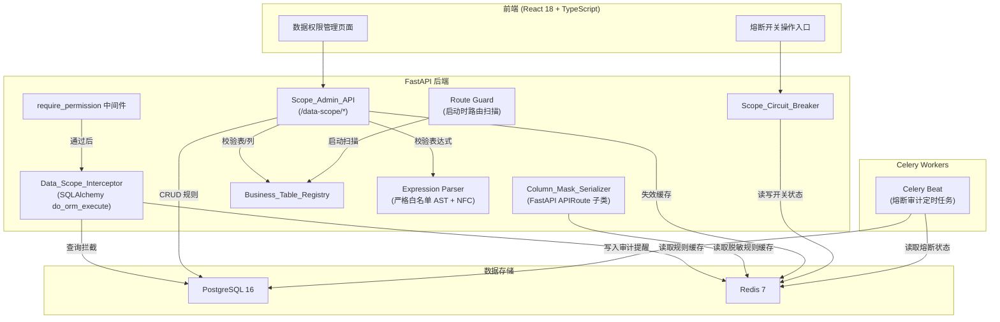
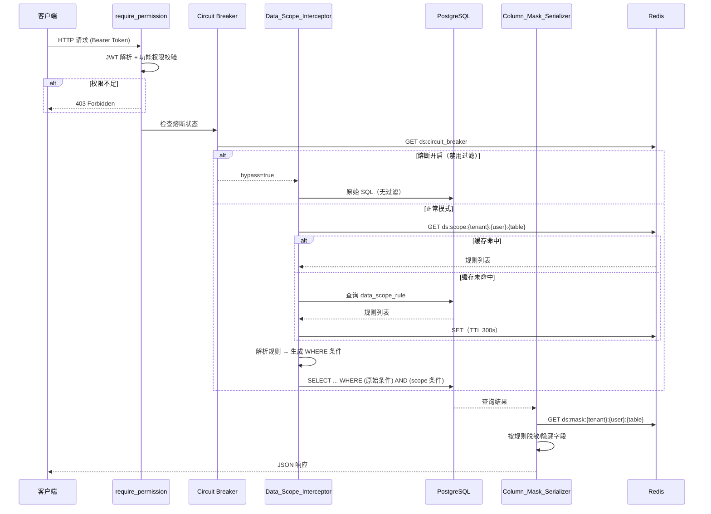
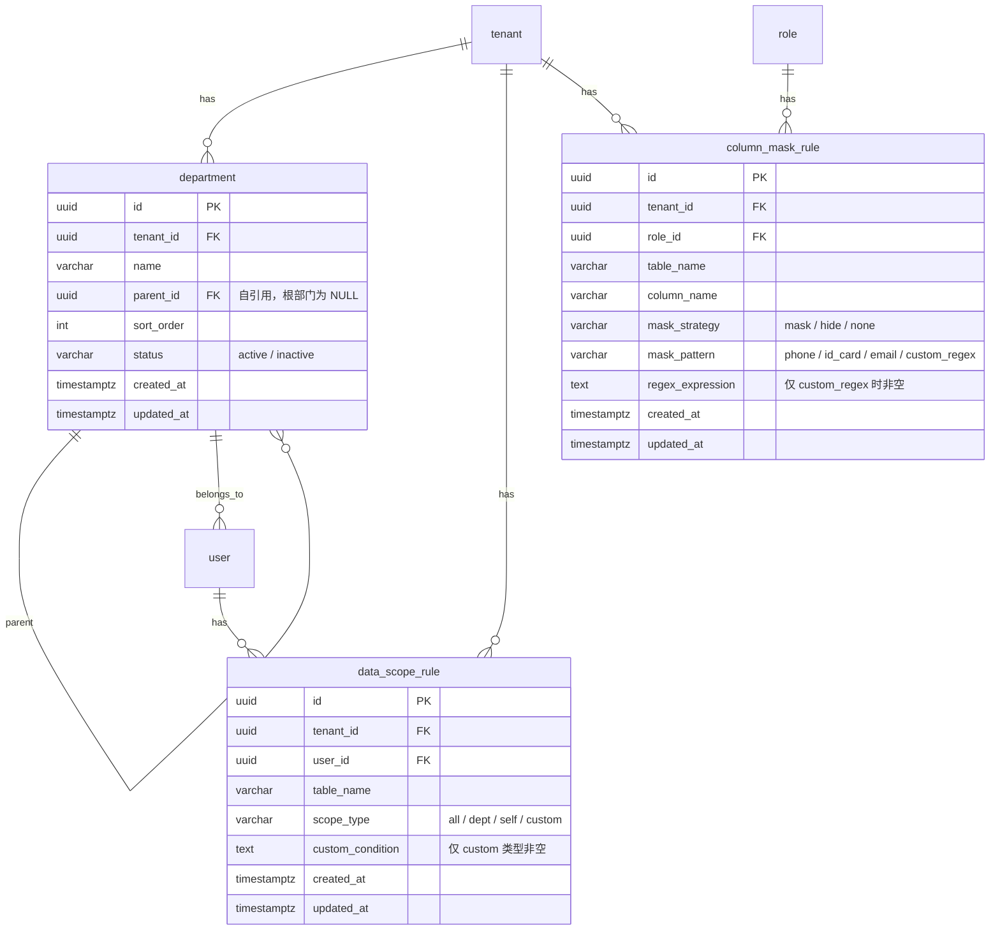

# 技术设计文档：细粒度数据权限（Data Scope Permission）

## 概述

本设计在现有 RBAC 模型（User → Role → Permission）基础上，新增数据范围权限层，实现行级数据过滤（Data_Scope_Rule）和列级脱敏（Column_Mask_Rule）。核心架构思路：

- **行级过滤**：通过 SQLAlchemy `do_orm_execute` 事件监听器（兼容 SQLAlchemy 2.x AsyncSession），在 SELECT 执行前自动注入 WHERE 条件
- **列级脱敏**：通过 FastAPI `APIRoute` 子类，在 Pydantic 序列化阶段直接执行脱敏/隐藏，避免 BaseHTTPMiddleware 的二次解析和流式响应问题
- **表达式安全**：custom_condition 限制最大 500 字符，采用严格白名单 AST（仅允许 `column OP value` 和 `AND/OR/NOT` 组合），Unicode NFC 规范化预处理
- **缓存**：Redis 集中缓存规则，TTL 300s，管理 API 变更时通过 Redis Pipeline（MULTI/EXEC）原子失效
- **熔断**：Redis 全局开关 + 二次密码验证 + 5 分钟操作冷却期 + 可选自动恢复 + Celery beat 定时审计提醒，紧急情况一键旁路

设计目标：业务路由代码低侵入（通过 `Depends(require_data_scope("table_name"))` FastAPI 依赖注入），所有过滤和脱敏逻辑由拦截器/序列化器自动完成。应用启动时自动扫描路由，对查询了已注册业务表但未使用 `require_data_scope` 依赖的路由输出警告日志。

## 架构

### 整体架构图



### 请求处理流程



## 组件与接口

### 1. Data_Scope_Interceptor（行级过滤拦截器）

- **实现方式**：SQLAlchemy `@event.listens_for(Session, "do_orm_execute")` 事件（兼容 SQLAlchemy 2.x AsyncSession）+ ContextVar 传递当前用户上下文
- **触发条件**：仅对使用了 `Depends(require_data_scope("table_name"))` 依赖的路由生效
- **位置**：`backend/src/drp/scope/interceptor.py`

```python
# 核心接口
def require_data_scope(table_name: str):
    """FastAPI 依赖工厂，标记该路由需要行级数据过滤。
    用法：
        @router.get("/items", dependencies=[Depends(require_data_scope("item"))])
        async def list_items(): ...
    自动从依赖注入获取 TokenPayload，设置 ContextVar _current_table 和 _scope_ctx。
    """

def apply_scope_filter(query, user_ctx, table_name) -> Query:
    """根据用户规则生成 WHERE 条件并追加到查询。"""
```

`require_data_scope` 依赖在路由函数执行前设置 ContextVar `_current_table`（供 Column_Mask_Serializer 读取）和 `_scope_ctx`，`do_orm_execute` 事件监听器检测到该标志后，从 Redis/DB 加载规则并注入 WHERE 子句。

### 2. Column_Mask_Serializer（列级脱敏序列化器）

- **实现方式**：FastAPI `APIRoute` 子类（`MaskedAPIRoute`），在 Pydantic 序列化阶段直接执行脱敏，避免 BaseHTTPMiddleware 的二次解析和流式响应问题
- **table_name 获取**：从 ContextVar `_current_table` 读取（由 `require_data_scope` 依赖设置）
- **位置**：`backend/src/drp/scope/mask_serializer.py`

```python
# 核心接口
class MaskedAPIRoute(APIRoute):
    """自定义 APIRoute 子类，在序列化阶段执行脱敏。"""
    def get_route_handler(self) -> Callable:
        original_handler = super().get_route_handler()
        async def masked_handler(request: Request) -> Response:
            response = await original_handler(request)
            # 从 ContextVar _current_table 获取 table_name
            table_name = _current_table.get()
            if table_name and isinstance(response, JSONResponse):
                data = json.loads(response.body)
                rules = await load_mask_rules(tenant_id, user_id, table_name)
                masked = apply_mask_rules(data, rules)
                return JSONResponse(content=masked, status_code=response.status_code)
            return response
        return masked_handler

def mask_value(value: str, pattern: MaskPattern) -> str:
    """按脱敏模式处理字段值。"""

def apply_mask_rules(data: dict, rules: list[ColumnMaskRule], user_roles: list[str]) -> dict:
    """对响应数据应用脱敏规则，多角色取最宽松策略。"""

def export_mask(rows: list[dict], rules: list[ColumnMaskRule], user_roles: list[str]) -> list[dict]:
    """文件导出（CSV/Excel）专用脱敏函数，在数据查询层执行脱敏。
    与 MaskedAPIRoute 使用相同的脱敏逻辑，但独立于 HTTP 响应流程。"""
```

脱敏覆盖范围：

| 通道 | 脱敏方式 | 说明 |
|------|---------|------|
| JSON API 响应 | `MaskedAPIRoute`（APIRoute 子类） | 自动在序列化阶段执行 |
| 文件导出（CSV/Excel） | `export_mask()` 函数 | 在数据查询层独立调用 |
| WebSocket / SSE | 不在 MVP 范围内 | 后续迭代支持 |

### 3. Expression Parser（custom_condition 解析器）

- **实现方式**：严格白名单 AST 解析器（仅允许 `column OP value` 和 `AND/OR/NOT` 组合，拒绝所有其他构造）
- **位置**：`backend/src/drp/scope/expr_parser.py`
- **安全约束**：
  - 输入最大长度：500 字符（超出直接拒绝）
  - Unicode NFC 规范化预处理（防止 Unicode 混淆攻击）
  - 仅允许的 AST 节点类型：`ColumnRef`、`Literal`（字符串/数字/NULL）、`CompareExpr`（column OP value）、`LogicalExpr`（AND/OR/NOT）
  - 允许的比较运算符：`=, !=, >, <, >=, <=, IN, BETWEEN, LIKE`
  - 所有其他构造（函数调用、子查询、嵌套表达式等）一律拒绝

```python
# 核心接口
MAX_CONDITION_LENGTH = 500

def parse_condition(expr: str, allowed_columns: list[str]) -> ParseResult:
    """解析 custom_condition 表达式，返回参数化 SQL 片段和绑定参数。
    
    流程：
    1. 长度校验（≤ 500 字符）
    2. Unicode NFC 规范化
    3. 词法分析 → tokens
    4. 严格白名单 AST 构建（仅允许 column OP value + AND/OR/NOT）
    5. 列名白名单校验
    6. 生成参数化 SQL 片段
    """

@dataclass
class ParseResult:
    sql_fragment: str          # 如 "region = :p0 AND amount > :p1"
    bind_params: dict[str, Any]  # 如 {"p0": "Beijing", "p1": 1000}
    referenced_columns: list[str]
```

### 4. Scope_Admin_API（管理接口）

- **位置**：`backend/src/drp/scope/router.py`
- **路由前缀**：`/data-scope`

| 方法 | 路径 | 权限 | 说明 |
|------|------|------|------|
| GET | `/data-scope/tables` | `data_scope:read` | 获取已注册业务表及列定义 |
| GET | `/data-scope/rules` | `data_scope:read` | 查询行级规则列表（?user_id=） |
| POST | `/data-scope/rules` | `data_scope:write` | 创建行级规则 |
| PUT | `/data-scope/rules/{id}` | `data_scope:write` | 更新行级规则 |
| DELETE | `/data-scope/rules/{id}` | `data_scope:write` | 删除行级规则 |
| GET | `/data-scope/mask-rules` | `data_scope:read` | 查询列级脱敏规则（?role_id=） |
| POST | `/data-scope/mask-rules` | `data_scope:write` | 创建列级脱敏规则 |
| PUT | `/data-scope/mask-rules/{id}` | `data_scope:write` | 更新列级脱敏规则 |
| DELETE | `/data-scope/mask-rules/{id}` | `data_scope:write` | 删除列级脱敏规则 |
| POST | `/data-scope/circuit-breaker` | `data_scope:circuit_breaker` | 设置熔断开关（需二次密码验证 + 5 分钟冷却期） |
| GET | `/data-scope/circuit-breaker` | `data_scope:read` | 查询熔断状态 |

### 5. Business_Table_Registry（业务表注册表）

- **实现方式**：Python 模块 + SQLAlchemy 模型元数据自动发现
- **位置**：`backend/src/drp/scope/registry.py`

```python
# 核心接口
class TableMeta(TypedDict):
    table_name: str
    columns: dict[str, str]  # column_name -> data_type
    supports_self: bool       # 是否包含 created_by 列

def get_registry() -> dict[str, TableMeta]:
    """返回所有已注册业务表的元数据。"""

def is_table_registered(table_name: str) -> bool:
    """检查表是否在注册表中。"""

def is_column_valid(table_name: str, column_name: str) -> bool:
    """检查列是否存在于指定表中。"""
```

注册表在应用启动时通过扫描标记了 `__data_scope__ = True` 的 SQLAlchemy 模型自动构建，也支持 YAML 配置文件手动注册。

### 6. Scope_Circuit_Breaker（熔断开关）

- **实现方式**：Redis 键值存储 + 可选 TTL 自动恢复 + 二次密码验证 + 5 分钟操作冷却期
- **位置**：`backend/src/drp/scope/circuit_breaker.py`
- **Redis 键**：`ds:circuit_breaker:{tenant_id}`
- **值结构**：`{"enabled": false, "operator_id": "...", "disabled_at": "...", "auto_recover_at": "...", "last_toggle_at": "..."}`
- **冷却键**：`ds:cb_cooldown:{tenant_id}`（TTL 300s，存在即表示冷却中）

```python
# 核心接口
async def is_circuit_open(tenant_id: str) -> bool:
    """检查熔断开关是否开启（数据过滤是否被旁路）。"""

async def set_circuit_breaker(
    tenant_id: str, 
    enabled: bool, 
    password: str,              # 二次密码验证（必填）
    operator: TokenPayload,     # 当前操作者
    auto_recover_minutes: int | None = None
) -> None:
    """设置熔断开关状态。
    
    安全机制：
    1. 验证 operator 的密码是否正确（调用 auth 服务校验）
    2. 检查 ds:cb_cooldown:{tenant_id} 是否存在，存在则拒绝（5 分钟冷却期）
    3. 执行状态变更
    4. 设置冷却键（TTL 300s）
    5. 写入审计日志
    6. 向所有拥有 circuit_breaker 权限的用户发送审计通知
    """
```

### 7. 部门管理 API

- **位置**：`backend/src/drp/scope/dept_router.py`
- **路由前缀**：`/departments`
- **独立权限**：`department:read` / `department:write`（不再复用 `data_scope:write`）

| 方法 | 路径 | 权限 | 说明 |
|------|------|------|------|
| GET | `/departments` | `department:read` | 查询部门树 |
| POST | `/departments` | `department:write` | 创建部门 |
| PUT | `/departments/{id}` | `department:write` | 更新部门 |
| DELETE | `/departments/{id}` | `department:write` | 删除部门（校验用户关联） |

### 8. Route Guard（路由安全扫描）

- **位置**：`backend/src/drp/scope/route_guard.py`
- **触发时机**：应用启动时（`@app.on_event("startup")` 或 lifespan）

```python
def scan_unguarded_routes(app: FastAPI, registry: dict[str, TableMeta]) -> list[str]:
    """扫描所有路由，检查查询了已注册业务表但未使用 require_data_scope 依赖的路由。
    
    检测逻辑：
    1. 遍历 app.routes，提取每个路由的依赖链
    2. 对于依赖链中包含 ORM 查询已注册业务表的路由
    3. 检查是否包含 require_data_scope 依赖
    4. 未包含的路由输出 WARNING 日志
    
    返回未保护的路由路径列表（仅用于日志和监控）。
    """
```


## 数据模型

### ER 关系图



### 数据库表设计

#### 1. department 表

```sql
CREATE TABLE department (
    id          UUID         PRIMARY KEY DEFAULT gen_random_uuid(),
    tenant_id   UUID         NOT NULL REFERENCES tenant(id) ON DELETE CASCADE,
    name        VARCHAR(255) NOT NULL,
    parent_id   UUID         REFERENCES department(id) ON DELETE RESTRICT,
    sort_order  INTEGER      NOT NULL DEFAULT 0,
    status      VARCHAR(50)  NOT NULL DEFAULT 'active'
                             CHECK (status IN ('active', 'inactive')),
    created_at  TIMESTAMPTZ  NOT NULL DEFAULT NOW(),
    updated_at  TIMESTAMPTZ  NOT NULL DEFAULT NOW(),
    UNIQUE (tenant_id, name, parent_id)
);

CREATE INDEX idx_dept_tenant ON department(tenant_id);
CREATE INDEX idx_dept_parent ON department(parent_id);
```

#### 2. user 表变更

```sql
-- 新增 dept_id 列
ALTER TABLE "user" ADD COLUMN dept_id UUID REFERENCES department(id) ON DELETE SET NULL;
CREATE INDEX idx_user_dept ON "user"(dept_id);
```

#### 3. data_scope_rule 表

```sql
CREATE TABLE data_scope_rule (
    id               UUID         PRIMARY KEY DEFAULT gen_random_uuid(),
    tenant_id        UUID         NOT NULL REFERENCES tenant(id) ON DELETE CASCADE,
    user_id          UUID         NOT NULL REFERENCES "user"(id) ON DELETE CASCADE,
    table_name       VARCHAR(255) NOT NULL,
    scope_type       VARCHAR(50)  NOT NULL
                                  CHECK (scope_type IN ('all', 'dept', 'self', 'custom')),
    custom_condition TEXT,
    created_at       TIMESTAMPTZ  NOT NULL DEFAULT NOW(),
    updated_at       TIMESTAMPTZ  NOT NULL DEFAULT NOW(),
    UNIQUE (tenant_id, user_id, table_name, scope_type),
    CHECK (scope_type != 'custom' OR custom_condition IS NOT NULL),
    CHECK (custom_condition IS NULL OR length(custom_condition) <= 500)
);

CREATE INDEX idx_dsr_tenant_user ON data_scope_rule(tenant_id, user_id);
CREATE INDEX idx_dsr_table ON data_scope_rule(table_name);
```

#### 4. column_mask_rule 表

```sql
CREATE TABLE column_mask_rule (
    id               UUID         PRIMARY KEY DEFAULT gen_random_uuid(),
    tenant_id        UUID         NOT NULL REFERENCES tenant(id) ON DELETE CASCADE,
    role_id          UUID         NOT NULL REFERENCES role(id) ON DELETE CASCADE,
    table_name       VARCHAR(255) NOT NULL,
    column_name      VARCHAR(255) NOT NULL,
    mask_strategy    VARCHAR(50)  NOT NULL
                                  CHECK (mask_strategy IN ('mask', 'hide', 'none')),
    mask_pattern     VARCHAR(50)  CHECK (mask_pattern IN ('phone', 'id_card', 'email', 'custom_regex')),
    regex_expression TEXT,
    created_at       TIMESTAMPTZ  NOT NULL DEFAULT NOW(),
    updated_at       TIMESTAMPTZ  NOT NULL DEFAULT NOW(),
    UNIQUE (tenant_id, role_id, table_name, column_name),
    CHECK (mask_strategy != 'mask' OR mask_pattern IS NOT NULL),
    CHECK (mask_pattern != 'custom_regex' OR regex_expression IS NOT NULL)
);

CREATE INDEX idx_cmr_tenant_role ON column_mask_rule(tenant_id, role_id);
CREATE INDEX idx_cmr_table ON column_mask_rule(table_name);
```

#### 5. 权限种子数据

```sql
INSERT INTO permission (resource, description) VALUES
    ('data_scope:read',            '查看数据权限规则'),
    ('data_scope:write',           '创建/修改/删除数据权限规则'),
    ('data_scope:circuit_breaker', '操作数据权限熔断开关'),
    ('department:read',            '查看部门组织架构'),
    ('department:write',           '创建/修改/删除部门');
```

### SQLAlchemy ORM 模型

新增模型文件：`backend/src/drp/scope/models.py`

```python
class Department(Base):
    __tablename__ = "department"
    id: Mapped[uuid.UUID]          # PK
    tenant_id: Mapped[uuid.UUID]   # FK → tenant
    name: Mapped[str]
    parent_id: Mapped[uuid.UUID | None]  # FK → department (自引用)
    sort_order: Mapped[int]
    status: Mapped[str]
    created_at: Mapped[datetime]
    updated_at: Mapped[datetime]
    # relationships
    children: Mapped[list["Department"]]  # parent_id 反向
    parent: Mapped["Department | None"]
    users: Mapped[list["User"]]           # dept_id 反向

class DataScopeRule(Base):
    __tablename__ = "data_scope_rule"
    id: Mapped[uuid.UUID]
    tenant_id: Mapped[uuid.UUID]
    user_id: Mapped[uuid.UUID]     # FK → user
    table_name: Mapped[str]
    scope_type: Mapped[str]        # all / dept / self / custom
    custom_condition: Mapped[str | None]
    created_at: Mapped[datetime]
    updated_at: Mapped[datetime]

class ColumnMaskRule(Base):
    __tablename__ = "column_mask_rule"
    id: Mapped[uuid.UUID]
    tenant_id: Mapped[uuid.UUID]
    role_id: Mapped[uuid.UUID]     # FK → role
    table_name: Mapped[str]
    column_name: Mapped[str]
    mask_strategy: Mapped[str]     # mask / hide / none
    mask_pattern: Mapped[str | None]
    regex_expression: Mapped[str | None]
    created_at: Mapped[datetime]
    updated_at: Mapped[datetime]
```

User 模型新增字段：

```python
# 在 backend/src/drp/auth/models.py 的 User 类中新增
dept_id: Mapped[uuid.UUID | None] = mapped_column(
    UUID(as_uuid=True), ForeignKey("department.id", ondelete="SET NULL"), nullable=True
)
department: Mapped["Department | None"] = relationship("Department", back_populates="users")
```

### Redis 缓存键设计

| 键模式 | 值类型 | TTL | 说明 |
|--------|--------|-----|------|
| `ds:scope:{tenant_id}:{user_id}:{table_name}` | JSON list | 300s | 用户对某表的行级规则列表 |
| `ds:mask:{tenant_id}:{user_id}:{table_name}` | JSON list | 300s | 用户（合并所有角色）对某表的列级脱敏规则 |
| `ds:circuit_breaker:{tenant_id}` | JSON object | 无 TTL（手动管理） | 熔断开关状态 |
| `ds:cb_cooldown:{tenant_id}` | `"1"` | 300s | 熔断操作冷却期标记（5 分钟） |
| `ds:dept_tree:{tenant_id}:{dept_id}` | JSON list[uuid] | 300s | 部门及所有下级部门 ID 列表 |

缓存失效策略（使用 Redis Pipeline MULTI/EXEC 确保原子性）：
- **行级规则变更**：Pipeline 内删除 `ds:scope:{tenant_id}:{user_id}:*`，审计日志记录缓存失效是否成功
- **列级规则变更**：Pipeline 内查询该角色关联的所有用户，删除 `ds:mask:{tenant_id}:{user_id}:*`，审计日志记录缓存失效是否成功
- **部门变更**：Pipeline 内删除 `ds:dept_tree:{tenant_id}:*`
- **Redis 不可用**：回退到数据库直查，写入警告日志

```python
# 缓存失效原子操作示例
async def invalidate_scope_cache(redis: Redis, tenant_id: str, user_id: str) -> bool:
    """使用 Redis Pipeline 原子删除缓存键，返回是否成功。"""
    try:
        async with redis.pipeline(transaction=True) as pipe:
            keys = await redis.keys(f"ds:scope:{tenant_id}:{user_id}:*")
            if keys:
                pipe.delete(*keys)
            await pipe.execute()
        return True
    except RedisError:
        logger.warning("缓存失效操作失败", exc_info=True)
        return False
```

### Data_Scope_Interceptor 实现方案

核心实现基于 SQLAlchemy 2.x `do_orm_execute` 事件（兼容 AsyncSession）：

```python
from sqlalchemy import event
from sqlalchemy.orm import Session
from contextvars import ContextVar

# ContextVar 传递当前请求的 scope 上下文
_scope_ctx: ContextVar[ScopeContext | None] = ContextVar("scope_ctx", default=None)
# ContextVar 传递当前业务表名（供 Column_Mask_Serializer 读取）
_current_table: ContextVar[str | None] = ContextVar("_current_table", default=None)

@event.listens_for(Session, "do_orm_execute")
def _inject_scope_filter(orm_execute_state):
    """SQLAlchemy 2.x do_orm_execute 事件，兼容 AsyncSession。"""
    ctx = _scope_ctx.get()
    if ctx is None or not ctx.active:
        return
    if not orm_execute_state.is_select:
        return
    # 检查查询涉及的表是否在注册表中
    statement = orm_execute_state.statement
    for entity in orm_execute_state.bind_mapper_entities:
        table_name = entity.mapper.local_table.name
        if table_name in ctx.target_tables:
            rules = load_rules(ctx.tenant_id, ctx.user_id, table_name)
            if not rules:
                raise HTTPException(403, "未配置数据范围规则，请联系管理员")
            where_clause = build_where_clause(rules, ctx)
            orm_execute_state.statement = statement.where(where_clause)
```

`require_data_scope` FastAPI 依赖在路由函数执行前设置 ContextVar，执行后清除：

```python
def require_data_scope(table_name: str):
    """FastAPI 依赖工厂，替代原 @data_scope 装饰器。
    
    用法：
        @router.get("/items", dependencies=[Depends(require_data_scope("item"))])
        async def list_items(user: TokenPayload = Depends(get_current_user)): ...
    """
    async def _dependency(user: TokenPayload = Depends(get_current_user)):
        # 设置 _current_table 供 Column_Mask_Serializer 读取
        table_token = _current_table.set(table_name)
        scope_token = _scope_ctx.set(ScopeContext(
            active=True, tenant_id=user.tenant_id, user_id=user.sub,
            target_tables={table_name}
        ))
        try:
            yield user
        finally:
            _scope_ctx.reset(scope_token)
            _current_table.reset(table_token)
    return _dependency
```

### Column_Mask_Serializer 实现方案

基于 FastAPI `APIRoute` 子类，在 Pydantic 序列化阶段直接执行脱敏（避免 BaseHTTPMiddleware 的二次解析和流式响应问题）：

```python
class MaskedAPIRoute(APIRoute):
    """自定义 APIRoute，在序列化阶段执行列级脱敏。
    
    用法：在需要脱敏的 router 上设置 route_class：
        router = APIRouter(route_class=MaskedAPIRoute)
    """
    def get_route_handler(self) -> Callable:
        original_handler = super().get_route_handler()
        
        async def masked_handler(request: Request) -> Response:
            response = await original_handler(request)
            # 从 ContextVar 获取 table_name（由 require_data_scope 设置）
            table_name = _current_table.get()
            if not table_name or not isinstance(response, JSONResponse):
                return response
            
            # 检查熔断状态
            if await is_circuit_open(request.state.tenant_id):
                return response
            
            # 加载脱敏规则并应用
            user = request.state.user
            rules = await load_mask_rules(user.tenant_id, user.sub, table_name)
            if not rules:
                return response
            
            data = json.loads(response.body)
            masked = apply_mask_rules(data, rules, user.role_ids)
            return JSONResponse(
                content=masked, 
                status_code=response.status_code,
                headers=dict(response.headers)
            )
        
        return masked_handler
```

文件导出脱敏（CSV/Excel）独立函数：

```python
async def export_mask(
    rows: list[dict], 
    tenant_id: str, 
    user_id: str, 
    role_ids: list[str],
    table_name: str
) -> list[dict]:
    """文件导出专用脱敏，在数据查询层执行。
    
    与 MaskedAPIRoute 共享 apply_mask_rules 逻辑，
    但独立于 HTTP 响应流程，适用于 CSV/Excel 导出场景。
    """
    rules = await load_mask_rules(tenant_id, user_id, table_name)
    if not rules:
        return rows
    return [apply_mask_rules(row, rules, role_ids) for row in rows]
```

内置脱敏函数：

| mask_pattern | 输入示例 | 输出示例 | 规则 |
|-------------|---------|---------|------|
| `phone` | `13812345678` | `138****5678` | 保留前3后4 |
| `id_card` | `110101199001011234` | `110***********1234` | 保留前3后4 |
| `email` | `user@example.com` | `u***@example.com` | 用户名部分遮蔽 |
| `custom_regex` | 按正则匹配 | 匹配部分替换为 `*` | 自定义正则 |

### custom_condition 表达式解析器

严格白名单 AST 校验 + Unicode NFC 规范化 + 参数化查询生成：

```
输入: "region = 'Beijing' AND amount > 1000"

预处理:
  0. 长度校验 → len("region = 'Beijing' AND amount > 1000") = 40 ≤ 500 ✓
  1. Unicode NFC 规范化 → unicodedata.normalize("NFC", expr)

解析:
  2. 词法分析 → tokens: [COL:region, OP:=, VAL:'Beijing', AND, COL:amount, OP:>, VAL:1000]
  3. 严格白名单 AST 构建:
     LogicalExpr(AND,
       CompareExpr(ColumnRef("region"), EQ, Literal("Beijing")),
       CompareExpr(ColumnRef("amount"), GT, Literal(1000))
     )
  4. AST 节点类型校验 → 仅允许 ColumnRef/Literal/CompareExpr/LogicalExpr
  5. 列名校验 → region, amount 是否在 Business_Table_Registry 中
  6. 生成参数化 SQL → "region = :p0 AND amount > :p1", {"p0": "Beijing", "p1": 1000}
```

安全约束（严格白名单 AST 模式）：
- **长度限制**：custom_condition 最大 500 字符，超出直接拒绝
- **Unicode 规范化**：输入先经过 NFC 规范化，防止 Unicode 混淆攻击（如全角字符伪装）
- **AST 白名单**：仅允许 4 种节点类型 — `ColumnRef`、`Literal`、`CompareExpr`（column OP value）、`LogicalExpr`（AND/OR/NOT），所有其他构造一律拒绝
- 禁止 `;`、`--`、`/*`、`SELECT`、`INSERT`、`UPDATE`、`DELETE`、`DROP`、`UNION` 等 SQL 关键字
- 禁止函数调用（任何形式的括号表达式，除 IN 的值列表外）
- 禁止子查询
- 值仅允许：字符串字面量（单引号包裹）、数字、NULL
- 列名必须在 Business_Table_Registry 白名单中

### 前端组件设计

新增文件：`frontend/src/pages/DataScopePages.tsx`

```
数据权限管理
├── DataScopeRulesPage（行级规则页）
│   ├── 用户筛选下拉框
│   ├── 规则列表表格
│   ├── 创建/编辑规则 Modal
│   │   ├── 用户选择器
│   │   ├── 表名下拉选择器（从 /data-scope/tables 获取）
│   │   ├── scope_type 单选组
│   │   └── custom_condition 输入框（scope_type=custom 时显示）
│   └── 删除确认 Modal（最后一条规则时显示警告）
│
├── ColumnMaskRulesPage（列级规则页）
│   ├── 角色筛选下拉框
│   ├── 规则列表表格
│   ├── 创建/编辑规则 Modal
│   │   ├── 角色选择器
│   │   ├── 表名下拉选择器
│   │   ├── 列名下拉选择器（联动表名）
│   │   ├── mask_strategy 单选组
│   │   └── mask_pattern 选择器（strategy=mask 时显示）
│   └── 删除确认 Modal
│
└── CircuitBreakerPanel（熔断开关面板）
    ├── 当前状态显示（启用/禁用 + 持续时间）
    ├── 切换开关按钮
    ├── 二次密码验证输入框（切换时必填）
    ├── 冷却期倒计时显示（5 分钟内不可重复操作）
    └── 自动恢复时长输入（可选）
```

前端 API 客户端扩展（`frontend/src/api/client.ts`）：

```typescript
// 新增 dataScopeApi
export const dataScopeApi = {
  getTables: () => request<TableMeta[]>('GET', '/data-scope/tables'),
  listRules: (userId?: string) => request<DataScopeRule[]>('GET', `/data-scope/rules${userId ? `?user_id=${userId}` : ''}`),
  createRule: (data: CreateRuleReq) => request<DataScopeRule>('POST', '/data-scope/rules', data),
  updateRule: (id: string, data: UpdateRuleReq) => request<DataScopeRule>('PUT', `/data-scope/rules/${id}`, data),
  deleteRule: (id: string) => request<DeleteRuleResp>('DELETE', `/data-scope/rules/${id}`),
  listMaskRules: (roleId?: string) => request<ColumnMaskRule[]>('GET', `/data-scope/mask-rules${roleId ? `?role_id=${roleId}` : ''}`),
  createMaskRule: (data: CreateMaskRuleReq) => request<ColumnMaskRule>('POST', '/data-scope/mask-rules', data),
  updateMaskRule: (id: string, data: UpdateMaskRuleReq) => request<ColumnMaskRule>('PUT', `/data-scope/mask-rules/${id}`, data),
  deleteMaskRule: (id: string) => request<void>('DELETE', `/data-scope/mask-rules/${id}`),
  getCircuitBreaker: () => request<CircuitBreakerStatus>('GET', '/data-scope/circuit-breaker'),
  setCircuitBreaker: (data: SetCircuitBreakerReq) => request<CircuitBreakerStatus>('POST', '/data-scope/circuit-breaker', data),
  // SetCircuitBreakerReq 需包含 password 字段用于二次验证
};
```

NAV_ITEMS 新增：

```typescript
// Page 类型新增
type Page =
  | 'users' | 'groups' | 'roles' | 'audit'
  | 'ddl' | 'mappings' | 'etl' | 'tenants' | 'quality'
  | 'dashboard'
  | 'data-scope-rules' | 'data-scope-masks';  // 新增

// NAV_ITEMS 新增数据权限菜单项
{ id: 'data-scope-rules', label: '行级规则', icon: '🛡️', requiredPermission: 'data_scope:read' },
{ id: 'data-scope-masks', label: '列级规则', icon: '🔒', requiredPermission: 'data_scope:read' },

// PageContent switch-case 新增分支
case 'data-scope-rules': return <DataScopeRulesPage />;
case 'data-scope-masks': return <ColumnMaskRulesPage />;
```


## 正确性属性（Correctness Properties）

*正确性属性是在系统所有合法执行中都应成立的特征或行为——本质上是对系统行为的形式化陈述。属性是连接人类可读规格说明与机器可验证正确性保证之间的桥梁。*

### Property 1: 租户数据隔离

*For any* 租户 A 的用户查询 Data_Scope_Rule 或 Column_Mask_Rule，返回的规则集合中所有记录的 tenant_id 都应等于租户 A 的 ID，不应包含任何其他租户的规则。

**Validates: Requirements 1.2, 2.2**

### Property 2: 表达式解析器安全性

*For any* custom_condition 字符串输入（长度 ≤ 500 字符，经 Unicode NFC 规范化后）和业务表列定义白名单，表达式解析器应满足：(a) 超过 500 字符的输入被直接拒绝；(b) AST 中包含白名单外节点类型（非 ColumnRef/Literal/CompareExpr/LogicalExpr）的输入被拒绝；(c) 引用白名单外列名的输入被拒绝；(d) 被接受的输入生成的 SQL 片段仅包含绑定参数占位符（`:pN`），不包含用户提供的字面量值的直接拼接。此属性测试使用 ≥10000 次 fuzzing 迭代。

**Validates: Requirements 1.3, 1.4, 3.5**

### Property 3: 部门树递归查询正确性

*For any* 部门树结构（深度 ≤ 10 层）和任意起始部门节点，递归 CTE 查询返回的部门 ID 集合应恰好等于该节点及其所有直接和间接子部门的 ID 集合（即传递闭包），且不包含任何非子部门的 ID。

**Validates: Requirements 1.6, 1.1.3**

### Property 4: 多规则 OR 合并

*For any* 用户对同一业务表的 N 条（N ≥ 2）Data_Scope_Rule，拦截器生成的 WHERE 子句应等价于各规则条件的 OR 组合，即满足任一规则条件的行都应出现在结果集中，不满足所有规则条件的行不应出现。

**Validates: Requirements 1.8**

### Property 5: 部门循环引用检测

*For any* 部门树和任意 parent_id 更新操作，如果更新后会产生 A→B→…→A 的闭环路径，则校验函数应返回错误；如果不产生闭环，则校验函数应允许操作。

**Validates: Requirements 1.1.5**

### Property 6: 脱敏策略应用正确性

*For any* 字段值和 Column_Mask_Rule：(a) 当 mask_strategy 为 `mask` 时，输出值的长度应与输入值相同，且被遮蔽部分替换为 `*`，保留部分与原值一致；(b) 当 mask_strategy 为 `hide` 时，该字段应从响应 JSON 中完全消失；(c) 当 mask_strategy 为 `none` 时，输出值应与输入值完全相同。

**Validates: Requirements 2.4, 2.5, 2.6, 4.2, 4.3, 4.4**

### Property 7: 多角色脱敏策略合并取最宽松

*For any* 用户拥有的角色集合及各角色对同一列的 mask_strategy 配置，合并后的有效策略应等于集合中优先级最高的策略（优先级：none > mask > hide）。

**Validates: Requirements 2.7**

### Property 8: 规则冲突检测

*For any* 用户对某业务表的已有规则集合和新增规则，如果已有规则中包含 `all` 类型，则冲突检测应返回警告；如果新增规则为 `all` 类型且已有其他类型规则，也应返回警告。

**Validates: Requirements 1.10**

### Property 9: 熔断旁路正确性

*For any* 查询和脱敏规则，当熔断开关处于禁用状态时：(a) Data_Scope_Interceptor 不应追加任何 WHERE 条件；(b) Column_Mask_Serializer 不应修改任何字段值；(c) 响应应包含原始未过滤、未脱敏的数据。

**Validates: Requirements 5.2.2, 5.2.3**

### Property 11: 熔断开关操作安全性

*For any* 熔断开关切换请求：(a) 未提供正确密码的请求应被拒绝；(b) 同一租户在 5 分钟冷却期内的重复切换请求应被拒绝；(c) 成功切换后应向所有拥有 `circuit_breaker` 权限的用户发送审计通知。

**Validates: Requirements 5.2.1, 5.2.4, 5.2.5**

### Property 10: 业务表注册校验

*For any* 表名和规则创建请求：(a) 如果表名不在 Business_Table_Registry 中，则创建应被拒绝；(b) 如果规则类型为 `self` 且目标表不包含 `created_by` 列，则创建应被拒绝；(c) 如果列名不在目标表的列定义中，则 Column_Mask_Rule 创建应被拒绝。

**Validates: Requirements 5.1.3, 5.1.5, 5.4**

## 错误处理

### 错误分类与响应

| 场景 | HTTP 状态码 | 错误信息 | 处理方式 |
|------|------------|---------|---------|
| 未配置数据范围规则 | 403 | "未配置数据范围规则，请联系管理员" | 写入审计日志 |
| custom_condition 表达式非法 | 403 | "自定义条件表达式不合法：{具体原因}" | 写入审计日志 |
| custom_condition 超过 500 字符 | 400 | "自定义条件表达式超过最大长度限制（500 字符）" | 返回错误 |
| 表名未在注册表中 | 400 | "业务表 {table_name} 未注册" | 返回错误 |
| 列名不存在 | 400 | "列 {column_name} 不存在于表 {table_name}" | 返回错误 |
| self 类型但表无 created_by | 400 | "表 {table_name} 不支持 self 类型规则（缺少 created_by 列）" | 返回错误 |
| 部门循环引用 | 400 | "部门层级存在循环引用" | 返回错误 |
| 删除部门有关联用户 | 409 | "该部门下仍有关联用户，请先迁移用户后再删除" | 返回错误 |
| 权限不足 | 403 | "权限不足，需要 {permission}" | 现有中间件处理 |
| 熔断开关密码验证失败 | 401 | "密码验证失败" | 写入审计日志 |
| 熔断开关冷却期内重复操作 | 429 | "操作过于频繁，请 {remaining} 秒后重试" | 返回错误 |
| Redis 不可用 | — | 降级到数据库直查 | 写入警告日志 |
| 缓存失效操作失败 | — | 缓存失效失败但规则已更新 | 审计日志记录失效结果 |
| 脱敏处理异常 | — | 对该字段执行 hide 策略 | 写入错误日志 |
| 正则表达式非法 | 400 | "正则表达式不合法：{具体原因}" | 返回错误 |
| 规则冲突警告 | 200 + warning | 响应体包含 `warning` 字段 | 正常创建但附带警告 |
| 删除最后一条规则 | 200 + warning | 响应体包含 `warning` 字段 | 需前端二次确认 |
| 路由未保护警告 | — | 启动时输出 WARNING 日志 | 仅日志，不阻止启动 |

### 降级策略

1. **Redis 不可用**：回退到 PostgreSQL 直查规则，性能降级但功能不受影响
2. **脱敏异常**：对异常字段执行最严格策略（hide），确保不泄露敏感数据
3. **表达式解析失败**：拒绝查询（403），不执行可能不安全的 SQL

## 测试策略

### 属性测试（Property-Based Testing）

使用 `hypothesis` 库（已在 dev 依赖中），每个属性测试最少 100 次迭代。**Property 2（表达式解析器安全性）例外：使用 ≥10000 次 fuzzing 迭代**，以充分覆盖 Unicode 混淆、边界长度、嵌套构造等攻击向量。

测试文件：`backend/tests/test_data_scope_properties.py`

每个属性测试标记格式：
```python
# Feature: data-scope-permission, Property N: {property_text}
```

属性测试覆盖的核心模块：
- `drp.scope.expr_parser` — 表达式解析器（Property 2，≥10000 次迭代）
- `drp.scope.interceptor` — 规则合并逻辑（Property 4）、熔断旁路（Property 9）
- `drp.scope.mask_serializer` — 脱敏函数（Property 6）、策略合并（Property 7）
- `drp.scope.dept_service` — 部门树递归（Property 3）、循环检测（Property 5）
- `drp.scope.registry` — 注册表校验（Property 10）
- `drp.scope.conflict_detector` — 冲突检测（Property 8）
- `drp.scope.circuit_breaker` — 熔断操作安全性（Property 11）

需要的 Hypothesis 策略（generators）：
- 随机部门树生成器（控制深度、宽度）
- 随机 custom_condition 表达式生成器（合法/非法，含 Unicode 混淆、超长输入）
- 随机脱敏规则组合生成器
- 随机多租户数据生成器

### 单元测试

测试文件：`backend/tests/test_data_scope_unit.py`

覆盖具体示例和边界情况：
- self 类型生成 `created_by = :current_user_id`
- all 类型不追加条件
- 无规则时返回 403
- dept_id 为 NULL 时 dept 规则返回空结果集
- 脱敏异常时 fallback 到 hide
- Redis 不可用时降级到数据库
- 删除最后一条规则时返回警告
- all 类型创建时要求确认
- 删除部门有关联用户时拒绝
- custom_condition 超过 500 字符时拒绝
- Unicode 混淆字符经 NFC 规范化后正确处理
- 熔断开关密码验证失败时拒绝
- 熔断开关 5 分钟冷却期内重复操作时拒绝（429）
- 缓存失效 Pipeline 原子性验证
- 缓存失效失败时审计日志记录
- `require_data_scope` 依赖正确设置/清除 ContextVar
- `export_mask` 函数与 API 脱敏结果一致
- 启动时路由扫描检测未保护路由

### 集成测试

测试文件：`backend/tests/test_data_scope_integration.py`

覆盖端到端流程：
- Scope_Admin_API 完整 CRUD 流程
- 拦截器（do_orm_execute）+ APIRoute 子类联合工作流
- 缓存写入/读取/Pipeline 原子失效
- 熔断开关切换（含密码验证和冷却期）
- 熔断审计通知发送
- 审计日志写入（含缓存失效结果记录）
- 依赖执行顺序（require_permission → require_data_scope → MaskedAPIRoute）
- Celery beat 熔断审计定时任务
- 文件导出脱敏（export_mask）
- 启动时路由安全扫描

### 前端测试

测试文件：`frontend/src/pages/__tests__/DataScopePages.test.tsx`

覆盖：
- 页面渲染和权限控制
- 表单提交和校验
- 二次确认弹窗
- 熔断开关操作（含密码验证和冷却期 UI）
- 前端路由集成（data-scope-rules / data-scope-masks 页面切换）


## 推迟项（设计评审新增）

以下为设计评审中确认推迟到后续迭代的增强项：

| 编号 | 功能 | 推迟理由 |
|------|------|----------|
| D-07 | 多角色脱敏策略可配置（最宽松/最严格） | MVP 先用最宽松策略，当前用户量少角色冲突概率低 |
| D-08 | PostgreSQL RLS 租户隔离 | 应用层已有 tenant_id 过滤 + Property 1 测试覆盖，RLS 是深度防御增强项 |
| D-09 | 单父部门最大子部门数量限制 | 当前部门数量极少，无需限制 |
| D-10 | Redis Hash 结构优化缓存键 | 当前缓存键数量少，String 结构足够 |
| D-11 | 审计日志防篡改机制 | 后续迭代增加 append-only 或外部日志同步 |

## 设计评审变更追溯

本设计文档已纳入设计评审的 12 条接受项，变更摘要如下：

| 评审编号 | 优先级 | 影响范围 | 变更说明 |
|---------|--------|---------|---------|
| 001 | P0 | Expression Parser、data_scope_rule 表 | custom_condition 最大 500 字符；严格白名单 AST（仅 column OP value + AND/OR/NOT）；Unicode NFC 规范化；Property 2 fuzzing ≥10000 次 |
| 002 | P0 | Scope_Circuit_Breaker、前端 | 二次密码验证；5 分钟操作冷却期；触发时向 circuit_breaker 权限用户发送审计通知 |
| 003 | P1 | Data_Scope_Interceptor | 改用 `@event.listens_for(Session, "do_orm_execute")` 替代 `before_compile`，兼容 SQLAlchemy 2.x AsyncSession |
| 004 | P1 | Column_Mask_Serializer | 改用 FastAPI `APIRoute` 子类（`MaskedAPIRoute`）替代 BaseHTTPMiddleware |
| 005 | P1 | Column_Mask_Serializer | 明确脱敏覆盖范围：JSON API（APIRoute）、文件导出（export_mask 函数）、WebSocket/SSE 不在 MVP |
| 006 | P1 | 缓存失效策略 | 使用 Redis Pipeline（MULTI/EXEC）确保原子性；审计日志记录缓存失效结果 |
| 009 | P2 | 部门管理 API、权限种子数据 | 新增独立权限 `department:read` / `department:write`，不再复用 `data_scope:write` |
| 010 | P2 | Data_Scope_Interceptor | `@data_scope` 装饰器改为 `Depends(require_data_scope("table_name"))` FastAPI 依赖 |
| 011 | P2 | ContextVar 设计 | table_name 通过 ContextVar `_current_table` 在依赖中设置，Column_Mask_Serializer 从中读取 |
| 012 | P2 | Route Guard | 应用启动时扫描路由，检查未使用 require_data_scope 的已注册业务表查询路由，输出警告 |
| 014 | P3 | Celery beat | 熔断"每 5 分钟审计提醒"使用 Celery beat 定时任务实现 |
| 015 | P3 | 前端路由 | Page 类型新增 'data-scope-rules' / 'data-scope-masks'，PageContent 新增分支，NAV_ITEMS 新增菜单 |
