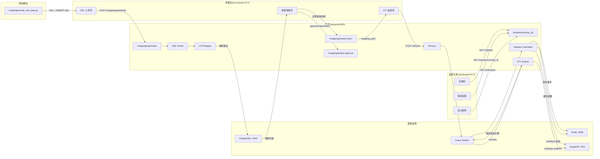
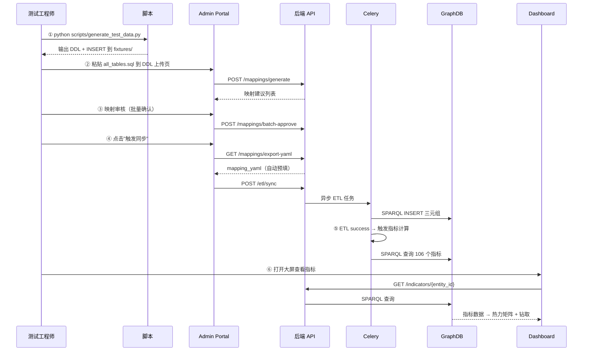

# 设计文档：端到端测试数据流水线

## 概述

本设计为央企穿透式资金监管平台（DRP）构建一条完整的端到端测试数据流水线，覆盖从 DDL 生成到监管大屏展示的全链路。核心目标是在无真实源系统接入的情况下，验证 106 个监管指标（7 大业务域）的完整数据通路。

流水线包含以下关键环节：

1. **DDL 与测试数据生成**：独立 Python 脚本，输出 7 大域的建表语句和 INSERT 数据
2. **DDL 上传与映射生成**：通过管理后台上传 DDL，调用 LLM 生成 CTIO 本体映射
3. **映射评审**：逐条/批量确认映射建议，支持拒绝原因持久化
4. **ETL 执行**：触发同步任务，将数据写入 GraphDB Named Graph
5. **指标计算**：ETL 成功后自动触发 106 个指标的 SPARQL 计算
6. **大屏展示**：热力矩阵、穿透钻取、诊断提示

### 设计决策

| 决策 | 选择 | 理由 |
|------|------|------|
| DDL 生成器形式 | 独立 Python 脚本 `scripts/generate_test_data.py` | 不依赖后端服务，可离线运行，CI 可集成 |
| mapping_yaml 导出 | 新增 `/mappings/export-yaml` API | 避免用户手动构造 YAML，ETL 触发表单可自动预填 |
| 批量审核 | 新增 `/mappings/batch-approve` API | 减少逐条操作的人工成本 |
| 指标计算触发 | ETL success → Celery task → `calculate_all_domains()` | 解耦 ETL 和指标计算，异步不阻塞 |
| 诊断提示 | 前端判断域内指标全为 0/NULL | 无需后端额外接口，前端已有数据 |
| LLM 调用安全 | DDL 脱敏 + 审计日志 + 私有化 LLM 配置 | 央企敏感数据不可直接发送外部 API [评审 #001] |
| 测试数据实体 ID | 统一加 `test_` 前缀 | 防止与生产数据冲突 [评审 #016] |
| Redis 风险事件频道 | 按租户隔离 `risk_events:{tenant_id}` | 防止跨租户数据泄露 [评审 #017] |

## 架构

### 数据流全景



### 端到端流水线步骤




## LLM 调用安全策略 [评审 #001]

### DDL 脱敏规则

在将 DDL 内容发送给外部 LLM API 之前，需要进行以下脱敏处理：

1. **表注释脱敏**：移除包含"受限"、"冻结"、"关联交易"等敏感业务关键词的注释内容，替换为通用描述
2. **列注释脱敏**：保留数据类型描述（如"账号"、"余额"），移除具体业务规则描述
3. **表名/列名保留**：表名和列名不脱敏（LLM 需要这些信息生成映射建议）

### 审计日志

每次 LLM 调用需记录审计日志：
- 调用时间、操作人、租户 ID
- 发送的表数量和字段数量（不记录完整 DDL 内容）
- LLM 响应的映射建议数量
- 调用耗时和状态（成功/失败）

### 私有化 LLM 配置

通过环境变量 `LLM_API_BASE` 支持切换到私有化部署的 LLM：
- 默认：`https://api.anthropic.com/v1`（外部 Claude API）
- 私有化：`http://internal-llm.corp.local/v1`（内网部署）
- 当 `LLM_API_BASE` 指向内网地址时，跳过 DDL 脱敏步骤

### DDL 注入防护 [评审 #005]

- 后端对 DDL 内容增加大小限制：最大 5MB（与前端一致）
- DDL 解析后的表名/列名白名单校验：仅允许 `[a-zA-Z0-9_]` 字符
- ETL 引擎中所有拼接到 SPARQL 的值必须经过 URI 编码转义

### SPARQL 注入防护 [评审 #006]

- `_inject_graph_context` 需补充嵌套子查询场景的单元测试
- 指标计算 SPARQL 中的变量绑定使用参数化查询（而非字符串拼接）
- `entity_id` 路径参数已有正则校验 `^[a-zA-Z0-9_-]+$`，防止注入

## 组件与接口

### 1. DDL 生成器（`scripts/generate_test_data.py`）

独立 Python 脚本，不依赖后端服务。使用标准库 + 少量依赖（Faker 可选）。

**输入**：无（内置表结构定义）
**输出**：
- `backend/tests/fixtures/ddl/01_bank_account.sql` ~ `07_sasoe_assessment.sql`（按域分文件）
- `backend/tests/fixtures/data/01_bank_account_data.sql` ~ `07_sasoe_assessment_data.sql`
- `backend/tests/fixtures/ddl/all_tables.sql`（合并 DDL + INSERT）

**内部结构**：

```python
# 表结构定义注册表
DOMAIN_TABLES: dict[str, list[TableDef]] = {
    "01_bank_account": [
        TableDef("direct_linked_account", columns=[...], comment="直联账户表"),
        TableDef("internal_deposit_account", columns=[...], comment="内部存款账户表"),
        TableDef("restricted_account", columns=[...], comment="受限账户表"),
    ],
    "02_fund_concentration": [...],
    # ... 7 个域
}

# 数据工厂：按分布生成测试数据
class TestDataFactory:
    def generate(self, table: TableDef, count: int, distribution: Distribution) -> list[dict]
    # distribution: normal(70%) / warning(20%) / redline(10%)

# 法人实体层级生成（ID 统一加 test_ 前缀防止与生产数据冲突 [评审 #016]）
ENTITY_HIERARCHY = [
    Entity("test_group_hq", level=0, name="国有资本运营集团"),
    Entity("test_region_east", level=1, parent="test_group_hq", name="华东大区"),
    Entity("test_region_north", level=1, parent="test_group_hq", name="华北大区"),
    Entity("test_sub_east_a", level=2, parent="test_region_east", name="华东子公司A"),
    Entity("test_sub_east_b", level=2, parent="test_region_east", name="华东子公司B"),
    Entity("test_sub_north_a", level=2, parent="test_region_north", name="华北子公司A"),
]
```

### 2. 新增后端 API 端点

#### 2.1 `GET /mappings/export-yaml` — 导出已审核映射 YAML

**路由**：`backend/src/drp/mapping/router.py`
**权限**：`mapping:read`
**响应**：

```json
{
  "mapping_yaml": "mappings:\n  - source_table: direct_linked_account\n    ..."
}
```

**逻辑**：查询当前租户所有 `status=approved` 的 MappingSpec，通过新增的 `yaml_generator.generate_mapping_yaml_from_specs(specs: list[MappingSpec]) -> str` 方法序列化为 YAML（直接从 ORM 对象序列化，无需转换为 MappingSuggestion） [评审 #003]。

#### 2.2 `POST /mappings/batch-approve` — 批量审核映射

**路由**：`backend/src/drp/mapping/router.py`
**权限**：`mapping:approve`
**请求体**：

```json
{
  "mode": "all" | "threshold",
  "threshold": 80.0,
  "max_count": 500
}
```

**响应**：

```json
{
  "approved_count": 15,
  "skipped_count": 5,
  "total_pending": 20
}
```

**逻辑**：
- `mode=all`：将所有 `status=pending` 的映射更新为 `approved`（受 `max_count` 限制）
- `mode=threshold`：将所有 `status=pending` 且 `confidence >= threshold` 的映射更新为 `approved`
- `max_count`：单次操作最大数量，默认 500，防止误操作 [评审 #004]
- 操作完成后写入审计日志：操作人、时间、模式、影响条数 [评审 #004]

#### 2.3 `PUT /mappings/{id}/reject` — 拒绝映射（增强）

**修改**：现有端点增加 `reason` 字段持久化。

**请求体**（新增 `RejectMappingRequest` Pydantic schema [评审 #013]）：

```json
{
  "reason": "字段语义不匹配，应映射到 ctio:cashPoolId"
}
```

**输入校验**：`reason` 字段最大长度 500 字符，自动过滤 HTML 标签防止存储型 XSS [评审 #010]

**模型变更**：`MappingSpec` 表新增 `reject_reason: Text | None` 列和 `data_type: String(100) | None` 列 [评审 #009]。

#### 2.4 `GET /indicators` — 指标列表（新增 + 增强） [评审 #002]

**新增路由**：`GET /indicators`（无路径参数），支持可选 `entity_id` 查询参数。
- 当 `entity_id` 为空时，返回全局指标（所有实体的聚合值）
- 当 `entity_id` 非空时，返回该实体关联的指标数据

**保留现有路由**：`GET /indicators/{entity_id}`（路径参数形式），保持向后兼容。

两个路由在 FastAPI 中不冲突（路径参数 vs 无参数）。

#### 2.5 ETL 成功后自动触发指标计算

**修改**：`backend/src/drp/etl/_task_runner.py`

在 ETL 任务成功完成后，自动调度 Celery 任务 `calculate_indicators_for_tenant_task` [评审 #007]：

```python
# _task_runner.py 中 run_full_sync / run_incremental_sync 成功后
from drp.indicators.tasks import calculate_indicators_for_tenant_task
calculate_indicators_for_tenant_task.delay(tenant_id)
```

### 3. 前端修改

#### 3.1 DDL 上传页增强（`frontend/src/pages/MappingPages.tsx`）

- 文件上传增加客户端校验：大小 ≤ 5MB、扩展名 `.sql/.ddl/.txt`
- 校验失败时显示 ErrorBox 提示

#### 3.2 映射审核页增强（`frontend/src/pages/MappingPages.tsx`）

- 新增"全部确认"按钮，调用 `POST /mappings/batch-approve { mode: "all" }`
- 新增"按阈值批量确认"按钮（默认 80%），调用 `POST /mappings/batch-approve { mode: "threshold", threshold: 80 }`
- 拒绝弹窗的 `reason` 字段传递到后端

#### 3.3 ETL 监控页增强（`frontend/src/pages/AdminPages.tsx`）

- 新增"触发同步"按钮，点击后：
  1. 调用 `GET /mappings/export-yaml` 获取 mapping_yaml
  2. 显示触发表单（租户选择、表名输入、mapping_yaml 预填且只读）
  3. 提交调用 `POST /etl/sync`
- ETL 成功后显示"指标已更新"提示 + "查看大屏"链接（`http://localhost:5174/`）
- 失败任务显示"重试"按钮和"查看详细日志"展开区域

#### 3.4 大屏诊断提示（`dashboard/src/components/IndicatorDrilldown.tsx`）

- 当某域所有指标 `currentValue` 均为 0 或 null 时，显示诊断提示：
  "该域暂无有效数据，请检查 ETL 任务状态和映射配置"

#### 3.5 大屏实体穿透（`dashboard/src/components/EntityTree.tsx`）

- 选中实体节点后，调用 `GET /indicators?entity_id={id}` 获取该实体关联指标
- 联动热力矩阵和钻取面板刷新

### 4. API 客户端扩展

#### 4.1 管理后台 `frontend/src/api/client.ts`

```typescript
export const mappingApi = {
  // ... 现有方法
  exportYaml: () => request<{ mapping_yaml: string }>('GET', '/mappings/export-yaml'),
  batchApprove: (mode: 'all' | 'threshold', threshold?: number) =>
    request<{ approved_count: number; total_pending: number }>(
      'POST', '/mappings/batch-approve', { mode, threshold }
    ),
};
```

#### 4.2 监管大屏 `dashboard/src/api/indicatorsApi.ts`

```typescript
export async function fetchIndicatorsByEntity(entityId: string): Promise<CtioIndicatorResponse[]> {
  return request<CtioIndicatorResponse[]>('GET', `/indicators?entity_id=${entityId}`);
}
```


## 数据模型

> 注：以下表结构仅列出关键字段。完整列定义（含数据类型、约束、COMMENT 注释）由实现阶段根据 `indicators/registry.py` 中 106 条指标的 SPARQL 查询反推确定，确保每个指标所需的原始数据列都有对应的表字段 [评审 #014]。

### 1. DDL 表结构（7 大域 20+ 张表）

#### 银行账户域（001-031）

| 表名 | 说明 | 关键字段 |
|------|------|----------|
| `direct_linked_account` | 直联账户表 | id, entity_id, bank_code, acct_no, balance, currency, is_active, ukey_status, created_at |
| `internal_deposit_account` | 内部存款账户表 | id, entity_id, pool_id, balance, interest_rate, maturity_date |
| `restricted_account` | 受限账户表 | id, entity_id, acct_no, restriction_type, status_6311, frozen_amount |

#### 资金集中域（032-041）

| 表名 | 说明 | 关键字段 |
|------|------|----------|
| `cash_pool` | 资金池表 | id, entity_id, pool_name, total_balance, concentration_rate |
| `collection_record` | 归集记录表 | id, pool_id, source_acct, amount, collection_date, status |

#### 结算域（042-068）

| 表名 | 说明 | 关键字段 |
|------|------|----------|
| `settlement_record` | 结算记录表 | id, entity_id, channel, amount, currency, status, settled_at |
| `payment_channel` | 支付渠道表 | id, channel_name, channel_type, is_direct_linked, daily_limit |

#### 票据域（069-078）

| 表名 | 说明 | 关键字段 |
|------|------|----------|
| `bill` | 票据表 | id, entity_id, bill_type, face_value, issue_date, maturity_date, status |
| `endorsement_chain` | 背书链表 | id, bill_id, endorser_id, endorsee_id, endorse_date, sequence_no |

#### 债务融资域（079-085）

| 表名 | 说明 | 关键字段 |
|------|------|----------|
| `loan` | 贷款表 | id, entity_id, bank_code, principal, interest_rate, start_date, end_date, status |
| `bond` | 债券表 | id, entity_id, bond_code, face_value, coupon_rate, maturity_date, status |
| `finance_lease` | 融资租赁表 | id, entity_id, lessor, lease_amount, monthly_payment, start_date, end_date |

#### 决策风险域（086-097）

| 表名 | 说明 | 关键字段 |
|------|------|----------|
| `credit_line` | 授信表 | id, entity_id, bank_code, credit_limit, used_amount, expire_date |
| `guarantee` | 担保表 | id, guarantor_id, beneficiary_id, amount, guarantee_type, start_date, end_date |
| `related_transaction` | 关联交易表 | id, entity_a_id, entity_b_id, amount, transaction_type, transaction_date |
| `derivative` | 衍生品表 | id, entity_id, instrument_type, notional_amount, market_value, maturity_date |

#### 国资委考核域（098-106）

| 表名 | 说明 | 关键字段 |
|------|------|----------|
| `financial_report` | 财务报表表 | id, entity_id, report_type, period, total_asset, net_asset, revenue, profit |
| `assessment_indicator` | 考核指标表 | id, entity_id, indicator_code, indicator_name, target_value, actual_value, period |

### 2. 测试数据分布

```
数据分布策略：
├── 正常值（70%）：指标达标，值在目标值附近
├── 预警值（20%）：接近阈值但未超过红线
└── 红线值（10%）：超过红线，触发告警

法人实体层级（ID 统一加 test_ 前缀 [评审 #016]）：
├── 集团（test_group_hq）
│   ├── 华东大区（test_region_east）
│   │   ├── 华东子公司A（test_sub_east_a）
│   │   └── 华东子公司B（test_sub_east_b）
│   └── 华北大区（test_region_north）
│       └── 华北子公司A（test_sub_north_a）
```

每条测试数据通过 `entity_id` 关联到法人实体，确保穿透钻取可按实体过滤。

### 3. MappingSpec 模型变更

```python
# 新增字段
reject_reason: Mapped[str | None] = mapped_column(Text, nullable=True)
data_type: Mapped[str | None] = mapped_column(String(100), nullable=True)  # [评审 #009]
```

**Alembic 迁移策略** [评审 #011]：
- 迁移方式：`ALTER TABLE mapping_spec ADD COLUMN reject_reason TEXT NULL; ALTER TABLE mapping_spec ADD COLUMN data_type VARCHAR(100) NULL;`
- 新增 nullable 列不需要停机，不影响旧代码
- 部署顺序：先执行 Alembic 迁移，再部署新代码
- 回滚策略：`ALTER TABLE mapping_spec DROP COLUMN reject_reason; ALTER TABLE mapping_spec DROP COLUMN data_type;`

### 4. Mapping YAML 格式

```yaml
mappings:
  - source_table: direct_linked_account
    source_field: acct_no
    data_type: VARCHAR(50)
    target_property: ctio:accountNumber
    transform_rule: ""
    confidence: 92.5
    auto_approved: true
  - source_table: direct_linked_account
    source_field: balance
    data_type: DECIMAL(18,2)
    target_property: ctio:balance
    transform_rule: ""
    confidence: 88.0
    auto_approved: true
```


## 正确性属性

*属性（Property）是在系统所有有效执行中都应成立的特征或行为——本质上是对系统应做什么的形式化陈述。属性是人类可读规范与机器可验证正确性保证之间的桥梁。*

### Property 1: DDL 解析往返一致性

*For any* DDL_Generator 生成的 DDL 文件，经 DDL_Parser 解析后，应返回与生成时一致的表名列表；对每张表的每个列，解析结果的列名、数据类型（忽略大小写和空格差异）和注释应与 DDL 中的定义一致。

**Validates: Requirements 1.10, 3.3, 7.1, 7.2, 7.3, 7.4**

### Property 2: 生成器 INSERT 与 DDL 列一致性

*For any* DDL_Generator 生成的表，其 INSERT 语句中的列名集合应与对应 CREATE TABLE 语句中的列名集合完全一致（顺序可不同），且 INSERT 值的数量应等于列数。

**Validates: Requirements 2.9**

### Property 3: 生成表 COMMENT 完整性

*For any* DDL_Generator 生成的表，该表应包含表级 COMMENT 注释；对该表的每个列，应包含列级 COMMENT 注释（注释内容非空）。

**Validates: Requirements 1.9**

### Property 4: export-yaml 仅包含已审核通过映射

*For any* 租户的映射记录集合（包含 approved、rejected、pending 状态的混合），调用 `/mappings/export-yaml` 返回的 YAML 中应包含且仅包含 `status=approved` 的映射条目，且每条映射的 `source_table`、`source_field`、`target_property` 应与数据库记录一致。

**Validates: Requirements 0.3**

### Property 5: 拒绝原因持久化往返

*For any* 待审核映射和任意非空拒绝原因字符串，调用 reject 接口后查询该映射记录，`reject_reason` 字段应与提交的原因字符串完全一致，且 `status` 应为 `rejected`。

**Validates: Requirements 4.5**

### Property 6: 批量确认按阈值正确过滤

*For any* 包含不同置信度的待审核映射集合和任意阈值 T（0 ≤ T ≤ 100），调用 `batch-approve(threshold=T)` 后：所有 `confidence >= T` 且原状态为 `pending` 的映射应变为 `approved`；所有 `confidence < T` 的映射状态应保持不变；所有非 `pending` 状态的映射不受影响。

**Validates: Requirements 4.8, 4.9**

### Property 7: 指标达标判断正确性

*For any* 指标定义（含 target_value、threshold）和任意指标值 value：
- 若 target_value > 0（比率类指标），则 value >= threshold 时应判定为达标
- 若 target_value == 0（计数类指标），则 value <= threshold 时应判定为达标
- 若 value 为 None，应判定为不达标

**Validates: Requirements 6.4**

### Property 8: 合规率颜色编码正确性

*For any* 合规率值 rate（0 ≤ rate ≤ 100），`complianceColor(rate)` 应返回：
- rate ≥ 98 → 青绿色 `rgba(0,255,179,0.9)`
- 95 ≤ rate < 98 → 青色 `rgba(34,211,238,0.9)`
- 90 ≤ rate < 95 → 橙色 `rgba(255,170,0,0.9)`
- rate < 90 → 红色 `rgba(255,32,32,0.9)`

**Validates: Requirements 6.6**

### Property 9: 域诊断提示显示逻辑

*For any* 域的指标数据集合，当且仅当该域所有指标的 `currentValue` 均为 0 或 null 时，应显示诊断提示"该域暂无有效数据，请检查 ETL 任务状态和映射配置"；否则不显示。

**Validates: Requirements 6.10**


## 错误处理

### 后端错误处理

| 场景 | HTTP 状态码 | 错误信息 | 处理方式 |
|------|------------|----------|----------|
| DDL 解析失败（无有效表） | 422 | "DDL 解析失败，未找到有效表定义" | 返回描述性错误，前端显示 ErrorBox |
| 映射不存在（approve/reject） | 404 | "映射不存在" | 前端显示错误提示并刷新列表 |
| 无已审核映射（export-yaml） | 404 | "无已审核通过的映射记录" | 前端提示用户先完成映射审核 |
| Celery Worker 不可用 | 202（任务已创建） | 任务标记为 failed，error="Celery 不可用" | 前端显示失败状态和重试按钮 |
| ETL 执行失败 | — | 任务标记为 failed，记录错误堆栈 | 前端显示错误信息、重试按钮、详细日志 |
| GraphDB 连接失败 | 500 | "数据查询失败，请稍后重试" | 指标计算跳过失败项，记录日志 |
| 文件上传超过 5MB | — | 客户端校验拒绝 | 前端显示"文件大小不能超过 5MB" |
| 文件扩展名不合法 | — | 客户端校验拒绝 | 前端显示"仅支持 .sql/.ddl/.txt 文件" |

### ETL 重试策略

- Celery 任务配置 `max_retries=3`，`default_retry_delay=60s`
- ETL Engine 内部使用 tenacity 指数退避：`wait_exponential(multiplier=2, min=4, max=60)`
- 前端"重试"按钮传递原始 `job_id`，后端根据 `job_id` 查找原始参数（tenant_id、table、mapping_yaml）重新执行，避免生成新 run_id 导致数据重复写入 [评审 #012]
- ETL 全量同步写入前，先清除该表在 Named Graph 中的旧三元组（`DELETE WHERE { GRAPH <urn:tenant:xxx> { ?s a <table_type> . ?s ?p ?o } }`），确保幂等性 [评审 #012]

### 指标计算容错

- 单条指标 SPARQL 执行失败不影响其他指标计算
- 失败的指标 value 记为 None，is_compliant 记为 False
- GraphDB 写回失败仅记录日志，不中断流程
- Redis 缓存写入失败仅记录日志，不中断流程
- 风险事件通过按租户隔离的 Redis Pub/Sub 频道 `risk_events:{tenant_id}` 发布，防止跨租户数据泄露 [评审 #017]

## 测试策略

### 属性测试（Property-Based Testing）

使用 **Hypothesis**（Python）和 **fast-check**（TypeScript）进行属性测试。

**Python 端（后端）**：
- 库：`hypothesis`（需添加到 `pyproject.toml` 的 dev 依赖 [评审 #015]）
- 每个属性测试最少 100 次迭代
- 标签格式：`# Feature: e2e-test-data-pipeline, Property N: {property_text}`

| Property | 测试文件 | 测试内容 |
|----------|----------|----------|
| Property 1 | `backend/tests/test_ddl_roundtrip.py` | DDL 生成 → 解析往返一致性 |
| Property 2 | `backend/tests/test_ddl_roundtrip.py` | INSERT 列名与 DDL 列定义一致 |
| Property 3 | `backend/tests/test_ddl_roundtrip.py` | 所有表和列都有 COMMENT |
| Property 4 | `backend/tests/test_mapping_export.py` | export-yaml 仅含 approved 映射 |
| Property 5 | `backend/tests/test_mapping_reject.py` | 拒绝原因持久化往返 |
| Property 6 | `backend/tests/test_mapping_batch.py` | 批量确认按阈值过滤 |
| Property 7 | `backend/tests/test_indicator_compliance.py` | 达标判断逻辑 |

**TypeScript 端（前端）**：
- 库：`fast-check`
- 每个属性测试最少 100 次迭代

| Property | 测试文件 | 测试内容 |
|----------|----------|----------|
| Property 8 | `dashboard/src/components/__tests__/DomainHeatmap.test.ts` | 合规率颜色编码 |
| Property 9 | `dashboard/src/components/__tests__/IndicatorDrilldown.test.ts` | 诊断提示显示逻辑 |

### 单元测试

| 模块 | 测试文件 | 覆盖内容 |
|------|----------|----------|
| DDL 生成器 | `backend/tests/test_generate_test_data.py` | 7 域表结构完整性、数据量、分布、实体层级 |
| 映射 API | `backend/tests/test_mapping_api.py` | export-yaml、batch-approve、reject with reason |
| ETL 触发 | `backend/tests/test_etl_trigger.py` | 触发表单、自动预填、重试 |
| 指标计算 | `backend/tests/test_indicators.py` | 自动触发、分域计算、Redis 缓存 |
| 前端文件校验 | `frontend/src/pages/__tests__/DdlUpload.test.tsx` | 5MB 限制、扩展名校验 |
| 前端批量操作 | `frontend/src/pages/__tests__/MappingBatch.test.tsx` | 全部确认、按阈值确认 |
| 大屏诊断 | `dashboard/src/components/__tests__/Diagnostic.test.tsx` | 全 0 诊断提示 |

### 集成测试

| 场景 | 测试内容 |
|------|----------|
| DDL → 映射 → ETL 全链路 | 上传 DDL → 生成映射 → 批量确认 → 触发 ETL → 验证 GraphDB 写入 |
| ETL → 指标计算链 | ETL 成功 → 自动触发指标计算 → 验证 Redis 缓存和风险事件 |
| 实体穿透钻取 | 选择实体 → 调用 /indicators?entity_id → 验证返回该实体关联指标 |

### 冒烟测试

| 用例 | 前置条件 | 操作步骤 | 预期结果 |
|------|----------|----------|----------|
| 生成测试数据 | Python 3.11+ 已安装 | 运行 `python scripts/generate_test_data.py` | `backend/tests/fixtures/ddl/` 下生成 7 个域文件 + `all_tables.sql` |
| DDL 上传生成映射 | 后端服务运行中 | 粘贴 `all_tables.sql` 内容 → 点击"生成映射建议" | 映射列表显示，包含置信度颜色标记 |
| 批量确认映射 | 有待审核映射 | 点击"全部确认" | 所有映射变为 approved |
| 触发 ETL | 映射已审核、Celery 运行中 | 点击"触发同步" → 表单自动预填 → 提交 | ETL 任务创建，状态从 pending → running → success |
| 查看大屏指标 | ETL 已成功、指标已计算 | 打开 `http://localhost:5174/` | 热力矩阵显示 7 域合规率，点击可钻取 |

