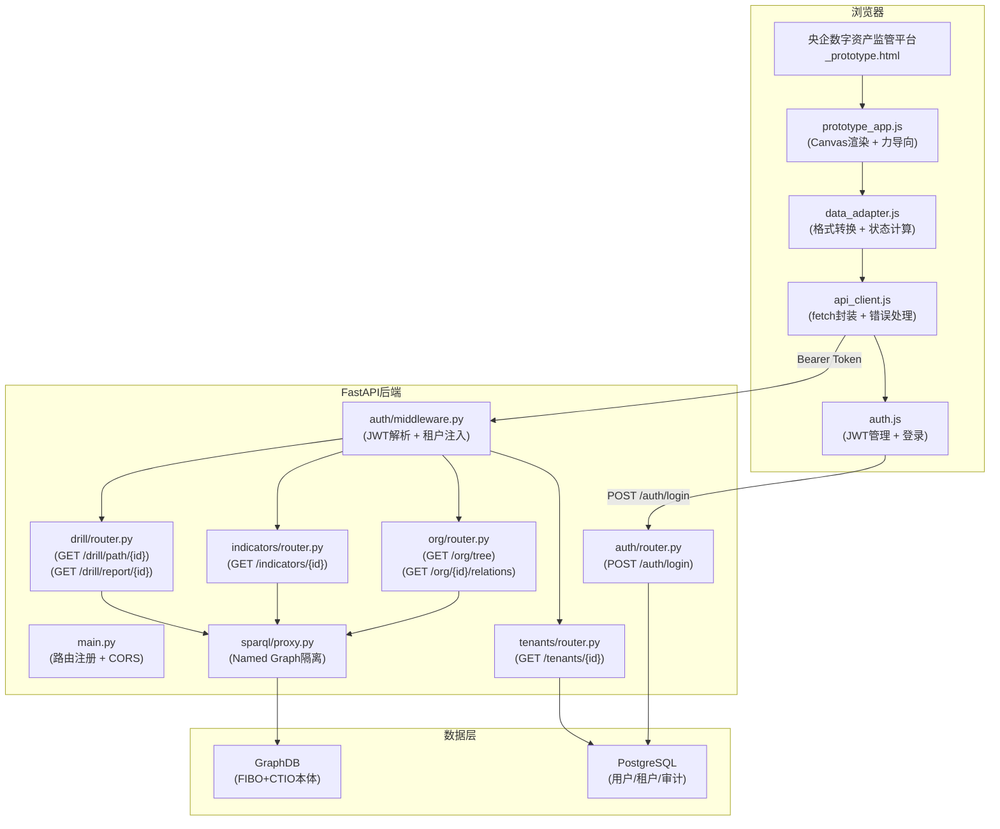
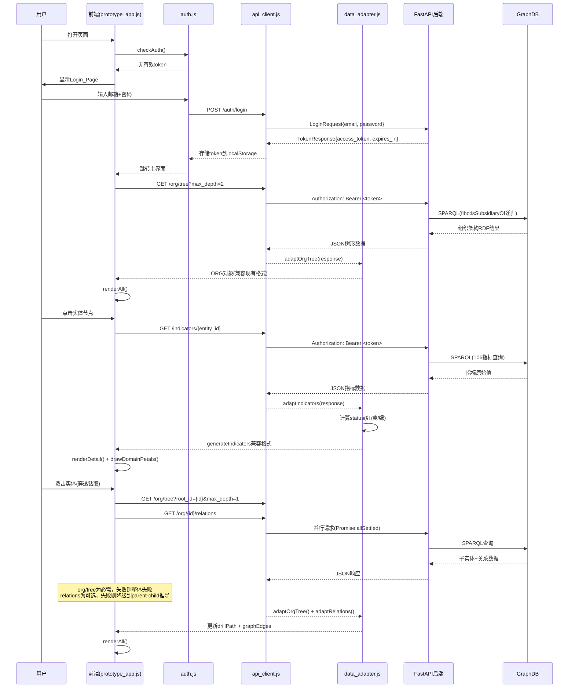

# 技术设计文档：前后端集成 — 穿透式资金监管平台

## 概述

本设计将前端原型（`央企数字资产监管平台_prototype.html` + `prototype_app.js`）中的硬编码模拟数据替换为后端 FastAPI 服务提供的真实数据。核心思路是**最小化前端渲染层改动**：新增 API 客户端层、Auth 模块、DataAdapter 适配层，将后端 SPARQL 查询结果转换为前端现有数据结构，保留力导向图谱、七瓣花绘制、KPI 栏等全部 Canvas 渲染逻辑不变。

后端侧新增 3 个 API 端点（`/org/tree`、`/indicators/{entity_id}`、`/org/{entity_id}/relations`），复用现有 `SPARQL_Proxy` 租户隔离机制和 `get_current_user` JWT 鉴权依赖。

### 设计决策与理由

| 决策 | 理由 |
|------|------|
| 前端使用原生 `fetch` API | 需求约束，不引入框架；浏览器兼容性足够。**注：当前为原型集成阶段，最小化改动；后续产品化阶段将迁移到 Vue 3 + TypeScript + Axios 技术栈（参见 tech-stack.md）** |
| 新增 `api_client.js` / `auth.js` / `data_adapter.js` 三个独立模块 | 职责分离，便于测试和维护 |
| 指标状态（红/黄/绿）由前端计算 | 需求约束（需求 4.2），后端只返回 `value`/`threshold`/`direction` |
| 后端 `/org/tree` 支持 `max_depth` 分层加载 | 避免一次性加载全部层级导致 SPARQL 查询超时 |
| 前端指标缓存 5 分钟 | 减少重复请求，平衡实时性与性能 |
| DataAdapter 对缺失字段提供默认值 | 保证前端渲染函数不因后端数据不完整而崩溃 |
| API 响应格式使用裸数据（不包装 `{code, message, data}`） | 与现有 drill API 保持一致；后续产品化阶段统一包装格式 |
| 当前阶段不引入 API 版本前缀（`/api/v1/`） | 原型集成阶段端点数量少且变动频繁，版本管理收益低；产品化阶段引入 |
| 前端 JWT payload 解析仅用于 UI 展示 | 前端 base64 解码不验证签名，所有安全决策（权限、租户隔离）由后端 JWT 签名验证保证 |

## 架构

### 系统架构图



### 请求流程时序图




## 组件与接口

### 前端组件

#### 1. `auth.js` — JWT 认证模块

```javascript
// 公开接口
const Auth = {
  TOKEN_KEY: 'drp_access_token',
  TENANT_KEY: 'drp_tenant_id',

  /** 检查是否有有效token，无则显示登录页 */
  checkAuth(): boolean,

  /** 调用 POST /auth/login，成功后存储token */
  async login(email: string, password: string): Promise<void>,

  /** 清除token，重定向到登录页 */
  logout(): void,

  /** 从localStorage获取当前token */
  getToken(): string | null,

  /** 从JWT payload解析tenant_id */
  getTenantId(): string | null,

  /** 检查token是否过期（解析exp字段） */
  isTokenExpired(): boolean,
};
```

职责：
- 管理 `localStorage` 中的 `access_token`
- 解析 JWT payload 提取 `tenant_id`、`exp`
- 控制登录页/主界面的显示切换
- 提供 `getToken()` 供 `api_client.js` 注入 Authorization 头

安全说明：
- **XSS 防护**：前端所有动态渲染内容使用 `textContent` 而非 `innerHTML`（已有的 `innerHTML` 赋值仅用于静态模板拼接，不包含用户输入）。后续产品化阶段考虑迁移到 HttpOnly Cookie + CSRF Token 方案，彻底消除 localStorage token 被 XSS 窃取的风险。
- **JWT 解析仅用于 UI 展示**：前端 base64 解码不验证签名，所有安全决策由后端保证。

#### 2. `api_client.js` — API 客户端

```javascript
// 公开接口
const ApiClient = {
  BASE_URL: 'http://localhost:8000',
  TIMEOUT: 15000,

  /** 通用请求方法，自动注入Bearer token */
  async request(method, path, options?): Promise<any>,

  /** GET 快捷方法 */
  async get(path, params?): Promise<any>,

  /** POST 快捷方法 */
  async post(path, body): Promise<any>,

  /** 文件下载（返回Blob） */
  async download(path): Promise<Blob>,
};
```

职责：
- 封装 `fetch` API，统一添加 `Authorization: Bearer <token>` 头
- 处理 HTTP 401 → 调用 `Auth.logout()` 重定向
- 处理 HTTP 4xx/5xx → 返回 `{status, detail, url}` 结构化错误
- 处理网络超时/不可达 → 返回 `{status: "network_error", detail, url}`
- 使用 `AbortController` 实现 15 秒超时

错误对象结构：
```javascript
{
  status: number | "network_error",  // HTTP状态码或网络错误标识
  detail: string,                     // 错误描述
  url: string                         // 请求URL
}
```

#### 3. `data_adapter.js` — 数据格式适配层

```javascript
const DataAdapter = {
  /**
   * 后端组织架构 → 前端ORG树
   * 补充缺失字段默认值，递归处理children
   */
  adaptOrgTree(backendData): OrgNode,

  /**
   * 后端指标数据 → generateIndicators()兼容格式
   * 按7大领域分组，计算status(红/黄/绿)
   */
  adaptIndicators(backendIndicators, domainsDef): IndicatorsByDomain,

  /**
   * 后端关系数据 → graphEdges数组
   * 映射type到REL_TYPES键名
   */
  adaptRelations(backendRelations): GraphEdge[],

  /**
   * 后端穿透路径 → 高亮节点ID列表
   * 从node_iri提取最后一段作为前端ID
   */
  adaptDrillPath(backendPath): PathStep[],

  /**
   * 计算单个指标的红黄绿状态
   * 复用现有阈值逻辑：
   *   direction='up': 红:<threshold, 黄:threshold~threshold*1.1, 绿:>threshold*1.1
   *   direction='down': 红:>threshold, 黄:threshold*0.9~threshold, 绿:<threshold*0.9
   *   direction='mid': 红:超出区间, 黄:接近边界, 绿:区间内
   */
  computeStatus(value, threshold, direction): 'danger' | 'warn' | 'normal',
};
```

职责：
- 将后端 API 响应转换为前端现有渲染函数期望的数据结构
- 对缺失字段提供合理默认值（`risk` → `'lo'`，`compliance` → `0`，`children` → `[]`）
- 实现指标状态计算逻辑（从 `prototype_app.js` 中 `generateIndicators` 提取）

#### 4. `prototype_app.js` 改动点

改动原则：**最小化修改**，仅替换数据源，保留全部渲染逻辑。

| 改动位置 | 改动内容 |
|----------|----------|
| 文件顶部 | 引入 `auth.js`、`api_client.js`、`data_adapter.js` |
| `window.onload` | 先调用 `Auth.checkAuth()`，通过后再 `renderAll()` |
| `ORG` 变量 | 从硬编码改为 `null`，由 `loadOrgTree()` 异步赋值 |
| `generateIndicators()` | 优先从缓存/后端获取，回退到本地计算 |
| `buildGraphData()` | 关系数据从后端获取，回退到 parent-child 推导 |
| `drillInto()` | 改为异步，调用后端获取子实体 |
| `doAct('风险报告')` | 调用 `GET /drill/report/{indicator_id}` 下载 |
| 新增 `loadOrgTree()` | 异步加载组织架构 |
| 新增 `loadIndicators()` | 异步加载指标数据（带5分钟缓存） |
| 新增 `loadRelations()` | 异步加载关系数据 |
| 新增 `showLoading()` / `hideLoading()` | 加载状态管理 |

### 后端组件

#### 5. `org/router.py` — 组织架构 API（新增）

```python
router = APIRouter(prefix="/org", tags=["组织架构"])

@router.get("/tree")
async def get_org_tree(
    max_depth: int = Query(default=2, ge=1, le=6),
    root_id: str | None = Query(default=None, pattern=r'^[a-zA-Z0-9_-]+$'),
    current_user: TokenPayload = Depends(get_current_user),
) -> dict:
    """返回组织架构树，支持分层加载。

    - max_depth: 从根节点向下展开的最大层数（默认2）
    - root_id: 指定子树根节点ID（用于穿透钻取），为空则从集团根节点开始
    - 安全约束：root_id 仅允许字母数字下划线和连字符，防止 SPARQL 注入
    - 性能约束：SPARQL 查询超时 30 秒，结果集上限 1000 条
    """
```

SPARQL 查询策略：
```sparql
PREFIX ctio: <urn:ctio:>
PREFIX fibo: <https://spec.edmcouncil.org/fibo/ontology/BE/LegalEntities/LegalPersons/>

SELECT ?entity ?name ?level ?type ?city ?parent
       ?cash ?debt ?asset ?guarantee ?compliance ?risk ?hasChildren
WHERE {
  ?entity a fibo:LegalEntity .
  ?entity ctio:entityName ?name .
  ?entity ctio:orgLevel ?level .
  OPTIONAL { ?entity ctio:entityType ?type . }
  OPTIONAL { ?entity ctio:city ?city . }
  OPTIONAL { ?entity ctio:isSubsidiaryOf ?parent . }
  OPTIONAL { ?entity ctio:cashBalance ?cash . }
  OPTIONAL { ?entity ctio:totalDebt ?debt . }
  OPTIONAL { ?entity ctio:totalAsset ?asset . }
  OPTIONAL { ?entity ctio:guaranteeBalance ?guarantee . }
  OPTIONAL { ?entity ctio:complianceScore ?compliance . }
  OPTIONAL { ?entity ctio:riskLevel ?risk . }
  BIND(EXISTS { ?child ctio:isSubsidiaryOf ?entity } AS ?hasChildren)
  FILTER(?level <= {max_depth})
}
```

响应格式：
```json
{
  "id": "group",
  "name": "中央企业集团",
  "level": 0,
  "type": "集团",
  "city": "北京",
  "cash": 4868000,
  "debt": 3421000,
  "asset": 18624000,
  "guarantee": 1286000,
  "compliance": 92.4,
  "risk": "lo",
  "has_children": true,
  "children": [
    {
      "id": "east_group",
      "name": "华东子集团",
      "level": 1,
      "has_children": true,
      "children": []
    }
  ]
}
```

#### 6. `indicators/router.py` — 实体指标 API（新增端点）

```python
@router.get("/indicators/{entity_id}")
async def get_entity_indicators(
    entity_id: str = Path(pattern=r'^[a-zA-Z0-9_-]+$'),
    current_user: TokenPayload = Depends(get_current_user),
) -> list[dict]:
    """返回指定实体在7大领域下所有指标的计算值。

    指标值通过 SPARQL 查询实体关联的 RegulatoryIndicator 获取。
    不返回 status 字段，由前端根据 threshold + direction 计算。
    安全约束：entity_id 仅允许字母数字下划线和连字符，防止 SPARQL 注入。
    性能约束：SPARQL 查询超时 30 秒，结果集上限 1000 条。
    """
```

SPARQL 查询策略：
```sparql
PREFIX ctio: <urn:ctio:>
SELECT ?indicatorId ?name ?domain ?unit ?value ?thresholdLow ?thresholdHigh ?direction
WHERE {
  ?ind a ctio:RegulatoryIndicator ;
       ctio:indicatorId ?indicatorId ;
       ctio:indicatorName ?name ;
       ctio:domain ?domain ;
       ctio:currentValue ?value .
  ?ind ctio:affectsEntity <urn:entity:{entity_id}> .
  OPTIONAL { ?ind ctio:unit ?unit . }
  OPTIONAL { ?ind ctio:thresholdLow ?thresholdLow . }
  OPTIONAL { ?ind ctio:thresholdHigh ?thresholdHigh . }
  OPTIONAL { ?ind ctio:direction ?direction . }
}
```

响应格式：
```json
[
  {
    "id": "f01",
    "name": "资金归集率",
    "domain": "fund",
    "unit": "%",
    "value": 87.5,
    "threshold": [85, 95],
    "direction": "up"
  }
]
```

#### 7. `org/router.py` — 实体关系 API（新增端点）

```python
@router.get("/org/{entity_id}/relations")
async def get_entity_relations(
    entity_id: str = Path(pattern=r'^[a-zA-Z0-9_-]+$'),
    current_user: TokenPayload = Depends(get_current_user),
) -> list[dict]:
    """返回指定实体与其同级实体之间的关系列表。

    安全约束：entity_id 仅允许字母数字下划线和连字符，防止 SPARQL 注入。
    性能约束：SPARQL 查询超时 30 秒，结果集上限 1000 条。
    """
```

SPARQL 查询策略：
```sparql
PREFIX ctio: <urn:ctio:>
SELECT ?source ?target ?relType
WHERE {
  {
    <urn:entity:{entity_id}> ctio:isSubsidiaryOf ?parent .
    ?sibling ctio:isSubsidiaryOf ?parent .
    ?source ?rel ?target .
    FILTER(?source = ?sibling || ?target = ?sibling)
    BIND(
      IF(?rel = ctio:hasSubsidiary, "hasSubsidiary",
      IF(?rel = ctio:fundFlowTo, "fundFlow",
      IF(?rel = ctio:guarantees, "guarantee",
      IF(?rel = ctio:borrowsFrom, "borrowing",
      IF(?rel = ctio:fxExposureTo, "fxExposure", "unknown"))))) AS ?relType
    )
  }
}
```

响应格式：
```json
[
  {"source": "east_group", "target": "group", "type": "hasSubsidiary"},
  {"source": "east_group", "target": "group", "type": "fundFlow"},
  {"source": "group", "target": "east_group", "type": "guarantee"}
]
```

### 接口汇总

| 端点 | 方法 | 状态 | 认证 | 描述 |
|------|------|------|------|------|
| `/auth/login` | POST | 已有 | 无 | 登录获取JWT |
| `/org/tree` | GET | **新增** | Bearer | 组织架构树 |
| `/indicators/{entity_id}` | GET | **新增** | Bearer | 实体指标数据 |
| `/org/{entity_id}/relations` | GET | **新增** | Bearer | 实体关系数据 |
| `/drill/path/{indicator_id}` | GET | 已有 | Bearer | 穿透路径查询 |
| `/drill/report/{indicator_id}` | GET | 已有 | Bearer | 溯源报告下载 |
| `/tenants/{tenant_id}` | GET | 已有 | Bearer | 租户详情 |


## 数据模型

### 前端数据结构

#### OrgNode（组织架构节点）

```javascript
// 与现有 ORG 对象结构完全一致
{
  id: string,           // 实体唯一标识（如 "east_group"）
  name: string,         // 实体名称（如 "华东子集团"）
  level: number,        // 层级（0=集团, 1=二级, 2=三级...）
  type: string,         // 类型（"集团"/"二级子集团"/"三级子公司"等）
  city: string,         // 所在城市
  cash: number,         // 现金余额（万元）
  debt: number,         // 负债总额（万元）
  asset: number,        // 资产总额（万元）
  guarantee: number,    // 担保余额（万元）
  compliance: number,   // 合规评分（0-100）
  risk: 'hi'|'md'|'lo', // 风险等级
  has_children: boolean, // 是否有子节点（后端标志）
  children: OrgNode[],  // 子节点数组
  _indicators: object|null // 指标缓存（前端运行时）
}
```

#### IndicatorsByDomain（指标数据，按领域分组）

```javascript
// 与 generateIndicators() 返回值一致
{
  fund: {
    score: number,        // 领域评分（0-100）
    alertCount: number,   // 告警数量
    indicators: [{
      id: string,         // 指标ID（如 "f01"）
      name: string,       // 指标名称
      unit: string,       // 单位（"%"/"亿"/"天"等）
      value: number|string, // 指标值
      status: 'danger'|'warn'|'normal', // 前端计算
      threshold: [number|null, number|null], // [下限, 上限]
      direction: 'up'|'down'|'mid'  // 方向
    }]
  },
  debt: { ... },
  guarantee: { ... },
  invest: { ... },
  derivative: { ... },
  finbiz: { ... },
  overseas: { ... }
}
```

#### GraphEdge（图谱边）

```javascript
{
  source: string,  // 源节点ID
  target: string,  // 目标节点ID
  type: 'hasSubsidiary'|'fundFlow'|'guarantee'|'borrowing'|'fxExposure'
}
```

#### 指标缓存结构

```javascript
// 内存缓存，以 entity_id 为键
const indicatorCache = {
  [entity_id]: {
    data: IndicatorsByDomain,  // 适配后的指标数据
    timestamp: number          // 缓存时间戳（Date.now()）
  }
};
const CACHE_TTL = 5 * 60 * 1000; // 5分钟
```

### 后端数据模型

#### OrgTreeResponse（Pydantic）

```python
class OrgNodeResponse(BaseModel):
    id: str
    name: str
    level: int
    type: str = "未知"
    city: str = ""
    cash: float = 0
    debt: float = 0
    asset: float = 0
    guarantee: float = 0
    compliance: float = 0
    risk: str = "lo"
    has_children: bool = False
    children: list["OrgNodeResponse"] = []
```

#### IndicatorResponse

```python
class IndicatorResponse(BaseModel):
    id: str
    name: str
    domain: str
    unit: str = ""
    value: float | str | None = None
    threshold: list[float | None] = [None, None]
    direction: str = "up"
```

#### RelationResponse

```python
class RelationResponse(BaseModel):
    source: str
    target: str
    type: str  # hasSubsidiary | fundFlow | guarantee | borrowing | fxExposure
```

### 前后端领域映射

后端 `indicators/registry.py` 中的7个业务域与前端 `DOMAINS` 数组的映射关系：

| 后端 domain | 前端 domain id | 前端 domain name |
|-------------|---------------|-----------------|
| 银行账户 + 资金集中 | fund | 资金管理 |
| 债务融资 | debt | 债务管理 |
| （担保相关指标） | guarantee | 担保管理 |
| （投资相关指标） | invest | 投资管理 |
| （衍生品相关指标） | derivative | 金融衍生品 |
| 结算 + 票据 + 决策风险 | finbiz | 金融业务 |
| 国资委考核 | overseas | 境外资金 |

> 注：后端 `registry.py` 中的106指标按银行账户/资金集中/结算/票据/债务融资/决策风险/国资委考核7个域分类，与前端的7大监管领域（资金管理/债务管理/担保管理/投资管理/金融衍生品/金融业务/境外资金）不完全对应。`DataAdapter.adaptIndicators()` 负责此映射转换，后端 `/indicators/{entity_id}` API 返回的 `domain` 字段使用前端领域 ID（`fund`/`debt`/`guarantee`/`invest`/`derivative`/`finbiz`/`overseas`），由后端路由层完成域名映射。
>
> **待实现阶段对齐**：上表中标注括号的3行（担保/投资/衍生品）需在实现阶段与后端 `registry.py` 实际域名对齐，确定精确的映射关系。


## 正确性属性（Correctness Properties）

*属性（Property）是在系统所有有效执行中都应保持为真的特征或行为——本质上是对系统应做什么的形式化陈述。属性是人类可读规格说明与机器可验证正确性保证之间的桥梁。*

### Property 1: Bearer Token 注入一致性

*对任意* API 请求路径和任意有效的 JWT token 字符串，`ApiClient.request()` 发出的 HTTP 请求头中 SHALL 始终包含 `Authorization: Bearer <token>`，且 token 值与 `Auth.getToken()` 返回值完全一致。

**Validates: Requirements 1.2, 9.2**

### Property 2: 结构化错误对象完整性

*对任意* HTTP 4xx 或 5xx 状态码（400-599 范围内）和任意错误消息字符串，`ApiClient.request()` 返回的错误对象 SHALL 包含 `status`（等于 HTTP 状态码）、`detail`（非空字符串）、`url`（请求 URL）三个字段。

**Validates: Requirements 1.4**

### Property 3: JWT Payload 解析正确性

*对任意* 包含 `tenant_id` 和 `exp` 字段的 JWT payload，`Auth.getTenantId()` SHALL 返回与 payload 中 `tenant_id` 完全一致的值，且 `Auth.isTokenExpired()` SHALL 在 `exp` 小于当前时间戳时返回 `true`，大于当前时间戳时返回 `false`。

**Validates: Requirements 2.5, 2.7, 9.1**

### Property 4: 组织架构数据适配完整性

*对任意* 后端返回的组织架构 JSON 数据（包括字段缺失的情况），`DataAdapter.adaptOrgTree()` 输出的每个节点 SHALL 包含 `id`、`name`、`level`、`type`、`city`、`cash`、`debt`、`asset`、`guarantee`、`compliance`、`risk`、`has_children`、`children` 全部 13 个字段，缺失字段使用默认值（`risk` → `'lo'`，`compliance` → `0`，`children` → `[]`）。

**Validates: Requirements 3.2, 11.2, 11.5**

### Property 5: 指标状态计算正确性

*对任意* 数值型指标值 `value`、阈值数组 `threshold[low, high]` 和方向 `direction`（`'up'`/`'down'`/`'mid'`），`DataAdapter.computeStatus()` 的返回值 SHALL 满足：
- 当 `direction='up'` 且 `value < threshold[0]` 时返回 `'danger'`
- 当 `direction='up'` 且 `threshold[0] <= value < threshold[0]*1.1` 时返回 `'warn'`
- 当 `direction='up'` 且 `value >= threshold[0]*1.1` 时返回 `'normal'`
- 当 `direction='down'` 且 `value > threshold[1]` 时返回 `'danger'`
- 当 `direction='down'` 且 `threshold[1]*0.9 <= value <= threshold[1]` 时返回 `'warn'`
- 当 `direction='down'` 且 `value < threshold[1]*0.9` 时返回 `'normal'`
- 当 `direction='mid'` 且 `value` 在 `[threshold[0], threshold[1]]` 区间外时返回 `'danger'`

**Validates: Requirements 4.2, 11.3**

### Property 6: 关系类型映射有效性

*对任意* 后端返回的关系数据列表，`DataAdapter.adaptRelations()` 输出的每条边的 `type` 字段 SHALL 为 `'hasSubsidiary'`、`'fundFlow'`、`'guarantee'`、`'borrowing'`、`'fxExposure'` 之一，且 `source` 和 `target` 字段 SHALL 为非空字符串。

**Validates: Requirements 6.2, 11.4**

### Property 7: IRI 节点 ID 提取正确性

*对任意* 包含 `:` 或 `/` 分隔符的 `node_iri` 字符串，`DataAdapter.adaptDrillPath()` 提取的节点 ID SHALL 等于 `node_iri` 中最后一个分隔符之后的子串。

**Validates: Requirements 7.2**

### Property 8: 指标缓存有效期

*对任意* `entity_id`，写入指标缓存后，在 5 分钟（300,000 毫秒）内查询该缓存 SHALL 返回命中（cache hit），超过 5 分钟后查询 SHALL 返回未命中（cache miss）。

**Validates: Requirements 4.6**

### Property 9: 组织架构树深度约束

*对任意* `max_depth` 参数值（1-6），后端 `GET /org/tree?max_depth=N` 返回的树中，所有叶节点的 `level` 值 SHALL 不超过根节点 `level` + `max_depth`。

**Validates: Requirements 13.1**

### Property 10: 后端 API 认证保护

*对任意* 三个新增 API 端点（`/org/tree`、`/indicators/{entity_id}`、`/org/{entity_id}/relations`），在不携带 `Authorization` 头的情况下发送请求，后端 SHALL 返回 HTTP 401 状态码。

**Validates: Requirements 13.4**


## 错误处理

### 前端错误处理策略

| 错误场景 | 处理方式 | 用户反馈 |
|----------|----------|----------|
| HTTP 401 | 清除 token，重定向到登录页 | 自动跳转 |
| HTTP 403 | 显示租户无效提示，重定向到登录页 | `#notif` 通知 + 跳转 |
| HTTP 4xx/5xx | 返回结构化错误对象 | `#notif` 通知（3秒自动消失） |
| 网络超时（15s） | `AbortController.abort()` | `#notif` 显示"网络超时" |
| 网络不可达 | `fetch` 抛出 `TypeError` | 状态栏变红"● 已断开" |
| 组织架构加载失败 | 左侧面板显示错误 + 重试按钮 | 可重试 |
| 指标数据加载失败 | 该实体面板显示"数据加载失败" | 其他实体不受影响 |
| 关系数据加载失败 | 回退到 parent-child 控股关系 | 降级显示 |
| 穿透钻取失败 | 保持当前视图不变 | `#notif` 通知 |
| 报告下载失败 | 恢复按钮状态 | `#notif` 通知 |

### GraphDB 不可用降级策略

当 GraphDB 不可达（后端返回 502）时，系统采用以下降级方案：

1. **前端内存降级**：前端保留最后一次成功加载的组织架构数据（`ORG` 变量）和指标缓存（`indicatorCache`）在内存中。GraphDB 不可用时，用户仍可浏览已加载的数据，但穿透钻取到未加载的层级将显示"数据源暂不可用"提示。
2. **后端 Redis 缓存**（后续优化）：后端 `/org/tree` 和 `/indicators/{entity_id}` 的 SPARQL 查询结果可缓存到 Redis（TTL 10 分钟），GraphDB 短暂不可用时从 Redis 返回缓存数据。当前原型阶段暂不实现，产品化阶段引入。
3. **状态栏指示**：前端状态栏"本体引擎"指示器变为"● 数据源异常"（黄色），区别于完全断开（红色）。

### 后端错误处理策略

| 错误场景 | HTTP 状态码 | 响应体 |
|----------|------------|--------|
| JWT 无效/过期 | 401 | `{"detail": "令牌无效或已过期"}` |
| 权限不足 | 403 | `{"detail": "权限不足，需要 xxx"}` |
| 实体不存在 | 404 | `{"detail": "实体 {id} 不存在"}` |
| SPARQL 查询失败 | 500 | `{"detail": "数据查询失败，请稍后重试"}` （生产环境脱敏，原始 SPARQL 错误仅记录到服务端日志） |
| GraphDB 不可达 | 502 | `{"detail": "数据源暂不可用"}` （生产环境脱敏） |

### 错误日志

前端在 `console.error` 中输出详细错误信息：
```javascript
console.error(`[DRP API Error] ${method} ${url} → ${status}: ${detail}`);
```

后端通过 `logging.error` 记录：
```python
logger.error("API 查询失败: endpoint=%s entity=%s err=%s", endpoint, entity_id, exc)
```

### 审计日志

穿透查询和报告下载属于敏感数据访问操作，需记录审计日志：

| 操作 | 记录字段 |
|------|----------|
| `GET /drill/path/{indicator_id}` | user_id, tenant_id, indicator_id, timestamp, source_ip |
| `GET /drill/report/{indicator_id}` | user_id, tenant_id, indicator_id, report_format, timestamp, source_ip |
| `GET /org/tree` | user_id, tenant_id, max_depth, root_id, timestamp |
| `GET /indicators/{entity_id}` | user_id, tenant_id, entity_id, timestamp |

审计日志写入 PostgreSQL `audit_log` 表（已有），通过后端中间件或装饰器自动记录。

## 测试策略

### 属性测试（Property-Based Testing）

使用 `fast-check` (JavaScript) 和 `hypothesis` (Python) 进行属性测试。

每个属性测试最少运行 100 次迭代，使用随机生成的输入数据。

#### 前端属性测试（fast-check）

| 属性 | 测试目标 | 生成器 |
|------|----------|--------|
| Property 1 | `ApiClient.request()` Bearer 注入 | 随机 token 字符串 + 随机 URL path |
| Property 2 | `ApiClient.request()` 错误对象结构 | 随机 4xx/5xx 状态码 + 随机错误消息 |
| Property 3 | `Auth.getTenantId()` + `Auth.isTokenExpired()` | 随机 JWT payload（含 tenant_id + exp） |
| Property 4 | `DataAdapter.adaptOrgTree()` 字段完整性 | 随机后端组织架构 JSON（含缺失字段变体） |
| Property 5 | `DataAdapter.computeStatus()` 红黄绿计算 | 随机 value + threshold + direction 组合 |
| Property 6 | `DataAdapter.adaptRelations()` 类型映射 | 随机关系数据列表 |
| Property 7 | `DataAdapter.adaptDrillPath()` IRI 提取 | 随机 IRI 字符串（含 : 和 / 分隔符） |
| Property 8 | 指标缓存 TTL | 随机 entity_id + 时间偏移 |

#### 后端属性测试（hypothesis）

| 属性 | 测试目标 | 生成器 |
|------|----------|--------|
| Property 9 | `/org/tree` 深度约束 | 随机 max_depth (1-6) + mock SPARQL 数据 |
| Property 10 | 三个新 API 的 401 保护 | 三个端点 URL + 无 token 请求 |

### 单元测试（Example-Based）

| 模块 | 测试场景 | 数量 |
|------|----------|------|
| `auth.js` | 登录成功/失败、token 过期、logout | 6 |
| `api_client.js` | 401 重定向、网络超时、正常请求 | 5 |
| `data_adapter.js` | 各种边界数据转换 | 8 |
| `org/router.py` | 正常查询、空结果、SPARQL 失败 | 4 |
| `indicators/router.py` | 正常查询、实体不存在、SPARQL 失败 | 4 |

### 集成测试

| 场景 | 描述 |
|------|------|
| 登录→加载组织架构→选中实体→查看指标 | 完整用户流程 |
| 穿透钻取→面包屑回退 | 多层级导航 |
| 指标异常→穿透路径→报告下载 | 风险追溯流程 |
| 多租户隔离 | 不同 tenant_id 返回不同数据 |

### 冒烟测试

| 编号 | 测试项 | 验证内容 |
|------|--------|----------|
| S1 | 后端服务启动 | `GET /api/docs` 返回 200 |
| S2 | 登录接口可用 | `POST /auth/login` 返回 200 或 401 |
| S3 | 组织架构 API 可用 | `GET /org/tree`（带 token）返回 200 |
| S4 | 指标 API 可用 | `GET /indicators/{id}`（带 token）返回 200 或 404 |
| S5 | 关系 API 可用 | `GET /org/{id}/relations`（带 token）返回 200 |
| S6 | 前端页面加载 | HTML 文件可访问，JS 无报错 |
| S7 | 登录页面渲染 | 无 token 时显示登录表单 |

