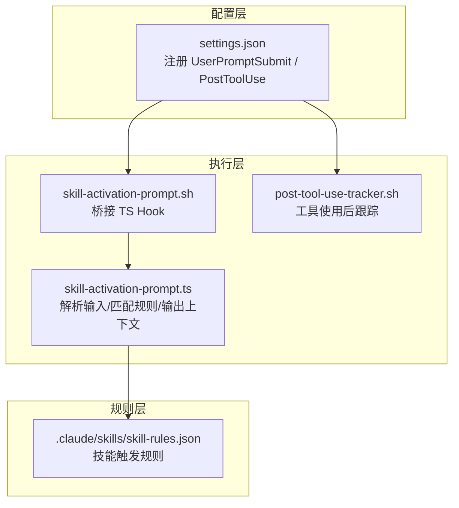
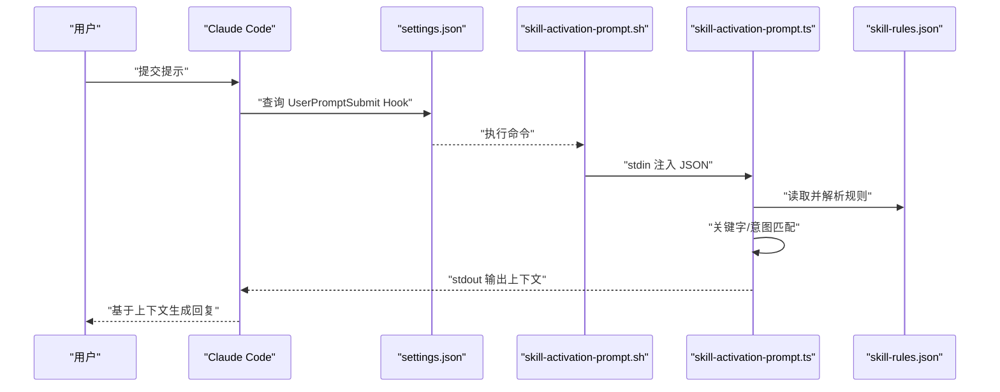
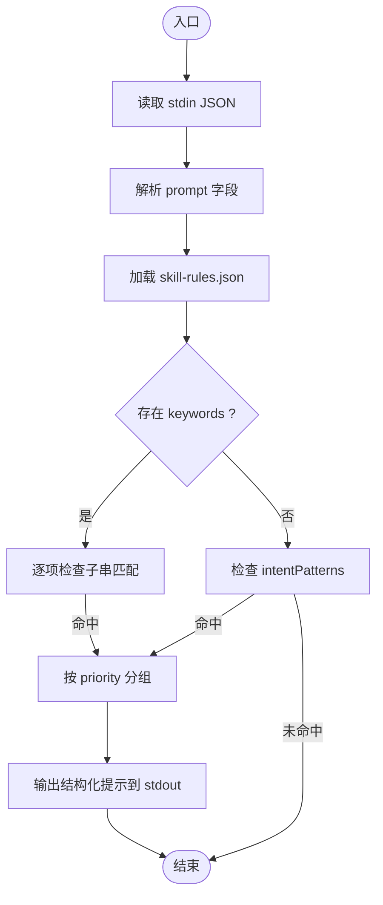
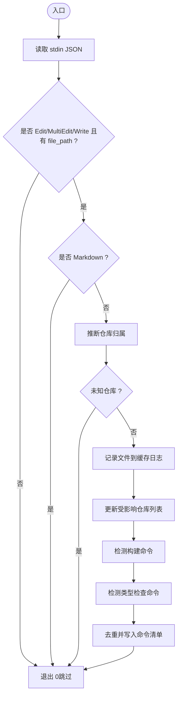
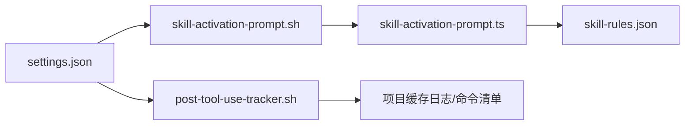

# Hook 机制

<cite>
**本文引用的文件**
- [settings.json](file://settings.json)
- [hooks/skill-activation-prompt.ts](file://hooks/skill-activation-prompt.ts)
- [hooks/skill-activation-prompt.sh](file://hooks/skill-activation-prompt.sh)
- [hooks/post-tool-use-tracker.sh](file://hooks/post-tool-use-tracker.sh)
- [hooks/package.json](file://hooks/package.json)
- [skills/skill-rules.json](file://skills/skill-rules.json)
- [skills/skill-developer/HOOK_MECHANISMS.md](file://skills/skill-developer/HOOK_MECHANISMS.md)
- [skills/skill-developer/TRIGGER_TYPES.md](file://skills/skill-developer/TRIGGER_TYPES.md)
- [skills/skill-developer/TROUBLESHOOTING.md](file://skills/skill-developer/TROUBLESHOOTING.md)
- [README.md](file://README.md)
</cite>

## 目录
1. [简介](#简介)
2. [项目结构](#项目结构)
3. [核心组件](#核心组件)
4. [架构总览](#架构总览)
5. [详细组件分析](#详细组件分析)
6. [依赖关系分析](#依赖关系分析)
7. [性能考量](#性能考量)
8. [故障排查指南](#故障排查指南)
9. [结论](#结论)
10. [附录](#附录)

## 简介
本文件系统性阐述本仓库中的 Hook 机制，重点覆盖以下方面：
- Hook 的工作原理、触发时机与执行流程
- 技能激活 Hook（UserPromptSubmit）与工具使用跟踪 Hook（PostToolUse）的实现细节
- 如何开发自定义 Hook、配置 Hook 参数与管理 Hook 依赖关系
- 生命周期管理、错误处理与性能监控
- 丰富的使用案例与最佳实践，展示如何利用 Hook 实现工作流自动化与状态同步

## 项目结构
本项目的 Hook 机制由两部分组成：
- 配置层：在设置中注册 Hook，定义事件类型、匹配器与执行命令
- 执行层：Shell 脚本桥接到 TypeScript Hook，读取标准输入、加载规则、匹配并输出上下文或阻断信息

图表来源
- [settings.json](file://settings.json#L13-L35)
- [hooks/skill-activation-prompt.sh](file://hooks/skill-activation-prompt.sh#L1-L6)
- [hooks/skill-activation-prompt.ts](file://hooks/skill-activation-prompt.ts#L1-L133)
- [hooks/post-tool-use-tracker.sh](file://hooks/post-tool-use-tracker.sh#L1-L178)
- [skills/skill-rules.json](file://skills/skill-rules.json#L1-L250)

章节来源
- [settings.json](file://settings.json#L13-L35)
- [hooks/skill-activation-prompt.sh](file://hooks/skill-activation-prompt.sh#L1-L6)
- [hooks/post-tool-use-tracker.sh](file://hooks/post-tool-use-tracker.sh#L1-L178)
- [skills/skill-rules.json](file://skills/skill-rules.json#L1-L250)

## 核心组件
- 配置与事件注册
  - settings.json 中注册两类 Hook：UserPromptSubmit（提交用户提示前）与 PostToolUse（编辑/写入工具执行后）
  - PostToolUse 使用正则匹配 Edit|MultiEdit|Write，确保只对编辑类工具生效
- 技能激活 Hook（UserPromptSubmit）
  - Shell 脚本桥接 TS Hook，TS Hook 从标准输入读取 JSON，加载 skill-rules.json，基于关键字与意图模式进行匹配，按优先级分组输出到 stdout，作为 Claude 的上下文注入
- 工具使用跟踪 Hook（PostToolUse）
  - 对 Edit/MultiEdit/Write 成功完成后执行，记录被编辑文件、推断仓库归属、收集构建与类型检查命令，并写入缓存日志，便于后续自动化

章节来源
- [settings.json](file://settings.json#L13-L35)
- [hooks/skill-activation-prompt.ts](file://hooks/skill-activation-prompt.ts#L36-L127)
- [hooks/post-tool-use-tracker.sh](file://hooks/post-tool-use-tracker.sh#L8-L178)
- [skills/skill-rules.json](file://skills/skill-rules.json#L1-L250)

## 架构总览
下图展示了 Hook 的整体交互：事件触发、命令执行、数据读取、规则匹配与输出反馈。

图表来源
- [settings.json](file://settings.json#L13-L23)
- [hooks/skill-activation-prompt.sh](file://hooks/skill-activation-prompt.sh#L4-L5)
- [hooks/skill-activation-prompt.ts](file://hooks/skill-activation-prompt.ts#L36-L127)
- [skills/skill-rules.json](file://skills/skill-rules.json#L1-L250)

## 详细组件分析

### 组件一：技能激活 Hook（UserPromptSubmit）
- 触发时机：在 Claude 处理用户提示之前
- 输入格式：包含 session_id、transcript_path、cwd、permission_mode、hook_event_name、prompt 等字段的 JSON
- 处理逻辑：
  - 读取 stdin 的 JSON，提取 prompt
  - 从 CLAUDE_PROJECT_DIR/.claude/skills/skill-rules.json 加载规则
  - 关键字匹配（不区分大小写子串）与意图模式匹配（正则，不区分大小写）
  - 将匹配结果按 priority 分组（critical/high/medium/low），输出结构化提示到 stdout
- 输出行为：stdout 内容作为 Claude 的系统消息上下文注入，不影响工具执行
- 性能与可靠性：建议减少正则数量、使用更具体的模式；错误时退出码非 0，但该 Hook 本身设计为允许态

图表来源
- [hooks/skill-activation-prompt.ts](file://hooks/skill-activation-prompt.ts#L36-L127)
- [skills/skill-rules.json](file://skills/skill-rules.json#L1-L250)

章节来源
- [hooks/skill-activation-prompt.ts](file://hooks/skill-activation-prompt.ts#L36-L127)
- [hooks/skill-activation-prompt.sh](file://hooks/skill-activation-prompt.sh#L1-L6)
- [skills/skill-developer/HOOK_MECHANISMS.md](file://skills/skill-developer/HOOK_MECHANISMS.md#L15-L80)
- [skills/skill-rules.json](file://skills/skill-rules.json#L1-L250)

### 组件二：工具使用跟踪 Hook（PostToolUse）
- 触发时机：Edit/MultiEdit/Write 工具成功执行后
- 匹配器：正则 Edit|MultiEdit|Write
- 输入格式：包含 tool_name、tool_input.file_path、session_id 等字段的 JSON
- 处理逻辑：
  - 过滤非编辑工具或无文件路径的情况
  - 跳过 Markdown 文件
  - 基于文件路径推断仓库归属（前端/后端/数据库/monorepo/packages/examples/root 等）
  - 记录被编辑文件到缓存日志，更新受影响仓库列表
  - 识别构建命令（根据包管理器与构建脚本）、类型检查命令（tsconfig），去重后写入命令清单
- 输出行为：无 stdout/stderr 输出，仅写入本地缓存文件，供后续自动化使用

图表来源
- [hooks/post-tool-use-tracker.sh](file://hooks/post-tool-use-tracker.sh#L8-L178)

章节来源
- [hooks/post-tool-use-tracker.sh](file://hooks/post-tool-use-tracker.sh#L1-L178)
- [settings.json](file://settings.json#L24-L34)

### 组件三：规则系统与触发类型
- 规则文件：.claude/skills/skill-rules.json
- 规则结构要点：
  - version、skills 映射、notes
  - 每个技能包含 type/enforcement/priority/description
  - promptTriggers：keywords（关键字）、intentPatterns（意图正则）
  - fileTriggers：pathPatterns（路径通配）、pathExclusions（排除）、contentPatterns（内容正则）
- 触发类型最佳实践：
  - 关键字触发：显式主题词，避免过于通用
  - 意图触发：使用非贪婪正则，覆盖常见动词与领域名词
  - 路径触发：尽量具体，配合排除测试文件
  - 内容触发：匹配导入/类名/路由等特征，注意转义与大小写

章节来源
- [skills/skill-rules.json](file://skills/skill-rules.json#L1-L250)
- [skills/skill-developer/TRIGGER_TYPES.md](file://skills/skill-developer/TRIGGER_TYPES.md#L15-L306)

### 组件四：Hook 开发生命周期与依赖管理
- 生命周期
  - 配置阶段：在 settings.json 中注册 Hook，设置事件类型与匹配器
  - 开发阶段：编写 Shell 脚本桥接 TS/其他语言 Hook，确保 stdin 解析与环境变量可用
  - 部署阶段：将规则文件放置于 CLAUDE_PROJECT_DIR/.claude/skills/skill-rules.json
  - 运行阶段：事件触发 -> 命令执行 -> 规则匹配 -> 输出/阻断
- 依赖关系
  - settings.json 依赖 CLAUDE_PROJECT_DIR 环境变量定位规则与 hooks 目录
  - skill-activation-prompt.ts 依赖 skill-rules.json 的结构与字段
  - post-tool-use-tracker.sh 依赖 jq、构建脚本与 tsconfig 存在性判断

章节来源
- [settings.json](file://settings.json#L13-L35)
- [hooks/skill-activation-prompt.sh](file://hooks/skill-activation-prompt.sh#L4-L5)
- [hooks/skill-activation-prompt.ts](file://hooks/skill-activation-prompt.ts#L44-L46)
- [hooks/post-tool-use-tracker.sh](file://hooks/post-tool-use-tracker.sh#L28-L178)
- [hooks/package.json](file://hooks/package.json#L7-L16)

## 依赖关系分析
- 配置到执行
  - settings.json 的 hooks 字段决定何时调用 Shell 脚本
  - Shell 脚本负责切换工作目录并调用 tsx 执行 TS Hook
- 执行到规则
  - TS Hook 读取 skill-rules.json，按技能维度进行匹配
- 执行到文件系统
  - PostToolUse Hook 写入缓存日志与命令清单，供后续自动化使用

图表来源
- [settings.json](file://settings.json#L13-L35)
- [hooks/skill-activation-prompt.sh](file://hooks/skill-activation-prompt.sh#L4-L5)
- [hooks/skill-activation-prompt.ts](file://hooks/skill-activation-prompt.ts#L44-L46)
- [hooks/post-tool-use-tracker.sh](file://hooks/post-tool-use-tracker.sh#L28-L178)
- [skills/skill-rules.json](file://skills/skill-rules.json#L1-L250)

章节来源
- [settings.json](file://settings.json#L13-L35)
- [hooks/skill-activation-prompt.ts](file://hooks/skill-activation-prompt.ts#L44-L46)
- [hooks/post-tool-use-tracker.sh](file://hooks/post-tool-use-tracker.sh#L28-L178)
- [skills/skill-rules.json](file://skills/skill-rules.json#L1-L250)

## 性能考量
- 目标指标
  - UserPromptSubmit：< 100ms
  - PreToolUse：< 200ms（注：本仓库未提供 PreToolUse 的 TS 实现，此处为通用建议）
- 常见瓶颈与优化
  - 规则文件读取：每次执行均需加载 skill-rules.json，建议未来引入内存缓存与变更监听
  - 正则匹配：意图模式与内容模式的编译与匹配，建议懒编译与缓存
  - 路径匹配：glob/正则匹配较多时，建议合并与收敛模式
  - 文件读取：PreToolUse 中读取文件内容可能较慢，仅在必要时进行

章节来源
- [skills/skill-developer/HOOK_MECHANISMS.md](file://skills/skill-developer/HOOK_MECHANISMS.md#L260-L301)

## 故障排查指南
- 技能未触发（UserPromptSubmit）
  - 关键字不匹配：确认 promptTriggers.keywords 是否包含实际用语
  - 意图模式过严：放宽正则范围，使用非贪婪匹配，借助在线正则工具测试
  - 技能名称不一致：SKILL.md frontmatter 与 skill-rules.json 中的技能名必须完全一致
- PostToolUse 未生效
  - 工具类型不符：仅对 Edit/MultiEdit/Write 生效
  - 文件路径为空或 Markdown：脚本会跳过
  - 仓库归属未知：当无法识别仓库时会跳过
- Hook 未执行
  - 环境变量 CLAUDE_PROJECT_DIR 未设置或路径不正确
  - Shell 脚本权限不足或 tsx 未安装
- 性能问题
  - 减少正则数量与复杂度，合并相似模式
  - 使用更具体的路径模式，缩小匹配范围

章节来源
- [skills/skill-developer/TROUBLESHOOTING.md](file://skills/skill-developer/TROUBLESHOOTING.md#L1-L76)
- [hooks/skill-activation-prompt.sh](file://hooks/skill-activation-prompt.sh#L4-L5)
- [hooks/package.json](file://hooks/package.json#L7-L16)

## 结论
本仓库的 Hook 机制以“配置即规则”的方式实现了技能自动激活与工具使用后的自动化跟踪。通过 settings.json 注册事件、Shell 脚本桥接执行、TS Hook 解析输入与匹配规则，最终将上下文注入 Claude 或写入缓存以支持后续自动化。结合 skill-rules.json 的触发类型与最佳实践，可以灵活地扩展自定义 Hook，实现工作流自动化与状态同步。

## 附录

### Hook 使用案例与最佳实践
- 案例一：基于关键字与意图的技能建议
  - 在 skill-rules.json 中为技能配置 keywords 与 intentPatterns
  - 使用 npx tsx 直接测试触发效果
- 案例二：编辑后自动识别仓库并生成构建/类型检查命令
  - 在 PostToolUse 中记录文件路径与仓库归属
  - 依据包管理器与 tsconfig 自动生成命令清单
- 最佳实践
  - 关键字明确、意图正则非贪婪、路径模式具体、内容模式精准
  - 逐步收敛模式，避免过度触发
  - 保持 skill-rules.json 的版本与结构清晰

章节来源
- [skills/skill-developer/TRIGGER_TYPES.md](file://skills/skill-developer/TRIGGER_TYPES.md#L281-L298)
- [hooks/post-tool-use-tracker.sh](file://hooks/post-tool-use-tracker.sh#L143-L178)
- [skills/skill-rules.json](file://skills/skill-rules.json#L1-L250)