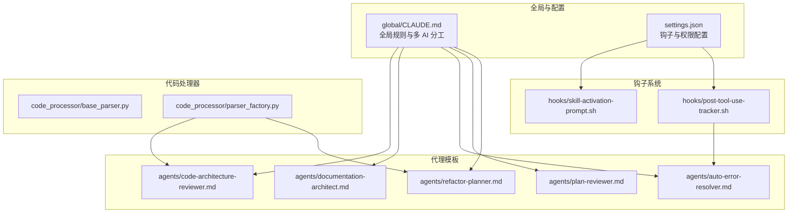
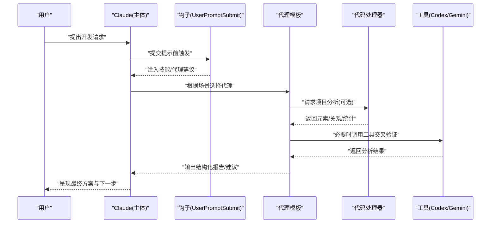
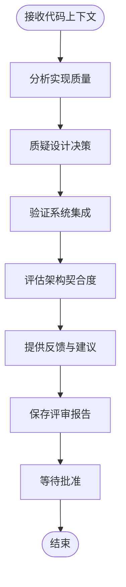
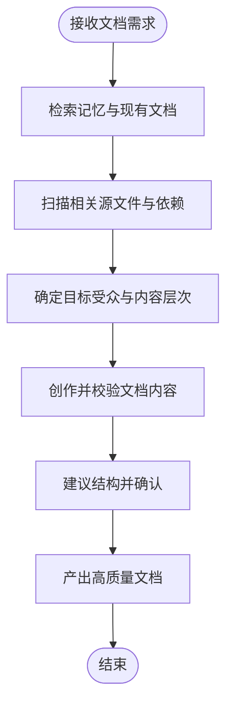
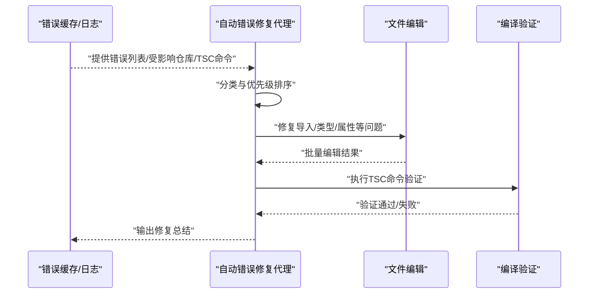
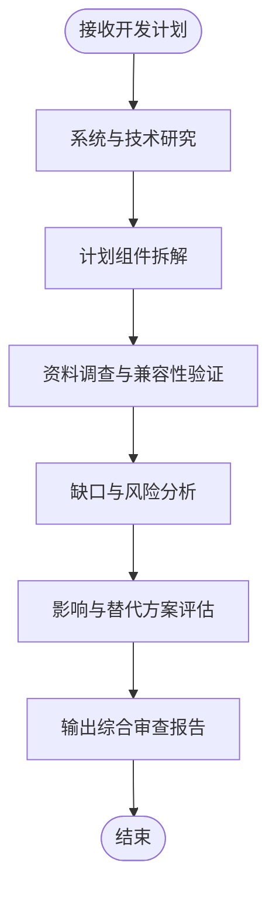
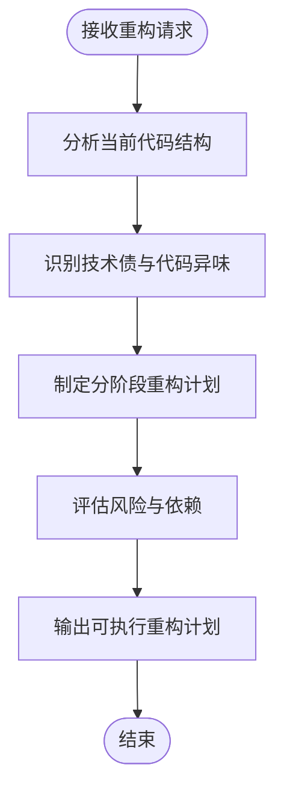
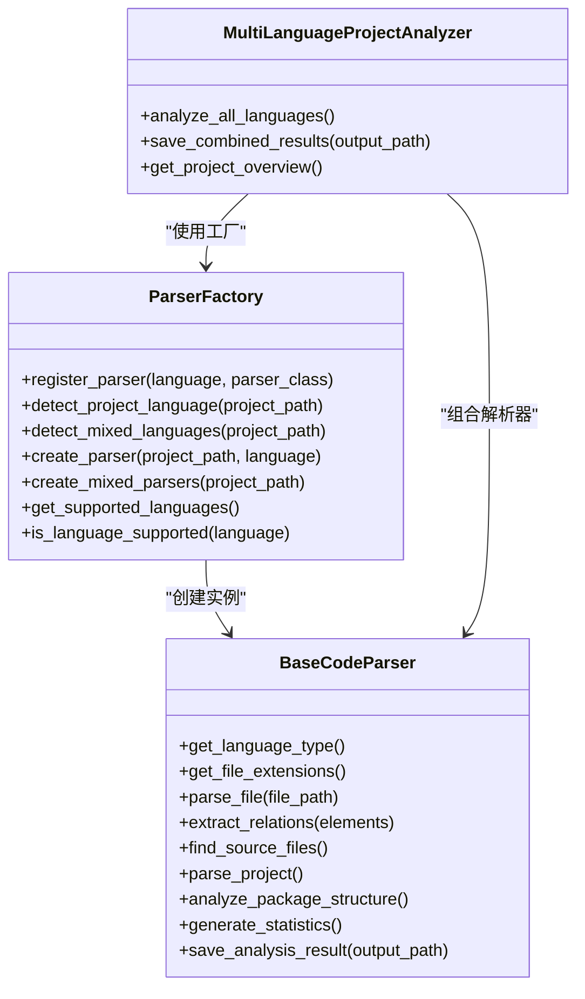
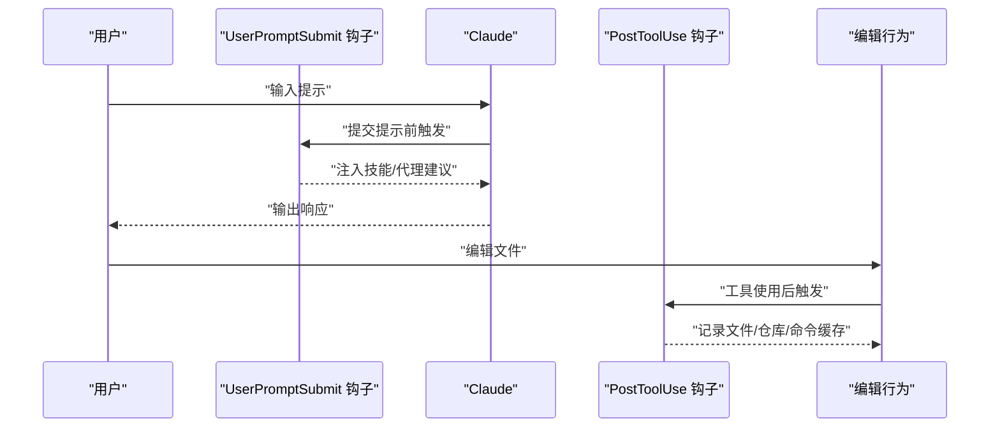
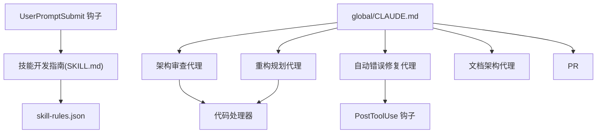

# 代理模板系统

<cite>
**本文引用的文件**
- [AGENTS.md](file://AGENTS.md)
- [README.md](file://README.md)
- [settings.json](file://settings.json)
- [global/CLAUDE.md](file://global/CLAUDE.md)
- [agents/code-architecture-reviewer.md](file://agents/code-architecture-reviewer.md)
- [agents/documentation-architect.md](file://agents/documentation-architect.md)
- [agents/auto-error-resolver.md](file://agents/auto-error-resolver.md)
- [agents/plan-reviewer.md](file://agents/plan-reviewer.md)
- [agents/refactor-planner.md](file://agents/refactor-planner.md)
- [skills/skill-developer/SKILL.md](file://skills/skill-developer/SKILL.md)
- [code_processor/__init__.py](file://code_processor/__init__.py)
- [code_processor/base_parser.py](file://code_processor/base_parser.py)
- [code_processor/parser_factory.py](file://code_processor/parser_factory.py)
- [hooks/skill-activation-prompt.sh](file://hooks/skill-activation-prompt.sh)
- [hooks/post-tool-use-tracker.sh](file://hooks/post-tool-use-tracker.sh)
</cite>

## 目录
1. [简介](#简介)
2. [项目结构](#项目结构)
3. [核心组件](#核心组件)
4. [架构总览](#架构总览)
5. [详细组件分析](#详细组件分析)
6. [依赖关系分析](#依赖关系分析)
7. [性能考虑](#性能考虑)
8. [故障排查指南](#故障排查指南)
9. [结论](#结论)
10. [附录](#附录)

## 简介
本文件面向“代理模板系统”的使用者与维护者，系统性阐述多类专业代理的设计理念、触发条件、执行流程与输出规范，并提供开发自定义代理、配置代理参数、集成到工作流的方法。同时覆盖代理间协作机制、冲突解决与优先级管理策略，结合代码处理器与钩子系统，给出可落地的自动化开发实践建议。

## 项目结构
该项目以“多 AI 协同 + 规范驱动开发（SDD）”为核心，围绕 CLAUDE.md 全局规则、技能系统（skills）、代理模板（agents）、钩子（hooks）与代码处理器（code_processor）构建。关键要点：
- 全局规则与多 AI 分工由 global/CLAUDE.md 定义，明确 Claude 为主体协调者，Codex 与 Gemini 作为工具顾问参与交叉检查与前端分析。
- 代理模板位于 agents/，每份模板定义了特定职责、触发场景、模型选择与输出约定。
- 钩子系统负责在用户提示提交前（UserPromptSubmit）与工具使用后（PostToolUse）注入上下文或跟踪编辑行为。
- 代码处理器提供多语言解析与关系抽取能力，支撑架构审查与重构规划等代理的分析需求。

**图表来源**
- [global/CLAUDE.md](file://global/CLAUDE.md#L76-L133)
- [settings.json](file://settings.json#L13-L35)
- [agents/code-architecture-reviewer.md](file://agents/code-architecture-reviewer.md#L1-L84)
- [agents/documentation-architect.md](file://agents/documentation-architect.md#L1-L83)
- [agents/auto-error-resolver.md](file://agents/auto-error-resolver.md#L1-L97)
- [agents/plan-reviewer.md](file://agents/plan-reviewer.md#L1-L53)
- [agents/refactor-planner.md](file://agents/refactor-planner.md#L1-L63)
- [hooks/skill-activation-prompt.sh](file://hooks/skill-activation-prompt.sh#L1-L6)
- [hooks/post-tool-use-tracker.sh](file://hooks/post-tool-use-tracker.sh#L1-L178)
- [code_processor/base_parser.py](file://code_processor/base_parser.py#L1-L358)
- [code_processor/parser_factory.py](file://code_processor/parser_factory.py#L1-L248)

**章节来源**
- [README.md](file://README.md#L71-L229)
- [global/CLAUDE.md](file://global/CLAUDE.md#L76-L133)
- [settings.json](file://settings.json#L13-L35)

## 核心组件
- 代理模板（agents/）：定义专业代理的职责边界、触发条件、执行步骤与输出格式，确保与全局规则一致。
- 钩子系统（hooks/）：在用户提示提交前注入技能建议，在工具使用后跟踪编辑行为并生成后续操作线索（如 TypeScript 编译命令缓存）。
- 代码处理器（code_processor/）：提供多语言抽象解析接口与工厂，支持混合语言项目分析，为架构审查与重构规划提供数据基础。
- 技能系统（skills/）：定义触发类型、执行级别与跳过条件，支撑代理的自动激活与质量保障。

**章节来源**
- [agents/code-architecture-reviewer.md](file://agents/code-architecture-reviewer.md#L1-L84)
- [agents/documentation-architect.md](file://agents/documentation-architect.md#L1-L83)
- [agents/auto-error-resolver.md](file://agents/auto-error-resolver.md#L1-L97)
- [agents/plan-reviewer.md](file://agents/plan-reviewer.md#L1-L53)
- [agents/refactor-planner.md](file://agents/refactor-planner.md#L1-L63)
- [hooks/post-tool-use-tracker.sh](file://hooks/post-tool-use-tracker.sh#L1-L178)
- [code_processor/base_parser.py](file://code_processor/base_parser.py#L1-L358)
- [code_processor/parser_factory.py](file://code_processor/parser_factory.py#L1-L248)
- [skills/skill-developer/SKILL.md](file://skills/skill-developer/SKILL.md#L1-L427)

## 架构总览
代理模板系统遵循“规则驱动 + 钩子联动 + 代码分析”的架构：
- 规则层：global/CLAUDE.md 明确多 AI 协作与交叉检查原则；AGENTS.md 指导何时应用 OpenSpec 规范。
- 代理层：各专业代理按模板执行，输出结构化评审/文档/计划/修复建议。
- 钩子层：UserPromptSubmit 注入技能建议；PostToolUse 跟踪编辑并生成编译/构建命令缓存。
- 分析层：代码处理器对项目进行多语言解析，抽取元素与关系，生成统计信息，支撑代理分析。

**图表来源**
- [global/CLAUDE.md](file://global/CLAUDE.md#L76-L133)
- [hooks/skill-activation-prompt.sh](file://hooks/skill-activation-prompt.sh#L1-L6)
- [agents/code-architecture-reviewer.md](file://agents/code-architecture-reviewer.md#L1-L84)
- [agents/documentation-architect.md](file://agents/documentation-architect.md#L1-L83)
- [agents/auto-error-resolver.md](file://agents/auto-error-resolver.md#L1-L97)
- [agents/plan-reviewer.md](file://agents/plan-reviewer.md#L1-L53)
- [agents/refactor-planner.md](file://agents/refactor-planner.md#L1-L63)
- [code_processor/parser_factory.py](file://code_processor/parser_factory.py#L173-L248)

## 详细组件分析

### 代码架构审查代理（code-architecture-reviewer）
- 设计理念：聚焦代码质量、最佳实践与系统集成一致性，强调“先审查再合并”的质量门禁。
- 触发条件：新功能实现、组件完成、服务重构后，需要确认是否符合项目模式与架构边界。
- 执行流程：
  1) 分析实现质量（类型安全、错误处理、命名规范、异步/并发等）
  2) 质疑设计决策，挑战非标准实现
  3) 验证系统集成（服务/API/数据库/状态管理等）
  4) 评估架构契合度（模块划分、微服务边界、共享类型使用）
  5) 提供建设性反馈与改进建议
  6) 保存评审结果并等待显式批准后再实施修复
- 输出结果：结构化评审报告，包含摘要、严重问题、重要改进、次要建议、架构考量与后续步骤。
- 与钩子/处理器协作：可结合代码处理器提供的元素/关系信息，辅助定位耦合点与侵入性修改。

**图表来源**
- [agents/code-architecture-reviewer.md](file://agents/code-architecture-reviewer.md#L23-L81)
- [code_processor/base_parser.py](file://code_processor/base_parser.py#L82-L171)

**章节来源**
- [agents/code-architecture-reviewer.md](file://agents/code-architecture-reviewer.md#L1-L84)

### 文档架构代理（documentation-architect）
- 设计理念：围绕复杂系统创建高质量开发者文档，涵盖指南、API、数据流图、测试文档与架构概览。
- 触发条件：新增特性、复杂工作流引擎、API 变更等需要同步文档更新。
- 执行流程：
  1) 上下文收集：检索记忆、扫描现有文档、分析源文件与依赖
  2) 结构化创作：开发者指南、README、API 文档、数据流图、测试文档
  3) 位置策略：优先就近文档、遵循既有模式、逻辑目录结构
  4) 质量保证：校验示例、路径存在性、与实现一致性、常见问题排障
- 输出结果：结构清晰、术语一致、可读性强的文档，便于新成员上手与长期维护。

**图表来源**
- [agents/documentation-architect.md](file://agents/documentation-architect.md#L12-L82)

**章节来源**
- [agents/documentation-architect.md](file://agents/documentation-architect.md#L1-L83)

### 自动错误修复代理（auto-error-resolver）
- 设计理念：基于错误缓存与日志快速定位并修复 TypeScript 编译错误，优先根因修复，最小化改动。
- 触发条件：TypeScript 编译失败、PM2 服务报错、影响范围明确的类型/导入问题。
- 执行流程：
  1) 读取错误缓存（会话级）、受影响仓库、TSC 命令
  2) 检查服务日志（实时/尾部/错误日志）
  3) 系统化分析错误类型（缺失导入、类型不匹配、属性不存在等）
  4) 优先修复导入与依赖，再处理类型，最后处理剩余问题
  5) 使用 MultiEdit 批量修复相似问题，验证修复后运行正确命令
- 输出结果：修复总结与验证结果，确保无残留错误。

**图表来源**
- [agents/auto-error-resolver.md](file://agents/auto-error-resolver.md#L9-L97)
- [hooks/post-tool-use-tracker.sh](file://hooks/post-tool-use-tracker.sh#L122-L141)

**章节来源**
- [agents/auto-error-resolver.md](file://agents/auto-error-resolver.md#L1-L97)
- [hooks/post-tool-use-tracker.sh](file://hooks/post-tool-use-tracker.sh#L1-L178)

### 规划审查代理（plan-reviewer）
- 设计理念：在实现前对开发计划进行深度审查，识别潜在风险、遗漏考虑与替代方案，降低实施成本。
- 触发条件：认证/授权集成、数据库迁移、API 集成、性能与安全风险评估等高风险计划。
- 执行流程：
  1) 系统分析：研究现有系统、技术栈与约束
  2) 计划拆解：逐项分析可行性与完整性
  3) 资料调查：验证兼容性、限制与集成要求
  4) 缺口分析：错误处理、回滚策略、测试方法、监控等
  5) 影响评估：对现有功能、性能、安全与用户体验的影响
- 输出结果：可行性摘要、关键问题、缺失考虑、替代方案、实施建议、风险缓解与研究发现。

**图表来源**
- [agents/plan-reviewer.md](file://agents/plan-reviewer.md#L17-L52)

**章节来源**
- [agents/plan-reviewer.md](file://agents/plan-reviewer.md#L1-L53)

### 重构规划代理（refactor-planner）
- 设计理念：从当前代码结构出发，识别技术债与代码异味，制定分阶段、低风险的重构计划。
- 触发条件：重构请求、大型组件、重复代码、设计模式缺失、性能瓶颈等。
- 执行流程：
  1) 当前状态分析：文件组织、模块边界、依赖与交互、测试覆盖、命名一致性
  2) 机会识别：代码异味、紧耦合、SOLID 违背、可维护性问题
  3) 制定步骤：分阶段、增量式、可回滚的重构步骤，明确验收标准
  4) 风险与依赖：映射受影响组件、破坏性变更、额外测试与回滚策略
- 输出结果：包含摘要、现状分析、问题与机会、重构计划（分阶段）、风险与缓解、测试策略与成功指标的 Markdown 报告。

**图表来源**
- [agents/refactor-planner.md](file://agents/refactor-planner.md#L41-L62)

**章节来源**
- [agents/refactor-planner.md](file://agents/refactor-planner.md#L1-L63)

### 代码处理器（多语言解析与关系抽取）
- 设计理念：提供统一抽象接口与工厂模式，支持 Java、Python、JavaScript/TypeScript 等语言，自动检测混合语言项目。
- 关键能力：
  - 抽象基类定义元素类型（类、函数、组件、钩子等）、关系类型（继承、依赖、调用等）与项目信息结构
  - 工厂类自动识别项目主语言与混合语言，创建对应解析器
  - 统一的项目解析流程：查找源文件、逐文件解析、抽取关系、分析包结构、生成统计、保存结果
- 性能与复杂度：
  - 文件扫描与解析：O(F)（F 为源文件数），关系抽取受元素数量与依赖关系复杂度影响
  - 排除目录策略减少 IO 压力，日志记录便于问题定位

**图表来源**
- [code_processor/base_parser.py](file://code_processor/base_parser.py#L206-L358)
- [code_processor/parser_factory.py](file://code_processor/parser_factory.py#L20-L248)

**章节来源**
- [code_processor/base_parser.py](file://code_processor/base_parser.py#L1-L358)
- [code_processor/parser_factory.py](file://code_processor/parser_factory.py#L1-L248)

### 钩子系统（技能激活与工具使用跟踪）
- UserPromptSubmit 钩子：在 Claude 看到用户提示前，基于关键字与意图模式注入相关技能/代理建议，提升上下文相关性。
- PostToolUse 钩子：在 Edit/MultiEdit/Write 成功后，跟踪编辑文件、推断仓库、生成构建与 TSC 命令缓存，供后续代理（如自动错误修复代理）直接使用。
- 配置入口：settings.json 中注册钩子命令，确保在合适时机触发。

**图表来源**
- [settings.json](file://settings.json#L14-L34)
- [hooks/skill-activation-prompt.sh](file://hooks/skill-activation-prompt.sh#L1-L6)
- [hooks/post-tool-use-tracker.sh](file://hooks/post-tool-use-tracker.sh#L8-L178)

**章节来源**
- [settings.json](file://settings.json#L13-L35)
- [hooks/skill-activation-prompt.sh](file://hooks/skill-activation-prompt.sh#L1-L6)
- [hooks/post-tool-use-tracker.sh](file://hooks/post-tool-use-tracker.sh#L1-L178)

### 技能开发指南（skill-developer）
- 目标：遵循 Anthropic 最佳实践，创建与管理 Claude Code 技能，支持自动激活、触发类型、执行级别与跳过条件。
- 关键点：
  - 两钩子架构：UserPromptSubmit（主动建议）、Stop 钩子（温和提醒）
  - 配置文件：skill-rules.json 定义触发条件、执行级别、文件路径与内容模式
  - 强制级别：BLOCK（阻止）、SUGGEST（推荐）、WARN（低优先）
  - 跳过条件：会话跟踪、文件标记、环境变量
- 建议：保持技能内容在 500 行以内，采用渐进披露，提供参考文件与目录索引。

**章节来源**
- [skills/skill-developer/SKILL.md](file://skills/skill-developer/SKILL.md#L1-L427)

## 依赖关系分析
- 代理模板依赖：
  - 代码架构审查代理与重构规划代理依赖代码处理器提供的元素/关系/统计信息，以量化分析模块边界与耦合度。
  - 自动错误修复代理依赖钩子系统生成的错误缓存与 TSC 命令，形成“编辑-缓存-修复-验证”的闭环。
- 钩子系统依赖：
  - UserPromptSubmit 钩子依赖技能规则（skill-rules.json）与技能内容（SKILL.md）。
  - PostToolUse 钩子依赖项目结构与包管理器特征（package.json、tsconfig.json、Prisma schema）以推断命令。
- 全局规则与配置：
  - global/CLAUDE.md 为代理与钩子提供角色分工与协作原则，settings.json 提供钩子注册与权限控制。

**图表来源**
- [agents/code-architecture-reviewer.md](file://agents/code-architecture-reviewer.md#L1-L84)
- [agents/refactor-planner.md](file://agents/refactor-planner.md#L1-L63)
- [agents/auto-error-resolver.md](file://agents/auto-error-resolver.md#L1-L97)
- [hooks/post-tool-use-tracker.sh](file://hooks/post-tool-use-tracker.sh#L122-L141)
- [skills/skill-developer/SKILL.md](file://skills/skill-developer/SKILL.md#L1-L427)
- [global/CLAUDE.md](file://global/CLAUDE.md#L76-L133)

**章节来源**
- [code_processor/parser_factory.py](file://code_processor/parser_factory.py#L173-L248)
- [hooks/post-tool-use-tracker.sh](file://hooks/post-tool-use-tracker.sh#L1-L178)
- [skills/skill-developer/SKILL.md](file://skills/skill-developer/SKILL.md#L1-L427)
- [global/CLAUDE.md](file://global/CLAUDE.md#L76-L133)

## 性能考虑
- 代码处理器：
  - 排除目录策略（如 .git、node_modules、venv 等）显著减少扫描与解析开销。
  - 统一的统计与包结构分析在解析完成后一次性生成，避免重复计算。
  - 建议在大型项目中分语言或分模块调用解析，避免单次全量分析。
- 钩子系统：
  - PostToolUse 钩子对每个编辑文件仅做一次路径解析与命令推断，复杂度低。
  - UserPromptSubmit 钩子应避免过长的正则匹配与文件扫描，建议使用预编译正则与缓存。
- 代理执行：
  - 架构审查与重构规划代理可按需请求解析，避免不必要的全量分析。
  - 自动错误修复代理优先修复根因，减少反复验证带来的开销。

[本节为通用性能建议，无需特定文件引用]

## 故障排查指南
- 代理未被触发：
  - 检查 UserPromptSubmit 钩子是否正确注册（settings.json）与执行（skill-activation-prompt.sh）。
  - 确认技能规则（skill-rules.json）中的关键字/意图/路径/内容模式是否覆盖当前场景。
- 编辑后无错误缓存：
  - 确认 PostToolUse 钩子已注册且工具名称匹配（Edit/MultiEdit/Write）。
  - 检查文件路径是否被排除（Markdown 文件会被跳过）。
  - 验证仓库推断逻辑是否命中（前端/后端/数据库/monorepo 包等）。
- 自动修复无效：
  - 确认 tsc 命令缓存是否存在且正确（tsc-commands.txt）。
  - 检查修复是否最小化且未引入新的类型/导入问题。
- 代码处理器异常：
  - 检查项目路径是否存在、语言指示器与扩展映射是否正确。
  - 关注日志中的警告与异常，确认排除目录策略是否导致遗漏文件。

**章节来源**
- [settings.json](file://settings.json#L13-L35)
- [hooks/skill-activation-prompt.sh](file://hooks/skill-activation-prompt.sh#L1-L6)
- [hooks/post-tool-use-tracker.sh](file://hooks/post-tool-use-tracker.sh#L1-L178)
- [agents/auto-error-resolver.md](file://agents/auto-error-resolver.md#L1-L97)
- [code_processor/parser_factory.py](file://code_processor/parser_factory.py#L48-L121)

## 结论
代理模板系统通过“规则 + 代理 + 钩子 + 分析”的协同，实现了从规划、实现到验证与文档化的全流程自动化。专业代理各司其职：架构审查确保一致性，文档架构保障知识沉淀，自动修复快速止损，规划审查规避风险，重构规划持续优化。配合技能系统与代码处理器，系统具备良好的扩展性与可维护性，适合在复杂多语言项目中推广使用。

[本节为总结性内容，无需特定文件引用]

## 附录
- 开发自定义代理步骤（基于模板）：
  1) 在 agents/ 下创建新代理模板，定义 frontmatter（名称、描述、模型、颜色）与执行流程。
  2) 明确触发条件与输出格式，确保与全局规则一致。
  3) 如需上下文分析，可调用代码处理器或依赖钩子缓存。
  4) 在技能系统中注册触发规则（skill-rules.json），并通过 UserPromptSubmit 钩子实现自动激活。
- 配置代理参数：
  - 模型选择：在代理模板 frontmatter 中指定模型（如 sonnet/opus）。
  - 颜色标识：用于界面区分不同代理类型。
  - 工具权限：在代理模板中声明所需工具（如 Read/Write/Edit/MultiEdit/Bash）。
- 集成到工作流：
  - 使用 UserPromptSubmit 钩子在任务开始前注入代理建议。
  - 使用 PostToolUse 钩子在关键编辑后生成缓存与命令，驱动自动修复代理。
  - 将代理输出纳入版本化文档与评审流程，形成闭环。

**章节来源**
- [agents/code-architecture-reviewer.md](file://agents/code-architecture-reviewer.md#L1-L84)
- [agents/documentation-architect.md](file://agents/documentation-architect.md#L1-L83)
- [agents/auto-error-resolver.md](file://agents/auto-error-resolver.md#L1-L97)
- [agents/plan-reviewer.md](file://agents/plan-reviewer.md#L1-L53)
- [agents/refactor-planner.md](file://agents/refactor-planner.md#L1-L63)
- [skills/skill-developer/SKILL.md](file://skills/skill-developer/SKILL.md#L1-L427)
- [settings.json](file://settings.json#L13-L35)