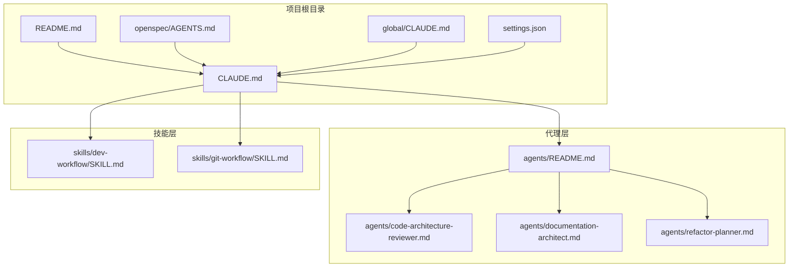
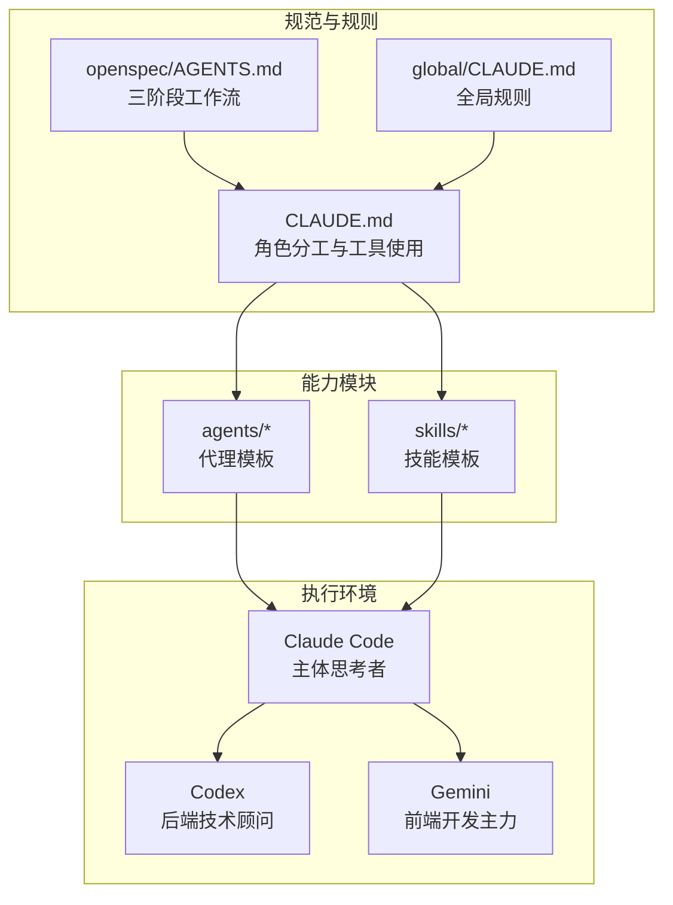
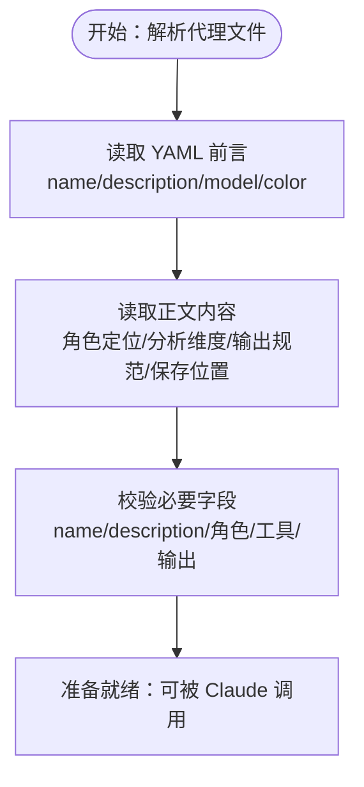
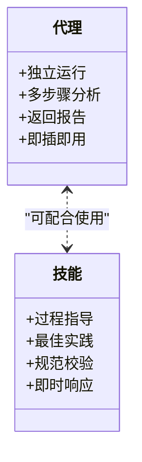
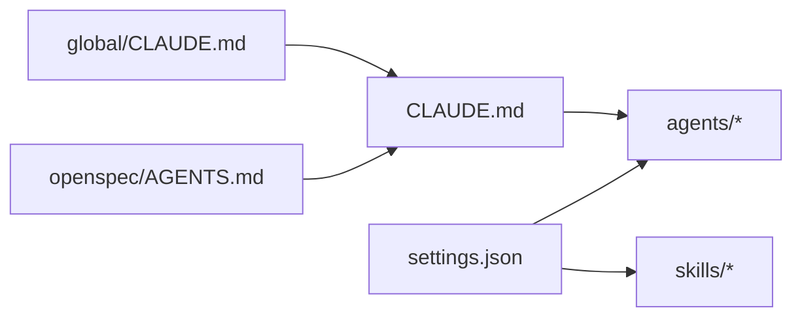

# 代理系统概览

<cite>
**本文档引用的文件**
- [README.md](file://README.md)
- [CLAUDE.md](file://CLAUDE.md)
- [global/CLAUDE.md](file://global/CLAUDE.md)
- [agents/README.md](file://agents/README.md)
- [agents/code-architecture-reviewer.md](file://agents/code-architecture-reviewer.md)
- [agents/documentation-architect.md](file://agents/documentation-architect.md)
- [agents/refactor-planner.md](file://agents/refactor-planner.md)
- [openspec/AGENTS.md](file://openspec/AGENTS.md)
- [settings.json](file://settings.json)
</cite>

## 目录
1. [简介](#简介)
2. [项目结构](#项目结构)
3. [核心组件](#核心组件)
4. [架构总览](#架构总览)
5. [详细组件分析](#详细组件分析)
6. [代理标准化格式与YAML前言](#代理标准化格式与yaml前言)
7. [代理与技能的区别](#代理与技能的区别)
8. [代理选择指南](#代理选择指南)
9. [依赖关系分析](#依赖关系分析)
10. [性能考虑](#性能考虑)
11. [故障排除指南](#故障排除指南)
12. [结论](#结论)

## 简介
本文件为代理系统概览，面向希望快速理解并使用代理（Agent）与技能（Skill）协同工作的开发者与团队。文档围绕以下目标展开：
- 解释代理系统的核心概念、设计理念与基本架构
- 明确代理与技能的区别（执行方式、复杂度与适用场景）
- 介绍代理的标准化格式、YAML前言数据结构与必要组成部分
- 说明代理的独立性与即插即用优势
- 提供代理选择指南，帮助根据任务需求选择合适代理类型
- 展示整体架构图与组件关系

## 项目结构
该项目采用“多 AI 协同 + 规范驱动开发（OpenSpec）”的组织方式，核心目录与职责如下：
- agents/：代理模板集合，每个代理为独立的 Markdown 文件，支持可选 YAML 前言
- skills/：技能模板集合，提供开发流程、Git 工作流等可复用能力
- openspec/：OpenSpec 规范与变更提案目录，支撑规范驱动的三阶段工作流
- global/：全局配置与规则，定义跨项目通用的行为约定
- CLAUDE.md / global/CLAUDE.md：项目与全局的协作规则、角色分工与工具使用规范
- settings.json：Claude Code 的权限与钩子配置，保障代理与技能的自动化集成

**图表来源**
- [README.md](file://README.md#L71-L92)
- [CLAUDE.md](file://CLAUDE.md#L128-L147)
- [agents/README.md](file://agents/README.md#L1-L30)
- [openspec/AGENTS.md](file://openspec/AGENTS.md#L123-L141)
- [global/CLAUDE.md](file://global/CLAUDE.md#L1-L27)

**章节来源**
- [README.md](file://README.md#L71-L92)
- [CLAUDE.md](file://CLAUDE.md#L128-L147)
- [agents/README.md](file://agents/README.md#L1-L30)
- [openspec/AGENTS.md](file://openspec/AGENTS.md#L123-L141)
- [global/CLAUDE.md](file://global/CLAUDE.md#L1-L27)

## 核心组件
- 代理（Agent）：面向复杂、多步骤任务的自治 Claude 实例，具备专用工具访问能力，返回综合性报告。强调独立性与即插即用。
- 技能（Skill）：提供开发流程、Git 工作流等可复用能力，适合在开发过程中提供即时指导与规范校验。
- OpenSpec：规范驱动的三阶段工作流（提案 → 实施 → 归档），贯穿代理与技能的设计与使用。
- 全局与项目规则：定义角色分工、工具使用、交叉检查与目录约定，确保代理与技能的一致性与可维护性。

**章节来源**
- [agents/README.md](file://agents/README.md#L7-L16)
- [openspec/AGENTS.md](file://openspec/AGENTS.md#L15-L64)
- [CLAUDE.md](file://CLAUDE.md#L128-L147)

## 架构总览
代理系统以“规范驱动 + 多 AI 协同”为核心理念，通过 OpenSpec 统一变更管理，通过 CLAUDE.md 明确角色分工，通过 agents 与 skills 提供可组合的能力模块。代理侧重“完成型任务”，技能侧重“过程型指导”。

**图表来源**
- [openspec/AGENTS.md](file://openspec/AGENTS.md#L15-L64)
- [CLAUDE.md](file://CLAUDE.md#L102-L147)
- [global/CLAUDE.md](file://global/CLAUDE.md#L76-L95)

## 详细组件分析

### 代理标准化格式与YAML前言
- 代理文件为 Markdown，可包含可选 YAML 前言块，用于声明元数据（如名称、描述、模型、颜色等）。
- 前言示例展示了 name、description、model、color 等字段，便于在界面中识别与分类代理。
- 代理正文包含角色定位、分析维度、输出规范与保存位置等，确保可重复、可审计的执行流程。

**图表来源**
- [agents/code-architecture-reviewer.md](file://agents/code-architecture-reviewer.md#L1-L6)
- [agents/documentation-architect.md](file://agents/documentation-architect.md#L1-L6)
- [agents/refactor-planner.md](file://agents/refactor-planner.md#L1-L5)

**章节来源**
- [agents/README.md](file://agents/README.md#L240-L266)
- [agents/code-architecture-reviewer.md](file://agents/code-architecture-reviewer.md#L1-L6)
- [agents/documentation-architect.md](file://agents/documentation-architect.md#L1-L6)
- [agents/refactor-planner.md](file://agents/refactor-planner.md#L1-L5)

### 代理与技能的区别
- 执行方式
  - 代理：作为独立子任务运行，自主工作，最小监督，返回综合性报告。
  - 技能：在开发过程中提供即时指导与规范校验，强调“边做边学”。
- 复杂度与适用场景
  - 代理：复杂分析、多步骤任务、明确终点目标（如架构评审、文档生成、重构规划）。
  - 技能：日常开发流程、最佳实践检查、Git 操作规范等。
- 即插即用
  - 代理为独立 Markdown 文件，复制即可使用，适合快速落地与复用。

**图表来源**
- [agents/README.md](file://agents/README.md#L9-L16)
- [agents/README.md](file://agents/README.md#L190-L203)

**章节来源**
- [agents/README.md](file://agents/README.md#L9-L16)
- [agents/README.md](file://agents/README.md#L190-L203)

### 代理选择指南
- 任务类型与复杂度
  - 需要复杂分析与多步骤执行：选择 code-architecture-reviewer、documentation-architect、refactor-planner 等。
  - 需要即时指导与规范校验：优先使用技能（如 dev-workflow、git-workflow）。
- 自主性与控制
  - 希望减少干预、获得完整报告：使用代理。
  - 希望在开发过程中持续获得建议：使用技能。
- 任务终点
  - 明确终点目标（如完成评审、生成文档、制定计划）：使用代理。
  - 过程性任务（如分支命名、提交消息、代码审查清单）：使用技能。

**章节来源**
- [agents/README.md](file://agents/README.md#L190-L220)
- [skills/dev-workflow/SKILL.md](file://skills/dev-workflow/SKILL.md#L16-L25)

## 依赖关系分析
- 代理依赖于项目规则（CLAUDE.md）与全局规则（global/CLAUDE.md），确保工具使用、角色分工与输出格式一致。
- OpenSpec 规范为代理与技能的变更与实施提供统一框架，保证可追溯与可归档。
- settings.json 提供权限与钩子配置，保障代理与技能在 Claude Code 中的自动化集成。

**图表来源**
- [CLAUDE.md](file://CLAUDE.md#L128-L147)
- [global/CLAUDE.md](file://global/CLAUDE.md#L1-L27)
- [openspec/AGENTS.md](file://openspec/AGENTS.md#L15-L64)
- [settings.json](file://settings.json#L1-L37)

**章节来源**
- [CLAUDE.md](file://CLAUDE.md#L128-L147)
- [global/CLAUDE.md](file://global/CLAUDE.md#L1-L27)
- [openspec/AGENTS.md](file://openspec/AGENTS.md#L15-L64)
- [settings.json](file://settings.json#L1-L37)

## 性能考虑
- 代理的独立性与即插即用特性降低了集成成本，但需关注：
  - 代理执行时间与资源占用，避免长时间占用 Claude 会话
  - 输出报告的结构化程度，便于后续检索与审计
  - 与技能配合时的协调机制，避免重复劳动与冲突

## 故障排除指南
- 代理未找到
  - 检查代理文件是否存在且路径正确
- 代理执行报错（路径问题）
  - 搜索代理文件中的硬编码路径，替换为环境变量或相对路径
- 代理与技能冲突
  - 明确任务类型与复杂度，选择合适的执行方式（代理或技能）
  - 若同时使用，确保输出与输入格式一致，避免重复处理

**章节来源**
- [agents/README.md](file://agents/README.md#L269-L290)

## 结论
代理系统通过“规范驱动 + 多 AI 协同”的架构，提供了高内聚、低耦合的能力模块。代理强调独立性与即插即用，适合复杂分析与完成型任务；技能强调过程性与即时性，适合日常开发流程与最佳实践指导。结合 OpenSpec 的三阶段工作流与 CLAUDE.md 的角色分工，团队可在保证质量与效率的同时，灵活选择与组合代理与技能，实现可持续的开发与演进。