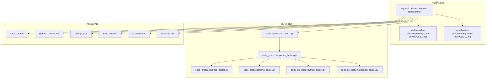
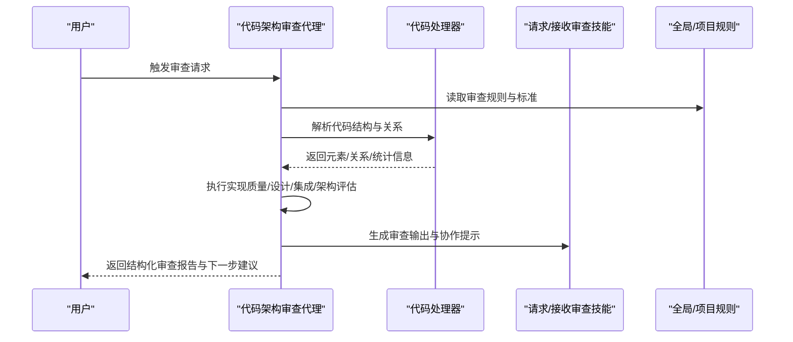
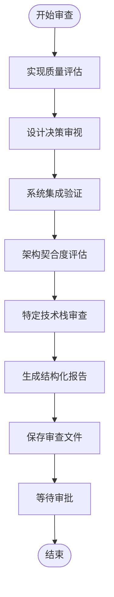
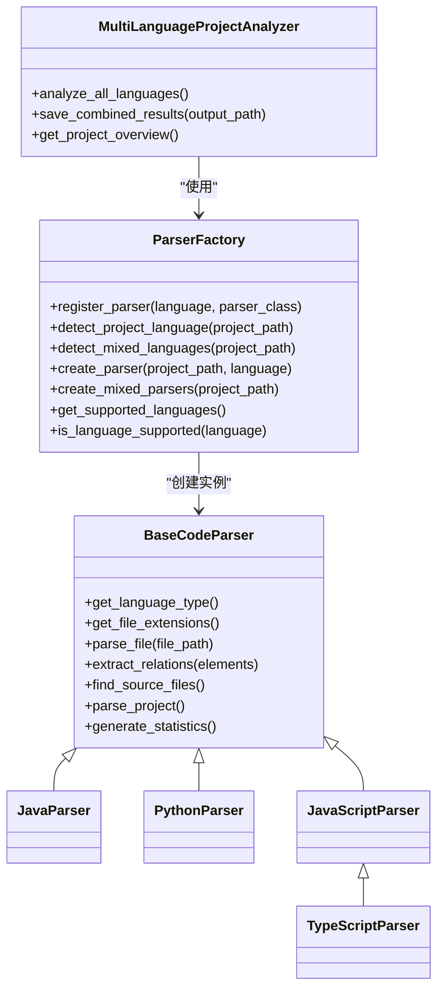
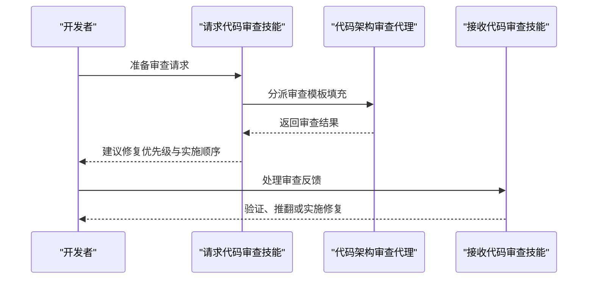
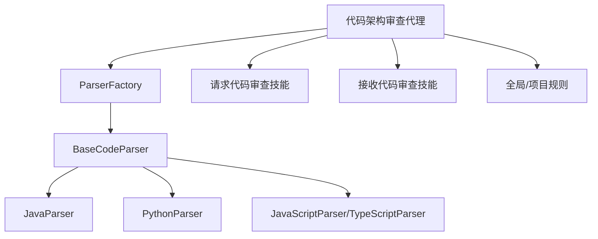

# 代码架构审查代理

<cite>
**本文档引用的文件**
- [agents/code-architecture-reviewer.md](file://agents/code-architecture-reviewer.md)
- [global/codex-skills/receiving-code-review/SKILL.md](file://global/codex-skills/receiving-code-review/SKILL.md)
- [global/codex-skills/requesting-code-review/SKILL.md](file://global/codex-skills/requesting-code-review/SKILL.md)
- [code_processor/__init__.py](file://code_processor/__init__.py)
- [code_processor/parser_factory.py](file://code_processor/parser_factory.py)
- [code_processor/base_parser.py](file://code_processor/base_parser.py)
- [code_processor/java_parser.py](file://code_processor/java_parser.py)
- [code_processor/python_parser.py](file://code_processor/python_parser.py)
- [code_processor/javascript_parser.py](file://code_processor/javascript_parser.py)
- [CLAUDE.md](file://CLAUDE.md)
- [README.md](file://README.md)
- [settings.json](file://settings.json)
- [AGENTS.md](file://AGENTS.md)
- [docs/sdd.md](file://docs/sdd.md)
- [global/CLAUDE.md](file://global/CLAUDE.md)
</cite>

## 目录
1. [简介](#简介)
2. [项目结构](#项目结构)
3. [核心组件](#核心组件)
4. [架构总览](#架构总览)
5. [详细组件分析](#详细组件分析)
6. [依赖分析](#依赖分析)
7. [性能考量](#性能考量)
8. [故障排查指南](#故障排查指南)
9. [结论](#结论)
10. [附录](#附录)

## 简介
代码架构审查代理旨在对近期实现的代码进行系统性审查，确保其符合项目最佳实践、架构一致性与集成标准。该代理覆盖实现质量评估、设计决策审视、系统集成验证、架构契合度评估、特定技术栈审查以及反馈输出与协作流程。其核心目标是通过严谨的审查流程，提升代码质量、可维护性与系统完整性，同时与多 AI 协同工作流（如请求/接收代码审查、子代理驱动开发等）无缝衔接。

## 项目结构
该项目围绕“规范驱动开发（SDD）+ 多 AI 协同”的工作流组织，代码架构审查代理位于 agents 目录，配套的代码解析与多语言分析能力位于 code_processor 目录，全局与项目级规则分别位于 global 与根目录的 CLAUDE.md、settings.json 等文件中。整体结构如下：

图表来源
- [agents/code-architecture-reviewer.md](file://agents/code-architecture-reviewer.md#L1-L84)
- [global/codex-skills/requesting-code-review/SKILL.md](file://global/codex-skills/requesting-code-review/SKILL.md#L1-L106)
- [global/codex-skills/receiving-code-review/SKILL.md](file://global/codex-skills/receiving-code-review/SKILL.md#L1-L210)
- [code_processor/__init__.py](file://code_processor/__init__.py#L1-L40)
- [code_processor/parser_factory.py](file://code_processor/parser_factory.py#L1-L248)
- [code_processor/base_parser.py](file://code_processor/base_parser.py#L1-L358)
- [code_processor/java_parser.py](file://code_processor/java_parser.py#L1-L425)
- [code_processor/python_parser.py](file://code_processor/python_parser.py#L1-L455)
- [code_processor/javascript_parser.py](file://code_processor/javascript_parser.py#L1-L548)
- [CLAUDE.md](file://CLAUDE.md#L1-L440)
- [global/CLAUDE.md](file://global/CLAUDE.md#L1-L147)
- [settings.json](file://settings.json#L1-L37)
- [README.md](file://README.md#L1-L229)
- [AGENTS.md](file://AGENTS.md#L1-L18)
- [docs/sdd.md](file://docs/sdd.md#L1-L816)

章节来源
- [README.md](file://README.md#L71-L229)
- [CLAUDE.md](file://CLAUDE.md#L1-L440)
- [global/CLAUDE.md](file://global/CLAUDE.md#L1-L147)

## 核心组件
- 代码架构审查代理：定义审查范围、流程与输出规范，指导审查重点与优先级。
- 代码处理器（code_processor）：提供多语言代码解析与关系抽取能力，支撑审查所需的结构化分析。
- 请求/接收代码审查技能：规范审查发起与反馈处理流程，确保审查质量与协作效率。
- 全局与项目级规则：约束工具使用、角色分工与工作流，保障审查过程的可追溯与一致性。

章节来源
- [agents/code-architecture-reviewer.md](file://agents/code-architecture-reviewer.md#L1-L84)
- [code_processor/__init__.py](file://code_processor/__init__.py#L1-L40)
- [global/codex-skills/requesting-code-review/SKILL.md](file://global/codex-skills/requesting-code-review/SKILL.md#L1-L106)
- [global/codex-skills/receiving-code-review/SKILL.md](file://global/codex-skills/receiving-code-review/SKILL.md#L1-L210)

## 架构总览
代码架构审查代理的执行链路包括：触发条件识别 → 审查流程执行 → 结构化输出 → 协作与审批。审查流程与多 AI 协同规则相互补充，确保审查既有广度又有深度。

图表来源
- [agents/code-architecture-reviewer.md](file://agents/code-architecture-reviewer.md#L23-L84)
- [code_processor/parser_factory.py](file://code_processor/parser_factory.py#L173-L248)
- [global/codex-skills/requesting-code-review/SKILL.md](file://global/codex-skills/requesting-code-review/SKILL.md#L24-L48)
- [global/codex-skills/receiving-code-review/SKILL.md](file://global/codex-skills/receiving-code-review/SKILL.md#L14-L25)

## 详细组件分析

### 代码架构审查代理
- 设计目的与范围
  - 针对新实现或重构后的代码，进行最佳实践与架构一致性审查。
  - 覆盖实现质量、设计决策、系统集成、架构契合度与特定技术栈规范。
- 审查流程
  - 实现质量评估：类型安全、错误处理、命名规范、异步/Promise、缩进与格式。
  - 设计决策审视：挑战非标准实现、建议更优模式、识别技术债。
  - 系统集成验证：服务/API 集成、数据库操作、鉴权模式、工作流引擎、状态管理。
  - 架构契合度评估：模块归属、关注点分离、微服务边界、共享类型使用。
  - 特定技术栈审查：React 函数组件与 Hook、API 客户端使用、Prisma 最佳实践、TanStack Query 与 Zustand。
- 输出规范
  - 结构化报告：摘要、关键问题、重要改进、次要建议、架构考虑、后续步骤。
  - 文件保存：按任务名保存至 dev/active/[task-name]/[task-name]-code-review.md。
  - 审批前置：明确要求审批后再实施修复。

图表来源
- [agents/code-architecture-reviewer.md](file://agents/code-architecture-reviewer.md#L23-L84)

章节来源
- [agents/code-architecture-reviewer.md](file://agents/code-architecture-reviewer.md#L1-L84)

### 代码处理器（多语言解析）
- 统一抽象与工厂模式
  - BaseCodeParser 提供统一接口与抽象实现，支持 Java、Python、JavaScript/TypeScript。
  - ParserFactory 负责语言检测、解析器注册与多语言项目分析。
- 多语言解析器
  - JavaParser：基于 javalang 的 AST 解析，提取类、接口、枚举、方法、字段、导入等关系。
  - PythonParser：基于 AST 的类、函数、变量、装饰器、继承、方法覆盖、调用关系抽取。
  - JavaScriptParser/TypeScriptParser：基于正则与语法解析，提取导入/导出、函数、类、组件、Hook 使用等。
- 项目分析与统计
  - MultiLanguageProjectAnalyzer 支持混合语言项目分析，聚合结果并生成概览统计。

图表来源
- [code_processor/base_parser.py](file://code_processor/base_parser.py#L206-L358)
- [code_processor/parser_factory.py](file://code_processor/parser_factory.py#L20-L248)
- [code_processor/java_parser.py](file://code_processor/java_parser.py#L39-L425)
- [code_processor/python_parser.py](file://code_processor/python_parser.py#L22-L455)
- [code_processor/javascript_parser.py](file://code_processor/javascript_parser.py#L22-L548)

章节来源
- [code_processor/base_parser.py](file://code_processor/base_parser.py#L1-L358)
- [code_processor/parser_factory.py](file://code_processor/parser_factory.py#L1-L248)
- [code_processor/java_parser.py](file://code_processor/java_parser.py#L1-L425)
- [code_processor/python_parser.py](file://code_processor/python_parser.py#L1-L455)
- [code_processor/javascript_parser.py](file://code_processor/javascript_parser.py#L1-L548)

### 请求/接收代码审查技能
- 请求审查
  - 触发时机：任务完成、重大特性实现、合并前、重构前后、复杂缺陷修复后。
  - 流程：获取基线与 HEAD 提交、分派子代理、处理反馈、分级处置。
- 接收审查
  - 核心原则：先验证再实施，技术正确性优先于社交舒适。
  - 行为模式：完整阅读、技术复述、交叉验证、合理推翻、逐步实施、测试回归。
  - 争议处理：技术理由、引用证据、必要时与人类伙伴讨论。

图表来源
- [global/codex-skills/requesting-code-review/SKILL.md](file://global/codex-skills/requesting-code-review/SKILL.md#L12-L48)
- [global/codex-skills/receiving-code-review/SKILL.md](file://global/codex-skills/receiving-code-review/SKILL.md#L14-L25)

章节来源
- [global/codex-skills/requesting-code-review/SKILL.md](file://global/codex-skills/requesting-code-review/SKILL.md#L1-L106)
- [global/codex-skills/receiving-code-review/SKILL.md](file://global/codex-skills/receiving-code-review/SKILL.md#L1-L210)

### 规则与配置
- 全局与项目级规则
  - 工具使用默认化：非平凡任务必须调用 Codex/Gemini。
  - 角色分工：Claude 协调、Codex 交叉检查、Gemini 大文本分析。
  - 交叉检查：按类型与时机执行，确保质量与一致性。
- 配置与钩子
  - settings.json 控制权限、编辑模式与钩子命令，便于自动化跟踪与提示。

章节来源
- [CLAUDE.md](file://CLAUDE.md#L113-L122)
- [global/CLAUDE.md](file://global/CLAUDE.md#L60-L72)
- [settings.json](file://settings.json#L1-L37)

## 依赖分析
- 组件耦合与内聚
  - 代码处理器内部通过工厂模式与抽象基类实现高内聚、低耦合的语言解析能力。
  - 审查代理依赖处理器提供的结构化信息，形成“解析-审查-输出”的清晰边界。
- 外部依赖与集成点
  - javalang（Java 解析）、AST（Python）、正则与语法解析（JS/TS）。
  - 与多 AI 协同规则、OpenSpec 工作流、子代理与技能系统集成。

图表来源
- [agents/code-architecture-reviewer.md](file://agents/code-architecture-reviewer.md#L1-L84)
- [code_processor/parser_factory.py](file://code_processor/parser_factory.py#L20-L248)
- [code_processor/base_parser.py](file://code_processor/base_parser.py#L206-L358)
- [global/codex-skills/requesting-code-review/SKILL.md](file://global/codex-skills/requesting-code-review/SKILL.md#L1-L106)
- [global/codex-skills/receiving-code-review/SKILL.md](file://global/codex-skills/receiving-code-review/SKILL.md#L1-L210)
- [CLAUDE.md](file://CLAUDE.md#L113-L122)

章节来源
- [code_processor/parser_factory.py](file://code_processor/parser_factory.py#L1-L248)
- [code_processor/base_parser.py](file://code_processor/base_parser.py#L1-L358)

## 性能考量
- 语言检测与项目扫描
  - 通过项目指示符与文件扩展名评分进行语言检测，避免不必要的全量扫描。
  - 排除常见目录（.git、node_modules、target、build 等）以减少 IO 开销。
- 解析与关系抽取
  - AST/正则解析在大文件上可能成为瓶颈，建议分批处理与缓存中间结果。
  - 对混合语言项目，按语言维度并行分析可提升吞吐。
- 审查输出与协作
  - 结构化输出与文件落盘应避免频繁磁盘 IO，建议批量写入与原子替换。
  - 审查流程中增加“审批前置”可减少无效修复与回滚成本。

## 故障排查指南
- 审查代理无法启动或报错
  - 检查项目路径是否存在、语言支持情况与依赖库（如 javalang）。
  - 确认全局/项目规则中工具调用与权限配置。
- 审查结果不准确
  - 核对语言检测结果与排除目录配置，确保扫描范围正确。
  - 对于 JS/TS，确认正则解析是否覆盖到复杂语法场景。
- 审查流程卡顿或超时
  - 分析项目规模与文件数量，考虑分批处理或增量分析。
  - 检查磁盘空间与并发写入策略，避免阻塞。
- 审查协作问题
  - 若接收审查反馈存在歧义，遵循“验证-提问-实施”的流程，必要时与人类伙伴讨论。

章节来源
- [code_processor/parser_factory.py](file://code_processor/parser_factory.py#L48-L88)
- [code_processor/java_parser.py](file://code_processor/java_parser.py#L43-L46)
- [global/codex-skills/receiving-code-review/SKILL.md](file://global/codex-skills/receiving-code-review/SKILL.md#L40-L57)
- [CLAUDE.md](file://CLAUDE.md#L324-L333)

## 结论
代码架构审查代理通过系统化的审查流程与多语言解析能力，有效保障代码质量与架构一致性。结合请求/接收审查技能与多 AI 协同规则，形成从“发现问题—验证—实施—审批”的闭环，显著提升开发效率与交付质量。建议在大型项目中采用分批分析与审批前置策略，持续优化审查体验与产出价值。

## 附录

### 使用示例
- 新增 API 端点审查
  - 场景：完成表单服务的新工作流状态端点实现。
  - 步骤：触发审查代理 → 代理执行实现质量与系统集成评估 → 生成报告并等待审批 → 实施修复。
- React 组件审查
  - 场景：完成 WorkflowStepCard 组件实现。
  - 步骤：触发审查代理 → 代理评估函数组件、Hook 使用与样式模式 → 生成报告 → 实施修复。
- 服务重构审查
  - 场景：重构 Authentication 服务并采用新的令牌验证方式。
  - 步骤：触发审查代理 → 代理评估重构后的架构契合度与系统集成 → 生成报告 → 实施修复。

章节来源
- [agents/code-architecture-reviewer.md](file://agents/code-architecture-reviewer.md#L1-L84)

### 审查参数与配置
- 审查范围与标准
  - 实现质量、设计决策、系统集成、架构契合度、特定技术栈。
- 输出格式
  - 摘要、关键问题、重要改进、次要建议、架构考虑、后续步骤。
- 文件保存位置
  - dev/active/[task-name]/[task-name]-code-review.md。
- 审批前置
  - 明确要求审批后再实施修复。

章节来源
- [agents/code-architecture-reviewer.md](file://agents/code-architecture-reviewer.md#L63-L84)

### 与其他代理的协作机制
- 子代理驱动开发
  - 在子代理完成任务后触发审查，确保阶段性质量。
- 执行计划与 Ad-hoc 开发
  - 在执行计划批次后或遇到难题时请求审查，保持问题早发现、早解决。
- OpenSpec 工作流
  - 审查结果可作为变更提案的一部分，支撑规范驱动的开发闭环。

章节来源
- [docs/sdd.md](file://docs/sdd.md#L174-L184)
- [global/codex-skills/requesting-code-review/SKILL.md](file://global/codex-skills/requesting-code-review/SKILL.md#L77-L91)