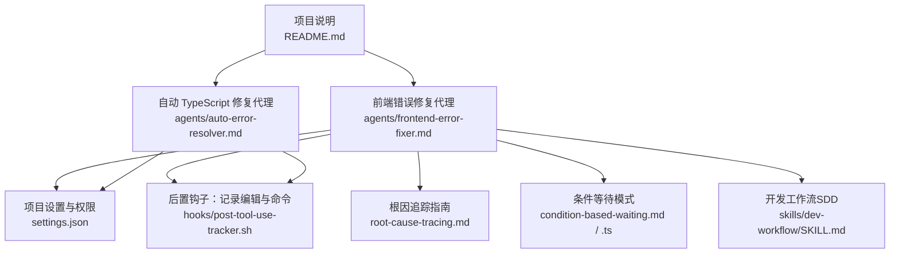
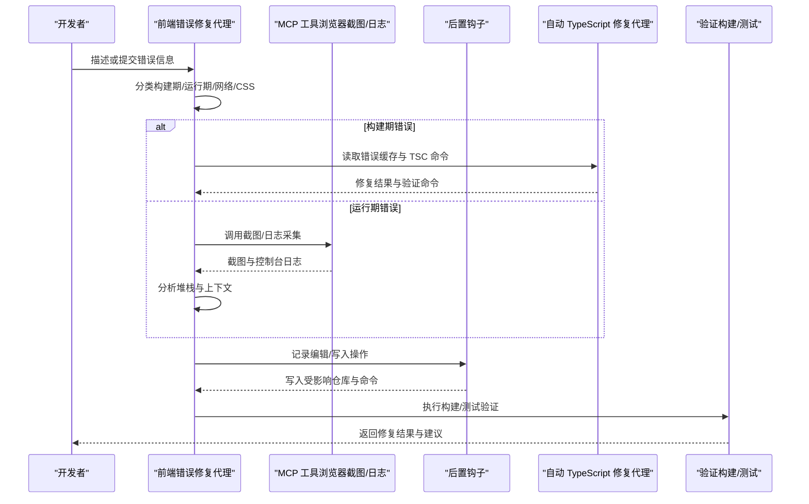
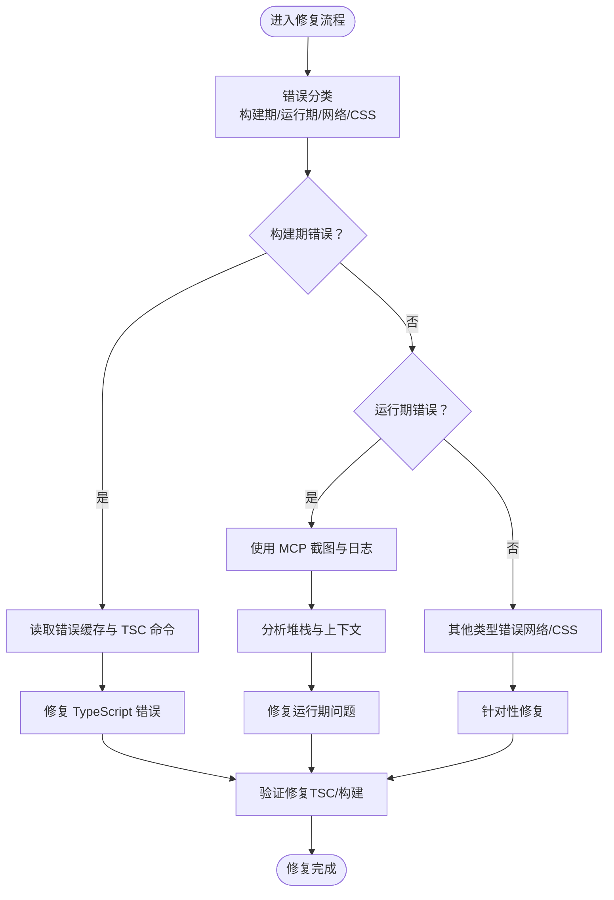
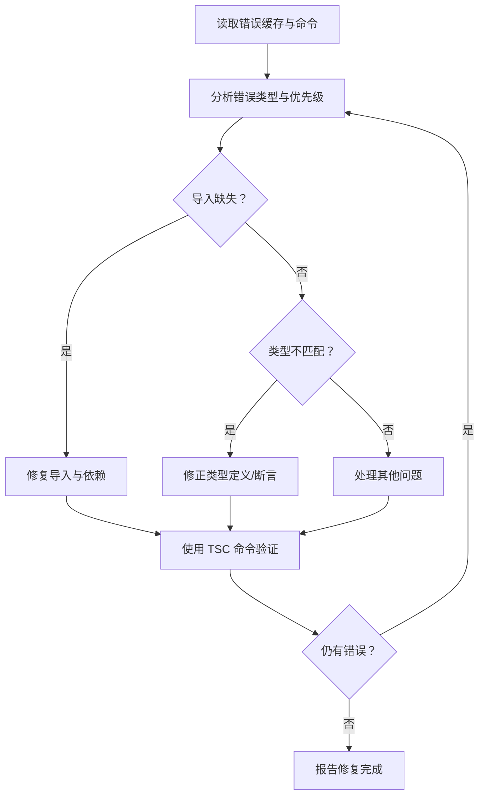
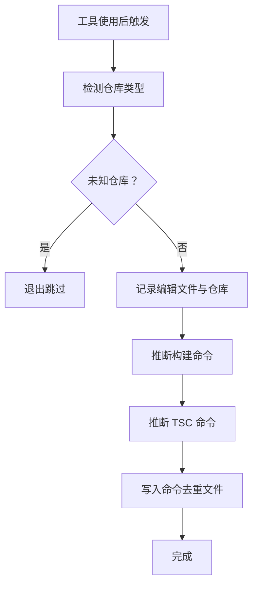
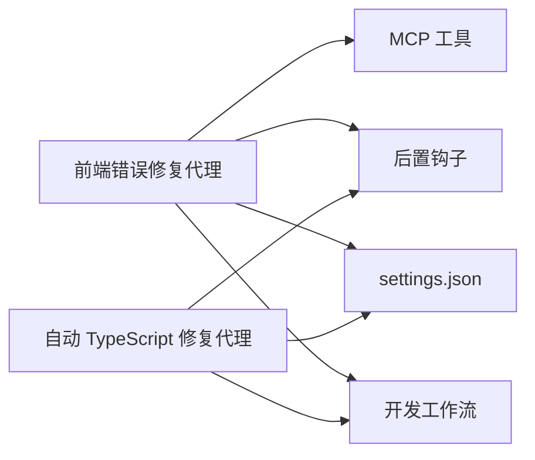

# 前端错误修复代理

<cite>
**本文引用的文件**
- [agents/frontend-error-fixer.md](file://agents/frontend-error-fixer.md)
- [agents/auto-error-resolver.md](file://agents/auto-error-resolver.md)
- [settings.json](file://settings.json)
- [hooks/post-tool-use-tracker.sh](file://hooks/post-tool-use-tracker.sh)
- [global/codex-skills/systematic-debugging/root-cause-tracing.md](file://global/codex-skills/systematic-debugging/root-cause-tracing.md)
- [global/codex-skills/systematic-debugging/condition-based-waiting.md](file://global/codex-skills/systematic-debugging/condition-based-waiting.md)
- [global/codex-skills/systematic-debugging/condition-based-waiting-example.ts](file://global/codex-skills/systematic-debugging/condition-based-waiting-example.ts)
- [skills/dev-workflow/SKILL.md](file://skills/dev-workflow/SKILL.md)
- [README.md](file://README.md)
</cite>

## 目录
1. [简介](#简介)
2. [项目结构](#项目结构)
3. [核心组件](#核心组件)
4. [架构总览](#架构总览)
5. [详细组件分析](#详细组件分析)
6. [依赖关系分析](#依赖关系分析)
7. [性能考虑](#性能考虑)
8. [故障排查指南](#故障排查指南)
9. [结论](#结论)
10. [附录](#附录)

## 简介
本文件面向“前端错误修复代理”的设计与使用，系统阐述其在以下方面的职责与方法：
- 浏览器控制台错误诊断与修复（运行时错误、React 错误、网络问题等）
- TypeScript 编译错误修复（类型不匹配、缺失导入、模块未找到等）
- 与 MCP（Model Context Protocol）工具链的集成，支持截图、日志与构建命令自动化
- 与开发工作流（SDD）的衔接，确保修复过程可追溯、可验证、可回归

该代理强调“精准修复、最小变更、防御式编程”，并提供从错误分类、诊断、修复到验证的完整闭环。

## 项目结构
围绕前端错误修复代理的关键文件与角色如下：
- 代理定义与流程：agents/frontend-error-fixer.md
- 自动化 TypeScript 错误修复：agents/auto-error-resolver.md
- 配置与权限：settings.json
- 后置钩子（记录编辑与构建命令）：hooks/post-tool-use-tracker.sh
- 系统化调试与根因追踪：global/codex-skills/systematic-debugging/root-cause-tracing.md
- 条件等待与稳定测试：global/codex-skills/systematic-debugging/condition-based-waiting.md、condition-based-waiting-example.ts
- 开发工作流（SDD）：skills/dev-workflow/SKILL.md
- 项目整体说明：README.md

图表来源
- [agents/frontend-error-fixer.md](file://agents/frontend-error-fixer.md#L1-L77)
- [agents/auto-error-resolver.md](file://agents/auto-error-resolver.md#L1-L97)
- [settings.json](file://settings.json#L1-L37)
- [hooks/post-tool-use-tracker.sh](file://hooks/post-tool-use-tracker.sh#L128-L178)
- [global/codex-skills/systematic-debugging/root-cause-tracing.md](file://global/codex-skills/systematic-debugging/root-cause-tracing.md#L1-L170)
- [global/codex-skills/systematic-debugging/condition-based-waiting.md](file://global/codex-skills/systematic-debugging/condition-based-waiting.md#L1-L46)
- [global/codex-skills/systematic-debugging/condition-based-waiting-example.ts](file://global/codex-skills/systematic-debugging/condition-based-waiting-example.ts#L1-L159)
- [skills/dev-workflow/SKILL.md](file://skills/dev-workflow/SKILL.md#L1-L397)
- [README.md](file://README.md#L1-L229)

章节来源
- [README.md](file://README.md#L1-L229)
- [agents/frontend-error-fixer.md](file://agents/frontend-error-fixer.md#L1-L77)
- [agents/auto-error-resolver.md](file://agents/auto-error-resolver.md#L1-L97)
- [settings.json](file://settings.json#L1-L37)
- [hooks/post-tool-use-tracker.sh](file://hooks/post-tool-use-tracker.sh#L128-L178)
- [global/codex-skills/systematic-debugging/root-cause-tracing.md](file://global/codex-skills/systematic-debugging/root-cause-tracing.md#L1-L170)
- [global/codex-skills/systematic-debugging/condition-based-waiting.md](file://global/codex-skills/systematic-debugging/condition-based-waiting.md#L1-L46)
- [global/codex-skills/systematic-debugging/condition-based-waiting-example.ts](file://global/codex-skills/systematic-debugging/condition-based-waiting-example.ts#L1-L159)
- [skills/dev-workflow/SKILL.md](file://skills/dev-workflow/SKILL.md#L1-L397)

## 核心组件
- 前端错误修复代理（frontend-error-fixer）
  - 职责：区分并处理构建期（TypeScript/打包/ESLint）与运行期（浏览器控制台/React/网络/CSS）错误；使用 MCP 截图与日志辅助定位；最小化修复并验证。
  - 关键能力：错误分类、诊断流程、调查步骤、修复策略、验证清单、常见错误模式与原则。
- 自动 TypeScript 修复代理（auto-error-resolver）
  - 职责：基于错误缓存与 TSC 命令自动修复 TypeScript 编译错误，优先修复导入缺失与类型不匹配，避免滥用 @ts-ignore。
  - 关键能力：读取错误缓存、按类型分组、修复顺序、验证命令选择、报告完成。
- 配置与权限（settings.json）
  - 职责：启用项目内所有 MCP 服务器、授予编辑/多文件编辑/笔记本编辑/Bash 权限、注册后置钩子以记录工具使用。
- 后置钩子（post-tool-use-tracker.sh）
  - 职责：在编辑/多文件编辑/写入后，自动识别受影响仓库、推断构建与 TSC 命令，并写入缓存文件，供后续修复流程使用。
- 系统化调试与根因追踪（root-cause-tracing.md）
  - 职责：指导从症状回溯调用链，定位原始触发点，避免仅修复表象；建议多层防御。
- 条件等待模式（condition-based-waiting.md / .ts）
  - 职责：替代任意超时，等待实际条件满足，提升测试稳定性与确定性。
- 开发工作流（dev-workflow/SKILL.md）
  - 职责：规范需求→设计→实现→评审→测试→完成的严格阶段流转，确保修复过程可审计、可验证。

章节来源
- [agents/frontend-error-fixer.md](file://agents/frontend-error-fixer.md#L7-L77)
- [agents/auto-error-resolver.md](file://agents/auto-error-resolver.md#L1-L97)
- [settings.json](file://settings.json#L1-L37)
- [hooks/post-tool-use-tracker.sh](file://hooks/post-tool-use-tracker.sh#L128-L178)
- [global/codex-skills/systematic-debugging/root-cause-tracing.md](file://global/codex-skills/systematic-debugging/root-cause-tracing.md#L1-L170)
- [global/codex-skills/systematic-debugging/condition-based-waiting.md](file://global/codex-skills/systematic-debugging/condition-based-waiting.md#L1-L46)
- [global/codex-skills/systematic-debugging/condition-based-waiting-example.ts](file://global/codex-skills/systematic-debugging/condition-based-waiting-example.ts#L1-L159)
- [skills/dev-workflow/SKILL.md](file://skills/dev-workflow/SKILL.md#L1-L397)

## 架构总览
前端错误修复代理的工作流由“错误分类—诊断—调查—修复—验证”构成，并与 MCP 工具链、后置钩子、开发工作流协同。

图表来源
- [agents/frontend-error-fixer.md](file://agents/frontend-error-fixer.md#L17-L77)
- [agents/auto-error-resolver.md](file://agents/auto-error-resolver.md#L9-L37)
- [hooks/post-tool-use-tracker.sh](file://hooks/post-tool-use-tracker.sh#L128-L178)
- [README.md](file://README.md#L123-L139)

## 详细组件分析

### 组件一：前端错误修复代理（frontend-error-fixer）
- 设计目的
  - 面向现代前端生态（TypeScript/React/Vite/Webpack/ESBuild），提供“精准、最小化、可验证”的修复流程。
- 核心功能
  - 错误分类：构建期（TypeScript/打包/Lint）、运行期（控制台/React/网络/CSS）。
  - 诊断流程：运行期使用 MCP 截图与日志；构建期分析完整堆栈与编译输出。
  - 调查步骤：读取错误消息与堆栈、定位文件与行号、检查上下文与最近变更、必要时截图辅助。
  - 修复策略：最小化改动、保留现有功能、补充错误处理、确保类型正确、遵循项目约定。
  - 验证清单：确认修复有效、检查是否引入新错误、确保构建通过、测试受影响功能。
- 常见错误模式与修复要点
  - “无法读取未定义属性”：添加空值检查或可选链。
  - “类型 X 不可分配给类型 Y”：修正类型定义或添加显式类型断言。
  - “模块未找到”：检查导入路径与依赖安装。
  - “意外的 token”：修复语法错误或调整 Babel/TypeScript 配置。
  - “CORS 被阻止”：识别 API 配置问题。
  - “React Hook 规则违规”：修正条件调用 Hook 的问题。
  - “内存泄漏”：在 useEffect 返回中添加清理逻辑。
- 关键原则
  - 仅做必要修复，不扩大影响面。
  - 保持代码结构与风格一致。
  - 在错误发生处进行防御式编程。
  - 对复杂修复添加简要内联注释。
  - 若问题系统性出现，定位根因而非修补症状。

图表来源
- [agents/frontend-error-fixer.md](file://agents/frontend-error-fixer.md#L17-L77)

章节来源
- [agents/frontend-error-fixer.md](file://agents/frontend-error-fixer.md#L7-L77)

### 组件二：自动 TypeScript 修复代理（auto-error-resolver）
- 设计目的
  - 基于错误缓存与 TSC 命令，快速修复构建期 TypeScript 错误，减少人工干预。
- 核心流程
  - 读取错误缓存、受影响仓库列表与 TSC 命令。
  - 检查服务日志（PM2）以辅助定位。
  - 系统化分析：按类型分组、优先级排序、识别模式。
  - 修复顺序：先修复导入缺失与依赖问题，再处理类型不匹配，最后处理剩余问题；跨文件相似问题使用多文件编辑。
  - 验证：使用正确的 TSC 命令再次验证，持续修复直至清零。
- 常见错误与修复要点
  - 缺失导入：检查路径与模块存在性，必要时安装依赖。
  - 类型不匹配：核对函数签名与接口实现，添加适当类型注解。
  - 属性不存在：检查拼写与对象结构，向接口补充缺失属性。
- 命令选择
  - 前端：使用 tsconfig.app.json 的项目命令。
  - 后端仓库：直接 TSC 命令。
  - 项目引用：使用构建命令。

图表来源
- [agents/auto-error-resolver.md](file://agents/auto-error-resolver.md#L9-L97)

章节来源
- [agents/auto-error-resolver.md](file://agents/auto-error-resolver.md#L1-L97)

### 组件三：后置钩子（post-tool-use-tracker.sh）
- 设计目的
  - 在编辑/多文件编辑/写入后，自动识别受影响仓库、推断构建与 TSC 命令，并写入缓存文件，供修复代理与自动修复代理使用。
- 关键行为
  - 识别仓库类型（如前端/后端/项目引用）。
  - 推断构建命令与 TSC 命令（根据 tsconfig 是否存在及类型）。
  - 去重写入命令文件，更新受影响仓库列表。
  - 记录编辑文件与时间戳，便于溯源。

图表来源
- [hooks/post-tool-use-tracker.sh](file://hooks/post-tool-use-tracker.sh#L128-L178)

章节来源
- [hooks/post-tool-use-tracker.sh](file://hooks/post-tool-use-tracker.sh#L128-L178)

### 组件四：系统化调试与根因追踪（root-cause-tracing.md）
- 核心原则
  - 不要只修复症状，要回溯到原始触发点，从源头修复。
  - 通过多层防御（输入校验、边界保护、环境约束、日志与堆栈）降低问题重现概率。
- 实践步骤
  - 观察症状、定位直接原因、向上追溯、查找原始触发、修复源点、增加防御层。
  - 在难以手动追踪时，添加仪器化日志（包含目录、cwd、环境变量、堆栈）。
  - 使用“污染者”定位脚本（bisection）找出引发问题的测试或代码。

章节来源
- [global/codex-skills/systematic-debugging/root-cause-tracing.md](file://global/codex-skills/systematic-debugging/root-cause-tracing.md#L1-L170)

### 组件五：条件等待模式（condition-based-waiting.md / .ts）
- 核心思想
  - 等待实际条件满足，而不是猜测耗时；提升测试稳定性与确定性。
- 实现要点
  - 提供等待单个事件、等待多个事件、按谓词匹配事件的工具函数。
  - 采用轮询与超时控制，避免任意超时导致的不稳定。
- 实际收益
  - 将 flaky 测试从低通过率提升至稳定通过，同时缩短平均执行时间。

章节来源
- [global/codex-skills/systematic-debugging/condition-based-waiting.md](file://global/codex-skills/systematic-debugging/condition-based-waiting.md#L1-L46)
- [global/codex-skills/systematic-debugging/condition-based-waiting-example.ts](file://global/codex-skills/systematic-debugging/condition-based-waiting-example.ts#L1-L159)

### 组件六：开发工作流（dev-workflow/SKILL.md）
- 阶段与要求
  - 需求→设计→实现→评审→测试→完成，严格阶段顺序与前置条件。
  - 文档归档到固定目录，进度可追踪，测试必须通过方可结项。
- 与前端修复的关系
  - 修复过程应纳入评审与测试阶段，确保可追溯与可回归。
  - 修复建议与验证步骤应形成文档，便于复用与知识沉淀。

章节来源
- [skills/dev-workflow/SKILL.md](file://skills/dev-workflow/SKILL.md#L1-L397)

## 依赖关系分析
- 代理与工具链
  - 前端错误修复代理依赖 MCP 工具（截图与日志）与后置钩子（命令缓存）。
  - 自动 TypeScript 修复代理依赖错误缓存与 TSC 命令缓存。
- 代理与配置
  - settings.json 启用 MCP 服务器与授权编辑/多文件编辑/Bash，为代理提供执行基础。
- 代理与流程
  - 与开发工作流对接，确保修复过程符合阶段要求与文档规范。

图表来源
- [agents/frontend-error-fixer.md](file://agents/frontend-error-fixer.md#L17-L77)
- [agents/auto-error-resolver.md](file://agents/auto-error-resolver.md#L9-L37)
- [settings.json](file://settings.json#L1-L37)
- [hooks/post-tool-use-tracker.sh](file://hooks/post-tool-use-tracker.sh#L128-L178)
- [skills/dev-workflow/SKILL.md](file://skills/dev-workflow/SKILL.md#L1-L397)

章节来源
- [agents/frontend-error-fixer.md](file://agents/frontend-error-fixer.md#L17-L77)
- [agents/auto-error-resolver.md](file://agents/auto-error-resolver.md#L9-L37)
- [settings.json](file://settings.json#L1-L37)
- [hooks/post-tool-use-tracker.sh](file://hooks/post-tool-use-tracker.sh#L128-L178)
- [skills/dev-workflow/SKILL.md](file://skills/dev-workflow/SKILL.md#L1-L397)

## 性能考虑
- 最小化修复：仅针对当前错误做必要修改，避免引入额外复杂度。
- 防御式编程：在错误发生位置就近增加校验，减少传播风险。
- 命令缓存与去重：通过后置钩子缓存构建与 TSC 命令，避免重复探测开销。
- 条件等待：替代任意超时，减少无意义等待，提高测试与验证效率。
- 日志与截图：仅在必要时采集，避免频繁 I/O 与存储压力。

## 故障排查指南
- 构建期 TypeScript 错误
  - 使用自动修复代理读取错误缓存与 TSC 命令，按导入缺失→类型不匹配→其他问题的顺序修复。
  - 若仍失败，检查 tsconfig 与项目引用配置，确认命令来源正确。
- 运行期浏览器错误
  - 使用 MCP 截图与控制台日志，结合“根因追踪”回溯调用链，定位原始触发点。
  - 对 React 错误，关注 Hook 使用规则与副作用清理；对网络错误，检查 API 配置与 CORS。
- 验证与回归
  - 修复后执行构建与功能测试，确保无新增错误。
  - 将修复过程与结果纳入开发工作流文档，便于评审与回归。

章节来源
- [agents/auto-error-resolver.md](file://agents/auto-error-resolver.md#L9-L97)
- [agents/frontend-error-fixer.md](file://agents/frontend-error-fixer.md#L17-L77)
- [global/codex-skills/systematic-debugging/root-cause-tracing.md](file://global/codex-skills/systematic-debugging/root-cause-tracing.md#L1-L170)
- [skills/dev-workflow/SKILL.md](file://skills/dev-workflow/SKILL.md#L1-L397)

## 结论
前端错误修复代理通过“精准分类—系统诊断—最小修复—验证闭环”的方法，结合 MCP 工具链与后置钩子，实现了从构建期到运行期的全栈前端错误治理。配合系统化调试与开发工作流，可显著提升修复质量与效率，降低回归风险。

## 附录

### 使用示例（流程示意）
- 构建期 TypeScript 错误
  - 步骤：读取错误缓存 → 分析类型与优先级 → 修复导入/类型 → 使用 TSC 命令验证 → 报告完成。
  - 参考：自动修复代理流程与命令选择。
- 运行期浏览器错误
  - 步骤：使用 MCP 截图与日志 → 分析堆栈与上下文 → 定位文件与行号 → 添加空值检查/清理副作用 → 验证构建与功能。
  - 参考：前端错误修复代理方法论与常见模式。

章节来源
- [agents/auto-error-resolver.md](file://agents/auto-error-resolver.md#L63-L97)
- [agents/frontend-error-fixer.md](file://agents/frontend-error-fixer.md#L17-L77)