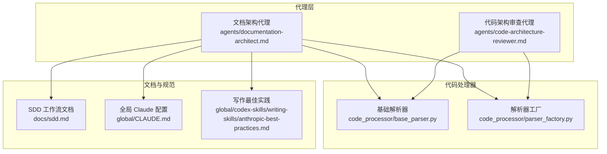
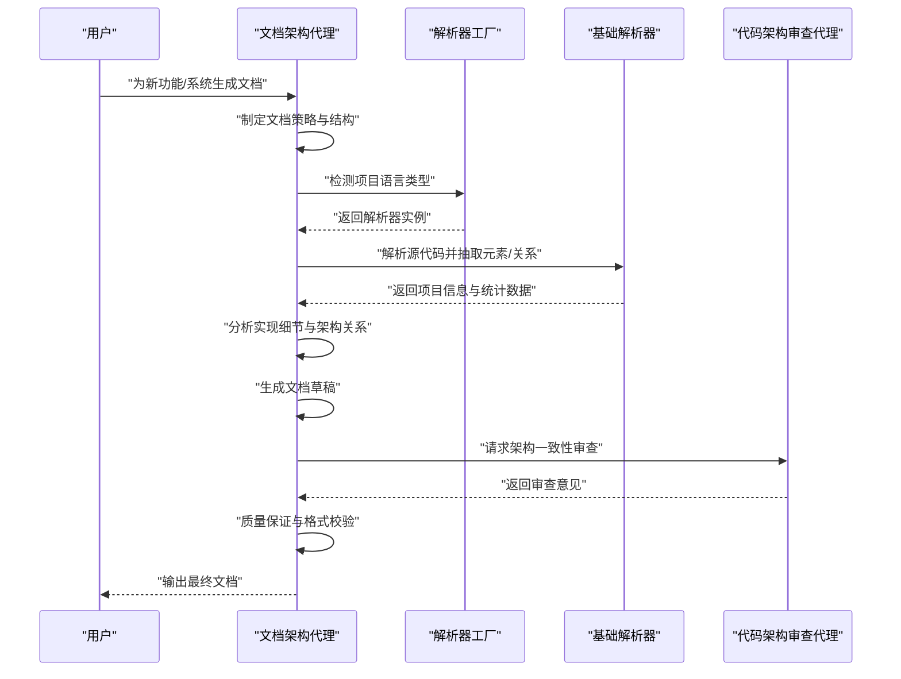
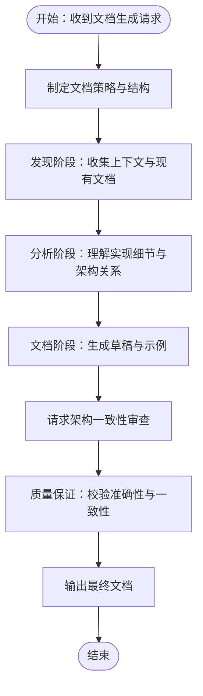
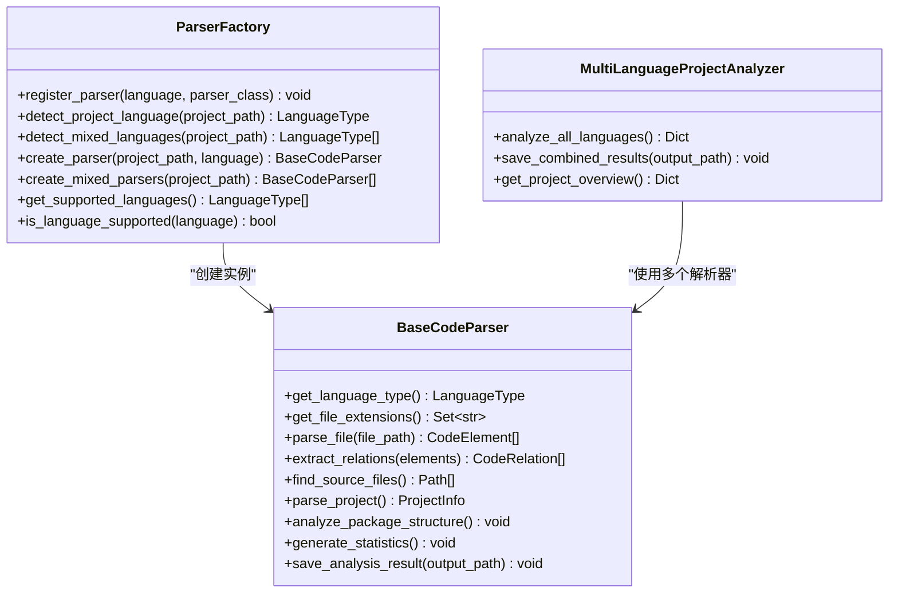
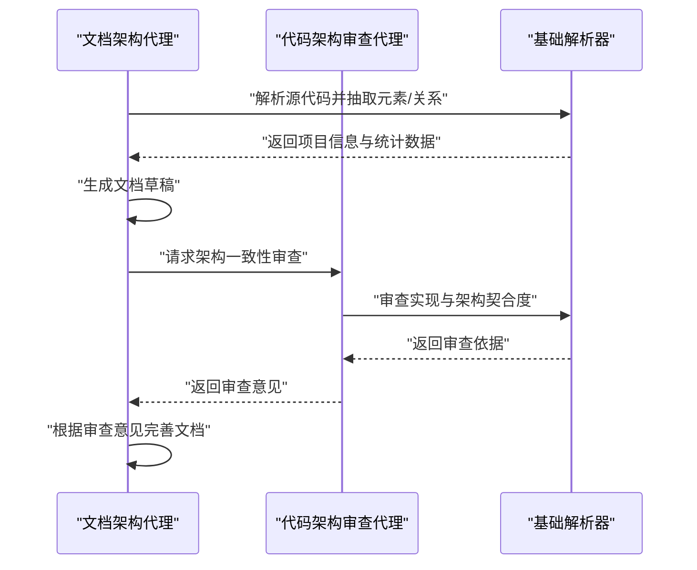
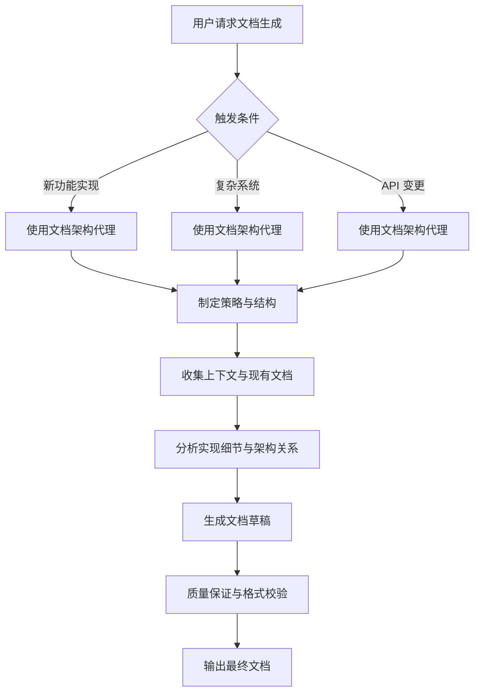
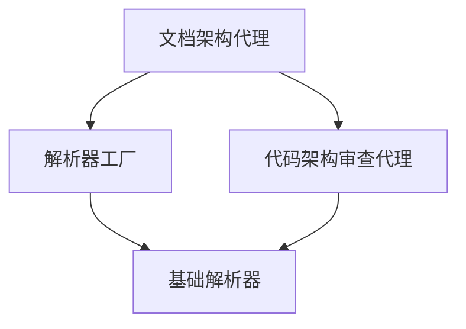

# 文档架构代理

<cite>
**本文档引用的文件**
- [documentation-architect.md](file://agents/documentation-architect.md)
- [README.md（代理总览）](file://agents/README.md)
- [code-architecture-reviewer.md](file://agents/code-architecture-reviewer.md)
- [base_parser.py](file://code_processor/base_parser.py)
- [parser_factory.py](file://code_processor/parser_factory.py)
- [sdd.md](file://docs/sdd.md)
- [CLAUDE.md（全局配置）](file://global/CLAUDE.md)
- [anthropic-best-practices.md](file://global/codex-skills/writing-skills/anthropic-best-practices.md)
- [setup-claude-config.sh](file://setup-claude-config.sh)
</cite>

## 目录
1. [简介](#简介)
2. [项目结构](#项目结构)
3. [核心组件](#核心组件)
4. [架构概览](#架构概览)
5. [详细组件分析](#详细组件分析)
6. [依赖分析](#依赖分析)
7. [性能考虑](#性能考虑)
8. [故障排除指南](#故障排除指南)
9. [结论](#结论)
10. [附录](#附录)

## 简介
文档架构代理（documentation-architect）是 OntologyDevOS 项目中的一个专用智能体，专门负责为代码库的任意部分创建、更新和增强文档。该代理能够生成开发者文档、README 文件、API 文档、数据流图、测试文档或架构总览等，覆盖从新功能实现到复杂工作流引擎的各类文档需求。

该代理的核心价值在于：
- 通过系统化的上下文收集，确保文档全面反映实现细节与架构关系
- 采用结构化方法论，从发现、分析到文档创建与质量保证四个阶段推进
- 遵循统一的文档标准与格式规范，保证文档风格一致性和可读性
- 与代码架构审查代理协作，形成“文档-架构”双轮驱动的质量保障体系

## 项目结构
文档架构代理位于 agents 目录下，作为独立的 .md 文件提供，便于直接复制到目标项目中使用。该项目还包含代码处理器模块（code_processor），用于多语言代码解析与关系抽取，为文档生成提供底层技术支撑。

**图表来源**
- [documentation-architect.md](file://agents/documentation-architect.md#L1-L83)
- [code-architecture-reviewer.md](file://agents/code-architecture-reviewer.md#L1-L84)
- [base_parser.py](file://code_processor/base_parser.py#L1-L358)
- [parser_factory.py](file://code_processor/parser_factory.py#L1-L248)
- [sdd.md](file://docs/sdd.md#L1-L816)
- [CLAUDE.md（全局配置）](file://global/CLAUDE.md#L1-L147)
- [anthropic-best-practices.md](file://global/codex-skills/writing-skills/anthropic-best-practices.md#L45-L691)

**章节来源**
- [documentation-architect.md](file://agents/documentation-architect.md#L1-L83)
- [README.md（代理总览）](file://agents/README.md#L1-L301)

## 核心组件
- 文档架构代理（documentation-architect）：负责文档的发现、分析、创建与质量保证，遵循统一的文档标准与输出规范。
- 代码处理器（code_processor）：提供多语言代码解析、元素与关系抽取、包结构分析与统计信息生成，为文档生成提供结构化数据。
- 解析器工厂（parser_factory）：自动检测项目语言类型，创建相应解析器实例，支持混合语言项目分析。
- 代码架构审查代理（code-architecture-reviewer）：与文档架构代理协作，确保文档内容与架构审查结果一致。
- 文档与规范（sdd.md、CLAUDE.md、anthropic-best-practices.md）：提供 SDD 工作流规范、全局配置与写作最佳实践，指导文档生成与质量控制。

**章节来源**
- [documentation-architect.md](file://agents/documentation-architect.md#L10-L82)
- [base_parser.py](file://code_processor/base_parser.py#L1-L358)
- [parser_factory.py](file://code_processor/parser_factory.py#L1-L248)
- [code-architecture-reviewer.md](file://agents/code-architecture-reviewer.md#L1-L84)
- [sdd.md](file://docs/sdd.md#L285-L307)
- [CLAUDE.md（全局配置）](file://global/CLAUDE.md#L136-L141)
- [anthropic-best-practices.md](file://global/codex-skills/writing-skills/anthropic-best-practices.md#L630-L691)

## 架构概览
文档架构代理的工作流分为四个阶段：发现、分析、文档创建与质量保证。该流程与 OpenSpec 的“提案→审查→实现→归档”工作流相契合，确保文档生成与开发流程同步推进。

**图表来源**
- [documentation-architect.md](file://agents/documentation-architect.md#L31-L57)
- [parser_factory.py](file://code_processor/parser_factory.py#L41-L160)
- [base_parser.py](file://code_processor/base_parser.py#L206-L298)
- [code-architecture-reviewer.md](file://agents/code-architecture-reviewer.md#L23-L81)

## 详细组件分析

### 文档架构代理（documentation-architect）
- 角色定位：专门负责创建、更新和增强代码库文档的智能体，覆盖开发者指南、API 文档、数据流图、测试文档与架构总览。
- 核心职责：
  - 上下文收集：查询内存知识库、扫描现有文档、分析相关源文件与配置、理解架构上下文与依赖关系。
  - 文档创建：生成开发者指南、README 文件、API 文档、数据流图与架构总览、测试文档。
  - 位置策略：优先将文档放置在功能附近，遵循现有文档模式，按需创建逻辑目录结构，确保可发现性。
- 方法论：
  - 发现阶段：查询内存 MCP、扫描 /documentation/ 及子目录、识别相关源文件与配置、映射系统依赖与交互。
  - 分析阶段：理解完整实现细节、识别需要解释的关键概念、确定目标受众与需求、识别模式、边缘情况与陷阱。
  - 文档阶段：按逻辑层级组织内容、提供简洁而全面的解释、包含实用的代码示例与图示、确保与现有文档风格一致。
  - 质量保证：验证代码示例的准确性与可用性、检查引用文件与路径是否存在、确保文档与当前实现一致、包含常见问题的故障排除部分。
- 文档标准：
  - 使用面向开发者的清晰技术语言、为长文档添加目录、提供带语法高亮的代码块、提供快速入门与详细章节、包含版本信息与最后更新日期、交叉引用相关文档、使用一致的格式与术语。
- 特殊注意事项：
  - API：包含 curl 示例、响应模式、错误码。
  - 工作流：创建可视化流程图与状态转换图。
  - 配置：记录所有选项及其默认值与示例。
  - 集成：解释外部依赖与设置要求。
- 输出准则：
  - 在创建文件前解释文档策略、提供所收集上下文的摘要与来源、建议文档结构并在确认后继续、创建开发者愿意阅读与参考的文档。

**图表来源**
- [documentation-architect.md](file://agents/documentation-architect.md#L31-L82)

**章节来源**
- [documentation-architect.md](file://agents/documentation-architect.md#L8-L82)

### 代码处理器（code_processor）
- 基础解析器（BaseCodeParser）：
  - 提供统一接口与抽象实现，支持 Java、Python、JavaScript/TypeScript 等多语言代码解析。
  - 定义代码元素类型（类、接口、函数、方法、字段、变量、模块、包等）与关系类型（继承、实现、依赖、调用、导入、包含等）。
  - 支持文件扩展匹配、源文件查找、项目解析、包结构分析与统计信息生成。
- 解析器工厂（ParserFactory）：
  - 自动检测项目语言类型，创建相应解析器实例，支持混合语言项目分析。
  - 提供多语言项目分析器（MultiLanguageProjectAnalyzer），聚合不同语言的分析结果并生成综合概览。

**图表来源**
- [base_parser.py](file://code_processor/base_parser.py#L173-L358)
- [parser_factory.py](file://code_processor/parser_factory.py#L20-L171)

**章节来源**
- [base_parser.py](file://code_processor/base_parser.py#L1-L358)
- [parser_factory.py](file://code_processor/parser_factory.py#L1-L248)

### 代码架构审查代理（code-architecture-reviewer）
- 角色定位：专注于代码审查与系统架构分析的专家，确保实现符合最佳实践、架构一致性与系统集成。
- 核心职责：
  - 分析实现质量：验证类型安全、错误处理与边界覆盖、命名约定、异步/承诺处理、缩进与格式标准。
  - 质疑设计决策：挑战不符合项目模式的实现选择，建议更好的模式，识别潜在技术债与未来维护问题。
  - 验证系统集成：确保新代码正确集成现有服务与 API、数据库操作使用 PrismaService、认证遵循 JWT cookie 模式、工作流引擎使用正确模式。
  - 评估架构契合度：检查代码归属正确的服务/模块、功能组织的职责分离、微服务边界尊重、共享类型的正确使用。
  - 保存审查输出：确定任务名称并保存到指定路径，包含明确的结构与更新时间。
- 与文档架构代理协作：
  - 文档生成完成后，请求架构一致性审查，确保文档内容与实现一致。
  - 审查意见可用于改进文档结构与技术细节，形成“文档-架构”双轮驱动的质量保障。

**图表来源**
- [code-architecture-reviewer.md](file://agents/code-architecture-reviewer.md#L23-L81)
- [base_parser.py](file://code_processor/base_parser.py#L206-L298)

**章节来源**
- [code-architecture-reviewer.md](file://agents/code-architecture-reviewer.md#L1-L84)

### 文档生成触发条件与使用示例
- 触发条件：
  - 新功能实现后需要文档。
  - 复杂工作流引擎需要数据流文档。
  - API 变更后需要更新 API 文档。
- 使用示例：
  - 为 JWT Cookie 认证实现生成文档。
  - 为复杂工作流引擎生成数据流文档。
  - 为表单服务 API 的新端点更新 API 文档。

**图表来源**
- [documentation-architect.md](file://agents/documentation-architect.md#L1-L83)

**章节来源**
- [documentation-architect.md](file://agents/documentation-architect.md#L1-L83)

### 文档结构规划与内容组织策略
- 结构规划：
  - 明确文档类型与目标受众，制定文档层次结构与导航策略。
  - 优先采用功能局部化文档，靠近被文档化的代码，遵循现有文档模式。
  - 按需创建逻辑目录结构，确保文档可发现性。
- 内容组织：
  - 使用清晰的技术语言，为长文档添加目录，提供带语法高亮的代码块。
  - 提供快速入门与详细章节，包含版本信息与最后更新日期，交叉引用相关文档。
  - 使用一致的格式与术语，确保文档风格统一。

**章节来源**
- [documentation-architect.md](file://agents/documentation-architect.md#L18-L66)
- [anthropic-best-practices.md](file://global/codex-skills/writing-skills/anthropic-best-practices.md#L630-L691)

### 文档模板配置与定制
- 模板配置：
  - 通过解析器工厂自动检测项目语言类型，创建相应解析器实例，支持混合语言项目分析。
  - 基础解析器提供统一接口，支持多语言代码解析与关系抽取，为文档生成提供结构化数据。
- 定制策略：
  - 根据项目语言与技术栈选择合适的解析器与模板。
  - 结合 OpenSpec 工作流规范与全局配置，确保文档生成与开发流程同步推进。

**章节来源**
- [parser_factory.py](file://code_processor/parser_factory.py#L41-L160)
- [base_parser.py](file://code_processor/base_parser.py#L206-L298)
- [sdd.md](file://docs/sdd.md#L285-L307)
- [CLAUDE.md（全局配置）](file://global/CLAUDE.md#L136-L141)

### 文档输出处理与质量控制
- 输出处理：
  - 文档生成完成后，进行质量保证与格式校验，确保代码示例准确、引用文件与路径存在、文档与当前实现一致。
- 质量控制：
  - 遵循统一的文档标准与格式规范，保证文档风格一致性和可读性。
  - 与代码架构审查代理协作，确保文档内容与架构审查结果一致。

**章节来源**
- [documentation-architect.md](file://agents/documentation-architect.md#L52-L66)
- [code-architecture-reviewer.md](file://agents/code-architecture-reviewer.md#L63-L81)

### 版本管理与维护策略
- 版本管理：
  - 在文档中包含版本信息与最后更新日期，便于追踪变更与维护。
- 维护策略：
  - 与 OpenSpec 工作流规范相结合，确保文档随变更提案同步更新。
  - 通过全局配置与写作最佳实践，保持文档质量与一致性。

**章节来源**
- [documentation-architect.md](file://agents/documentation-architect.md#L60-L66)
- [sdd.md](file://docs/sdd.md#L285-L307)
- [CLAUDE.md（全局配置）](file://global/CLAUDE.md#L136-L141)
- [anthropic-best-practices.md](file://global/codex-skills/writing-skills/anthropic-best-practices.md#L630-L691)

### 与代码架构审查代理的协作机制
- 协作流程：
  - 文档生成完成后，请求架构一致性审查，确保文档内容与实现一致。
  - 审查意见可用于改进文档结构与技术细节，形成“文档-架构”双轮驱动的质量保障。
- 角色分工：
  - 文档架构代理：负责文档的发现、分析、创建与质量保证。
  - 代码架构审查代理：负责代码质量与架构契合度的审查。

**章节来源**
- [code-architecture-reviewer.md](file://agents/code-architecture-reviewer.md#L23-L81)
- [documentation-architect.md](file://agents/documentation-architect.md#L52-L66)

## 依赖分析
文档架构代理与代码处理器、解析器工厂、代码架构审查代理之间存在紧密的依赖关系。解析器工厂负责语言类型检测与解析器实例创建，基础解析器提供多语言代码解析能力，代码架构审查代理提供架构一致性审查，共同支撑文档生成的准确性与完整性。

**图表来源**
- [documentation-architect.md](file://agents/documentation-architect.md#L1-L83)
- [parser_factory.py](file://code_processor/parser_factory.py#L41-L160)
- [base_parser.py](file://code_processor/base_parser.py#L206-L298)
- [code-architecture-reviewer.md](file://agents/code-architecture-reviewer.md#L1-L84)

**章节来源**
- [documentation-architect.md](file://agents/documentation-architect.md#L1-L83)
- [parser_factory.py](file://code_processor/parser_factory.py#L1-L248)
- [base_parser.py](file://code_processor/base_parser.py#L1-L358)
- [code-architecture-reviewer.md](file://agents/code-architecture-reviewer.md#L1-L84)

## 性能考虑
- 代码解析性能：
  - 基础解析器提供高效的文件扩展匹配与源文件查找，支持多语言代码解析与关系抽取。
  - 解析器工厂自动检测项目语言类型，减少不必要的解析开销。
- 文档生成性能：
  - 文档架构代理采用结构化方法论，分阶段推进文档生成，避免一次性生成大量内容导致的性能问题。
  - 与代码架构审查代理协作，减少返工与重复工作。

**章节来源**
- [base_parser.py](file://code_processor/base_parser.py#L238-L298)
- [parser_factory.py](file://code_processor/parser_factory.py#L41-L160)
- [documentation-architect.md](file://agents/documentation-architect.md#L31-L57)

## 故障排除指南
- 代理未找到：
  - 检查代理文件是否存在，确认路径正确。
- 代理路径错误：
  - 搜索硬编码路径并替换为 $CLAUDE_PROJECT_DIR 或相对路径。
- 代理集成：
  - 复制 .md 文件到目标项目，检查是否需要自定义路径或认证设置。

**章节来源**
- [agents/README.md](file://agents/README.md#L269-L291)
- [setup-claude-config.sh](file://setup-claude-config.sh#L163-L194)

## 结论
文档架构代理通过系统化的上下文收集、结构化的方法论与严格的文档标准，为代码库提供了高质量、可维护的文档生成能力。结合代码处理器的多语言解析能力与代码架构审查代理的架构一致性审查，形成了“文档-架构”双轮驱动的质量保障体系。通过与 OpenSpec 工作流规范和全局配置的协同，文档生成与开发流程实现了同步推进与持续维护。

## 附录
- 部署与集成：
  - 复制代理文件到目标项目，检查并更新路径或认证设置。
- 使用示例：
  - 为新功能、复杂系统与 API 变更生成文档。

**章节来源**
- [agents/README.md](file://agents/README.md#L149-L237)
- [documentation-architect.md](file://agents/documentation-architect.md#L1-L83)