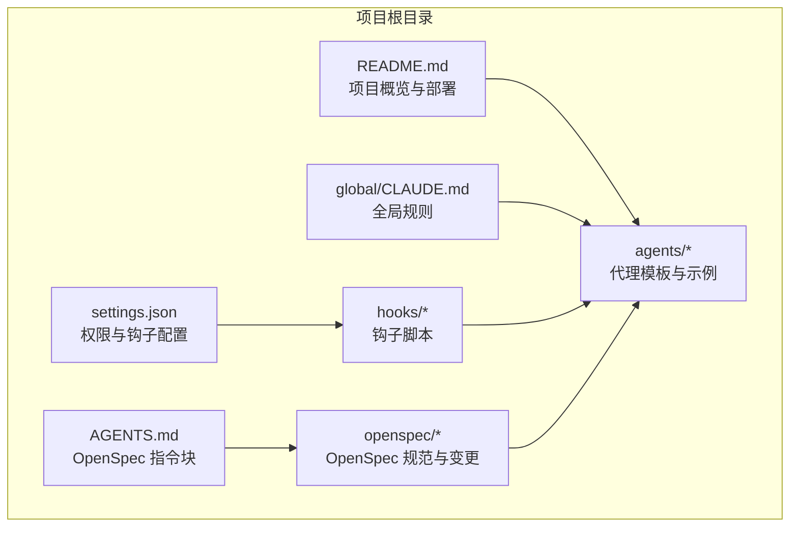
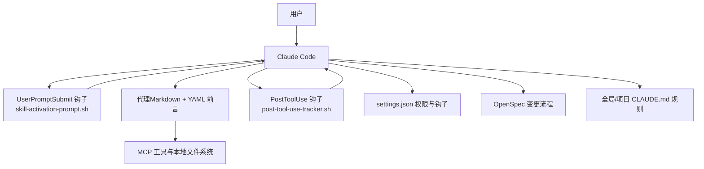
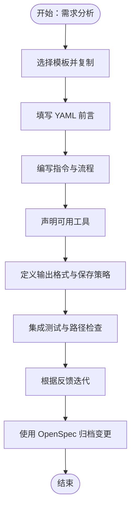
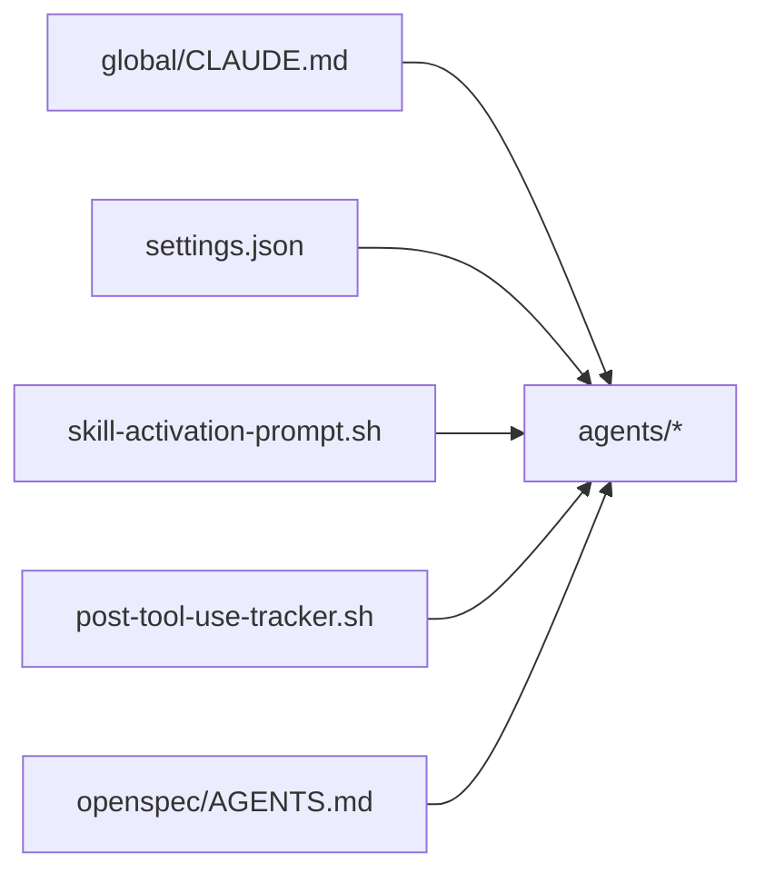

# 自定义代理开发

<cite>
**本文引用的文件**
- [README.md](file://README.md)
- [AGENTS.md](file://AGENTS.md)
- [agents/README.md](file://agents/README.md)
- [agents/code-architecture-reviewer.md](file://agents/code-architecture-reviewer.md)
- [agents/documentation-architect.md](file://agents/documentation-architect.md)
- [agents/auth-route-debugger.md](file://agents/auth-route-debugger.md)
- [agents/frontend-error-fixer.md](file://agents/frontend-error-fixer.md)
- [agents/auto-error-resolver.md](file://agents/auto-error-resolver.md)
- [agents/plan-reviewer.md](file://agents/plan-reviewer.md)
- [openspec/AGENTS.md](file://openspec/AGENTS.md)
- [settings.json](file://settings.json)
- [global/CLAUDE.md](file://global/CLAUDE.md)
- [hooks/post-tool-use-tracker.sh](file://hooks/post-tool-use-tracker.sh)
- [hooks/skill-activation-prompt.sh](file://hooks/skill-activation-prompt.sh)
</cite>

## 目录
1. [简介](#简介)
2. [项目结构](#项目结构)
3. [核心组件](#核心组件)
4. [架构总览](#架构总览)
5. [详细组件分析](#详细组件分析)
6. [依赖关系分析](#依赖关系分析)
7. [性能考虑](#性能考虑)
8. [故障排查指南](#故障排查指南)
9. [结论](#结论)
10. [附录](#附录)

## 简介
本指南面向希望在本项目中创建自定义代理（Agent）的开发者，系统讲解代理的标准格式、YAML 前言数据结构、必备组成部分，以及开发最佳实践（指令编写、工具使用、输出格式规范）。同时提供从概念到实现的完整开发示例、调试技巧、性能优化与部署策略，并说明版本管理与维护更新方式。

## 项目结构
本项目采用“多 AI 协同 + 规范驱动开发（SDD）”的工作流，代理位于 agents 目录，配合 OpenSpec 规范、全局与项目级 CLAUDE.md、hooks 机制、settings.json 配置共同构成完整的开发与执行体系。

图表来源
- [README.md](file://README.md#L71-L92)
- [AGENTS.md](file://AGENTS.md#L1-L18)
- [settings.json](file://settings.json#L1-L37)
- [global/CLAUDE.md](file://global/CLAUDE.md#L1-L147)
- [hooks/post-tool-use-tracker.sh](file://hooks/post-tool-use-tracker.sh#L1-L178)
- [openspec/AGENTS.md](file://openspec/AGENTS.md#L1-L457)

章节来源
- [README.md](file://README.md#L71-L92)
- [AGENTS.md](file://AGENTS.md#L1-L18)
- [settings.json](file://settings.json#L1-L37)
- [global/CLAUDE.md](file://global/CLAUDE.md#L1-L147)

## 核心组件
- 代理（Agent）：Markdown 文件，支持可选 YAML 前言，定义名称、描述、模型、颜色等元信息，以及角色设定、指令、可用工具、期望输出等。
- OpenSpec：规范驱动开发框架，提供变更提案、设计、任务清单与归档流程，确保变更受控与可追溯。
- 全局与项目级 CLAUDE.md：定义全局行为规则、工具使用、多 AI 协同、交叉检查等。
- Hooks：在用户提交提示、工具使用后触发，辅助技能激活、编辑跟踪与后续处理。
- settings.json：配置权限、默认模式与钩子注册，控制代理运行时行为。

章节来源
- [agents/README.md](file://agents/README.md#L240-L266)
- [openspec/AGENTS.md](file://openspec/AGENTS.md#L1-L457)
- [global/CLAUDE.md](file://global/CLAUDE.md#L60-L133)
- [settings.json](file://settings.json#L13-L35)

## 架构总览
下图展示了代理在本项目中的运行架构：用户通过 Claude Code 调用代理；代理在独立上下文中执行，按需使用 MCP 工具与本地文件系统；hooks 与 settings.json 提供权限与自动化支持；OpenSpec 保障变更的规范性与可追溯性。

图表来源
- [hooks/skill-activation-prompt.sh](file://hooks/skill-activation-prompt.sh#L1-L6)
- [hooks/post-tool-use-tracker.sh](file://hooks/post-tool-use-tracker.sh#L1-L178)
- [settings.json](file://settings.json#L13-L35)
- [openspec/AGENTS.md](file://openspec/AGENTS.md#L15-L64)
- [global/CLAUDE.md](file://global/CLAUDE.md#L60-L133)

## 详细组件分析

### 代理标准格式与 YAML 前言
- 标准结构：标题、目的、指令、可用工具、期望输出等。
- YAML 前言（可选）：包含 name、description、model、color 等元信息；部分代理还声明 tools 列表。
- 示例参考：
  - [agents/code-architecture-reviewer.md](file://agents/code-architecture-reviewer.md#L1-L84)
  - [agents/documentation-architect.md](file://agents/documentation-architect.md#L1-L83)
  - [agents/auth-route-debugger.md](file://agents/auth-route-debugger.md#L1-L118)
  - [agents/frontend-error-fixer.md](file://agents/frontend-error-fixer.md#L1-L77)
  - [agents/auto-error-resolver.md](file://agents/auto-error-resolver.md#L1-L97)
  - [agents/plan-reviewer.md](file://agents/plan-reviewer.md#L1-L53)

章节来源
- [agents/README.md](file://agents/README.md#L240-L266)
- [agents/code-architecture-reviewer.md](file://agents/code-architecture-reviewer.md#L1-L84)
- [agents/documentation-architect.md](file://agents/documentation-architect.md#L1-L83)
- [agents/auth-route-debugger.md](file://agents/auth-route-debugger.md#L1-L118)
- [agents/frontend-error-fixer.md](file://agents/frontend-error-fixer.md#L1-L77)
- [agents/auto-error-resolver.md](file://agents/auto-error-resolver.md#L1-L97)
- [agents/plan-reviewer.md](file://agents/plan-reviewer.md#L1-L53)

### YAML 前言字段详解
- name：代理唯一标识，建议使用语义化名称。
- description：简述用途与触发场景，便于自动激活与检索。
- model：模型选择（如 sonnet、opus），可继承或显式指定。
- color：界面配色，便于识别。
- tools：代理可用工具列表（如 Read、Write、Edit、MultiEdit、Bash、浏览器工具等）。

章节来源
- [agents/code-architecture-reviewer.md](file://agents/code-architecture-reviewer.md#L2-L6)
- [agents/documentation-architect.md](file://agents/documentation-architect.md#L2-L6)
- [agents/auth-route-debugger.md](file://agents/auth-route-debugger.md#L2-L5)
- [agents/auto-error-resolver.md](file://agents/auto-error-resolver.md#L2-L5)

### 指令编写最佳实践
- 明确角色与职责：清晰定义代理的专业领域与边界。
- 结构化步骤：将复杂任务拆分为编号步骤，便于执行与回溯。
- 输出规范：明确返回格式、保存位置与命名约定。
- 工具清单：明确列出可用工具，避免未授权操作。
- 示例参考：
  - 架构评审：[agents/code-architecture-reviewer.md](file://agents/code-architecture-reviewer.md#L23-L81)
  - 文档架构：[agents/documentation-architect.md](file://agents/documentation-architect.md#L12-L82)
  - 前端错误修复：[agents/frontend-error-fixer.md](file://agents/frontend-error-fixer.md#L17-L77)
  - 认证路由调试：[agents/auth-route-debugger.md](file://agents/auth-route-debugger.md#L9-L118)
  - 错误解析与修复：[agents/auto-error-resolver.md](file://agents/auto-error-resolver.md#L9-L97)
  - 计划评审：[agents/plan-reviewer.md](file://agents/plan-reviewer.md#L8-L53)

章节来源
- [agents/code-architecture-reviewer.md](file://agents/code-architecture-reviewer.md#L23-L81)
- [agents/documentation-architect.md](file://agents/documentation-architect.md#L12-L82)
- [agents/frontend-error-fixer.md](file://agents/frontend-error-fixer.md#L17-L77)
- [agents/auth-route-debugger.md](file://agents/auth-route-debugger.md#L9-L118)
- [agents/auto-error-resolver.md](file://agents/auto-error-resolver.md#L9-L97)
- [agents/plan-reviewer.md](file://agents/plan-reviewer.md#L8-L53)

### 工具使用与输出格式规范
- 工具使用：代理应在指令中明确声明所需工具，并在执行前后进行验证。
- 输出格式：建议采用结构化报告，包含摘要、关键问题、改进建议、架构考量与后续步骤等。
- 保存策略：遵循项目规范，将结果保存至指定路径，便于后续审阅与归档。

章节来源
- [agents/code-architecture-reviewer.md](file://agents/code-architecture-reviewer.md#L63-L81)
- [agents/documentation-architect.md](file://agents/documentation-architect.md#L58-L82)
- [agents/auto-error-resolver.md](file://agents/auto-error-resolver.md#L55-L62)

### 创建新的代理文件
- 步骤
  1) 复制模板：从 agents 目录复制现有代理作为模板。
  2) 编写 YAML 前言：填写 name、description、model、color、tools 等。
  3) 设计指令：明确角色、步骤、工具与输出格式。
  4) 验证路径：检查是否存在硬编码路径，必要时替换为环境变量或相对路径。
  5) 集成测试：在项目中使用代理，观察执行效果与输出质量。
- 参考
  - [agents/README.md](file://agents/README.md#L149-L187)

章节来源
- [agents/README.md](file://agents/README.md#L149-L187)

### 配置代理参数
- 全局规则：由 global/CLAUDE.md 定义工具使用、多 AI 协同与交叉检查等。
- 项目设置：settings.json 控制权限、默认模式与钩子注册。
- 钩子机制：UserPromptSubmit 与 PostToolUse 钩子分别在提示提交前与工具使用后触发，辅助技能激活与编辑跟踪。

章节来源
- [global/CLAUDE.md](file://global/CLAUDE.md#L60-L133)
- [settings.json](file://settings.json#L13-L35)
- [hooks/skill-activation-prompt.sh](file://hooks/skill-activation-prompt.sh#L1-L6)
- [hooks/post-tool-use-tracker.sh](file://hooks/post-tool-use-tracker.sh#L1-L178)

### 测试代理功能
- 集成测试：将代理文件复制到项目 .claude/agents/ 目录，使用 Claude Code 调用代理执行任务。
- 路径检查：使用 grep 检查是否存在硬编码路径，必要时替换为 $CLAUDE_PROJECT_DIR 或相对路径。
- 故障排查：参考 agents/README.md 中的常见问题与修复方法。

章节来源
- [agents/README.md](file://agents/README.md#L149-L290)

### 完整开发示例：从概念到实现
- 场景：需要一个“前端错误修复代理”，用于诊断与修复前端构建与运行时错误。
- 步骤
  1) 概念设计：明确代理职责（构建错误、运行时错误、网络问题、样式渲染问题等）。
  2) 模板选择：基于 [agents/frontend-error-fixer.md](file://agents/frontend-error-fixer.md#L1-L77) 进行定制。
  3) YAML 前言：填写 name、description、model、color、tools。
  4) 指令细化：增加错误分类、诊断流程、截图工具使用、最小修复原则等。
  5) 输出规范：结构化报告，包含根因、重现步骤、修复方案、验证命令与文档更新。
  6) 集成测试：复制到项目 .claude/agents/，调用代理并验证输出。
  7) 版本管理：使用 OpenSpec 对变更进行规范管理与归档。

图表来源
- [agents/frontend-error-fixer.md](file://agents/frontend-error-fixer.md#L1-L77)
- [openspec/AGENTS.md](file://openspec/AGENTS.md#L15-L64)

## 依赖关系分析
- 代理依赖全局与项目级规则（global/CLAUDE.md）以确保工具使用与协作模式一致。
- hooks 与 settings.json 提供权限控制与自动化支持，影响代理执行环境。
- OpenSpec 为代理变更提供受控流程，确保规范性与可追溯性。

图表来源
- [global/CLAUDE.md](file://global/CLAUDE.md#L60-L133)
- [settings.json](file://settings.json#L13-L35)
- [hooks/skill-activation-prompt.sh](file://hooks/skill-activation-prompt.sh#L1-L6)
- [hooks/post-tool-use-tracker.sh](file://hooks/post-tool-use-tracker.sh#L1-L178)
- [openspec/AGENTS.md](file://openspec/AGENTS.md#L15-L64)

章节来源
- [global/CLAUDE.md](file://global/CLAUDE.md#L60-L133)
- [settings.json](file://settings.json#L13-L35)
- [hooks/post-tool-use-tracker.sh](file://hooks/post-tool-use-tracker.sh#L1-L178)
- [openspec/AGENTS.md](file://openspec/AGENTS.md#L15-L64)

## 性能考虑
- 最小化工具调用：仅在必要时调用 MCP 工具，避免冗余请求。
- 结果缓存：利用 hooks 记录受影响仓库与构建命令，减少重复计算。
- 输出结构化：便于快速审阅与定位问题，降低人工成本。
- 路径与环境变量：使用 $CLAUDE_PROJECT_DIR 等环境变量替代硬编码路径，提升可移植性。

章节来源
- [hooks/post-tool-use-tracker.sh](file://hooks/post-tool-use-tracker.sh#L28-L178)
- [agents/auto-error-resolver.md](file://agents/auto-error-resolver.md#L11-L36)

## 故障排查指南
- 代理未找到：检查 .claude/agents/ 下是否存在对应文件。
- 路径错误：使用 grep 检查硬编码路径，替换为 $CLAUDE_PROJECT_DIR 或相对路径。
- 工具权限不足：检查 settings.json 中权限配置与默认模式。
- 钩子未生效：确认 hooks 注册与执行权限，检查日志输出。

章节来源
- [agents/README.md](file://agents/README.md#L269-L290)
- [settings.json](file://settings.json#L13-L35)

## 结论
通过本指南，开发者可以基于现有代理模板与规范，快速创建符合项目标准的自定义代理。结合 OpenSpec 的变更管理、全局与项目级规则、hooks 与 settings.json 的配置，能够实现从概念到落地的一体化开发流程，并在保证质量的同时提升效率。

## 附录
- OpenSpec 变更流程：包含提案、设计、任务清单与归档的完整流程，确保变更受控与可追溯。
- 全局与项目级规则：定义工具使用、多 AI 协同、交叉检查与语言规范等。
- 钩子与设置：提供权限控制与自动化支持，辅助代理执行与结果追踪。

章节来源
- [openspec/AGENTS.md](file://openspec/AGENTS.md#L15-L64)
- [global/CLAUDE.md](file://global/CLAUDE.md#L60-L133)
- [settings.json](file://settings.json#L13-L35)