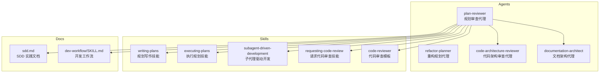
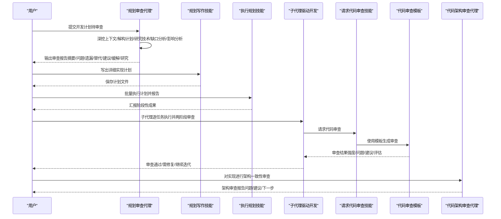
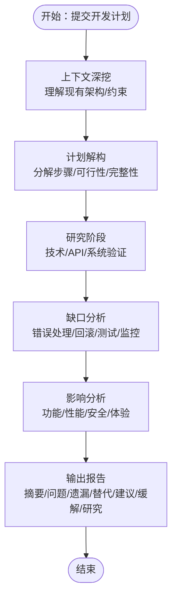
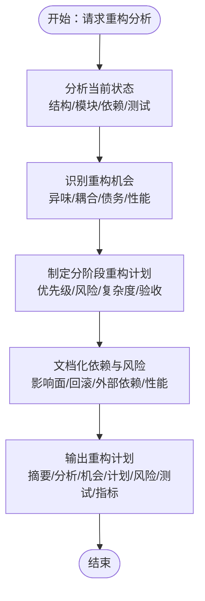
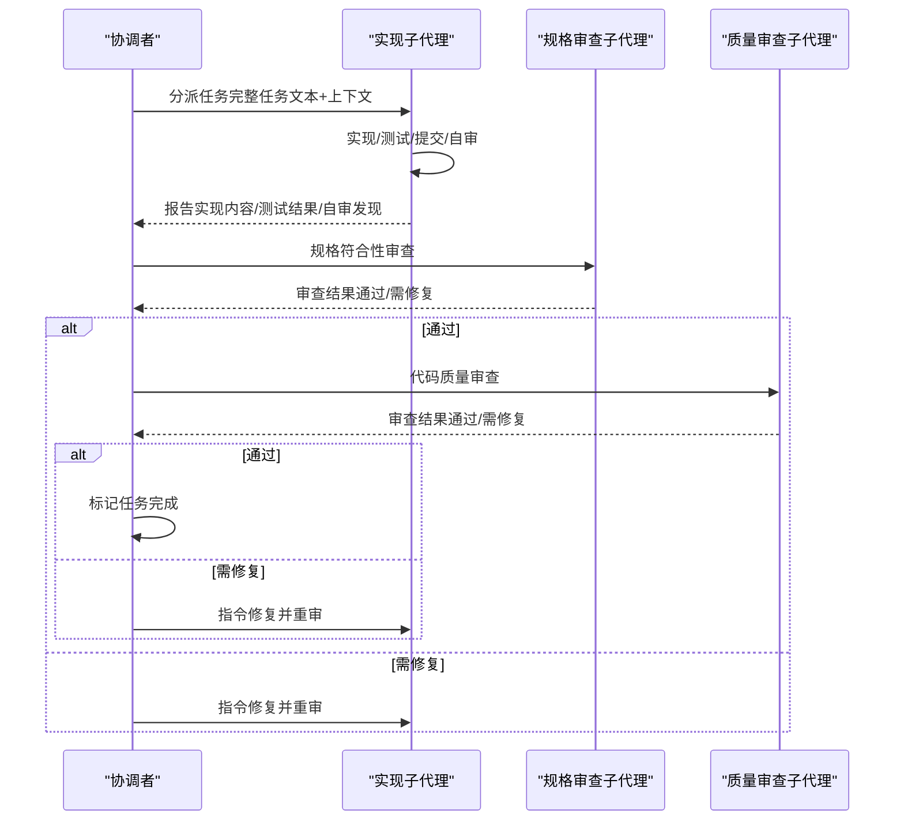
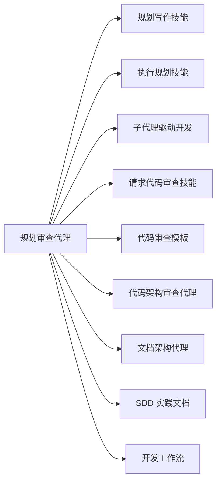

# 规划审查代理

<cite>
**本文档引用的文件**
- [agents/plan-reviewer.md](file://agents/plan-reviewer.md)
- [agents/refactor-planner.md](file://agents/refactor-planner.md)
- [global/codex-skills/writing-plans/SKILL.md](file://global/codex-skills/writing-plans/SKILL.md)
- [global/codex-skills/executing-plans/SKILL.md](file://global/codex-skills/executing-plans/SKILL.md)
- [global/codex-skills/subagent-driven-development/SKILL.md](file://global/codex-skills/subagent-driven-development/SKILL.md)
- [global/codex-skills/subagent-driven-development/implementer-prompt.md](file://global/codex-skills/subagent-driven-development/implementer-prompt.md)
- [global/codex-skills/subagent-driven-development/code-quality-reviewer-prompt.md](file://global/codex-skills/subagent-driven-development/code-quality-reviewer-prompt.md)
- [global/codex-skills/requesting-code-review/SKILL.md](file://global/codex-skills/requesting-code-review/SKILL.md)
- [global/codex-skills/requesting-code-review/code-reviewer.md](file://global/codex-skills/requesting-code-review/code-reviewer.md)
- [agents/code-architecture-reviewer.md](file://agents/code-architecture-reviewer.md)
- [agents/documentation-architect.md](file://agents/documentation-architect.md)
- [skills/dev-workflow/SKILL.md](file://skills/dev-workflow/SKILL.md)
- [docs/sdd.md](file://docs/sdd.md)
</cite>

## 目录
1. [简介](#简介)
2. [项目结构](#项目结构)
3. [核心组件](#核心组件)
4. [架构总览](#架构总览)
5. [详细组件分析](#详细组件分析)
6. [依赖分析](#依赖分析)
7. [性能考量](#性能考量)
8. [故障排查指南](#故障排查指南)
9. [结论](#结论)
10. [附录](#附录)

## 简介
规划审查代理（plan-reviewer）旨在在开发计划正式进入实现阶段前，对其进行系统性审查，识别潜在问题、遗漏的考虑因素以及更优的替代方案。其职责覆盖系统深度分析、数据库影响评估、依赖映射、替代方案评估与风险评估，并提供可操作的审查报告结构，确保变更在落地前具备稳健性与可执行性。

## 项目结构
本项目围绕“规范驱动开发（SDD）”与“子代理协同开发（Subagent-Driven Development）”两大范式组织，规划审查代理位于“agents”目录，配套技能与模板分布在“global/codex-skills”和“skills”目录中，贯穿从“规划写作—执行—审查—归档”的闭环。

图表来源
- [agents/plan-reviewer.md](file://agents/plan-reviewer.md#L1-L53)
- [agents/refactor-planner.md](file://agents/refactor-planner.md#L1-L63)
- [global/codex-skills/writing-plans/SKILL.md](file://global/codex-skills/writing-plans/SKILL.md#L1-L117)
- [global/codex-skills/executing-plans/SKILL.md](file://global/codex-skills/executing-plans/SKILL.md#L1-L77)
- [global/codex-skills/subagent-driven-development/SKILL.md](file://global/codex-skills/subagent-driven-development/SKILL.md#L1-L241)
- [global/codex-skills/requesting-code-review/SKILL.md](file://global/codex-skills/requesting-code-review/SKILL.md#L1-L106)
- [global/codex-skills/requesting-code-review/code-reviewer.md](file://global/codex-skills/requesting-code-review/code-reviewer.md#L1-L147)
- [agents/code-architecture-reviewer.md](file://agents/code-architecture-reviewer.md#L1-L84)
- [agents/documentation-architect.md](file://agents/documentation-architect.md#L1-L83)
- [skills/dev-workflow/SKILL.md](file://skills/dev-workflow/SKILL.md#L1-L397)
- [docs/sdd.md](file://docs/sdd.md#L1-L816)

章节来源
- [agents/plan-reviewer.md](file://agents/plan-reviewer.md#L1-L53)
- [docs/sdd.md](file://docs/sdd.md#L1-L816)

## 核心组件
- 角色定位与职责
  - 角色：高级技术计划审查员，擅长系统集成、数据库设计与软件工程最佳实践
  - 职责：深度系统分析、数据库影响评估、依赖映射、替代方案评估、风险评估
- 审查流程
  - 上下文深挖、计划解构、研究阶段、缺口分析、影响分析
- 关键审查领域
  - 认证/授权、数据库操作、API 集成、类型安全、错误处理、性能、安全、测试策略、回滚计划
- 输出要求
  - 执行摘要、关键问题、遗漏考虑、替代方案、实施建议、风险缓解、研究发现
- 质量标准
  - 仅标注真实问题、提供具体可行反馈、引用实际文档/限制/兼容性、建议实用替代、聚焦预防现实实现失败、考虑项目特定上下文与约束

章节来源
- [agents/plan-reviewer.md](file://agents/plan-reviewer.md#L8-L53)

## 架构总览
规划审查代理在整体工作流中的位置与协作关系如下：

图表来源
- [agents/plan-reviewer.md](file://agents/plan-reviewer.md#L17-L22)
- [global/codex-skills/writing-plans/SKILL.md](file://global/codex-skills/writing-plans/SKILL.md#L18-L19)
- [global/codex-skills/executing-plans/SKILL.md](file://global/codex-skills/executing-plans/SKILL.md#L16-L44)
- [global/codex-skills/subagent-driven-development/SKILL.md](file://global/codex-skills/subagent-driven-development/SKILL.md#L38-L83)
- [global/codex-skills/requesting-code-review/SKILL.md](file://global/codex-skills/requesting-code-review/SKILL.md#L24-L48)
- [global/codex-skills/requesting-code-review/code-reviewer.md](file://global/codex-skills/requesting-code-review/code-reviewer.md#L63-L93)
- [agents/code-architecture-reviewer.md](file://agents/code-architecture-reviewer.md#L23-L81)

## 详细组件分析

### 规划审查代理（plan-reviewer）
- 设计目的
  - 在实现前识别计划中的缺陷、遗漏与可改进点，防止昂贵的实现错误
- 核心功能
  - 系统/技术/组件兼容性验证
  - 数据库影响（模式/性能/迁移/数据完整性）
  - 显隐依赖映射与版本冲突检测
  - 替代方案评估与简化/可维护性改进
  - 风险识别（故障点、边界情况、崩溃场景）
- 审查流程与评估标准
  - 上下文深挖、计划解构、研究阶段、缺口分析、影响分析
  - 评估维度：认证/授权、数据库、API 集成、类型安全、错误处理、性能、安全、测试、回滚
  - 输出结构：摘要、关键问题、遗漏考虑、替代方案、实施建议、风险缓解、研究发现
- 决策机制
  - 基于证据与项目上下文进行技术判断，优先预防现实世界实现失败
- 配置与参数
  - 通过提示词模板定义审查维度与输出格式（见“输出要求/质量标准”）
- 与重构规划代理的协作
  - 规划审查代理关注“做什么/为何做/如何做”的可行性与风险
  - 重构规划代理关注“现有代码结构/债务/可维护性”的系统性改进
  - 两者共同确保变更在“正确地做”和“把事情做得更好”两个维度上都得到保障

图表来源
- [agents/plan-reviewer.md](file://agents/plan-reviewer.md#L17-L22)

章节来源
- [agents/plan-reviewer.md](file://agents/plan-reviewer.md#L8-L53)

### 重构规划代理（refactor-planner）
- 设计目的
  - 主动分析代码结构，创建系统性重构计划，平衡理想与务实
- 核心职责
  - 当前代码库结构分析、代码异味识别、重构机会挖掘、分阶段计划制定、依赖与风险文档化
- 输出结构
  - 执行摘要、现状分析、问题与机会、重构计划（分阶段）、风险评估与缓解、测试策略、成功指标
- 与规划审查代理的关系
  - 规划审查代理偏向“变更的可行性与风险”，重构规划代理偏向“现有实现的可维护性与演进”
  - 两者协同：先用规划审查代理把关变更，再用重构规划代理优化实现

图表来源
- [agents/refactor-planner.md](file://agents/refactor-planner.md#L9-L40)

章节来源
- [agents/refactor-planner.md](file://agents/refactor-planner.md#L1-L63)

### 子代理驱动开发（Subagent-Driven Development）
- 设计目的
  - 在同一会话内以“逐任务+两阶段审查”的方式，实现高质、快速迭代
- 关键流程
  - 每任务：实现子代理（按完整任务文本与上下文执行）→ 规格符合性审查 → 代码质量审查 → 标记完成
  - 循环直至全部任务完成，最后进行整体会审
- 与规划审查代理的衔接
  - 规划审查代理在“写计划”阶段提供高层视角与风险识别
  - 子代理驱动开发在“执行阶段”确保每一步都符合规格与质量标准

图表来源
- [global/codex-skills/subagent-driven-development/SKILL.md](file://global/codex-skills/subagent-driven-development/SKILL.md#L38-L83)
- [global/codex-skills/subagent-driven-development/implementer-prompt.md](file://global/codex-skills/subagent-driven-development/implementer-prompt.md#L1-L79)
- [global/codex-skills/subagent-driven-development/code-quality-reviewer-prompt.md](file://global/codex-skills/subagent-driven-development/code-quality-reviewer-prompt.md#L1-L21)

章节来源
- [global/codex-skills/subagent-driven-development/SKILL.md](file://global/codex-skills/subagent-driven-development/SKILL.md#L1-L241)
- [global/codex-skills/subagent-driven-development/implementer-prompt.md](file://global/codex-skills/subagent-driven-development/implementer-prompt.md#L1-L79)
- [global/codex-skills/subagent-driven-development/code-quality-reviewer-prompt.md](file://global/codex-skills/subagent-driven-development/code-quality-reviewer-prompt.md#L1-L21)

### 代码架构审查代理（code-architecture-reviewer）
- 设计目的
  - 对近期实现进行最佳实践与架构一致性审查，确保与项目标准与系统架构一致
- 关注点
  - 实现质量、设计决策、系统集成、架构契合、技术栈规范、反馈与保存
- 与规划审查代理的协作
  - 规划审查代理负责“变更层面”的风险与可行性，代码架构审查代理负责“实现层面”的质量与一致性

章节来源
- [agents/code-architecture-reviewer.md](file://agents/code-architecture-reviewer.md#L1-L84)

### 文档架构代理（documentation-architect）
- 设计目的
  - 创建/更新/增强文档，覆盖开发者文档、README、API 文档、数据流图、测试文档与架构概览
- 方法论
  - 发现阶段→分析阶段→文档阶段→质量保证→输出与归档
- 与规划审查代理的协作
  - 规划审查代理在审查后可联动文档架构代理，将审查结论与建议纳入文档，形成闭环

章节来源
- [agents/documentation-architect.md](file://agents/documentation-architect.md#L1-L83)

### 开发工作流（dev-workflow）
- 设计目的
  - 强制阶段顺序（需求→设计→实现→审查→测试），规范文档保存与进度跟踪
- 与规划审查代理的衔接
  - 规划审查代理的结论可作为“设计/实现/审查”阶段的输入，确保阶段过渡有据可依

章节来源
- [skills/dev-workflow/SKILL.md](file://skills/dev-workflow/SKILL.md#L28-L50)

## 依赖分析
- 直接依赖
  - 规划写作技能：生成可执行的实现计划
  - 执行规划技能：批量执行计划并设置审查检查点
  - 子代理驱动开发：在同一会话内逐任务执行与两阶段审查
  - 请求代码审查技能与代码审查模板：生成标准化审查报告
  - 代码架构审查代理：对实现进行架构一致性审查
  - 文档架构代理：将审查结论与建议纳入文档
- 间接依赖
  - SDD 实践文档：提供规范驱动开发的背景与方法论
  - 开发工作流：确保阶段过渡与文档保存的规范化

图表来源
- [agents/plan-reviewer.md](file://agents/plan-reviewer.md#L1-L53)
- [global/codex-skills/writing-plans/SKILL.md](file://global/codex-skills/writing-plans/SKILL.md#L1-L117)
- [global/codex-skills/executing-plans/SKILL.md](file://global/codex-skills/executing-plans/SKILL.md#L1-L77)
- [global/codex-skills/subagent-driven-development/SKILL.md](file://global/codex-skills/subagent-driven-development/SKILL.md#L1-L241)
- [global/codex-skills/requesting-code-review/SKILL.md](file://global/codex-skills/requesting-code-review/SKILL.md#L1-L106)
- [global/codex-skills/requesting-code-review/code-reviewer.md](file://global/codex-skills/requesting-code-review/code-reviewer.md#L1-L147)
- [agents/code-architecture-reviewer.md](file://agents/code-architecture-reviewer.md#L1-L84)
- [agents/documentation-architect.md](file://agents/documentation-architect.md#L1-L83)
- [skills/dev-workflow/SKILL.md](file://skills/dev-workflow/SKILL.md#L1-L397)
- [docs/sdd.md](file://docs/sdd.md#L1-L816)

## 性能考量
- 审查效率
  - 通过明确的审查维度与输出结构，减少反复沟通与返工
  - 将“替代方案评估”前置，避免实现后才发现更优路径
- 执行效率
  - 子代理驱动开发以“逐任务+两阶段审查”降低阻塞与返工成本
  - 批量执行与检查点机制缩短反馈周期
- 资源占用
  - 依赖模板化与自动化（如代码审查模板）减少手工劳动
  - 文档架构代理集中化文档管理，便于检索与复用

## 故障排查指南
- 常见问题与对策
  - 审查结论与实现存在偏差：通过“请求代码审查技能+代码审查模板”进行对比验证
  - 任务执行中止：依据“执行规划技能”的停止条件及时停顿并寻求澄清
  - 规模化协作中的上下文污染：使用“子代理驱动开发”的“逐任务+两阶段审查”避免上下文混淆
- 推荐流程
  - 规划审查代理输出“关键问题/遗漏考虑/替代方案/风险缓解”
  - 写出“实现计划”并按“执行规划技能”批次执行
  - 每批次完成后通过“请求代码审查技能+代码审查模板”进行质量把关
  - 最终由“代码架构审查代理”进行架构一致性审查
  - 将审查结论纳入“文档架构代理”文档，形成闭环

章节来源
- [global/codex-skills/executing-plans/SKILL.md](file://global/codex-skills/executing-plans/SKILL.md#L52-L77)
- [global/codex-skills/requesting-code-review/SKILL.md](file://global/codex-skills/requesting-code-review/SKILL.md#L92-L106)
- [global/codex-skills/requesting-code-review/code-reviewer.md](file://global/codex-skills/requesting-code-review/code-reviewer.md#L94-L109)
- [agents/code-architecture-reviewer.md](file://agents/code-architecture-reviewer.md#L57-L81)

## 结论
规划审查代理通过系统化的审查流程与明确的评估维度，为开发计划提供了“实现前”的质量与风险把关。结合重构规划代理、子代理驱动开发、代码审查与架构审查，以及文档与工作流规范，形成从“规划—实现—审查—归档”的闭环，显著降低实现风险并提升交付质量。

## 附录
- 使用示例（概念性说明）
  - 示例A：认证系统集成
    - 场景：用户提交“将 Auth0 与现有 Keycloak 集成”的计划
    - 规划审查代理：验证认证系统兼容性、令牌处理、会话管理、回滚策略与测试策略
    - 后续：写出实现计划→子代理驱动开发→两阶段审查→架构审查→文档归档
  - 示例B：数据库迁移
    - 场景：用户提交“将用户数据迁移到新 schema”的计划
    - 规划审查代理：评估迁移策略、索引/约束/扩展性、事务与数据校验
    - 后续：写出实现计划→批量执行→代码审查→架构审查→文档归档
- 规划优化建议
  - 在规划阶段明确“错误处理/回滚/测试/监控/性能/安全”等维度
  - 优先采用“替代方案评估”，避免陷入技术陷阱
  - 将“风险缓解”与“实施建议”同步纳入计划与审查报告
- 实施策略
  - 以“SDD 实践文档”为方法论支撑，确保“规范先行”
  - 以“开发工作流”为阶段控制，确保“阶段有序”
  - 以“子代理驱动开发”为执行手段，确保“质量可控”
- 质量保证措施
  - 标准化输出结构与审查模板，确保可比性与可追溯性
  - 两阶段审查（规格符合性→代码质量）与最终架构审查
  - 文档化审查结论，形成知识沉淀与复用