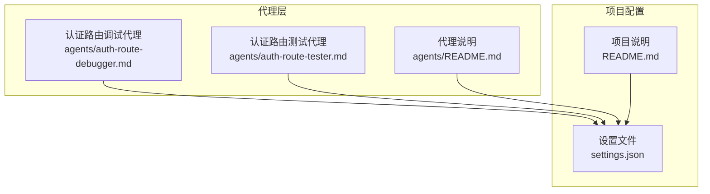
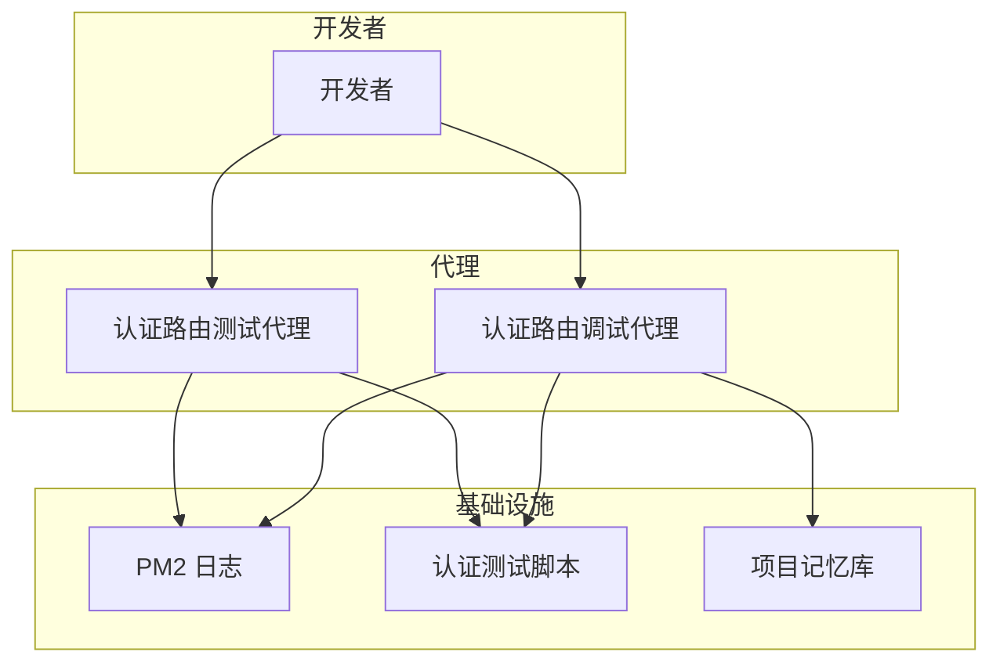
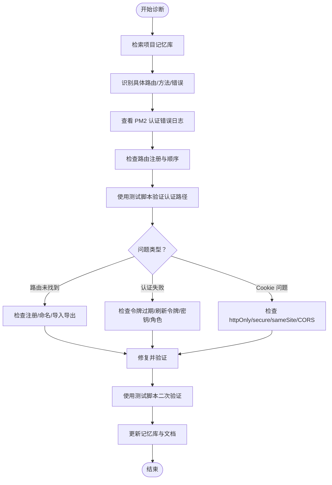
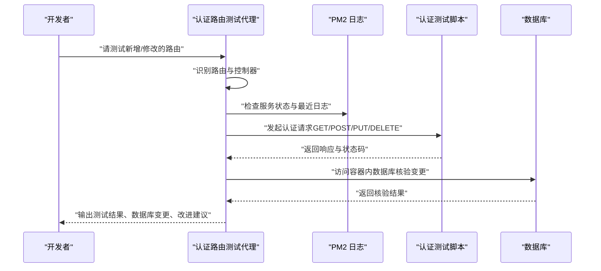
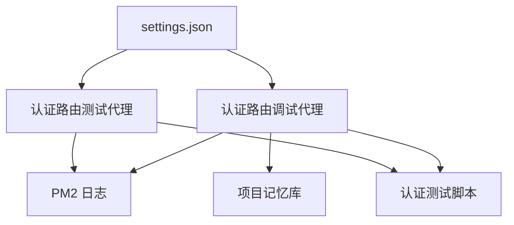

# 认证相关代理

<cite>
**本文引用的文件**
- [agents/auth-route-debugger.md](file://agents/auth-route-debugger.md)
- [agents/auth-route-tester.md](file://agents/auth-route-tester.md)
- [agents/README.md](file://agents/README.md)
- [settings.json](file://settings.json)
- [README.md](file://README.md)
</cite>

## 目录
1. [简介](#简介)
2. [项目结构](#项目结构)
3. [核心组件](#核心组件)
4. [架构总览](#架构总览)
5. [详细组件分析](#详细组件分析)
6. [依赖关系分析](#依赖关系分析)
7. [性能考量](#性能考量)
8. [故障排除指南](#故障排除指南)
9. [结论](#结论)
10. [附录](#附录)

## 简介
本文件面向“认证相关代理”的技术文档，聚焦两类代理：
- 认证路由调试代理：用于定位与解决认证相关问题（如 401/403、Cookie 异常、JWT 刷新令牌问题、路由注册冲突等），并基于项目中的 Keycloak/Express.js SSO 中间件与 Cookie 认证模式进行诊断与修复。
- 认证路由测试代理：用于在实现或修改路由后，验证其在真实环境下的功能表现，包括数据持久化、响应正确性与潜在改进点。

两类代理均以“可即用”的 Markdown 文件形式存在，无需额外安装即可直接使用；同时它们都要求具备基于 JWT 的 Cookie 认证能力，并提供标准化的测试与排障流程。

## 项目结构
- 代理位于 agents/ 目录下，包含认证路由调试与测试两个独立代理文件，以及通用的代理说明文档。
- 项目根目录提供全局设置与整体介绍，便于理解代理的运行环境与权限配置。

图表来源
- [agents/auth-route-debugger.md](file://agents/auth-route-debugger.md#L1-L118)
- [agents/auth-route-tester.md](file://agents/auth-route-tester.md#L1-L94)
- [agents/README.md](file://agents/README.md#L1-L301)
- [settings.json](file://settings.json#L1-L37)
- [README.md](file://README.md#L1-L229)

章节来源
- [agents/README.md](file://agents/README.md#L1-L301)
- [README.md](file://README.md#L71-L93)

## 核心组件
- 认证路由调试代理
  - 职责：诊断认证失败、Cookie 问题、JWT 刷新令牌校验、中间件配置与路由注册冲突；使用提供的测试脚本验证受保护路由行为；检查项目记忆库以复用过往解决方案。
  - 关键技术要点：期望刷新令牌位于名为 refresh_token 的 Cookie 中；用户声明信息存储于 res.locals.claims；默认开发凭据与 Keycloak Realm/Client 名称；路由需兼容 Cookie 认证与可能的 Bearer 令牌回退。
- 认证路由测试代理
  - 职责：验证路由在成功场景下的端到端行为，关注数据持久化与响应正确性；对实现进行质量评估与改进建议；提供日志监控与临时调试手段。
  - 关键技术要点：基于 Cookie 的认证系统；使用统一的认证测试脚本；必要时通过测试数据生成器准备测试数据；通过 Docker 访问数据库核验变更。

章节来源
- [agents/auth-route-debugger.md](file://agents/auth-route-debugger.md#L7-L118)
- [agents/auth-route-tester.md](file://agents/auth-route-tester.md#L8-L94)

## 架构总览
两类代理在项目中扮演“问题发现者”和“验证执行者”的角色，配合统一的测试脚本与日志监控，形成闭环的认证问题诊断与验证流程。

图表来源
- [agents/auth-route-debugger.md](file://agents/auth-route-debugger.md#L27-L36)
- [agents/auth-route-tester.md](file://agents/auth-route-tester.md#L52-L61)

## 详细组件分析

### 认证路由调试代理（auth-route-debugger）
- 设计目的
  - 面向 Keycloak/Express.js 场景，专门处理 Cookie 基础的 JWT 刷新令牌认证问题，快速定位 401/403、路由未找到、中间件顺序与命名冲突等问题。
- 核心功能
  - 初始评估：检索项目记忆库，明确问题范围与错误类型。
  - 实时日志：通过 PM2 实时/历史日志定位认证错误。
  - 路由注册检查：确认 app.ts 中路由注册、顺序与命名冲突。
  - 认证测试：使用测试脚本验证带认证与不带认证的差异，定位 Cookie/JWT/Bearer 回退等环节。
  - 常见问题排查清单：路由未找到、认证失败、Cookie 传输问题。
  - 文档更新：记录问题、解决方案与配置变更，沉淀经验。
- 关键技术细节
  - SSO 中间件期望 refresh_token Cookie 中包含 JWT 签名的刷新令牌。
  - 用户声明（用户名、邮箱、角色）存放在 res.locals.claims。
  - 默认开发凭据与 Keycloak Realm/Client 名称。
  - 路由需同时支持 Cookie 认证与 Bearer 令牌回退。

图表来源
- [agents/auth-route-debugger.md](file://agents/auth-route-debugger.md#L21-L97)

章节来源
- [agents/auth-route-debugger.md](file://agents/auth-route-debugger.md#L9-L118)

### 认证路由测试代理（auth-route-tester）
- 设计目的
  - 在路由实现或修改后，验证其在真实环境下的功能表现，确保数据持久化与响应正确性，并提供代码实现层面的质量评估与改进建议。
- 核心功能
  - 路由测试协议：根据上下文识别新增或修改的路由，理解控制器预期行为，优先关注成功场景。
  - 功能性测试：使用统一的认证测试脚本发起请求；按需通过测试数据生成器准备数据；通过 Docker 访问数据库核验变更。
  - 实现评审：检查错误处理、数据库查询效率、安全漏洞、组织结构与最佳实践契合度。
  - 调试方法论：添加临时日志跟踪成功路径，使用 PM2 查看日志，完成后清理临时日志。
  - 测试流程：确认服务运行、准备测试数据、认证测试、核验数据库变更、记录结果与改进建议。
- 关键技术细节
  - 基于 Cookie 的认证系统。
  - 统一缩进与通知组件约定。
  - 数据库表名与客户端字段命名差异提示。

图表来源
- [agents/auth-route-tester.md](file://agents/auth-route-tester.md#L19-L69)

章节来源
- [agents/auth-route-tester.md](file://agents/auth-route-tester.md#L10-L94)

### 代理集成与使用示例
- 代理文件可直接复制到项目 .claude/agents/ 下使用，无需额外安装。
- 对于需要 JWT Cookie 认证的代理，需先确认服务 URL 与认证配置，再按代理说明进行操作。
- 示例场景
  - 调试 401/403：使用认证路由调试代理，结合 PM2 日志与测试脚本定位刷新令牌、角色权限或 Cookie 配置问题。
  - 验证路由功能：使用认证路由测试代理，准备测试数据并通过数据库核验确认持久化逻辑正确。

章节来源
- [agents/README.md](file://agents/README.md#L149-L187)
- [agents/auth-route-debugger.md](file://agents/auth-route-debugger.md#L44-L57)
- [agents/auth-route-tester.md](file://agents/auth-route-tester.md#L21-L39)

## 依赖关系分析
- 代理与项目设置
  - 代理运行依赖项目级设置（如权限与钩子），确保代理具备编辑与工具调用能力。
- 代理与基础设施
  - 代理依赖 PM2 日志进行实时与历史错误定位。
  - 代理依赖统一的认证测试脚本进行端到端验证。
  - 代理依赖项目记忆库沉淀经验，避免重复问题。
- 代理与文档
  - 代理说明文档提供使用方法、定制化注意事项与故障排除指引。

图表来源
- [settings.json](file://settings.json#L1-L37)
- [agents/auth-route-debugger.md](file://agents/auth-route-debugger.md#L27-L36)
- [agents/auth-route-tester.md](file://agents/auth-route-tester.md#L52-L59)

章节来源
- [settings.json](file://settings.json#L1-L37)
- [agents/README.md](file://agents/README.md#L149-L187)

## 性能考量
- 日志监控与过滤：优先使用 PM2 的行数限制与服务筛选，减少无关日志干扰，提升定位效率。
- 测试脚本复用：统一使用认证测试脚本，避免重复构造请求，降低测试成本。
- 数据库核验：通过容器内数据库访问进行批量核验，减少手工查询时间。
- 临时日志清理：测试完成后及时清理临时日志，避免影响生产日志分析。

## 故障排除指南
- 常见问题与排查步骤
  - 路由未找到（404）
    - 检查 app.ts 中是否正确注册、是否存在通配符路由覆盖、是否存在命名冲突。
    - 查看 PM2 启动日志以确认注册顺序与启动错误。
  - 认证失败（401/403）
    - 检查刷新令牌是否过期、格式是否正确、密钥配置是否一致。
    - 核对用户角色/权限是否满足路由要求。
  - Cookie 传输问题
    - 检查 httpOnly、secure、sameSite 等属性与 CORS 配置。
    - 开发与生产环境的 Cookie 设置差异可能导致跨域携带失败。
- 诊断流程建议
  - 先用“无认证”模式测试，确认是否为认证环节导致的问题。
  - 结合 PM2 日志与测试脚本，逐步缩小问题范围。
  - 将解决方案与配置变更记录至项目记忆库与文档，便于后续复用。

章节来源
- [agents/auth-route-debugger.md](file://agents/auth-route-debugger.md#L60-L79)
- [agents/auth-route-debugger.md](file://agents/auth-route-debugger.md#L27-L36)
- [agents/auth-route-debugger.md](file://agents/auth-route-debugger.md#L44-L57)

## 结论
认证相关代理为项目提供了系统化的认证问题诊断与功能验证能力。通过统一的日志监控、测试脚本与记忆库沉淀，调试代理能够快速定位并修复认证链路中的关键问题，测试代理则确保路由在真实环境下的正确性与稳定性。建议在日常开发中结合这两类代理，建立“实现—测试—验证—沉淀”的闭环流程，持续提升认证系统的可靠性与可维护性。

## 附录
- 术语
  - JWT：JSON Web Token，用于在各方之间安全地传输信息。
  - Refresh Token：刷新令牌，用于在访问令牌过期后换取新的访问令牌。
  - SSO：单点登录，集中式身份认证与授权。
  - PM2：Node.js 应用进程管理器，提供日志与进程监控。
- 最佳实践
  - 明确区分 Cookie 认证与 Bearer 令牌回退，避免混淆。
  - 在开发与生产环境中分别验证 Cookie 属性与 CORS 配置。
  - 使用统一的测试脚本与日志策略，减少环境差异带来的误差。
  - 将每次修复与配置变更纳入记忆库，形成知识资产。