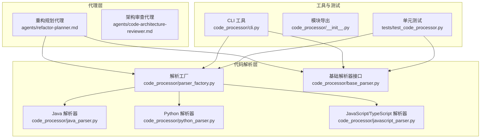
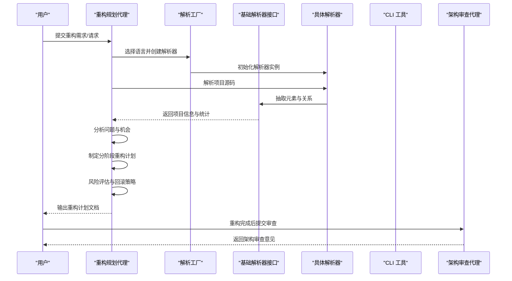
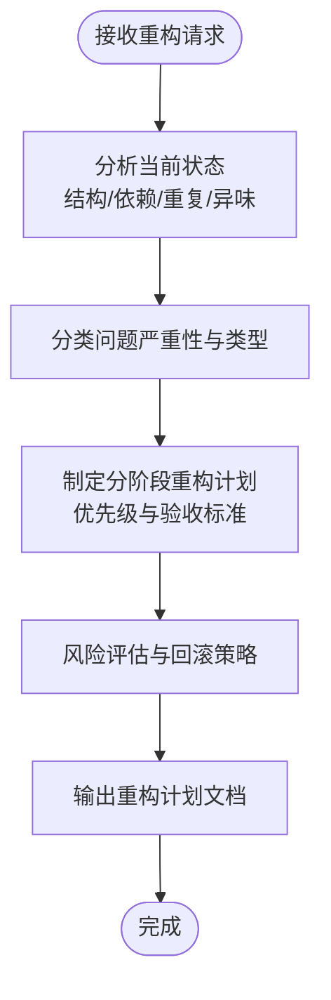
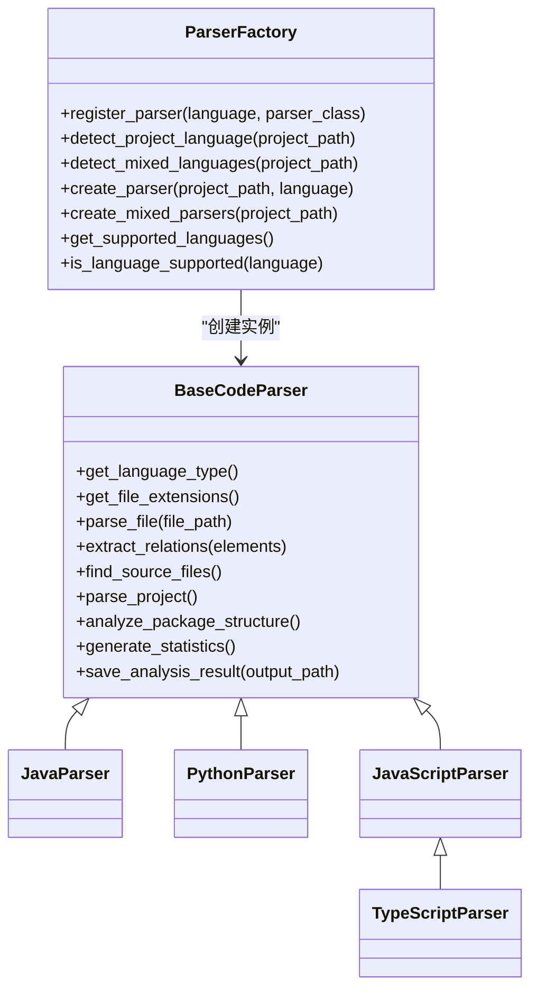
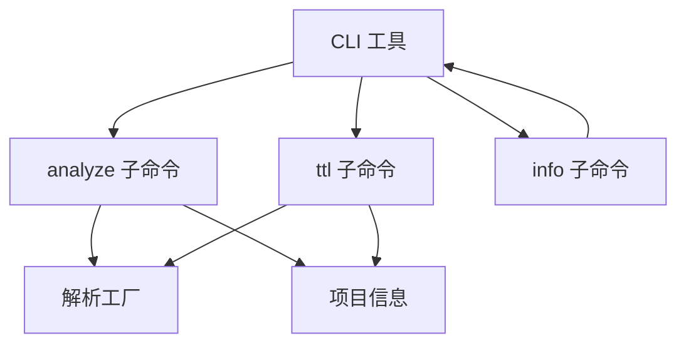
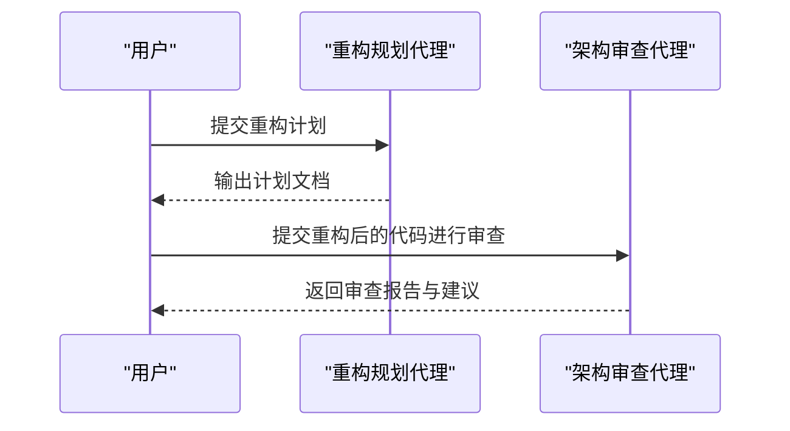
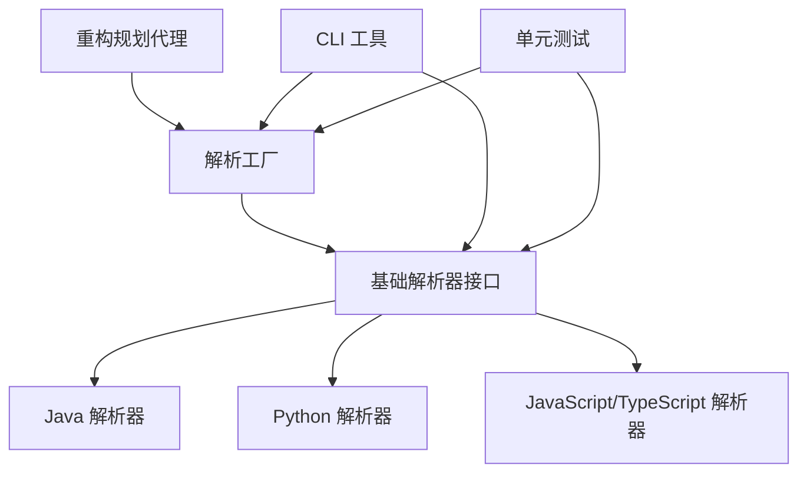

# 重构规划代理

<cite>
**本文引用的文件列表**
- [refactor-planner.md](file://agents/refactor-planner.md)
- [code-architecture-reviewer.md](file://agents/code-architecture-reviewer.md)
- [base_parser.py](file://code_processor/base_parser.py)
- [parser_factory.py](file://code_processor/parser_factory.py)
- [java_parser.py](file://code_processor/java_parser.py)
- [python_parser.py](file://code_processor/python_parser.py)
- [javascript_parser.py](file://code_processor/javascript_parser.py)
- [cli.py](file://code_processor/cli.py)
- [__init__.py](file://code_processor/__init__.py)
- [test_code_processor.py](file://tests/test_code_processor.py)
- [settings.json](file://settings.json)
- [README.md](file://README.md)
</cite>

## 目录
1. [简介](#简介)
2. [项目结构](#项目结构)
3. [核心组件](#核心组件)
4. [架构总览](#架构总览)
5. [详细组件分析](#详细组件分析)
6. [依赖关系分析](#依赖关系分析)
7. [性能考量](#性能考量)
8. [故障排查指南](#故障排查指南)
9. [结论](#结论)
10. [附录](#附录)

## 简介
重构规划代理是一个面向代码重构的智能代理，旨在对现有代码进行系统性分析，识别重构机会，并输出可执行的分阶段重构计划。它结合代码结构解析能力与架构审查能力，帮助团队在可控风险下推进代码现代化与架构优化。该代理支持多种编程语言（Java、Python、JavaScript/TypeScript），并提供风险评估、回滚策略与质量保障建议，确保重构过程安全、可追踪、可验证。

## 项目结构
重构规划代理位于 agents 目录中，配套的代码解析与分析能力由 code_processor 模块提供，CLI 工具用于批量分析与结果导出。整体结构如下图所示：

**图表来源**
- [refactor-planner.md](file://agents/refactor-planner.md#L1-L63)
- [code-architecture-reviewer.md](file://agents/code-architecture-reviewer.md#L1-L84)
- [parser_factory.py](file://code_processor/parser_factory.py#L1-L248)
- [base_parser.py](file://code_processor/base_parser.py#L1-L358)
- [java_parser.py](file://code_processor/java_parser.py#L1-L425)
- [python_parser.py](file://code_processor/python_parser.py#L1-L455)
- [javascript_parser.py](file://code_processor/javascript_parser.py#L1-L548)
- [cli.py](file://code_processor/cli.py#L1-L215)
- [__init__.py](file://code_processor/__init__.py#L1-L40)
- [test_code_processor.py](file://tests/test_code_processor.py#L1-L139)

**章节来源**
- [refactor-planner.md](file://agents/refactor-planner.md#L1-L63)
- [code-architecture-reviewer.md](file://agents/code-architecture-reviewer.md#L1-L84)
- [parser_factory.py](file://code_processor/parser_factory.py#L1-L248)
- [base_parser.py](file://code_processor/base_parser.py#L1-L358)
- [cli.py](file://code_processor/cli.py#L1-L215)

## 核心组件
- 重构规划代理：负责分析当前代码状态、识别重构机会、制定分阶段计划、评估风险与回滚策略，并输出可执行的重构文档。
- 架构审查代理：在重构完成后或过程中，对代码实现进行架构一致性与最佳实践审查，确保重构符合项目标准与系统集成要求。
- 代码解析器与工厂：提供多语言代码解析、关系抽取、统计分析与结果保存能力，支撑重构规划的数据基础。
- CLI 工具：提供命令行入口，支持单语言/混合语言分析、JSON/TTL 导出等。

**章节来源**
- [refactor-planner.md](file://agents/refactor-planner.md#L7-L63)
- [code-architecture-reviewer.md](file://agents/code-architecture-reviewer.md#L8-L84)
- [parser_factory.py](file://code_processor/parser_factory.py#L20-L171)
- [base_parser.py](file://code_processor/base_parser.py#L206-L358)
- [cli.py](file://code_processor/cli.py#L32-L164)

## 架构总览
重构规划代理的工作流分为“分析—规划—评估—输出”四个阶段，结合代码解析器与架构审查代理形成闭环：

**图表来源**
- [refactor-planner.md](file://agents/refactor-planner.md#L9-L63)
- [parser_factory.py](file://code_processor/parser_factory.py#L122-L171)
- [base_parser.py](file://code_processor/base_parser.py#L263-L298)
- [cli.py](file://code_processor/cli.py#L32-L101)
- [code-architecture-reviewer.md](file://agents/code-architecture-reviewer.md#L23-L84)

## 详细组件分析

### 重构规划代理（refactor-planner.md）
- 设计目的：主动识别代码结构问题、重复模式与架构债务，提供可落地的重构路线图。
- 核心职责：
  - 分析当前代码库结构、模块边界、依赖关系与测试覆盖。
  - 识别代码异味（如长方法、大类、特征嫉妒）、重复与紧耦合。
  - 制定分阶段重构计划，优先级基于影响、风险与价值。
  - 文档化依赖与风险，提供回滚策略与性能影响评估。
- 输出规范：按固定结构输出，包含摘要、现状分析、问题与机会、重构计划（含阶段）、风险与缓解、测试策略、成功指标等。

**图表来源**
- [refactor-planner.md](file://agents/refactor-planner.md#L9-L63)

**章节来源**
- [refactor-planner.md](file://agents/refactor-planner.md#L7-L63)

### 代码解析器与工厂（base_parser.py, parser_factory.py）
- 基础解析器接口（BaseCodeParser）：
  - 统一抽象：语言类型、元素类型、关系类型、项目信息结构。
  - 文件发现与解析：自动扫描源文件、排除无关目录、解析每个文件并收集元素与关系。
  - 统计与包结构分析：统计元素/关系数量、按包聚合信息。
  - 结果保存：支持 JSON/TTL 导出。
- 解析工厂（ParserFactory）：
  - 语言检测：根据项目指示文件与扩展名自动识别主语言或混合语言。
  - 解析器注册与创建：按语言类型创建对应解析器实例。
  - 多语言分析器：对混合语言项目分别解析并汇总结果。
- 具体解析器：
  - Java：基于 javalang 的 AST 解析，提取类、接口、枚举、方法、字段、注解、导入等。
  - Python：基于 AST 解析，支持装饰器、属性、异步函数、调用关系等。
  - JavaScript/TypeScript：正则与 AST 结合，提取导入/导出、函数、类、React 组件、Hook 使用等。

**图表来源**
- [base_parser.py](file://code_processor/base_parser.py#L206-L358)
- [parser_factory.py](file://code_processor/parser_factory.py#L20-L171)
- [java_parser.py](file://code_processor/java_parser.py#L39-L425)
- [python_parser.py](file://code_processor/python_parser.py#L22-L455)
- [javascript_parser.py](file://code_processor/javascript_parser.py#L22-L548)

**章节来源**
- [base_parser.py](file://code_processor/base_parser.py#L17-L358)
- [parser_factory.py](file://code_processor/parser_factory.py#L20-L171)
- [java_parser.py](file://code_processor/java_parser.py#L39-L425)
- [python_parser.py](file://code_processor/python_parser.py#L22-L455)
- [javascript_parser.py](file://code_processor/javascript_parser.py#L22-L548)

### CLI 工具（cli.py）
- 功能：
  - analyze：单语言或多语言项目分析，输出统计与元素/关系分布；支持 JSON/TTL 导出。
  - ttl：从分析结果生成 TTL（RDF 本体）文件。
  - info：显示支持的语言与命令帮助。
- 使用场景：本地快速分析、批量导出、与 TTL 生成器集成。

**图表来源**
- [cli.py](file://code_processor/cli.py#L32-L164)

**章节来源**
- [cli.py](file://code_processor/cli.py#L32-L164)

### 与架构审查代理的协同（code-architecture-reviewer.md）
- 在重构完成后，使用架构审查代理对实现进行系统性审查，确保：
  - 类型安全、命名规范、异步/Promise 处理、缩进与格式一致性。
  - 数据库操作、认证、API 钩子、状态管理等技术栈遵循项目规范。
  - 微服务边界、模块组织与共享类型使用正确。
- 输出结构化审查报告，明确关键问题、改进建议与下一步行动。

**图表来源**
- [code-architecture-reviewer.md](file://agents/code-architecture-reviewer.md#L23-L84)

**章节来源**
- [code-architecture-reviewer.md](file://agents/code-architecture-reviewer.md#L8-L84)

## 依赖关系分析
- 代理依赖解析层：重构规划代理通过解析工厂与具体解析器获取项目结构、元素与关系数据。
- 解析层内部依赖：各语言解析器继承基础解析器接口，统一行为；解析工厂负责语言检测与实例化。
- CLI 依赖解析层：CLI 通过解析工厂与基础解析器接口完成分析与导出。
- 测试依赖：单元测试覆盖解析器创建、语言检测、元素转换等关键路径。

**图表来源**
- [refactor-planner.md](file://agents/refactor-planner.md#L1-L63)
- [parser_factory.py](file://code_processor/parser_factory.py#L20-L171)
- [base_parser.py](file://code_processor/base_parser.py#L206-L358)
- [cli.py](file://code_processor/cli.py#L16-L21)
- [test_code_processor.py](file://tests/test_code_processor.py#L10-L139)

**章节来源**
- [__init__.py](file://code_processor/__init__.py#L11-L39)
- [test_code_processor.py](file://tests/test_code_processor.py#L10-L139)

## 性能考量
- 文件扫描与解析：
  - 自动排除常见构建目录与缓存目录，减少无效扫描。
  - 对于大型项目，建议使用 CLI 的 --mixed 选项进行分语言分析，降低单次内存压力。
- AST 解析：
  - Java 使用 javalang，Python 使用 AST，JavaScript/TypeScript 使用正则与 AST 结合，避免全量解析带来的开销。
- 统计与导出：
  - 项目统计与包结构分析在解析完成后一次性计算，避免重复遍历。
  - 导出 JSON/TTL 时采用增量写入，避免大对象序列化峰值。

[本节为通用性能建议，不直接分析特定文件]

## 故障排查指南
- 语言检测失败：
  - 检查项目根目录是否存在语言指示文件（如 pom.xml、requirements.txt、package.json、tsconfig.json）。
  - 若为混合语言项目，使用 --mixed 参数强制多语言分析。
- 解析异常：
  - 某些文件语法错误会导致解析失败，解析器会记录警告并跳过该文件，不影响整体分析。
  - 对于 Java，需安装 javalang 库；对于 Python，确保 AST 可用。
- CLI 导出失败：
  - 确认输出路径可写；TTL 导出依赖 TTL 生成器，确保项目信息结构完整。
- 单元测试失败：
  - 检查临时目录权限与文件内容构造是否符合预期；测试覆盖了语言检测、解析器创建与元素转换等关键路径。

**章节来源**
- [parser_factory.py](file://code_processor/parser_factory.py#L48-L121)
- [java_parser.py](file://code_processor/java_parser.py#L43-L45)
- [cli.py](file://code_processor/cli.py#L32-L101)
- [test_code_processor.py](file://tests/test_code_processor.py#L87-L105)

## 结论
重构规划代理通过与代码解析层和架构审查代理的协同，为团队提供了从“发现问题—制定计划—评估风险—输出文档—审查验证”的完整闭环。其多语言解析能力与结构化输出规范，使得重构过程透明、可追踪、可验证，有助于在保证质量的同时提升代码可维护性与系统架构一致性。

[本节为总结性内容，不直接分析特定文件]

## 附录

### 使用示例与最佳实践
- 示例场景：
  - 重构遗留认证系统：使用重构规划代理输出分阶段计划，涵盖模块拆分、接口抽取、依赖解耦与测试补全。
  - 复杂组件重构：对大型组件进行拆分与状态下沉，输出中间态保持功能可用。
  - 代码重复消除：定位跨服务相似模式，制定统一抽象与共享模块方案。
- 最佳实践：
  - 优先处理高风险低价值的重构，确保收益与风险平衡。
  - 将重构拆分为小步快跑的阶段，每阶段均具备可验证的验收标准。
  - 在每次重构后使用架构审查代理进行一致性检查，确保符合项目规范。

[本节为概念性内容，不直接分析特定文件]

### 配置与环境
- 权限与钩子：项目设置包含编辑、写入、多编辑、笔记本编辑与 Bash 权限，以及工具使用后的钩子脚本，便于自动化流程集成。
- 项目部署：README 提供全局与项目级部署脚本，支持一键配置多 AI 协同与 OpenSpec 工作流。

**章节来源**
- [settings.json](file://settings.json#L1-L37)
- [README.md](file://README.md#L12-L92)