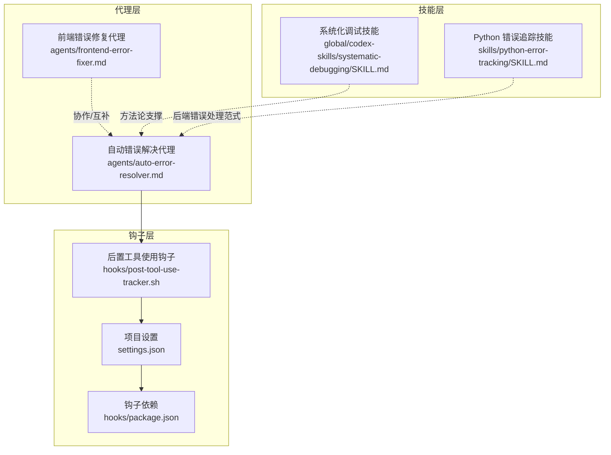
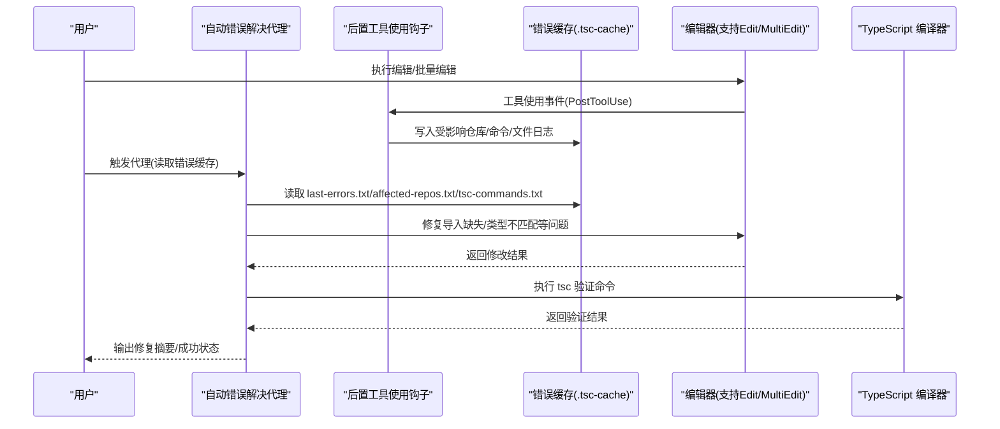
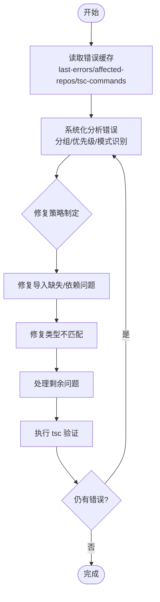
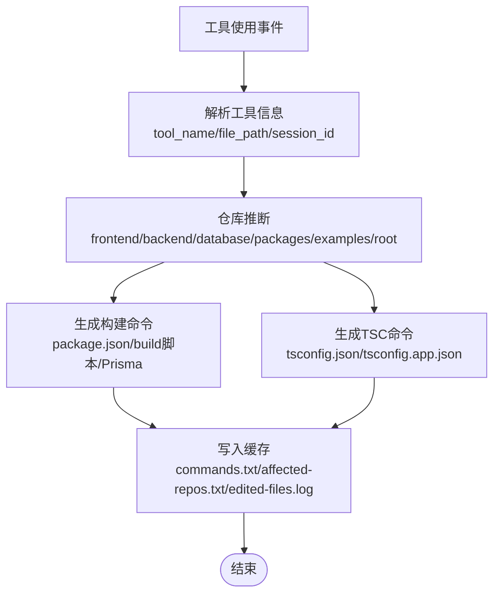
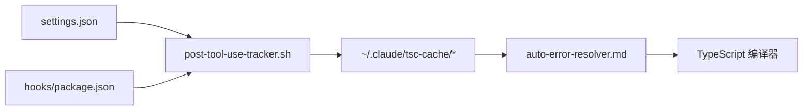

# 错误自动解决代理

<cite>
**本文引用的文件**
- [auto-error-resolver.md](file://agents/auto-error-resolver.md)
- [frontend-error-fixer.md](file://agents/frontend-error-fixer.md)
- [post-tool-use-tracker.sh](file://hooks/post-tool-use-tracker.sh)
- [settings.json](file://settings.json)
- [package.json](file://hooks/package.json)
- [SKILL.md](file://global/codex-skills/systematic-debugging/SKILL.md)
- [SKILL.md](file://skills/python-error-tracking/SKILL.md)
- [README.md](file://README.md)
</cite>

## 目录
1. [简介](#简介)
2. [项目结构](#项目结构)
3. [核心组件](#核心组件)
4. [架构总览](#架构总览)
5. [详细组件分析](#详细组件分析)
6. [依赖关系分析](#依赖关系分析)
7. [性能考虑](#性能考虑)
8. [故障排除指南](#故障排除指南)
9. [结论](#结论)
10. [附录](#附录)

## 简介
本技术文档面向“错误自动解决代理”，系统阐述其设计目的、核心功能与实现机制，重点覆盖：
- TypeScript 编译错误的自动识别与修复
- 系统性错误处理与构建失败诊断
- 代理的错误识别机制、修复算法与验证流程
- 修复参数配置、定制修复规则与复杂错误场景处理
- 使用示例与最佳实践
- 与前端错误修复代理的协作关系与边界划分

该代理基于项目中的钩子系统与技能体系，通过读取错误缓存、分析受影响仓库与 TSC 命令，按优先级顺序进行修复，并在每次修改后执行验证，确保修复闭环。

## 项目结构
该项目采用“代理模板 + 钩子 + 技能”的协作架构：
- 代理层：位于 agents/ 目录，提供领域化的智能体模板（如自动错误解决代理、前端错误修复代理）
- 钩子层：位于 hooks/ 目录，负责在工具使用后自动记录编辑行为、检测仓库与生成构建/编译命令
- 技能层：位于 skills/ 与 global/codex-skills/ 目录，提供系统化调试、错误追踪等知识与流程
- 配置层：settings.json 注册钩子与权限；package.json 管理钩子工程依赖

图表来源
- [auto-error-resolver.md](file://agents/auto-error-resolver.md#L1-L97)
- [frontend-error-fixer.md](file://agents/frontend-error-fixer.md#L1-L77)
- [post-tool-use-tracker.sh](file://hooks/post-tool-use-tracker.sh#L1-L178)
- [settings.json](file://settings.json#L1-L37)
- [package.json](file://hooks/package.json#L1-L17)
- [SKILL.md](file://global/codex-skills/systematic-debugging/SKILL.md#L1-L297)
- [SKILL.md](file://skills/python-error-tracking/SKILL.md#L1-L574)

章节来源
- [README.md](file://README.md#L71-L92)
- [settings.json](file://settings.json#L13-L36)

## 核心组件
- 自动错误解决代理：专门处理 TypeScript 编译错误，遵循“读取缓存 → 分析错误 → 修复 → 验证”的闭环流程，优先处理可能引发级联的根因问题。
- 前端错误修复代理：专注于前端构建时与运行时错误（TS/JS、React、打包、网络等），强调最小化修复与精确诊断。
- 后置工具使用钩子：在 Edit/MultiEdit/Write 成功后自动记录编辑文件、推断仓库、生成构建/编译命令，并写入缓存，供代理读取。
- 系统化调试技能：提供四阶段调试方法（根因调查 → 模式分析 → 假设与测试 → 实施），为复杂错误场景提供系统化思维框架。
- Python 错误追踪技能：提供后端错误捕获与性能监控的工程化范式，体现“所有未预期错误必须上报”的原则，为后端错误修复提供参考。

章节来源
- [auto-error-resolver.md](file://agents/auto-error-resolver.md#L7-L37)
- [frontend-error-fixer.md](file://agents/frontend-error-fixer.md#L7-L51)
- [post-tool-use-tracker.sh](file://hooks/post-tool-use-tracker.sh#L1-L178)
- [SKILL.md](file://global/codex-skills/systematic-debugging/SKILL.md#L46-L197)
- [SKILL.md](file://skills/python-error-tracking/SKILL.md#L1-L50)

## 架构总览
自动错误解决代理的工作流由“钩子采集 + 代理解析 + 修复执行 + 验证反馈”构成，形成闭环：

图表来源
- [auto-error-resolver.md](file://agents/auto-error-resolver.md#L11-L36)
- [post-tool-use-tracker.sh](file://hooks/post-tool-use-tracker.sh#L143-L178)

## 详细组件分析

### 组件A：自动错误解决代理
- 设计目的：快速高效地修复 TypeScript 编译错误，减少人工干预，提升构建稳定性。
- 核心流程：
  1) 读取错误缓存：从 tsc-cache 中读取最近错误、受影响仓库与 TSC 命令
  2) 分析错误：按类型分组、识别级联风险、发现模式
  3) 修复策略：优先修复导入缺失与依赖问题，再处理类型不匹配，最后处理剩余问题；对同类问题使用批量编辑
  4) 验证修复：执行 tsc 命令验证，持续修复直至清零
- 关键约束：优先修复根因，避免添加 @ts-ignore；保持修复最小化与聚焦性

图表来源
- [auto-error-resolver.md](file://agents/auto-error-resolver.md#L9-L36)

章节来源
- [auto-error-resolver.md](file://agents/auto-error-resolver.md#L7-L97)

### 组件B：后置工具使用钩子
- 功能职责：在编辑工具成功完成后，自动记录编辑文件、推断仓库、生成构建/编译命令，并写入 tsc-cache。
- 仓库推断逻辑：根据文件路径首段目录判断前端/后端/数据库/包等仓库；支持 monorepo 与 examples 场景。
- 命令生成逻辑：
  - 构建命令：检测 package.json 的 build 脚本，优先 pnpm/npm/yarn，或 Prisma schema 检测
  - TSC 命令：检测 tsconfig.json，若存在 tsconfig.app.json 则使用项目模式，否则普通模式
- 缓存输出：去重后的命令列表写入 commands.txt；同时记录受影响仓库与编辑文件日志

图表来源
- [post-tool-use-tracker.sh](file://hooks/post-tool-use-tracker.sh#L32-L178)

章节来源
- [post-tool-use-tracker.sh](file://hooks/post-tool-use-tracker.sh#L1-L178)

### 组件C：系统化调试技能
- 四阶段调试法：根因调查 → 模式分析 → 假设与测试 → 实施
- 核心原则：在提出修复前必须完成根因调查；最小化修复；必要时质疑架构
- 在自动错误解决代理中的应用：当代理无法一次性定位根因时，可引导采用系统化调试技能进行深入分析

章节来源
- [SKILL.md](file://global/codex-skills/systematic-debugging/SKILL.md#L46-L197)

### 组件D：Python 错误追踪技能（后端参考）
- 范式要点：所有未预期错误必须上报 Sentry；为捕获的异常添加上下文；区分业务错误与未预期错误；性能监控与事务追踪
- 对前端/TS 修复的启示：即使前端错误修复成功，也应关注潜在的未捕获异常与性能瓶颈，确保修复不引入新的问题面

章节来源
- [SKILL.md](file://skills/python-error-tracking/SKILL.md#L1-L50)

### 组件E：前端错误修复代理（协作关系）
- 职责边界：
  - 自动错误解决代理：专注 TypeScript 编译期错误与类型问题
  - 前端错误修复代理：处理构建期与运行期前端错误（TS/JS、React、浏览器控制台、网络等）
- 协作方式：两者在不同阶段互补，前者侧重静态分析与类型修复，后者侧重动态诊断与最小化修复

章节来源
- [frontend-error-fixer.md](file://agents/frontend-error-fixer.md#L1-L77)
- [auto-error-resolver.md](file://agents/auto-error-resolver.md#L7-L37)

## 依赖关系分析
- 配置依赖：settings.json 注册 PostToolUse 钩子，允许 Edit/MultiEdit/Bash 等工具，确保代理可读取缓存并执行验证
- 工具依赖：hooks/package.json 提供 TypeScript/tsx 等依赖，保障钩子脚本运行环境
- 代理依赖：自动错误解决代理依赖钩子生成的 tsc-cache 数据与正确的 tsc 命令

图表来源
- [settings.json](file://settings.json#L24-L34)
- [package.json](file://hooks/package.json#L8-L15)
- [post-tool-use-tracker.sh](file://hooks/post-tool-use-tracker.sh#L1-L178)
- [auto-error-resolver.md](file://agents/auto-error-resolver.md#L11-L14)

章节来源
- [settings.json](file://settings.json#L1-L37)
- [package.json](file://hooks/package.json#L1-L17)

## 性能考虑
- 缓存去重：钩子在生成命令时进行去重，避免重复验证命令导致的资源浪费
- 最小化修复：代理优先修复根因，减少无效重跑与反复验证
- 仓库粒度：按受影响仓库分别生成命令，避免跨仓库无谓操作
- 日志与监控：结合 PM2 日志与 tsc 命令输出，快速定位瓶颈

## 故障排除指南
- 代理无法读取错误缓存
  - 检查 tsc-cache 是否存在且内容完整
  - 确认钩子是否正确注册与执行
- 修复后仍报错
  - 使用 tsc-commands.txt 中的命令手动验证
  - 若为级联错误，优先修复缺失类型定义或导入路径
- 钩子未触发
  - 检查 settings.json 的 PostToolUse 配置
  - 确认工具名称匹配 Edit/MultiEdit/Write
- 系统化调试
  - 使用系统化调试技能进行根因调查与假设验证，避免症状修复

章节来源
- [auto-error-resolver.md](file://agents/auto-error-resolver.md#L16-L36)
- [post-tool-use-tracker.sh](file://hooks/post-tool-use-tracker.sh#L143-L178)
- [SKILL.md](file://global/codex-skills/systematic-debugging/SKILL.md#L215-L233)

## 结论
自动错误解决代理通过“钩子采集 + 代理解析 + 修复执行 + 验证反馈”的闭环，有效提升了 TypeScript 编译错误的自动化修复效率。配合系统化调试技能与前端错误修复代理，可在不同阶段互补协作，形成从前端构建到后端运行的全链路错误治理能力。建议在实际使用中：
- 明确修复优先级与最小化原则
- 严格使用 tsc-commands.txt 进行验证
- 对复杂错误场景采用系统化调试技能
- 与前端错误修复代理协同，覆盖构建期与运行期两类错误

## 附录
- 使用示例（概念性流程）
  - 读取错误缓存：查看 tsc-cache 中的 last-errors.txt、affected-repos.txt、tsc-commands.txt
  - 识别文件与错误：定位具体文件与错误类型（如属性不存在、类型不匹配）
  - 修复导入缺失与依赖问题：补充 import 路径或安装缺失包
  - 修复类型不匹配：完善接口/类型注解
  - 验证修复：执行 tsc 命令，确认无残留错误
- 配置与定制
  - 通过 settings.json 控制钩子与工具权限
  - 通过钩子脚本扩展仓库推断与命令生成逻辑
  - 通过系统化调试技能提升复杂场景的诊断质量