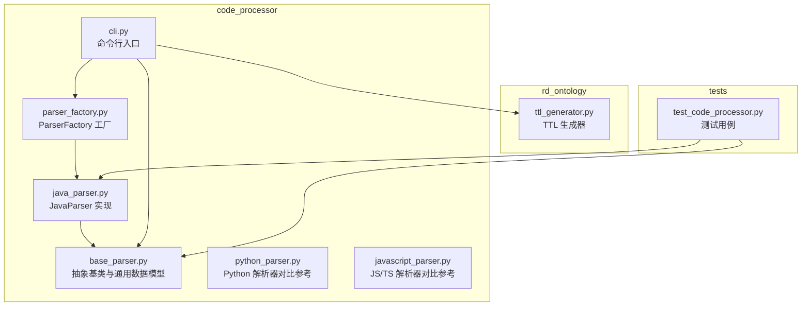
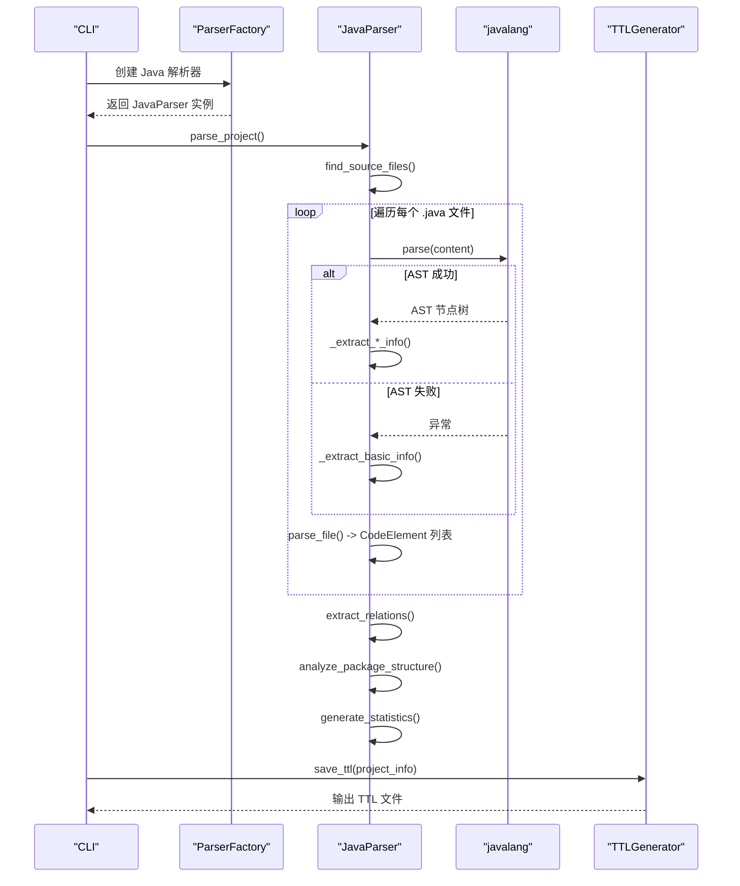
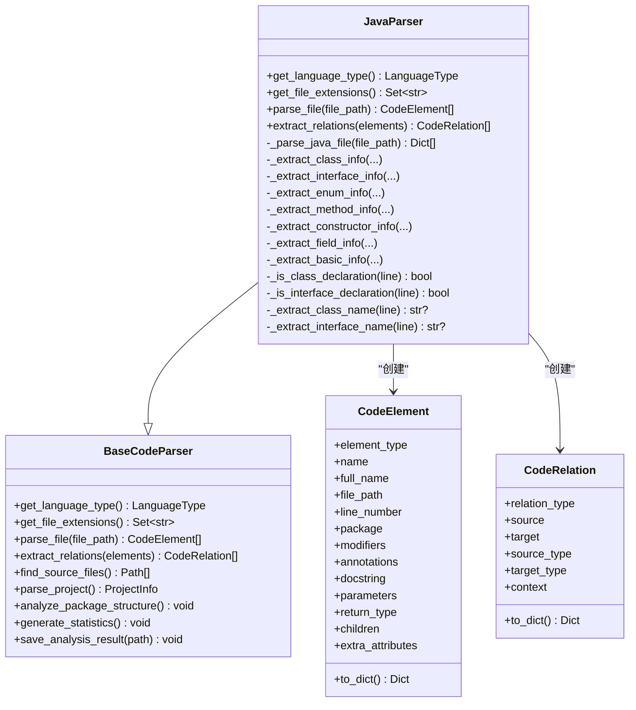
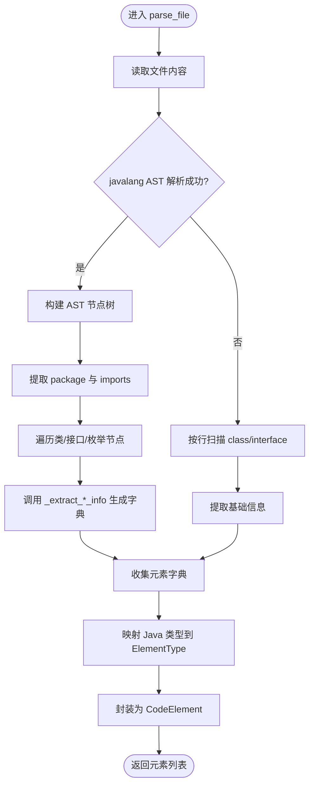
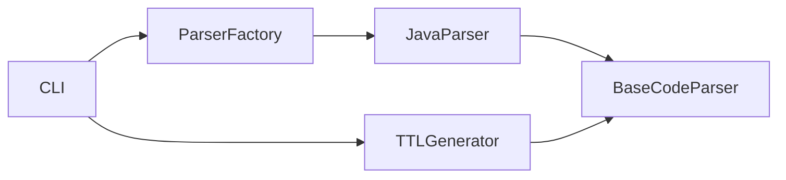

# Java 解析器

<cite>
**本文引用的文件**
- [java_parser.py](file://code_processor/java_parser.py)
- [base_parser.py](file://code_processor/base_parser.py)
- [parser_factory.py](file://code_processor/parser_factory.py)
- [cli.py](file://code_processor/cli.py)
- [ttl_generator.py](file://rd_ontology/ttl_generator.py)
- [test_code_processor.py](file://tests/test_code_processor.py)
</cite>

## 目录
1. [简介](#简介)
2. [项目结构](#项目结构)
3. [核心组件](#核心组件)
4. [架构总览](#架构总览)
5. [详细组件分析](#详细组件分析)
6. [依赖关系分析](#依赖关系分析)
7. [性能考虑](#性能考虑)
8. [故障排除指南](#故障排除指南)
9. [结论](#结论)
10. [附录](#附录)

## 简介
本文件面向 Java 解析器的技术文档，聚焦于 JavaParser 类的实现细节与使用方式，涵盖以下主题：
- Java 语法树解析与 AST 抽取
- 类与接口识别、方法与字段提取
- Java 特定元素识别规则：注解、泛型、继承关系
- Java 项目结构分析、包管理与依赖关系提取
- 解析结果格式与 TTL 输出
- 代码质量检查与复杂度分析的使用建议

该解析器基于统一的多语言解析框架，通过 javalang 库进行 Java AST 解析，并在失败时回退到正则表达式基础抽取策略，确保在不完美源码下的稳健性。

## 项目结构
Java 解析器位于 code_processor 子模块中，采用“抽象基类 + 语言特定实现”的分层设计，配合工厂模式与 CLI 工具形成完整的分析流水线。

图表来源
- [base_parser.py](file://code_processor/base_parser.py#L206-L358)
- [java_parser.py](file://code_processor/java_parser.py#L39-L425)
- [parser_factory.py](file://code_processor/parser_factory.py#L20-L248)
- [cli.py](file://code_processor/cli.py#L32-L215)
- [ttl_generator.py](file://rd_ontology/ttl_generator.py#L18-L321)
- [test_code_processor.py](file://tests/test_code_processor.py#L1-L139)

章节来源
- [base_parser.py](file://code_processor/base_parser.py#L1-L358)
- [java_parser.py](file://code_processor/java_parser.py#L1-L425)
- [parser_factory.py](file://code_processor/parser_factory.py#L1-L248)
- [cli.py](file://code_processor/cli.py#L1-L215)
- [ttl_generator.py](file://rd_ontology/ttl_generator.py#L1-L321)
- [test_code_processor.py](file://tests/test_code_processor.py#L1-L139)

## 核心组件
- JavaParser：继承自 BaseCodeParser，负责 Java 文件的解析、元素抽取与关系提取。
- BaseCodeParser：多语言解析器抽象基类，提供统一接口、项目遍历、统计与保存等通用能力。
- ParserFactory：语言检测与解析器实例化工厂，支持混合语言项目。
- CLI：命令行入口，支持单语言/混合语言分析与 TTL 导出。
- TTLGenerator：将解析结果转换为 TTL（RDF/Turtle）格式，便于知识图谱集成。

章节来源
- [java_parser.py](file://code_processor/java_parser.py#L39-L127)
- [base_parser.py](file://code_processor/base_parser.py#L206-L358)
- [parser_factory.py](file://code_processor/parser_factory.py#L20-L171)
- [cli.py](file://code_processor/cli.py#L32-L164)
- [ttl_generator.py](file://rd_ontology/ttl_generator.py#L18-L229)

## 架构总览
Java 解析器遵循“AST 解析优先 + 正则回退”的双路径策略：
- AST 路径：使用 javalang 解析 Java 源码，提取 package、imports、类/接口/枚举、方法、构造器、字段、注解等信息。
- 回退路径：当 AST 解析失败时，按行扫描，识别 class/interface 关键字并抽取基本信息。

关系抽取基于元素元数据，构建继承、实现、导入等关系。

图表来源
- [cli.py](file://code_processor/cli.py#L32-L101)
- [parser_factory.py](file://code_processor/parser_factory.py#L122-L140)
- [java_parser.py](file://code_processor/java_parser.py#L53-L171)
- [ttl_generator.py](file://rd_ontology/ttl_generator.py#L218-L228)

## 详细组件分析

### JavaParser 类分析
- 继承关系：JavaParser(BaseCodeParser)
- 关键职责：
  - 语言类型与文件扩展名声明
  - 单文件解析：AST 解析或基础抽取
  - 元素映射：将 Java 类型映射到通用 ElementType
  - 关系抽取：继承、实现、导入
  - 基础抽取：class/interface 行级识别与名称提取

图表来源
- [base_parser.py](file://code_processor/base_parser.py#L206-L358)
- [java_parser.py](file://code_processor/java_parser.py#L39-L425)

章节来源
- [java_parser.py](file://code_processor/java_parser.py#L39-L127)
- [base_parser.py](file://code_processor/base_parser.py#L82-L171)

### AST 解析与元素抽取流程
- 解析入口：parse_file(file_path)
- AST 路径：_parse_java_file(file_path)
  - 读取文件内容
  - javalang.parse.parse(content) 获取 AST
  - 提取 package、imports
  - 遍历 ClassDeclaration/InterfaceDeclaration/EnumDeclaration
  - 对每个节点调用 _extract_*_info 生成字典
- 回退路径：_extract_basic_info(file_path, content)
  - 按行扫描 class/interface 关键字
  - 提取类名/接口名与基本元信息

图表来源
- [java_parser.py](file://code_processor/java_parser.py#L53-L171)
- [java_parser.py](file://code_processor/java_parser.py#L338-L424)

章节来源
- [java_parser.py](file://code_processor/java_parser.py#L53-L171)
- [java_parser.py](file://code_processor/java_parser.py#L338-L424)

### Java 特定元素识别规则
- 注解处理
  - 类/接口/方法/字段均支持从 AST 中读取 annotations 字段
  - 将注解名称列表存入 element.extra_attributes['annotations']
- 泛型支持
  - 方法参数类型、返回类型、字段类型通过 str(node.type) 获取字符串表示
  - 泛型参数在字符串中体现，解析器不做额外拆分
- 继承关系
  - 类 extends：element.extra_attributes['extends']（单父类）
  - 接口 extends：element.extra_attributes['extends']（多父接口）
  - 关系抽取：RelationType.EXTENDS/IMPLEMENTS
- 枚举常量
  - 遍历 EnumConstantDeclaration，收集常量名至 constants 列表

章节来源
- [java_parser.py](file://code_processor/java_parser.py#L173-L273)
- [java_parser.py](file://code_processor/java_parser.py#L275-L336)
- [base_parser.py](file://code_processor/base_parser.py#L54-L80)

### 项目结构分析、包管理与依赖关系
- 包管理
  - 通过元素的 package 字段进行统计与聚合
  - analyze_package_structure() 统计各包下类/接口/函数数量
- 依赖关系
  - imports：RelationType.IMPORTS（从 AST imports 中提取）
  - extends/implements：RelationType.EXTENDS/IMPLEMENTS（从类/接口元数据提取）
- 项目统计
  - generate_statistics() 统计文件数、元素总数、关系总数、各类型分布、包数量

章节来源
- [base_parser.py](file://code_processor/base_parser.py#L300-L346)
- [java_parser.py](file://code_processor/java_parser.py#L75-L115)

### 解析结果格式与 TTL 输出
- 结果格式
  - CodeElement.to_dict()：包含类型、名称、全名、文件路径、行号、包、修饰符、注解、文档、参数、返回类型、子元素与额外属性
  - CodeRelation.to_dict()：包含关系类型、源/目标、上下文与额外属性
  - ProjectInfo.to_dict()：包含项目路径、语言、元素、关系、包统计、统计信息与依赖列表
- TTL 输出
  - TTLGenerator.save_ttl(project_info, output_path)：输出 RDF/Turtle 格式的本体实例数据
  - 支持为元素生成稳定 IRI，映射 ElementType/RelationType 到本体属性

章节来源
- [base_parser.py](file://code_processor/base_parser.py#L122-L203)
- [ttl_generator.py](file://rd_ontology/ttl_generator.py#L176-L228)

### 使用示例与 CLI 操作
- 单语言分析
  - python -m code_processor.cli analyze /path/to/project
  - 输出 JSON 或 TTL（--format ttl）
- 混合语言分析
  - python -m code_processor.cli analyze /path/to/project --mixed
- TTL 生成
  - python -m code_processor.cli ttl /path/to/project --output ontology.ttl

章节来源
- [cli.py](file://code_processor/cli.py#L32-L164)

## 依赖关系分析
- 内部依赖
  - JavaParser 依赖 BaseCodeParser 的通用接口与数据模型
  - CLI 依赖 ParserFactory 与 TTLGenerator
  - TTLGenerator 依赖 CodeElement/CodeRelation/ProjectInfo
- 外部依赖
  - javalang：Java AST 解析库（在运行时动态导入）
  - Python 标准库：json、pathlib、typing、logging、re 等

图表来源
- [java_parser.py](file://code_processor/java_parser.py#L19-L22)
- [parser_factory.py](file://code_processor/parser_factory.py#L12-L16)
- [cli.py](file://code_processor/cli.py#L16-L20)
- [ttl_generator.py](file://rd_ontology/ttl_generator.py#L12-L15)

章节来源
- [java_parser.py](file://code_processor/java_parser.py#L13-L22)
- [parser_factory.py](file://code_processor/parser_factory.py#L12-L16)
- [cli.py](file://code_processor/cli.py#L16-L20)
- [ttl_generator.py](file://rd_ontology/ttl_generator.py#L12-L15)

## 性能考虑
- AST 解析成本
  - javalang.parse.parse(content) 在大型文件上可能较慢；建议限制单文件大小或分批处理
- I/O 与缓存
  - 读取文件与写入 JSON/TTL 为 I/O 密集操作；可考虑批量写入与并发优化
- 正则回退
  - _extract_basic_info 逐行扫描，适用于小规模或格式不规范的文件；对大规模项目应尽量保证 AST 解析可用
- 统计与聚合
  - analyze_package_structure 与 generate_statistics 为 O(N) 遍历，通常开销较小

[本节为通用指导，无需特定文件来源]

## 故障排除指南
- javalang 未安装
  - 现象：初始化 JavaParser 抛出 ImportError
  - 处理：pip install javalang
- AST 解析失败
  - 现象：日志出现 AST parsing failed，回退到基础抽取
  - 处理：检查源码语法、编码格式与注释风格；必要时简化或修复语法问题
- 文件读取异常
  - 现象：读取文件失败的日志
  - 处理：确认文件权限、路径正确性与编码兼容
- CLI 参数错误
  - 现象：未知语言或路径不存在
  - 处理：核对 --language 与项目路径；使用 info 命令查看支持的语言

章节来源
- [java_parser.py](file://code_processor/java_parser.py#L42-L45)
- [java_parser.py](file://code_processor/java_parser.py#L140-L142)
- [cli.py](file://code_processor/cli.py#L36-L48)

## 结论
JavaParser 通过统一的多语言框架实现了对 Java 项目的结构化解析，具备：
- 稳健的 AST 解析与基础抽取双路径
- 完整的 Java 元素识别（类、接口、枚举、方法、字段、注解）
- 清晰的关系抽取（继承、实现、导入）
- 丰富的统计与 TTL 输出能力

对于代码质量检查与复杂度分析，当前解析器专注于结构抽取与关系建模。若需进一步的度量（如圈复杂度、代码覆盖率），可在现有 ProjectInfo 基础上扩展统计字段，并结合外部工具链进行二次分析。

[本节为总结性内容，无需特定文件来源]

## 附录

### 解析结果字段说明（摘自 CodeElement/CodeRelation/ProjectInfo）
- CodeElement 字段
  - type/name/full_name/file_path/line_number/package/modifiers/annotations/docstring/parameters/return_type/children/extra_attributes
- CodeRelation 字段
  - relation_type/source/target/source_type/target_type/context/extra_attributes
- ProjectInfo 字段
  - project_path/language/elements/relations/packages/statistics/dependencies

章节来源
- [base_parser.py](file://code_processor/base_parser.py#L122-L203)
- [base_parser.py](file://code_processor/base_parser.py#L173-L203)

### 命令行示例
- 分析 Java 项目并输出 JSON
  - python -m code_processor.cli analyze /path/to/project --output result.json
- 分析 Java 项目并输出 TTL
  - python -m code_processor.cli analyze /path/to/project --format ttl --output java.ttl
- 混合语言分析
  - python -m code_processor.cli analyze /path/to/project --mixed

章节来源
- [cli.py](file://code_processor/cli.py#L158-L162)