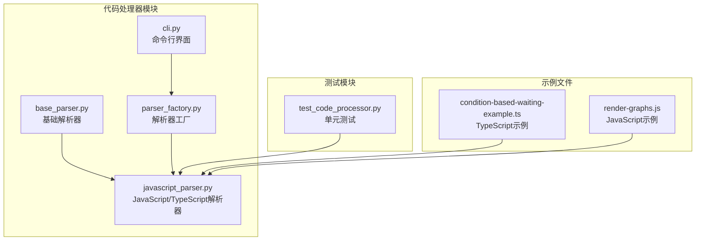
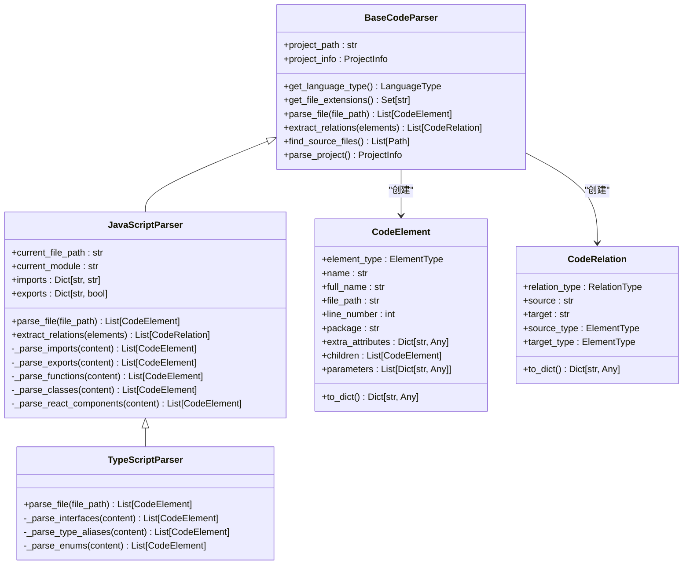
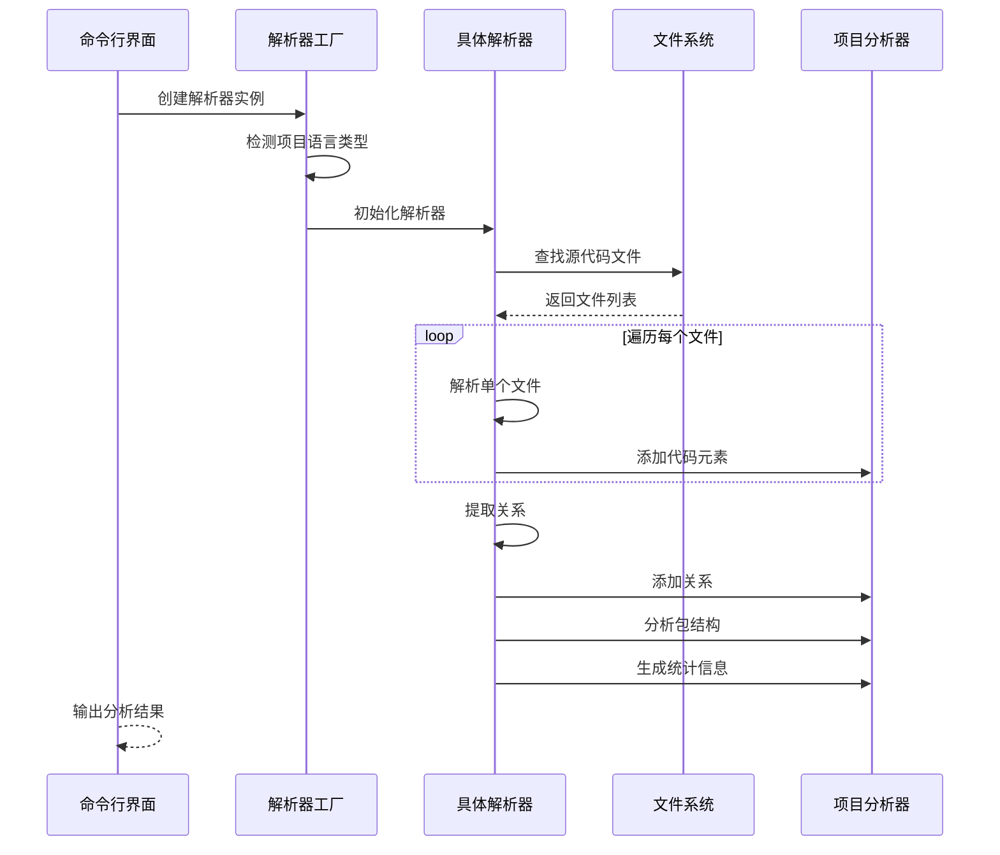
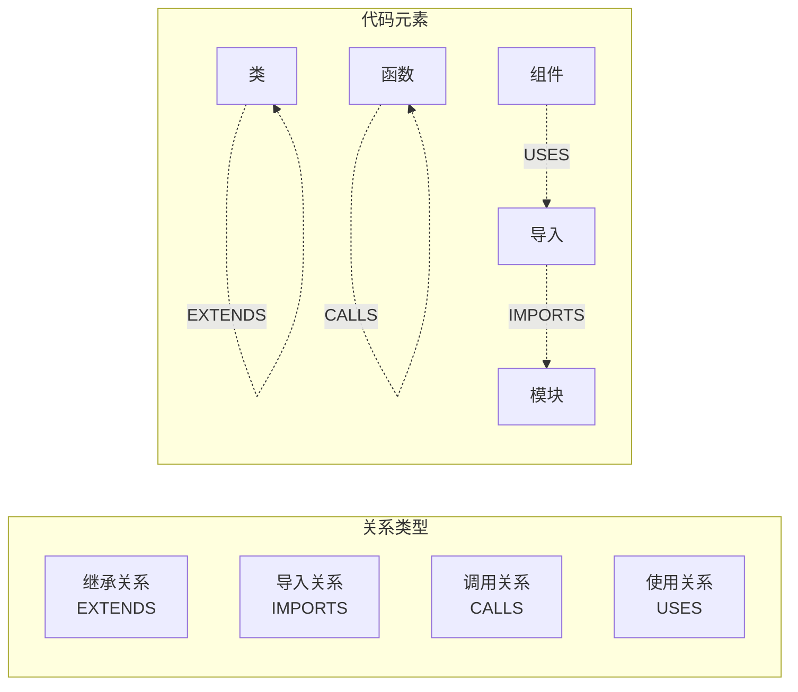

# JavaScript/TypeScript 解析器

<cite>
**本文档引用的文件**
- [javascript_parser.py](file://code_processor/javascript_parser.py)
- [base_parser.py](file://code_processor/base_parser.py)
- [parser_factory.py](file://code_processor/parser_factory.py)
- [cli.py](file://code_processor/cli.py)
- [test_code_processor.py](file://tests/test_code_processor.py)
- [condition-based-waiting-example.ts](file://global/codex-skills/systematic-debugging/condition-based-waiting-example.ts)
- [render-graphs.js](file://global/codex-skills/writing-skills/render-graphs.js)
</cite>

## 目录
1. [简介](#简介)
2. [项目结构](#项目结构)
3. [核心组件](#核心组件)
4. [架构概览](#架构概览)
5. [详细组件分析](#详细组件分析)
6. [依赖分析](#依赖分析)
7. [性能考虑](#性能考虑)
8. [故障排除指南](#故障排除指南)
9. [结论](#结论)
10. [附录](#附录)

## 简介

JavaScript/TypeScript 解析器是代码本体构建系统的核心组件，专门负责解析前端项目的 JavaScript 和 TypeScript 代码。该解析器采用正则表达式驱动的方法，能够准确识别和提取代码中的各种元素，包括类、函数、组件、接口等，并建立它们之间的关系网络。

该解析器的主要特点包括：
- **多语言支持**：同时支持 JavaScript 和 TypeScript 两种语言
- **ES6+ 语法支持**：完整支持现代 JavaScript 语法特性
- **TypeScript 特性**：识别接口、类型别名、枚举等 TypeScript 独特特性
- **React 组件识别**：自动检测和分析 React 组件及其使用的 Hooks
- **模块系统处理**：支持 ES6 模块和 CommonJS 模块导入导出
- **关系提取**：建立代码元素之间的继承、调用、使用等关系

## 项目结构

代码处理器模块采用清晰的分层架构设计：



**图表来源**
- [base_parser.py](file://code_processor/base_parser.py#L1-L358)
- [javascript_parser.py](file://code_processor/javascript_parser.py#L1-L548)
- [parser_factory.py](file://code_processor/parser_factory.py#L1-L248)
- [cli.py](file://code_processor/cli.py#L1-L215)

**章节来源**
- [base_parser.py](file://code_processor/base_parser.py#L1-L358)
- [javascript_parser.py](file://code_processor/javascript_parser.py#L1-L548)
- [parser_factory.py](file://code_processor/parser_factory.py#L1-L248)

## 核心组件

### JavaScriptParser 类

JavaScriptParser 是解析器的核心实现类，继承自 BaseCodeParser，专门处理 JavaScript 和 JSX 文件。

**主要功能特性：**
- **文件扩展名支持**：支持 `.js`、`.jsx`、`.mjs` 扩展名
- **ES6+ 语法识别**：支持箭头函数、async/await、解构赋值等
- **模块系统处理**：识别 ES6 导入导出和 CommonJS require 语句
- **React 组件检测**：自动识别 React 函数组件和类组件
- **Hook 使用分析**：提取组件中使用的 React Hooks

### TypeScriptParser 类

TypeScriptParser 继承自 JavaScriptParser，扩展了对 TypeScript 语言特性的支持。

**TypeScript 特有功能：**
- **接口定义识别**：解析 interface 关键字定义
- **类型别名处理**：识别 type 关键字定义的类型别名
- **枚举支持**：处理 enum 关键字定义
- **继承关系**：支持接口继承和类继承

### 基础解析器架构

所有解析器都遵循统一的基础架构：



**图表来源**
- [base_parser.py](file://code_processor/base_parser.py#L206-L358)
- [javascript_parser.py](file://code_processor/javascript_parser.py#L22-L548)

**章节来源**
- [javascript_parser.py](file://code_processor/javascript_parser.py#L22-L548)
- [base_parser.py](file://code_processor/base_parser.py#L206-L358)

## 架构概览

解析器采用工厂模式和策略模式相结合的设计：



**图表来源**
- [parser_factory.py](file://code_processor/parser_factory.py#L122-L160)
- [base_parser.py](file://code_processor/base_parser.py#L263-L298)

**章节来源**
- [parser_factory.py](file://code_processor/parser_factory.py#L1-L248)
- [cli.py](file://code_processor/cli.py#L32-L102)

## 详细组件分析

### JavaScript 语法识别规则

JavaScriptParser 实现了全面的语法识别机制：

#### 函数定义识别
解析器支持多种函数定义形式：
- 普通函数声明：`function functionName() {}`
- 表达式函数：`const functionName = function() {}`
- 箭头函数：`const functionName = () => {}`
- 异步函数：`async function functionName() {}`、`const functionName = async () => {}`

#### 类定义识别
支持标准类定义和方法识别：
- 类声明：`class ClassName extends ParentClass {}`
- 方法识别：包括普通方法、静态方法、异步方法

#### React 组件识别
自动检测 React 组件：
- 函数组件：`const ComponentName = () => {}`
- 类组件：`class ComponentName extends React.Component {}`
- ForwardRef 组件：`const ComponentName = React.forwardRef()`

#### 模块系统处理
支持两种主要的模块系统：

```mermaid
flowchart TD
A[导入语句] --> B{模块类型}
B --> |ES6| C[import {name} from 'module']
B --> |CommonJS| D[const name = require('module')]
B --> |默认导出| E[import name from 'module']
B --> |命名空间| F[import * as name from 'module']
C --> G[创建导入元素]
D --> G
E --> G
F --> G
G --> H[存储导入映射]
```

**图表来源**
- [javascript_parser.py](file://code_processor/javascript_parser.py#L131-L188)

**章节来源**
- [javascript_parser.py](file://code_processor/javascript_parser.py#L131-L347)

### TypeScript 特性支持

TypeScriptParser 在 JavaScriptParser 的基础上增加了 TypeScript 专属功能：

#### 接口定义识别
解析 TypeScript 接口：
```typescript
interface User {
    name: string;
    age: number;
}
```

#### 类型别名处理
支持类型别名定义：
```typescript
type UserId = string | number;
type ApiResponse<T> = {
    data: T;
    status: number;
};
```

#### 枚举支持
识别不同类型的枚举：
- 数字枚举：`enum Status {Active, Inactive}`
- 字符串枚举：`enum Direction {Up = "UP", Down = "DOWN"}`
- 计算枚举：`enum Math {PI = Math.PI}`

**章节来源**
- [javascript_parser.py](file://code_processor/javascript_parser.py#L446-L548)

### 关系提取机制

解析器能够建立代码元素之间的各种关系：



**图表来源**
- [base_parser.py](file://code_processor/base_parser.py#L54-L80)
- [javascript_parser.py](file://code_processor/javascript_parser.py#L65-L121)

**章节来源**
- [javascript_parser.py](file://code_processor/javascript_parser.py#L65-L121)
- [base_parser.py](file://code_processor/base_parser.py#L54-L80)

### 数据模型和输出格式

解析器使用统一的数据模型来表示代码元素和关系：

#### CodeElement 结构
每个代码元素包含以下信息：
- 基本属性：类型、名称、完整名称、文件路径、行号
- 语言特定属性：参数列表、返回类型、修饰符等
- 关系属性：父子关系、额外属性

#### CodeRelation 结构
关系对象包含：
- 关系类型：继承、导入、调用等
- 源目标元素：完整的元素标识符
- 类型信息：源目标元素的具体类型
- 上下文信息：关系的描述性文本

**章节来源**
- [base_parser.py](file://code_processor/base_parser.py#L82-L171)

## 依赖分析

解析器的依赖关系相对简单且清晰：

```mermaid
graph TB
subgraph "外部依赖"
A[re] 正则表达式库
B[pathlib] 路径操作
C[typing] 类型注解
D[logging] 日志记录
end
subgraph "内部模块"
E[base_parser.py] 基础抽象类
F[javascript_parser.py] JavaScript解析器
G[parser_factory.py] 解析器工厂
H[cli.py] 命令行界面
end
F --> E
G --> E
G --> F
H --> G
subgraph "测试依赖"
I[test_code_processor.py] 单元测试
end
I --> E
I --> F
```

**图表来源**
- [javascript_parser.py](file://code_processor/javascript_parser.py#L9-L17)
- [parser_factory.py](file://code_processor/parser_factory.py#L12-L15)

**章节来源**
- [javascript_parser.py](file://code_processor/javascript_parser.py#L9-L17)
- [parser_factory.py](file://code_processor/parser_factory.py#L12-L15)

## 性能考虑

由于解析器使用正则表达式进行代码分析，需要考虑以下性能因素：

### 正则表达式优化
- 使用编译后的正则表达式减少重复编译开销
- 优化复杂的正则表达式模式
- 避免回溯陷阱

### 内存使用优化
- 分批处理大型文件
- 及时释放不需要的中间结果
- 使用生成器模式处理大量数据

### 并行处理
- 对于多文件解析，可以考虑并行处理
- 注意正则表达式的线程安全

## 故障排除指南

### 常见问题和解决方案

#### 解析失败
**症状**：解析过程中出现异常或部分代码未被识别
**原因**：
- 正则表达式无法匹配某些特殊语法
- 文件编码问题
- 复杂的嵌套结构

**解决方案**：
- 检查文件编码是否为 UTF-8
- 更新正则表达式以支持新的语法特性
- 分离复杂文件进行单独处理

#### 模块导入识别错误
**症状**：导入语句没有被正确识别
**原因**：
- 动态导入语句
- 条件导入
- 复杂的解构导入

**解决方案**：
- 检查导入语句的格式
- 验证模块路径的有效性
- 考虑添加更多导入模式的支持

#### React 组件识别问题
**症状**：React 组件没有被正确识别
**原因**：
- 组件命名不符合约定
- 复杂的组件定义
- 使用了不常见的组件模式

**解决方案**：
- 确保组件名称首字母大写
- 检查组件定义的语法
- 考虑添加更多组件识别模式

**章节来源**
- [javascript_parser.py](file://code_processor/javascript_parser.py#L61-L63)
- [base_parser.py](file://code_processor/base_parser.py#L213-L215)

## 结论

JavaScript/TypeScript 解析器是一个设计精良的代码分析工具，具有以下优势：

1. **全面的语法支持**：覆盖了现代 JavaScript 和 TypeScript 的主要特性
2. **清晰的架构设计**：基于抽象基类的可扩展架构
3. **实用的关系提取**：能够建立代码元素之间的有意义关系
4. **易于使用**：提供简单的命令行接口和 API

该解析器特别适合用于：
- 代码本体构建和知识图谱生成
- 代码质量分析和复杂度评估
- 项目结构分析和依赖关系可视化
- 技术债务识别和重构规划

## 附录

### 使用示例

#### 基本使用
```bash
# 分析单个语言项目
python -m code_processor.cli analyze /path/to/project

# 分析混合语言项目
python -m code_processor.cli analyze /path/to/project --mixed

# 指定输出格式
python -m code_processor.cli analyze /path/to/project --output result.json
python -m code_processor.cli analyze /path/to/project --output ontology.ttl --format ttl
```

#### 高级功能
解析器还提供了丰富的统计信息和分析结果：
- 项目总体统计：文件数量、元素总数、关系数量
- 语言特定统计：各类元素的数量分布
- 包结构分析：按包组织的代码元素统计
- 依赖关系提取：模块间的导入关系分析

**章节来源**
- [cli.py](file://code_processor/cli.py#L167-L215)
- [base_parser.py](file://code_processor/base_parser.py#L325-L347)