# Python 解析器

<cite>
**本文档引用的文件**
- [python_parser.py](file://code_processor/python_parser.py)
- [base_parser.py](file://code_processor/base_parser.py)
- [parser_factory.py](file://code_processor/parser_factory.py)
- [cli.py](file://code_processor/cli.py)
- [ttl_generator.py](file://rd_ontology/ttl_generator.py)
- [test_code_processor.py](file://tests/test_code_processor.py)
</cite>

## 目录
1. [简介](#简介)
2. [项目结构](#项目结构)
3. [核心组件](#核心组件)
4. [架构概览](#架构概览)
5. [详细组件分析](#详细组件分析)
6. [依赖关系分析](#依赖关系分析)
7. [性能考虑](#性能考虑)
8. [故障排除指南](#故障排除指南)
9. [结论](#结论)
10. [附录](#附录)

## 简介
本文件为 Python 解析器的详细技术文档，深入解释 PythonParser 类的实现细节，包括 AST 解析、函数和类识别、导入语句处理。详细说明 Python 特定的代码元素识别规则，如装饰器处理、类型注解支持和异常处理。解释 Python 项目结构分析、模块组织和依赖关系提取。包含具体的代码示例和解析结果格式。提供 Python 代码复杂度分析和静态检查功能的使用指南。

## 项目结构
该代码库采用多语言代码分析架构，Python 解析器是其中的一个模块，负责解析 Python 源代码并提取代码元素及其关系。

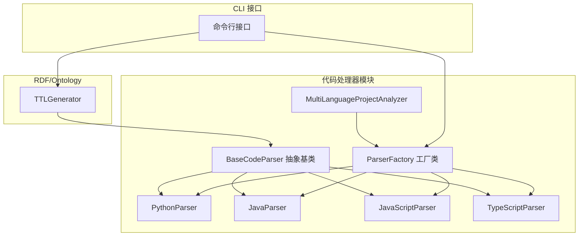

**图表来源**
- [python_parser.py](file://code_processor/python_parser.py#L22-L358)
- [base_parser.py](file://code_processor/base_parser.py#L206-L358)
- [parser_factory.py](file://code_processor/parser_factory.py#L20-L248)
- [cli.py](file://code_processor/cli.py#L16-L215)

**章节来源**
- [python_parser.py](file://code_processor/python_parser.py#L1-L455)
- [base_parser.py](file://code_processor/base_parser.py#L1-L358)
- [parser_factory.py](file://code_processor/parser_factory.py#L1-L248)

## 核心组件
Python 解析器由以下核心组件构成：

### PythonParser 类
PythonParser 是继承自 BaseCodeParser 的具体实现，专门用于解析 Python 源代码。它使用 Python 内置的 ast 模块进行语法树解析，并通过自定义的 PythonASTVisitor 来遍历和提取代码元素。

### PythonASTVisitor 类
PythonASTVisitor 继承自 ast.NodeVisitor，是 Python 代码解析的核心访问器。它实现了各种 visit_* 方法来处理不同的 AST 节点类型，包括类定义、函数定义、导入语句等。

### 关系提取器
PythonParser 提供了 extract_relations 方法，用于从解析出的代码元素中提取各种关系，包括继承关系、调用关系、导入关系等。

**章节来源**
- [python_parser.py](file://code_processor/python_parser.py#L22-L147)
- [base_parser.py](file://code_processor/base_parser.py#L206-L358)

## 架构概览
Python 解析器采用分层架构设计，确保了良好的可扩展性和维护性。

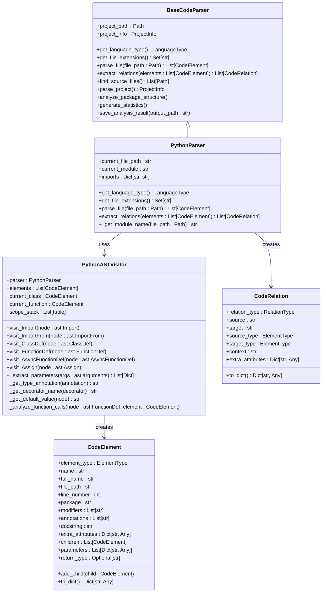

**图表来源**
- [python_parser.py](file://code_processor/python_parser.py#L22-L455)
- [base_parser.py](file://code_processor/base_parser.py#L82-L358)

## 详细组件分析

### PythonParser 类实现
PythonParser 类是 Python 语言解析的核心实现，提供了完整的 Python 代码解析功能。

#### 基本属性和初始化
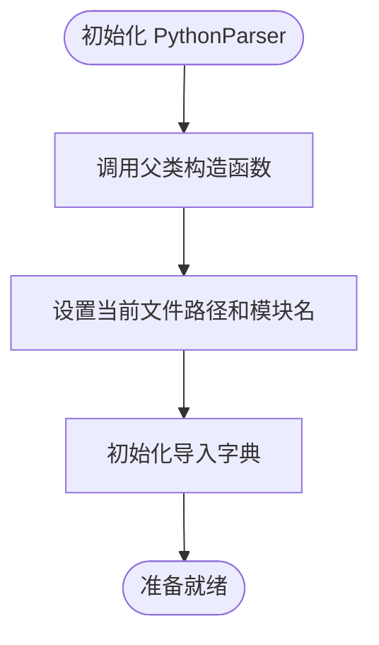

**图表来源**
- [python_parser.py](file://code_processor/python_parser.py#L25-L30)

#### 文件解析流程
PythonParser 使用 AST 解析器来处理 Python 源代码：

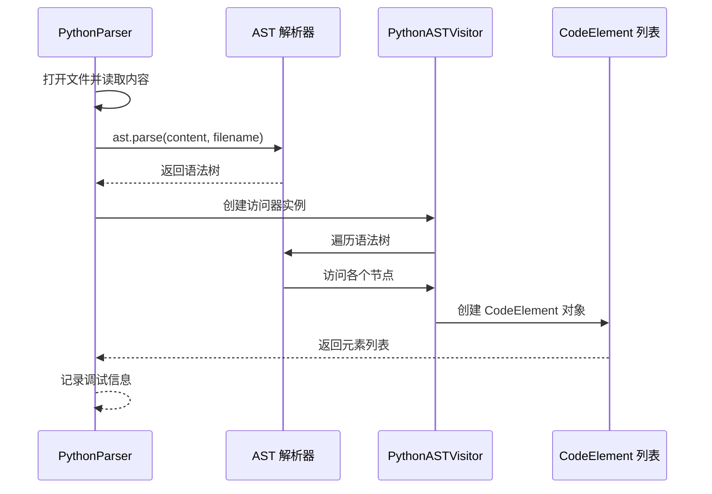

**图表来源**
- [python_parser.py](file://code_processor/python_parser.py#L37-L62)

#### 错误处理机制
PythonParser 实现了完善的错误处理机制：

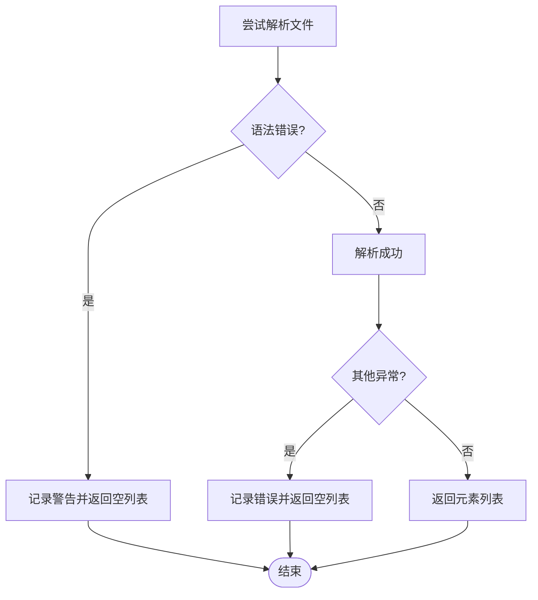

**图表来源**
- [python_parser.py](file://code_processor/python_parser.py#L57-L62)

**章节来源**
- [python_parser.py](file://code_processor/python_parser.py#L22-L63)

### PythonASTVisitor 类实现
PythonASTVisitor 是 Python 代码解析的核心访问器，负责遍历 AST 并提取各种代码元素。

#### 导入语句处理
PythonASTVisitor 支持两种主要的导入语句类型：

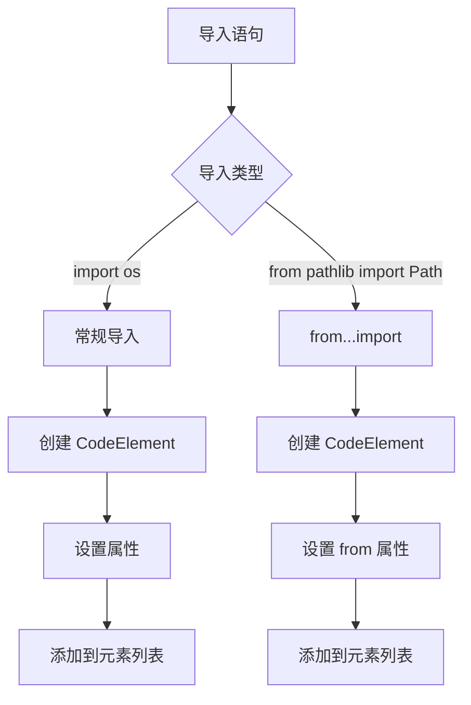

**图表来源**
- [python_parser.py](file://code_processor/python_parser.py#L159-L198)

#### 类定义处理
类定义处理是最复杂的部分，需要提取多种信息：

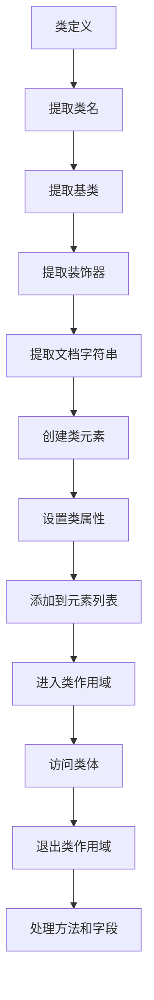

**图表来源**
- [python_parser.py](file://code_processor/python_parser.py#L200-L244)

#### 函数和方法处理
函数和方法的处理逻辑相似，但有一些关键区别：

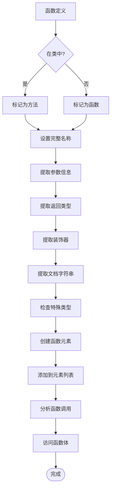

**图表来源**
- [python_parser.py](file://code_processor/python_parser.py#L253-L313)

**章节来源**
- [python_parser.py](file://code_processor/python_parser.py#L149-L455)

### 关系提取机制
PythonParser 的 extract_relations 方法负责从解析出的代码元素中提取各种关系：

#### 继承关系提取
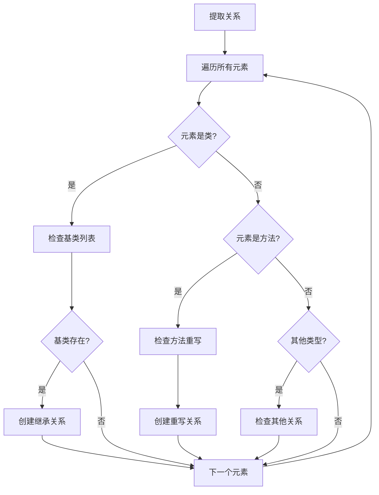

**图表来源**
- [python_parser.py](file://code_processor/python_parser.py#L64-L135)

#### 装饰器关系提取
装饰器关系的提取相对简单，主要是记录装饰器与被装饰元素之间的关系。

**章节来源**
- [python_parser.py](file://code_processor/python_parser.py#L64-L135)

## 依赖关系分析

### 语言检测和工厂模式
ParserFactory 类实现了智能的语言检测和工厂模式：

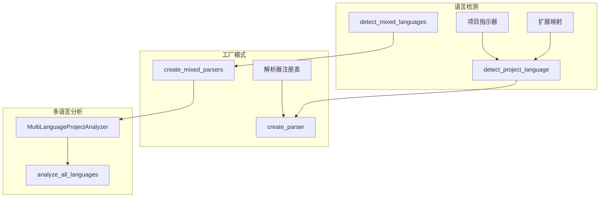

**图表来源**
- [parser_factory.py](file://code_processor/parser_factory.py#L41-L160)

### CLI 接口集成
CLI 接口提供了用户友好的命令行界面：

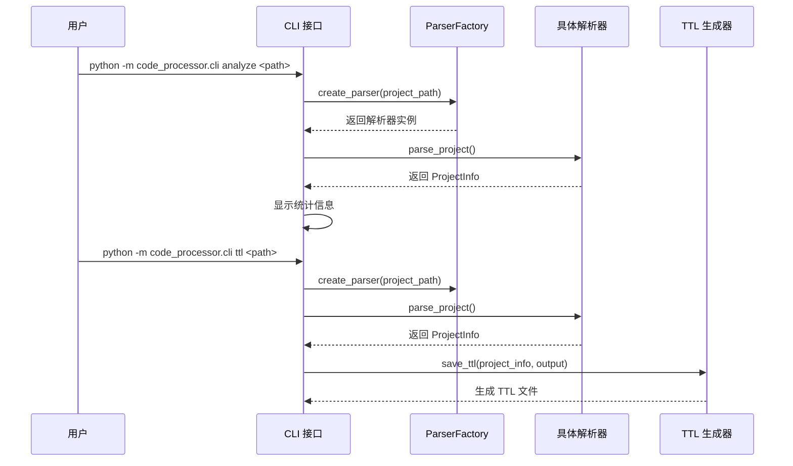

**图表来源**
- [cli.py](file://code_processor/cli.py#L32-L101)
- [cli.py](file://code_processor/cli.py#L112-L141)

**章节来源**
- [parser_factory.py](file://code_processor/parser_factory.py#L1-L248)
- [cli.py](file://code_processor/cli.py#L1-L215)

## 性能考虑
Python 解析器在设计时考虑了多个性能优化方面：

### AST 解析优化
- 使用内置的 ast 模块进行高效的语法树解析
- 避免重复解析相同的文件内容
- 合理使用缓存机制存储中间结果

### 内存管理
- 及时清理不再使用的变量和对象
- 使用生成器模式处理大量数据
- 控制递归深度避免栈溢出

### 扩展性设计
- 通过抽象基类确保新语言解析器的快速开发
- 支持混合语言项目的统一分析
- 模块化设计便于功能扩展和维护

## 故障排除指南

### 常见问题和解决方案

#### 语法错误处理
当遇到 Python 语法错误时，解析器会：
1. 记录警告日志
2. 返回空的元素列表
3. 继续处理其他文件

#### 文件过滤机制
解析器会自动过滤以下类型的文件：
- 版本控制系统目录（如 .git）
- 构建输出目录（如 __pycache__, target, build）
- 虚拟环境目录（如 venv, .venv）
- IDE 配置目录（如 .idea, .vscode）

#### 类型注解支持
解析器支持多种类型注解格式：
- 基本类型注解（如 int, str, List）
- 复合类型注解（如 List[str], Dict[str, int]）
- 属性访问类型注解（如 typing.List）

**章节来源**
- [python_parser.py](file://code_processor/python_parser.py#L57-L62)
- [base_parser.py](file://code_processor/base_parser.py#L250-L261)

## 结论
Python 解析器是一个功能完整、设计合理的代码分析工具。它基于 Python 内置的 AST 模块，提供了对 Python 代码的深度解析能力。通过抽象基类的设计，该解析器可以轻松扩展到其他编程语言。配合 CLI 接口和 TTL 生成器，用户可以方便地进行代码分析和构建研发本体。

主要优势包括：
- 完整的 Python 语法支持
- 灵活的关系提取机制
- 良好的错误处理和容错能力
- 支持混合语言项目分析
- 提供丰富的统计和报告功能

## 附录

### 使用示例
以下是一些基本的使用示例：

#### 单语言项目分析
```bash
python -m code_processor.cli analyze /path/to/python/project
```

#### 混合语言项目分析
```bash
python -m code_processor.cli analyze /path/to/mixed/project --mixed
```

#### 生成 TTL 文件
```bash
python -m code_processor.cli ttl /path/to/project --output ontology.ttl
```

### API 参考
- `PythonParser`: 主要的 Python 代码解析器
- `ParserFactory`: 解析器工厂，支持语言检测和创建
- `MultiLanguageProjectAnalyzer`: 多语言项目分析器
- `TTLGenerator`: RDF/Turtle 文件生成器

### 测试覆盖
测试套件涵盖了主要功能：
- Python 类解析测试
- 函数解析测试  
- 导入语句解析测试
- 语言检测测试
- 数据结构转换测试

**章节来源**
- [test_code_processor.py](file://tests/test_code_processor.py#L1-L139)