# 代码处理器系统

<cite>
**本文引用的文件列表**
- [code_processor/__init__.py](file://code_processor/__init__.py)
- [code_processor/base_parser.py](file://code_processor/base_parser.py)
- [code_processor/parser_factory.py](file://code_processor/parser_factory.py)
- [code_processor/java_parser.py](file://code_processor/java_parser.py)
- [code_processor/python_parser.py](file://code_processor/python_parser.py)
- [code_processor/javascript_parser.py](file://code_processor/javascript_parser.py)
- [code_processor/cli.py](file://code_processor/cli.py)
- [code_processor/requirements.txt](file://code_processor/requirements.txt)
- [code_processor/nlp_generator.py](file://code_processor/nlp_generator.py)
- [code_processor/document_generator.py](file://code_processor/document_generator.py)
- [code_processor/document_writer.py](file://code_processor/document_writer.py)
- [rd_ontology/ttl_generator.py](file://rd_ontology/ttl_generator.py)
- [tests/test_code_processor.py](file://tests/test_code_processor.py)
- [tests/test_integration.py](file://tests/test_integration.py)
- [README.md](file://README.md)
- [settings.json](file://settings.json)
- [docs/code-ontology-technical.md](file://docs/code-ontology-technical.md)
</cite>

## 更新摘要
**变更内容**
- 新增完整的多语言代码分析系统架构文档
- 更新解析器工厂模式和语言检测机制
- 完善 Java、Python、JavaScript/TypeScript 解析器实现细节
- 增强 CLI 接口功能和命令行参数说明
- 扩展 TTL 生成器的本体映射和关系抽取
- 新增 NLPGenerator、DocumentWriter 和增强的 DocumentGenerator
- 添加详细的 API 接口文档和使用示例
- 新增文档格式规范和 LLM 增强功能

## 目录
1. [简介](#简介)
2. [项目结构](#项目结构)
3. [核心组件](#核心组件)
4. [架构总览](#架构总览)
5. [详细组件分析](#详细组件分析)
6. [依赖关系分析](#依赖关系分析)
7. [性能考虑](#性能考虑)
8. [故障排查指南](#故障排查指南)
9. [结论](#结论)
10. [附录](#附录)

## 简介
本系统是一个多语言代码解析与本体构建工具，面向研发（R&D）知识图谱与规范驱动开发（SDD）场景，提供统一的代码元素识别、关系抽取与 TTL（Turtle）本体输出能力。系统采用工厂模式自动识别项目语言，分别对 Java、Python、JavaScript/TypeScript 进行解析，并将结果转换为可查询的本体数据，便于后续的智能检索、推理与可视化。

**更新** 新增完整的多语言代码分析系统，支持 Java、Python、JavaScript/TypeScript 解析器，解析器工厂，CLI 接口，以及详细的架构文档。新增 NLPGenerator、DocumentWriter 和增强的 DocumentGenerator，提供 LLM 增强的业务意图描述生成功能和标准化文档格式。

## 项目结构
- code_processor：核心解析模块，包含基础抽象、语言解析器与工厂
- rd_ontology：本体生成模块，负责将解析结果转为 TTL
- tests：单元测试
- docs：技术文档和架构说明
- 其他目录（agents、hooks、skills 等）与本系统功能相关但非核心解析逻辑

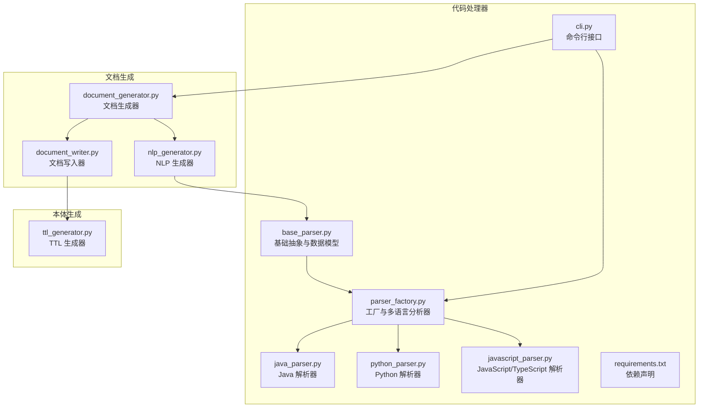

**图表来源**
- [code_processor/base_parser.py](file://code_processor/base_parser.py#L1-L360)
- [code_processor/parser_factory.py](file://code_processor/parser_factory.py#L1-L248)
- [code_processor/java_parser.py](file://code_processor/java_parser.py#L1-L425)
- [code_processor/python_parser.py](file://code_processor/python_parser.py#L1-L455)
- [code_processor/javascript_parser.py](file://code_processor/javascript_parser.py#L1-L548)
- [code_processor/cli.py](file://code_processor/cli.py#L1-L376)
- [code_processor/nlp_generator.py](file://code_processor/nlp_generator.py#L1-L569)
- [code_processor/document_generator.py](file://code_processor/document_generator.py#L1-L697)
- [code_processor/document_writer.py](file://code_processor/document_writer.py#L1-L325)
- [rd_ontology/ttl_generator.py](file://rd_ontology/ttl_generator.py#L1-L364)

**章节来源**
- [code_processor/__init__.py](file://code_processor/__init__.py#L1-L40)
- [code_processor/requirements.txt](file://code_processor/requirements.txt#L1-L8)

## 核心组件
- 基础抽象与数据模型：统一的枚举类型、元素与关系的数据结构，以及通用的解析流程与统计分析
- 工厂与多语言分析器：自动语言检测、混合语言项目分析、解析器注册与实例化
- 语言解析器：Java（基于 javalang）、Python（基于 AST）、JavaScript/TypeScript（基于正则与扩展）
- NLP 生成器：LLM 增强的自然语言生成器，提供业务意图描述
- 文档生成器：将代码分析结果转换为标准化文档格式
- 文档写入器：负责文档保存到磁盘，管理构建 ID 和目录结构
- TTL 生成器：将解析结果映射为 TTL 三元组，支持稳定 ID 与命名空间
- CLI：命令行入口，支持单语言/混合语言分析与 TTL 输出

**章节来源**
- [code_processor/base_parser.py](file://code_processor/base_parser.py#L17-L360)
- [code_processor/parser_factory.py](file://code_processor/parser_factory.py#L20-L248)
- [code_processor/nlp_generator.py](file://code_processor/nlp_generator.py#L18-L569)
- [code_processor/document_generator.py](file://code_processor/document_generator.py#L23-L697)
- [code_processor/document_writer.py](file://code_processor/document_writer.py#L17-L325)
- [rd_ontology/ttl_generator.py](file://rd_ontology/ttl_generator.py#L18-L364)

## 架构总览
系统采用"工厂 + 抽象基类"的分层设计，语言解析器继承统一的抽象接口，工厂负责语言识别与解析器创建；CLI 将用户输入转化为分析流程，最终输出 JSON 或 TTL。新增的文档生成流水线包括 NLP 生成器、文档生成器和文档写入器，提供 LLM 增强的业务意图描述和标准化文档格式。

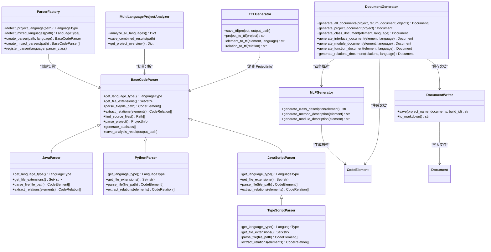

**图表来源**
- [code_processor/base_parser.py](file://code_processor/base_parser.py#L206-L360)
- [code_processor/java_parser.py](file://code_processor/java_parser.py#L39-L425)
- [code_processor/python_parser.py](file://code_processor/python_parser.py#L22-L455)
- [code_processor/javascript_parser.py](file://code_processor/javascript_parser.py#L22-L548)
- [code_processor/parser_factory.py](file://code_processor/parser_factory.py#L20-L248)
- [code_processor/nlp_generator.py](file://code_processor/nlp_generator.py#L18-L569)
- [code_processor/document_generator.py](file://code_processor/document_generator.py#L23-L697)
- [code_processor/document_writer.py](file://code_processor/document_writer.py#L110-L325)
- [rd_ontology/ttl_generator.py](file://rd_ontology/ttl_generator.py#L18-L364)

## 详细组件分析

### 基础抽象与数据模型
- 枚举体系：语言类型、元素类型、关系类型，覆盖 Java、Python、JS/TS 的特有元素
- 数据结构：CodeElement（名称、全名、修饰符、注解、参数、返回类型、父子关系等）、CodeRelation（源/目标、上下文、属性）、ProjectInfo（聚合统计、包结构）
- 统一流程：文件发现、逐文件解析、关系抽取、包结构分析、统计生成、结果保存

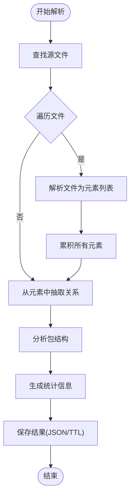

**图表来源**
- [code_processor/base_parser.py](file://code_processor/base_parser.py#L263-L360)

**章节来源**
- [code_processor/base_parser.py](file://code_processor/base_parser.py#L17-L360)

### 工厂模式与语言检测
- 注册表：ParserFactory 维护语言到解析器类的映射
- 语言检测：基于项目指示物与文件扩展名打分，支持混合语言项目
- 多语言分析：为每种检测到的语言创建解析器并汇总结果

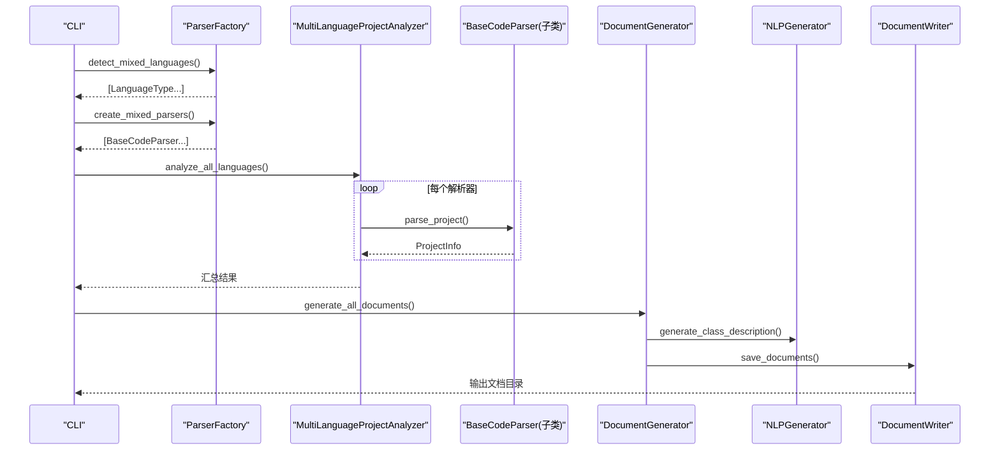

**图表来源**
- [code_processor/parser_factory.py](file://code_processor/parser_factory.py#L173-L248)
- [code_processor/cli.py](file://code_processor/cli.py#L116-L157)
- [code_processor/document_generator.py](file://code_processor/document_generator.py#L69-L134)
- [code_processor/document_writer.py](file://code_processor/document_writer.py#L117-L179)

**章节来源**
- [code_processor/parser_factory.py](file://code_processor/parser_factory.py#L20-L248)

### NLP 生成器
- LLM 增强：支持规则推断和 LLM 生成两种模式
- 业务术语：内置丰富的业务术语映射，涵盖服务、控制器、仓库等设计模式
- 框架术语：支持 Spring、Django、FastAPI、React 等主流框架
- 注解/装饰器含义：提供 Java 注解和 Python 装饰器的语义解释
- 自动生成：为类、方法、模块生成业务意图描述

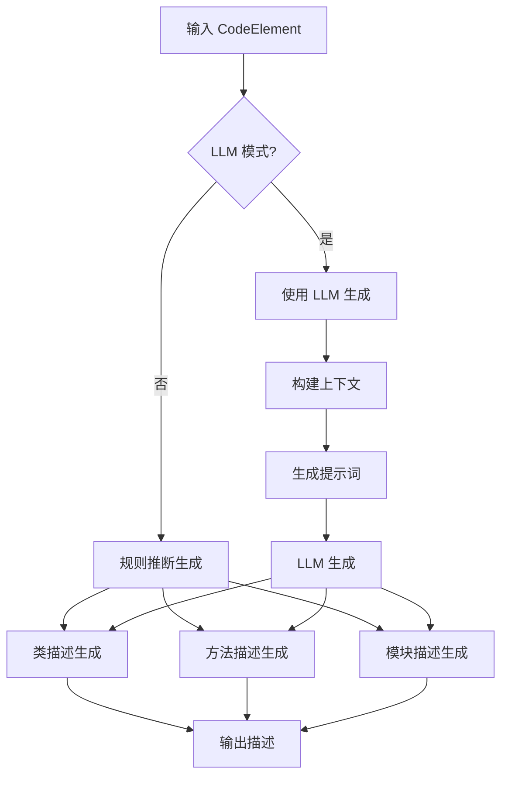

**图表来源**
- [code_processor/nlp_generator.py](file://code_processor/nlp_generator.py#L27-L41)
- [code_processor/nlp_generator.py](file://code_processor/nlp_generator.py#L152-L205)
- [code_processor/nlp_generator.py](file://code_processor/nlp_generator.py#L226-L286)

**章节来源**
- [code_processor/nlp_generator.py](file://code_processor/nlp_generator.py#L18-L569)

### 文档生成器
- 文档类型：支持项目概览、类、接口、模块、函数、关系等多种文档类型
- LLM 集成：可选的 LLM 增强模式，生成更丰富的业务意图描述
- 标准化格式：生成带 frontmatter 的 Markdown 文档
- 元数据管理：自动添加 element_id、语言、包等元数据
- 批量处理：支持整个项目的批量文档生成

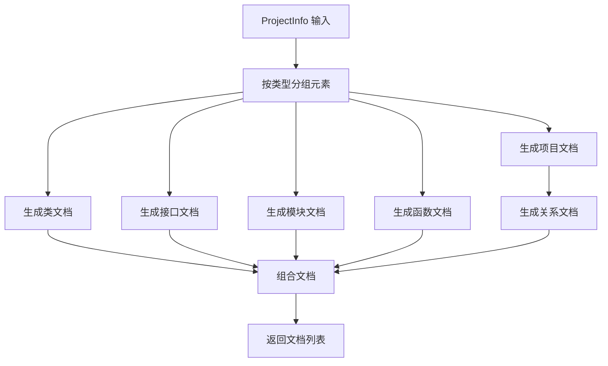

**图表来源**
- [code_processor/document_generator.py](file://code_processor/document_generator.py#L69-L134)
- [code_processor/document_generator.py](file://code_processor/document_generator.py#L196-L298)
- [code_processor/document_generator.py](file://code_processor/document_generator.py#L300-L364)

**章节来源**
- [code_processor/document_generator.py](file://code_processor/document_generator.py#L23-L697)

### 文档写入器
- 目录结构：标准化的文档存储结构，包含项目、包、元素、关系文档
- 构建 ID：自动生成时间戳 + 哈希的构建标识符
- 文件安全：自动处理文件名安全性和长度限制
- 元数据：生成 build_metadata.yaml，包含构建信息和统计
- 批量保存：支持批量文档保存和错误处理

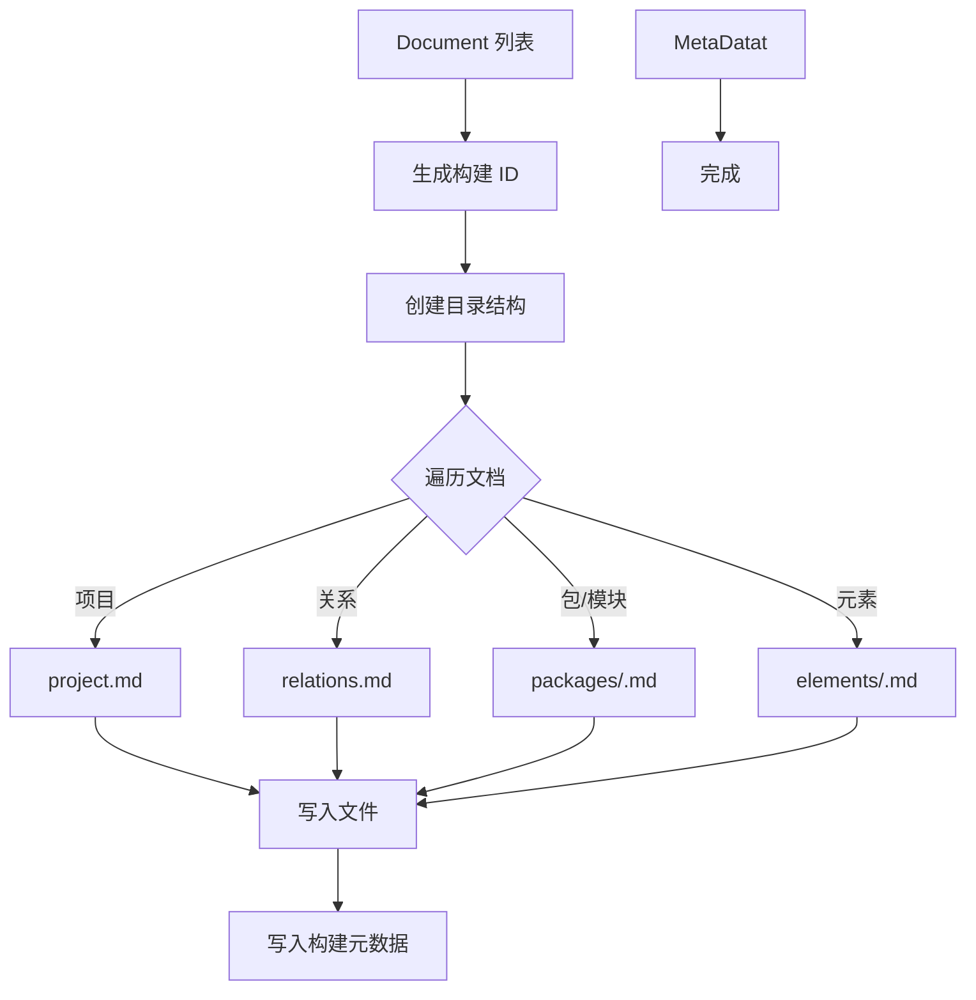

**图表来源**
- [code_processor/document_writer.py](file://code_processor/document_writer.py#L126-L179)
- [code_processor/document_writer.py](file://code_processor/document_writer.py#L199-L255)
- [code_processor/document_writer.py](file://code_processor/document_writer.py#L268-L298)

**章节来源**
- [code_processor/document_writer.py](file://code_processor/document_writer.py#L17-L325)

### Java 解析器
- 依赖：javalang（可选，若缺失则抛出导入异常）
- 解析策略：优先使用 AST（javalang），失败时回退到正则提取基础信息
- 关系抽取：继承、实现、导入
- 元素类型：类、接口、枚举、方法、字段、注解、导入、包等

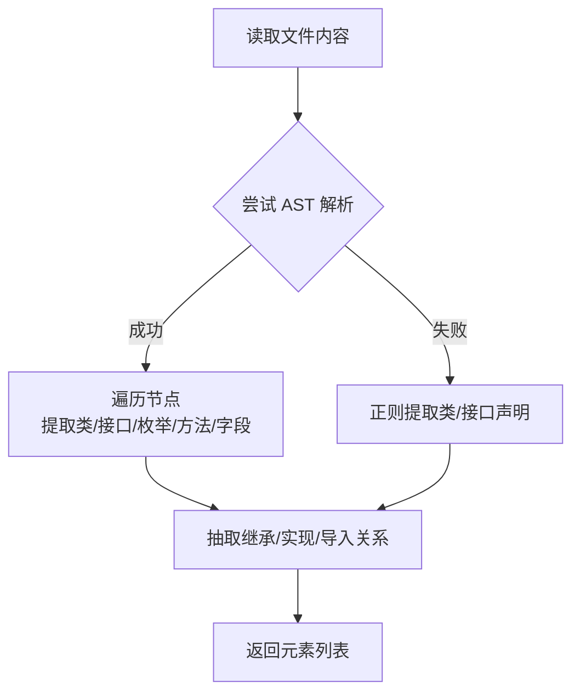

**图表来源**
- [code_processor/java_parser.py](file://code_processor/java_parser.py#L129-L171)
- [code_processor/java_parser.py](file://code_processor/java_parser.py#L75-L115)

**章节来源**
- [code_processor/java_parser.py](file://code_processor/java_parser.py#L1-L425)

### Python 解析器
- 依赖：标准库 ast
- 解析策略：AST 访问器遍历节点，识别 import、from...import、类、函数、变量、装饰器、属性等
- 关系抽取：继承、装饰、重写、调用、导入
- 特性：支持异步函数、属性、静态方法/类方法、构造函数、参数默认值、类型注解字符串化

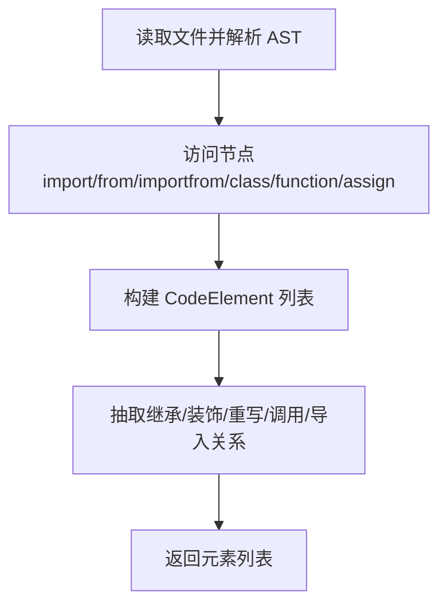

**图表来源**
- [code_processor/python_parser.py](file://code_processor/python_parser.py#L149-L455)
- [code_processor/python_parser.py](file://code_processor/python_parser.py#L64-L135)

**章节来源**
- [code_processor/python_parser.py](file://code_processor/python_parser.py#L1-L455)

### JavaScript/TypeScript 解析器
- 依赖：正则表达式
- 解析策略：ES6 模块 import/export、CommonJS require、函数/类/变量、React 组件与 Hooks、TS 接口/类型别名/枚举
- 关系抽取：继承、导入、调用、组件使用 Hook
- 特性：支持 async/箭头函数、参数解构、类方法解析、TS 扩展语法

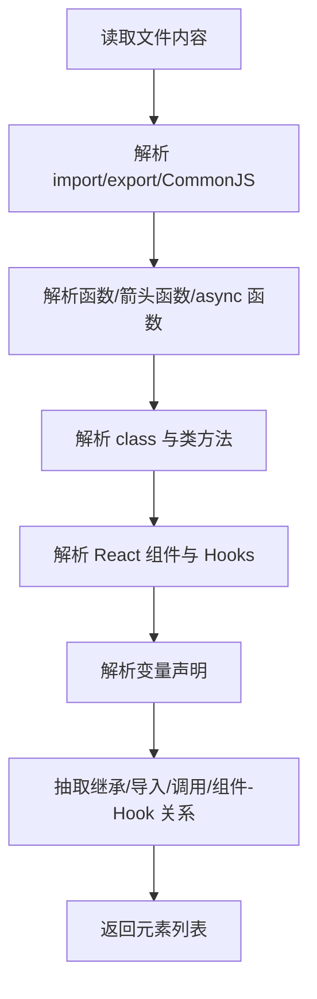

**图表来源**
- [code_processor/javascript_parser.py](file://code_processor/javascript_parser.py#L131-L217)
- [code_processor/javascript_parser.py](file://code_processor/javascript_parser.py#L455-L547)
- [code_processor/javascript_parser.py](file://code_processor/javascript_parser.py#L65-L121)

**章节来源**
- [code_processor/javascript_parser.py](file://code_processor/javascript_parser.py#L1-L548)

### TTL 生成器
- 映射：ElementType/RelationType 到 TTL 类与属性
- 稳定 ID：基于元素关键信息生成短哈希 ID，保证跨运行一致
- 输出：前缀声明、元素三元组、关系三元组，支持语言标注

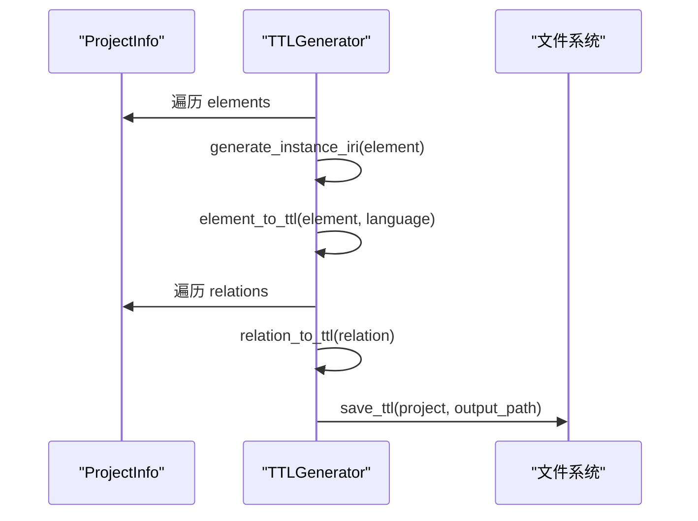

**图表来源**
- [rd_ontology/ttl_generator.py](file://rd_ontology/ttl_generator.py#L176-L228)

**章节来源**
- [rd_ontology/ttl_generator.py](file://rd_ontology/ttl_generator.py#L1-L364)

### 命令行接口
- analyze：单语言或混合语言分析，支持 JSON/TTL 输出
- docs：生成代码描述文档，支持 LLM 增强和批量保存
- build：调用 ontology 服务构建本体，支持完整 Pipeline 流程
- info：显示支持语言与示例

**章节来源**
- [code_processor/cli.py](file://code_processor/cli.py#L1-L376)

## 依赖关系分析
- 内部依赖：各解析器依赖基础抽象；工厂注册解析器；CLI 依赖工厂与 TTL 生成器
- 外部依赖：Java 解析依赖 javalang；可选进度条依赖 tqdm
- 测试覆盖：对 Python 解析器、工厂语言检测与数据结构进行单元测试
- 新增依赖：NLP 生成器依赖 LLM 客户端（可选）

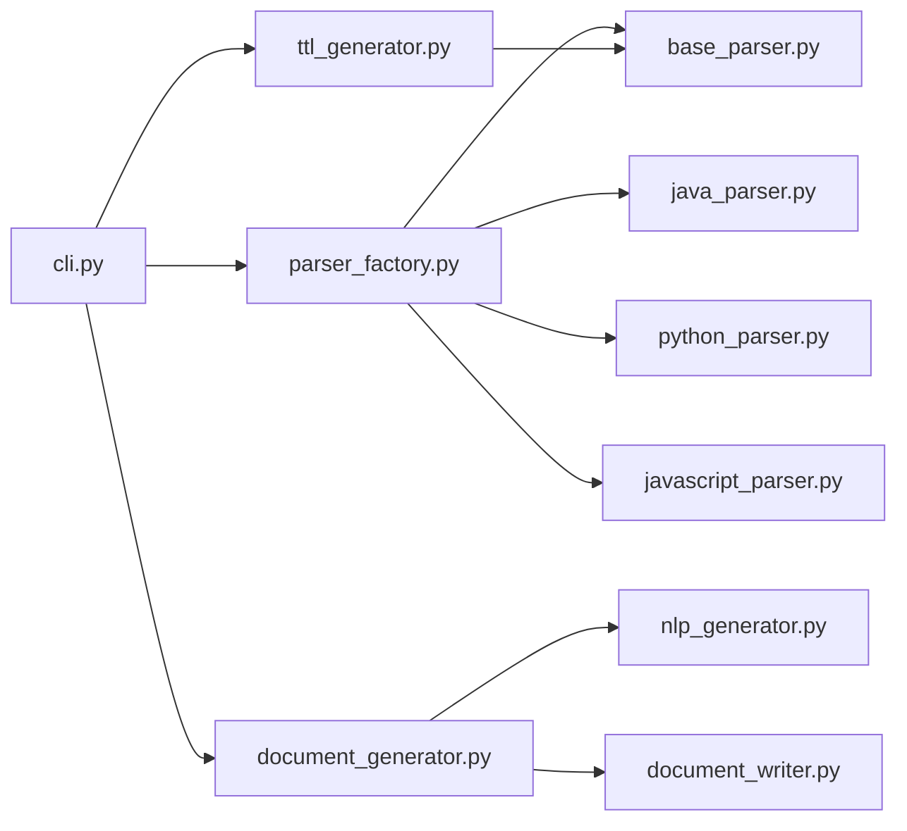

**图表来源**
- [code_processor/cli.py](file://code_processor/cli.py#L23-L26)
- [code_processor/parser_factory.py](file://code_processor/parser_factory.py#L12-L16)
- [code_processor/document_generator.py](file://code_processor/document_generator.py#L13-L18)
- [rd_ontology/ttl_generator.py](file://rd_ontology/ttl_generator.py#L12-L16)

**章节来源**
- [code_processor/requirements.txt](file://code_processor/requirements.txt#L1-L8)
- [tests/test_code_processor.py](file://tests/test_code_processor.py#L1-L139)

## 性能考虑
- 文件过滤：排除常见构建目录与缓存目录，减少 IO
- 解析回退：Java AST 失败时使用正则快速提取，避免完全失败
- 统计与缓存：TTL 生成器缓存元素 IRIs，避免重复计算
- 并行化：CLI 支持混合语言并行分析（多个解析器实例）
- I/O 优化：批量写入 JSON/TTL，避免频繁磁盘操作
- LLM 优化：NLP 生成器提供规则模式回退，避免 LLM 调用失败影响整体性能

**章节来源**
- [code_processor/base_parser.py](file://code_processor/base_parser.py#L242-L261)
- [code_processor/java_parser.py](file://code_processor/java_parser.py#L138-L142)
- [code_processor/nlp_generator.py](file://code_processor/nlp_generator.py#L222-L224)
- [rd_ontology/ttl_generator.py](file://rd_ontology/ttl_generator.py#L63-L76)

## 故障排查指南
- 语言检测失败：确认项目根目录存在语言指示物（如 pom.xml、requirements.txt、package.json、tsconfig.json）或包含受支持扩展名的文件
- Java 解析报错：安装 javalang 依赖
- AST 解析异常：Python/JS/TS 文件存在语法错误时，解析器会记录警告并跳过该文件
- TTL 生成问题：检查输出路径权限与命名空间 base_path 配置
- LLM 生成失败：NLP 生成器会自动回退到规则模式，确保系统稳定性
- 文档保存失败：检查输出目录权限和磁盘空间

**章节来源**
- [code_processor/parser_factory.py](file://code_processor/parser_factory.py#L48-L88)
- [code_processor/java_parser.py](file://code_processor/java_parser.py#L43-L44)
- [code_processor/nlp_generator.py](file://code_processor/nlp_generator.py#L222-L224)
- [code_processor/document_writer.py](file://code_processor/document_writer.py#L172-L174)
- [code_processor/cli.py](file://code_processor/cli.py#L115-L157)
- [rd_ontology/ttl_generator.py](file://rd_ontology/ttl_generator.py#L61-L62)

## 结论
该系统以清晰的分层架构实现了多语言代码解析与本体生成，具备良好的扩展性与可维护性。通过工厂模式与统一抽象，新增语言支持成本低；通过 CLI 与 TTL 生成器，可无缝对接上层应用与知识图谱系统。新增的 NLP 生成器、文档生成器和文档写入器提供了完整的 LLM 增强文档生成流水线，支持标准化的文档格式和元数据管理，为研发知识图谱和规范驱动开发提供了强大的技术支持。

**更新** 新系统提供了完整的多语言代码分析解决方案，包括 Java、Python、JavaScript/TypeScript 解析器，解析器工厂，CLI 接口，以及详细的架构文档。新增的 NLPGenerator、DocumentWriter 和增强的 DocumentGenerator 提供了 LLM 增强的业务意图描述生成功能和标准化文档格式，进一步增强了系统的智能化水平和实用性。

## 附录

### API 接口文档（CLI）
- analyze：单语言或混合语言分析，支持 JSON/TTL 输出
- docs：生成代码描述文档，支持 LLM 增强和批量保存
  - 参数
    - project_path：项目路径
    - -o/--output：输出目录路径
    - --save：保存文档到文件
    - --prefix：文档文件名前缀（默认：doc）
  - 行为：生成标准化 Markdown 文档，包含业务意图描述和元数据
- build：调用 ontology 服务构建本体，支持完整 Pipeline 流程
  - 参数
    - project_path：项目路径
    - -o/--output：输出 TTL 文件路径
    - --use-pipeline：使用完整 Pipeline 构建（推荐）
    - --project-name：项目名称
    - --save-docs：保存文档到磁盘
    - --llm-enhance：启用 LLM 增强
    - --clear-existing：清空现有数据
    - --full-rebuild：强制全量重建
  - 行为：完整的代码本体构建流水线，包含文档生成、LLM 增强和本体构建
- info：显示支持语言与示例

**章节来源**
- [code_processor/cli.py](file://code_processor/cli.py#L116-L376)

### 配置选项
- TTL 基础命名空间：通过 --base-path 指定（默认 ontology_build）
- 日志级别：通过 -v/--verbose 控制（默认 INFO）
- LLM 增强：通过 --llm-enhance 启用，需要配置 LLM 客户端
- 文档保存：通过 --save-docs 控制文档保存行为

**章节来源**
- [code_processor/cli.py](file://code_processor/cli.py#L306-L376)
- [code_processor/document_generator.py](file://code_processor/document_generator.py#L35-L58)

### 扩展指南
- 新增语言支持步骤
  1) 在 code_processor 下创建 new_lang_parser.py，继承 BaseCodeParser
  2) 实现 get_language_type、get_file_extensions、parse_file、extract_relations
  3) 在 code_processor/__init__.py 中导出新解析器类
  4) 在 code_processor/parser_factory.py 中注册解析器
  5) 如需 CLI 支持，可在 code_processor/cli.py 中添加对应参数与分支
- 自定义解析规则
  - 修改对应解析器的正则或 AST 访问逻辑
  - 在 CodeElement/CodeRelation 中扩展额外属性，确保 TTL 映射正确
- 本体映射扩展
  - 在 rd_ontology/ttl_generator.py 中完善 ELEMENT_TYPE_MAP/RELATION_TYPE_MAP
- 新增文档格式规范
  - 在 Document 类中扩展元数据字段
  - 在 DocumentWriter 中添加新的文档类型支持
  - 在 NLPGenerator 中添加新的业务描述规则

**章节来源**
- [code_processor/base_parser.py](file://code_processor/base_parser.py#L206-L360)
- [code_processor/parser_factory.py](file://code_processor/parser_factory.py#L243-L248)
- [code_processor/document_generator.py](file://code_processor/document_generator.py#L569-L697)
- [code_processor/document_writer.py](file://code_processor/document_writer.py#L17-L325)
- [code_processor/nlp_generator.py](file://code_processor/nlp_generator.py#L42-L151)
- [rd_ontology/ttl_generator.py](file://rd_ontology/ttl_generator.py#L21-L59)

### 语言支持详情
- Java：支持 .java 文件，使用 javalang 库进行 AST 解析
- Python：支持 .py 和 .pyw 文件，使用标准库 ast 进行解析
- JavaScript：支持 .js、.jsx、.mjs 文件，使用正则表达式解析
- TypeScript：支持 .ts 和 .tsx 文件，基于 JavaScript 解析器扩展

**章节来源**
- [code_processor/java_parser.py](file://code_processor/java_parser.py#L50-L51)
- [code_processor/python_parser.py](file://code_processor/python_parser.py#L34-L35)
- [code_processor/javascript_parser.py](file://code_processor/javascript_parser.py#L35-L36)
- [code_processor/javascript_parser.py](file://code_processor/javascript_parser.py#L452-L453)

### 使用示例
```bash
# 基本分析
python -m code_processor.cli analyze /path/to/project

# 生成文档
python -m code_processor.cli docs /path/to/project --output docs/

# LLM 增强文档生成
python -m code_processor.cli docs /path/to/project --output docs/ --llm-enhance

# 完整 Pipeline 构建本体
python -m code_processor.cli build /path/to/project --output ontology.ttl --llm-enhance

# 多语言项目分析
python -m code_processor.cli analyze /path/to/project --mixed
```

**章节来源**
- [docs/code-ontology-technical.md](file://docs/code-ontology-technical.md#L280-L318)

### 文档格式规范
- Frontmatter 元数据：包含 doc_type、name、full_name、file_path、line_number、language、package、element_id 等
- 内容结构：Markdown 格式，支持标题、列表、代码块等
- 构建 ID：自动生成，格式为 YYYYMMDD-HHMMSS-<short_hash>
- 目录结构：docs/ontology/code_docs/<project>/<build_id>/ 下的标准组织结构

**章节来源**
- [code_processor/document_writer.py](file://code_processor/document_writer.py#L63-L108)
- [code_processor/document_writer.py](file://code_processor/document_writer.py#L181-L198)
- [code_processor/document_writer.py](file://code_processor/document_writer.py#L135-L143)