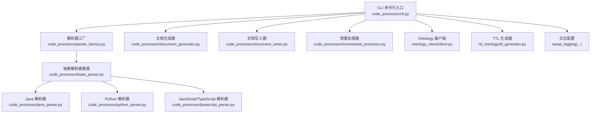
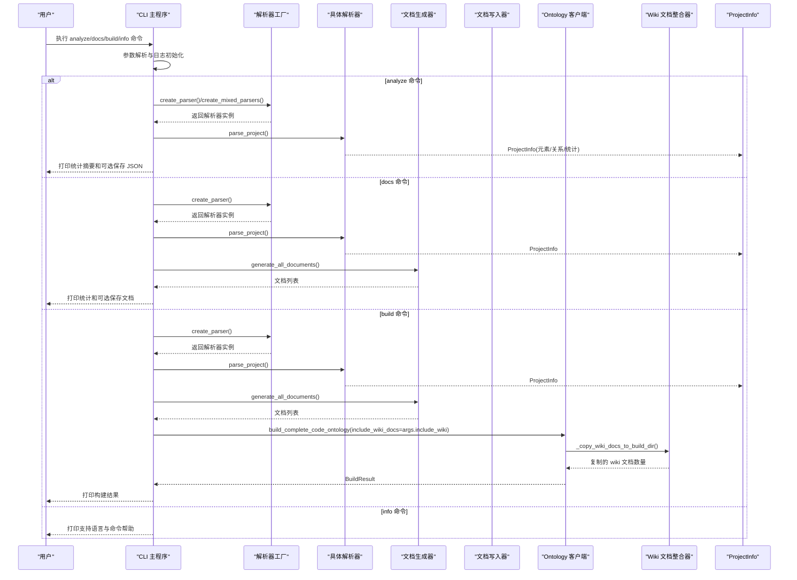
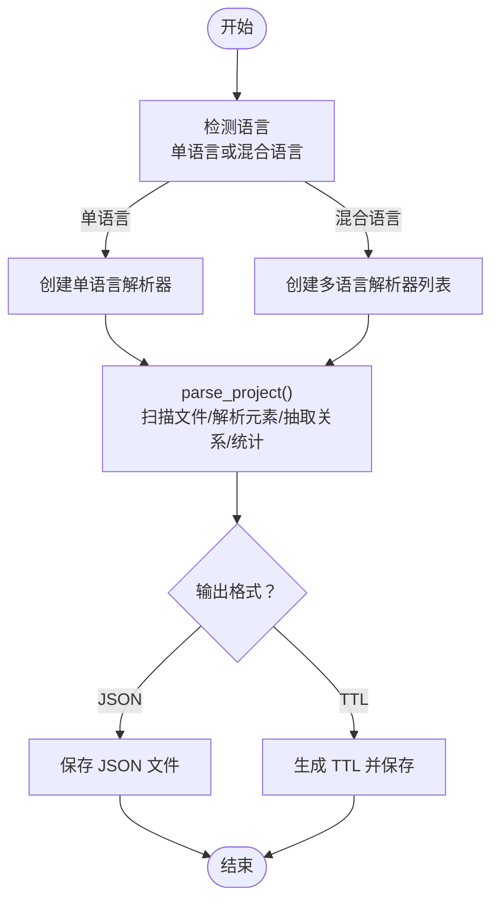
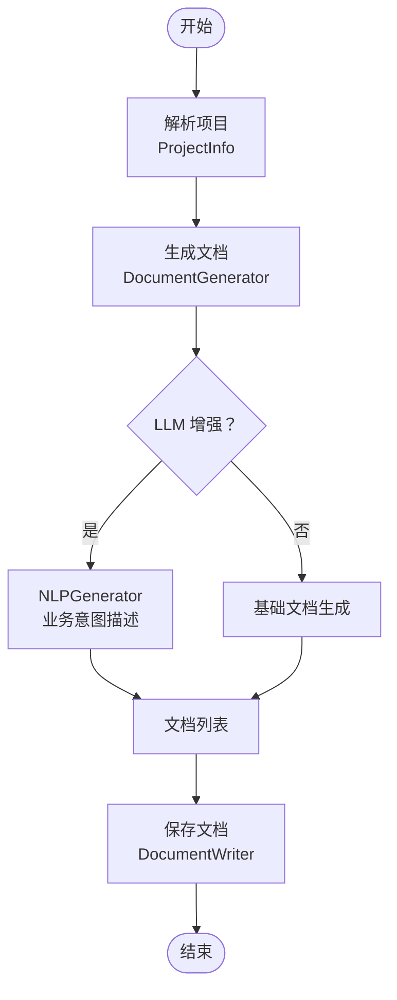
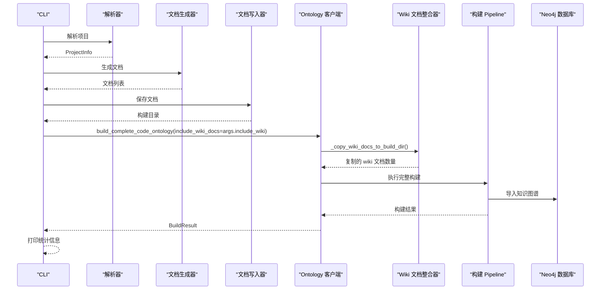
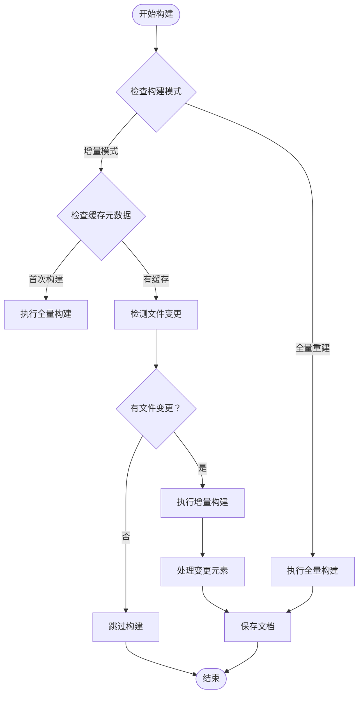
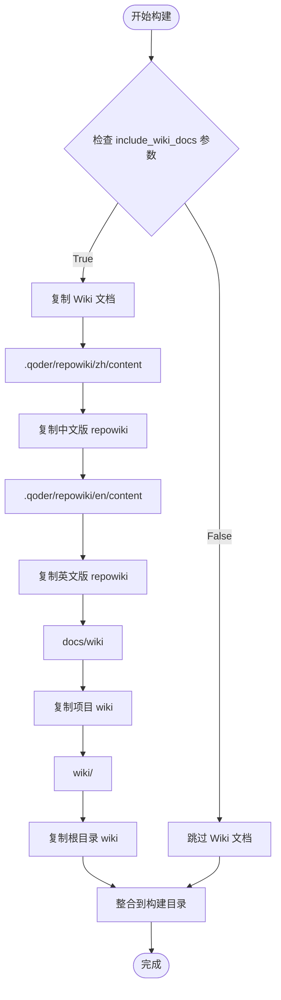
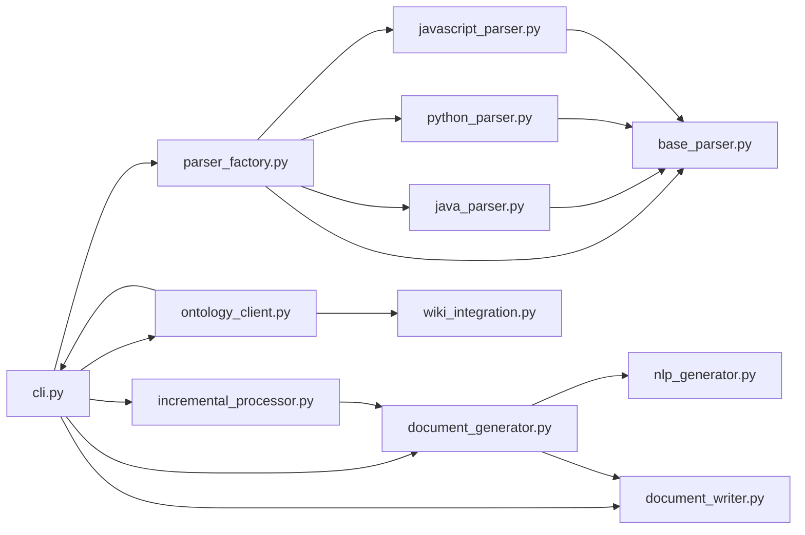

# 命令行接口

<cite>
**本文引用的文件**
- [code_processor/cli.py](file://code_processor/cli.py)
- [code_processor/__init__.py](file://code_processor/__init__.py)
- [code_processor/parser_factory.py](file://code_processor/parser_factory.py)
- [code_processor/base_parser.py](file://code_processor/base_parser.py)
- [code_processor/java_parser.py](file://code_processor/java_parser.py)
- [code_processor/javascript_parser.py](file://code_processor/javascript_parser.py)
- [code_processor/python_parser.py](file://code_processor/python_parser.py)
- [code_processor/document_generator.py](file://code_processor/document_generator.py)
- [code_processor/document_writer.py](file://code_processor/document_writer.py)
- [code_processor/nlp_generator.py](file://code_processor/nlp_generator.py)
- [code_processor/incremental_processor.py](file://code_processor/incremental_processor.py)
- [ontology_client/client.py](file://ontology_client/client.py)
- [code_processor/requirements.txt](file://code_processor/requirements.txt)
- [rd_ontology/ttl_generator.py](file://rd_ontology/ttl_generator.py)
- [tests/test_code_processor.py](file://tests/test_code_processor.py)
- [tests/test_integration.py](file://tests/test_integration.py)
</cite>

## 更新摘要
**变更内容**
- 新增 docs 子命令：专门用于生成代码描述文档
- 新增 build 子命令：调用 ontology 服务构建完整本体流程
- 增强 analyze 命令：支持混合语言分析和更详细的输出
- 新增 LLM 增强功能：支持基于 NLP 的业务意图描述生成
- 新增增量构建支持：基于文件哈希的变更检测机制
- 新增文档保存功能：支持将生成的文档保存到磁盘
- **新增 --full-rebuild 标志：强制全量重建，禁用增量构建模式**
- **增强增量模式检测：智能检测文件变更并执行增量构建**
- **新增 --include-wiki 和 --no-wiki 参数：细粒度控制 wiki 文档集成，默认启用包含 wiki 文档功能**

## 目录
1. [简介](#简介)
2. [项目结构](#项目结构)
3. [核心组件](#核心组件)
4. [架构总览](#架构总览)
5. [详细组件分析](#详细组件分析)
6. [依赖关系分析](#依赖关系分析)
7. [性能考虑](#性能考虑)
8. [故障排查指南](#故障排查指南)
9. [结论](#结论)
10. [附录](#附录)

## 简介
本文件面向代码处理器的命令行接口（CLI），提供从设计架构、参数解析、命令选项、输入输出格式到配置参数的全面技术文档。文档覆盖以下关键主题：
- CLI 工具的整体架构与控制流
- 支持的命令与参数详解（analyze、docs、build、info）
- 单文件分析与混合语言项目批量处理流程
- LLM 增强的文档生成功能
- **增量构建与全量重建模式**
- **Wiki 文档集成与细粒度控制**
- 输入输出格式（JSON、TTL、Markdown）与数据模型
- 错误处理与调试选项
- 在 CI/CD 中的集成实践

## 项目结构
CLI 位于 code_processor 子模块中，围绕"工厂模式 + 抽象解析器 + 文档生成器"的架构组织，支持 Java、Python、JavaScript/TypeScript 的自动识别与混合语言分析，并可将结果转换为 TTL（RDF/Turtle）以构建研发本体。

**图表来源**
- [code_processor/cli.py](file://code_processor/cli.py#L1-L381)
- [code_processor/parser_factory.py](file://code_processor/parser_factory.py#L20-L248)
- [code_processor/document_generator.py](file://code_processor/document_generator.py#L23-L697)
- [code_processor/document_writer.py](file://code_processor/document_writer.py#L110-L325)
- [code_processor/incremental_processor.py](file://code_processor/incremental_processor.py#L25-L281)
- [ontology_client/client.py](file://ontology_client/client.py#L76-L997)

**章节来源**
- [code_processor/cli.py](file://code_processor/cli.py#L1-L381)
- [code_processor/__init__.py](file://code_processor/__init__.py#L1-L40)

## 核心组件
- CLI 主入口与子命令解析：负责参数解析、日志初始化、路由到具体命令函数。
- 解析器工厂与多语言分析器：自动检测项目语言、注册解析器、创建单语言或多语言分析器。
- 抽象解析器与具体语言解析器：统一接口与统计逻辑，针对不同语言实现文件扫描、元素提取与关系抽取。
- 文档生成器：将代码分析结果转换为自然语言描述文档，支持 LLM 增强的业务意图描述生成。
- 文档写入器：负责将生成的文档保存到磁盘，管理构建 ID 和目录结构。
- **增量处理器：基于文件哈希检测代码变更，实现智能增量构建和全量重建功能。**
- **Ontology 客户端：调用 ontology 服务进行完整的本体构建流程，包括 Pipeline 构建、导入和 Wiki 文档整合。**
- **Wiki 文档整合器：支持多种来源的 wiki 文档复制和整合，包括 Qoder 生成的 repowiki 和项目自带的 wiki 目录。**

**章节来源**
- [code_processor/cli.py](file://code_processor/cli.py#L1-L381)
- [code_processor/parser_factory.py](file://code_processor/parser_factory.py#L20-L248)
- [code_processor/document_generator.py](file://code_processor/document_generator.py#L23-L697)
- [code_processor/document_writer.py](file://code_processor/document_writer.py#L110-L325)
- [code_processor/incremental_processor.py](file://code_processor/incremental_processor.py#L25-L281)
- [ontology_client/client.py](file://ontology_client/client.py#L76-L997)

## 架构总览
CLI 采用子命令模式，支持 analyze、docs、build、info 四个命令；analyze 支持单语言与混合语言分析，docs 专门生成代码描述文档，build 调用 ontology 服务构建完整本体流程，info 展示支持的语言与命令帮助。**新增的 Wiki 文档集成功能允许用户细粒度控制是否将项目 wiki 文档整合到构建过程中。**

**图表来源**
- [code_processor/cli.py](file://code_processor/cli.py#L40-L381)
- [code_processor/parser_factory.py](file://code_processor/parser_factory.py#L122-L171)
- [code_processor/document_generator.py](file://code_processor/document_generator.py#L69-L134)
- [code_processor/document_writer.py](file://code_processor/document_writer.py#L126-L179)
- [ontology_client/client.py](file://ontology_client/client.py#L614-L778)

## 详细组件分析

### CLI 命令与参数
- 全局选项
  - -v, --verbose：启用详细日志输出
- 子命令
  - analyze
    - 参数
      - project_path：项目路径（必填）
      - -l, --language：强制指定语言（java、python、javascript、typescript）
      - -o, --output：输出文件路径
      - --mixed：混合语言分析（自动识别项目中的多种语言）
  - docs
    - 参数
      - project_path：项目路径（必填）
      - -o, --output：输出目录路径
      - --save：保存文档到文件
      - --prefix：文档文件名前缀（默认：doc）
  - build
    - 参数
      - project_path：项目路径（必填）
      - -o, --output：输出 TTL 文件路径
      - -d, --domain：本体域名（默认：rd）
      - --schema：模式 TTL 文件路径
      - --import-neo4j：导入到 Neo4j（旧方式）
      - --use-pipeline：使用完整 Pipeline 构建（推荐，默认启用）
      - --no-pipeline：不使用 Pipeline，使用旧方式构建
      - --project-name：项目名称（默认使用目录名）
      - --database：Neo4j 数据库名称（默认：ontologydevos）
      - --save-docs：保存文档到磁盘（默认启用）
      - --no-save-docs：不保存文档到磁盘
      - --llm-enhance：启用 LLM 增强文档生成
      - --clear-existing：清空现有数据后再导入
      - **--full-rebuild：强制全量重建（禁用增量构建模式）**
      - **--include-wiki：包含项目 wiki 文档（.qoder/repowiki 等，默认启用）**
      - **--no-wiki：不包含 wiki 文档**
  - info
    - 无参数，打印支持语言与命令帮助

**章节来源**
- [code_processor/cli.py](file://code_processor/cli.py#L299-L381)

### 分析流程（单语言与混合语言）
- 单语言分析
  - 通过解析器工厂检测或强制指定语言，创建对应解析器
  - 解析项目：扫描源文件、逐文件解析、提取元素与关系、统计包结构与指标
  - 输出：控制台汇总统计；可选保存 JSON
- 混合语言分析
  - 自动识别项目中出现的所有语言，为每种语言创建解析器
  - 对各语言分别进行分析，汇总统计与结果
  - 可保存合并后的 JSON 结果

**图表来源**
- [code_processor/parser_factory.py](file://code_processor/parser_factory.py#L122-L171)
- [code_processor/base_parser.py](file://code_processor/base_parser.py#L263-L298)
- [code_processor/cli.py](file://code_processor/cli.py#L40-L114)

**章节来源**
- [code_processor/parser_factory.py](file://code_processor/parser_factory.py#L90-L171)
- [code_processor/base_parser.py](file://code_processor/base_parser.py#L263-L298)
- [code_processor/cli.py](file://code_processor/cli.py#L40-L114)

### 文档生成与 LLM 增强
- 文档生成器支持多种文档类型：项目概览、类、接口、模块、函数、关系
- LLM 增强功能：基于 NLP 生成业务意图描述，而非简单的 AST 翻译
- 文档写入器：将生成的文档保存到磁盘，管理构建 ID 和目录结构
- **增量处理：基于文件哈希检测变更，实现智能增量文档生成**

**图表来源**
- [code_processor/document_generator.py](file://code_processor/document_generator.py#L69-L134)
- [code_processor/nlp_generator.py](file://code_processor/nlp_generator.py#L18-L569)
- [code_processor/document_writer.py](file://code_processor/document_writer.py#L126-L179)

**章节来源**
- [code_processor/document_generator.py](file://code_processor/document_generator.py#L23-L697)
- [code_processor/nlp_generator.py](file://code_processor/nlp_generator.py#L18-L569)
- [code_processor/document_writer.py](file://code_processor/document_writer.py#L110-L325)

### 本体构建流程与 Pipeline 架构
- 完整 Pipeline 构建：解析项目 → 检测变更 → 生成文档 → 保存文档 → **整合 Wiki 文档** → 构建本体 → 导入 Neo4j
- **增量构建支持：基于文件哈希的变更检测，智能选择增量或全量构建模式**
- LLM 增强：支持基于 NLP 的业务意图描述生成
- 多数据库支持：支持多个 Neo4j 数据库的配置和切换
- **Wiki 文档整合：支持多种来源的 wiki 文档复制和整合**

**图表来源**
- [code_processor/cli.py](file://code_processor/cli.py#L160-L264)
- [ontology_client/client.py](file://ontology_client/client.py#L614-L778)
- [code_processor/incremental_processor.py](file://code_processor/incremental_processor.py#L100-L182)

**章节来源**
- [code_processor/cli.py](file://code_processor/cli.py#L160-L264)
- [ontology_client/client.py](file://ontology_client/client.py#L614-L778)
- [code_processor/incremental_processor.py](file://code_processor/incremental_processor.py#L25-L281)

### 增量构建与全量重建模式
**更新** 新增了完整的增量构建支持系统，包括智能模式检测和全量重建功能。

- **智能增量检测**：基于文件哈希的变更检测，自动判断是否需要增量构建
- **全量重建模式**：通过 `--full-rebuild` 标志强制执行全量构建
- **元数据管理**：使用 `.ontology_cache` 目录存储文件哈希和变更历史
- **变更分类**：区分新增、修改、删除和未变更文件
- **元素过滤**：根据文件变更自动过滤需要处理的代码元素

**图表来源**
- [code_processor/cli.py](file://code_processor/cli.py#L192-L203)
- [code_processor/incremental_processor.py](file://code_processor/incremental_processor.py#L193-L211)
- [ontology_client/client.py](file://ontology_client/client.py#L687-L709)

**章节来源**
- [code_processor/cli.py](file://code_processor/cli.py#L192-L203)
- [code_processor/incremental_processor.py](file://code_processor/incremental_processor.py#L57-L281)
- [ontology_client/client.py](file://ontology_client/client.py#L669-L777)

### Wiki 文档集成与细粒度控制
**新增** 新增了完整的 Wiki 文档集成功能，支持多种来源的 wiki 文档复制和整合。

- **默认启用**：`--include-wiki` 参数默认启用，包含项目 wiki 文档
- **细粒度控制**：通过 `--no-wiki` 参数禁用 wiki 文档集成
- **多来源支持**：支持以下 wiki 文档来源（按优先级）：
  - `.qoder/repowiki/zh/content`：Qoder 生成的中文版项目文档
  - `.qoder/repowiki/en/content`：Qoder 生成的英文版项目文档
  - `docs/wiki`：项目自带的 wiki 文档目录
  - `wiki/`：项目根目录的 wiki 文档
- **递归复制**：自动递归复制所有 `.md` 文件到对应的构建目录
- **目录结构保持**：复制时保持原有的相对路径结构
- **日志记录**：详细记录每个来源的复制统计信息

**图表来源**
- [code_processor/cli.py](file://code_processor/cli.py#L203-L204)
- [ontology_client/client.py](file://ontology_client/client.py#L941-L1003)

**章节来源**
- [code_processor/cli.py](file://code_processor/cli.py#L358-L361)
- [ontology_client/client.py](file://ontology_client/client.py#L941-L1003)

### 输入输出格式与数据模型
- 输入
  - 项目根目录（包含源代码文件）
  - 语言指示（自动检测或显式指定）
  - LLM 配置（可选，用于增强文档生成）
  - **增量构建配置（可选，通过缓存元数据自动检测）**
  - **Wiki 文档集成配置（可选，通过 --include-wiki/--no-wiki 参数控制）**
- 输出（analyze 命令）
  - 控制台统计摘要（元素总数、关系总数、文件数、包数等）
  - JSON 文件（可选）
  - TTL 文件（可选）
- 输出（docs 命令）
  - Markdown 文档文件（可选保存）
  - 统计信息（类、接口、方法、函数数量）
- 输出（build 命令）
  - TTL 文件（RDF/Turtle 格式）
  - 构建目录（包含项目文档和关系文档）
  - **构建目录（包含复制的 wiki 文档）**
  - 构建结果统计（实体数、关系数、耗时等）
  - **增量构建统计信息（变更文件数量、处理元素数量）**
- 输出（info 命令）
  - 支持的语言列表
  - 命令帮助信息

数据模型（简化）
- ProjectInfo：包含 elements、relations、packages、statistics、dependencies
- CodeElement：元素类型、名称、全名、文件路径、行号、修饰符、注解、文档字符串、参数、返回类型、父子关系等
- CodeRelation：关系类型、源/目标、上下文等
- Document：文档对象，包含内容、类型、元数据等
- BuildResult：构建结果，包含成功状态、统计信息、错误列表等
- **IncrementalResult：增量构建结果，包含变更检测统计、处理元素数量等**
- **WikiIntegrationResult：Wiki 文档整合结果，包含复制的文档数量和来源统计**

**章节来源**
- [code_processor/base_parser.py](file://code_processor/base_parser.py#L173-L204)
- [code_processor/base_parser.py](file://code_processor/base_parser.py#L82-L171)
- [code_processor/document_writer.py](file://code_processor/document_writer.py#L17-L62)
- [ontology_client/client.py](file://ontology_client/client.py#L28-L74)

### TTL 生成与本体映射
- TTL 生成器将 ProjectInfo 转换为 RDF/Turtle 实例数据
- 类型映射：ElementType 映射到 CodeClass、CodeInterface、CodeMethod、CodeField、CodeModule、CodeEnum、CodeComponent、CodeProperty 等
- 关系映射：RelationType 映射到 inherits、implements、extends、dependsOn、calls、uses、imports、overrides、decorates 等
- IRI 生成：基于稳定哈希生成实例 IRI，避免重复与冲突
- 前缀与注释：输出包含前缀声明与项目元信息注释

**章节来源**
- [rd_ontology/ttl_generator.py](file://rd_ontology/ttl_generator.py#L18-L321)

### 错误处理与调试
- 参数校验：项目路径存在性、语言有效性、LLM 配置有效性
- 异常捕获：命令函数内捕获异常并按需打印堆栈（verbose）
- 日志级别：verbose 时为 DEBUG，否则 INFO
- 文件解析失败：记录警告并继续处理其他文件
- Java 解析依赖：缺少 javalang 时抛出导入错误
- Pipeline 构建：支持增量构建和全量重建模式
- **增量构建错误处理**：文件哈希计算失败时的回退机制和错误日志记录
- **Wiki 文档复制错误处理**：源目录不存在或权限不足时的错误处理和日志记录

**章节来源**
- [code_processor/cli.py](file://code_processor/cli.py#L40-L264)
- [code_processor/java_parser.py](file://code_processor/java_parser.py#L42-L46)
- [code_processor/incremental_processor.py](file://code_processor/incremental_processor.py#L63-L65)
- [ontology_client/client.py](file://ontology_client/client.py#L779-L787)

### 使用示例
- 查看帮助与支持语言
  - python -m code_processor.cli info
- 单语言分析并输出 JSON
  - python -m code_processor.cli analyze /path/to/project
  - python -m code_processor.cli analyze /path/to/project --output result.json
  - python -m code_processor.cli analyze /path/to/project --language java
- 单语言分析并输出 TTL
  - python -m code_processor.cli analyze /path/to/project --format ttl --output ontology.ttl
- 混合语言分析
  - python -m code_processor.cli analyze /path/to/project --mixed
  - python -m code_processor.cli analyze /path/to/project --mixed --output multi_result.json
- 直接生成 TTL
  - python -m code_processor.cli ttl /path/to/project --output rd_java_instance.ttl
  - python -m code_processor.cli ttl /path/to/project --base-path my_base --output rd_instance.ttl
- 生成代码描述文档
  - python -m code_processor.cli docs /path/to/project --output docs/
  - python -m code_processor.cli docs /path/to/project --save --prefix code_doc
- 完整本体构建（推荐）
  - python -m code_processor.cli build /path/to/project --output ontology.ttl
  - python -m code_processor.cli build /path/to/project --import-neo4j
  - python -m code_processor.cli build /path/to/project --llm-enhance --save-docs
  - **python -m code_processor.cli build /path/to/project --full-rebuild**
  - **python -m code_processor.cli build /path/to/project --no-wiki**
- **增量构建与全量重建**
  - **智能增量构建（默认）**：python -m code_processor.cli build /path/to/project
  - **强制全量重建**：python -m code_processor.cli build /path/to/project --full-rebuild
  - **增量构建 + LLM 增强**：python -m code_processor.cli build /path/to/project --llm-enhance
  - **包含 Wiki 文档**：python -m code_processor.cli build /path/to/project --include-wiki
  - **禁用 Wiki 文档**：python -m code_processor.cli build /path/to/project --no-wiki

**章节来源**
- [code_processor/cli.py](file://code_processor/cli.py#L266-L296)

### CI/CD 集成建议
- 在流水线步骤中调用 analyze 命令，将 JSON/TTL 产物上传为 Artifacts
- 使用 --mixed 选项在多语言项目中统一分析
- 使用 --llm-enhance 选项启用 LLM 增强文档生成
- 使用 --use-pipeline 选项启用完整 Pipeline 构建流程
- **使用 --full-rebuild 选项在需要强制全量重建时禁用增量模式**
- **使用 --no-wiki 选项在不需要 Wiki 文档时禁用集成，提升构建速度**
- **在增量构建场景下，利用缓存元数据实现快速增量更新**
- 将 --verbose 用于问题定位与审计日志
- 将 TTL 产物用于后续本体推理或知识图谱构建
- **合理配置 Wiki 文档集成策略，平衡构建完整性和构建速度**

## 依赖关系分析

**图表来源**
- [code_processor/cli.py](file://code_processor/cli.py#L23-L26)
- [code_processor/parser_factory.py](file://code_processor/parser_factory.py#L12-L15)
- [code_processor/document_generator.py](file://code_processor/document_generator.py#L13-L18)
- [code_processor/incremental_processor.py](file://code_processor/incremental_processor.py#L14-L20)
- [ontology_client/client.py](file://ontology_client/client.py#L23-L24)

**章节来源**
- [code_processor/__init__.py](file://code_processor/__init__.py#L11-L39)

## 性能考虑
- 文件过滤：排除常见构建目录与缓存目录，减少扫描开销
- 语言检测：综合项目标识与文件扩展名打分，提高准确性
- 解析策略：AST 解析优先，失败回退到正则/基本提取，平衡准确度与速度
- LLM 增强：可选的 LLM 增强功能，避免不必要的性能开销
- **增量构建：基于文件哈希的变更检测，显著提升大型项目的构建效率**
- **智能缓存管理**：增量处理器自动管理元数据缓存，避免重复计算
- **Wiki 文档复制优化**：仅复制存在的文档，跳过不存在的源目录
- 文档缓存：文档写入器管理构建 ID 和目录结构，避免重复处理
- 输出：TTL 生成器对元素进行 IRI 缓存，避免重复计算

## 故障排查指南
- 无法找到解析器
  - 症状：提示不支持的语言
  - 处理：确认项目语言是否受支持，或使用 --language 指定
- Java 解析失败
  - 症状：缺少 javalang 依赖
  - 处理：安装依赖后重试
- 项目路径不存在
  - 症状：报错路径不存在
  - 处理：确认路径正确
- LLM 配置问题
  - 症状：LLM 增强功能失败
  - 处理：检查 LLM 客户端配置和 API 密钥
- Pipeline 构建失败
  - 症状：本体构建过程中出现错误
  - 处理：使用 --verbose 查看详细日志，检查 ontology 项目配置
- **增量构建问题**
  - **症状**：增量构建不生效或产生错误
  - **处理**：使用 --full-rebuild 强制全量重建，检查文件哈希计算和缓存元数据
  - **症状**：缓存元数据损坏
  - **处理**：删除 .ontology_cache 目录，重新执行构建
- **全量重建模式**
  - **症状**：构建时间过长
  - **处理**：移除 --full-rebuild 标志，启用智能增量构建
- **Wiki 文档集成问题**
  - **症状**：Wiki 文档未被复制或复制失败
  - **处理**：检查源目录是否存在和可访问，确认 --include-wiki 参数设置
  - **症状**：构建目录中缺少 wiki 文档
  - **处理**：确认项目中存在支持的 wiki 文档源目录
- 详细日志
  - 使用 -v 查看 DEBUG 级别日志，定位解析与关系抽取问题
  - **使用 -v 查看增量构建的详细日志，包括文件变更检测过程**
  - **使用 -v 查看 Wiki 文档复制的详细日志，包括源目录扫描和复制统计**
- 测试参考
  - 可参考单元测试了解解析器行为与断言点

**章节来源**
- [code_processor/cli.py](file://code_processor/cli.py#L40-L264)
- [code_processor/java_parser.py](file://code_processor/java_parser.py#L42-L46)
- [code_processor/incremental_processor.py](file://code_processor/incremental_processor.py#L232-L232)
- [tests/test_code_processor.py](file://tests/test_code_processor.py#L17-L139)
- [tests/test_integration.py](file://tests/test_integration.py#L1-L200)

## 结论
该 CLI 工具以清晰的子命令结构与工厂模式为核心，实现了对多语言项目的统一分析、文档生成和本体构建。其参数设计简洁明确，支持单文件与批量处理场景，并提供了丰富的输出格式与调试能力。新增的 docs、build 子命令和 LLM 增强功能进一步提升了工具的实用性和智能化水平。**新增的增量构建支持、--full-rebuild 标志以及 Wiki 文档集成功能使得工具能够智能地在性能和准确性之间取得平衡，既能在大型项目中实现快速增量构建，又能在需要时强制全量重建以确保数据一致性，同时还提供了灵活的 Wiki 文档集成策略。**结合 CI/CD 流水线，可将代码分析结果纳入持续化的本体构建与知识工程流程。

## 附录

### 支持的语言与文件扩展名
- Java：.java
- Python：.py, .pyw
- JavaScript/TypeScript：.js, .jsx, .mjs, .ts, .tsx

**章节来源**
- [code_processor/java_parser.py](file://code_processor/java_parser.py#L50-L51)
- [code_processor/python_parser.py](file://code_processor/python_parser.py#L34-L35)
- [code_processor/javascript_parser.py](file://code_processor/javascript_parser.py#L35-L36)

### 依赖项
- javalang：Java AST 解析
- tqdm（可选）：进度条显示
- LLM 客户端（可选）：用于增强文档生成
- dotenv（可选）：用于加载环境变量

**章节来源**
- [code_processor/requirements.txt](file://code_processor/requirements.txt#L1-L8)

### 增量构建工作原理
**更新** 新增了完整的增量构建工作原理说明。

- **文件哈希计算**：基于 SHA256 哈希值检测文件变更，确保变更检测的准确性
- **元数据管理**：维护 .ontology_cache 目录存储文件元数据，包括哈希值、修改时间和大小
- **变更检测**：比较当前文件哈希与缓存哈希值，自动分类文件变更类型
- **元素过滤**：根据文件变更自动过滤代码元素，实现精确的增量处理
- **智能模式检测**：首次构建执行全量，后续构建根据变更情况自动选择增量或跳过
- **全量重建支持**：通过 --full-rebuild 标志强制执行全量构建，清除缓存元数据

**章节来源**
- [code_processor/incremental_processor.py](file://code_processor/incremental_processor.py#L57-L182)
- [code_processor/incremental_processor.py](file://code_processor/incremental_processor.py#L223-L232)

### 增量构建配置选项
**新增** 详细的增量构建配置说明。

- **默认行为**：启用智能增量构建，自动检测文件变更
- **强制全量**：使用 --full-rebuild 标志禁用增量模式，强制全量重建
- **缓存位置**：增量元数据存储在项目根目录的 .ontology_cache 目录中
- **缓存清理**：可通过 clear_metadata() 方法清除缓存，触发下次全量构建
- **变更检测范围**：检测新增、修改、删除和未变更文件，自动过滤处理范围

**章节来源**
- [code_processor/cli.py](file://code_processor/cli.py#L192-L193)
- [code_processor/incremental_processor.py](file://code_processor/incremental_processor.py#L223-L232)
- [ontology_client/client.py](file://ontology_client/client.py#L687-L709)

### Wiki 文档集成配置选项
**新增** 详细的 Wiki 文档集成配置说明。

- **默认行为**：启用包含 Wiki 文档功能，自动集成项目文档
- **禁用集成**：使用 --no-wiki 标志禁用 Wiki 文档集成，提升构建速度
- **支持的源目录**：
  - `.qoder/repowiki/zh/content`：Qoder 生成的中文版项目文档
  - `.qoder/repowiki/en/content`：Qoder 生成的英文版项目文档
  - `docs/wiki`：项目自带的 wiki 文档目录
  - `wiki/`：项目根目录的 wiki 文档
- **复制策略**：递归复制所有 .md 文件，保持原有目录结构
- **日志记录**：详细记录每个源目录的复制统计信息
- **错误处理**：跳过不存在或不可访问的源目录，不影响整体构建流程

**章节来源**
- [code_processor/cli.py](file://code_processor/cli.py#L358-L361)
- [ontology_client/client.py](file://ontology_client/client.py#L941-L1003)