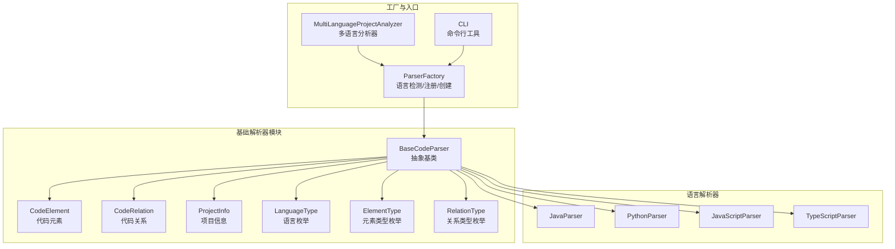
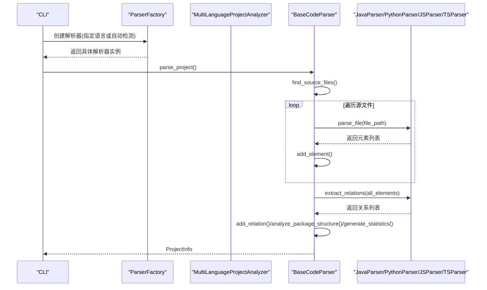
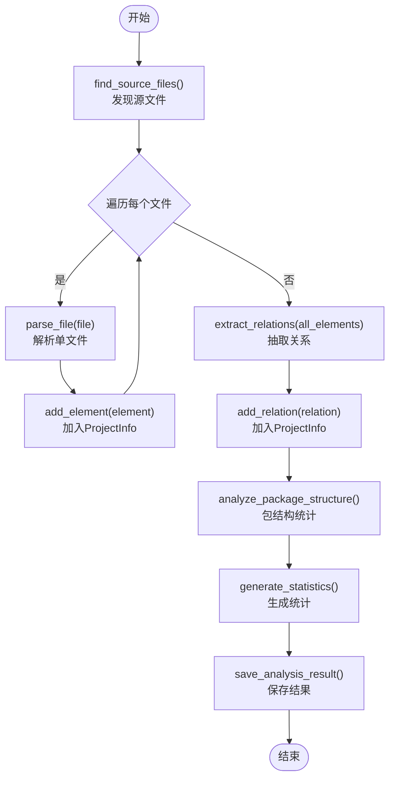
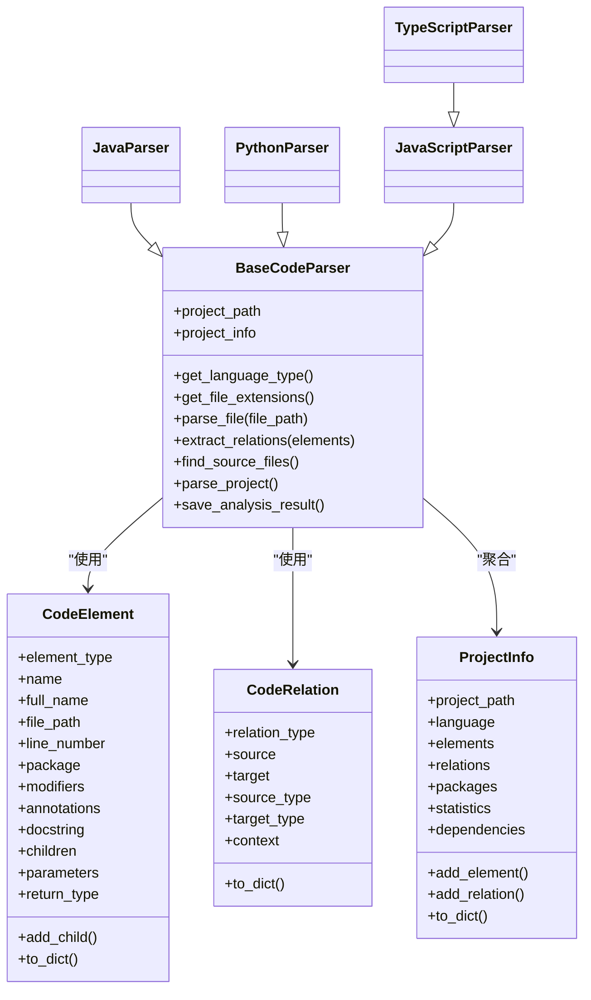

# 基础解析器

<cite>
**本文引用的文件列表**
- [base_parser.py](file://code_processor/base_parser.py)
- [java_parser.py](file://code_processor/java_parser.py)
- [python_parser.py](file://code_processor/python_parser.py)
- [javascript_parser.py](file://code_processor/javascript_parser.py)
- [parser_factory.py](file://code_processor/parser_factory.py)
- [cli.py](file://code_processor/cli.py)
- [test_code_processor.py](file://tests/test_code_processor.py)
- [__init__.py](file://code_processor/__init__.py)
</cite>

## 目录
1. [简介](#简介)
2. [项目结构](#项目结构)
3. [核心组件](#核心组件)
4. [架构总览](#架构总览)
5. [详细组件分析](#详细组件分析)
6. [依赖分析](#依赖分析)
7. [性能考虑](#性能考虑)
8. [故障排查指南](#故障排查指南)
9. [结论](#结论)
10. [附录：自定义解析器开发指南](#附录自定义解析器开发指南)

## 简介
本文件面向“基础解析器”模块，系统性阐述 BaseCodeParser 抽象基类的设计与实现，以及与其配套的数据模型（CodeElement、CodeRelation、ProjectInfo）和枚举类型（LanguageType、ElementType、RelationType）。文档同时给出 Java、Python、JavaScript/TypeScript 三种语言解析器的具体实现要点，并提供基于工厂模式的多语言项目分析能力说明。最后，提供继承 BaseCodeParser 开发自定义解析器的完整指南，帮助读者快速扩展支持新的编程语言或定制化需求。

## 项目结构
基础解析器位于 code_processor 子模块中，采用“抽象基类 + 多语言具体实现 + 工厂 + CLI”的分层设计：
- 抽象层：BaseCodeParser 定义统一接口与通用流程
- 数据层：CodeElement、CodeRelation、ProjectInfo 描述代码元素、关系与项目信息
- 实现层：JavaParser、PythonParser、JavaScriptParser/TypeScriptParser 提供语言特定解析
- 工厂层：ParserFactory 负责语言检测与解析器实例化
- 入口层：CLI 提供命令行分析与 TTL 输出

图表来源
- [base_parser.py](file://code_processor/base_parser.py#L206-L358)
- [java_parser.py](file://code_processor/java_parser.py#L39-L425)
- [python_parser.py](file://code_processor/python_parser.py#L22-L455)
- [javascript_parser.py](file://code_processor/javascript_parser.py#L22-L548)
- [parser_factory.py](file://code_processor/parser_factory.py#L20-L248)
- [cli.py](file://code_processor/cli.py#L16-L215)

章节来源
- [base_parser.py](file://code_processor/base_parser.py#L1-L358)
- [parser_factory.py](file://code_processor/parser_factory.py#L1-L248)
- [cli.py](file://code_processor/cli.py#L1-L215)

## 核心组件
本节聚焦于抽象基类与数据模型的职责边界、字段定义、类型约束与业务规则。

- 抽象基类 BaseCodeParser
  - 职责：统一解析流程控制、文件发现、统计与保存；定义语言类型、文件扩展名、单文件解析、关系抽取等抽象接口
  - 关键抽象方法：get_language_type、get_file_extensions、parse_file、extract_relations
  - 关键通用方法：find_source_files、parse_project、analyze_package_structure、generate_statistics、save_analysis_result

- 数据模型
  - CodeElement：描述单一代码元素，包含类型、名称、全名、文件路径、行号、包名、修饰符、注解、文档字符串、额外属性、子元素列表、参数列表、返回类型等
  - CodeRelation：描述元素间关系，包含关系类型、源目标标识、源目标类型、上下文、额外属性
  - ProjectInfo：聚合项目级信息，包含项目路径、语言、元素列表、关系列表、包统计、统计信息、依赖列表

- 枚举类型
  - LanguageType：JAVA、PYTHON、JAVASCRIPT、TYPESCRIPT、UNKNOWN
  - ElementType：通用类型（类、接口、函数、方法、字段、变量、模块、包）及语言特有类型（枚举、注解、构造器、装饰器、属性、组件、钩子、导入、导出）
  - RelationType：继承/实现/扩展、依赖/调用/使用/导入、包含/组合、访问/修改、覆盖/装饰/抛出/返回等

章节来源
- [base_parser.py](file://code_processor/base_parser.py#L17-L205)

## 架构总览
下图展示从 CLI 到工厂再到具体解析器的调用链路，以及解析器内部的项目解析主流程。

图表来源
- [cli.py](file://code_processor/cli.py#L32-L102)
- [parser_factory.py](file://code_processor/parser_factory.py#L122-L160)
- [base_parser.py](file://code_processor/base_parser.py#L263-L298)

## 详细组件分析

### 抽象基类 BaseCodeParser
- 设计要点
  - 统一初始化：校验项目路径存在性，记录日志
  - 文件发现：按扩展名递归查找，过滤常见构建/缓存目录
  - 项目解析：遍历文件解析、聚合元素、抽取关系、分析包结构、生成统计、保存结果
  - 可扩展点：子类需实现语言类型、扩展名集合、单文件解析、关系抽取

- 关键流程（项目解析）

图表来源
- [base_parser.py](file://code_processor/base_parser.py#L242-L298)

章节来源
- [base_parser.py](file://code_processor/base_parser.py#L206-L358)

### 数据模型：CodeElement、CodeRelation、ProjectInfo
- CodeElement 字段与约束
  - 必填：element_type、name
  - 常用：full_name（默认与 name 相同）、file_path、line_number、package
  - 行为：children（子元素列表）、parameters（参数列表）、return_type（返回类型）
  - 扩展：extra_attributes（语言特定元数据）
  - 方法：add_child、to_dict

- CodeRelation 字段与约束
  - 必填：relation_type、source、target
  - 可选：source_type、target_type、context
  - 扩展：extra_attributes
  - 方法：to_dict

- ProjectInfo 字段与约束
  - 必填：project_path、language
  - 结构：elements、relations、packages、statistics、dependencies
  - 方法：add_element、add_relation、to_dict

- 业务规则
  - 元素全名用于跨文件唯一标识与关系索引
  - 包统计仅在存在 package 字段时计入
  - 统计信息包含元素/关系类型分布与包数量

章节来源
- [base_parser.py](file://code_processor/base_parser.py#L82-L204)

### 语言解析器实现

#### JavaParser
- 特性
  - 依赖 javalang 库进行 AST 解析
  - 支持类、接口、枚举、方法、字段、注解、导入、继承/实现关系抽取
  - 当 AST 解析失败时回退到正则基础提取

- 关键实现
  - get_language_type、get_file_extensions、parse_file、extract_relations
  - _parse_java_file、_extract_* 系列方法分别抽取类/接口/枚举/方法/字段信息
  - _extract_basic_info 作为降级策略

章节来源
- [java_parser.py](file://code_processor/java_parser.py#L39-L425)

#### PythonParser
- 特性
  - 使用 AST + 自定义 NodeVisitor 遍历节点
  - 支持类、函数/方法、字段、导入、装饰器、属性、异步函数、参数类型注解等
  - 关系抽取涵盖继承、覆盖、调用、导入、装饰等

- 关键实现
  - get_language_type、get_file_extensions、parse_file、extract_relations
  - PythonASTVisitor.visit_* 系列方法处理各类 AST 节点
  - _analyze_function_calls 收集被调用函数名

章节来源
- [python_parser.py](file://code_processor/python_parser.py#L22-L455)

#### JavaScriptParser 与 TypeScriptParser
- JavaScriptParser
  - 正则驱动解析 import/export、函数、类、React 组件、变量等
  - 关系抽取包含继承、导入、调用、Hook 使用等
- TypeScriptParser
  - 在 JS 基础上扩展接口、类型别名、枚举解析

章节来源
- [javascript_parser.py](file://code_processor/javascript_parser.py#L22-L548)

### 工厂与多语言分析
- ParserFactory
  - 语言检测：基于项目指示文件与文件扩展名打分
  - 混合语言检测：扫描所有受支持扩展名与指示文件
  - 注册机制：通过 register_parser 注册解析器类
  - 创建解析器：create_parser/create_mixed_parsers

- MultiLanguageProjectAnalyzer
  - 对每个检测到的语言创建解析器并执行分析
  - 合并结果、保存多语言汇总、输出项目概览

章节来源
- [parser_factory.py](file://code_processor/parser_factory.py#L20-L248)

### CLI 交互
- analyze 子命令：单语言或多语言分析，支持 JSON/TTL 输出
- ttl 子命令：直接生成 TTL 文件
- info 子命令：列出支持语言与示例

章节来源
- [cli.py](file://code_processor/cli.py#L32-L164)

## 依赖分析
- 继承关系
  - JavaParser、PythonParser、JavaScriptParser、TypeScriptParser 均继承自 BaseCodeParser
- 组合关系
  - BaseCodeParser 使用 CodeElement、CodeRelation、ProjectInfo 进行数据建模
  - ParserFactory 维护 LanguageType 到解析器类的映射
- 外部依赖
  - JavaParser 依赖 javalang
  - CLI 依赖 TTLGenerator（来自 rd_ontology）

图表来源
- [base_parser.py](file://code_processor/base_parser.py#L206-L358)
- [java_parser.py](file://code_processor/java_parser.py#L39-L425)
- [python_parser.py](file://code_processor/python_parser.py#L22-L455)
- [javascript_parser.py](file://code_processor/javascript_parser.py#L22-L548)

章节来源
- [base_parser.py](file://code_processor/base_parser.py#L206-L358)
- [parser_factory.py](file://code_processor/parser_factory.py#L20-L248)

## 性能考虑
- 文件发现阶段
  - 排除常见构建/缓存目录可显著减少 IO
  - 扩展名集合越小，匹配越快
- 解析阶段
  - AST 解析通常比正则更稳定但开销更大；对大项目建议优先使用 AST 解析器
  - 正则解析器应尽量避免复杂回溯，必要时拆分为多个简单模式
- 关系抽取
  - 使用字典索引（元素全名到元素对象）加速关系查找
  - 将关系抽取与元素解析分离，便于并行化（当前实现为串行）
- 统计与保存
  - 统计计算为 O(N)，保存为序列化开销，注意磁盘写入频率

## 故障排查指南
- 项目路径不存在
  - 现象：初始化即抛出异常
  - 处理：确认传入路径存在且可读
- 语言不支持
  - 现象：工厂创建失败，提示可用语言
  - 处理：检查是否已注册对应解析器，或显式指定语言
- AST 解析失败（Java/Python）
  - 现象：解析器回退到基础提取，元素缺失
  - 处理：修复语法错误或升级解析库版本
- CLI 输出格式选择
  - 现象：TTL 生成失败
  - 处理：确保已安装 TTL 生成依赖，或改用 JSON 输出

章节来源
- [base_parser.py](file://code_processor/base_parser.py#L213-L216)
- [parser_factory.py](file://code_processor/parser_factory.py#L131-L135)
- [cli.py](file://code_processor/cli.py#L94-L100)

## 结论
基础解析器模块以抽象基类为核心，结合统一的数据模型与工厂模式，实现了对多语言项目的标准化解析与分析。通过清晰的抽象接口与可插拔的实现，开发者可以便捷地扩展新语言解析器，并利用 CLI 与 TTL 生成能力将代码结构转化为知识图谱资源。建议在实际工程中：
- 明确语言特性差异，合理选择 AST 或正则解析策略
- 保持元素全名唯一性，优化关系抽取索引
- 对大项目启用多语言分析与增量更新策略

## 附录：自定义解析器开发指南
- 继承 BaseCodeParser 并实现以下方法
  - get_language_type：返回 LanguageType 枚举值
  - get_file_extensions：返回该语言支持的扩展名集合
  - parse_file：解析单个文件，返回 CodeElement 列表
  - extract_relations：从所有元素中抽取 CodeRelation 列表
- 数据模型使用建议
  - 在 CodeElement.extra_attributes 中存放语言特定元数据
  - 使用 element.full_name 作为跨文件关系索引键
  - 在 CodeRelation 中补充 source_type/target_type 以提升语义表达
- 工厂集成
  - 在 ParserFactory 中注册新解析器类
  - 如需混合语言支持，完善项目指示文件与扩展映射
- 测试与验证
  - 编写单元测试覆盖典型语法场景
  - 使用 CLI 进行端到端验证，对比 JSON/TTL 输出

章节来源
- [base_parser.py](file://code_processor/base_parser.py#L218-L236)
- [parser_factory.py](file://code_processor/parser_factory.py#L42-L46)
- [test_code_processor.py](file://tests/test_code_processor.py#L17-L135)