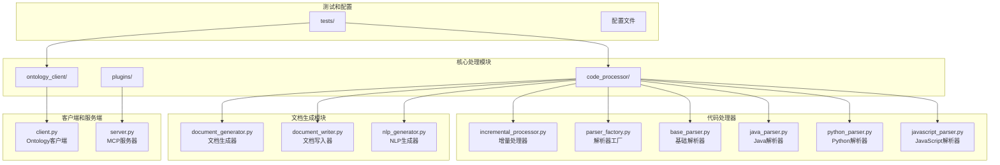
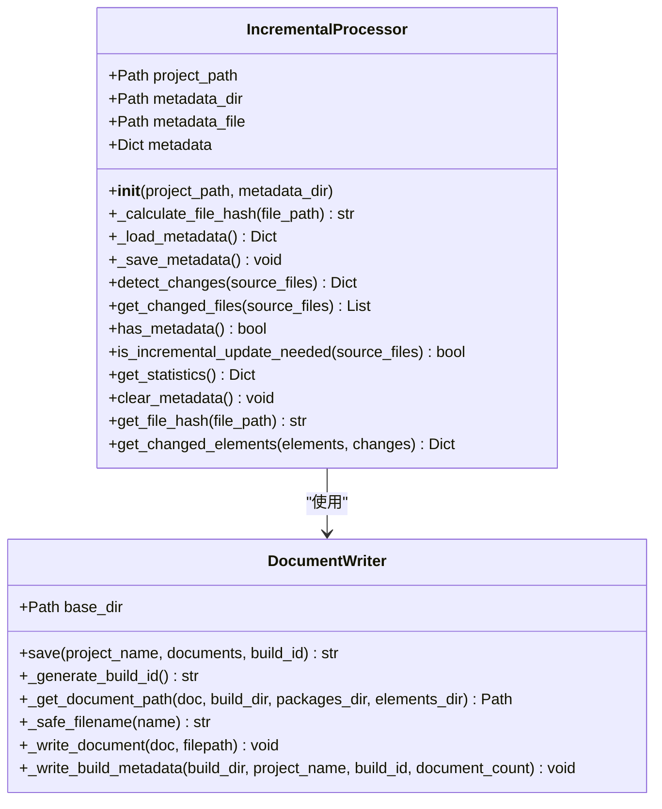
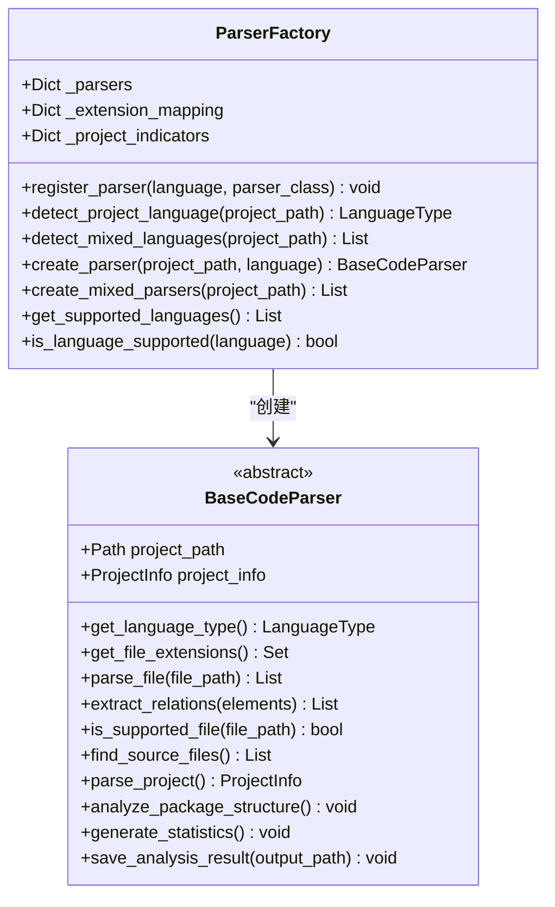
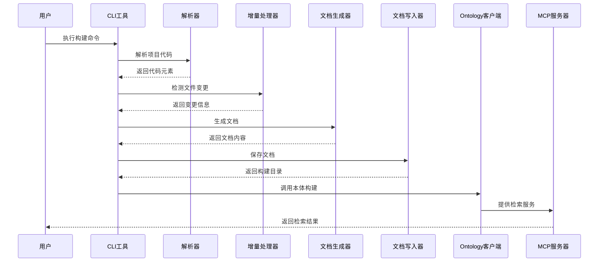
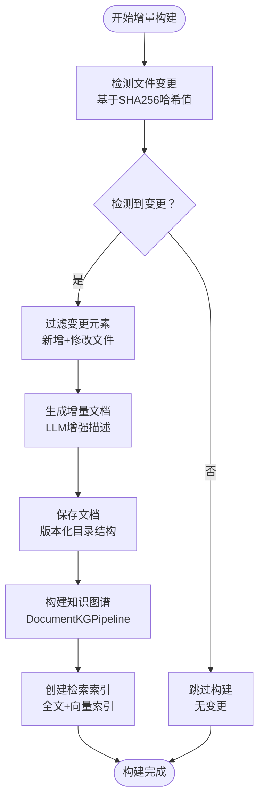
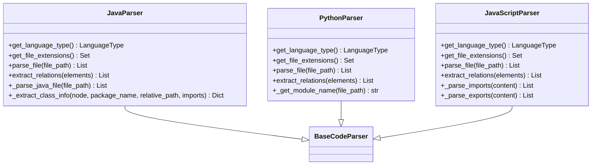
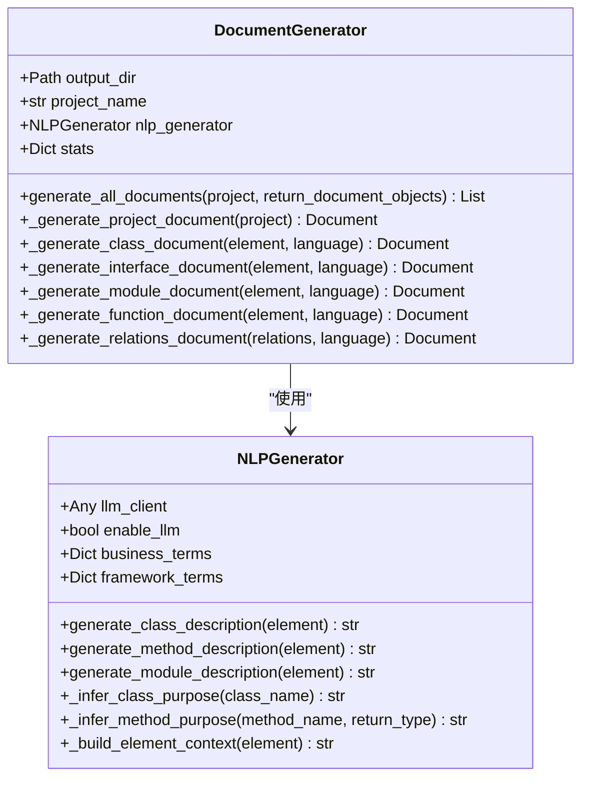
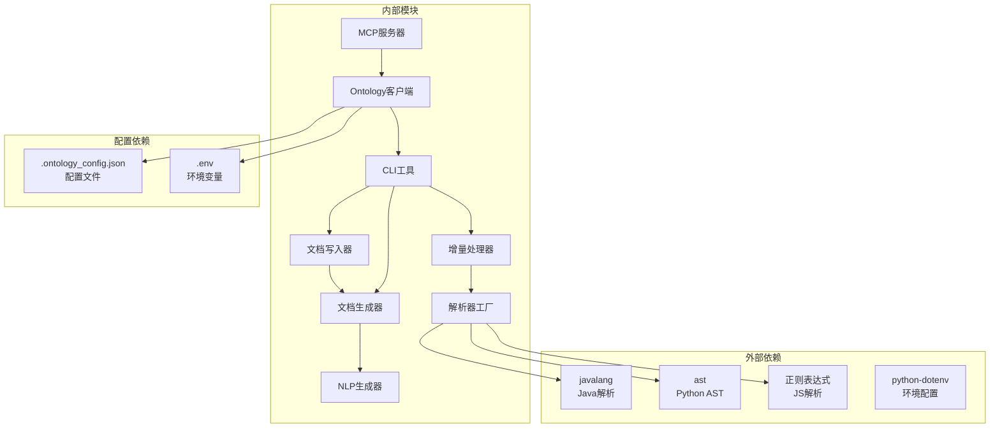

# 增量构建系统

<cite>
**本文档引用的文件**
- [README.md](file://README.md)
- [incremental_processor.py](file://code_processor/incremental_processor.py)
- [cli.py](file://code_processor/cli.py)
- [base_parser.py](file://code_processor/base_parser.py)
- [parser_factory.py](file://code_processor/parser_factory.py)
- [document_generator.py](file://code_processor/document_generator.py)
- [document_writer.py](file://code_processor/document_writer.py)
- [nlp_generator.py](file://code_processor/nlp_generator.py)
- [client.py](file://ontology_client/client.py)
- [server.py](file://plugins/ontology-devos/servers/ontology_mcp/server.py)
- [test_code_processor.py](file://tests/test_code_processor.py)
- [java_parser.py](file://code_processor/java_parser.py)
- [javascript_parser.py](file://code_processor/javascript_parser.py)
- [python_parser.py](file://code_processor/python_parser.py)
</cite>

## 目录
1. [简介](#简介)
2. [项目结构](#项目结构)
3. [核心组件](#核心组件)
4. [架构概览](#架构概览)
5. [详细组件分析](#详细组件分析)
6. [依赖关系分析](#依赖关系分析)
7. [性能考虑](#性能考虑)
8. [故障排除指南](#故障排除指南)
9. [结论](#结论)

## 简介

增量构建系统是一个智能化的代码本体构建平台，专为大型软件项目设计，能够高效地检测文件变更并执行增量更新。该系统集成了多语言代码解析、智能文档生成、知识图谱构建和检索索引等功能，为开发者提供了完整的代码理解和分析能力。

系统的核心优势包括：
- **智能增量检测**：基于文件哈希值检测代码变更，支持新增、修改、删除文件的精确识别
- **多语言支持**：原生支持Java、Python、JavaScript/TypeScript等多种编程语言
- **LLM增强**：集成自然语言生成器，为代码元素提供业务意图描述
- **完整工作流**：从代码解析到知识图谱构建的端到端解决方案
- **MCP插件集成**：提供代码本体检索和影响分析的MCP工具

## 项目结构

**图表来源**
- [README.md](file://README.md#L71-L92)
- [cli.py](file://code_processor/cli.py#L23-L26)

**章节来源**
- [README.md](file://README.md#L71-L92)
- [cli.py](file://code_processor/cli.py#L1-L50)

## 核心组件

### 增量处理器 (IncrementalProcessor)

增量处理器是整个系统的核心组件，负责检测文件变更并管理增量更新流程：

**图表来源**
- [incremental_processor.py](file://code_processor/incremental_processor.py#L25-L281)
- [document_writer.py](file://code_processor/document_writer.py#L110-L325)

### 解析器工厂 (ParserFactory)

解析器工厂提供统一的代码解析接口，支持多种编程语言：

**图表来源**
- [parser_factory.py](file://code_processor/parser_factory.py#L20-L248)
- [base_parser.py](file://code_processor/base_parser.py#L208-L360)

**章节来源**
- [incremental_processor.py](file://code_processor/incremental_processor.py#L25-L281)
- [parser_factory.py](file://code_processor/parser_factory.py#L20-L248)
- [base_parser.py](file://code_processor/base_parser.py#L208-L360)

## 架构概览

系统采用分层架构设计，从底层的代码解析到上层的知识图谱构建形成了完整的处理链：

**图表来源**
- [cli.py](file://code_processor/cli.py#L160-L264)
- [client.py](file://ontology_client/client.py#L614-L787)
- [server.py](file://plugins/ontology-devos/servers/ontology_mcp/server.py#L147-L271)

## 详细组件分析

### 增量构建流程

增量构建系统的核心流程包括文件变更检测、增量文档生成和知识图谱更新：

**图表来源**
- [incremental_processor.py](file://code_processor/incremental_processor.py#L193-L212)
- [client.py](file://ontology_client/client.py#L673-L709)

### 多语言解析器实现

系统支持多种编程语言的代码解析，每种语言都有专门的解析器实现：

**图表来源**
- [java_parser.py](file://code_processor/java_parser.py#L39-L200)
- [python_parser.py](file://code_processor/python_parser.py#L22-L200)
- [javascript_parser.py](file://code_processor/javascript_parser.py#L22-L200)

### 文档生成和LLM增强

文档生成器负责将代码分析结果转换为自然语言描述，并提供LLM增强功能：

**图表来源**
- [document_generator.py](file://code_processor/document_generator.py#L23-L697)
- [nlp_generator.py](file://code_processor/nlp_generator.py#L18-L569)

**章节来源**
- [incremental_processor.py](file://code_processor/incremental_processor.py#L100-L182)
- [document_generator.py](file://code_processor/document_generator.py#L69-L134)
- [nlp_generator.py](file://code_processor/nlp_generator.py#L152-L225)

## 依赖关系分析

系统采用模块化设计，各组件之间通过清晰的接口进行交互：

**图表来源**
- [client.py](file://ontology_client/client.py#L175-L226)
- [parser_factory.py](file://code_processor/parser_factory.py#L13-L15)

**章节来源**
- [client.py](file://ontology_client/client.py#L175-L226)
- [parser_factory.py](file://code_processor/parser_factory.py#L13-L15)

## 性能考虑

增量构建系统在设计时充分考虑了性能优化：

### 文件变更检测优化
- 使用SHA256哈希值进行文件完整性校验
- 元数据持久化避免重复计算
- 智能缓存机制减少I/O操作

### 内存管理
- 流式处理大量文件
- 按需加载和释放内存
- 及时清理临时文件

### 并行处理
- 多语言项目并行解析
- 文档生成和保存异步处理
- LLM调用优化

## 故障排除指南

### 常见问题及解决方案

**问题1：文件变更检测不准确**
- 检查文件权限和路径
- 验证哈希计算是否正常
- 确认元数据文件完整性

**问题2：多语言项目解析失败**
- 确认相应解析器依赖已安装
- 检查项目标识符配置
- 验证文件扩展名映射

**问题3：LLM生成质量不佳**
- 检查API密钥配置
- 调整提示词参数
- 验证模型选择

**问题4：MCP服务器连接失败**
- 确认ontology项目路径配置
- 检查网络连接状态
- 验证数据库连接信息

**章节来源**
- [incremental_processor.py](file://code_processor/incremental_processor.py#L57-L66)
- [client.py](file://ontology_client/client.py#L175-L184)

## 结论

增量构建系统通过智能化的文件变更检测、多语言代码解析、LLM增强的文档生成和完整的知识图谱构建流程，为现代软件开发提供了强大的代码理解和分析能力。系统的设计充分考虑了性能、可扩展性和易用性，能够有效支持大型项目的持续集成和代码维护需求。

该系统的主要价值体现在：
- **效率提升**：通过增量构建大幅减少构建时间
- **质量保证**：多层验证确保代码质量和一致性
- **智能分析**：LLM增强提供深入的代码洞察
- **生态集成**：完整的工具链支持现代化开发流程

随着系统的不断完善和优化，它将成为软件工程领域代码本体构建的重要基础设施。