# 解析器工厂

<cite>
**本文档引用的文件**
- [parser_factory.py](file://code_processor/parser_factory.py)
- [base_parser.py](file://code_processor/base_parser.py)
- [java_parser.py](file://code_processor/java_parser.py)
- [javascript_parser.py](file://code_processor/javascript_parser.py)
- [python_parser.py](file://code_processor/python_parser.py)
- [cli.py](file://code_processor/cli.py)
- [__init__.py](file://code_processor/__init__.py)
- [requirements.txt](file://code_processor/requirements.txt)
- [test_code_processor.py](file://tests/test_code_processor.py)
</cite>

## 目录
1. [简介](#简介)
2. [项目结构](#项目结构)
3. [核心组件](#核心组件)
4. [架构概览](#架构概览)
5. [详细组件分析](#详细组件分析)
6. [依赖分析](#依赖分析)
7. [性能考虑](#性能考虑)
8. [故障排除指南](#故障排除指南)
9. [结论](#结论)
10. [附录：扩展新语言解析器指南](#附录扩展新语言解析器指南)

## 简介

解析器工厂模块是代码处理器系统的核心，实现了工厂模式来动态创建和管理多语言代码解析器。该模块支持Java、Python、JavaScript/TypeScript等多种编程语言的代码分析，提供了自动语言检测、解析器注册、混合语言项目分析等功能。

该系统采用面向对象设计，通过抽象基类定义统一接口，使用工厂模式实现解析器的动态创建，支持单语言和混合语言项目的分析需求。

## 项目结构

代码处理器模块位于 `code_processor/` 目录下，包含以下关键文件：

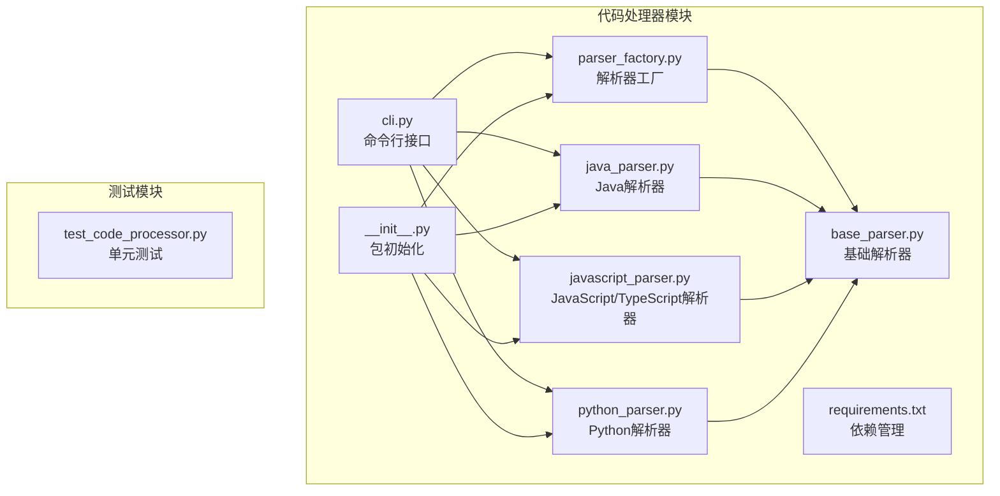

**图表来源**
- [parser_factory.py](file://code_processor/parser_factory.py#L1-L248)
- [base_parser.py](file://code_processor/base_parser.py#L1-L358)
- [java_parser.py](file://code_processor/java_parser.py#L1-L425)
- [javascript_parser.py](file://code_processor/javascript_parser.py#L1-L548)
- [python_parser.py](file://code_processor/python_parser.py#L1-L455)
- [cli.py](file://code_processor/cli.py#L1-L215)
- [__init__.py](file://code_processor/__init__.py#L1-L40)

**章节来源**
- [parser_factory.py](file://code_processor/parser_factory.py#L1-L248)
- [base_parser.py](file://code_processor/base_parser.py#L1-L358)
- [__init__.py](file://code_processor/__init__.py#L1-L40)

## 核心组件

### 工厂模式实现

解析器工厂采用经典的工厂模式设计，通过静态方法实现解析器的创建和管理：

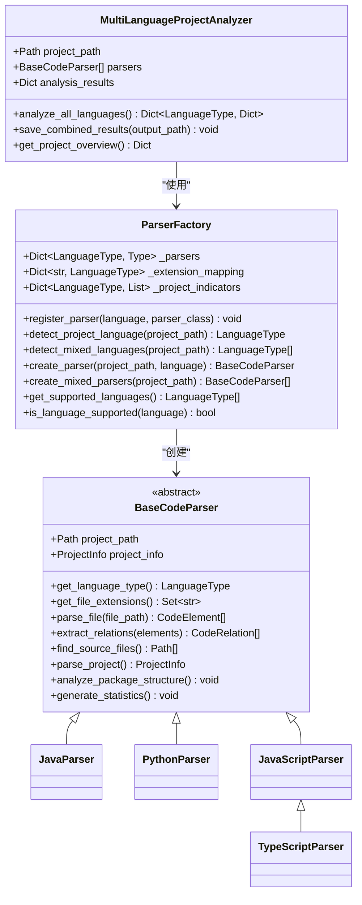

**图表来源**
- [parser_factory.py](file://code_processor/parser_factory.py#L20-L171)
- [base_parser.py](file://code_processor/base_parser.py#L206-L358)
- [java_parser.py](file://code_processor/java_parser.py#L39-L46)
- [python_parser.py](file://code_processor/python_parser.py#L22-L30)
- [javascript_parser.py](file://code_processor/javascript_parser.py#L22-L31)

### 语言类型枚举

系统定义了统一的语言类型枚举，确保所有解析器的一致性：

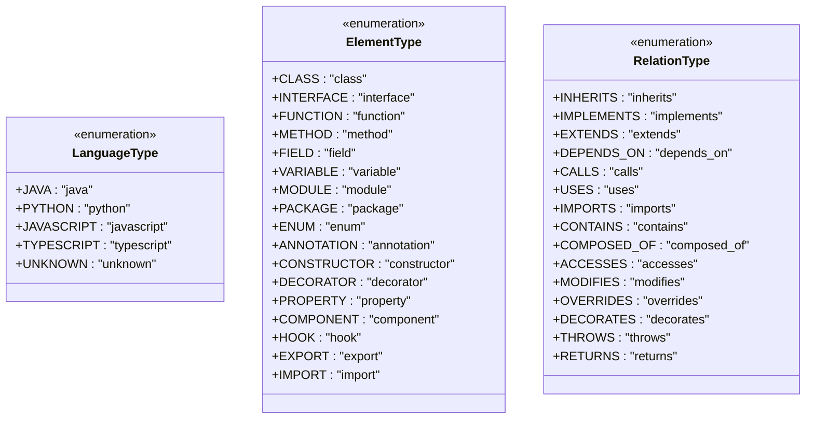

**图表来源**
- [base_parser.py](file://code_processor/base_parser.py#L17-L80)

**章节来源**
- [base_parser.py](file://code_processor/base_parser.py#L17-L80)
- [parser_factory.py](file://code_processor/parser_factory.py#L23-L39)

## 架构概览

系统采用分层架构设计，从上到下分为CLI层、工厂层、解析器层和数据模型层：

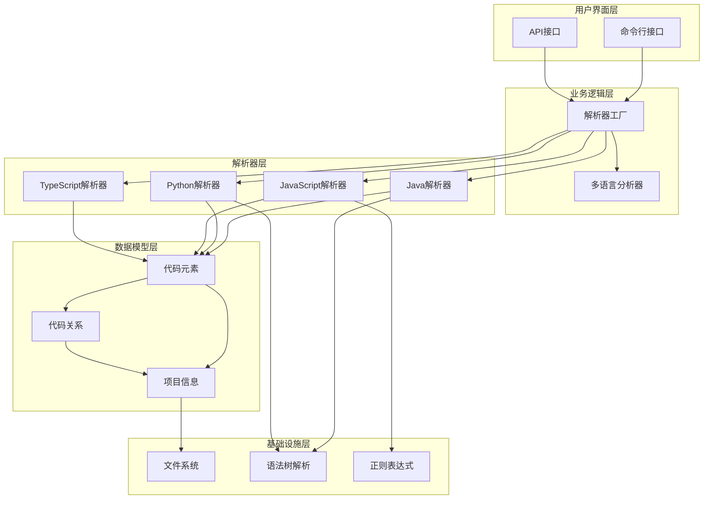

**图表来源**
- [cli.py](file://code_processor/cli.py#L16-L20)
- [parser_factory.py](file://code_processor/parser_factory.py#L173-L178)
- [base_parser.py](file://code_processor/base_parser.py#L206-L211)

## 详细组件分析

### ParserFactory 类详解

ParserFactory 是整个系统的核心，实现了工厂模式的所有关键功能：

#### 语言检测机制

系统提供了两种语言检测策略：

1. **主语言检测**：基于项目指标和文件扩展名的综合评分
2. **混合语言检测**：识别项目中所有支持的语言

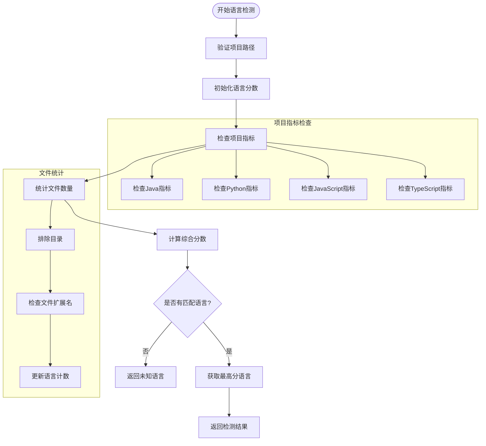

**图表来源**
- [parser_factory.py](file://code_processor/parser_factory.py#L48-L88)
- [parser_factory.py](file://code_processor/parser_factory.py#L91-L120)

#### 解析器注册流程

系统支持动态注册新的解析器：

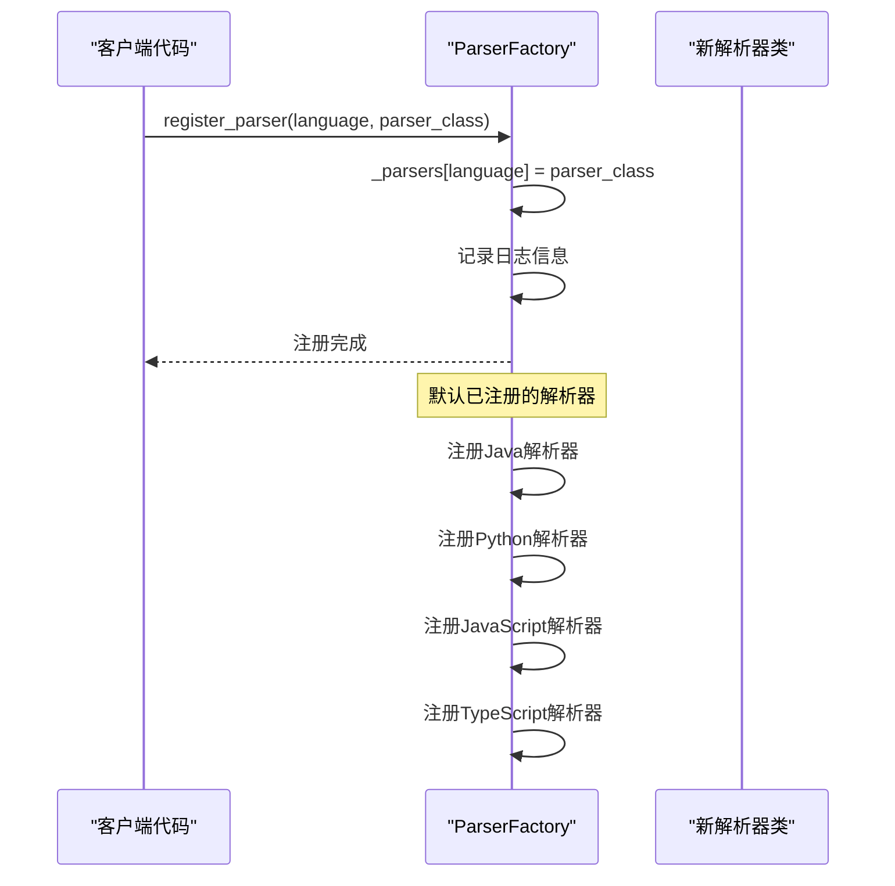

**图表来源**
- [parser_factory.py](file://code_processor/parser_factory.py#L42-L45)
- [parser_factory.py](file://code_processor/parser_factory.py#L244-L247)

**章节来源**
- [parser_factory.py](file://code_processor/parser_factory.py#L41-L171)

### MultiLanguageProjectAnalyzer 实现

多语言项目分析器提供了混合语言项目的完整分析能力：

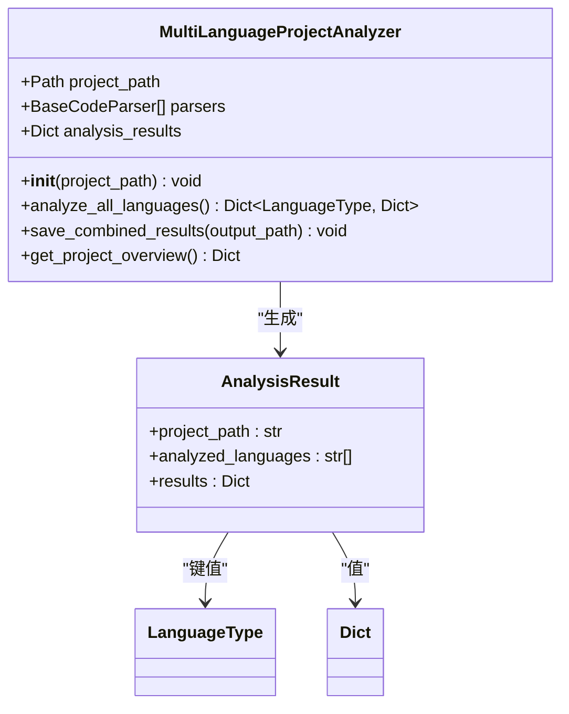

**图表来源**
- [parser_factory.py](file://code_processor/parser_factory.py#L173-L241)

#### 分析流程

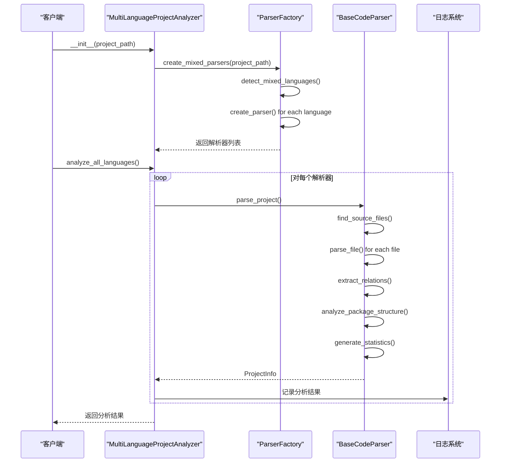

**图表来源**
- [parser_factory.py](file://code_processor/parser_factory.py#L176-L198)

**章节来源**
- [parser_factory.py](file://code_processor/parser_factory.py#L173-L241)

### 各语言解析器实现

#### JavaParser 实现

Java解析器使用javalang库进行语法树解析：

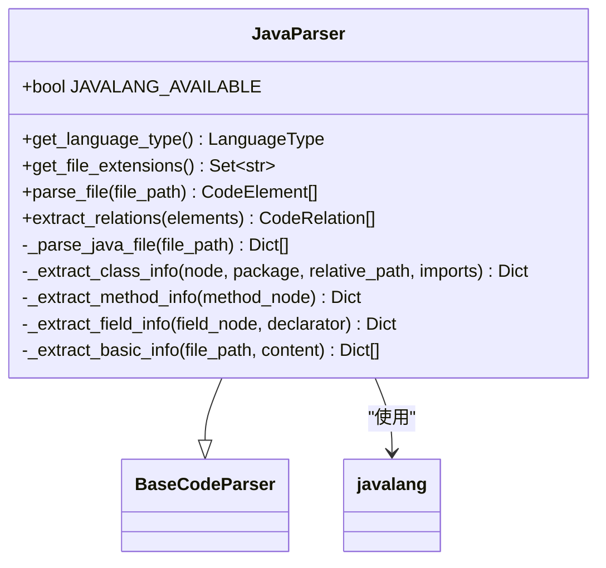

**图表来源**
- [java_parser.py](file://code_processor/java_parser.py#L39-L46)
- [java_parser.py](file://code_processor/java_parser.py#L129-L171)

#### PythonParser 实现

Python解析器使用AST模块进行深度解析：

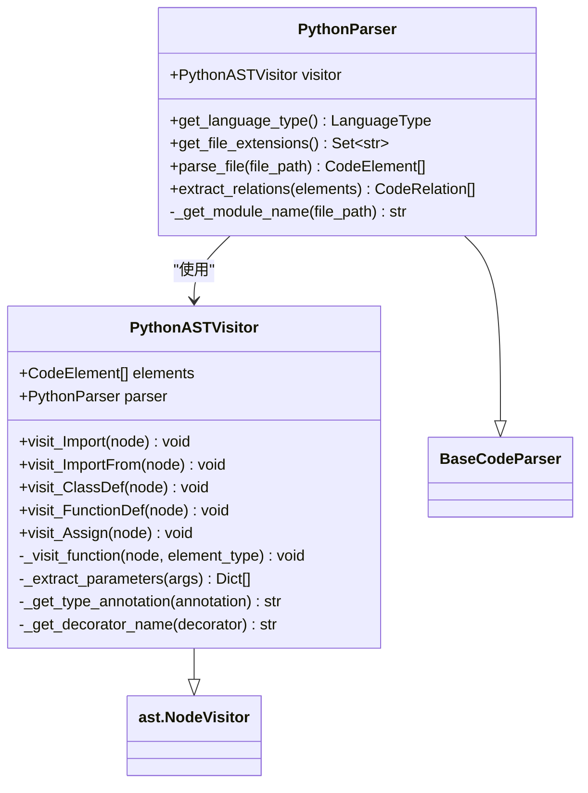

**图表来源**
- [python_parser.py](file://code_processor/python_parser.py#L22-L30)
- [python_parser.py](file://code_processor/python_parser.py#L149-L455)

#### JavaScriptParser 实现

JavaScript解析器使用正则表达式进行语法提取：

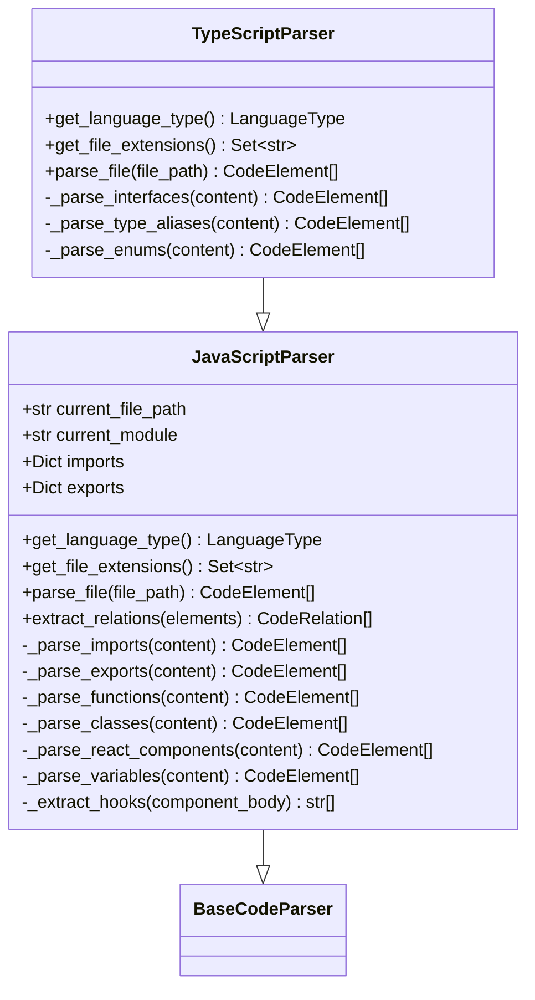

**图表来源**
- [javascript_parser.py](file://code_processor/javascript_parser.py#L22-L31)
- [javascript_parser.py](file://code_processor/javascript_parser.py#L446-L453)

**章节来源**
- [java_parser.py](file://code_processor/java_parser.py#L39-L425)
- [python_parser.py](file://code_processor/python_parser.py#L22-L455)
- [javascript_parser.py](file://code_processor/javascript_parser.py#L22-L548)

## 依赖分析

### 外部依赖

系统的主要外部依赖包括：

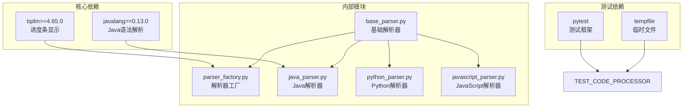

**图表来源**
- [requirements.txt](file://code_processor/requirements.txt#L4-L7)
- [test_code_processor.py](file://tests/test_code_processor.py#L5-L13)

### 内部模块依赖

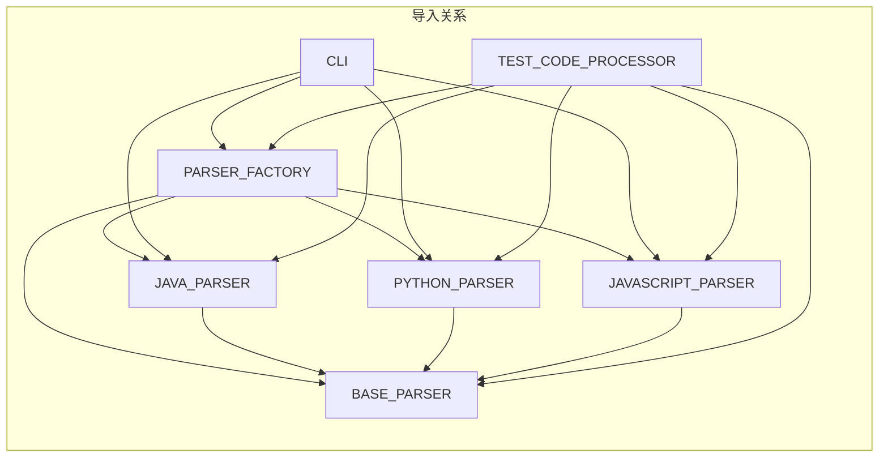

**图表来源**
- [__init__.py](file://code_processor/__init__.py#L11-L23)
- [cli.py](file://code_processor/cli.py#L16-L19)

**章节来源**
- [requirements.txt](file://code_processor/requirements.txt#L1-L8)
- [__init__.py](file://code_processor/__init__.py#L1-L40)

## 性能考虑

### 文件扫描优化

系统在文件扫描时采用了多种优化策略：

1. **排除目录过滤**：自动跳过版本控制、构建输出等目录
2. **扩展名映射**：使用字典快速判断文件类型
3. **延迟加载**：仅在需要时才加载文件内容

### 解析器选择策略

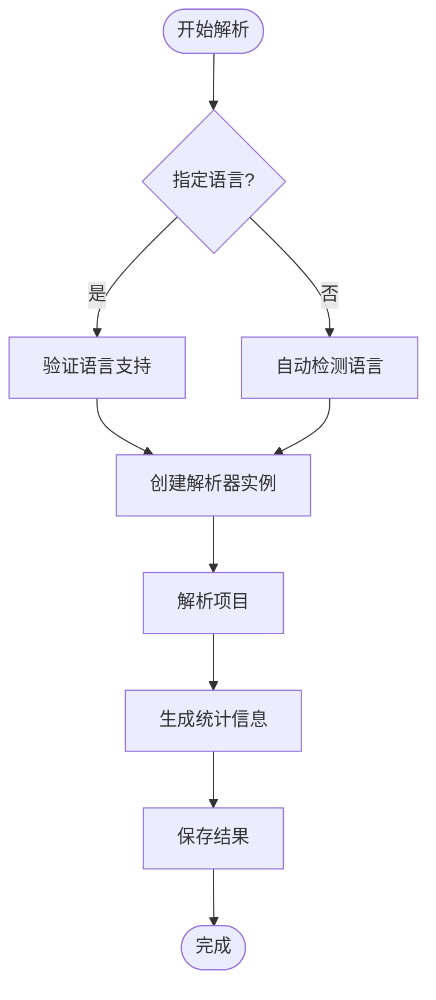

**图表来源**
- [parser_factory.py](file://code_processor/parser_factory.py#L122-L140)

### 内存管理

- **增量处理**：逐个文件解析，避免内存峰值
- **对象复用**：重用解析器实例进行多次分析
- **资源清理**：及时关闭文件句柄和清理临时数据

## 故障排除指南

### 常见问题及解决方案

#### Java解析器依赖问题

**问题**：`ImportError: javalang library is required for Java parsing`

**解决方案**：
```bash
pip install javalang>=0.13.0
```

#### 语言检测失败

**问题**：无法检测项目语言类型

**诊断步骤**：
1. 检查项目根目录是否存在标准项目文件
2. 验证文件扩展名是否在支持列表中
3. 确认项目路径存在且可访问

#### 解析器创建异常

**问题**：创建解析器时抛出异常

**排查方法**：
1. 使用 `ParserFactory.is_language_supported()` 检查语言支持
2. 查看日志输出获取详细错误信息
3. 验证项目路径和权限

**章节来源**
- [java_parser.py](file://code_processor/java_parser.py#L43-L44)
- [parser_factory.py](file://code_processor/parser_factory.py#L131-L134)

## 结论

解析器工厂模块成功实现了工厂模式在多语言代码解析中的应用，提供了以下关键特性：

1. **灵活的工厂模式**：支持动态注册和创建解析器实例
2. **智能语言检测**：基于项目指标和文件特征的自动语言识别
3. **混合语言支持**：能够同时处理包含多种语言的项目
4. **统一的数据模型**：通过抽象基类确保不同解析器的兼容性
5. **完整的分析流程**：从文件扫描到关系提取的端到端解决方案

该系统为构建研发本体（R&D Ontology）提供了坚实的基础，支持多种编程语言的代码分析需求。

## 附录：扩展新语言解析器指南

### 扩展步骤

要添加新的语言解析器，需要遵循以下步骤：

#### 1. 创建解析器类

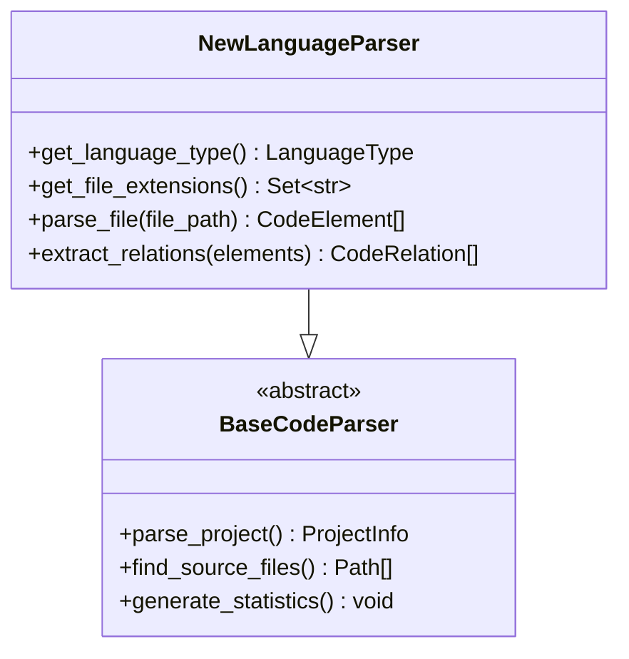

**图表来源**
- [base_parser.py](file://code_processor/base_parser.py#L206-L241)

#### 2. 实现必需方法

- `get_language_type()`：返回语言类型枚举值
- `get_file_extensions()`：返回支持的文件扩展名集合
- `parse_file()`：解析单个文件并返回代码元素列表
- `extract_relations()`：从代码元素中提取关系

#### 3. 注册解析器

```python
ParserFactory.register_parser(LanguageType.YOUR_LANGUAGE, YourParserClass)
```

#### 4. 添加语言类型

在 `LanguageType` 枚举中添加新的语言常量。

#### 5. 测试验证

编写单元测试验证解析器的功能正确性。

### 最佳实践

1. **保持一致性**：遵循现有的代码风格和命名约定
2. **错误处理**：妥善处理文件读取和解析异常
3. **性能优化**：避免不必要的文件读取和解析
4. **文档注释**：为公共方法添加详细的文档字符串
5. **测试覆盖**：提供充分的单元测试用例

### 示例：简单解析器模板

```python
class TemplateParser(BaseCodeParser):
    def get_language_type(self) -> LanguageType:
        return LanguageType.YOUR_LANGUAGE
    
    def get_file_extensions(self) -> Set[str]:
        return {'.ext1', '.ext2'}
    
    def parse_file(self, file_path: Path) -> List[CodeElement]:
        # 实现文件解析逻辑
        pass
    
    def extract_relations(self, elements: List[CodeElement]) -> List[CodeRelation]:
        # 实现关系提取逻辑
        pass
```

**章节来源**
- [base_parser.py](file://code_processor/base_parser.py#L206-L358)
- [parser_factory.py](file://code_processor/parser_factory.py#L42-L45)