# Claude 主协调者

<cite>
**本文引用的文件**
- [CLAUDE.md](file://CLAUDE.md)
- [global/CLAUDE.md](file://global/CLAUDE.md)
- [README.md](file://README.md)
- [AGENTS.md](file://AGENTS.md)
- [agents/README.md](file://agents/README.md)
- [agents/plan-reviewer.md](file://agents/plan-reviewer.md)
- [agents/refactor-planner.md](file://agents/refactor-planner.md)
- [agents/code-architecture-reviewer.md](file://agents/code-architecture-reviewer.md)
- [global/codex-skills/systematic-debugging/SKILL.md](file://global/codex-skills/systematic-debugging/SKILL.md)
- [global/codex-skills/test-driven-development/SKILL.md](file://global/codex-skills/test-driven-development/SKILL.md)
- [global/codex-skills/receiving-code-review/SKILL.md](file://global/codex-skills/receiving-code-review/SKILL.md)
- [global/codex-skills/requesting-code-review/SKILL.md](file://global/codex-skills/requesting-code-review/SKILL.md)
- [global/codex-skills/subagent-driven-development/SKILL.md](file://global/codex-skills/subagent-driven-development/SKILL.md)
- [settings.json](file://settings.json)
- [hooks/skill-activation-prompt.sh](file://hooks/skill-activation-prompt.sh)
- [code_processor/__init__.py](file://code_processor/__init__.py)
- [code_processor/base_parser.py](file://code_processor/base_parser.py)
- [code_processor/parser_factory.py](file://code_processor/parser_factory.py)
- [code_processor/cli.py](file://code_processor/cli.py)
- [code_processor/java_parser.py](file://code_processor/java_parser.py)
- [code_processor/javascript_parser.py](file://code_processor/javascript_parser.py)
- [code_processor/python_parser.py](file://code_processor/python_parser.py)
- [rd_ontology/rd-core.ttl](file://rd_ontology/rd-core.ttl)
- [rd_ontology/ttl_generator.py](file://rd_ontology/ttl_generator.py)
- [rd_ontology/iri_utils.py](file://rd_ontology/iri_utils.py)
- [openspec/changes/add-code-ontology-capability/specs/code-ontology/spec.md](file://openspec/changes/add-code-ontology-capability/specs/code-ontology/spec.md)
</cite>

## 更新摘要
**所做更改**
- 新增多语言代码分析能力的详细说明和实现细节
- 增强本体系统集成的架构描述和工作流程
- 更新全局规则以反映新的多 AI 协同机制
- 完善工具使用规范和本体生成流程
- 新增代码处理器和 TTL 生成器的技术细节

## 目录
1. [简介](#简介)
2. [项目结构](#项目结构)
3. [核心组件](#核心组件)
4. [架构总览](#架构总览)
5. [详细组件分析](#详细组件分析)
6. [依赖关系分析](#依赖关系分析)
7. [性能考量](#性能考量)
8. [故障排查指南](#故障排查指南)
9. [结论](#结论)
10. [附录](#附录)

## 简介
本文件面向 Claude Code 主协调者角色，系统阐述 Claude 作为"主体思考者与决策者"的职责边界与工作方法论。随着多语言代码分析能力和本体系统集成的增强，Claude 的职责范围进一步扩大，涵盖跨语言代码理解、语义关联建模和智能代码搜索支持。文档覆盖以下主题：
- 思考优先级：先独立分析 → 形成初步方案 → 交叉验证 → 最终决策
- 多语言代码分析：支持 Java、Python、JavaScript/TypeScript 的统一解析和关系提取
- 本体系统集成：基于 TTL 的 R&D 本体架构，支持语义链接和智能查询
- 与 Codex/Gemini 的协作边界：前者负责后端技术交叉检查与算法审查，后者负责前端实现与大文本分析
- 代码审查与质量把控：两阶段审查（规范符合性 → 代码质量），并配套子代理驱动开发
- 复杂技术决策流程：多视角分析 → 综合评估 → 明确取舍
- 使用示例、最佳实践与常见陷阱
- OpenSpec 规范驱动开发的三阶段工作流与 6 阶段开发流程的映射

## 项目结构
该项目采用"配置模板 + 项目级定制 + 本体系统"的分层结构，支持多语言代码分析和本体集成，提供快速部署到任意项目并复用全局规则与技能体系。

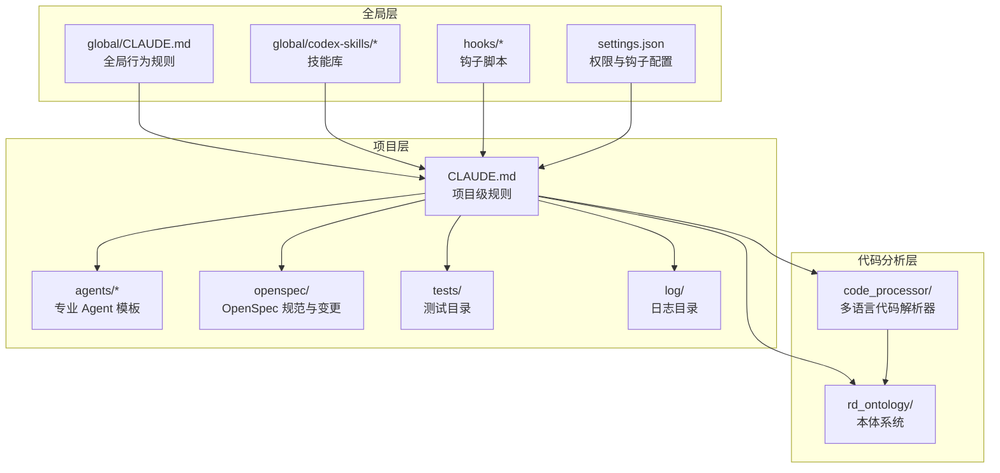

**图表来源**
- [README.md](file://README.md#L71-L92)
- [CLAUDE.md](file://CLAUDE.md#L220-L440)
- [global/CLAUDE.md](file://global/CLAUDE.md#L1-L147)
- [code_processor/__init__.py](file://code_processor/__init__.py#L1-L39)
- [rd_ontology/rd-core.ttl](file://rd_ontology/rd-core.ttl#L1-L294)

**章节来源**
- [README.md](file://README.md#L71-L229)
- [CLAUDE.md](file://CLAUDE.md#L220-L440)
- [global/CLAUDE.md](file://global/CLAUDE.md#L1-L147)
- [code_processor/__init__.py](file://code_processor/__init__.py#L1-L39)
- [rd_ontology/rd-core.ttl](file://rd_ontology/rd-core.ttl#L1-L294)

## 核心组件
- 主协调者（Claude）：独立分析、制定方案、质量把控、最终决策
- 技术顾问（Codex）：后端交叉检查、算法审查、提供不同实现思路
- 前端主力（Gemini）：前端实现、大文本分析、全局视图与模式发现
- 专业 Agent：针对复杂任务的自治子代理（如计划评审、重构规划、架构审查）
- 技能系统（Superpowers）：可复用的开发技能（TDD、系统化调试、子代理驱动开发等）
- 代码处理器（Code Processor）：多语言代码分析引擎，支持统一的代码元素和关系建模
- 本体生成器（TTL Generator）：将代码分析结果转换为 RDF/Turtle 格式的本体数据
- OpenSpec 工作流：规范驱动的三阶段（提案 → 实施 → 归档）与六阶段映射

**章节来源**
- [CLAUDE.md](file://CLAUDE.md#L102-L125)
- [CLAUDE.md](file://CLAUDE.md#L128-L147)
- [README.md](file://README.md#L141-L196)
- [code_processor/base_parser.py](file://code_processor/base_parser.py#L1-L360)
- [rd_ontology/ttl_generator.py](file://rd_ontology/ttl_generator.py#L1-L364)

## 架构总览
主协调者通过"先思考、再验证"的原则，将工具与技能作为顾问而非权威。随着多语言代码分析和本体系统集成的增强，整体协作架构扩展为包含代码理解、语义建模和智能查询的完整生态：

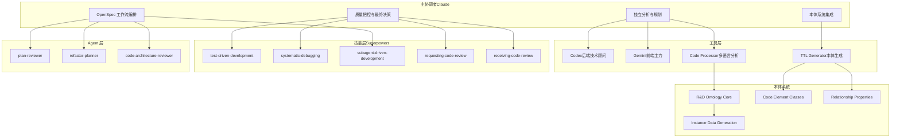

**图表来源**
- [CLAUDE.md](file://CLAUDE.md#L102-L194)
- [README.md](file://README.md#L141-L196)
- [code_processor/parser_factory.py](file://code_processor/parser_factory.py#L1-L248)
- [rd_ontology/rd-core.ttl](file://rd_ontology/rd-core.ttl#L1-L294)
- [rd_ontology/ttl_generator.py](file://rd_ontology/ttl_generator.py#L1-L364)

## 详细组件分析

### 思考优先级与决策流程
主协调者的思考优先级强调"先独立思考，再交叉验证，最后决策"，现已扩展包含本体系统集成：
- 第一步：独立分析与初步方案设计
- 第二步：必要时使用 Codex/Gemini 进行交叉验证
- 第三步：利用代码处理器进行多语言分析和本体建模
- 第四步：综合信息，做出最终决策

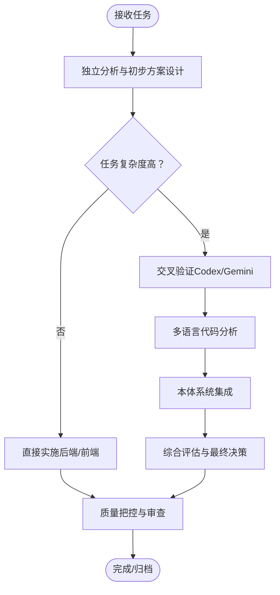

**图表来源**
- [CLAUDE.md](file://CLAUDE.md#L106-L124)
- [CLAUDE.md](file://CLAUDE.md#L176-L186)
- [code_processor/parser_factory.py](file://code_processor/parser_factory.py#L173-L241)

**章节来源**
- [CLAUDE.md](file://CLAUDE.md#L106-L124)
- [CLAUDE.md](file://CLAUDE.md#L176-L186)
- [code_processor/parser_factory.py](file://code_processor/parser_factory.py#L173-L241)

### 多语言代码分析系统
代码处理器提供统一的多语言代码分析接口，支持 Java、Python、JavaScript/TypeScript 的深度解析：

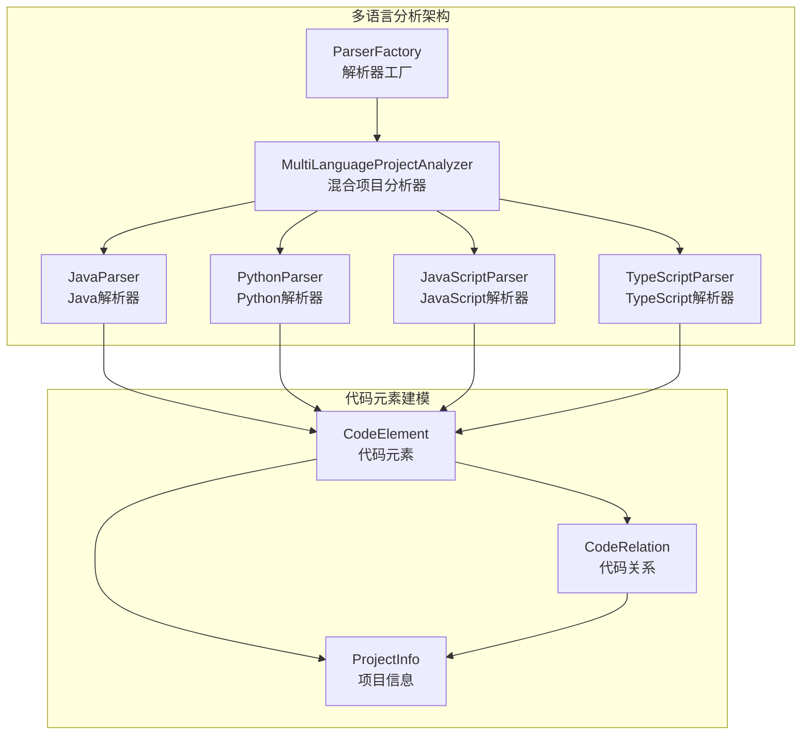

**图表来源**
- [code_processor/parser_factory.py](file://code_processor/parser_factory.py#L20-L171)
- [code_processor/base_parser.py](file://code_processor/base_parser.py#L82-L360)
- [code_processor/java_parser.py](file://code_processor/java_parser.py#L39-L200)
- [code_processor/python_parser.py](file://code_processor/python_parser.py#L22-L200)
- [code_processor/javascript_parser.py](file://code_processor/javascript_parser.py#L22-L200)

**章节来源**
- [code_processor/parser_factory.py](file://code_processor/parser_factory.py#L1-L248)
- [code_processor/base_parser.py](file://code_processor/base_parser.py#L1-L360)
- [code_processor/java_parser.py](file://code_processor/java_parser.py#L1-L425)
- [code_processor/python_parser.py](file://code_processor/python_parser.py#L1-L455)
- [code_processor/javascript_parser.py](file://code_processor/javascript_parser.py#L1-L548)

### 本体系统集成
TTL 生成器将代码分析结果转换为 RDF/Turtle 格式的本体数据，支持语义链接和智能查询：

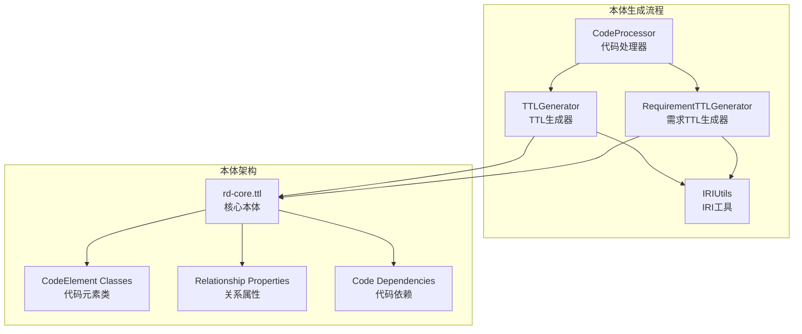

**图表来源**
- [rd_ontology/ttl_generator.py](file://rd_ontology/ttl_generator.py#L23-L364)
- [rd_ontology/rd-core.ttl](file://rd_ontology/rd-core.ttl#L1-L294)
- [rd_ontology/iri_utils.py](file://rd_ontology/iri_utils.py#L14-L132)

**章节来源**
- [rd_ontology/ttl_generator.py](file://rd_ontology/ttl_generator.py#L1-L364)
- [rd_ontology/rd-core.ttl](file://rd_ontology/rd-core.ttl#L1-L294)
- [rd_ontology/iri_utils.py](file://rd_ontology/iri_utils.py#L1-L132)

### 后端开发流程（Claude 主导）
后端开发遵循"实现 → 自检 → 交叉检查 → 修复 → 验证"的闭环，现已集成本体系统：

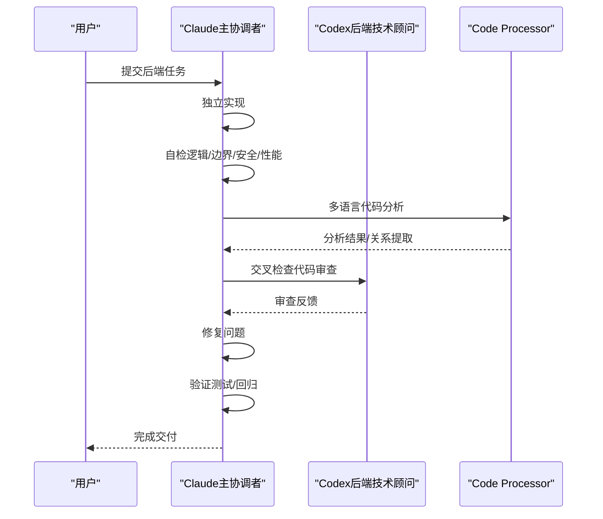

**图表来源**
- [CLAUDE.md](file://CLAUDE.md#L152-L162)
- [CLAUDE.md](file://CLAUDE.md#L197-L218)
- [code_processor/parser_factory.py](file://code_processor/parser_factory.py#L173-L241)

**章节来源**
- [CLAUDE.md](file://CLAUDE.md#L152-L162)
- [CLAUDE.md](file://CLAUDE.md#L197-L218)
- [code_processor/parser_factory.py](file://code_processor/parser_factory.py#L173-L241)

### 前端开发流程（Gemini 主导）
前端开发遵循"设计 → 实现 → 审查 → 修正 → 验证"的闭环：

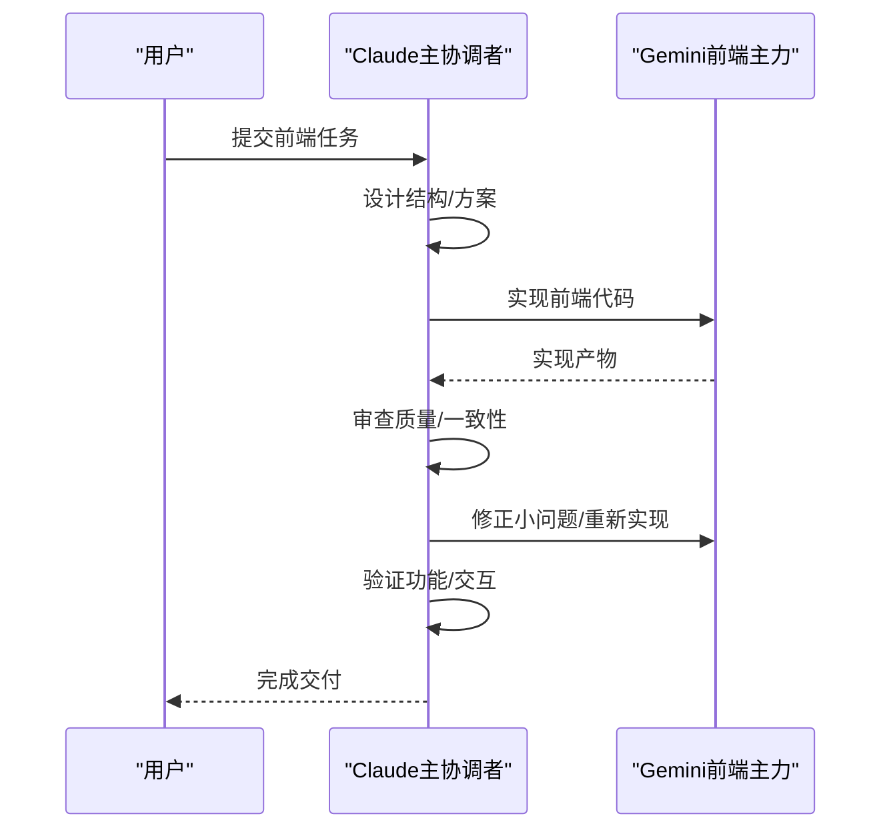

**图表来源**
- [CLAUDE.md](file://CLAUDE.md#L163-L175)
- [CLAUDE.md](file://CLAUDE.md#L197-L218)

**章节来源**
- [CLAUDE.md](file://CLAUDE.md#L163-L175)
- [CLAUDE.md](file://CLAUDE.md#L197-L218)

### 复杂分析与方案设计流程
面对架构设计、技术选型、复杂问题诊断等，采用"初步分析 → 技术分析 → 全局分析 → 本体建模 → 综合决策"的五步法：

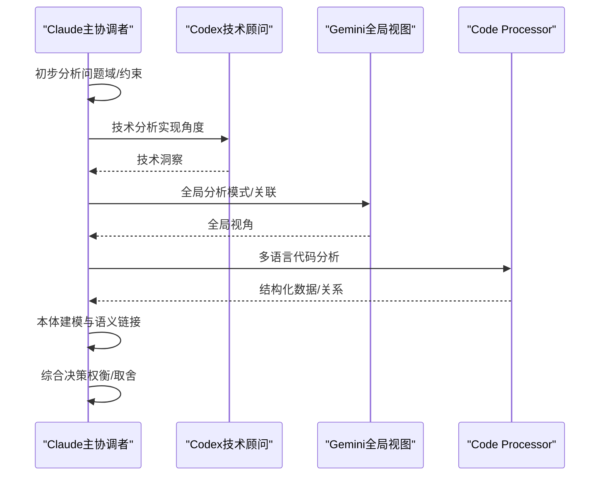

**图表来源**
- [CLAUDE.md](file://CLAUDE.md#L176-L186)
- [code_processor/parser_factory.py](file://code_processor/parser_factory.py#L173-L241)

**章节来源**
- [CLAUDE.md](file://CLAUDE.md#L176-L186)
- [code_processor/parser_factory.py](file://code_processor/parser_factory.py#L173-L241)

### 通用规划流程
主协调者在执行前先进行"自我分析 → 判断复杂度 → 判断类型 → 选择流程 → 本体集成 → 最终决策"的通用流程：

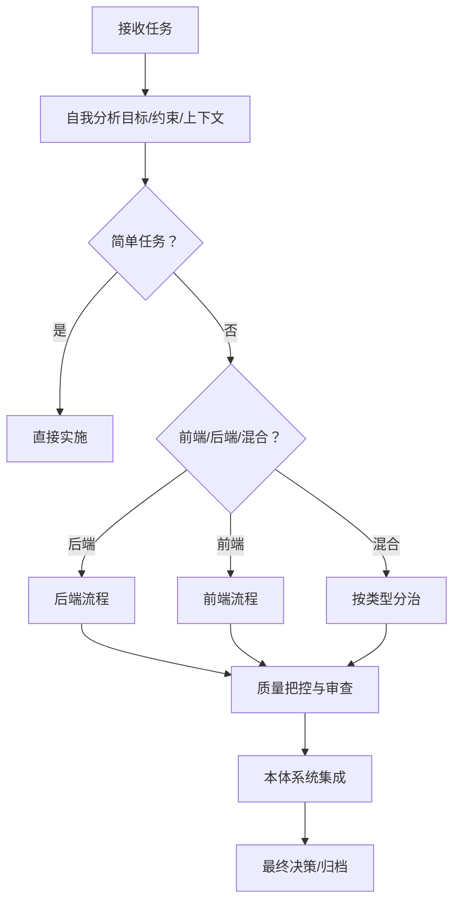

**图表来源**
- [CLAUDE.md](file://CLAUDE.md#L188-L194)
- [code_processor/parser_factory.py](file://code_processor/parser_factory.py#L173-L241)

**章节来源**
- [CLAUDE.md](file://CLAUDE.md#L188-L194)
- [code_processor/parser_factory.py](file://code_processor/parser_factory.py#L173-L241)

### 代码审查与质量把控
两阶段审查确保"规范符合性 → 代码质量"，并辅以子代理驱动开发的自动化审查回路，现已集成本体验证：

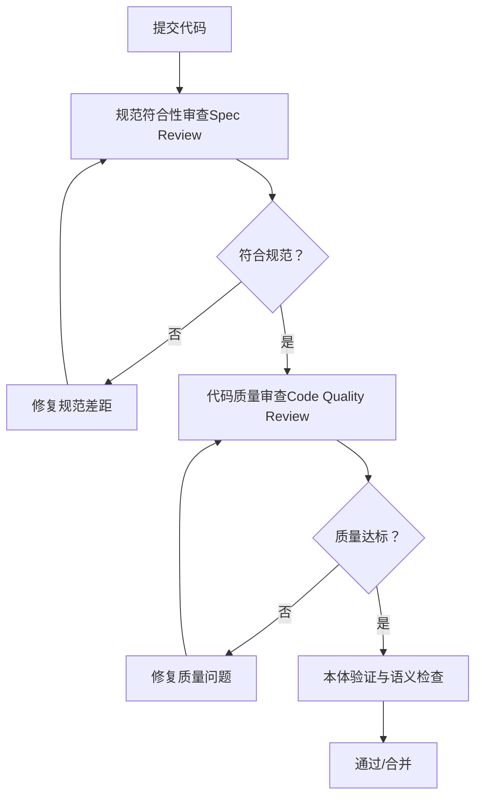

**图表来源**
- [global/codex-skills/subagent-driven-development/SKILL.md](file://global/codex-skills/subagent-driven-development/SKILL.md#L38-L83)
- [global/codex-skills/requesting-code-review/SKILL.md](file://global/codex-skills/requesting-code-review/SKILL.md#L12-L48)
- [global/codex-skills/receiving-code-review/SKILL.md](file://global/codex-skills/receiving-code-review/SKILL.md#L14-L25)

**章节来源**
- [global/codex-skills/subagent-driven-development/SKILL.md](file://global/codex-skills/subagent-driven-development/SKILL.md#L38-L83)
- [global/codex-skills/requesting-code-review/SKILL.md](file://global/codex-skills/requesting-code-review/SKILL.md#L12-L48)
- [global/codex-skills/receiving-code-review/SKILL.md](file://global/codex-skills/receiving-code-review/SKILL.md#L14-L25)

### OpenSpec 工作流与规范驱动开发
OpenSpec 三阶段与六阶段映射如下，现已支持本体规范：

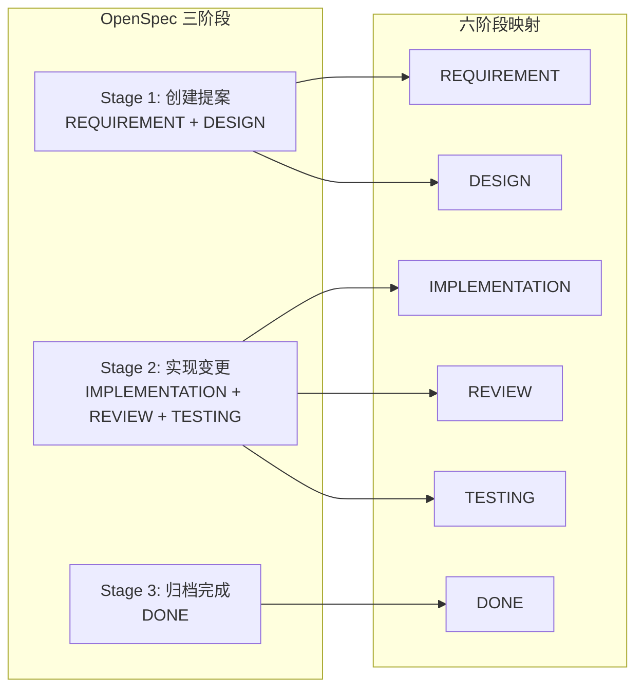

**图表来源**
- [CLAUDE.md](file://CLAUDE.md#L220-L284)

**章节来源**
- [CLAUDE.md](file://CLAUDE.md#L220-L284)

### 专业 Agent 的使用策略
- 计划评审（plan-reviewer）：在实现前对复杂计划进行风险与缺失项识别
- 重构规划（refactor-planner）：对代码结构进行系统化重构的分步规划
- 架构审查（code-architecture-reviewer）：对新实现进行架构一致性与最佳实践审查

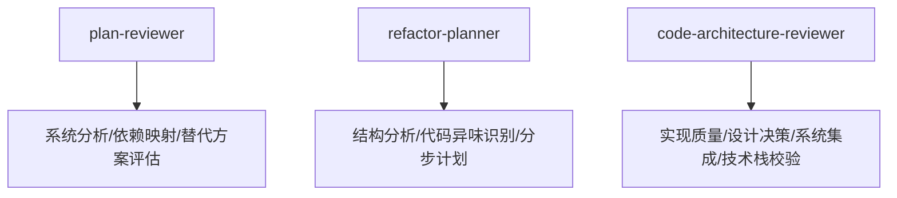

**图表来源**
- [agents/plan-reviewer.md](file://agents/plan-reviewer.md#L1-L53)
- [agents/refactor-planner.md](file://agents/refactor-planner.md#L1-L63)
- [agents/code-architecture-reviewer.md](file://agents/code-architecture-reviewer.md#L1-L84)

**章节来源**
- [agents/README.md](file://agents/README.md#L19-L146)
- [agents/plan-reviewer.md](file://agents/plan-reviewer.md#L1-L53)
- [agents/refactor-planner.md](file://agents/refactor-planner.md#L1-L63)
- [agents/code-architecture-reviewer.md](file://agents/code-architecture-reviewer.md#L1-L84)

### 技能系统的支撑作用
- 测试驱动开发（TDD）：实现前先写失败测试，确保行为正确与可回归
- 系统化调试：根因调查 → 模式分析 → 假设验证 → 实施修复
- 子代理驱动开发：每任务一次子代理 + 两阶段审查，提升迭代效率与质量

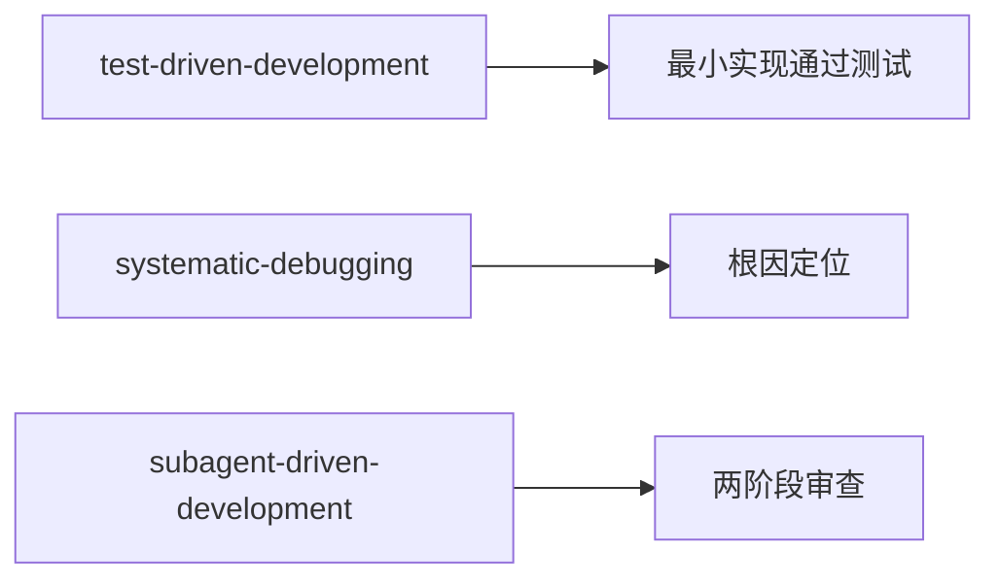

**图表来源**
- [global/codex-skills/test-driven-development/SKILL.md](file://global/codex-skills/test-driven-development/SKILL.md#L47-L69)
- [global/codex-skills/systematic-debugging/SKILL.md](file://global/codex-skills/systematic-debugging/SKILL.md#L46-L87)
- [global/codex-skills/subagent-driven-development/SKILL.md](file://global/codex-skills/subagent-driven-development/SKILL.md#L38-L83)

**章节来源**
- [global/codex-skills/test-driven-development/SKILL.md](file://global/codex-skills/test-driven-development/SKILL.md#L1-L372)
- [global/codex-skills/systematic-debugging/SKILL.md](file://global/codex-skills/systematic-debugging/SKILL.md#L1-L297)
- [global/codex-skills/subagent-driven-development/SKILL.md](file://global/codex-skills/subagent-driven-development/SKILL.md#L1-L241)

## 依赖关系分析
- 主协调者对工具与技能的依赖是"顾问式"而非"执行式"
- 工具之间存在互补关系：Codex 更擅长后端交叉检查与算法审查，Gemini 更擅长前端实现与大文本分析
- 代码处理器提供统一的多语言分析接口，TTL 生成器支持本体数据转换
- Agent 与技能共同构成"先规划、后实施、再审查"的闭环

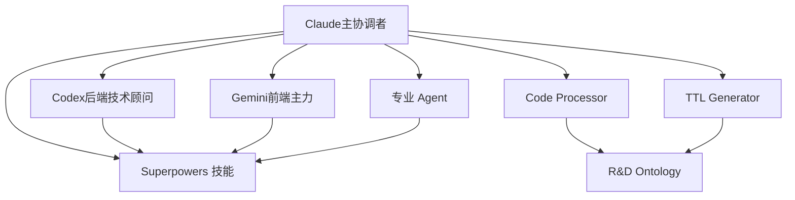

**图表来源**
- [CLAUDE.md](file://CLAUDE.md#L128-L147)
- [README.md](file://README.md#L123-L139)
- [code_processor/parser_factory.py](file://code_processor/parser_factory.py#L243-L248)
- [rd_ontology/ttl_generator.py](file://rd_ontology/ttl_generator.py#L23-L90)

**章节来源**
- [CLAUDE.md](file://CLAUDE.md#L128-L147)
- [README.md](file://README.md#L123-L139)
- [code_processor/parser_factory.py](file://code_processor/parser_factory.py#L243-L248)
- [rd_ontology/ttl_generator.py](file://rd_ontology/ttl_generator.py#L23-L90)

## 性能考量
- 通过"先独立思考、再交叉验证"的流程减少无效迭代
- 子代理驱动开发降低上下文切换成本，提高连续产出效率
- 两阶段审查前置问题，避免后期大规模返工
- OpenSpec 工作流明确阶段性产物，降低沟通与协调成本
- 多语言代码分析支持批量处理和缓存机制，提高分析效率
- 本体生成器优化内存使用和序列化性能，支持大规模代码库处理

## 故障排查指南
- 交叉验证不足：若未使用 Codex/Gemini 进行交叉验证，可能导致实现偏差或盲点
  - 处理：立即启动交叉验证流程，补充审查
- 审查顺序错误：在规范不符合的情况下直接进入代码质量审查
  - 处理：先修复规范差距，再进行质量审查
- 审查反馈盲从：完全采纳外部建议而不验证其在当前代码库中的适用性
  - 处理：依据"验证 → 评估 → 回应 → 实施"的流程，逐项验证后再决定
- 子代理驱动开发流程中断：跳过两阶段审查或并行调度多个实现子代理
  - 处理：严格遵循"同一会话、每个任务一次实现子代理 + 两阶段审查"的流程
- OpenSpec 工作流脱节：提案与实现脱节，导致验收困难
  - 处理：对照 OpenSpec 六阶段映射，补齐缺失环节（REQUIREMENT/DESIGN/IMPLEMENTATION/REVIEW/TESTING/DONE）
- 多语言分析失败：特定语言解析器无法处理复杂语法
  - 处理：检查解析器依赖、语法版本兼容性和文件编码格式
- 本体生成错误：TTL 数据格式不正确或缺少必要属性
  - 处理：验证代码元素完整性、关系映射正确性和 IRI 生成一致性

**章节来源**
- [global/codex-skills/receiving-code-review/SKILL.md](file://global/codex-skills/receiving-code-review/SKILL.md#L14-L25)
- [global/codex-skills/subagent-driven-development/SKILL.md](file://global/codex-skills/subagent-driven-development/SKILL.md#L199-L224)
- [CLAUDE.md](file://CLAUDE.md#L220-L284)
- [code_processor/parser_factory.py](file://code_processor/parser_factory.py#L48-L88)
- [rd_ontology/ttl_generator.py](file://rd_ontology/ttl_generator.py#L103-L171)

## 结论
Claude 主协调者的核心价值在于"独立思考 + 交叉验证 + 最终决策"。随着多语言代码分析能力和本体系统集成的增强，主协调者现在具备了跨语言代码理解、语义关联建模和智能代码搜索支持的完整能力。通过与 Codex/Gemini 的顾问式协作、技能体系的系统化支撑、Agent 的专业化处理、OpenSpec 的规范驱动以及代码处理器和 TTL 生成器的技术支撑，主协调者能够高效、稳健地推进复杂技术决策与高质量交付。遵循本文所述流程与最佳实践，可显著降低技术债、提升团队协作效率，并确保交付质量与可维护性。

## 附录

### 使用示例与最佳实践
- 示例场景：新增认证系统集成
  - 步骤：先独立分析（兼容性/限制/集成要求），再用 plan-reviewer 进行计划评审，随后子代理驱动开发实施，最后两阶段审查与 OpenSpec 归档
- 示例场景：重构遗留模块
  - 步骤：先用 refactor-planner 生成分步计划，再按阶段实施，期间持续 TDD 与系统化调试，最后由 code-architecture-reviewer 进行架构一致性审查
- 示例场景：前端组件实现
  - 步骤：Claude 设计 → Gemini 实现 → Claude 审查 → 修正 → 验证
- 示例场景：多语言代码分析
  - 步骤：使用 Code Processor 分析混合语言项目 → 生成本体数据 → 进行语义查询和关系挖掘 → 支持后续开发决策

**章节来源**
- [agents/plan-reviewer.md](file://agents/plan-reviewer.md#L1-L53)
- [agents/refactor-planner.md](file://agents/refactor-planner.md#L1-L63)
- [agents/code-architecture-reviewer.md](file://agents/code-architecture-reviewer.md#L1-L84)
- [global/codex-skills/test-driven-development/SKILL.md](file://global/codex-skills/test-driven-development/SKILL.md#L47-L69)
- [global/codex-skills/systematic-debugging/SKILL.md](file://global/codex-skills/systematic-debugging/SKILL.md#L46-L87)
- [CLAUDE.md](file://CLAUDE.md#L152-L175)
- [code_processor/cli.py](file://code_processor/cli.py#L32-L163)

### 常见陷阱
- 直接丢给工具而不加判断
- 完全采纳工具建议而缺乏验证
- 跳过两阶段审查或并行调度多个实现子代理
- 在规范不符合时直接进入质量审查
- 忽视 OpenSpec 工作流的阶段性产物与验收标准
- 忽视多语言代码分析的语法差异和解析限制
- 本体生成过程中忽略数据一致性和完整性验证

**章节来源**
- [CLAUDE.md](file://CLAUDE.md#L119-L123)
- [global/codex-skills/subagent-driven-development/SKILL.md](file://global/codex-skills/subagent-driven-development/SKILL.md#L199-L224)
- [global/codex-skills/receiving-code-review/SKILL.md](file://global/codex-skills/receiving-code-review/SKILL.md#L27-L40)
- [code_processor/parser_factory.py](file://code_processor/parser_factory.py#L48-L88)
- [rd_ontology/ttl_generator.py](file://rd_ontology/ttl_generator.py#L103-L171)

### 配置与钩子
- 权限与钩子：通过 settings.json 配置编辑权限与钩子命令，确保技能激活与工具使用后的追踪
- 钩子脚本：skill-activation-prompt.sh 与 post-tool-use-tracker.sh 用于技能激活提示与工具使用后追踪
- 代码处理器配置：支持多语言解析器注册、项目语言检测和混合项目分析
- 本体生成配置：支持自定义 TTL 基础路径、IRI 生成和数据序列化格式

**章节来源**
- [settings.json](file://settings.json#L1-L37)
- [hooks/skill-activation-prompt.sh](file://hooks/skill-activation-prompt.sh#L1-L6)
- [code_processor/parser_factory.py](file://code_processor/parser_factory.py#L243-L248)
- [rd_ontology/ttl_generator.py](file://rd_ontology/ttl_generator.py#L66-L90)

### 多语言代码分析规范
- 支持语言：Java、Python、JavaScript、TypeScript
- 解析器特性：AST 解析、正则表达式匹配、语法树遍历
- 元素识别：类、接口、方法、字段、函数、组件、钩子等
- 关系提取：继承、实现、调用、导入、依赖等
- 项目分析：包结构分析、统计信息生成、结果保存

**章节来源**
- [code_processor/base_parser.py](file://code_processor/base_parser.py#L17-L80)
- [code_processor/java_parser.py](file://code_processor/java_parser.py#L117-L127)
- [code_processor/python_parser.py](file://code_processor/python_parser.py#L31-L35)
- [code_processor/javascript_parser.py](file://code_processor/javascript_parser.py#L32-L36)

### 本体系统规范
- 核心概念：Requirement、Design、CodeElement、Test、Task
- 元素层次：CodeClass、CodeInterface、CodeMethod、CodeField 等
- 关系属性：implementsRequirement、realizesDesign、calls、dependsOn 等
- 数据属性：fullName、filePath、lineNumber、language、package 等
- IRI 生成：稳定 ID 生成、实例 IRI 构建、类 IRI 和属性 IRI

**章节来源**
- [rd_ontology/rd-core.ttl](file://rd_ontology/rd-core.ttl#L17-L84)
- [rd_ontology/rd-core.ttl](file://rd_ontology/rd-core.ttl#L116-L175)
- [rd_ontology/rd-core.ttl](file://rd_ontology/rd-core.ttl#L193-L258)
- [rd_ontology/iri_utils.py](file://rd_ontology/iri_utils.py#L14-L87)