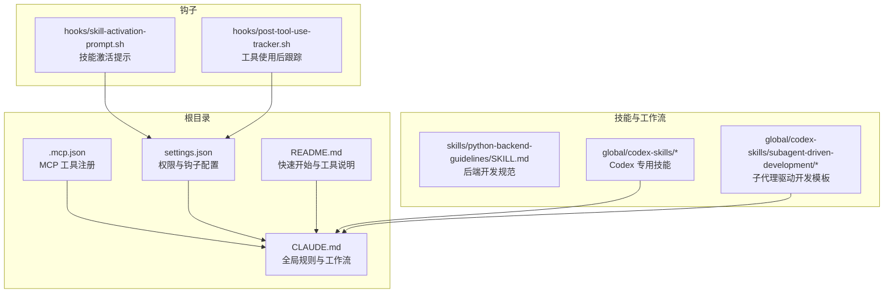
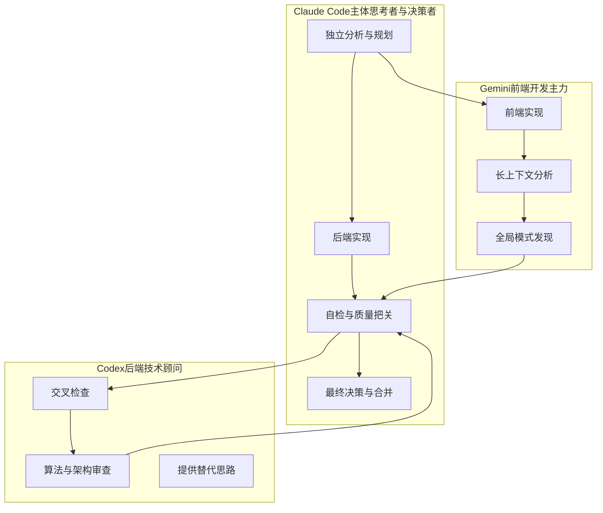
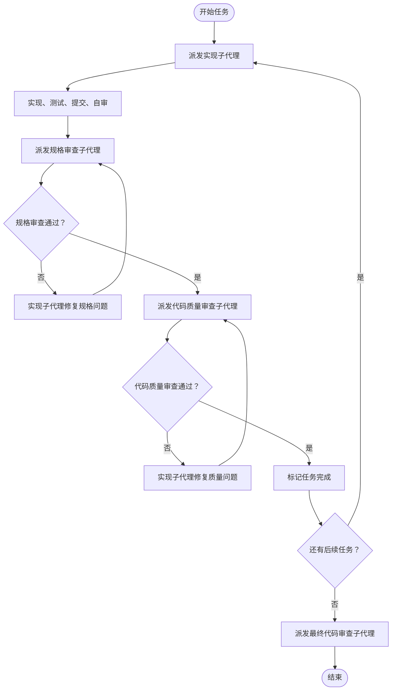
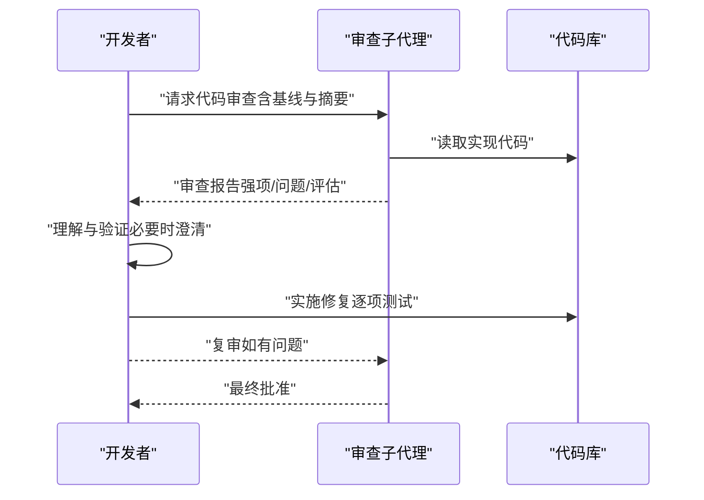
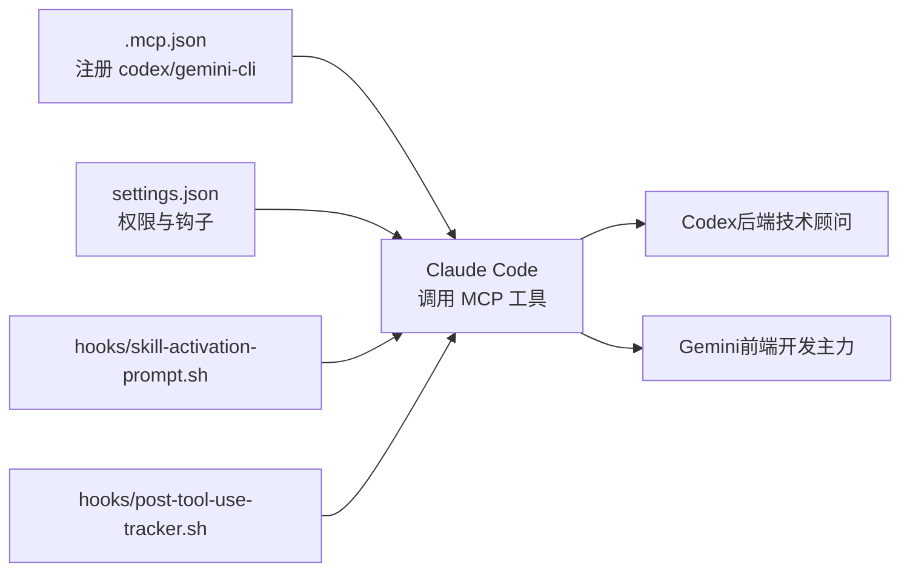

# Codex 后端专家

<cite>
**本文引用的文件**
- [README.md](file://README.md)
- [CLAUDE.md](file://CLAUDE.md)
- [.mcp.json](file://.mcp.json)
- [settings.json](file://settings.json)
- [hooks/skill-activation-prompt.sh](file://hooks/skill-activation-prompt.sh)
- [hooks/post-tool-use-tracker.sh](file://hooks/post-tool-use-tracker.sh)
- [global/codex-skills/receiving-code-review/SKILL.md](file://global/codex-skills/receiving-code-review/SKILL.md)
- [global/codex-skills/requesting-code-review/SKILL.md](file://global/codex-skills/requesting-code-review/SKILL.md)
- [global/codex-skills/subagent-driven-development/SKILL.md](file://global/codex-skills/subagent-driven-development/SKILL.md)
- [global/codex-skills/subagent-driven-development/implementer-prompt.md](file://global/codex-skills/subagent-driven-development/implementer-prompt.md)
- [global/codex-skills/subagent-driven-development/spec-reviewer-prompt.md](file://global/codex-skills/subagent-driven-development/spec-reviewer-prompt.md)
- [global/codex-skills/subagent-driven-development/code-quality-reviewer-prompt.md](file://global/codex-skills/subagent-driven-development/code-quality-reviewer-prompt.md)
- [skills/python-backend-guidelines/SKILL.md](file://skills/python-backend-guidelines/SKILL.md)
</cite>

## 目录
1. [简介](#简介)
2. [项目结构](#项目结构)
3. [核心组件](#核心组件)
4. [架构总览](#架构总览)
5. [详细组件分析](#详细组件分析)
6. [依赖关系分析](#依赖关系分析)
7. [性能考量](#性能考量)
8. [故障排查指南](#故障排查指南)
9. [结论](#结论)
10. [附录](#附录)

## 简介
本文件面向使用 Codex MCP 工具的后端开发者，系统性阐述 Codex 在“多 AI 协同 + 规范驱动开发（SDD）”体系中的角色定位与使用方法。Codex 作为“后端技术顾问”，负责：
- 后端代码交叉检查与算法审查
- 复杂架构设计建议与可行性评估
- 与 Claude 的“先独立思考、再交叉验证”的协作模式配合，提升代码质量与决策稳健性

同时，本文将详细说明 MCP 协议中 Codex 的配置参数（PROMPT、cd、sandbox、SESSION_ID 等）、使用规范与最佳实践，覆盖调用示例、权限控制与安全考虑，并解释 Codex 在后端开发流程中的作用、代码质量评估方式与技术难题处理路径。

## 项目结构
该仓库采用“模板 + 工作流 + 技能 + 钩子”的组织方式，围绕 Claude Code 的配置与使用展开：
- 根目录提供全局与项目级配置模板、MCP 工具配置与一键部署脚本
- skills 与 global/codex-skills 提供可复用的开发技能与 Codex 专用技能
- hooks 提供工具使用后的自动化跟踪与提示

图表来源
- [.mcp.json](file://.mcp.json#L1-L19)
- [settings.json](file://settings.json#L1-L37)
- [README.md](file://README.md#L1-L229)
- [CLAUDE.md](file://CLAUDE.md#L1-L440)
- [skills/python-backend-guidelines/SKILL.md](file://skills/python-backend-guidelines/SKILL.md#L1-L596)
- [global/codex-skills/subagent-driven-development/SKILL.md](file://global/codex-skills/subagent-driven-development/SKILL.md#L1-L241)
- [hooks/skill-activation-prompt.sh](file://hooks/skill-activation-prompt.sh#L1-L6)
- [hooks/post-tool-use-tracker.sh](file://hooks/post-tool-use-tracker.sh#L1-L178)

章节来源
- [README.md](file://README.md#L1-L229)
- [.mcp.json](file://.mcp.json#L1-L19)
- [settings.json](file://settings.json#L1-L37)

## 核心组件
- Codex MCP 工具：作为后端技术顾问，提供代码交叉检查、算法审查与架构建议
- Claude Code：主体思考者与决策者，主导后端实现与最终把关
- 子代理驱动开发（Subagent-Driven Development）：以任务为单位，通过“实现子代理 + 规格审查 + 代码质量审查”的两阶段评审闭环，保障实现质量
- 请求/接收代码审查技能：规范化审查反馈的接收与实施流程，避免盲目执行与表演性同意
- Python 后端开发规范：提供 FastAPI/Django 的分层架构、依赖注入、异常处理、测试与安全最佳实践

章节来源
- [CLAUDE.md](file://CLAUDE.md#L136-L146)
- [global/codex-skills/subagent-driven-development/SKILL.md](file://global/codex-skills/subagent-driven-development/SKILL.md#L1-L241)
- [global/codex-skills/requesting-code-review/SKILL.md](file://global/codex-skills/requesting-code-review/SKILL.md#L1-L106)
- [global/codex-skills/receiving-code-review/SKILL.md](file://global/codex-skills/receiving-code-review/SKILL.md#L1-L210)
- [skills/python-backend-guidelines/SKILL.md](file://skills/python-backend-guidelines/SKILL.md#L1-L596)

## 架构总览
下图展示 Claude Code、Codex 与 Gemini 在“多 AI 协同 + SDD”中的角色与交互关系：

图表来源
- [CLAUDE.md](file://CLAUDE.md#L136-L146)
- [CLAUDE.md](file://CLAUDE.md#L150-L186)

## 详细组件分析

### Codex MCP 工具配置与使用规范
- 工具名称：codex
- 必选参数
  - PROMPT：任务指令
  - cd：工作目录
- 可选参数
  - sandbox：访问级别（默认 read-only；可选 workspace-write 或 danger-full-access）
  - SESSION_ID：继续之前的会话
- 行为规范
  - 不指定 model 参数，使用 Codex 默认模型
  - 默认 sandbox=read-only，要求返回统一差异（unified diff）
  - 始终设置 return_all_messages=false

调用示例（路径参考）
- 示例 1：后端代码交叉检查
  - 使用路径：[CLAUDE.md](file://CLAUDE.md#L361-L378)
- 示例 2：继续上次会话
  - 使用路径：[CLAUDE.md](file://CLAUDE.md#L372-L372)

章节来源
- [CLAUDE.md](file://CLAUDE.md#L359-L390)

### 子代理驱动开发（Subagent-Driven Development）
- 核心思想：每个任务分配一个“实现子代理”，完成后依次进行“规格审查”和“代码质量审查”
- 两阶段评审顺序不可颠倒：先规格审查，再代码质量审查
- 评审循环：若发现问题，实现子代理修复后再次评审，直至通过

图表来源
- [global/codex-skills/subagent-driven-development/SKILL.md](file://global/codex-skills/subagent-driven-development/SKILL.md#L38-L82)
- [global/codex-skills/subagent-driven-development/implementer-prompt.md](file://global/codex-skills/subagent-driven-development/implementer-prompt.md#L1-L79)
- [global/codex-skills/subagent-driven-development/spec-reviewer-prompt.md](file://global/codex-skills/subagent-driven-development/spec-reviewer-prompt.md#L1-L62)
- [global/codex-skills/subagent-driven-development/code-quality-reviewer-prompt.md](file://global/codex-skills/subagent-driven-development/code-quality-reviewer-prompt.md#L1-L21)

章节来源
- [global/codex-skills/subagent-driven-development/SKILL.md](file://global/codex-skills/subagent-driven-development/SKILL.md#L1-L241)
- [global/codex-skills/subagent-driven-development/implementer-prompt.md](file://global/codex-skills/subagent-driven-development/implementer-prompt.md#L1-L79)
- [global/codex-skills/subagent-driven-development/spec-reviewer-prompt.md](file://global/codex-skills/subagent-driven-development/spec-reviewer-prompt.md#L1-L62)
- [global/codex-skills/subagent-driven-development/code-quality-reviewer-prompt.md](file://global/codex-skills/subagent-driven-development/code-quality-reviewer-prompt.md#L1-L21)

### 请求与接收代码审查
- 请求审查：在完成任务、重大特性或合并前，通过子代理模板发起审查，明确基线提交与实现摘要
- 接收审查：对反馈进行“读取—理解—验证—评估—响应—实施”的技术验证流程，避免表演性同意与盲目执行

图表来源
- [global/codex-skills/requesting-code-review/SKILL.md](file://global/codex-skills/requesting-code-review/SKILL.md#L24-L47)
- [global/codex-skills/receiving-code-review/SKILL.md](file://global/codex-skills/receiving-code-review/SKILL.md#L14-L25)

章节来源
- [global/codex-skills/requesting-code-review/SKILL.md](file://global/codex-skills/requesting-code-review/SKILL.md#L1-L106)
- [global/codex-skills/receiving-code-review/SKILL.md](file://global/codex-skills/receiving-code-review/SKILL.md#L1-L210)

### Python 后端开发规范与质量评估
- 分层架构：路由/视图 → 服务 → 仓储（可选） → ORM → 数据库
- 依赖注入：认证、数据库会话等通过依赖注入提供
- 异常处理与错误追踪：统一异常捕获与 Sentry 上报
- 类型提示与 Pydantic 验证：提升可维护性与接口稳定性
- 测试策略：服务层单元测试与端到端集成测试
- 安全与性能：密码哈希、JWT、查询优化、缓存策略

章节来源
- [skills/python-backend-guidelines/SKILL.md](file://skills/python-backend-guidelines/SKILL.md#L40-L596)

## 依赖关系分析
- MCP 工具注册：通过 .mcp.json 注册 codex 与 gemini-cli
- 权限与钩子：settings.json 控制编辑/笔记权限与工具使用钩子
- 钩子脚本：skill-activation-prompt.sh 与 post-tool-use-tracker.sh 提供技能激活提示与工具使用后跟踪

图表来源
- [.mcp.json](file://.mcp.json#L1-L19)
- [settings.json](file://settings.json#L1-L37)
- [hooks/skill-activation-prompt.sh](file://hooks/skill-activation-prompt.sh#L1-L6)
- [hooks/post-tool-use-tracker.sh](file://hooks/post-tool-use-tracker.sh#L1-L178)

章节来源
- [.mcp.json](file://.mcp.json#L1-L19)
- [settings.json](file://settings.json#L1-L37)
- [hooks/skill-activation-prompt.sh](file://hooks/skill-activation-prompt.sh#L1-L6)
- [hooks/post-tool-use-tracker.sh](file://hooks/post-tool-use-tracker.sh#L1-L178)

## 性能考量
- 代码质量评估前置：通过子代理驱动开发的两阶段评审，尽早暴露问题，降低后期返工成本
- 依赖注入与分层：减少耦合，便于并行开发与测试
- 异常与日志：集中化错误追踪与日志输出，缩短定位时间
- 缓存与查询优化：针对数据库访问与热点接口进行缓存与查询优化

## 故障排查指南
- 工具未识别
  - 检查 .mcp.json 中 codex 注册项与命令路径
  - 参考路径：[.mcp.json](file://.mcp.json#L1-L19)
- 权限不足
  - 检查 settings.json 中 permissions.allow 与 defaultMode
  - 参考路径：[settings.json](file://settings.json#L3-L12)
- 工具使用后无跟踪
  - 检查 hooks/post-tool-use-tracker.sh 的执行权限与 session_id
  - 参考路径：[hooks/post-tool-use-tracker.sh](file://hooks/post-tool-use-tracker.sh#L1-L178)
- 审查反馈难以落地
  - 使用“接收代码审查”技能的验证流程，逐项澄清与验证
  - 参考路径：[global/codex-skills/receiving-code-review/SKILL.md](file://global/codex-skills/receiving-code-review/SKILL.md#L14-L25)

章节来源
- [.mcp.json](file://.mcp.json#L1-L19)
- [settings.json](file://settings.json#L3-L12)
- [hooks/post-tool-use-tracker.sh](file://hooks/post-tool-use-tracker.sh#L1-L178)
- [global/codex-skills/receiving-code-review/SKILL.md](file://global/codex-skills/receiving-code-review/SKILL.md#L14-L25)

## 结论
Codex 作为后端技术顾问，在“多 AI 协同 + SDD”工作流中承担了不可替代的质量与架构把关职责。通过规范化的 MCP 配置、子代理驱动开发的两阶段评审、以及 Python 后端开发规范的落地，团队可以在保证速度的同时显著提升代码质量与系统稳定性。建议在以下方面持续优化：
- 明确每次调用 Codex 的边界与期望输出（统一差异、最小可行建议）
- 将“规格审查 → 代码质量审查”的顺序固化为流程
- 将错误追踪与日志规范纳入 CI/CD，实现问题可追溯

## 附录

### MCP 工具调用示例（路径参考）
- 后端代码交叉检查
  - 使用路径：[CLAUDE.md](file://CLAUDE.md#L361-L378)
- 继续上次会话
  - 使用路径：[CLAUDE.md](file://CLAUDE.md#L372-L372)
- 请求代码审查
  - 使用路径：[global/codex-skills/requesting-code-review/SKILL.md](file://global/codex-skills/requesting-code-review/SKILL.md#L24-L47)
- 接收代码审查
  - 使用路径：[global/codex-skills/receiving-code-review/SKILL.md](file://global/codex-skills/receiving-code-review/SKILL.md#L14-L25)

### 最佳实践清单
- 先独立分析，再交叉验证
- 严格遵循“规格审查 → 代码质量审查”的顺序
- 使用统一差异（unified diff）进行代码对比
- 对外部建议保持技术验证，避免表演性同意
- 将错误追踪与日志输出纳入标准流程