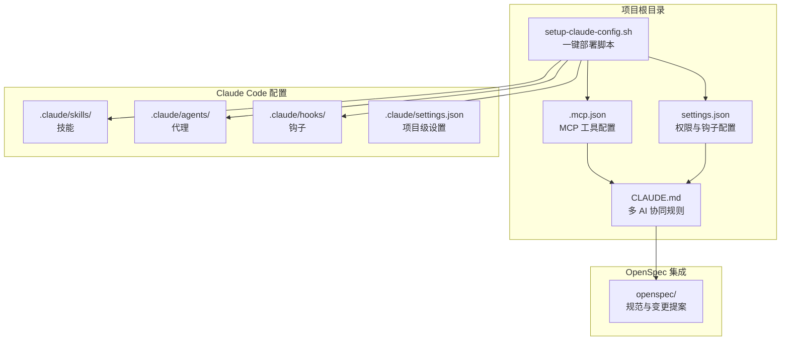
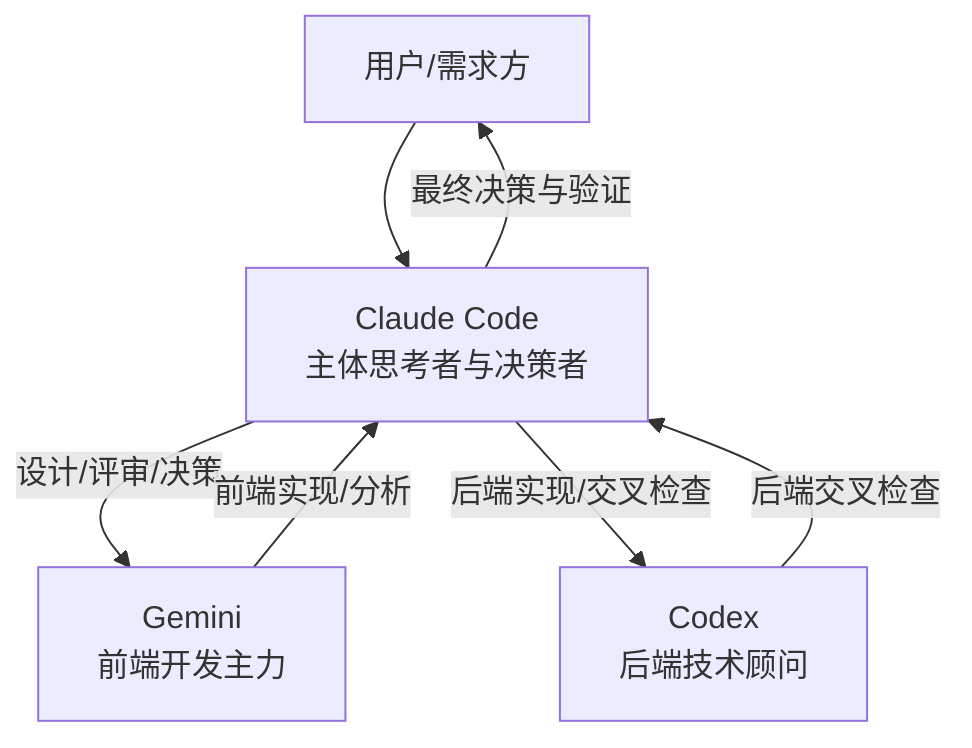
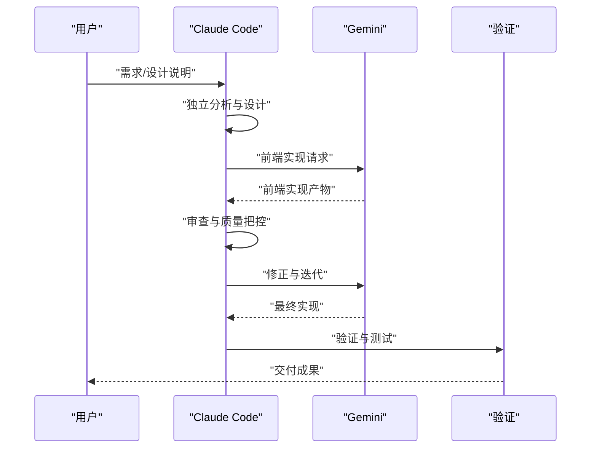
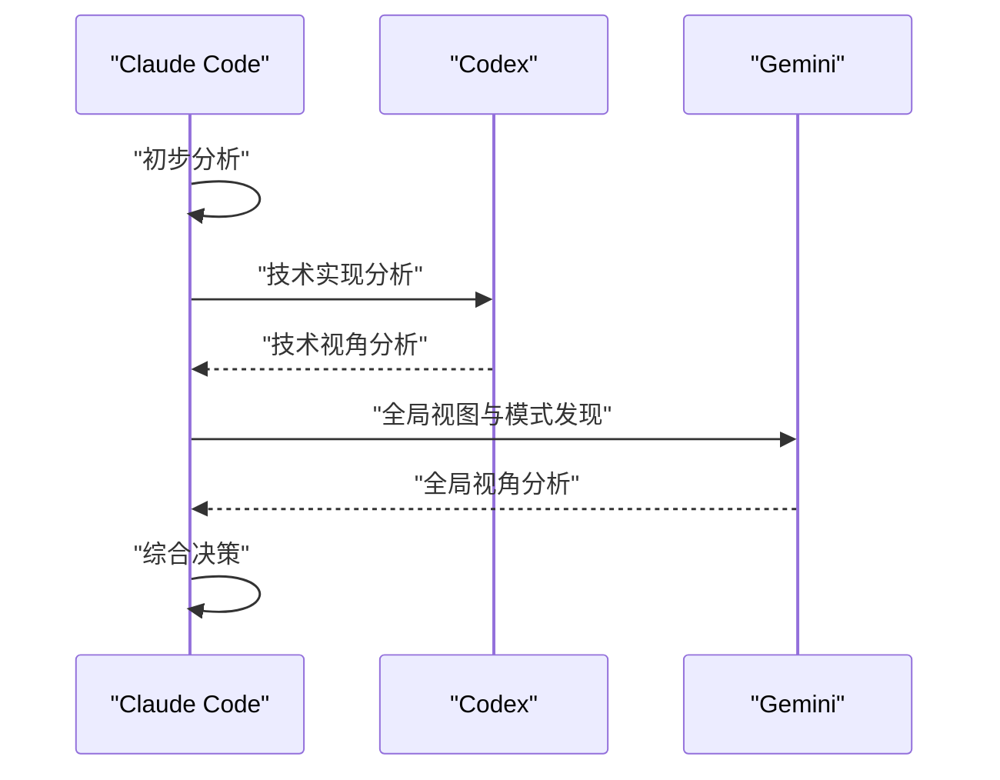
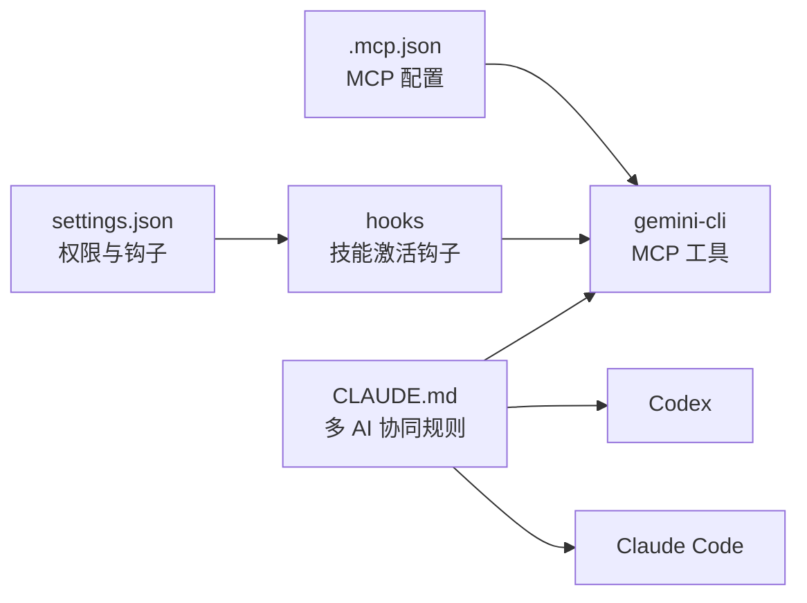

# Gemini 前端专家

<cite>
**本文引用的文件**
- [README.md](file://README.md)
- [.mcp.json](file://.mcp.json)
- [settings.json](file://settings.json)
- [CLAUDE.md](file://CLAUDE.md)
- [agents/frontend-error-fixer.md](file://agents/frontend-error-fixer.md)
- [agents/code-architecture-reviewer.md](file://agents/code-architecture-reviewer.md)
- [agents/documentation-architect.md](file://agents/documentation-architect.md)
- [global/codex-skills/receiving-code-review/SKILL.md](file://global/codex-skills/receiving-code-review/SKILL.md)
- [skills/python-backend-guidelines/SKILL.md](file://skills/python-backend-guidelines/SKILL.md)
- [skills/skill-developer/SKILL.md](file://skills/skill-developer/SKILL.md)
- [setup-claude-config.sh](file://setup-claude-config.sh)
- [hooks/skill-activation-prompt.sh](file://hooks/skill-activation-prompt.sh)
</cite>

## 目录
1. [简介](#简介)
2. [项目结构](#项目结构)
3. [核心组件](#核心组件)
4. [架构总览](#架构总览)
5. [详细组件分析](#详细组件分析)
6. [依赖关系分析](#依赖关系分析)
7. [性能考量](#性能考量)
8. [故障排查指南](#故障排查指南)
9. [结论](#结论)
10. [附录](#附录)

## 简介
本文件面向使用 Gemini MCP 工具的前端开发者与协作团队，系统阐述 Gemini 在“多 AI 协同 + 规范驱动开发（SDD）”工作流中的角色定位、配置规范、使用场景与限制条件，并提供前后端分工流程、调用示例路径、代码审查要点与协作建议。Gemini 作为前端开发主力，专注于前端代码实现、大规模文本/代码分析与全局视图与模式发现；Claude 作为主体思考者与决策者，负责总体设计、质量把控与最终决策；Codex 作为后端技术顾问，提供交叉验证与算法审查。

## 项目结构
该仓库提供了完整的多 AI 协同基础设施与模板，重点涉及：
- 全局与项目级 CLAUDE.md 规则
- MCP 工具配置（Codex 与 Gemini）
- 技能（Skills）、代理（Agents）与钩子（Hooks）
- OpenSpec 规范驱动开发集成
- 一键部署脚本，支持在任意项目快速启用多 AI 协同

图表来源
- [.mcp.json](file://.mcp.json#L1-L19)
- [settings.json](file://settings.json#L1-L37)
- [CLAUDE.md](file://CLAUDE.md#L1-L440)
- [setup-claude-config.sh](file://setup-claude-config.sh#L1-L372)

章节来源
- [README.md](file://README.md#L1-L229)
- [.mcp.json](file://.mcp.json#L1-L19)
- [settings.json](file://settings.json#L1-L37)
- [CLAUDE.md](file://CLAUDE.md#L1-L440)
- [setup-claude-config.sh](file://setup-claude-config.sh#L1-L372)

## 核心组件
- MCP 工具（Gemini 与 Codex）
  - Gemini 作为前端开发主力，负责前端实现、大规模文本/代码分析与全局视图与模式发现
  - Codex 作为后端技术顾问，负责后端交叉检查与算法审查
- 角色分工与流程
  - 前端开发流程：Claude 设计 → Gemini 实现 → Claude 审查 → Gemini/Claude 修正 → 验证
  - 后端开发流程：Claude 实现 → Claude 自检 → Codex 交叉检查 → Claude 修复 → 验证
- 交叉检查规则
  - 前端代码：主实现（Gemini），交叉检查（Claude），修复者（Gemini/Claude）
  - 后端代码：主实现（Claude），交叉检查（Codex），修复者（Claude）

章节来源
- [CLAUDE.md](file://CLAUDE.md#L142-L146)
- [CLAUDE.md](file://CLAUDE.md#L163-L174)
- [CLAUDE.md](file://CLAUDE.md#L200-L203)

## 架构总览
下图展示了 Gemini 在多 AI 协同中的职责边界与协作关系：

图表来源
- [CLAUDE.md](file://CLAUDE.md#L104-L124)
- [CLAUDE.md](file://CLAUDE.md#L142-L146)
- [CLAUDE.md](file://CLAUDE.md#L200-L203)

## 详细组件分析

### Gemini MCP 工具配置与使用规范
- 工具名称与入口
  - 工具名：gemini-cli
  - 传输方式：stdio
  - 命令：npx -y gemini-mcp-tool
- 角色定位与规范
  - 不指定模型参数，使用 Gemini 默认模型
  - 将 Gemini 视为只读分析师
  - 实现与最终决策由 Claude 与 Codex 完成
  - 前端代码开发优先使用 Gemini
- 与 Claude 的协作原则
  - Claude 先独立分析与设计，再用 Gemini 获取全局视图与模式发现
  - Gemini 的实现需由 Claude 审查与验证

章节来源
- [.mcp.json](file://.mcp.json#L9-L17)
- [CLAUDE.md](file://CLAUDE.md#L380-L390)

### 前后端分工流程（以 Gemini 为主导的前端流程）

图表来源
- [CLAUDE.md](file://CLAUDE.md#L163-L174)

章节来源
- [CLAUDE.md](file://CLAUDE.md#L163-L174)

### 复杂分析与方案设计流程（Claude + Codex + Gemini）

图表来源
- [CLAUDE.md](file://CLAUDE.md#L176-L186)

章节来源
- [CLAUDE.md](file://CLAUDE.md#L176-L186)

### 前端错误诊断与修复（Agent 配置参考）
- 前端错误修复 Agent
  - 适用于构建时（TypeScript/打包/ESLint）与运行时（浏览器控制台/React/网络）错误
  - 诊断步骤：分类错误类型、分析堆栈/控制台、截图/检查、最小化修复、验证
  - 关键原则：精准修复、保留既有功能、防御性编程、遵循项目模式
- 与 Gemini 的协作
  - Gemini 负责前端实现与大规模文本分析
  - 前端错误修复 Agent 侧重于错误定位与修复执行

章节来源
- [agents/frontend-error-fixer.md](file://agents/frontend-error-fixer.md#L1-L77)

### 代码架构审查（与 Gemini 前端实现的衔接）
- 代码架构审查 Agent
  - 关注实现质量、设计决策、系统集成与架构一致性
  - 涵盖 TypeScript/React 最佳实践、API 集成、数据库操作、状态管理等
  - 审查后保存输出并等待 Claude 明确批准后再实施修复
- 与 Gemini 的配合
  - Gemini 实现前端代码后，由 Claude 通过架构审查 Agent 进行系统级把关

章节来源
- [agents/code-architecture-reviewer.md](file://agents/code-architecture-reviewer.md#L1-L84)

### 文档架构师（与 Gemini 前端实现的文档协同）
- 文档架构师 Agent
  - 负责创建/更新/增强各类文档（开发者文档、API 文档、数据流图、测试文档）
  - 通过上下文收集与系统分析，产出高质量文档
- 与 Gemini 的配合
  - Gemini 实现前端功能后，由文档架构师 Agent 产出配套文档，确保知识沉淀与可维护性

章节来源
- [agents/documentation-architect.md](file://agents/documentation-architect.md#L1-L83)

### 交叉检查与代码审查（接收外部反馈）
- 接收代码审查（Codex 技能）
  - 原则：先理解/验证/评估，再响应/实施
  - 禁止行为：表演式认同、盲目实现、批量化不测试、假设审查者正确
  - 适用场景：外部审查反馈、YAGNI 检查、冲突决策协商
- 与 Gemini 的协作
  - Gemini 的前端实现需经过 Claude 的交叉检查与审查，确保质量与一致性

章节来源
- [global/codex-skills/receiving-code-review/SKILL.md](file://global/codex-skills/receiving-code-review/SKILL.md#L1-L210)

### 技能开发与钩子机制（与 Gemini 的自动化协作）
- 技能开发者（Skill Developer）
  - 两钩子架构：UserPromptSubmit（主动建议）、Stop Hook（温和提醒）
  - 配置文件：skill-rules.json，定义触发条件、执行级别与跳过条件
  - 最佳实践：500 行规则、渐进披露、表头目录、触发关键词丰富
- 钩子脚本
  - skill-activation-prompt.sh：在 Claude 看到用户提示前注入相关技能建议
- 与 Gemini 的协作
  - 通过钩子机制，确保 Gemini 的前端实现与项目技能/规则保持一致

章节来源
- [skills/skill-developer/SKILL.md](file://skills/skill-developer/SKILL.md#L1-L427)
- [hooks/skill-activation-prompt.sh](file://hooks/skill-activation-prompt.sh#L1-L6)

### 后端开发规范（与 Gemini 的边界划分）
- Python 后端开发指南
  - 分层架构：路由/视图 → 服务 → 仓储 → ORM → 数据库
  - 最佳实践：类型提示、Pydantic/序列化器、异步/并发、错误处理与 Sentry、测试与迁移
- 与 Gemini 的协作
  - 后端实现由 Claude 主导，Gemini 不参与后端代码编写

章节来源
- [skills/python-backend-guidelines/SKILL.md](file://skills/python-backend-guidelines/SKILL.md#L1-L596)

## 依赖关系分析
- MCP 工具依赖
  - gemini-cli 通过 stdio 与 Claude 通信，命令为 npx -y gemini-mcp-tool
  - 依赖 Claude CLI 与 MCP 管理器
- 配置与钩子依赖
  - settings.json 控制权限与钩子执行
  - skill-activation-prompt.sh 注入技能建议，提升 Gemini 使用的上下文质量
- OpenSpec 与 CLAUDE.md
  - OpenSpec 规范驱动开发流程与 CLAUDE.md 的多 AI 协同规则相互支撑

图表来源
- [.mcp.json](file://.mcp.json#L1-L19)
- [settings.json](file://settings.json#L1-L37)
- [hooks/skill-activation-prompt.sh](file://hooks/skill-activation-prompt.sh#L1-L6)
- [CLAUDE.md](file://CLAUDE.md#L1-L440)

章节来源
- [.mcp.json](file://.mcp.json#L1-L19)
- [settings.json](file://settings.json#L1-L37)
- [hooks/skill-activation-prompt.sh](file://hooks/skill-activation-prompt.sh#L1-L6)
- [CLAUDE.md](file://CLAUDE.md#L1-L440)

## 性能考量
- Gemini 的长上下文与大规模文本分析能力适合处理复杂界面设计与全局模式发现，但需注意：
  - 任务拆分：将复杂界面拆分为多个前端组件与交互模块，降低单次调用负担
  - 上下文控制：在 Claude 的设计阶段明确边界与职责，避免重复与冗余
  - 交叉检查：通过 Claude 的审查与验证减少回溯成本
- 与 Codex 的配合
  - 复杂算法与后端实现交给 Codex，前端实现交给 Gemini，避免资源分散

## 故障排查指南
- Gemini 未被调用或返回不符合预期
  - 检查 .mcp.json 中 gemini-cli 的配置与命令是否正确
  - 确认 Claude CLI 已安装并可访问 MCP 管理器
- 前端错误定位困难
  - 使用前端错误修复 Agent 进行分类与诊断，必要时结合浏览器截图与控制台日志
- 文档缺失或不一致
  - 使用文档架构师 Agent 生成/更新文档，确保与前端实现同步
- 技能未触发或触发过多
  - 检查 skill-rules.json 的关键字/意图/文件路径/内容模式配置
  - 使用 hooks/skill-activation-prompt.sh 进行手动测试验证

章节来源
- [.mcp.json](file://.mcp.json#L1-L19)
- [agents/frontend-error-fixer.md](file://agents/frontend-error-fixer.md#L1-L77)
- [agents/documentation-architect.md](file://agents/documentation-architect.md#L1-L83)
- [skills/skill-developer/SKILL.md](file://skills/skill-developer/SKILL.md#L269-L290)
- [hooks/skill-activation-prompt.sh](file://hooks/skill-activation-prompt.sh#L1-L6)

## 结论
Gemini 在本多 AI 协同体系中承担前端开发主力角色，专注于前端实现、大规模文本/代码分析与全局视图与模式发现；Claude 作为主体思考者与决策者，负责总体设计、质量把控与最终决策；Codex 作为后端技术顾问，提供交叉验证与算法审查。通过清晰的分工、严格的交叉检查与 OpenSpec 规范驱动开发流程，Gemini 能够高效融入前端开发流程，与 Claude 和 Codex 协同提升整体交付质量与效率。

## 附录
- 一键部署脚本
  - setup-claude-config.sh 支持安装 CLAUDE.md、技能、代理、钩子、OpenSpec 与 MCP 工具（Codex 与 Gemini）
- 使用建议
  - 在 Claude 的设计阶段明确前端边界与职责，再调用 Gemini 实现
  - 通过 Claude 的审查与验证，确保前端实现的质量与一致性
  - 与 Codex 协作处理复杂算法与后端实现，避免职责重叠

章节来源
- [setup-claude-config.sh](file://setup-claude-config.sh#L1-L372)
- [CLAUDE.md](file://CLAUDE.md#L1-L440)