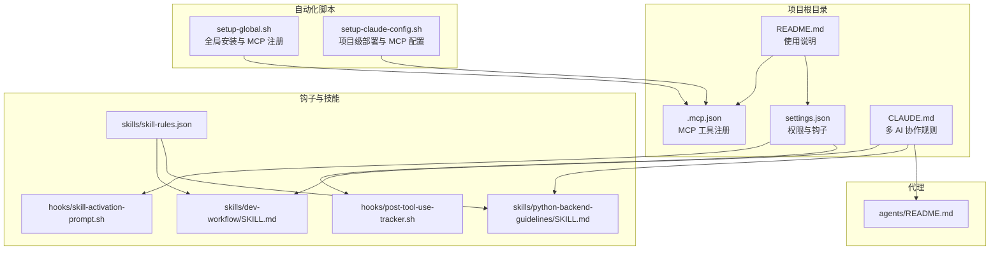
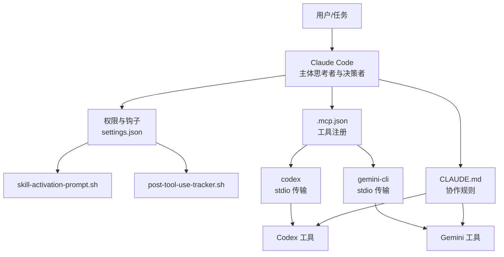
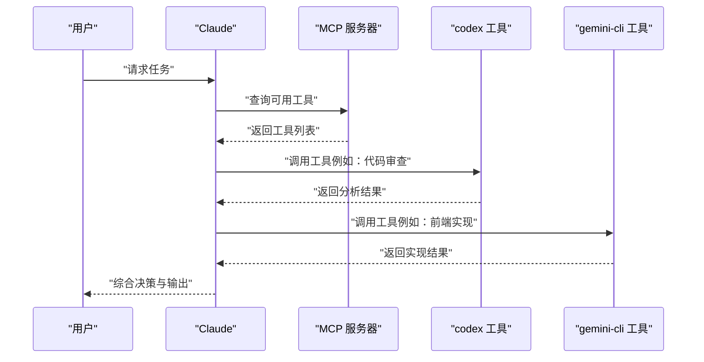
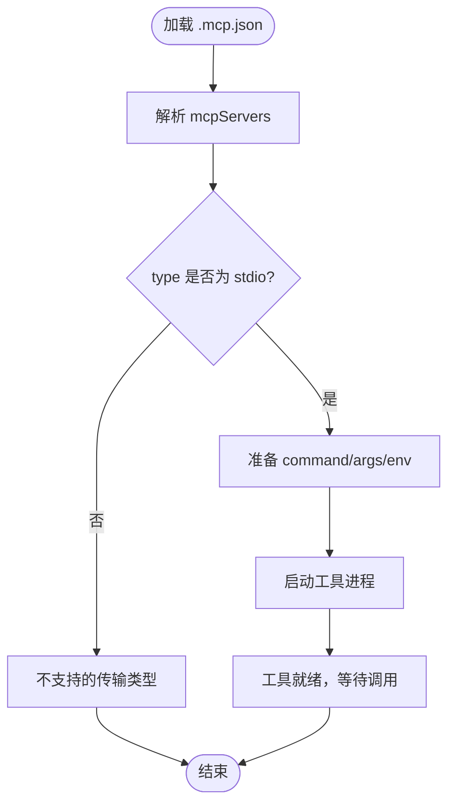
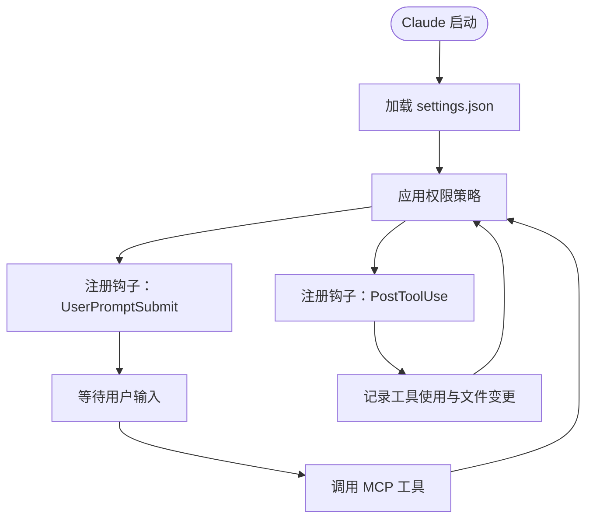
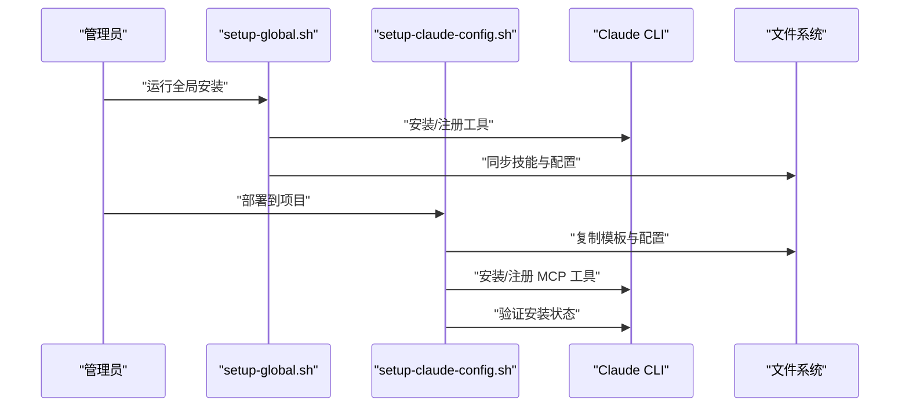
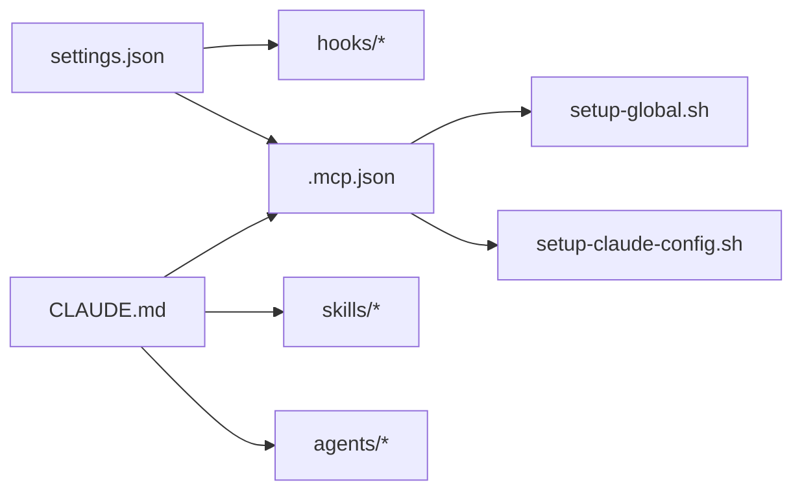

# MCP 协议集成

<cite>
**本文引用的文件**
- [.mcp.json](file://.mcp.json)
- [README.md](file://README.md)
- [CLAUDE.md](file://CLAUDE.md)
- [settings.json](file://settings.json)
- [setup-claude-config.sh](file://setup-claude-config.sh)
- [setup-global.sh](file://setup-global.sh)
- [hooks/skill-activation-prompt.sh](file://hooks/skill-activation-prompt.sh)
- [hooks/post-tool-use-tracker.sh](file://hooks/post-tool-use-tracker.sh)
- [skills/skill-rules.json](file://skills/skill-rules.json)
- [agents/README.md](file://agents/README.md)
- [skills/dev-workflow/SKILL.md](file://skills/dev-workflow/SKILL.md)
- [skills/python-backend-guidelines/SKILL.md](file://skills/python-backend-guidelines/SKILL.md)
</cite>

## 目录
1. [简介](#简介)
2. [项目结构](#项目结构)
3. [核心组件](#核心组件)
4. [架构总览](#架构总览)
5. [详细组件分析](#详细组件分析)
6. [依赖关系分析](#依赖关系分析)
7. [性能考虑](#性能考虑)
8. [故障排除指南](#故障排除指南)
9. [结论](#结论)
10. [附录](#附录)

## 简介
本文件面向在 Claude Code 环境中集成 MCP（Multi-Agent Communication Protocol）的工程师与项目经理，系统阐述 MCP 协议在本项目中的工作机制、工具注册与通信流程、.mcp.json 配置结构与参数、权限与连接管理、工具集成步骤、故障排除、性能优化与安全最佳实践。文档同时解释 Claude、Codex 与 Gemini 如何通过 MCP 实现协调工作，并提供扩展到其他 AI 工具的指导。

## 项目结构
本仓库采用“模板 + 脚本 + 配置”的组织方式，围绕 Claude Code 的多 AI 协同与 SDD（规范驱动开发）工作流展开：
- 全局与项目级配置模板：CLAUDE.md、settings.json、.mcp.json
- 自动化部署脚本：setup-global.sh、setup-claude-config.sh
- 钩子与技能：hooks、skills、agents
- 文档与规范：README.md、CLAUDE.md、skills/*、agents/*

**图表来源**
- [.mcp.json](file://.mcp.json#L1-L19)
- [settings.json](file://settings.json#L1-L37)
- [README.md](file://README.md#L123-L139)
- [CLAUDE.md](file://CLAUDE.md#L102-L125)
- [setup-global.sh](file://setup-global.sh#L230-L264)
- [setup-claude-config.sh](file://setup-claude-config.sh#L244-L282)
- [hooks/skill-activation-prompt.sh](file://hooks/skill-activation-prompt.sh#L1-L6)
- [hooks/post-tool-use-tracker.sh](file://hooks/post-tool-use-tracker.sh#L1-L178)
- [skills/skill-rules.json](file://skills/skill-rules.json#L1-L250)
- [agents/README.md](file://agents/README.md#L1-L301)

**章节来源**
- [README.md](file://README.md#L71-L92)
- [.mcp.json](file://.mcp.json#L1-L19)
- [settings.json](file://settings.json#L1-L37)

## 核心组件
- MCP 工具注册与传输层
  - 通过 .mcp.json 定义工具服务器（codex、gemini-cli），使用 stdio 传输，启动命令与参数来自配置。
- 权限与钩子
  - settings.json 控制工具调用权限、默认编辑接受模式，以及用户提交与工具使用后的钩子执行。
- 自动化部署与验证
  - setup-global.sh 与 setup-claude-config.sh 提供一键安装 Claude Code、MCP 工具、同步技能与配置，并进行安装后验证。
- 钩子脚本
  - skill-activation-prompt.sh：在用户提交提示后触发技能激活钩子。
  - post-tool-use-tracker.sh：记录工具使用产生的文件变更与构建命令，便于后续验证与缓存。
- 技能与代理
  - skill-rules.json 定义技能触发规则，配合 CLAUDE.md 的多 AI 协作原则，指导 Claude 在合适时机调用 Codex/Gemini。
  - agents/README.md 提供代理使用与集成指南，强调与 MCP 的互补关系。

**章节来源**
- [.mcp.json](file://.mcp.json#L1-L19)
- [settings.json](file://settings.json#L1-L37)
- [setup-global.sh](file://setup-global.sh#L230-L264)
- [setup-claude-config.sh](file://setup-claude-config.sh#L244-L282)
- [hooks/skill-activation-prompt.sh](file://hooks/skill-activation-prompt.sh#L1-L6)
- [hooks/post-tool-use-tracker.sh](file://hooks/post-tool-use-tracker.sh#L1-L178)
- [skills/skill-rules.json](file://skills/skill-rules.json#L1-L250)
- [agents/README.md](file://agents/README.md#L149-L168)

## 架构总览
下图展示了 MCP 在本项目中的整体架构：Claude 作为主体思考者与决策者，通过 MCP 协议调用 Codex 与 Gemini 工具；权限与钩子贯穿工具调用生命周期；自动化脚本负责安装与配置。

**图表来源**
- [CLAUDE.md](file://CLAUDE.md#L102-L125)
- [.mcp.json](file://.mcp.json#L1-L19)
- [settings.json](file://settings.json#L1-L37)
- [hooks/skill-activation-prompt.sh](file://hooks/skill-activation-prompt.sh#L1-L6)
- [hooks/post-tool-use-tracker.sh](file://hooks/post-tool-use-tracker.sh#L1-L178)

## 详细组件分析

### MCP 工具注册与通信流程
- 工具注册
  - .mcp.json 中定义了两个工具服务器：codex 与 gemini-cli，均使用 stdio 传输，启动命令与参数明确。
- 通信机制
  - Claude 通过 MCP 协议与工具进程建立连接，工具以标准输入/输出进行消息交换。
- 安装与验证
  - setup-global.sh 与 setup-claude-config.sh 提供两种安装路径：直接复制 .mcp.json 模板或使用 claude mcp add 命令注册工具，并在安装后列出工具状态进行验证。

**图表来源**
- [.mcp.json](file://.mcp.json#L1-L19)
- [setup-global.sh](file://setup-global.sh#L230-L264)
- [setup-claude-config.sh](file://setup-claude-config.sh#L244-L282)

**章节来源**
- [.mcp.json](file://.mcp.json#L1-L19)
- [setup-global.sh](file://setup-global.sh#L230-L264)
- [setup-claude-config.sh](file://setup-claude-config.sh#L244-L282)

### .mcp.json 配置详解
- 结构与字段
  - mcpServers：工具服务器集合
    - codex：type=stdio，command 指向 codex，args 为 mcp-server
    - gemini-cli：type=stdio，command=npx，args 为 -y gemini-mcp-tool
  - env：环境变量（当前为空）
- 参数说明
  - type：传输类型，stdio 表示通过标准输入/输出进行通信
  - command/args：启动工具进程的命令与参数
  - env：工具运行时的环境变量（可扩展）

**图表来源**
- [.mcp.json](file://.mcp.json#L1-L19)

**章节来源**
- [.mcp.json](file://.mcp.json#L1-L19)

### 权限控制与连接管理
- 权限配置
  - enableAllProjectMcpServers：启用项目级所有 MCP 服务器
  - permissions.allow：允许的工具操作集合（编辑、写入、多编辑、笔记本编辑、Bash）
  - defaultMode：默认编辑接受模式（acceptEdits）
- 钩子机制
  - UserPromptSubmit：用户提交提示后执行 skill-activation-prompt.sh
  - PostToolUse：工具使用后（匹配 Edit|MultiEdit|Write）执行 post-tool-use-tracker.sh
- 连接管理
  - 通过 stdio 传输，工具进程由 Claude 管理生命周期；settings.json 控制默认行为与安全边界

**图表来源**
- [settings.json](file://settings.json#L1-L37)
- [hooks/skill-activation-prompt.sh](file://hooks/skill-activation-prompt.sh#L1-L6)
- [hooks/post-tool-use-tracker.sh](file://hooks/post-tool-use-tracker.sh#L1-L178)

**章节来源**
- [settings.json](file://settings.json#L1-L37)
- [hooks/skill-activation-prompt.sh](file://hooks/skill-activation-prompt.sh#L1-L6)
- [hooks/post-tool-use-tracker.sh](file://hooks/post-tool-use-tracker.sh#L1-L178)

### 工具集成步骤
- 全局安装与 MCP 注册（setup-global.sh）
  - 安装 Claude Code、Codex CLI、Gemini CLI
  - 注册 codex 与 gemini-cli MCP 工具
  - 同步 Codex 技能与 Gemini 配置
- 项目级部署（setup-claude-config.sh）
  - 复制 CLAUDE.md、hooks、skills、agents
  - 安装 OpenSpec（可选）
  - 安装 MCP 工具（优先复制 .mcp.json，否则使用 claude mcp add）
  - 验证安装：检查 hooks、JSON 有效性、目录结构、MCP 状态

**图表来源**
- [setup-global.sh](file://setup-global.sh#L230-L264)
- [setup-claude-config.sh](file://setup-claude-config.sh#L244-L282)

**章节来源**
- [setup-global.sh](file://setup-global.sh#L230-L264)
- [setup-claude-config.sh](file://setup-claude-config.sh#L244-L282)

### 故障排除指南
- MCP 工具未显示
  - 检查 .mcp.json 是否存在且有效
  - 使用 claude mcp list 查看工具状态
  - 若使用 claude mcp add 安装，确认命令与参数正确
- 权限不足导致工具调用失败
  - 检查 settings.json 中 permissions.allow 与 defaultMode
  - 确认工具调用是否在允许的操作范围内
- 钩子未执行
  - 检查 hooks 目录与脚本权限（chmod +x）
  - 确认 settings.json 中钩子配置匹配
- 文件变更跟踪异常
  - 检查 post-tool-use-tracker.sh 的日志与缓存目录
  - 确认文件路径与会话 ID 正确

**章节来源**
- [setup-claude-config.sh](file://setup-claude-config.sh#L336-L341)
- [settings.json](file://settings.json#L13-L35)
- [hooks/post-tool-use-tracker.sh](file://hooks/post-tool-use-tracker.sh#L1-L178)

## 依赖关系分析
- 组件耦合
  - settings.json 与 hooks：权限与钩子共同决定工具调用的安全边界与生命周期事件
  - .mcp.json 与 setup-*：工具注册与安装脚本紧密耦合，保证一致性
  - CLAUDE.md 与技能/代理：协作规则指导 Claude 在何时调用工具
- 外部依赖
  - Claude CLI：MCP 工具的宿主与编排者
  - Codex/Gemini CLI：外部工具进程，通过 stdio 与 Claude 通信

**图表来源**
- [settings.json](file://settings.json#L1-L37)
- [.mcp.json](file://.mcp.json#L1-L19)
- [setup-global.sh](file://setup-global.sh#L230-L264)
- [setup-claude-config.sh](file://setup-claude-config.sh#L244-L282)
- [CLAUDE.md](file://CLAUDE.md#L102-L125)

**章节来源**
- [settings.json](file://settings.json#L1-L37)
- [.mcp.json](file://.mcp.json#L1-L19)
- [setup-global.sh](file://setup-global.sh#L230-L264)
- [setup-claude-config.sh](file://setup-claude-config.sh#L244-L282)
- [CLAUDE.md](file://CLAUDE.md#L102-L125)

## 性能考虑
- 传输与并发
  - stdio 传输简单可靠，适合本地工具；若工具数量增多，建议关注进程启动开销与资源占用
- 权限与安全
  - 通过 permissions.allow 限制工具操作范围，减少不必要的文件系统访问
  - 使用默认模式 acceptEdits 时，建议配合钩子进行变更审计
- 钩子执行
  - 钩子脚本应尽量轻量化，避免阻塞工具调用主流程
- 缓存与增量
  - post-tool-use-tracker.sh 的缓存目录可用于增量构建与验证，减少重复工作

[本节为通用建议，无需特定文件引用]

## 故障排除指南
- 常见问题与解决
  - MCP 工具不可见：检查 .mcp.json 语法与 claude mcp list 输出
  - 权限被拒绝：核对 permissions.allow 与 defaultMode
  - 钩子不生效：确认脚本可执行与 settings.json 配置匹配
  - 文件跟踪缺失：检查 post-tool-use-tracker.sh 的日志与缓存目录
- 验证清单
  - 安装后运行 claude mcp list 与 claude plugin list
  - 使用最小任务验证工具调用链路
  - 检查 hooks 目录与脚本权限

**章节来源**
- [setup-claude-config.sh](file://setup-claude-config.sh#L336-L341)
- [settings.json](file://settings.json#L13-L35)
- [hooks/post-tool-use-tracker.sh](file://hooks/post-tool-use-tracker.sh#L1-L178)

## 结论
本项目通过 .mcp.json 明确注册 MCP 工具，借助 settings.json 的权限与钩子机制，结合自动化脚本实现一键部署与验证，形成以 Claude 为核心、Codex 与 Gemini 为辅助的多 AI 协同体系。遵循本文的配置、集成与故障排除指南，可稳定地扩展到其他 AI 工具，并在保证安全与性能的前提下提升开发效率。

[本节为总结，无需特定文件引用]

## 附录

### MCP 工具使用规范（摘自 CLAUDE.md）
- Codex MCP
  - 必选参数：PROMPT、cd
  - 可选参数：sandbox、SESSION_ID、skip_git_repo_check、return_all_messages、image、model、yolo、profile
  - 规范：默认 sandbox=read-only，要求仅返回 unified diff；默认 return_all_messages=false
- Gemini MCP
  - 规范：视为只读分析师，实现与最终决策由 Claude 完成；前端代码开发优先使用 Gemini

**章节来源**
- [CLAUDE.md](file://CLAUDE.md#L359-L390)

### 技能与代理集成要点
- 技能触发
  - skill-rules.json 定义关键词、意图正则与文件模式，指导 Claude 在合适时机调用工具
- 代理使用
  - agents/README.md 提供代理复制与使用方法，强调与 MCP 的互补关系

**章节来源**
- [skills/skill-rules.json](file://skills/skill-rules.json#L1-L250)
- [agents/README.md](file://agents/README.md#L149-L168)