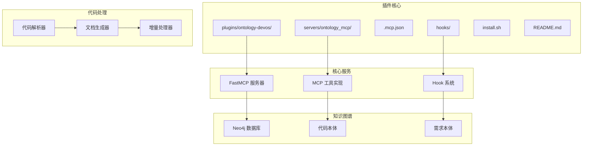
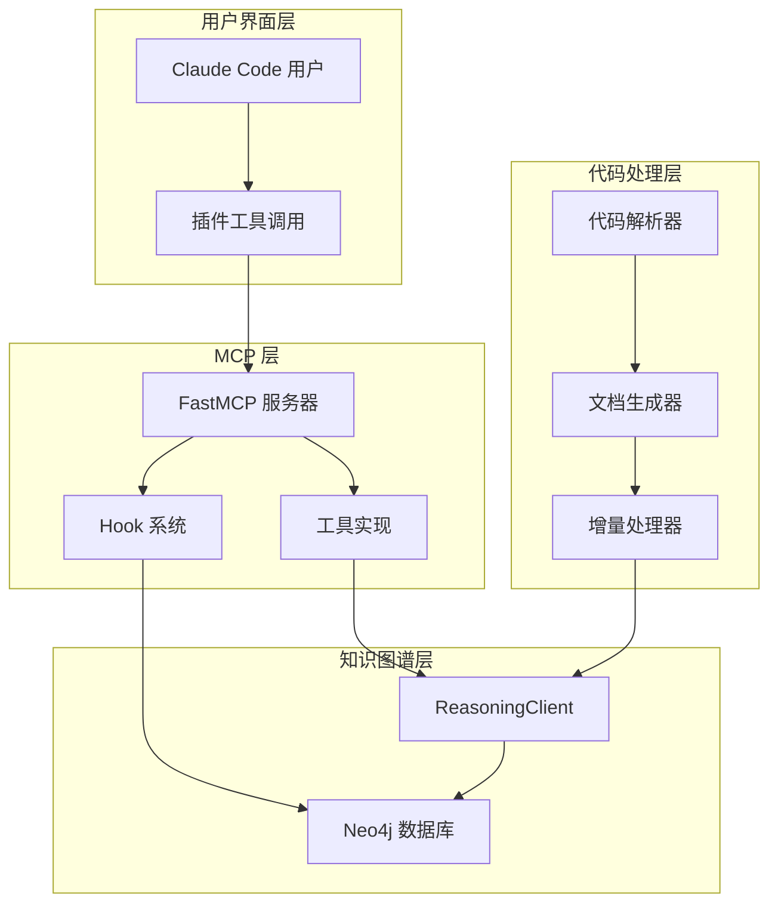
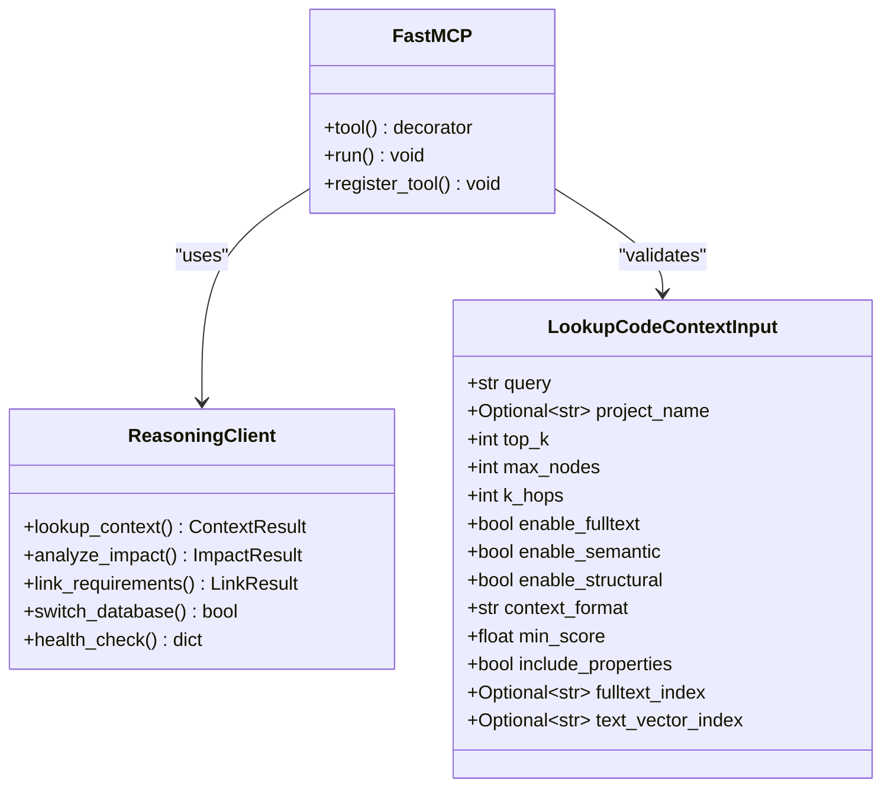
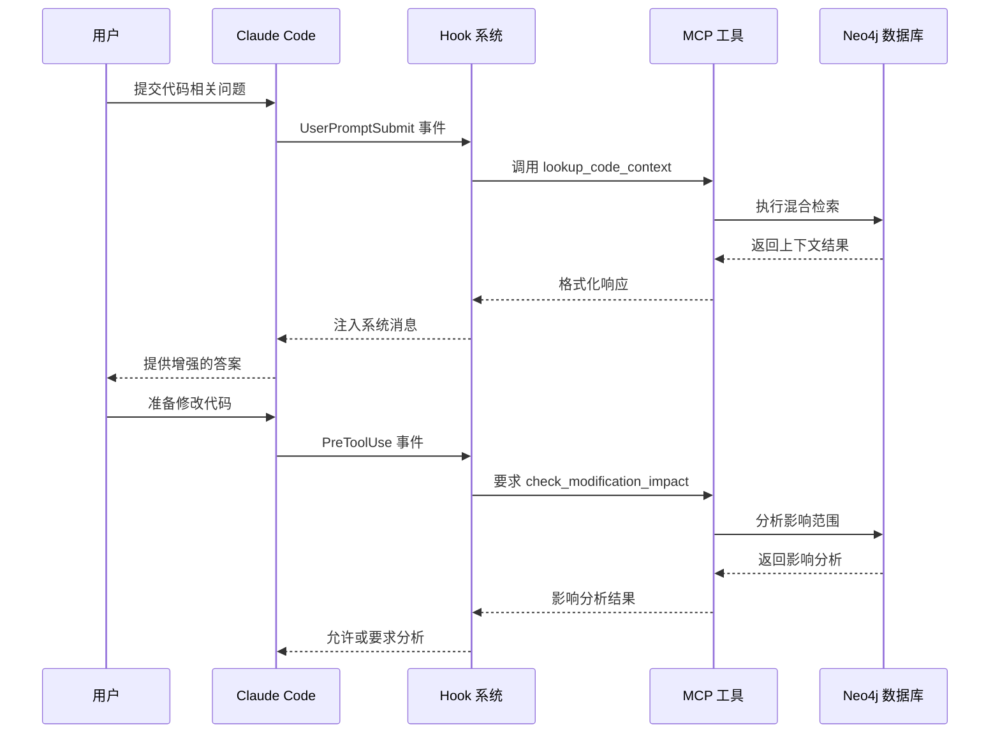
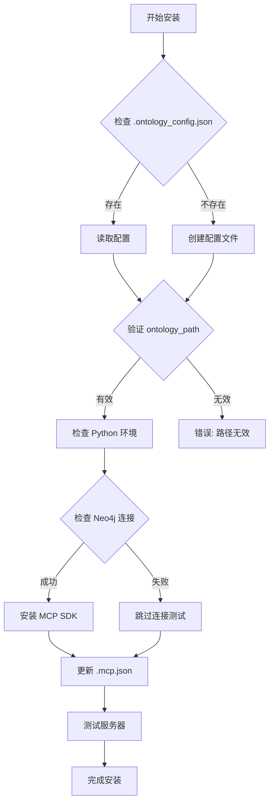
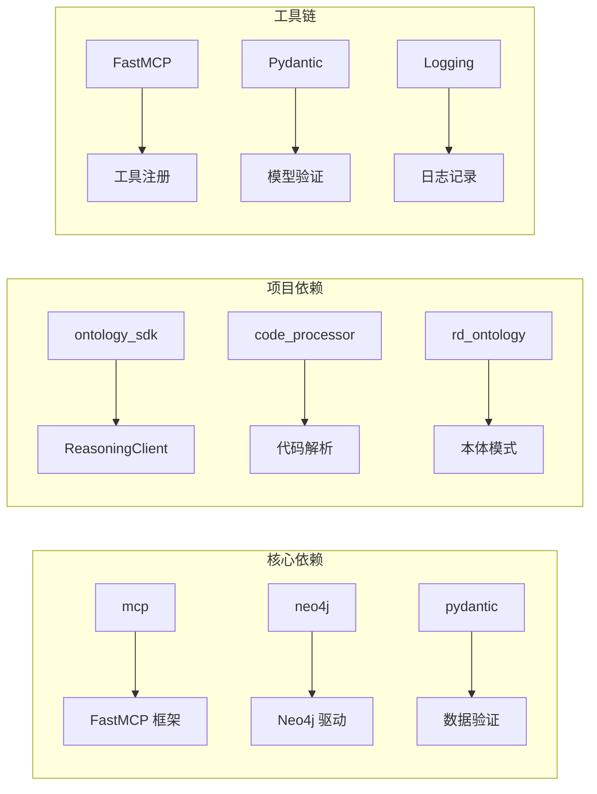
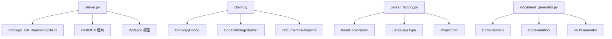
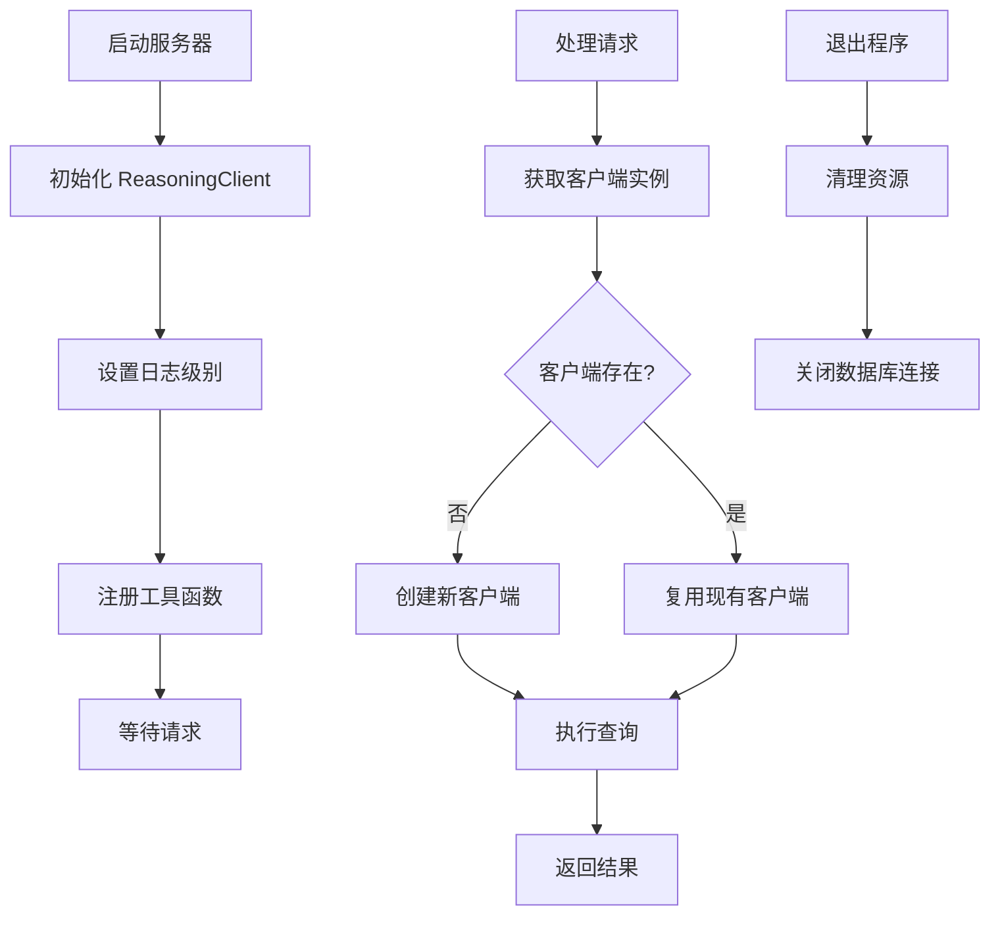
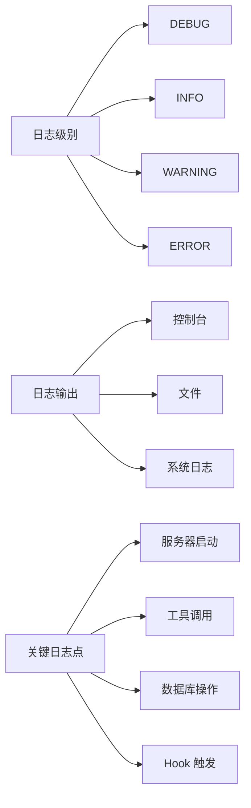

# ontology-devos MCP 插件

<cite>
**本文档引用的文件**
- [README.md](file://plugins/ontology-devos/README.md)
- [server.py](file://plugins/ontology-devos/servers/ontology_mcp/server.py)
- [.mcp.json](file://plugins/ontology-devos/.mcp.json)
- [hooks.json](file://plugins/ontology-devos/hooks/hooks.json)
- [install.sh](file://plugins/ontology-devos/install.sh)
- [client.py](file://ontology_client/client.py)
- [config.py](file://ontology_client/config.py)
- [__init__.py](file://code_processor/__init__.py)
- [parser_factory.py](file://code_processor/parser_factory.py)
- [base_parser.py](file://code_processor/base_parser.py)
- [document_generator.py](file://code_processor/document_generator.py)
- [incremental_processor.py](file://code_processor/incremental_processor.py)
- [settings.json](file://settings.json)
- [.ontology_config.json](file://.ontology_config.json)
</cite>

## 目录
1. [简介](#简介)
2. [项目结构](#项目结构)
3. [核心组件](#核心组件)
4. [架构概览](#架构概览)
5. [详细组件分析](#详细组件分析)
6. [依赖关系分析](#依赖关系分析)
7. [性能考虑](#性能考虑)
8. [故障排除指南](#故障排除指南)
9. [结论](#结论)

## 简介

ontology-devos MCP 插件是一个专为 Claude Code 设计的代码本体检索插件，提供了强大的代码上下文检索、修改影响分析和需求-代码链接能力。该插件基于 Neo4j 图数据库和 ontology 项目构建，能够智能地理解和检索代码知识图谱中的信息。

该插件的核心功能包括：
- **混合检索**：结合全文检索、语义检索和图结构扩展的多维度代码上下文检索
- **影响分析**：在修改代码前自动分析潜在影响范围
- **需求链接**：将需求文档与相关代码元素建立关联
- **自动化钩子**：智能触发机制，提升开发效率

## 项目结构

**图表来源**
- [server.py](file://plugins/ontology-devos/servers/ontology_mcp/server.py#L1-L271)
- [hooks.json](file://plugins/ontology-devos/hooks/hooks.json#L1-L28)

**章节来源**
- [README.md](file://plugins/ontology-devos/README.md#L1-L161)
- [server.py](file://plugins/ontology-devos/servers/ontology_mcp/server.py#L1-L271)

## 核心组件

### MCP 服务器组件

插件的核心是一个基于 FastMCP 的 Python 服务器，提供了三个主要的工具：

1. **lookup_code_context** - 代码上下文检索工具
2. **check_modification_impact** - 修改影响分析工具  
3. **link_spec_to_code** - 需求-代码链接工具

### Hook 系统

插件实现了两个智能 Hook：
- **UserPromptSubmit**：用户提交问题时自动触发代码上下文检索
- **PreToolUse**：代码写入前强制执行影响分析

### 配置管理系统

插件支持多种配置方式：
- 环境变量配置
- JSON 配置文件
- 自动安装脚本

**章节来源**
- [server.py](file://plugins/ontology-devos/servers/ontology_mcp/server.py#L147-L267)
- [hooks.json](file://plugins/ontology-devos/hooks/hooks.json#L1-L28)
- [config.py](file://ontology_client/config.py#L1-L129)

## 架构概览

**图表来源**
- [server.py](file://plugins/ontology-devos/servers/ontology_mcp/server.py#L106-L142)
- [client.py](file://ontology_client/client.py#L76-L156)

## 详细组件分析

### FastMCP 服务器实现

服务器采用 FastMCP 框架，提供了高性能的 MCP 协议实现：

**图表来源**
- [server.py](file://plugins/ontology-devos/servers/ontology_mcp/server.py#L29-L142)
- [server.py](file://plugins/ontology-devos/servers/ontology_mcp/server.py#L52-L98)

### Hook 触发机制

插件实现了智能的自动化触发系统：

**图表来源**
- [hooks.json](file://plugins/ontology-devos/hooks/hooks.json#L4-L25)
- [server.py](file://plugins/ontology-devos/servers/ontology_mcp/server.py#L147-L267)

### 安装和配置流程

**图表来源**
- [install.sh](file://plugins/ontology-devos/install.sh#L44-L110)
- [install.sh](file://plugins/ontology-devos/install.sh#L137-L214)

**章节来源**
- [server.py](file://plugins/ontology-devos/servers/ontology_mcp/server.py#L1-L271)
- [hooks.json](file://plugins/ontology-devos/hooks/hooks.json#L1-L28)
- [install.sh](file://plugins/ontology-devos/install.sh#L1-L263)

## 依赖关系分析

### 外部依赖

插件的主要外部依赖包括：

**图表来源**
- [server.py](file://plugins/ontology-devos/servers/ontology_mcp/server.py#L18-L47)
- [install.sh](file://plugins/ontology-devos/install.sh#L119-L130)

### 内部模块依赖

**图表来源**
- [server.py](file://plugins/ontology-devos/servers/ontology_mcp/server.py#L106-L142)
- [client.py](file://ontology_client/client.py#L88-L156)
- [parser_factory.py](file://code_processor/parser_factory.py#L20-L171)

**章节来源**
- [server.py](file://plugins/ontology-devos/servers/ontology_mcp/server.py#L1-L271)
- [client.py](file://ontology_client/client.py#L1-L800)
- [parser_factory.py](file://code_processor/parser_factory.py#L1-L248)

## 性能考虑

### 检索优化策略

插件采用了多种性能优化策略：

1. **索引优化**：支持全文索引和向量索引的组合使用
2. **缓存机制**：单例模式管理 ReasoningClient 实例
3. **增量处理**：支持代码变更检测和增量更新
4. **并发控制**：合理设置 top_k 和 max_nodes 参数

### 内存管理

**图表来源**
- [server.py](file://plugins/ontology-devos/servers/ontology_mcp/server.py#L106-L142)
- [server.py](file://plugins/ontology-devos/servers/ontology_mcp/server.py#L133-L142)

## 故障排除指南

### 常见问题及解决方案

| 问题类型 | 症状 | 解决方案 |
|---------|------|----------|
| MCP 服务器未加载 | Claude 显示插件不可用 | 检查 .mcp.json 配置，重启 Claude Code |
| Neo4j 连接失败 | 连接超时或认证错误 | 验证连接参数，检查网络连通性 |
| 工具调用失败 | 返回错误信息 | 检查 ontology_path 配置，确认模块可导入 |
| Hook 未触发 | 自动功能不工作 | 检查 Hook 配置，验证权限设置 |

### 日志和调试

插件提供了详细的日志记录功能：

**图表来源**
- [server.py](file://plugins/ontology-devos/servers/ontology_mcp/server.py#L24-L27)
- [install.sh](file://plugins/ontology-devos/install.sh#L225-L237)

**章节来源**
- [README.md](file://plugins/ontology-devos/README.md#L125-L144)
- [server.py](file://plugins/ontology-devos/servers/ontology_mcp/server.py#L133-L142)

## 结论

ontology-devos MCP 插件是一个功能强大、架构清晰的代码本体检索解决方案。它通过以下特点为开发者提供了卓越的价值：

### 主要优势

1. **智能化的自动化**：通过 Hook 系统实现代码相关问题的自动检索和修改前的影响分析
2. **多维度检索能力**：结合全文、语义和结构化检索，提供准确的代码上下文
3. **完整的开发流程集成**：从代码分析到本体构建，再到知识图谱查询的完整链路
4. **灵活的配置选项**：支持多种配置方式，适应不同的部署环境

### 应用场景

- **代码审查**：自动获取相关上下文，提高审查效率
- **需求管理**：建立需求与代码的直接关联
- **技术债务管理**：分析修改的影响范围，降低重构风险
- **知识传承**：通过本体化知识，减少人员流动带来的损失

### 发展前景

该插件为后续的功能扩展奠定了良好的基础，包括：
- 更丰富的检索算法
- 更智能的代码理解能力
- 更完善的本体构建工具链
- 更好的可视化界面

通过持续的优化和扩展，ontology-devos MCP 插件将成为开发团队不可或缺的智能助手。