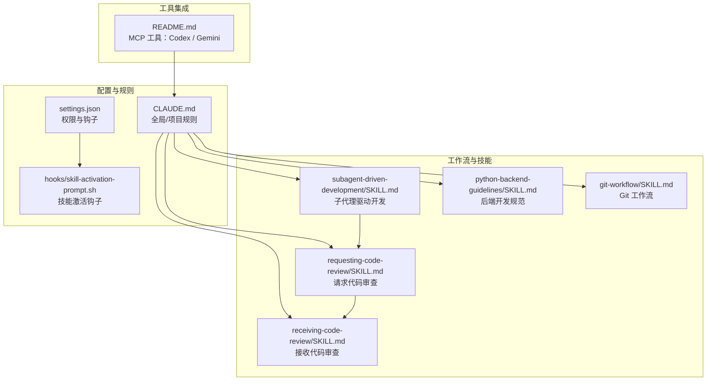
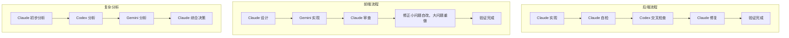
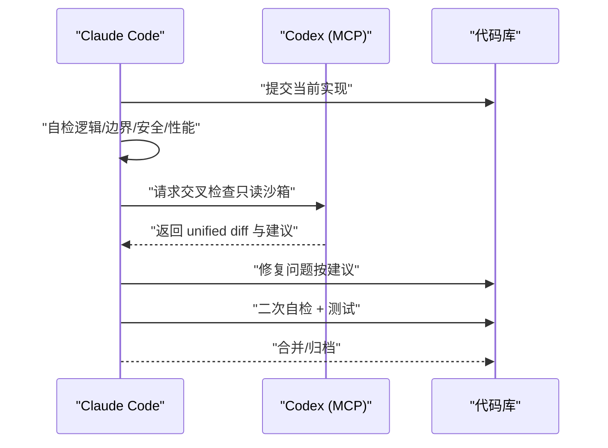
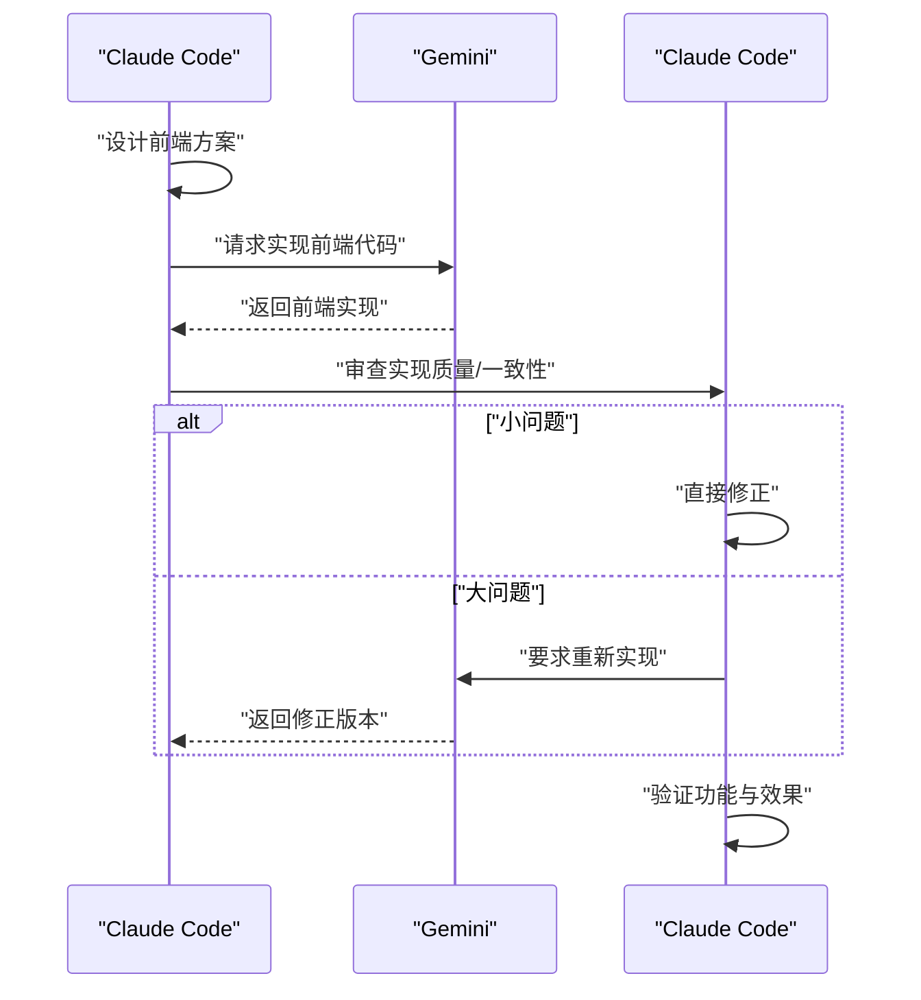
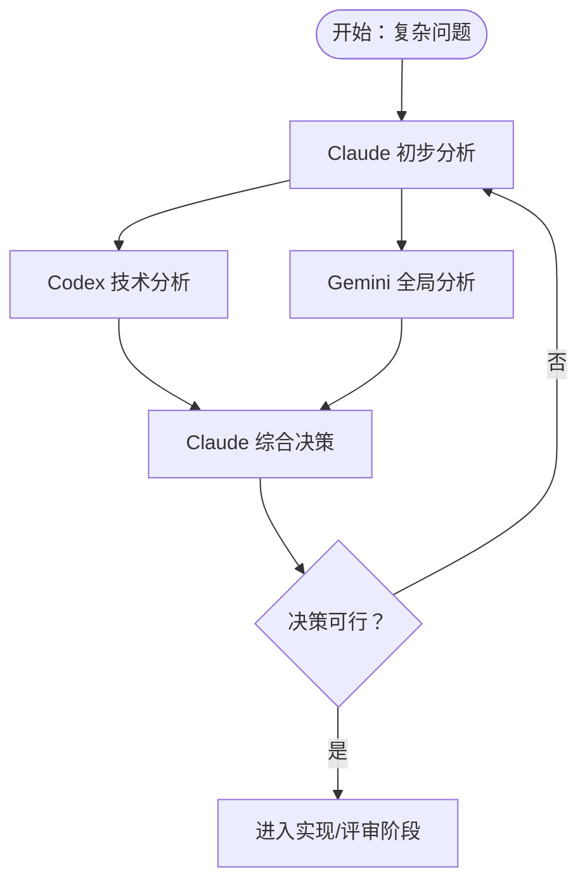
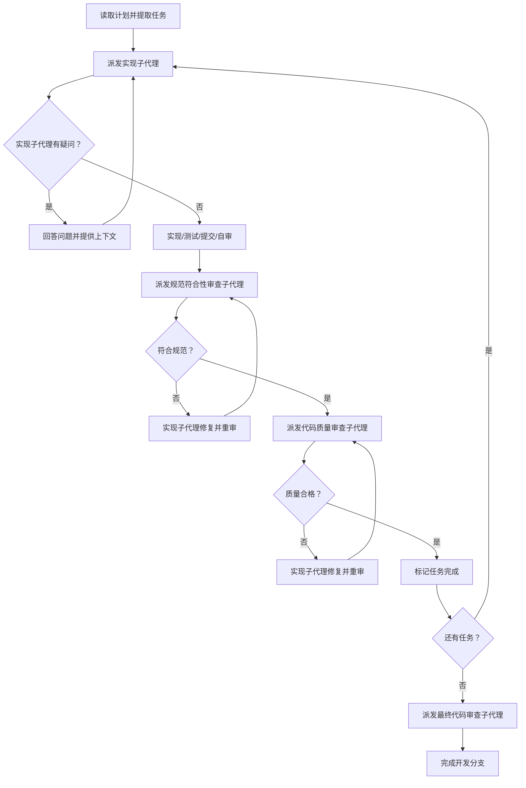
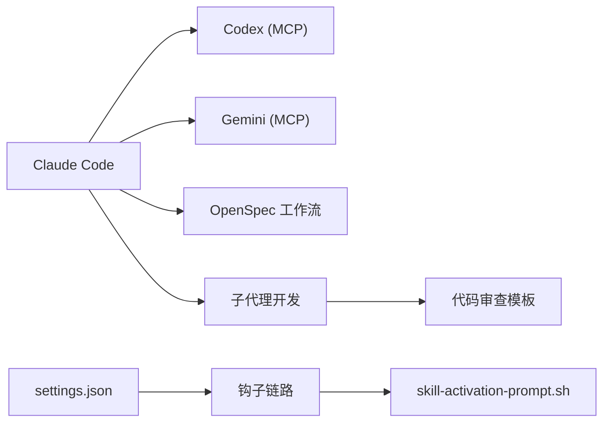

# 交叉检查流程

<cite>
**本文引用的文件**
- [README.md](file://README.md)
- [CLAUDE.md](file://CLAUDE.md)
- [AGENTS.md](file://AGENTS.md)
- [settings.json](file://settings.json)
- [hooks/skill-activation-prompt.sh](file://hooks/skill-activation-prompt.sh)
- [global/codex-skills/receiving-code-review/SKILL.md](file://global/codex-skills/receiving-code-review/SKILL.md)
- [global/codex-skills/requesting-code-review/SKILL.md](file://global/codex-skills/requesting-code-review/SKILL.md)
- [global/codex-skills/requesting-code-review/code-reviewer.md](file://global/codex-skills/requesting-code-review/code-reviewer.md)
- [global/codex-skills/subagent-driven-development/SKILL.md](file://global/codex-skills/subagent-driven-development/SKILL.md)
- [global/codex-skills/subagent-driven-development/implementer-prompt.md](file://global/codex-skills/subagent-driven-development/implementer-prompt.md)
- [global/codex-skills/subagent-driven-development/spec-reviewer-prompt.md](file://global/codex-skills/subagent-driven-development/spec-reviewer-prompt.md)
- [global/codex-skills/subagent-driven-development/code-quality-reviewer-prompt.md](file://global/codex-skills/subagent-driven-development/code-quality-reviewer-prompt.md)
- [skills/python-backend-guidelines/SKILL.md](file://skills/python-backend-guidelines/SKILL.md)
- [skills/git-workflow/SKILL.md](file://skills/git-workflow/SKILL.md)
</cite>

## 目录
1. [简介](#简介)
2. [项目结构](#项目结构)
3. [核心组件](#核心组件)
4. [架构总览](#架构总览)
5. [详细组件分析](#详细组件分析)
6. [依赖关系分析](#依赖关系分析)
7. [性能考量](#性能考量)
8. [故障排查指南](#故障排查指南)
9. [结论](#结论)
10. [附录](#附录)

## 简介
本指南面向“多 AI 协同的交叉检查流程”，围绕以下三条主线展开：
- 后端代码：Claude 实现 → Codex 交叉检查
- 前端代码：Claude 设计 → Gemini 实现 → Claude 审查
- 复杂分析：Claude 初步分析 → Codex 分析 → Gemini 分析 → Claude 综合决策

文档将明确检查策略、检查时机、检查内容（实现符合性、功能完整性、边界条件处理、代码质量评估），并提供执行步骤、责任分工与质量标准，以及问题处理与反馈闭环机制。

## 项目结构
该仓库以“配置模板 + 技能 + 工具集成”为核心，支持：
- 全局与项目级 CLAUDE.md 规则
- Superpowers 插件与 MCP 工具（Codex、Gemini）集成
- OpenSpec 规范驱动开发（SDD）工作流
- 子代理驱动开发（Subagent-Driven Development）与代码审查模板

**图表来源**
- [CLAUDE.md](file://CLAUDE.md#L1-L440)
- [settings.json](file://settings.json#L1-L37)
- [hooks/skill-activation-prompt.sh](file://hooks/skill-activation-prompt.sh#L1-L6)
- [global/codex-skills/subagent-driven-development/SKILL.md](file://global/codex-skills/subagent-driven-development/SKILL.md#L1-L241)
- [global/codex-skills/receiving-code-review/SKILL.md](file://global/codex-skills/receiving-code-review/SKILL.md#L1-L210)
- [global/codex-skills/requesting-code-review/SKILL.md](file://global/codex-skills/requesting-code-review/SKILL.md#L1-L106)
- [skills/python-backend-guidelines/SKILL.md](file://skills/python-backend-guidelines/SKILL.md#L1-L596)
- [skills/git-workflow/SKILL.md](file://skills/git-workflow/SKILL.md#L1-L440)
- [README.md](file://README.md#L123-L139)

**章节来源**
- [README.md](file://README.md#L71-L92)
- [CLAUDE.md](file://CLAUDE.md#L141-L194)

## 核心组件
- 角色与职责
  - Claude Code：主体思考者与最终决策者，主导后端实现与质量把关，负责交叉检查后的修复与验证。
  - Codex（MCP）：后端技术顾问，负责交叉验证、算法与架构审查，提供不同实现思路。
  - Gemini（MCP）：前端开发主力，负责前端实现与大规模文本/代码分析，Claude 审查其输出。

- 工具使用规范
  - Codex：默认只读沙箱返回 unified diff，禁止“危险全权限”，强调“先思考，再验证”。
  - Gemini：视为只读分析师，实现与最终决策由 Claude 完成，前端开发优先使用 Gemini。

- OpenSpec 工作流
  - 三阶段：创建提案 → 实现变更 → 归档完成
  - 与 6 阶段（REQUIREMENT/DESIGN/IMPLEMENTATION/REVIEW/TESTING/DONE）映射

**章节来源**
- [CLAUDE.md](file://CLAUDE.md#L128-L194)
- [CLAUDE.md](file://CLAUDE.md#L359-L391)
- [README.md](file://README.md#L123-L139)

## 架构总览
多 AI 协同的交叉检查流程由“角色分工 + 工具集成 + OpenSpec 工作流 + 子代理开发”构成，贯穿后端、前端与复杂分析三个维度。

**图表来源**
- [CLAUDE.md](file://CLAUDE.md#L150-L186)

## 详细组件分析

### 后端交叉检查流程（Claude 实现 → Codex 交叉检查）
- 检查策略
  - 主实现：Claude Code
  - 交叉检查：Codex
  - 修复者：Claude Code
- 检查时机
  - 完成功能模块后
  - 提交代码前
  - 发现潜在问题时
- 检查内容
  - 实现是否符合设计文档
  - 是否有遗漏的功能点
  - 边界条件处理
  - 代码质量与最佳实践
  - 安全隐患
- 执行步骤
  1) Claude 独立实现后端代码
  2) Claude 自检（逻辑、边界、安全性、性能）
  3) 调用 Codex 进行交叉检查（默认只读沙箱，返回 unified diff）
  4) Claude 基于 Codex 结果修复问题
  5) 运行测试，确认功能正确
- 质量标准
  - 代码遵循后端开发规范（类型提示、Pydantic/序列化、异常处理、Sentry 集成、异步/并发）
  - Git 提交符合约定式提交与分支命名
  - 通过单元/集成测试，覆盖关键路径与边界
- 问题处理与反馈
  - 若 Codex 提出问题，Claude 先验证再修复；若不认同，保留记录并继续推进
  - 修复后再次自检并通过测试

**图表来源**
- [CLAUDE.md](file://CLAUDE.md#L150-L162)
- [CLAUDE.md](file://CLAUDE.md#L361-L378)
- [skills/python-backend-guidelines/SKILL.md](file://skills/python-backend-guidelines/SKILL.md#L28-L37)

**章节来源**
- [CLAUDE.md](file://CLAUDE.md#L197-L217)
- [CLAUDE.md](file://CLAUDE.md#L361-L378)
- [skills/python-backend-guidelines/SKILL.md](file://skills/python-backend-guidelines/SKILL.md#L28-L37)
- [skills/git-workflow/SKILL.md](file://skills/git-workflow/SKILL.md#L75-L121)

### 前端交叉检查流程（Claude 设计 → Gemini 实现 → Claude 审查）
- 检查策略
  - 主实现：Gemini（前端）
  - 交叉检查：Claude Code
  - 修复者：Claude Code / Gemini（按问题级别）
- 检查时机
  - 完成前端模块后
  - 提交代码前
  - 发现潜在问题时
- 检查内容
  - 设计到实现的一致性
  - 代码质量与可维护性
  - 用户体验与交互一致性
  - 与后端接口的对接与兼容
- 执行步骤
  1) Claude 设计前端方案与结构
  2) Gemini 调用实现前端代码
  3) Claude 审查 Gemini 的实现，检查质量
  4) 小问题 Claude 直接修正；大问题 Gemini 重新实现
  5) 测试功能，确认效果
- 质量标准
  - 前端实现符合设计文档
  - 代码整洁、可测试、可维护
  - 与后端接口契约一致
- 问题处理与反馈
  - 对于不清晰或技术上存疑的建议，Claude 先验证再决定是否采纳
  - 与后端联调，确保端到端可用

**图表来源**
- [CLAUDE.md](file://CLAUDE.md#L163-L175)
- [CLAUDE.md](file://CLAUDE.md#L380-L390)

**章节来源**
- [CLAUDE.md](file://CLAUDE.md#L163-L175)
- [CLAUDE.md](file://CLAUDE.md#L380-L390)

### 复杂分析与综合决策流程（Claude 初步分析 → Codex 分析 → Gemini 分析 → Claude 决策）
- 检查策略
  - Claude 先独立理解问题，形成初步思路
  - Codex 从技术实现角度分析，提供见解
  - Gemini 从全局视角分析，发现模式与关联
  - Claude 综合三方观点，做出最终方案
- 检查时机
  - 架构设计阶段
  - 技术选型阶段
  - 复杂问题诊断阶段
  - 重大重构决策阶段
- 检查内容
  - 技术可行性与风险
  - 全局一致性与耦合度
  - 可扩展性与性能影响
  - 安全与合规要求
- 执行步骤
  1) Claude 初步分析（问题域、约束、目标）
  2) Codex 技术分析（算法/架构/实现细节）
  3) Gemini 全局分析（跨模块/跨系统关联）
  4) Claude 综合决策（权衡取舍、风险控制、落地路径）
- 质量标准
  - 方案具备可执行性与可验证性
  - 风险识别与缓解措施明确
  - 与整体架构与规范一致
- 问题处理与反馈
  - 若三方意见分歧，Claude 基于事实与规范做出裁决
  - 将决策依据与变更纳入 OpenSpec 流程

**图表来源**
- [CLAUDE.md](file://CLAUDE.md#L176-L186)

**章节来源**
- [CLAUDE.md](file://CLAUDE.md#L176-L186)

### 子代理驱动开发与代码审查模板
- 子代理驱动开发（Subagent-Driven Development）
  - 每个任务派发“新鲜”的子代理，两阶段审查：规范符合性 → 代码质量
  - 优势：减少上下文污染、自动审查节点、快速迭代
  - 红灯：不得跳过任一审查、不得并行派发实现子代理、必须按顺序执行
- 代码审查模板
  - 请求代码审查：在关键节点（任务完成/特性完成/合并前）请求审查
  - 接收代码审查：先验证再实施，不盲从，必要时理性反驳
  - 审查清单：代码质量、架构、测试、需求、生产就绪度

**图表来源**
- [global/codex-skills/subagent-driven-development/SKILL.md](file://global/codex-skills/subagent-driven-development/SKILL.md#L38-L83)
- [global/codex-skills/subagent-driven-development/implementer-prompt.md](file://global/codex-skills/subagent-driven-development/implementer-prompt.md#L1-L79)
- [global/codex-skills/subagent-driven-development/spec-reviewer-prompt.md](file://global/codex-skills/subagent-driven-development/spec-reviewer-prompt.md#L1-L62)
- [global/codex-skills/subagent-driven-development/code-quality-reviewer-prompt.md](file://global/codex-skills/subagent-driven-development/code-quality-reviewer-prompt.md#L1-L21)

**章节来源**
- [global/codex-skills/subagent-driven-development/SKILL.md](file://global/codex-skills/subagent-driven-development/SKILL.md#L1-L241)
- [global/codex-skills/requesting-code-review/SKILL.md](file://global/codex-skills/requesting-code-review/SKILL.md#L1-L106)
- [global/codex-skills/receiving-code-review/SKILL.md](file://global/codex-skills/receiving-code-review/SKILL.md#L1-L210)
- [global/codex-skills/requesting-code-review/code-reviewer.md](file://global/codex-skills/requesting-code-review/code-reviewer.md#L1-L147)

## 依赖关系分析
- 角色与工具
  - Claude Code 为主导，Codex/Gemini 为辅助验证与扩展
  - 工具通过 MCP 协议注入，遵循只读/最小权限原则
- 工作流与规范
  - OpenSpec 三阶段与 6 阶段映射，贯穿提案、实现、审查、测试、归档
  - 子代理开发与代码审查模板保障质量门禁
- 配置与钩子
  - settings.json 控制编辑权限与钩子链路
  - skill-activation-prompt.sh 在用户提交时激活技能提示

**图表来源**
- [CLAUDE.md](file://CLAUDE.md#L141-L194)
- [README.md](file://README.md#L123-L139)
- [settings.json](file://settings.json#L1-L37)
- [hooks/skill-activation-prompt.sh](file://hooks/skill-activation-prompt.sh#L1-L6)

**章节来源**
- [settings.json](file://settings.json#L1-L37)
- [hooks/skill-activation-prompt.sh](file://hooks/skill-activation-prompt.sh#L1-L6)

## 性能考量
- 交叉检查的性能开销
  - Codex 交叉检查默认只读沙箱，避免全权限带来的额外成本
  - 前端分析由 Gemini 处理，适合长上下文与全局视图
- 子代理开发的效率
  - 每任务新鲜上下文，减少重复与返工
  - 两阶段审查自动拦截早期缺陷，降低后期修复成本
- 工具调用频率
  - 复杂分析阶段适度调用工具，避免过度依赖
  - 简单任务直接完成，不滥用工具

[本节为通用指导，无需特定文件来源]

## 故障排查指南
- 常见问题与对策
  - 工具未响应或权限不足：检查 settings.json 权限与 MCP 工具安装状态
  - 审查反馈不明确：遵循“先验证再实施”原则，要求澄清后再行动
  - 子代理并行冲突：同一会话内按序执行，避免同时派发多个实现子代理
  - 审查循环卡住：确保每次修复后重新审查，直至通过
- 证据与追溯
  - 使用 Git SHA 范围定位变更，便于审查与回溯
  - 审查模板输出包含严重性分级与修复建议，便于跟踪

**章节来源**
- [settings.json](file://settings.json#L1-L37)
- [global/codex-skills/receiving-code-review/SKILL.md](file://global/codex-skills/receiving-code-review/SKILL.md#L14-L25)
- [global/codex-skills/subagent-driven-development/SKILL.md](file://global/codex-skills/subagent-driven-development/SKILL.md#L199-L224)
- [global/codex-skills/requesting-code-review/code-reviewer.md](file://global/codex-skills/requesting-code-review/code-reviewer.md#L30-L62)

## 结论
多 AI 协同的交叉检查流程以“Claude 为主导、Codex/Gemini 为辅助”为核心，结合 OpenSpec 规范与子代理开发，形成“实现 → 交叉检查 → 修复 → 验证”的闭环。通过明确的检查策略、时机与内容，以及严格的工具使用规范与审查模板，能够有效提升后端与前端代码的质量与一致性，并在复杂问题上实现多方视角的综合决策。

[本节为总结，无需特定文件来源]

## 附录
- OpenSpec 阶段与输出物映射
  - 提案阶段：proposal.md、spec deltas
  - 设计阶段：design.md（可选）
  - 实现阶段：源代码
  - 审查阶段：交叉检查完成
  - 测试阶段：测试通过
  - 归档阶段：specs/ 更新、archive/

**章节来源**
- [CLAUDE.md](file://CLAUDE.md#L274-L307)