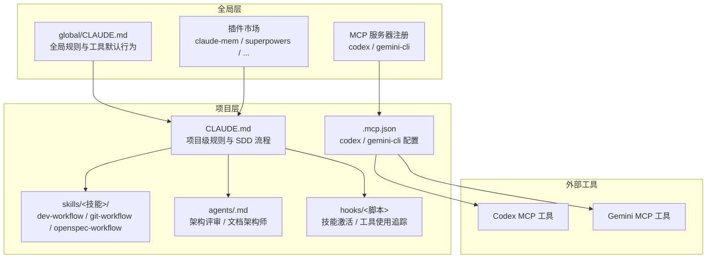
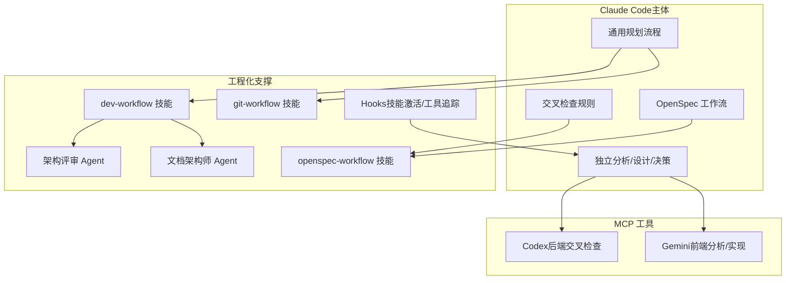
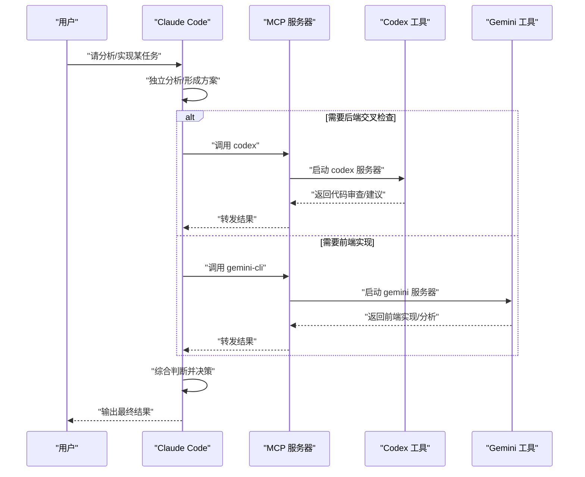
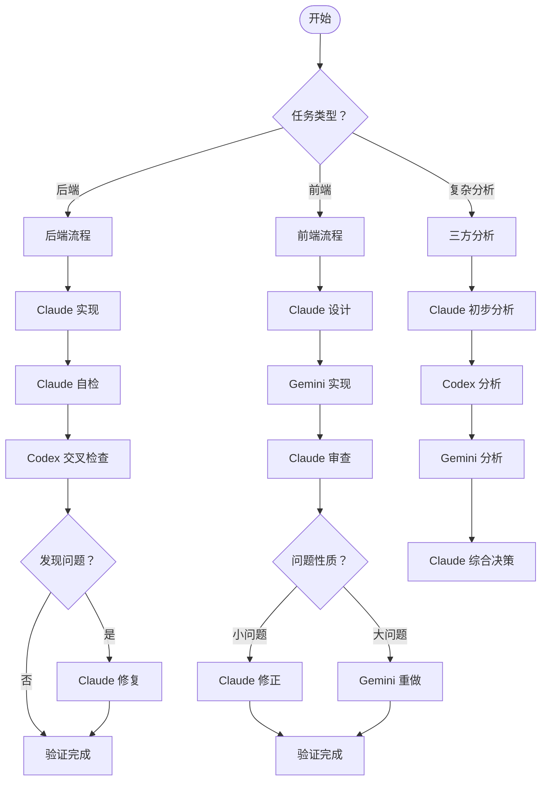
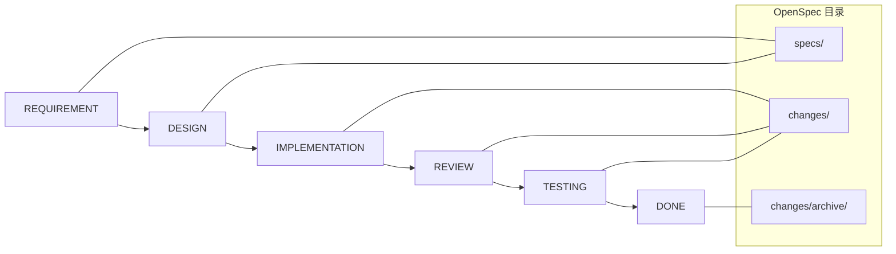
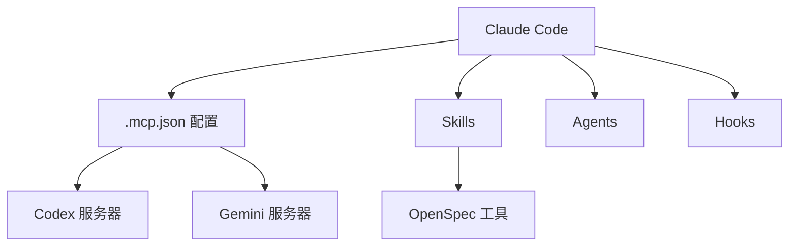

# 多 AI 协同机制

<cite>
**本文引用的文件**   
- [README.md](file://README.md)
- [CLAUDE.md](file://CLAUDE.md)
- [.mcp.json](file://.mcp.json)
- [settings.json](file://settings.json)
- [setup-claude-config.sh](file://setup-claude-config.sh)
- [setup-global.sh](file://setup-global.sh)
- [global/CLAUDE.md](file://global/CLAUDE.md)
- [skills/dev-workflow/SKILL.md](file://skills/dev-workflow/SKILL.md)
- [skills/git-workflow/SKILL.md](file://skills/git-workflow/SKILL.md)
- [skills/openspec-workflow/SKILL.md](file://skills/openspec-workflow/SKILL.md)
- [agents/code-architecture-reviewer.md](file://agents/code-architecture-reviewer.md)
- [agents/documentation-architect.md](file://agents/documentation-architect.md)
</cite>

## 目录
1. [简介](#简介)
2. [项目结构](#项目结构)
3. [核心组件](#核心组件)
4. [架构总览](#架构总览)
5. [详细组件分析](#详细组件分析)
6. [依赖关系分析](#依赖关系分析)
7. [性能考虑](#性能考虑)
8. [故障排除指南](#故障排除指南)
9. [结论](#结论)
10. [附录](#附录)

## 简介
本项目提供一套“多 AI 协同开发机制”的配置与工作流模板，围绕 Claude Code 作为主体思考者与决策者，结合 Codex（后端技术顾问）与 Gemini（前端开发主力）两大 MCP 工具，形成“先独立思考、再交叉验证、最后决策”的协同闭环。系统同时集成 OpenSpec（规范驱动开发）工作流，确保“规范先行、实现在后”，并通过技能（Skills）、Agent、Hooks 与插件体系，实现可复用、可扩展的工程化协作。

## 项目结构
- 全局与项目级配置
  - 全局 CLAUDE.md：定义跨项目的通用规则、记忆系统使用、工具默认行为与多 AI 分工。
  - 项目 CLAUDE.md：定义项目内的 SDD 工作流、交叉检查规则、MCP 使用规范与语言规范。
- MCP 工具配置
  - .mcp.json：声明 codex 与 gemini-cli 两个 MCP 服务器，采用 stdio 传输。
- 设置与钩子
  - settings.json：启用项目级 MCP 服务器、权限控制与钩子（如工具使用后的追踪）。
  - hooks：技能激活提示、工具使用追踪等。
- 技能（Skills）
  - dev-workflow：SDD 开发流程管理（阶段顺序、目录约定、评审与测试报告）。
  - git-workflow：Git 工作流（分支命名、提交规范、合并流程）。
  - openspec-workflow：OpenSpec 工作流（提案创建、应用与归档）。
- Agent 模板
  - code-architecture-reviewer：架构与代码质量评审。
  - documentation-architect：文档架构与系统化文档产出。
- 安装脚本
  - setup-global.sh：全局安装 Claude Code、MCP 工具、插件与同步 Codex/Gemini 配置。
  - setup-claude-config.sh：将模板部署到具体项目，安装技能、Agent、OpenSpec 与 MCP。

**图表来源**
- [global/CLAUDE.md](file://global/CLAUDE.md#L1-L147)
- [CLAUDE.md](file://CLAUDE.md#L1-L440)
- [.mcp.json](file://.mcp.json#L1-L19)
- [setup-global.sh](file://setup-global.sh#L230-L264)
- [setup-claude-config.sh](file://setup-claude-config.sh#L244-L282)

**章节来源**
- [README.md](file://README.md#L71-L92)
- [CLAUDE.md](file://CLAUDE.md#L197-L218)
- [.mcp.json](file://.mcp.json#L1-L19)
- [settings.json](file://settings.json#L1-L37)
- [setup-claude-config.sh](file://setup-claude-config.sh#L60-L86)
- [setup-global.sh](file://setup-global.sh#L130-L166)

## 核心组件
- 主体思考者与决策者：Claude Code
  - 独立分析、设计、决策与最终审批。
  - 作为协调者，决定何时调用 Codex/Gemini，主导前后端分工与交叉检查。
- 后端技术顾问（Codex）
  - 交叉检查后端代码、复杂算法与架构设计。
  - 提供不同实现思路，但最终决策权在 Claude。
- 前端开发主力（Gemini）
  - 大规模文本/代码分析、前端实现与全局模式发现。
  - 实现需经 Claude 审查与验证。
- OpenSpec 工作流
  - 规范先行：提案 → 设计 → 实现 → 审查 → 测试 → 归档。
  - 与 SDD 三阶段统一：提案（REQUIREMENT+DESIGN）→ 实现（IMPLEMENTATION+REVIEW+TESTING）→ 归档（DONE）。
- 技能（Skills）与 Agent
  - 技能：dev-workflow、git-workflow、openspec-workflow 等，规范阶段顺序与目录约定。
  - Agent：架构评审与文档架构师，辅助质量与知识沉淀。
- Hooks 与设置
  - settings.json 控制权限、编辑与钩子触发。
  - hooks 实现技能激活提示与工具使用追踪。

**章节来源**
- [CLAUDE.md](file://CLAUDE.md#L102-L125)
- [CLAUDE.md](file://CLAUDE.md#L128-L147)
- [CLAUDE.md](file://CLAUDE.md#L150-L194)
- [CLAUDE.md](file://CLAUDE.md#L197-L218)
- [skills/dev-workflow/SKILL.md](file://skills/dev-workflow/SKILL.md#L28-L50)
- [skills/git-workflow/SKILL.md](file://skills/git-workflow/SKILL.md#L27-L52)
- [skills/openspec-workflow/SKILL.md](file://skills/openspec-workflow/SKILL.md#L8-L23)
- [agents/code-architecture-reviewer.md](file://agents/code-architecture-reviewer.md#L1-L84)
- [agents/documentation-architect.md](file://agents/documentation-architect.md#L1-L83)
- [settings.json](file://settings.json#L13-L35)

## 架构总览
多 AI 协同以 MCP 协议为纽带，将 Claude Code 与 Codex/Gemini 解耦为工具服务。Claude 作为主体，先独立思考与实现，再通过 MCP 工具进行交叉验证与扩展思路。OpenSpec 作为规范引擎贯穿全流程，确保变更受控与可追溯。

**图表来源**
- [CLAUDE.md](file://CLAUDE.md#L102-L194)
- [CLAUDE.md](file://CLAUDE.md#L197-L218)
- [skills/dev-workflow/SKILL.md](file://skills/dev-workflow/SKILL.md#L28-L50)
- [skills/git-workflow/SKILL.md](file://skills/git-workflow/SKILL.md#L27-L52)
- [skills/openspec-workflow/SKILL.md](file://skills/openspec-workflow/SKILL.md#L8-L23)
- [agents/code-architecture-reviewer.md](file://agents/code-architecture-reviewer.md#L1-L84)
- [agents/documentation-architect.md](file://agents/documentation-architect.md#L1-L83)
- [settings.json](file://settings.json#L13-L35)

## 详细组件分析

### MCP 协议与工具注册
- 工具注册
  - 通过 .mcp.json 声明 codex 与 gemini-cli 两个 MCP 服务器，使用 stdio 传输。
  - 也可通过 claude mcp add 命令手动注册（安装脚本提供两种方式）。
- 通信流程
  - Claude 发起工具调用，MCP 服务器启动对应进程，返回标准化消息。
  - 返回结果由 Claude 统一解析、整合与决策。
- 规范与限制
  - Codex：默认 sandbox=read-only，返回 unified diff，禁止危险访问。
  - Gemini：视为只读分析师，前端实现优先使用 Gemini，最终决策仍由 Claude。

**图表来源**
- [.mcp.json](file://.mcp.json#L1-L19)
- [CLAUDE.md](file://CLAUDE.md#L359-L391)
- [setup-claude-config.sh](file://setup-claude-config.sh#L244-L282)
- [setup-global.sh](file://setup-global.sh#L233-L264)

**章节来源**
- [.mcp.json](file://.mcp.json#L1-L19)
- [CLAUDE.md](file://CLAUDE.md#L359-L391)
- [setup-claude-config.sh](file://setup-claude-config.sh#L244-L282)
- [setup-global.sh](file://setup-global.sh#L233-L264)

### 前后端分工策略与交叉检查
- 后端开发（Claude 主导）
  - Claude 实现 → 自检 → Codex 交叉检查 → 修复 → 验证。
- 前端开发（Gemini 主导）
  - Claude 设计 → Gemini 实现 → Claude 审查 → 修正 → 验证。
- 复杂分析与方案设计
  - Claude 初步分析 → Codex 分析 → Gemini 分析 → Claude 综合决策。
- 交叉检查规则
  - 后端：主实现 Claude，交叉检查 Codex，修复者 Claude。
  - 前端：主实现 Gemini，交叉检查 Claude，修复者 Gemini/Claude。
  - 混合：按类型分，对应检查者与修复者。

**图表来源**
- [CLAUDE.md](file://CLAUDE.md#L150-L194)
- [CLAUDE.md](file://CLAUDE.md#L197-L218)

**章节来源**
- [CLAUDE.md](file://CLAUDE.md#L150-L194)
- [CLAUDE.md](file://CLAUDE.md#L197-L218)

### OpenSpec 集成与 SDD 工作流
- 三阶段工作流
  - Stage 1：创建提案（REQUIREMENT + DESIGN）
  - Stage 2：实现变更（IMPLEMENTATION + REVIEW + TESTING）
  - Stage 3：归档完成（DONE）
- 6 阶段映射
  - REQUIREMENT → IMPLEMENTATION → REVIEW → TESTING → DONE
  - 设计（DESIGN）与规范（specs/）并行推进。
- 技能与 Agent 协作
  - dev-workflow：严格阶段顺序与目录约定。
  - openspec-workflow：提案创建、应用与归档。
  - code-architecture-reviewer：架构与质量评审。
  - documentation-architect：系统化文档产出。

**图表来源**
- [CLAUDE.md](file://CLAUDE.md#L220-L284)
- [skills/dev-workflow/SKILL.md](file://skills/dev-workflow/SKILL.md#L28-L50)
- [skills/openspec-workflow/SKILL.md](file://skills/openspec-workflow/SKILL.md#L138-L157)

**章节来源**
- [CLAUDE.md](file://CLAUDE.md#L220-L284)
- [skills/dev-workflow/SKILL.md](file://skills/dev-workflow/SKILL.md#L28-L50)
- [skills/git-workflow/SKILL.md](file://skills/git-workflow/SKILL.md#L27-L52)
- [skills/openspec-workflow/SKILL.md](file://skills/openspec-workflow/SKILL.md#L8-L23)
- [agents/code-architecture-reviewer.md](file://agents/code-architecture-reviewer.md#L1-L84)
- [agents/documentation-architect.md](file://agents/documentation-architect.md#L1-L83)

### 配置示例与最佳实践
- MCP 工具安装
  - 使用 .mcp.json 模板或 claude mcp add 命令安装 codex 与 gemini-cli。
  - 安装脚本提供交互式选择与自动校验。
- 项目级设置
  - settings.json 启用项目级 MCP 服务器、权限控制与钩子。
  - 钩子：UserPromptSubmit（技能激活提示）、PostToolUse（工具使用追踪）。
- 技能与 Agent
  - dev-workflow：严格遵循阶段顺序与目录约定，确保可追溯性。
  - git-workflow：分支命名、提交规范、预检与合并流程。
  - openspec-workflow：提案创建、验证与归档。
- 团队协作模式
  - 主体思考优先：Claude 先独立分析与决策。
  - 工具辅助验证：Codex/Gemini 提供不同视角，最终由 Claude 判断。
  - 规范驱动：OpenSpec 保证变更受控与可审计。

**章节来源**
- [setup-claude-config.sh](file://setup-claude-config.sh#L244-L282)
- [setup-global.sh](file://setup-global.sh#L233-L264)
- [.mcp.json](file://.mcp.json#L1-L19)
- [settings.json](file://settings.json#L13-L35)
- [skills/dev-workflow/SKILL.md](file://skills/dev-workflow/SKILL.md#L306-L331)
- [skills/git-workflow/SKILL.md](file://skills/git-workflow/SKILL.md#L125-L193)
- [skills/openspec-workflow/SKILL.md](file://skills/openspec-workflow/SKILL.md#L48-L68)

## 依赖关系分析
- 组件耦合
  - Claude 与 MCP 工具松耦合：通过协议与配置解耦，便于替换与扩展。
  - 技能与 Agent 作为可插拔模块，提升复用性与可维护性。
- 外部依赖
  - Claude CLI、Codex CLI、Gemini CLI、Node.js（OpenSpec）。
  - 插件：claude-mem、superpowers、pyright-lsp、pinecone、commit-commands、code-review。
- 潜在循环依赖
  - 未见直接循环依赖；MCP 为单向调用，工具不反向依赖 Claude。
- 接口契约
  - MCP 服务器遵循标准协议，返回结构化消息；Claude 负责解析与决策。

**图表来源**
- [.mcp.json](file://.mcp.json#L1-L19)
- [settings.json](file://settings.json#L13-L35)
- [setup-claude-config.sh](file://setup-claude-config.sh#L60-L86)

**章节来源**
- [.mcp.json](file://.mcp.json#L1-L19)
- [settings.json](file://settings.json#L13-L35)
- [setup-claude-config.sh](file://setup-claude-config.sh#L60-L86)

## 性能考虑
- 工具调用粒度
  - 简单任务直接 Claude 完成，避免不必要的工具调用开销。
  - 复杂分析与大规模文本使用 Gemini；后端交叉检查使用 Codex。
- 缓存与记忆
  - 使用 claude-mem 记忆插件减少重复劳动，提高上下文一致性。
- 并行与批处理
  - 通过 Superpowers 的并行任务分发（dispatching-parallel-agents）提升效率。
- I/O 与网络
  - MCP 服务器本地 stdio 传输降低网络延迟；远程工具需评估带宽与超时。
- 资源配额
  - 合理设置 sandbox 权限与访问范围，避免高风险操作导致失败重试。

## 故障排除指南
- MCP 工具不可用
  - 检查 .mcp.json 配置与 claude mcp list 输出。
  - 确认 codex 与 gemini-cli 已安装并可执行。
  - 使用安装脚本重新注册或手动执行 claude mcp add。
- 权限不足
  - settings.json 中 permissions.allow 需包含编辑与执行权限。
  - PostToolUse 钩子需可执行，确保工具使用追踪正常。
- OpenSpec 初始化失败
  - 确认 Node.js 版本满足要求（>= 20），并全局安装 @fission-ai/openspec。
  - 在项目中执行 openspec init，检查目录结构与模板。
- Git 工作流异常
  - 遵循分支命名与提交规范，使用预检脚本（pre-commit-check）。
  - 合并冲突时按冲突解决步骤清理标记并继续。
- Agent 与技能未生效
  - 确认 .claude/skills 与 .claude/agents 目录结构正确。
  - 检查 SKILL.md 与 Agent 模板语法，确保无语法错误。

**章节来源**
- [setup-claude-config.sh](file://setup-claude-config.sh#L285-L342)
- [setup-global.sh](file://setup-global.sh#L43-L77)
- [settings.json](file://settings.json#L3-L12)
- [skills/git-workflow/SKILL.md](file://skills/git-workflow/SKILL.md#L159-L193)
- [skills/openspec-workflow/SKILL.md](file://skills/openspec-workflow/SKILL.md#L160-L176)

## 结论
本多 AI 协同机制以 Claude Code 为核心，结合 Codex 与 Gemini 的交叉验证与扩展能力，配合 OpenSpec 的规范驱动工作流，形成“先独立思考、再交叉验证、最后决策”的稳健开发范式。通过技能、Agent、Hooks 与 MCP 工具的工程化组织，系统具备良好的可复用性、可扩展性与可维护性。建议在实际项目中严格遵循阶段顺序与交叉检查规则，充分利用记忆与并行能力，持续优化工具调用与资源配额，以获得更高的开发效率与质量保障。

## 附录
- 快速开始
  - 全局配置：运行 setup-global.sh 安装 Claude Code、MCP 工具与插件。
  - 项目配置：运行 setup-claude-config.sh 部署技能、Agent、OpenSpec 与 MCP。
- 常用命令
  - claude mcp list：查看已注册 MCP 工具。
  - openspec list / show / validate / archive：管理 OpenSpec 变更。
  - claude plugin list：查看已安装插件。