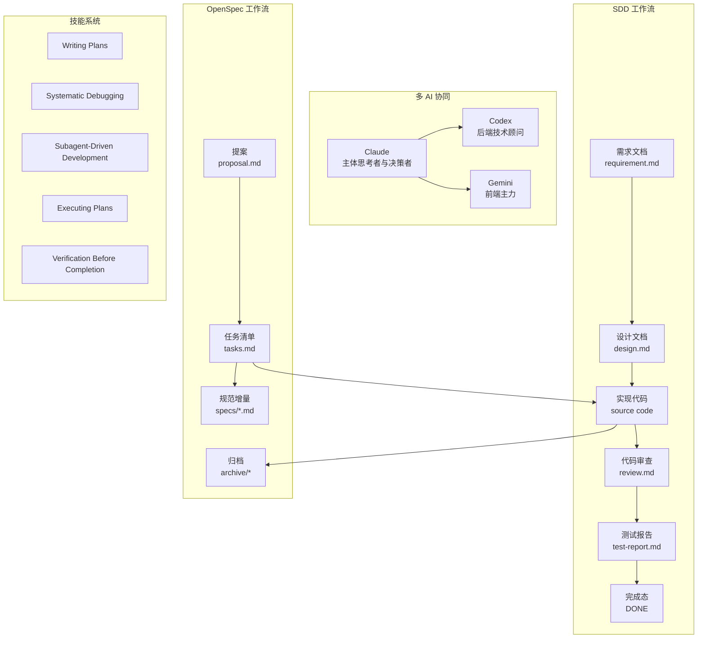
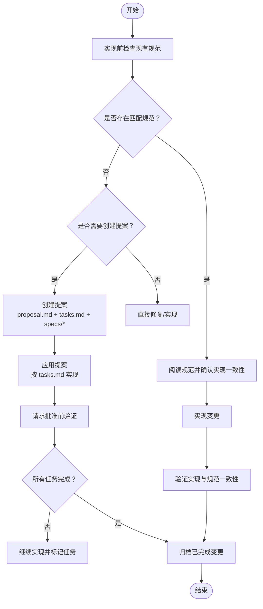
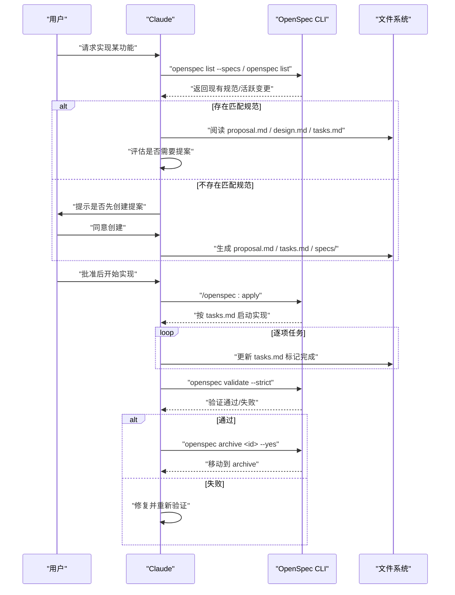
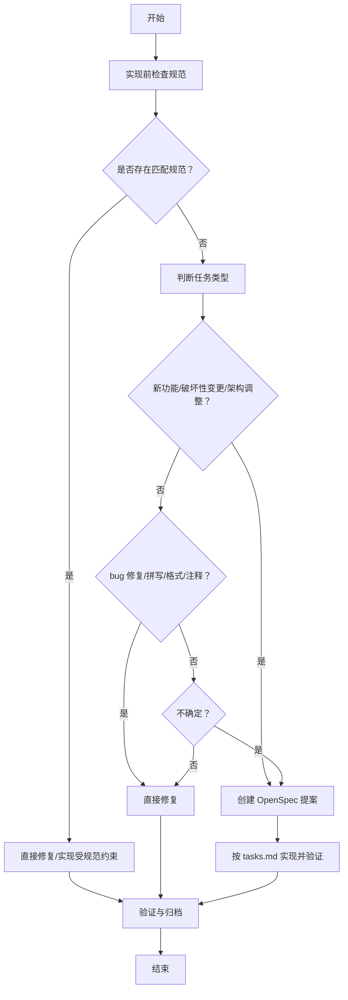
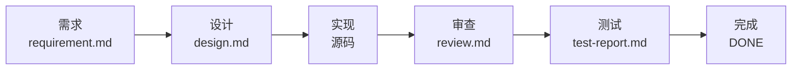
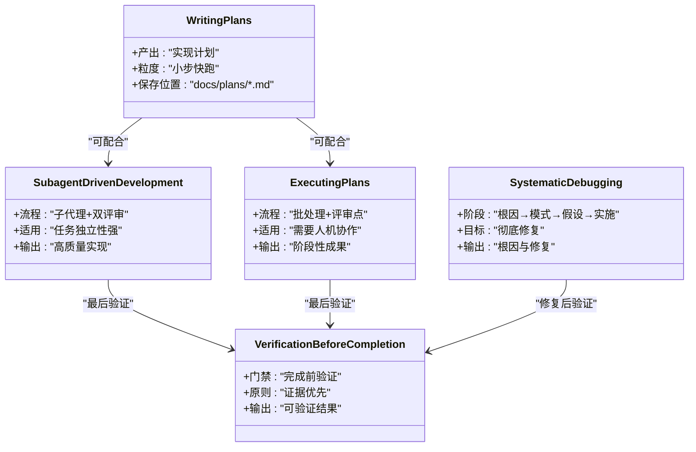
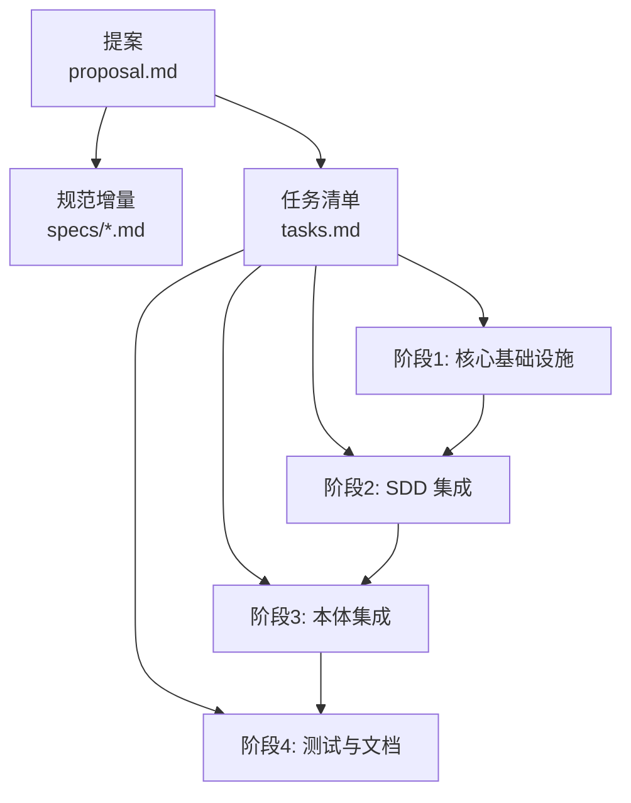
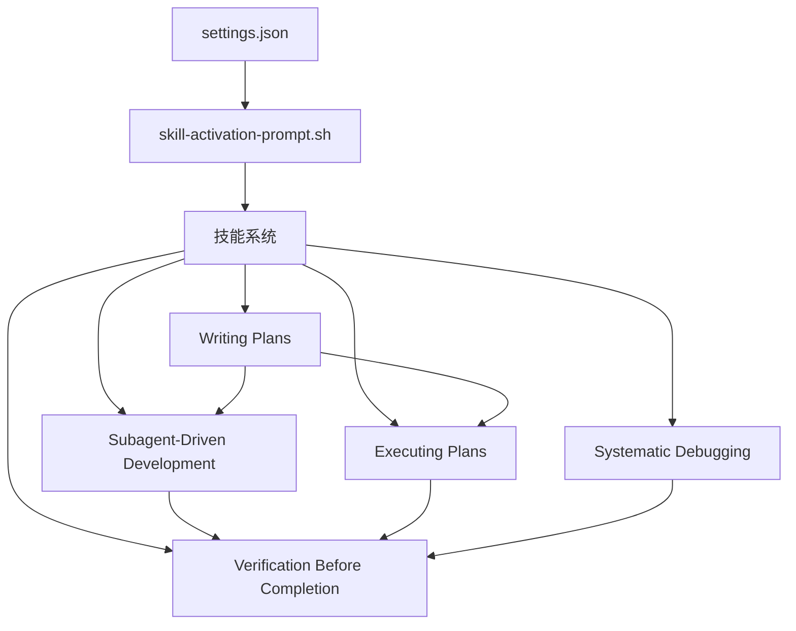

# 工作流程协调

<cite>
**本文引用的文件**
- [README.md](file://README.md)
- [openspec/specs/claudecode-openspec-integration/spec.md](file://openspec/specs/claudecode-openspec-integration/spec.md)
- [skills/openspec-workflow/SKILL.md](file://skills/openspec-workflow/SKILL.md)
- [openspec/project.md](file://openspec/project.md)
- [global/codex-skills/writing-plans/SKILL.md](file://global/codex-skills/writing-plans/SKILL.md)
- [global/codex-skills/systematic-debugging/SKILL.md](file://global/codex-skills/systematic-debugging/SKILL.md)
- [global/codex-skills/subagent-driven-development/SKILL.md](file://global/codex-skills/subagent-driven-development/SKILL.md)
- [global/codex-skills/executing-plans/SKILL.md](file://global/codex-skills/executing-plans/SKILL.md)
- [global/codex-skills/verification-before-completion/SKILL.md](file://global/codex-skills/verification-before-completion/SKILL.md)
- [openspec/changes/add-code-ontology-capability/proposal.md](file://openspec/changes/add-code-ontology-capability/proposal.md)
- [openspec/changes/add-code-ontology-capability/tasks.md](file://openspec/changes/add-code-ontology-capability/tasks.md)
- [skills/dev-workflow/SKILL.md](file://skills/dev-workflow/SKILL.md)
- [settings.json](file://settings.json)
- [hooks/skill-activation-prompt.sh](file://hooks/skill-activation-prompt.sh)
</cite>

## 目录
1. [引言](#引言)
2. [项目结构](#项目结构)
3. [核心组件](#核心组件)
4. [架构总览](#架构总览)
5. [详细组件分析](#详细组件分析)
6. [依赖分析](#依赖分析)
7. [性能考虑](#性能考虑)
8. [故障排查指南](#故障排查指南)
9. [结论](#结论)
10. [附录](#附录)

## 引言
本文件面向多 AI 协同的规范驱动开发（SDD）工作流，系统化阐述三阶段工作流（提案创建 → 变更实现 → 归档完成）与 OpenSpec 方法论的结合方式，并给出 6 阶段 SDD 流程的映射关系与输出物管理策略。文档还详细说明“通用规划流程”（先分析 → 判断复杂度 → 判断类型 → 选择流程 → 最终决策）的执行步骤、智能分流机制、质量控制与进度管理要点，并提供流程图、决策树与执行模板，帮助读者在不同复杂度与类型的任务之间高效、稳健地推进。

## 项目结构
本项目以“多 AI 协同 + SDD 工作流 + 可复用技能 + OpenSpec 规范”为核心组织方式，关键模块如下：
- 多 AI 协同：Claude（主体思考者与决策者），Codex（后端技术顾问），Gemini（前端主力）
- SDD 工作流：REQUIREMENT → DESIGN → IMPLEMENTATION → REVIEW → TESTING → DONE
- OpenSpec 工作流：提案创建 → 变更实现 → 归档完成
- 技能系统：Writing Plans、Systematic Debugging、Subagent-Driven Development、Executing Plans、Verification Before Completion 等
- 配置与钩子：settings.json、skill-activation-prompt.sh

图表来源
- [README.md](file://README.md#L141-L173)
- [skills/dev-workflow/SKILL.md](file://skills/dev-workflow/SKILL.md#L28-L50)
- [skills/openspec-workflow/SKILL.md](file://skills/openspec-workflow/SKILL.md#L70-L157)

章节来源
- [README.md](file://README.md#L71-L92)
- [openspec/project.md](file://openspec/project.md#L32-L35)

## 核心组件
- 多 AI 协同规则与前后端分工
  - 后端开发：Claude 实现 → Claude 自检 → Codex 交叉检查 → Claude 修复 → 验证
  - 前端开发：Claude 设计 → Gemini 实现 → Claude 审查 → Gemini/Claude 修正 → 验证
- OpenSpec 工作流
  - 提案创建：proposal.md、tasks.md、specs/ 增量需求
  - 变更实现：按 tasks.md 逐项完成并标记
  - 归档完成：部署后归档至 archive
- SDD 6 阶段流程
  - REQUIREMENT → DESIGN → IMPLEMENTATION → REVIEW → TESTING → DONE
- 技能与钩子
  - Writing Plans、Systematic Debugging、Subagent-Driven Development、Executing Plans、Verification Before Completion
  - settings.json 与 skill-activation-prompt.sh 驱动自动化激活与追踪

章节来源
- [README.md](file://README.md#L141-L173)
- [skills/openspec-workflow/SKILL.md](file://skills/openspec-workflow/SKILL.md#L1-L231)
- [skills/dev-workflow/SKILL.md](file://skills/dev-workflow/SKILL.md#L1-L397)
- [settings.json](file://settings.json#L1-L37)
- [hooks/skill-activation-prompt.sh](file://hooks/skill-activation-prompt.sh#L1-L6)

## 架构总览
下图展示三阶段工作流与 6 阶段流程的映射关系及关键输出物：

图表来源
- [openspec/specs/claudecode-openspec-integration/spec.md](file://openspec/specs/claudecode-openspec-integration/spec.md#L8-L54)
- [skills/openspec-workflow/SKILL.md](file://skills/openspec-workflow/SKILL.md#L138-L186)
- [skills/dev-workflow/SKILL.md](file://skills/dev-workflow/SKILL.md#L28-L50)

## 详细组件分析

### 组件一：OpenSpec 工作流（提案创建 → 变更实现 → 归档完成）
- 输出物与目录结构
  - proposal.md：变更动机、内容、影响范围
  - tasks.md：任务清单与进度标记
  - specs/：规范增量（新增/修改/删除需求）
  - archive/：归档目录
- 关键流程
  - 实现前检查：先读取现有规范，避免重复劳动与冲突
  - 提案触发：破坏性变更、新能力引入等场景建议创建提案
  - 应用提案：严格按 tasks.md 顺序实现，完成后进行规范一致性验证
  - 归档：部署后将变更移动到 archive

图表来源
- [skills/openspec-workflow/SKILL.md](file://skills/openspec-workflow/SKILL.md#L48-L186)
- [openspec/specs/claudecode-openspec-integration/spec.md](file://openspec/specs/claudecode-openspec-integration/spec.md#L34-L54)

章节来源
- [skills/openspec-workflow/SKILL.md](file://skills/openspec-workflow/SKILL.md#L70-L186)
- [openspec/specs/claudecode-openspec-integration/spec.md](file://openspec/specs/claudecode-openspec-integration/spec.md#L1-L54)

### 组件二：通用规划流程（先分析 → 判断复杂度 → 判断类型 → 选择流程 → 最终决策）
- 分析阶段
  - 识别任务类型（新功能、破坏性变更、架构调整、bug 修复、拼写/格式/注释等）
  - 检查是否存在匹配的 OpenSpec 规范
- 复杂度判断
  - 非平凡实现需遵循“先规范后实现”的原则；简单修复可直接处理
- 类型判断与分流
  - 新功能/破坏性变更/架构调整 → 创建提案
  - bug 修复/拼写/格式/注释 → 直接修复
  - 不确定 → 更安全地创建提案
- 流程选择
  - 采用 Writing Plans 产出可执行计划
  - Subagent-Driven Development 或 Executing Plans 执行
  - Verification Before Completion 保证最终交付质量
- 决策模板
  - “是否已有匹配规范？”
  - “任务是否属于非平凡实现？”
  - “任务类型为何？”
  - “是否需要跨模型交叉验证？”
  - “最终选择：OpenSpec 提案还是直接修复/实现？”

图表来源
- [skills/openspec-workflow/SKILL.md](file://skills/openspec-workflow/SKILL.md#L190-L200)
- [README.md](file://README.md#L174-L184)

章节来源
- [skills/openspec-workflow/SKILL.md](file://skills/openspec-workflow/SKILL.md#L190-L200)
- [README.md](file://README.md#L174-L184)

### 组件三：SDD 6 阶段流程（REQUIREMENT → DESIGN → IMPLEMENTATION → REVIEW → TESTING → DONE）
- 阶段与前置条件
  - REQUIREMENT：产出 requirement.md
  - DESIGN：依赖 requirement.md，产出 design.md
  - IMPLEMENTATION：依赖 requirement.md、design.md，产出源码
  - REVIEW：依赖 requirement.md、design.md、源码，产出 review.md
  - TESTING：依赖以上全部，产出 test-report.md
  - DONE：全部通过后进入完成态
- 输出物管理
  - 所有文档集中于 .devos/tasks/{task-id}/ 下，便于追踪与审计
  - 源码与测试分别位于 devos/ 与 tests/ 目录，遵循目录约定

图表来源
- [skills/dev-workflow/SKILL.md](file://skills/dev-workflow/SKILL.md#L28-L50)
- [skills/dev-workflow/SKILL.md](file://skills/dev-workflow/SKILL.md#L53-L91)

章节来源
- [skills/dev-workflow/SKILL.md](file://skills/dev-workflow/SKILL.md#L28-L91)

### 组件四：技能与执行模板
- Writing Plans：产出可执行计划，任务粒度小、步骤明确、配套测试与提交
- Subagent-Driven Development：每任务派发子代理，两阶段评审（规范合规 → 代码质量），适合独立性强的任务
- Executing Plans：批处理执行，批次间进行架构评审，适合需要人机协作的场景
- Systematic Debugging：根因调查 → 模式分析 → 假设与测试 → 实施，确保修复到位
- Verification Before Completion：完成前验证门禁，禁止“据称通过”类断言

图表来源
- [global/codex-skills/writing-plans/SKILL.md](file://global/codex-skills/writing-plans/SKILL.md#L1-L117)
- [global/codex-skills/subagent-driven-development/SKILL.md](file://global/codex-skills/subagent-driven-development/SKILL.md#L1-L241)
- [global/codex-skills/executing-plans/SKILL.md](file://global/codex-skills/executing-plans/SKILL.md#L1-L77)
- [global/codex-skills/systematic-debugging/SKILL.md](file://global/codex-skills/systematic-debugging/SKILL.md#L1-L297)
- [global/codex-skills/verification-before-completion/SKILL.md](file://global/codex-skills/verification-before-completion/SKILL.md#L1-L140)

章节来源
- [global/codex-skills/writing-plans/SKILL.md](file://global/codex-skills/writing-plans/SKILL.md#L1-L117)
- [global/codex-skills/subagent-driven-development/SKILL.md](file://global/codex-skills/subagent-driven-development/SKILL.md#L1-L241)
- [global/codex-skills/executing-plans/SKILL.md](file://global/codex-skills/executing-plans/SKILL.md#L1-L77)
- [global/codex-skills/systematic-debugging/SKILL.md](file://global/codex-skills/systematic-debugging/SKILL.md#L1-L297)
- [global/codex-skills/verification-before-completion/SKILL.md](file://global/codex-skills/verification-before-completion/SKILL.md#L1-L140)

### 组件五：变更提案与任务清单（示例）
- 变更提案（proposal.md）：描述变更动机、内容与影响范围，链接到相关规范与代码
- 任务清单（tasks.md）：按阶段与任务编号列出可执行条目，支持进度标记与并行化信息
- 示例变更：为 SDD 集成增加代码本体能力，涵盖代码解析器、本体模式、SDD 集成层与本体客户端

图表来源
- [openspec/changes/add-code-ontology-capability/proposal.md](file://openspec/changes/add-code-ontology-capability/proposal.md#L1-L86)
- [openspec/changes/add-code-ontology-capability/tasks.md](file://openspec/changes/add-code-ontology-capability/tasks.md#L1-L107)

章节来源
- [openspec/changes/add-code-ontology-capability/proposal.md](file://openspec/changes/add-code-ontology-capability/proposal.md#L1-L86)
- [openspec/changes/add-code-ontology-capability/tasks.md](file://openspec/changes/add-code-ontology-capability/tasks.md#L1-L107)

## 依赖分析
- 多 AI 协同与 SDD 的耦合
  - Claude 作为主体，负责整体规划与决策；Codex/Gemini 用于交叉验证与实现扩展
  - SDD 的严格阶段顺序与 OpenSpec 的规范优先原则共同约束实现路径
- 技能系统的内聚与解耦
  - Writing Plans 与 Subagent-Driven Development/Executing Plans 解耦，可按任务特性选择
  - Systematic Debugging 与 Verification Before Completion 作为质量门禁，贯穿全流程
- 配置与钩子
  - settings.json 控制权限与钩子触发，skill-activation-prompt.sh 将用户提示转换为技能激活事件

图表来源
- [settings.json](file://settings.json#L13-L35)
- [hooks/skill-activation-prompt.sh](file://hooks/skill-activation-prompt.sh#L1-L6)

章节来源
- [settings.json](file://settings.json#L1-L37)
- [hooks/skill-activation-prompt.sh](file://hooks/skill-activation-prompt.sh#L1-L6)

## 性能考虑
- 任务粒度与并行化
  - Writing Plans 将任务拆分为“小步快跑”，有利于并行执行与快速反馈
  - Subagent-Driven Development 每任务派发子代理，减少上下文污染，提升迭代速度
- 验证前置与回归成本
  - Verification Before Completion 降低后期修复成本，避免“据称通过”导致的返工
- 规范驱动与变更影响分析
  - OpenSpec 的规范增量与任务清单有助于变更影响分析，减少不必要的改动范围

## 故障排查指南
- 常见问题与修复
  - 验证失败：检查规范与实现一致性，必要时回退到 Systematic Debugging 根因调查
  - 任务未完成：核对 tasks.md 标记与阶段性输出物，确保每个任务都有可验证的证据
  - 跨模型协作阻塞：遵循多 AI 协同原则，先由 Claude 决策，再由 Codex/Gemini 交叉验证
- 质量门禁
  - 严禁“据称通过”类断言，必须运行完整验证命令并记录输出
  - 修复失败超过阈值时，停止修复，回到架构层面审视设计

章节来源
- [global/codex-skills/systematic-debugging/SKILL.md](file://global/codex-skills/systematic-debugging/SKILL.md#L215-L232)
- [global/codex-skills/verification-before-completion/SKILL.md](file://global/codex-skills/verification-before-completion/SKILL.md#L52-L62)

## 结论
通过将三阶段 OpenSpec 工作流与 6 阶段 SDD 流程有机融合，并借助多 AI 协同与可复用技能体系，本项目实现了“先规范、后实现、可验证、可归档”的高可靠开发闭环。通用规划流程提供了在不同复杂度与类型任务间的智能分流机制，配合质量门禁与进度管理，确保各环节可控、可追溯、可交付。

## 附录
- OpenSpec 命令速查
  - openspec list / openspec list --specs / openspec show <id> / openspec validate <id> --strict --no-interactive / openspec archive <id> --yes
- 斜杠命令
  - /openspec:proposal、/openspec:apply、/openspec:archive
- 输出物清单
  - OpenSpec：proposal.md、tasks.md、specs/*.md、archive/*
  - SDD：requirement.md、design.md、review.md、test-report.md、源码、DONE

章节来源
- [skills/openspec-workflow/SKILL.md](file://skills/openspec-workflow/SKILL.md#L26-L45)
- [skills/dev-workflow/SKILL.md](file://skills/dev-workflow/SKILL.md#L53-L91)