# 开发者指南

<cite>
**本文引用的文件**
- [README.md](file://README.md)
- [CLAUDE.md](file://CLAUDE.md)
- [AGENTS.md](file://AGENTS.md)
- [settings.json](file://settings.json)
- [setup-claude-config.sh](file://setup-claude-config.sh)
- [setup-global.sh](file://setup-global.sh)
- [skills/skill-developer/SKILL.md](file://skills/skill-developer/SKILL.md)
- [skills/dev-workflow/SKILL.md](file://skills/dev-workflow/SKILL.md)
- [skills/git-workflow/SKILL.md](file://skills/git-workflow/SKILL.md)
- [skills/python-backend-guidelines/SKILL.md](file://skills/python-backend-guidelines/SKILL.md)
- [skills/python-error-tracking/SKILL.md](file://skills/python-error-tracking/SKILL.md)
- [global/codex-skills/writing-skills/SKILL.md](file://global/codex-skills/writing-skills/SKILL.md)
- [agents/README.md](file://agents/README.md)
- [hooks/skill-activation-prompt.sh](file://hooks/skill-activation-prompt.sh)
- [hooks/post-tool-use-tracker.sh](file://hooks/post-tool-use-tracker.sh)
</cite>

## 目录
1. [简介](#简介)
2. [项目结构](#项目结构)
3. [核心组件](#核心组件)
4. [架构总览](#架构总览)
5. [详细组件分析](#详细组件分析)
6. [依赖关系分析](#依赖关系分析)
7. [性能考量](#性能考量)
8. [故障排除指南](#故障排除指南)
9. [结论](#结论)
10. [附录](#附录)

## 简介
本指南面向希望参与并贡献本项目的开发者，系统阐述开发环境搭建、代码规范与最佳实践、系统化调试与测试驱动开发方法论、贡献与提交流程、文档维护、故障排除、性能优化与安全考虑，并提供丰富的实战案例与团队协作经验，帮助快速掌握框架使用与扩展。

## 项目结构
本项目以“多 AI 协同 + 规范驱动开发（SDD）”为核心，提供可复用的 Skills、Agent 模板、插件与 MCP 工具集成，辅以一键部署脚本与全局/项目级配置模板，形成标准化的开发基础设施。

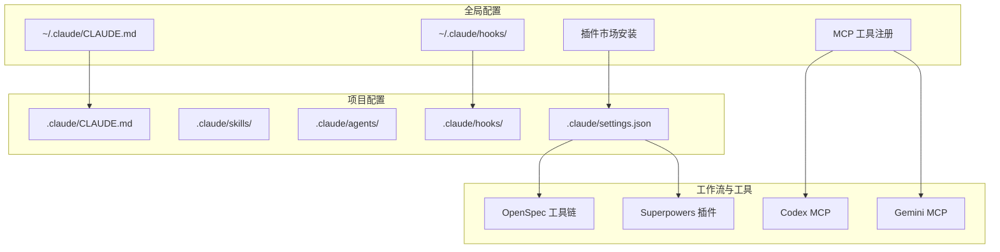

图表来源
- [setup-global.sh](file://setup-global.sh#L1-L471)
- [setup-claude-config.sh](file://setup-claude-config.sh#L1-L372)
- [CLAUDE.md](file://CLAUDE.md#L1-L440)
- [settings.json](file://settings.json#L1-L37)

章节来源
- [README.md](file://README.md#L1-L229)
- [CLAUDE.md](file://CLAUDE.md#L1-L440)
- [settings.json](file://settings.json#L1-L37)

## 核心组件
- 多 AI 协同规则（CLAUDE.md）：定义主体思考者与工具顾问的协作原则、角色分工、前后端开发流程与交叉检查机制。
- Skills 系统：可复用的开发技能模板，支持触发类型、执行级别与钩子机制，遵循 500 行与渐进披露最佳实践。
- Agent 模板：面向复杂任务的智能体，可独立运行并返回综合性报告。
- 插件与 MCP 工具：Claude Code 插件生态与 Codex/Gemini 工具集成，支持代码生成、交叉检查与前端实现。
- OpenSpec 工作流：规范驱动的提案-实现-归档三阶段流程，统一六阶段开发过程。
- 钩子与自动化：UserPromptSubmit 与 PostToolUse 钩子，实现技能提示与编辑跟踪。

章节来源
- [CLAUDE.md](file://CLAUDE.md#L102-L125)
- [skills/skill-developer/SKILL.md](file://skills/skill-developer/SKILL.md#L28-L59)
- [agents/README.md](file://agents/README.md#L1-L301)
- [settings.json](file://settings.json#L13-L35)

## 架构总览
多 AI 协同与 SDD 工作流的交互关系如下：

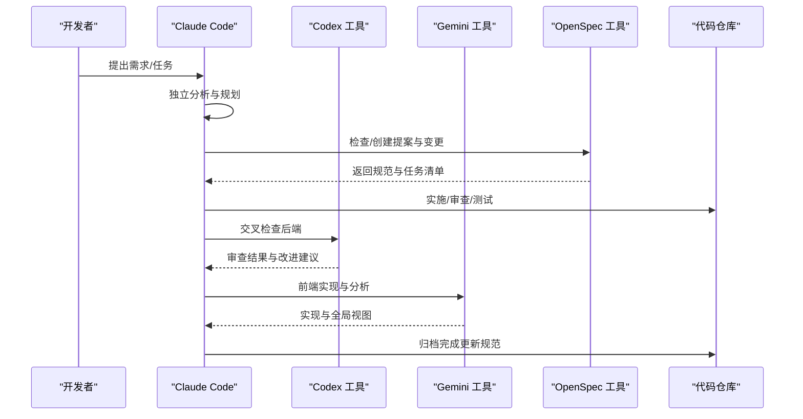

图表来源
- [CLAUDE.md](file://CLAUDE.md#L150-L187)
- [CLAUDE.md](file://CLAUDE.md#L220-L284)
- [setup-claude-config.sh](file://setup-claude-config.sh#L236-L282)

章节来源
- [CLAUDE.md](file://CLAUDE.md#L150-L187)
- [CLAUDE.md](file://CLAUDE.md#L220-L284)

## 详细组件分析

### 开发环境搭建与一键部署
- 全局环境：安装 Claude Code、Codex、Gemini CLI，同步技能与配置，安装插件与 MCP 工具，初始化 OpenSpec。
- 项目级部署：复制 CLAUDE.md、Skills、Agents、Hooks，安装 OpenSpec 与 MCP，校验配置与工具状态。

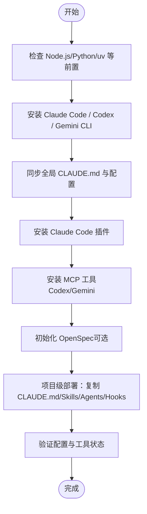

图表来源
- [setup-global.sh](file://setup-global.sh#L43-L127)
- [setup-global.sh](file://setup-global.sh#L233-L264)
- [setup-claude-config.sh](file://setup-claude-config.sh#L187-L233)

章节来源
- [setup-global.sh](file://setup-global.sh#L1-L471)
- [setup-claude-config.sh](file://setup-claude-config.sh#L1-L372)

### 多 AI 协同与角色分工
- Claude Code：主体思考者与决策者，主导后端实现与质量把控，负责审查与最终决策。
- Codex：后端技术顾问，提供交叉检查与算法审查。
- Gemini：前端开发主力，负责前端实现与长文本分析。

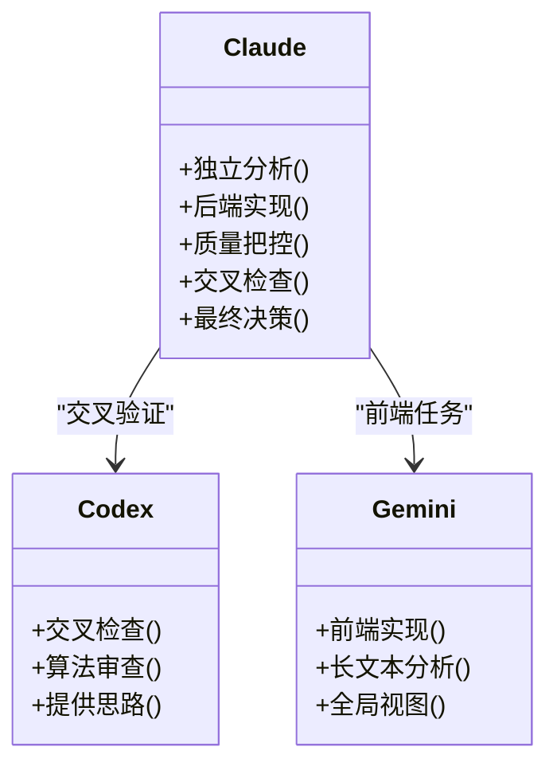

图表来源
- [CLAUDE.md](file://CLAUDE.md#L128-L147)

章节来源
- [CLAUDE.md](file://CLAUDE.md#L128-L147)

### 规范驱动开发（OpenSpec）工作流
- 三阶段：提案（REQUIREMENT + DESIGN）→ 实现（IMPLEMENTATION + REVIEW + TESTING）→ 归档（DONE）。
- 目录结构：openspec/specs、openspec/changes、tests、docs。
- 文档格式：proposal.md、design.md、tasks.md、spec.md（ADDED/MODIFIED/REMOVED）。

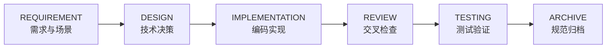

图表来源
- [CLAUDE.md](file://CLAUDE.md#L222-L284)

章节来源
- [CLAUDE.md](file://CLAUDE.md#L220-L307)

### Skills 系统与技能开发
- 两钩子架构：UserPromptSubmit（主动建议）、PostToolUse（错误处理提醒）。
- 配置文件：.claude/skills/skill-rules.json，定义触发条件、执行级别与跳过条件。
- 最佳实践：500 行限制、渐进披露、参考文件、TOC、测试优先。

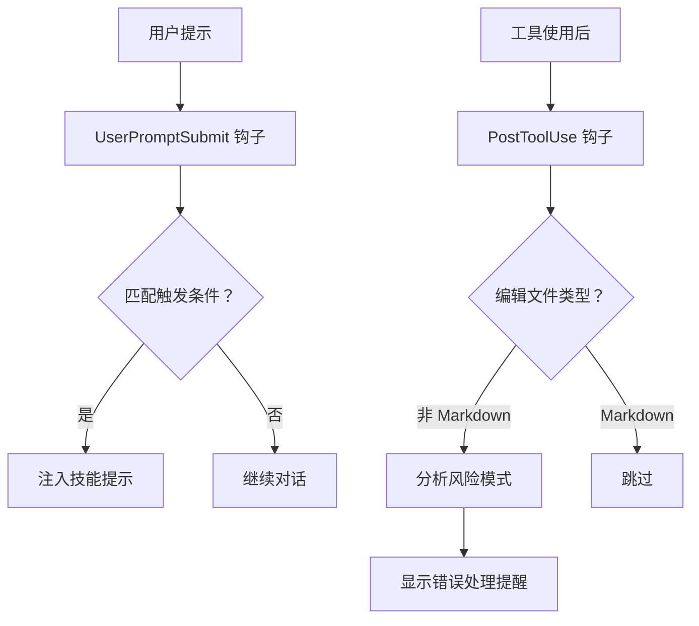

图表来源
- [skills/skill-developer/SKILL.md](file://skills/skill-developer/SKILL.md#L28-L59)
- [hooks/skill-activation-prompt.sh](file://hooks/skill-activation-prompt.sh#L1-L6)
- [hooks/post-tool-use-tracker.sh](file://hooks/post-tool-use-tracker.sh#L1-L178)

章节来源
- [skills/skill-developer/SKILL.md](file://skills/skill-developer/SKILL.md#L1-L427)
- [hooks/skill-activation-prompt.sh](file://hooks/skill-activation-prompt.sh#L1-L6)
- [hooks/post-tool-use-tracker.sh](file://hooks/post-tool-use-tracker.sh#L1-L178)

### Agent 智能体与使用场景
- 类型与用途：架构评审、重构规划、文档架构、前端错误修复、认证路由测试/调试、自动错误修复等。
- 集成方式：复制 .md 文件即可使用；部分需要路径或认证定制。
- 与 Skills 协同：技能提供开发过程指导，Agent 在完成后进行综合审查与产出。

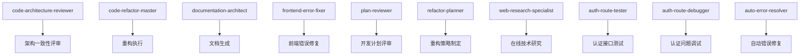

图表来源
- [agents/README.md](file://agents/README.md#L19-L147)

章节来源
- [agents/README.md](file://agents/README.md#L1-L301)

### Git 工作流与分支管理
- 分支命名：feature/bugfix/hotfix/release + 任务 ID + 描述。
- 提交规范：Conventional Commits，包含类型、作用域、主题、正文与页脚。
- 预提交检查：冲突标记、语法检查、测试通过、分支命名校验。
- 合并与 PR：rebase/merge、PR 创建、主干合并、分支清理。

图表来源
- [skills/git-workflow/SKILL.md](file://skills/git-workflow/SKILL.md#L27-L52)
- [skills/git-workflow/SKILL.md](file://skills/git-workflow/SKILL.md#L125-L193)
- [skills/git-workflow/SKILL.md](file://skills/git-workflow/SKILL.md#L196-L254)

章节来源
- [skills/git-workflow/SKILL.md](file://skills/git-workflow/SKILL.md#L1-L440)

### Python 后端开发规范与最佳实践
- 分层架构：路由/URL → 视图/端点 → 服务 → 仓储 → ORM → 数据库。
- FastAPI/Django 模式：Pydantic 验证、依赖注入、异步/并发、错误处理与 Sentry 集成。
- 测试策略：服务层隔离测试、端到端测试、性能监控与缓存优化。
- 安全与合规：密码哈希、JWT、权限控制、GDPR 与 PII 处理。

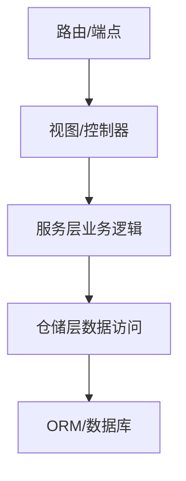

图表来源
- [skills/python-backend-guidelines/SKILL.md](file://skills/python-backend-guidelines/SKILL.md#L40-L61)
- [skills/python-backend-guidelines/SKILL.md](file://skills/python-backend-guidelines/SKILL.md#L118-L151)

章节来源
- [skills/python-backend-guidelines/SKILL.md](file://skills/python-backend-guidelines/SKILL.md#L1-L596)

### Sentry 错误追踪与性能监控
- 初始化：在应用入口最先导入，配置 DSN、环境、采样率与集成。
- 错误捕获：对未预期异常进行捕获与上下文设置，业务异常不重复捕获。
- 性能监控：事务与跨度（Spans）标注关键路径，数据库查询与外部调用自动跟踪。
- 背景任务：Celery/异步任务的事务与错误处理。

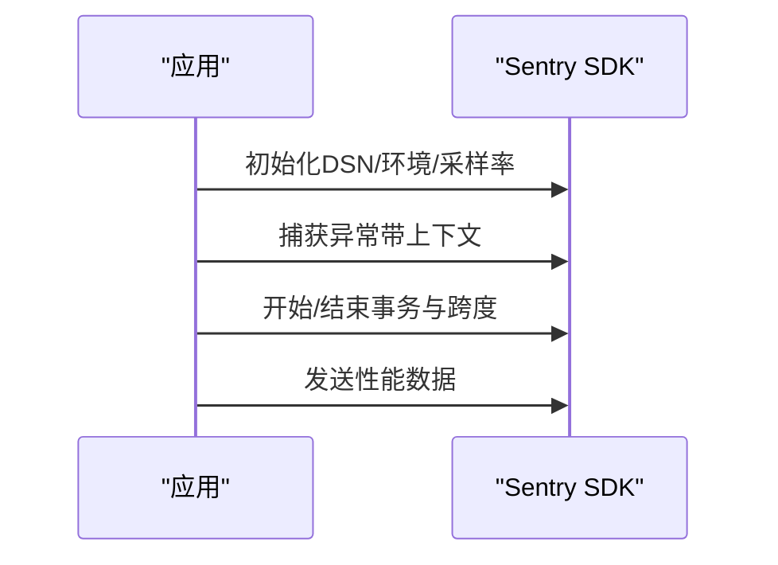

图表来源
- [skills/python-error-tracking/SKILL.md](file://skills/python-error-tracking/SKILL.md#L27-L74)
- [skills/python-error-tracking/SKILL.md](file://skills/python-error-tracking/SKILL.md#L78-L152)
- [skills/python-error-tracking/SKILL.md](file://skills/python-error-tracking/SKILL.md#L203-L248)

章节来源
- [skills/python-error-tracking/SKILL.md](file://skills/python-error-tracking/SKILL.md#L1-L574)

### 系统化调试与测试驱动开发（TDD）
- 系统化调试：深度防御、基于条件的等待、根因追踪、压力测试与污染排查。
- TDD 应用于技能文档：先写压力场景（RED），再写技能（GREEN），反复重构（REFACTOR）。
- 写作技能：技能即 TDD，以“触发条件”而非“流程总结”作为描述，追求检索效率与可执行性。

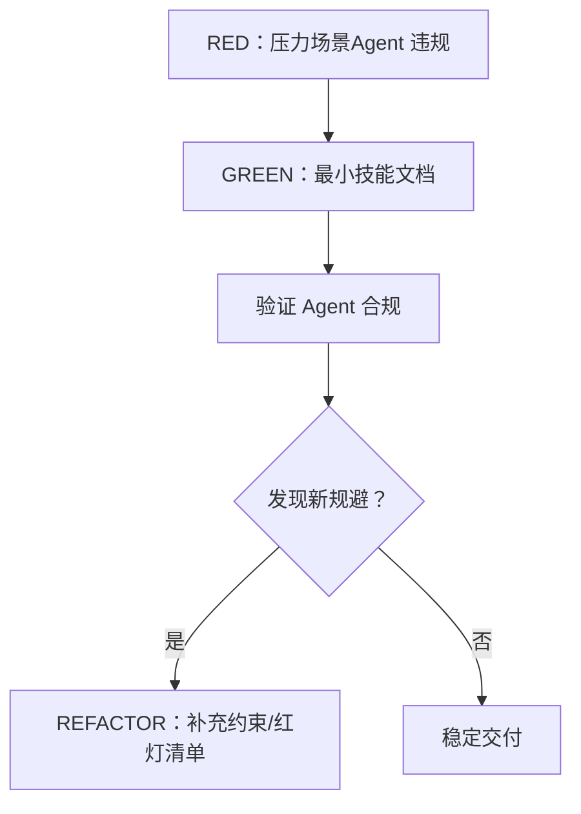

图表来源
- [global/codex-skills/writing-skills/SKILL.md](file://global/codex-skills/writing-skills/SKILL.md#L30-L46)
- [global/codex-skills/writing-skills/SKILL.md](file://global/codex-skills/writing-skills/SKILL.md#L532-L554)

章节来源
- [global/codex-skills/writing-skills/SKILL.md](file://global/codex-skills/writing-skills/SKILL.md#L1-L655)

## 依赖关系分析
- 配置依赖：settings.json 注册钩子与权限；CLAUDE.md 定义协作规则；OpenSpec 与 MCP 工具提供工作流与能力扩展。
- 技能与钩子：skill-rules.json 控制触发与执行级别；UserPromptSubmit 与 PostToolUse 钩子驱动技能提示与错误提醒。
- 工具链：Claude Code 为主控，Codex/Gemini 为顾问，OpenSpec 保证规范一致性，插件与 MCP 提升自动化水平。

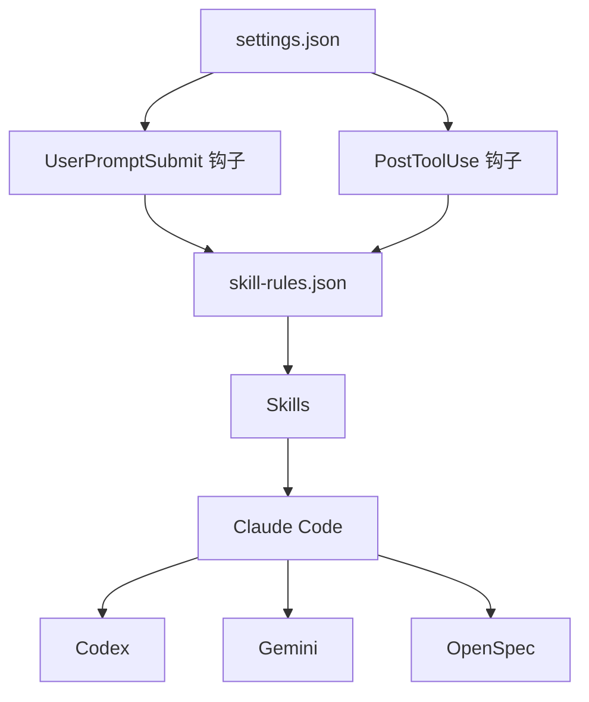

图表来源
- [settings.json](file://settings.json#L13-L35)
- [skills/skill-developer/SKILL.md](file://skills/skill-developer/SKILL.md#L28-L59)

章节来源
- [settings.json](file://settings.json#L1-L37)
- [skills/skill-developer/SKILL.md](file://skills/skill-developer/SKILL.md#L1-L427)

## 性能考量
- 异步与并发：在 I/O 密集场景使用 async/await，避免阻塞；合理使用 gather 并发执行。
- 查询优化：使用延迟加载与批量加载减少 N+1 查询；索引与分页提升读取性能。
- 缓存策略：Redis/本地缓存降低热点数据访问延迟；合理设置过期时间与失效策略。
- 监控与采样：生产环境降低性能监控采样率，避免额外开销；关键路径开启细粒度跨度。
- 构建与类型检查：按仓库检测构建命令与 TypeScript 配置，减少无效编译与校验。

章节来源
- [skills/python-backend-guidelines/SKILL.md](file://skills/python-backend-guidelines/SKILL.md#L502-L534)
- [hooks/post-tool-use-tracker.sh](file://hooks/post-tool-use-tracker.sh#L87-L141)

## 故障排除指南
- 安装与环境
  - Node.js 版本不足：升级至 20+。
  - Python/uv 缺失：安装 Python3 与 uvx。
  - Windows 脚本执行策略：Set-ExecutionPolicy -ExecutionPolicy RemoteSigned -Scope CurrentUser。
- 配置与工具
  - MCP 工具缺失：使用 .mcp.json 或 claude mcp add 手动安装。
  - OpenSpec 未初始化：手动执行 openspec init。
  - 插件/钩子未生效：检查 .claude/settings.json 与 hooks 权限。
- 技能与钩子
  - 技能未触发：核对 skill-rules.json 的关键字/意图/路径/内容模式。
  - PostToolUse 未拦截：确认编辑文件类型与 Markdown 过滤逻辑。
- Git 工作流
  - 分支命名违规：使用 feature/bugfix/hotfix + 任务 ID。
  - 冲突标记：git diff --check 检测并修复。
- Sentry 集成
  - 未捕获异常：确保在应用入口最先初始化，并在异常处捕获。
  - 上下文缺失：在捕获前设置用户、标签与上下文。

章节来源
- [setup-global.sh](file://setup-global.sh#L46-L76)
- [setup-claude-config.sh](file://setup-claude-config.sh#L236-L282)
- [skills/skill-developer/SKILL.md](file://skills/skill-developer/SKILL.md#L268-L290)
- [hooks/post-tool-use-tracker.sh](file://hooks/post-tool-use-tracker.sh#L18-L26)
- [skills/git-workflow/SKILL.md](file://skills/git-workflow/SKILL.md#L159-L193)
- [skills/python-error-tracking/SKILL.md](file://skills/python-error-tracking/SKILL.md#L508-L543)

## 结论
本指南将多 AI 协同、SDD 工作流、Skills/Agent 生态与工程实践有机结合，提供从环境搭建到贡献协作的完整路径。建议团队在日常开发中坚持：规范先行、交叉检查、系统化调试、TDD 驱动与持续改进，以实现高质量、高效率的协同开发。

## 附录
- 快速开始
  - 全局配置：运行 setup-global.sh 安装 CLI、插件与 MCP。
  - 项目部署：运行 setup-claude-config.sh 复制模板并安装所需组件。
- 贡献流程
  - 新增/修改 Skills：遵循 500 行与渐进披露，先写压力场景再写技能，持续重构。
  - Agent 集成：复制 .md 文件，必要时更新路径与认证配置。
  - OpenSpec 变更：按提案-实现-归档流程推进，确保规范与实现一致。
- 团队协作
  - 明确角色与职责：Claude 主导、Codex/Gemini 辅助。
  - 统一规范：CLAUDE.md 与 skill-rules.json 保持一致。
  - 知识传承：通过 Skills 与 Agent 文档沉淀经验，定期回顾与优化。

章节来源
- [README.md](file://README.md#L12-L70)
- [setup-claude-config.sh](file://setup-claude-config.sh#L353-L371)
- [global/codex-skills/writing-skills/SKILL.md](file://global/codex-skills/writing-skills/SKILL.md#L532-L554)
- [agents/README.md](file://agents/README.md#L149-L168)