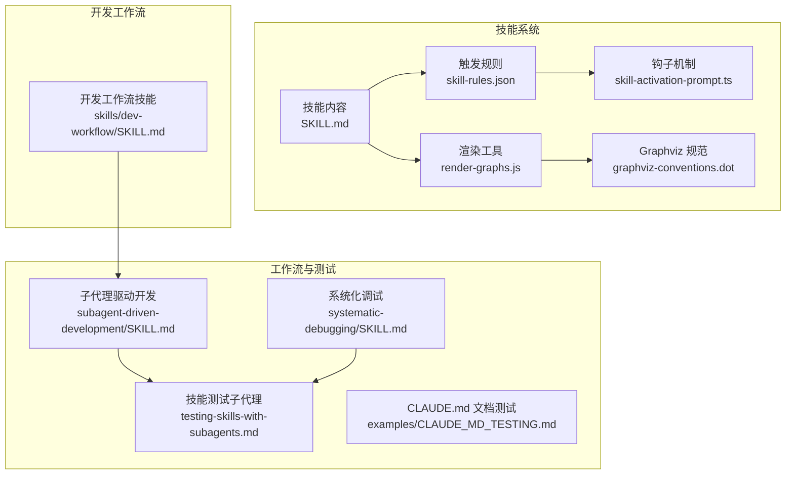
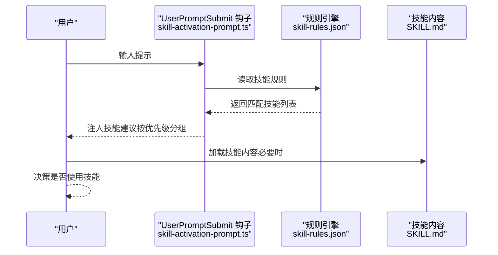
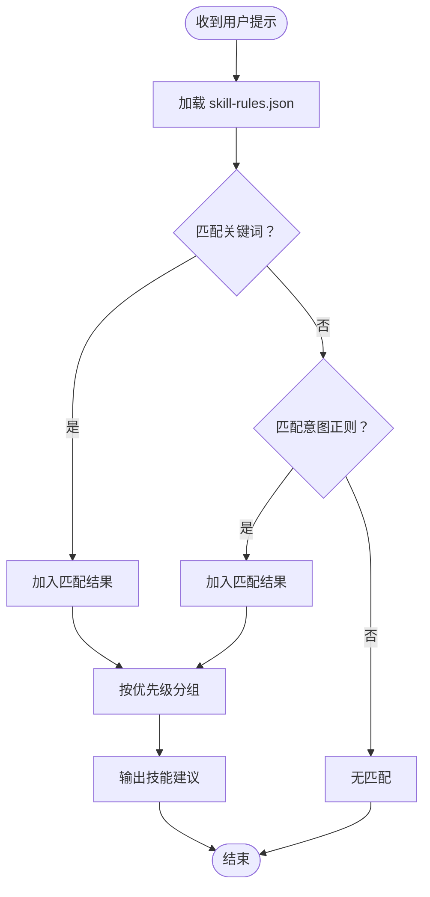
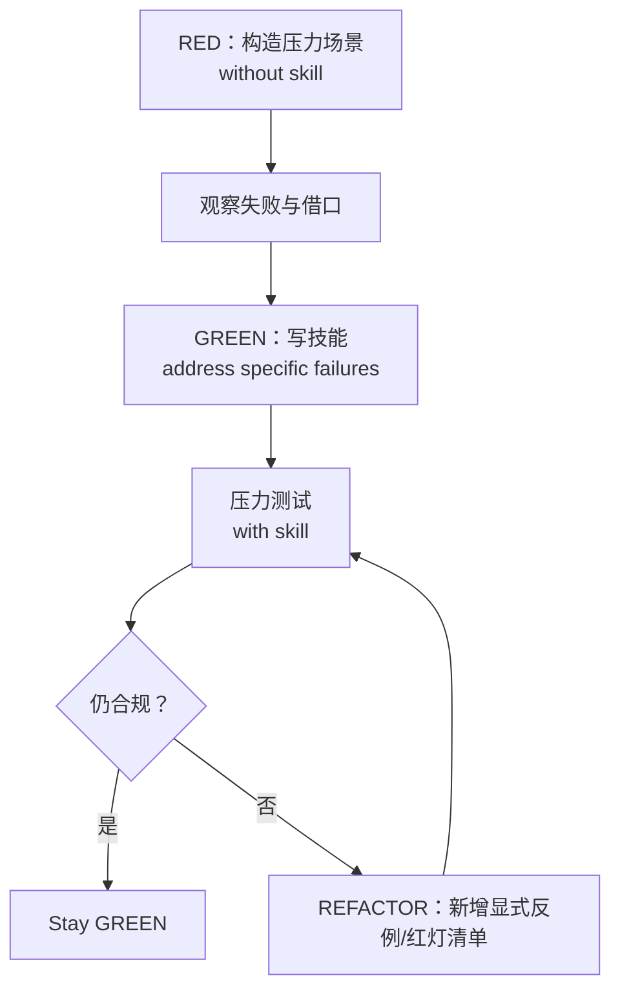
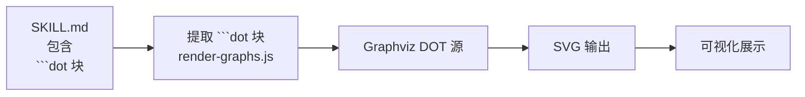
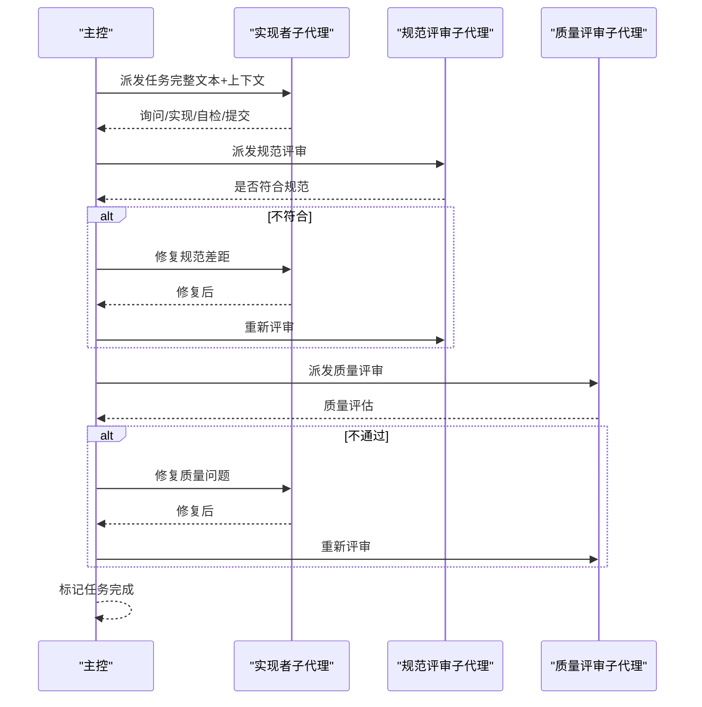
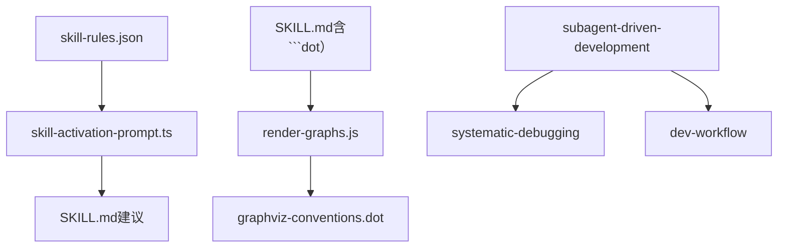

# 技能开发

<cite>
**本文引用的文件**
- [README.md](file://README.md)
- [SKILL.md](file://skills/skill-developer/SKILL.md)
- [TRIGGER_TYPES.md](file://skills/skill-developer/TRIGGER_TYPES.md)
- [skill-activation-prompt.ts](file://hooks/skill-activation-prompt.ts)
- [skill-activation-prompt.sh](file://hooks/skill-activation-prompt.sh)
- [skill-rules.json](file://skills/skill-rules.json)
- [SKILL.md](file://global/codex-skills/writing-skills/SKILL.md)
- [persuasion-principles.md](file://global/codex-skills/writing-skills/persuasion-principles.md)
- [graphviz-conventions.dot](file://global/codex-skills/writing-skills/graphviz-conventions.dot)
- [render-graphs.js](file://global/codex-skills/writing-skills/render-graphs.js)
- [testing-skills-with-subagents.md](file://global/codex-skills/writing-skills/testing-skills-with-subagents.md)
- [CLAUDE_MD_TESTING.md](file://global/codex-skills/writing-skills/examples/CLAUDE_MD_TESTING.md)
- [SKILL.md](file://global/codex-skills/subagent-driven-development/SKILL.md)
- [SKILL.md](file://global/codex-skills/systematic-debugging/SKILL.md)
- [SKILL.md](file://skills/dev-workflow/SKILL.md)
</cite>

## 目录
1. [简介](#简介)
2. [项目结构](#项目结构)
3. [核心组件](#核心组件)
4. [架构总览](#架构总览)
5. [详细组件分析](#详细组件分析)
6. [依赖分析](#依赖分析)
7. [性能考量](#性能考量)
8. [故障排查指南](#故障排查指南)
9. [结论](#结论)
10. [附录](#附录)

## 简介
本文件面向“技能开发”的完整生命周期，围绕 Claude Code 的技能系统，系统讲解如何设计与实现高质量 AI 技能，覆盖以下主题：
- 写作技能的最佳实践与说服原则
- 技能模板的设计模式、触发机制与执行流程
- 使用 Graphviz 绘制技能关系图与可视化流程
- 通过子代理实现复杂技能与压力测试
- 技能生命周期管理、版本控制与性能优化
- 具体开发示例与测试方法（含 Markdown 测试技巧）

## 项目结构
该仓库采用“多 AI 协同 + 规范驱动开发（SDD）”的工程组织方式，技能系统由“技能内容 + 触发规则 + 钩子机制 + 可视化工具 + 子代理工作流”构成。



图表来源
- [SKILL.md](file://skills/skill-developer/SKILL.md#L1-L427)
- [skill-rules.json](file://skills/skill-rules.json#L1-L250)
- [skill-activation-prompt.ts](file://hooks/skill-activation-prompt.ts#L1-L133)
- [render-graphs.js](file://global/codex-skills/writing-skills/render-graphs.js#L1-L169)
- [graphviz-conventions.dot](file://global/codex-skills/writing-skills/graphviz-conventions.dot#L1-L172)
- [SKILL.md](file://global/codex-skills/subagent-driven-development/SKILL.md#L1-L241)
- [SKILL.md](file://global/codex-skills/systematic-debugging/SKILL.md#L1-L297)
- [SKILL.md](file://skills/dev-workflow/SKILL.md#L1-L397)

章节来源
- [README.md](file://README.md#L1-L229)

## 核心组件
- 技能内容（SKILL.md）：遵循 YAML frontmatter、触发关键词、意图模式、文件路径与内容模式等触发类型；强调“渐进披露”与“500 行规则”。
- 触发规则（skill-rules.json）：集中定义技能类型、强制级别、优先级、触发器与跳过条件。
- 钩子机制（skill-activation-prompt.ts）：在用户提示前进行技能建议，支持关键字与意图正则匹配。
- 可视化工具（render-graphs.js + graphviz-conventions.dot）：从 SKILL.md 中提取 ```dot 块，渲染为 SVG，辅助流程图可视化。
- 子代理工作流（subagent-driven-development）：以“每任务一个子代理 + 两阶段评审”实现高质量迭代。
- 系统化调试（systematic-debugging）：四阶段根因调查与最小化验证，避免症状性修复。
- 开发工作流（dev-workflow）：严格阶段顺序与目录约定，确保文档与代码齐备。

章节来源
- [SKILL.md](file://skills/skill-developer/SKILL.md#L1-L427)
- [TRIGGER_TYPES.md](file://skills/skill-developer/TRIGGER_TYPES.md#L1-L306)
- [skill-rules.json](file://skills/skill-rules.json#L1-L250)
- [skill-activation-prompt.ts](file://hooks/skill-activation-prompt.ts#L1-L133)
- [render-graphs.js](file://global/codex-skills/writing-skills/render-graphs.js#L1-L169)
- [graphviz-conventions.dot](file://global/codex-skills/writing-skills/graphviz-conventions.dot#L1-L172)
- [SKILL.md](file://global/codex-skills/subagent-driven-development/SKILL.md#L1-L241)
- [SKILL.md](file://global/codex-skills/systematic-debugging/SKILL.md#L1-L297)
- [SKILL.md](file://skills/dev-workflow/SKILL.md#L1-L397)

## 架构总览
技能系统的核心是“规则驱动 + 钩子触发 + 可视化表达 + 子代理执行”的闭环：



图表来源
- [skill-activation-prompt.ts](file://hooks/skill-activation-prompt.ts#L36-L127)
- [skill-rules.json](file://skills/skill-rules.json#L1-L250)
- [SKILL.md](file://skills/skill-developer/SKILL.md#L28-L58)

## 详细组件分析

### 组件一：技能模板与触发机制
- 设计模式
  - 渐进披露：SKILL.md 控制在 500 行以内，细节放入参考文件。
  - YAML frontmatter：name 与 description，描述“何时使用”，而非“做什么”。
  - 触发类型：关键词、意图模式（正则）、文件路径（glob）、内容模式（正则）。
- 执行流程
  - 用户提示进入 UserPromptSubmit 钩子，加载 skill-rules.json，匹配关键字或意图正则，按优先级输出建议。
- 最佳实践
  - 关键词要具体且包含常见变体；意图正则使用非贪婪匹配；文件路径尽量窄化；内容模式注意转义与大小写。



图表来源
- [skill-activation-prompt.ts](file://hooks/skill-activation-prompt.ts#L57-L120)
- [TRIGGER_TYPES.md](file://skills/skill-developer/TRIGGER_TYPES.md#L15-L107)

章节来源
- [SKILL.md](file://skills/skill-developer/SKILL.md#L109-L191)
- [TRIGGER_TYPES.md](file://skills/skill-developer/TRIGGER_TYPES.md#L1-L306)
- [skill-rules.json](file://skills/skill-rules.json#L1-L250)

### 组件二：写作技能与说服原则
- 写作技能即“对过程文档的 TDD”。先用子代理构造压力场景（RED），观察失败与借口，再写技能（GREEN），最后反复重构（REFACTOR）。
- 说服原则（权威、承诺、稀缺、从众、团结）提升合规率，尤其适用于纪律约束型技能。
- CSO（Claude 搜索优化）：描述字段只写“何时使用”，不总结流程；关键词覆盖错误信息、症状、工具名；命名用动名词（-ing）。



图表来源
- [SKILL.md](file://global/codex-skills/writing-skills/SKILL.md#L30-L46)
- [testing-skills-with-subagents.md](file://global/codex-skills/writing-skills/testing-skills-with-subagents.md#L30-L41)
- [persuasion-principles.md](file://global/codex-skills/writing-skills/persuasion-principles.md#L9-L134)

章节来源
- [SKILL.md](file://global/codex-skills/writing-skills/SKILL.md#L139-L276)
- [persuasion-principles.md](file://global/codex-skills/writing-skills/persuasion-principles.md#L1-L188)
- [testing-skills-with-subagents.md](file://global/codex-skills/writing-skills/testing-skills-with-subagents.md#L1-L385)
- [CLAUDE_MD_TESTING.md](file://global/codex-skills/writing-skills/examples/CLAUDE_MD_TESTING.md#L1-L190)

### 组件三：Graphviz 可视化与技能关系图
- 在 SKILL.md 中使用 ```dot 块定义流程图，graphviz-conventions.dot 提供形状、标签与结构规范。
- render-graphs.js 提取 ```dot 块并渲染为 SVG，支持单独渲染与合并渲染，便于人类伙伴理解流程。



图表来源
- [render-graphs.js](file://global/codex-skills/writing-skills/render-graphs.js#L20-L82)
- [graphviz-conventions.dot](file://global/codex-skills/writing-skills/graphviz-conventions.dot#L1-L172)

章节来源
- [render-graphs.js](file://global/codex-skills/writing-skills/render-graphs.js#L1-L169)
- [graphviz-conventions.dot](file://global/codex-skills/writing-skills/graphviz-conventions.dot#L1-L172)

### 组件四：子代理实现复杂技能
- 子代理驱动开发：每任务派发“实现者”子代理，完成后依次派发“规范符合性评审”和“代码质量评审”，两阶段闭环。
- 与系统化调试结合：在评审中发现的问题，实现者自修复并通过二次评审，形成“问题-修复-复审”的循环。
- 与开发工作流衔接：在相同会话内执行，避免上下文切换，控制器一次性提供完整上下文，减少重复读取。



图表来源
- [SKILL.md](file://global/codex-skills/subagent-driven-development/SKILL.md#L40-L82)
- [SKILL.md](file://global/codex-skills/systematic-debugging/SKILL.md#L16-L22)

章节来源
- [SKILL.md](file://global/codex-skills/subagent-driven-development/SKILL.md#L1-L241)
- [SKILL.md](file://global/codex-skills/systematic-debugging/SKILL.md#L1-L297)

### 组件五：开发工作流与阶段校验
- 严格阶段顺序：需求 → 设计 → 实施 → 评审 → 测试 → 完成。
- 目录约定：任务文档位于 .devos/tasks/{task-id}/，源码位于 devos/ 下对应模块。
- 阶段前置条件与报告模板：每个阶段都有明确的前置文档与输出物，便于自动化校验与进度跟踪。

章节来源
- [SKILL.md](file://skills/dev-workflow/SKILL.md#L28-L331)

## 依赖分析
- 规则到钩子：skill-rules.json 为 skill-activation-prompt.ts 的输入，决定哪些技能被建议。
- 钩子到技能：UserPromptSubmit 钩子仅建议技能，不阻塞；若需强制，应使用 Guardrail 技能（PreToolUse）。
- 可视化到内容：render-graphs.js 依赖 SKILL.md 中的 ```dot 块与 graphviz-conventions.dot 的样式规范。
- 子代理到测试：子代理驱动开发与系统化调试共同保证质量门禁与闭环修复。



图表来源
- [skill-rules.json](file://skills/skill-rules.json#L1-L250)
- [skill-activation-prompt.ts](file://hooks/skill-activation-prompt.ts#L1-L133)
- [render-graphs.js](file://global/codex-skills/writing-skills/render-graphs.js#L1-L169)
- [graphviz-conventions.dot](file://global/codex-skills/writing-skills/graphviz-conventions.dot#L1-L172)
- [SKILL.md](file://global/codex-skills/subagent-driven-development/SKILL.md#L1-L241)
- [SKILL.md](file://global/codex-skills/systematic-debugging/SKILL.md#L1-L297)
- [SKILL.md](file://skills/dev-workflow/SKILL.md#L1-L397)

## 性能考量
- 钩子性能：UserPromptSubmit 钩子在内存中解析 JSON、遍历规则并进行正则匹配，应避免过于宽泛的意图正则与过多技能匹配，以控制响应时间。
- 规则规模：当技能数量增长时，建议按领域拆分规则文件或引入缓存策略，减少每次启动的扫描成本。
- 可视化成本：render-graphs.js 依赖系统 graphviz（dot），在 CI 中建议预装依赖并限制渲染数量，避免构建超时。
- 子代理调用：子代理驱动开发会增加调用次数，但能显著降低后期返工成本；可通过批量任务与并行安全控制平衡效率。

## 故障排查指南
- 技能未触发（UserPromptSubmit）
  - 检查 skill-rules.json 中的 keywords 与 intentPatterns 是否与用户提示匹配。
  - 使用手动测试命令验证钩子逻辑。
- PreToolUse 未阻塞
  - 确认技能类型为 guardrail 且 enforcement 为 block；检查环境变量是否禁用了守卫。
- 过多误报/漏报
  - 优化意图正则（非贪婪匹配、边界控制）；缩小文件路径模式；为测试文件添加排除。
- 可视化失败
  - 确认系统已安装 graphviz（dot），并检查 SKILL.md 中 ```dot 块语法与命名。
- 子代理流程异常
  - 检查任务上下文是否完整传递；两阶段评审顺序是否正确；修复后是否进行复审。

章节来源
- [SKILL.md](file://skills/skill-developer/SKILL.md#L322-L402)
- [TRIGGER_TYPES.md](file://skills/skill-developer/TRIGGER_TYPES.md#L281-L306)
- [render-graphs.js](file://global/codex-skills/writing-skills/render-graphs.js#L110-L118)

## 结论
高质量的技能开发需要：
- 明确的触发规则与渐进披露结构；
- 基于压力场景的 TDD 式测试与说服原则；
- 可视化流程图辅助沟通与共识；
- 子代理驱动的质量门禁与闭环修复；
- 严格的开发工作流与阶段校验；
- 持续的性能优化与故障排查。

## 附录
- 快速开始
  - 创建技能：在 .claude/skills/{name}/SKILL.md 中编写内容，更新 skill-rules.json，使用 npx tsx 手动测试钩子。
  - 可视化：在 SKILL.md 中添加 ```dot 块，运行 render-graphs.js 导出 SVG。
  - 测试：使用子代理构造压力场景，记录理性化借口，持续重构技能。
- 版本与贡献
  - 保持 SKILL.md 小于 500 行，使用参考文件承载细节；在 CLAUDE.md 中声明技能使用流程与压力测试结果。

章节来源
- [SKILL.md](file://skills/skill-developer/SKILL.md#L109-L191)
- [SKILL.md](file://global/codex-skills/writing-skills/SKILL.md#L595-L633)
- [render-graphs.js](file://global/codex-skills/writing-skills/render-graphs.js#L84-L166)