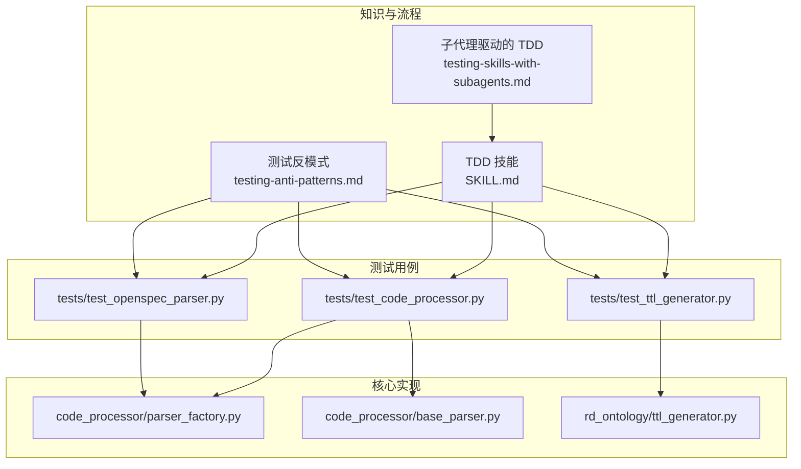
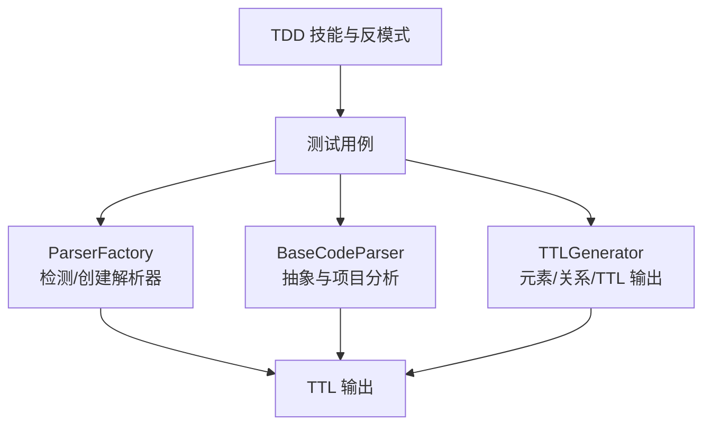
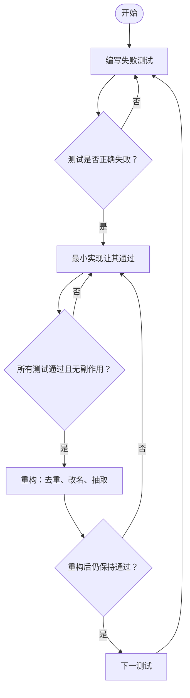
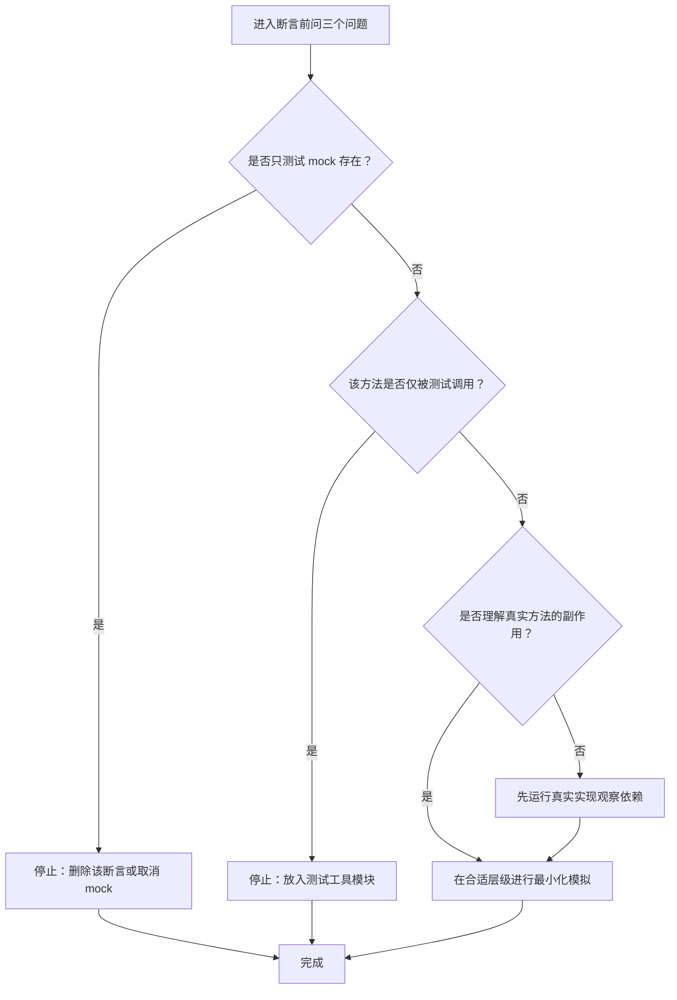
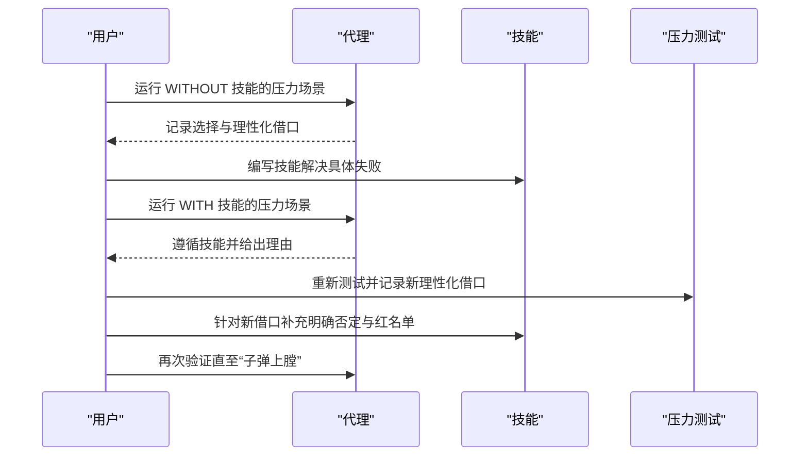
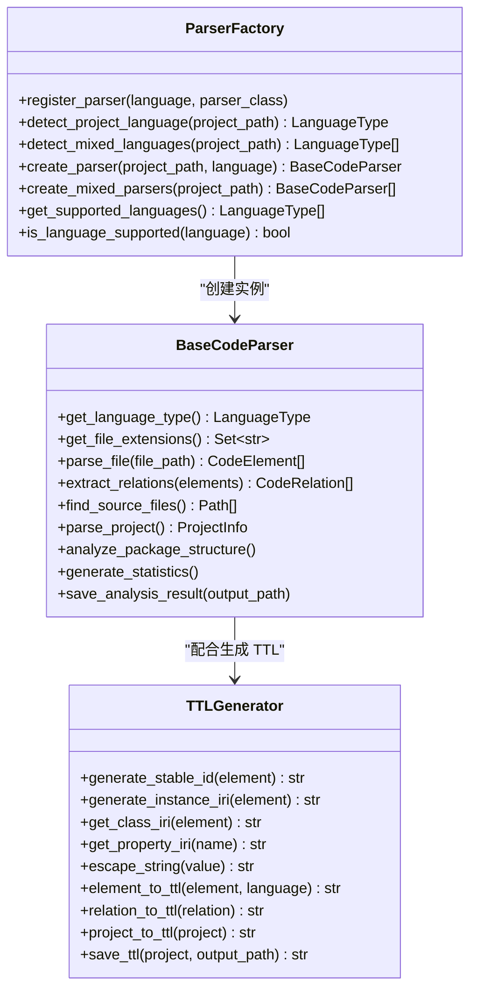
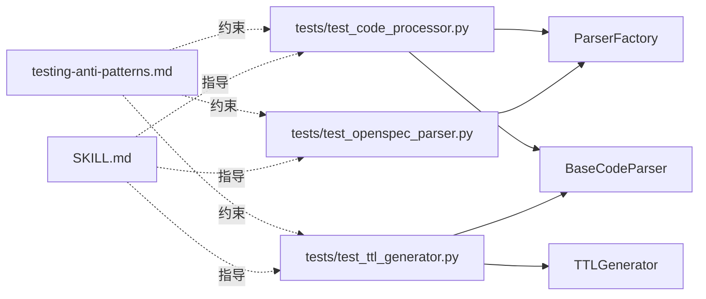

# 测试驱动开发

<cite>
**本文引用的文件**
- [global/codex-skills/test-driven-development/SKILL.md](file://global/codex-skills/test-driven-development/SKILL.md)
- [global/codex-skills/test-driven-development/testing-anti-patterns.md](file://global/codex-skills/test-driven-development/testing-anti-patterns.md)
- [global/codex-skills/writing-skills/testing-skills-with-subagents.md](file://global/codex-skills/writing-skills/testing-skills-with-subagents.md)
- [tests/test_code_processor.py](file://tests/test_code_processor.py)
- [tests/test_openspec_parser.py](file://tests/test_openspec_parser.py)
- [tests/test_ttl_generator.py](file://tests/test_ttl_generator.py)
- [code_processor/parser_factory.py](file://code_processor/parser_factory.py)
- [code_processor/base_parser.py](file://code_processor/base_parser.py)
- [rd_ontology/ttl_generator.py](file://rd_ontology/ttl_generator.py)
- [README.md](file://README.md)
</cite>

## 目录
1. [引言](#引言)
2. [项目结构](#项目结构)
3. [核心组件](#核心组件)
4. [架构总览](#架构总览)
5. [详细组件分析](#详细组件分析)
6. [依赖关系分析](#依赖关系分析)
7. [性能考量](#性能考量)
8. [故障排查指南](#故障排查指南)
9. [结论](#结论)
10. [附录](#附录)

## 引言
本文件围绕“测试驱动开发（TDD）”在本仓库中的理念与实践展开，结合仓库内现有的 TDD 技能文档、测试反模式清单以及实际测试用例，系统阐述 TDD 的理论基础、红绿重构循环、测试先行原则、代码质量保障机制，并给出测试反模式识别与规避策略。同时，文档还覆盖了如何编写有效的单元测试、集成测试与端到端测试，以及测试自动化、持续集成与团队协作模式下的 TDD 实践建议，帮助读者建立以测试为中心的开发思维。

## 项目结构
本仓库是一个多 AI 协同与规范驱动开发（SDD）的配置模板项目，其中包含多个与 TDD 相关的知识模块与测试用例：
- TDD 技能与反模式：位于 global/codex-skills/test-driven-development 下，提供 TDD 的原则、流程与常见陷阱。
- 子代理驱动的 TDD 测试：位于 global/codex-skills/writing-skills 下，将 TDD 应用于技能文档的验证。
- 测试用例：位于 tests/ 下，覆盖代码处理器、OpenSpec 解析器与 TTL 生成器等模块。
- 核心实现：位于 code_processor/ 与 rd_ontology/ 下，为测试用例提供被测对象与接口。

图表来源
- [global/codex-skills/test-driven-development/SKILL.md](file://global/codex-skills/test-driven-development/SKILL.md#L1-L372)
- [global/codex-skills/test-driven-development/testing-anti-patterns.md](file://global/codex-skills/test-driven-development/testing-anti-patterns.md#L1-L300)
- [global/codex-skills/writing-skills/testing-skills-with-subagents.md](file://global/codex-skills/writing-skills/testing-skills-with-subagents.md#L1-L385)
- [tests/test_code_processor.py](file://tests/test_code_processor.py#L1-L139)
- [tests/test_openspec_parser.py](file://tests/test_openspec_parser.py#L1-L97)
- [tests/test_ttl_generator.py](file://tests/test_ttl_generator.py#L1-L103)
- [code_processor/parser_factory.py](file://code_processor/parser_factory.py#L1-L248)
- [code_processor/base_parser.py](file://code_processor/base_parser.py#L1-L358)
- [rd_ontology/ttl_generator.py](file://rd_ontology/ttl_generator.py#L1-L321)

章节来源
- [README.md](file://README.md#L1-L229)

## 核心组件
- TDD 技能与流程：提供红绿重构循环、测试先行原则、验证失败与通过的标准、常见理性化借口与应对策略。
- 测试反模式清单：明确“测试模拟行为而非真实行为”“测试专用方法污染生产类”“无依赖理解的模拟”等反模式及其纠正方法。
- 子代理驱动的 TDD：将 TDD 应用于技能文档的验证，通过压力场景捕捉代理的理性化行为并迭代完善技能。
- 测试用例：覆盖代码解析器工厂、基础解析器数据结构、TTL 生成器等模块，体现 TDD 的最小实现与重构思想。
- 核心实现：提供统一的解析器抽象、语言与元素类型枚举、关系建模、项目信息聚合与统计，以及 TTL 输出转换。

章节来源
- [global/codex-skills/test-driven-development/SKILL.md](file://global/codex-skills/test-driven-development/SKILL.md#L47-L197)
- [global/codex-skills/test-driven-development/testing-anti-patterns.md](file://global/codex-skills/test-driven-development/testing-anti-patterns.md#L1-L300)
- [global/codex-skills/writing-skills/testing-skills-with-subagents.md](file://global/codex-skills/writing-skills/testing-skills-with-subagents.md#L1-L385)
- [tests/test_code_processor.py](file://tests/test_code_processor.py#L1-L139)
- [tests/test_openspec_parser.py](file://tests/test_openspec_parser.py#L1-L97)
- [tests/test_ttl_generator.py](file://tests/test_ttl_generator.py#L1-L103)
- [code_processor/parser_factory.py](file://code_processor/parser_factory.py#L1-L248)
- [code_processor/base_parser.py](file://code_processor/base_parser.py#L1-L358)
- [rd_ontology/ttl_generator.py](file://rd_ontology/ttl_generator.py#L1-L321)

## 架构总览
下图展示了 TDD 在本项目中的落地路径：从 TDD 技能与反模式出发，指导测试用例设计；测试用例覆盖核心实现模块；最终通过 TTL 生成器将分析结果输出为语义化知识图谱格式。

图表来源
- [global/codex-skills/test-driven-development/SKILL.md](file://global/codex-skills/test-driven-development/SKILL.md#L1-L372)
- [global/codex-skills/test-driven-development/testing-anti-patterns.md](file://global/codex-skills/test-driven-development/testing-anti-patterns.md#L1-L300)
- [tests/test_code_processor.py](file://tests/test_code_processor.py#L1-L139)
- [tests/test_openspec_parser.py](file://tests/test_openspec_parser.py#L1-L97)
- [tests/test_ttl_generator.py](file://tests/test_ttl_generator.py#L1-L103)
- [code_processor/parser_factory.py](file://code_processor/parser_factory.py#L1-L248)
- [code_processor/base_parser.py](file://code_processor/base_parser.py#L1-L358)
- [rd_ontology/ttl_generator.py](file://rd_ontology/ttl_generator.py#L1-L321)

## 详细组件分析

### 组件一：TDD 技能与红绿重构循环
- 红：编写一个失败的测试，确保它因“缺少功能”而失败，而非“拼写错误”。
- 绿：写出最简单的实现使测试通过，保持“最小可用”。
- 重构：在保持测试绿色的前提下清理重复、改善命名、提取辅助函数。
- 循环：下一行为下一个特性重复上述流程。

图表来源
- [global/codex-skills/test-driven-development/SKILL.md](file://global/codex-skills/test-driven-development/SKILL.md#L47-L197)

章节来源
- [global/codex-skills/test-driven-development/SKILL.md](file://global/codex-skills/test-driven-development/SKILL.md#L1-L372)

### 组件二：测试反模式与规避
- 反模式1：测试模拟行为而非真实行为
  - 表现：断言 mock 元素存在或行为，而非组件真实行为。
  - 规避：直接测试真实组件或取消不必要的 mock。
- 反模式2：在生产类中添加测试专用方法
  - 表现：生产类暴露仅用于测试的方法，污染 API。
  - 规避：将测试清理逻辑放入测试工具模块。
- 反模式3：无依赖理解的模拟
  - 表现：过度 mock 导致测试逻辑被破坏。
  - 规避：先运行真实实现观察依赖链，再在合适层级进行最小化模拟。
- 反模式4：不完整的 mock 数据
  - 表现：mock 字段缺失导致下游代码访问时报错。
  - 规避：完整镜像真实 API 结构，确保下游可能使用的字段齐全。
- 反模式5：把集成测试当作事后补救
  - 表现：实现完成后才考虑测试。
  - 规避：遵循 TDD，测试先于实现。

图表来源
- [global/codex-skills/test-driven-development/testing-anti-patterns.md](file://global/codex-skills/test-driven-development/testing-anti-patterns.md#L1-L300)

章节来源
- [global/codex-skills/test-driven-development/testing-anti-patterns.md](file://global/codex-skills/test-driven-development/testing-anti-patterns.md#L1-L300)

### 组件三：子代理驱动的 TDD（技能验证）
- 将 TDD 应用于技能文档的验证：先在没有技能的情况下运行压力场景，记录代理的选择与理性化借口；然后编写技能解决这些失败；最后通过多重压力场景反复验证与修补。
- 关键点：压力场景需包含时间、沉没成本、权威、经济、疲惫、社交与实用主义等多重压力组合，迫使代理做出明确选择。

图表来源
- [global/codex-skills/writing-skills/testing-skills-with-subagents.md](file://global/codex-skills/writing-skills/testing-skills-with-subagents.md#L1-L385)

章节来源
- [global/codex-skills/writing-skills/testing-skills-with-subagents.md](file://global/codex-skills/writing-skills/testing-skills-with-subagents.md#L1-L385)

### 组件四：测试用例与最小实现
- 测试用例覆盖：
  - Python 解析器：类、函数、导入的解析。
  - 解析器工厂：项目语言检测、解析器创建。
  - CodeElement：字典序列化、父子关系添加。
  - OpenSpec 解析器：提案、任务列表与变更目录扫描。
  - TTL 生成器：稳定 ID、元素/关系/TTL 输出、项目级 TTL 文件生成。
- 最小实现与重构：
  - 测试先行，确保每个新增函数/方法都有对应测试。
  - 仅在测试失败后才实现，实现后立即重构，去除重复、改善命名与结构。

章节来源
- [tests/test_code_processor.py](file://tests/test_code_processor.py#L1-L139)
- [tests/test_openspec_parser.py](file://tests/test_openspec_parser.py#L1-L97)
- [tests/test_ttl_generator.py](file://tests/test_ttl_generator.py#L1-L103)

### 组件五：核心实现与接口契约
- 解析器工厂（ParserFactory）：
  - 语言自动检测、混合语言项目支持、解析器注册与创建。
  - 项目概览统计与结果保存。
- 基础解析器（BaseCodeParser）：
  - 统一抽象接口：语言类型、文件扩展名、单文件解析、关系提取、项目解析与统计。
  - 项目结构分析与包统计。
- TTL 生成器（TTLGenerator）：
  - 元素类型映射到 TTL 类名、关系类型映射到属性名。
  - 稳定 ID 生成、IRI 生成、字符串转义、元素/关系/TTL 输出与项目级 TTL 文件生成。

图表来源
- [code_processor/parser_factory.py](file://code_processor/parser_factory.py#L1-L248)
- [code_processor/base_parser.py](file://code_processor/base_parser.py#L1-L358)
- [rd_ontology/ttl_generator.py](file://rd_ontology/ttl_generator.py#L1-L321)

章节来源
- [code_processor/parser_factory.py](file://code_processor/parser_factory.py#L1-L248)
- [code_processor/base_parser.py](file://code_processor/base_parser.py#L1-L358)
- [rd_ontology/ttl_generator.py](file://rd_ontology/ttl_generator.py#L1-L321)

## 依赖关系分析
- 测试用例依赖核心实现模块：
  - Python 解析器与工厂：tests/test_code_processor.py 依赖 code_processor 下的解析器与工厂。
  - OpenSpec 解析器：tests/test_openspec_parser.py 依赖 sdd_integration 下的 OpenSpecParser。
  - TTL 生成器：tests/test_ttl_generator.py 依赖 code_processor 的数据结构与 rd_ontology 的 TTL 生成器。
- 反模式与 TDD 技能对测试用例设计有约束作用，确保测试关注真实行为而非模拟行为。

图表来源
- [tests/test_code_processor.py](file://tests/test_code_processor.py#L1-L139)
- [tests/test_openspec_parser.py](file://tests/test_openspec_parser.py#L1-L97)
- [tests/test_ttl_generator.py](file://tests/test_ttl_generator.py#L1-L103)
- [code_processor/parser_factory.py](file://code_processor/parser_factory.py#L1-L248)
- [code_processor/base_parser.py](file://code_processor/base_parser.py#L1-L358)
- [rd_ontology/ttl_generator.py](file://rd_ontology/ttl_generator.py#L1-L321)
- [global/codex-skills/test-driven-development/testing-anti-patterns.md](file://global/codex-skills/test-driven-development/testing-anti-patterns.md#L1-L300)
- [global/codex-skills/test-driven-development/SKILL.md](file://global/codex-skills/test-driven-development/SKILL.md#L1-L372)

章节来源
- [tests/test_code_processor.py](file://tests/test_code_processor.py#L1-L139)
- [tests/test_openspec_parser.py](file://tests/test_openspec_parser.py#L1-L97)
- [tests/test_ttl_generator.py](file://tests/test_ttl_generator.py#L1-L103)
- [code_processor/parser_factory.py](file://code_processor/parser_factory.py#L1-L248)
- [code_processor/base_parser.py](file://code_processor/base_parser.py#L1-L358)
- [rd_ontology/ttl_generator.py](file://rd_ontology/ttl_generator.py#L1-L321)
- [global/codex-skills/test-driven-development/testing-anti-patterns.md](file://global/codex-skills/test-driven-development/testing-anti-patterns.md#L1-L300)
- [global/codex-skills/test-driven-development/SKILL.md](file://global/codex-skills/test-driven-development/SKILL.md#L1-L372)

## 性能考量
- 测试性能：
  - 使用临时目录与最小化输入，减少 IO 与内存开销。
  - 避免过度模拟，优先使用真实组件以降低测试复杂度与维护成本。
- 实现性能：
  - 解析器工厂对项目指标进行评分与排除目录过滤，提升扫描效率。
  - TTL 生成器采用稳定 ID 与缓存 IRI，减少重复计算与字符串处理成本。
- 团队协作：
  - 子代理驱动的 TDD 通过压力场景与理性化表格，帮助团队在高压环境下坚持 TDD 原则，减少返工与技术债积累。

## 故障排查指南
- 常见问题与对策
  - 测试未失败即通过：检查测试是否针对真实行为断言，必要时回退到真实实现观察依赖链。
  - 测试通过但集成失败：确认 mock 是否完整镜像真实 API 结构，避免遗漏下游依赖字段。
  - 测试专用方法污染生产类：将清理逻辑移至测试工具模块，避免 API 污染。
  - 过度模拟导致测试脆弱：在合适层级进行最小化模拟，先运行真实实现以理解副作用。
  - 子代理仍选择“测试之后”：通过更强的“铁律”与压力场景反复验证，直到“子弹上膛”。

章节来源
- [global/codex-skills/test-driven-development/testing-anti-patterns.md](file://global/codex-skills/test-driven-development/testing-anti-patterns.md#L1-L300)
- [global/codex-skills/writing-skills/testing-skills-with-subagents.md](file://global/codex-skills/writing-skills/testing-skills-with-subagents.md#L1-L385)

## 结论
本仓库将 TDD 从代码层面推广到技能文档与团队协作层面，通过明确的红绿重构循环、严格的测试反模式约束与压力场景验证，帮助团队在高压与诱惑下坚持测试先行原则。测试用例覆盖核心实现模块，确保最小实现与持续重构；TTL 生成器将分析结果转化为语义化知识图谱，进一步强化“以测试为中心”的开发思维。

## 附录
- 测试命名约定（建议）
  - 单元测试：test_功能描述_边界条件
  - 集成测试：test_模块交互_场景
  - 端到端测试：test_用户故事_业务流程
- 测试组织结构（建议）
  - tests/ 下按模块划分：test_code_processor.py、test_openspec_parser.py、test_ttl_generator.py
  - 每个模块的测试类与方法清晰标注职责范围
- 测试覆盖率与持续集成（建议）
  - 使用工具统计覆盖率，确保关键路径与异常分支均被覆盖
  - 将 TDD 流程纳入 CI：提交触发测试，失败即阻断合并
- 团队协作模式（建议）
  - 子代理驱动的 TDD：在技能开发中应用压力场景与理性化表格，逐步“子弹上膛”
  - 定期回顾：总结测试反模式与常见理性化借口，更新技能与流程