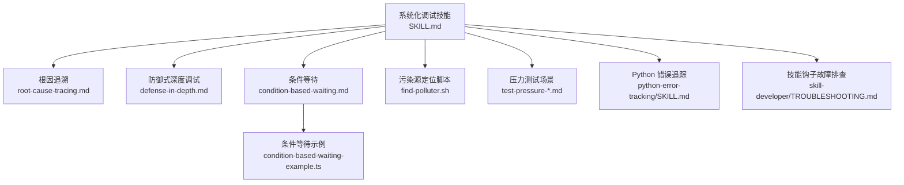
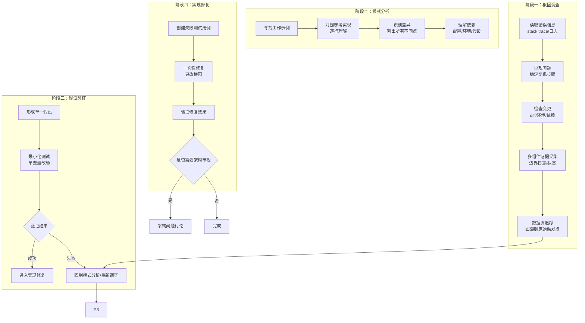
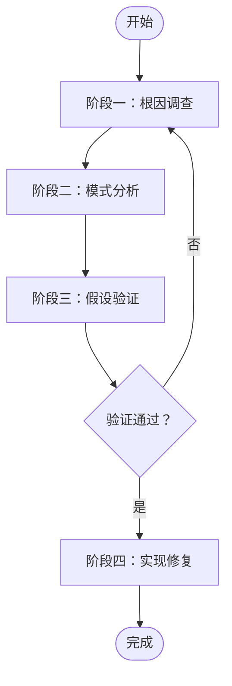
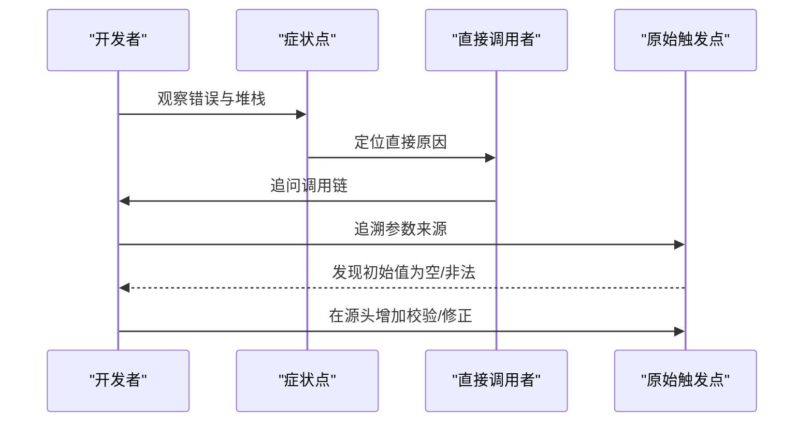
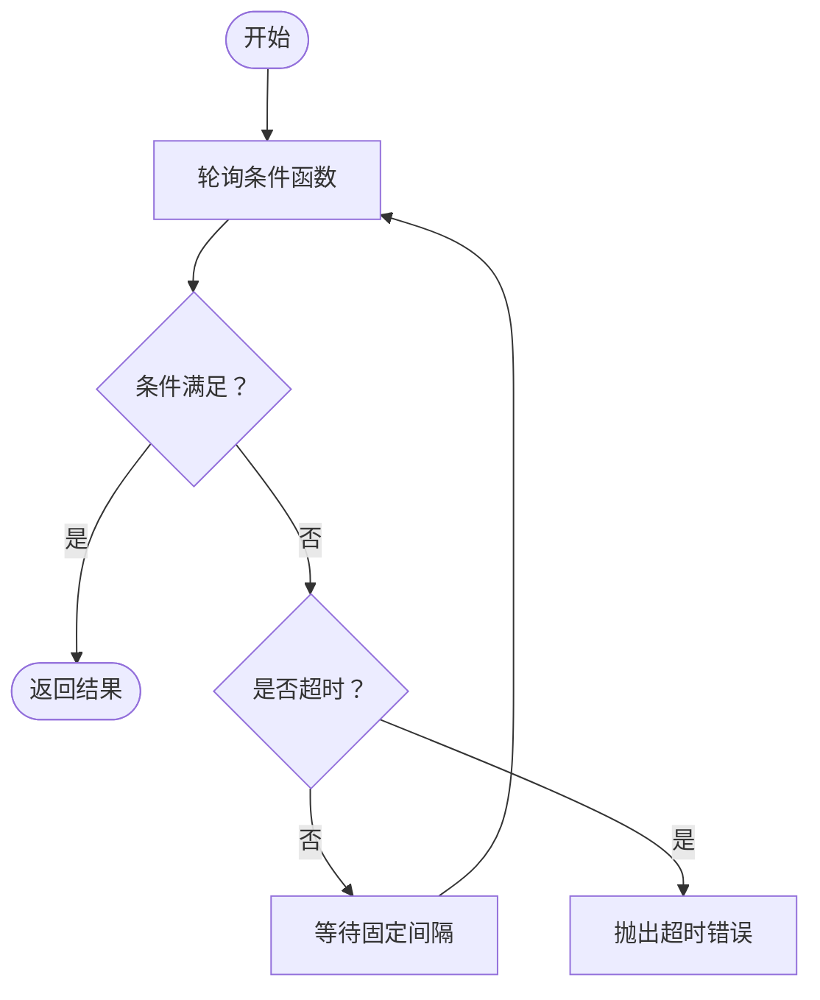
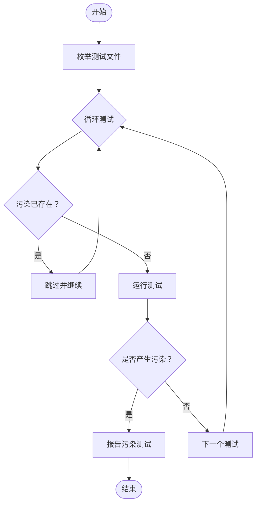
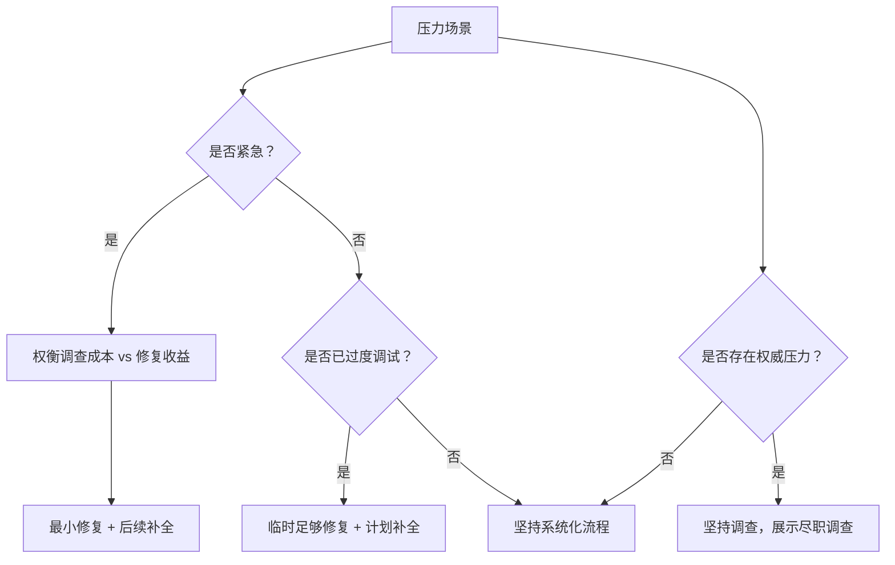
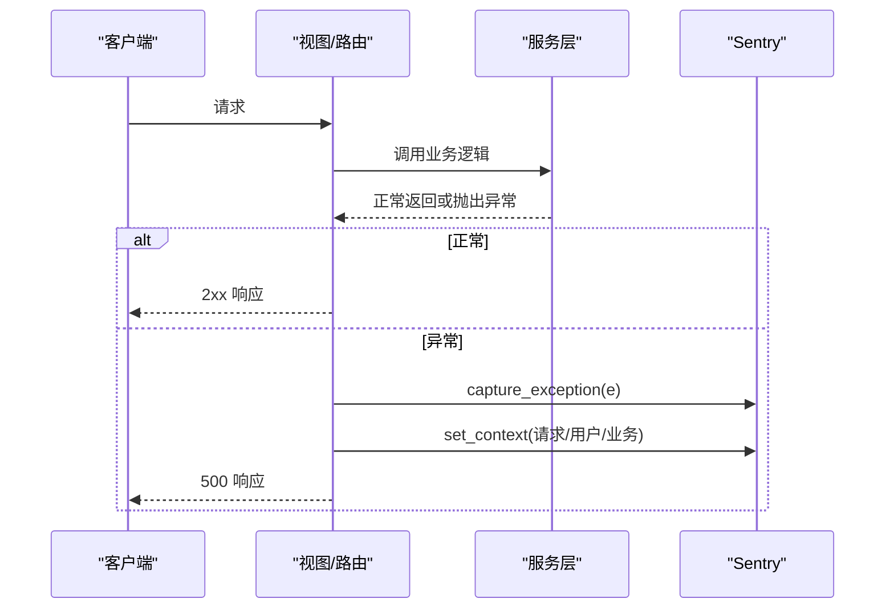
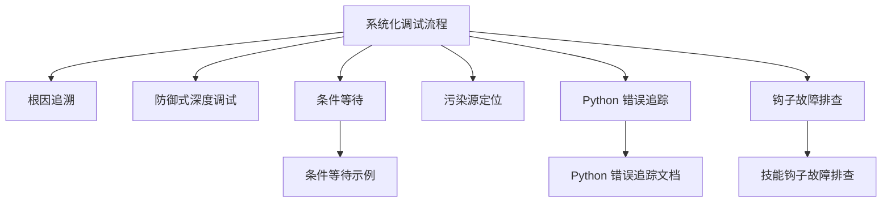

# 系统化调试

<cite>
**本文引用的文件**
- [README.md](file://README.md)
- [SKILL.md](file://global/codex-skills/systematic-debugging/SKILL.md)
- [root-cause-tracing.md](file://global/codex-skills/systematic-debugging/root-cause-tracing.md)
- [defense-in-depth.md](file://global/codex-skills/systematic-debugging/defense-in-depth.md)
- [condition-based-waiting.md](file://global/codex-skills/systematic-debugging/condition-based-waiting.md)
- [condition-based-waiting-example.ts](file://global/codex-skills/systematic-debugging/condition-based-waiting-example.ts)
- [find-polluter.sh](file://global/codex-skills/systematic-debugging/find-polluter.sh)
- [test-pressure-1.md](file://global/codex-skills/systematic-debugging/test-pressure-1.md)
- [test-pressure-2.md](file://global/codex-skills/systematic-debugging/test-pressure-2.md)
- [test-pressure-3.md](file://global/codex-skills/systematic-debugging/test-pressure-3.md)
- [test-academic.md](file://global/codex-skills/systematic-debugging/test-academic.md)
- [python-error-tracking/SKILL.md](file://skills/python-error-tracking/SKILL.md)
- [skill-developer/TROUBLESHOOTING.md](file://skills/skill-developer/TROUBLESHOOTING.md)
</cite>

## 目录
1. [引言](#引言)
2. [项目结构](#项目结构)
3. [核心组件](#核心组件)
4. [架构总览](#架构总览)
5. [详细组件分析](#详细组件分析)
6. [依赖关系分析](#依赖关系分析)
7. [性能考量](#性能考量)
8. [故障排查指南](#故障排查指南)
9. [结论](#结论)
10. [附录](#附录)

## 引言
本文件系统化阐述“四阶段调试方法论”：根因调查、模式分析、假设验证与实现修复，并结合项目中提供的防御式深度调试、条件等待机制、污染源定位脚本等实战工具，帮助开发者在复杂系统中建立稳定、可重复、可扩展的问题解决思维模式。文档同时覆盖压力场景下的决策框架、常见陷阱与团队协作中的沟通技巧，确保在时间压力、权威压力与技术复杂度下仍能坚持高质量调试流程。

## 项目结构
该仓库围绕“系统化调试”技能提供完整的知识体系与工具链，包括：
- 四阶段调试流程与快速参考
- 根因追溯与数据流追踪方法
- 防御式深度调试的四层验证
- 条件等待替代任意超时
- 污染源定位脚本
- 压力测试场景的决策模型
- Python 后端错误追踪与性能监控集成
- 技能激活与钩子故障排查

图表来源
- [SKILL.md](file://global/codex-skills/systematic-debugging/SKILL.md#L1-L297)
- [root-cause-tracing.md](file://global/codex-skills/systematic-debugging/root-cause-tracing.md#L1-L170)
- [defense-in-depth.md](file://global/codex-skills/systematic-debugging/defense-in-depth.md#L1-L123)
- [condition-based-waiting.md](file://global/codex-skills/systematic-debugging/condition-based-waiting.md#L1-L116)
- [condition-based-waiting-example.ts](file://global/codex-skills/systematic-debugging/condition-based-waiting-example.ts#L1-L159)
- [find-polluter.sh](file://global/codex-skills/systematic-debugging/find-polluter.sh#L1-L64)
- [test-pressure-1.md](file://global/codex-skills/systematic-debugging/test-pressure-1.md#L1-L59)
- [test-pressure-2.md](file://global/codex-skills/systematic-debugging/test-pressure-2.md#L1-L69)
- [test-pressure-3.md](file://global/codex-skills/systematic-debugging/test-pressure-3.md#L1-L70)
- [python-error-tracking/SKILL.md](file://skills/python-error-tracking/SKILL.md#L1-L574)
- [skill-developer/TROUBLESHOOTING.md](file://skills/skill-developer/TROUBLESHOOTING.md#L1-L515)

章节来源
- [README.md](file://README.md#L1-L229)

## 核心组件
- 四阶段调试流程：严格顺序推进，任何阶段未完成不得进入下一阶段；强调“先调查，再修复”。
- 根因追溯：从症状点逆向追踪至原始触发点，避免仅修复症状。
- 防御式深度调试：在数据流的每一层增加校验，使问题结构上不可再现。
- 条件等待：以“等待实际条件满足”替代“猜测超时”，消除竞态与不稳定。
- 污染源定位：对测试进行二分排查，快速定位制造副作用的测试文件。
- 压力测试场景：在紧急、疲劳、权威压力下，坚持最小可行调查与记录，必要时采用“最小修复 + 后续补全”的策略。
- Python 错误追踪：统一异常捕获与上下文注入，配合性能监控，形成闭环可观测性。
- 技能钩子故障排查：定位技能建议与拦截不生效的根本原因，保障调试工具链稳定。

章节来源
- [SKILL.md](file://global/codex-skills/systematic-debugging/SKILL.md#L46-L297)
- [root-cause-tracing.md](file://global/codex-skills/systematic-debugging/root-cause-tracing.md#L1-L170)
- [defense-in-depth.md](file://global/codex-skills/systematic-debugging/defense-in-depth.md#L1-L123)
- [condition-based-waiting.md](file://global/codex-skills/systematic-debugging/condition-based-waiting.md#L1-L116)
- [find-polluter.sh](file://global/codex-skills/systematic-debugging/find-polluter.sh#L1-L64)
- [python-error-tracking/SKILL.md](file://skills/python-error-tracking/SKILL.md#L1-L574)
- [skill-developer/TROUBLESHOOTING.md](file://skills/skill-developer/TROUBLESHOOTING.md#L1-L515)

## 架构总览
系统化调试的“四阶段”与配套工具构成一个闭环：先通过根因追溯与证据收集定位真实原因，再通过模式对比与差异分析形成可验证的假设，随后以最小改动进行验证，最后以失败测试与防御式验证确保修复持久有效。

图表来源
- [SKILL.md](file://global/codex-skills/systematic-debugging/SKILL.md#L50-L214)

## 详细组件分析

### 组件A：四阶段调试流程
- 阶段一：根因调查
  - 仔细阅读错误消息与堆栈，记录文件路径、行号、错误码。
  - 明确可重现步骤，确认是否稳定复现。
  - 回溯最近变更，关注新增依赖、配置变化与环境差异。
  - 在多组件系统中，于每个组件边界添加诊断日志，定位失败层。
  - 对深层调用链使用数据流回溯，找到原始触发点，而非症状点。
- 阶段二：模式分析
  - 寻找相同或相似功能的已知工作实现，逐行研读参考实现。
  - 列出当前实现与参考实现的所有差异，不放过微小差异。
  - 明确依赖项：配置、环境、外部服务、平台差异等。
- 阶段三：假设验证
  - 将假设写下来，明确“我认为X是根因，因为Y”。
  - 最小化测试：一次只改变一个变量，避免捆绑多个修复。
  - 若验证失败，回到阶段一或二补充证据，形成新的假设。
  - 不懂的地方要坦诚提问，不要假装理解。
- 阶段四：实现修复
  - 在修复前先编写失败测试用例，确保可自动化验证。
  - 一次性修复：只针对根因，不顺手做其他改进。
  - 验证修复：测试通过且不破坏其他功能。
  - 如果尝试三次以上仍未解决，停止并审视架构设计。

图表来源
- [SKILL.md](file://global/codex-skills/systematic-debugging/SKILL.md#L46-L214)

章节来源
- [SKILL.md](file://global/codex-skills/systematic-debugging/SKILL.md#L46-L214)

### 组件B：根因追溯（Backward Tracing）
- 何时使用：错误出现在深层调用栈、难以定位无效数据来源、需要确定触发测试或代码。
- 方法论：观察症状 → 定位直接原因 → 追问“谁调用了它” → 追问“传入了什么值” → 追溯到原始触发点。
- 工具与技巧：在关键操作前输出上下文（目录、cwd、环境变量、堆栈），使用 grep 捕捉调试输出；利用二分脚本定位污染测试。

图表来源
- [root-cause-tracing.md](file://global/codex-skills/systematic-debugging/root-cause-tracing.md#L32-L154)

章节来源
- [root-cause-tracing.md](file://global/codex-skills/systematic-debugging/root-cause-tracing.md#L1-L170)

### 组件C：防御式深度调试（Defense-in-Depth）
- 核心思想：单点校验可能被绕过，必须在数据流的每一层增加校验，使问题结构上不可能发生。
- 四层验证：
  - 入口层：拒绝明显非法输入（存在性、格式、权限）。
  - 业务层：确保数据对当前操作有意义。
  - 环境层：在特定环境下拒绝危险操作（如测试中禁止在源码目录执行敏感命令）。
  - 调试层：保留上下文日志，便于取证。
- 实战案例：通过四层校验，将“空目录导致在源码目录初始化版本库”的问题彻底杜绝。

图表来源
- [defense-in-depth.md](file://global/codex-skills/systematic-debugging/defense-in-depth.md#L20-L123)

章节来源
- [defense-in-depth.md](file://global/codex-skills/systematic-debugging/defense-in-depth.md#L1-L123)

### 组件D：条件等待（Condition-Based Waiting）
- 何时使用：测试使用任意超时（setTimeout/sleep）、测试不稳定、并行运行超时。
- 核心原则：等待“实际条件满足”，而不是“猜测耗时”。
- 实现要点：轮询间隔适中（如每10ms）、带超时与清晰错误信息、避免缓存陈旧状态。
- 示例工具：事件等待、计数等待、匹配等待，均基于统一的轮询框架。

图表来源
- [condition-based-waiting.md](file://global/codex-skills/systematic-debugging/condition-based-waiting.md#L58-L82)

章节来源
- [condition-based-waiting.md](file://global/codex-skills/systematic-debugging/condition-based-waiting.md#L1-L116)
- [condition-based-waiting-example.ts](file://global/codex-skills/systematic-debugging/condition-based-waiting-example.ts#L1-L159)

### 组件E：污染源定位脚本（find-polluter.sh）
- 作用：在大量测试中，二分定位制造副作用（如文件、状态）的测试文件。
- 使用方式：提供待检测对象与测试模式，脚本按序运行测试，一旦出现污染即停止并报告。
- 场景：CI 中出现“神秘文件/状态”，无法定位具体测试时。

图表来源
- [find-polluter.sh](file://global/codex-skills/systematic-debugging/find-polluter.sh#L1-L64)

章节来源
- [find-polluter.sh](file://global/codex-skills/systematic-debugging/find-polluter.sh#L1-L64)

### 组件F：压力测试场景（决策模型）
- 场景一：生产紧急故障，收益巨大但调查成本高。
- 场景二：长时间调试后疲惫，需要“够用的修复”与后续补救。
- 场景三：权威压力下，需要坚持系统化流程并展示尽职调查。
- 建议：在紧急情况下采用“最小修复 + 后续补全”，在权威压力下坚持“先调查再修复”，在长期疲劳下采用“快速调查 + 临时修复 + 计划补全”。

图表来源
- [test-pressure-1.md](file://global/codex-skills/systematic-debugging/test-pressure-1.md#L1-L59)
- [test-pressure-2.md](file://global/codex-skills/systematic-debugging/test-pressure-2.md#L1-L69)
- [test-pressure-3.md](file://global/codex-skills/systematic-debugging/test-pressure-3.md#L1-L70)

章节来源
- [test-pressure-1.md](file://global/codex-skills/systematic-debugging/test-pressure-1.md#L1-L59)
- [test-pressure-2.md](file://global/codex-skills/systematic-debugging/test-pressure-2.md#L1-L69)
- [test-pressure-3.md](file://global/codex-skills/systematic-debugging/test-pressure-3.md#L1-L70)

### 组件G：Python 后端错误追踪与性能监控
- 统一异常捕获：所有未预期异常必须上报到 Sentry，不得仅打印或记录。
- 上下文注入：在捕获异常前设置用户、请求、业务上下文，提升可诊断性。
- 性能监控：为关键路径打点，自动跟踪数据库、HTTP、计算等子操作。
- 背景任务：Celery/异步任务同样纳入事务与跨度监控。
- 环境差异化：开发/生产采样率不同，避免生产噪声。

图表来源
- [python-error-tracking/SKILL.md](file://skills/python-error-tracking/SKILL.md#L78-L327)

章节来源
- [python-error-tracking/SKILL.md](file://skills/python-error-tracking/SKILL.md#L1-L574)

### 组件H：技能钩子与调试工具链故障排查
- 常见问题：技能未触发、拦截未生效、误报、钩子不执行、性能问题。
- 排查清单：关键词匹配、意图正则、文件路径与内容模式、会话状态、环境变量、钩子注册与可执行权限、TypeScript 编译。
- 建议：使用调试命令手动触发钩子，测量耗时，简化正则与路径模式，必要时降低强制级别。

章节来源
- [skill-developer/TROUBLESHOOTING.md](file://skills/skill-developer/TROUBLESHOOTING.md#L1-L515)

## 依赖关系分析
- 四阶段调试流程是核心，根因追溯与防御式深度调试为其提供方法论与工程化手段。
- 条件等待与污染源定位脚本分别解决“不稳定测试”和“测试污染”两类高频痛点。
- Python 错误追踪与性能监控为后端系统提供可观测性基础，支撑调试闭环。
- 技能钩子故障排查保障调试工具链稳定，避免因工具链问题导致调试效率下降。

图表来源
- [SKILL.md](file://global/codex-skills/systematic-debugging/SKILL.md#L278-L289)
- [condition-based-waiting-example.ts](file://global/codex-skills/systematic-debugging/condition-based-waiting-example.ts#L1-L159)
- [python-error-tracking/SKILL.md](file://skills/python-error-tracking/SKILL.md#L1-L574)
- [skill-developer/TROUBLESHOOTING.md](file://skills/skill-developer/TROUBLESHOOTING.md#L1-L515)

章节来源
- [SKILL.md](file://global/codex-skills/systematic-debugging/SKILL.md#L278-L289)

## 性能考量
- 条件等待轮询间隔与超时设置直接影响稳定性与性能。过短轮询浪费 CPU，过长等待影响吞吐。
- 污染源定位脚本采用二分策略，减少测试运行次数；但需注意测试间相互依赖与状态隔离。
- Python 错误追踪的采样率与跨度数量会影响性能与存储成本，应按环境调整。
- 技能钩子的正则与文件扫描范围过大可能导致延迟，应精简模式与路径。

## 故障排查指南
- 症状：技能未触发
  - 检查关键词、意图正则、技能名一致性、JSON 语法。
  - 使用调试命令手动触发钩子，验证输出。
- 症状：拦截未生效
  - 检查文件路径与内容模式、排除列表、会话状态、文件标记、环境变量。
  - 使用调试命令模拟拦截器输入，观察退出码与输出。
- 症状：钩子不执行
  - 检查钩子注册、shebang、可执行权限、npx/tsx 可用性、TypeScript 编译。
- 症状：性能问题
  - 减少模式数量与复杂度、缩小路径范围、避免对大文件进行内容匹配。

章节来源
- [skill-developer/TROUBLESHOOTING.md](file://skills/skill-developer/TROUBLESHOOTING.md#L16-L515)

## 结论
系统化调试不是“更快地修复”，而是“更稳地修复”。通过四阶段流程、根因追溯、防御式深度调试、条件等待与污染源定位，开发者可以在高压与复杂环境中保持稳定输出。配合 Python 错误追踪与可观测性，以及技能钩子的可靠运行，调试工具链将真正成为质量与效率的保障。

## 附录
- 快速参考（来自技能文档）
  - 阶段一：读取错误、重现问题、检查变更、多组件证据、数据流追踪
  - 阶段二：寻找工作示例、对照参考、识别差异、理解依赖
  - 阶段三：形成单一假设、最小化测试、验证后再继续、不懂就问
  - 阶段四：创建失败测试、一次性修复、验证修复、若多次失败则审视架构

章节来源
- [SKILL.md](file://global/codex-skills/systematic-debugging/SKILL.md#L258-L266)
- [test-academic.md](file://global/codex-skills/systematic-debugging/test-academic.md#L1-L15)