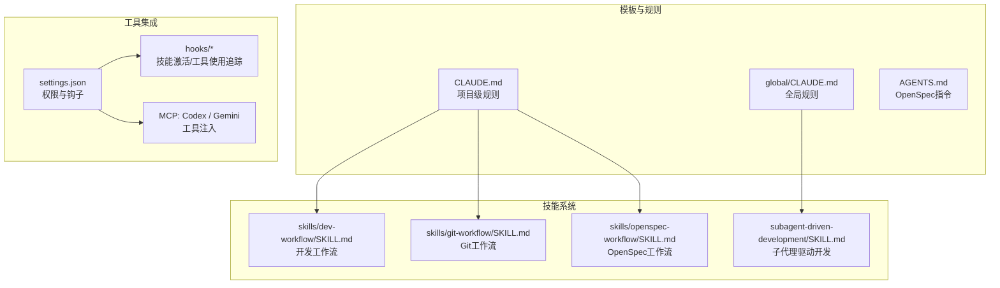
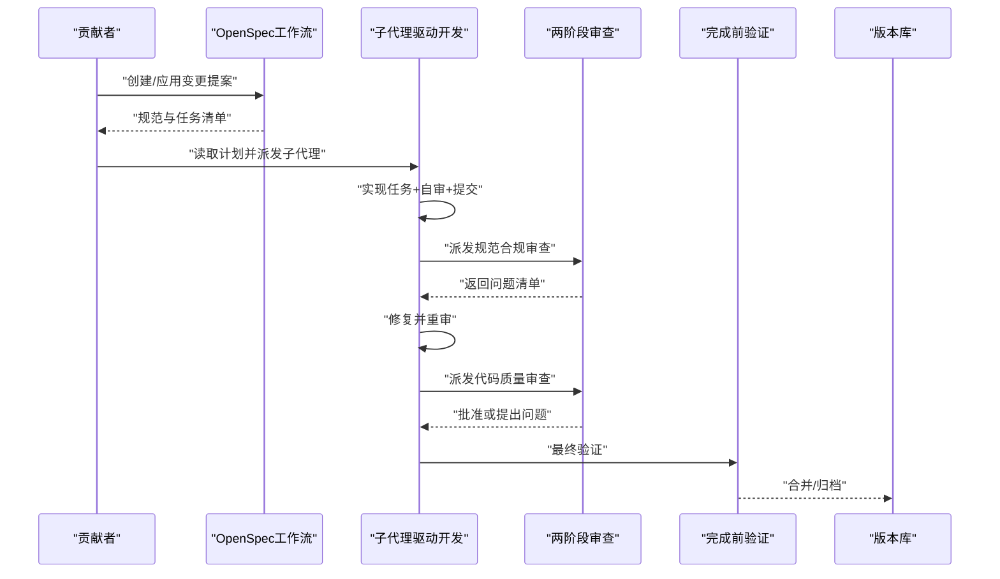
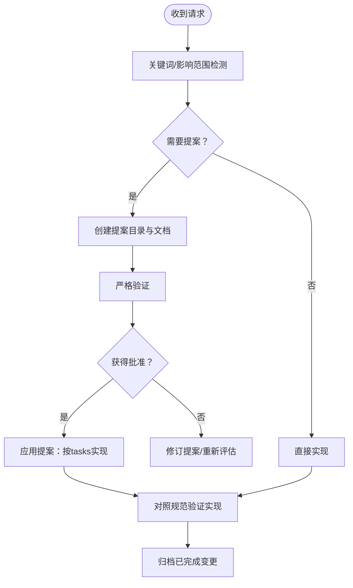
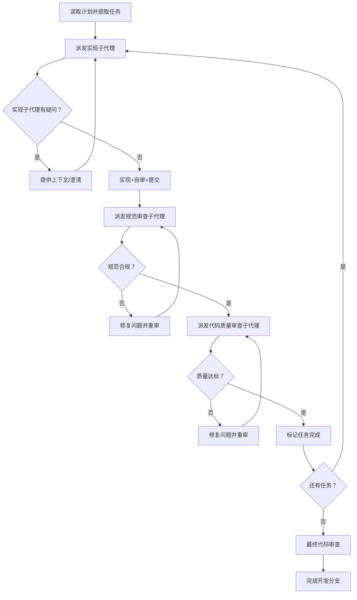
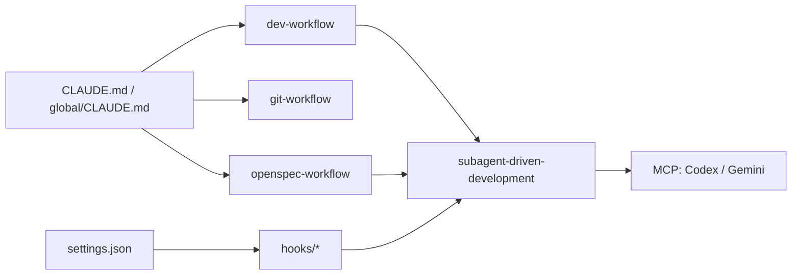

# 贡献指南

<cite>
**本文引用的文件**
- [README.md](file://README.md)
- [CLAUDE.md](file://CLAUDE.md)
- [global/CLAUDE.md](file://global/CLAUDE.md)
- [AGENTS.md](file://AGENTS.md)
- [skills/dev-workflow/SKILL.md](file://skills/dev-workflow/SKILL.md)
- [skills/git-workflow/SKILL.md](file://skills/git-workflow/SKILL.md)
- [skills/openspec-workflow/SKILL.md](file://skills/openspec-workflow/SKILL.md)
- [global/codex-skills/subagent-driven-development/SKILL.md](file://global/codex-skills/subagent-driven-development/SKILL.md)
- [global/codex-skills/subagent-driven-development/implementer-prompt.md](file://global/codex-skills/subagent-driven-development/implementer-prompt.md)
- [global/codex-skills/subagent-driven-development/spec-reviewer-prompt.md](file://global/codex-skills/subagent-driven-development/spec-reviewer-prompt.md)
- [global/codex-skills/subagent-driven-development/code-quality-reviewer-prompt.md](file://global/codex-skills/subagent-driven-development/code-quality-reviewer-prompt.md)
- [global/codex-skills/systematic-debugging/SKILL.md](file://global/codex-skills/systematic-debugging/SKILL.md)
- [global/codex-skills/test-driven-development/SKILL.md](file://global/codex-skills/test-driven-development/SKILL.md)
- [global/codex-skills/verification-before-completion/SKILL.md](file://global/codex-skills/verification-before-completion/SKILL.md)
- [settings.json](file://settings.json)
- [hooks/skill-activation-prompt.sh](file://hooks/skill-activation-prompt.sh)
- [hooks/skill-activation-prompt.ts](file://hooks/skill-activation-prompt.ts)
- [hooks/post-tool-use-tracker.sh](file://hooks/post-tool-use-tracker.sh)
</cite>

## 目录
1. [简介](#简介)
2. [项目结构](#项目结构)
3. [核心组件](#核心组件)
4. [架构总览](#架构总览)
5. [详细组件分析](#详细组件分析)
6. [依赖关系分析](#依赖关系分析)
7. [性能考虑](#性能考虑)
8. [故障排查指南](#故障排查指南)
9. [结论](#结论)
10. [附录](#附录)

## 简介
本指南面向ontologyDevOS项目的贡献者，系统阐述如何参与项目的开发与维护，覆盖从需求分析、并行代理调度、计划执行到代码审查与合并的全流程。文档重点解释“子代理驱动开发”的协作模式、规范先行的OpenSpec工作流、多AI协同（Claude、Codex、Gemini）的协作原则，并提供可操作的贡献步骤、最佳实践与团队协作技巧，帮助新贡献者快速融入并高效产出。

## 项目结构
项目采用“模板+技能+工具+工作流”的组织方式：
- 模板层：CLAUDE.md、global/CLAUDE.md定义全局与项目级规则
- 技能层：skills/* 与 global/codex-skills/* 提供可复用的开发技能
- 工具层：MCP工具（Codex、Gemini）、插件（superpowers、code-review等）
- 工作流层：OpenSpec规范驱动开发、Git工作流、开发工作流

图表来源
- [CLAUDE.md](file://CLAUDE.md#L1-L440)
- [global/CLAUDE.md](file://global/CLAUDE.md#L1-L147)
- [AGENTS.md](file://AGENTS.md#L1-L18)
- [skills/dev-workflow/SKILL.md](file://skills/dev-workflow/SKILL.md#L1-L397)
- [skills/git-workflow/SKILL.md](file://skills/git-workflow/SKILL.md#L1-L440)
- [skills/openspec-workflow/SKILL.md](file://skills/openspec-workflow/SKILL.md#L1-L231)
- [global/codex-skills/subagent-driven-development/SKILL.md](file://global/codex-skills/subagent-driven-development/SKILL.md#L1-L241)
- [settings.json](file://settings.json#L1-L37)
- [hooks/skill-activation-prompt.sh](file://hooks/skill-activation-prompt.sh#L1-L6)
- [hooks/skill-activation-prompt.ts](file://hooks/skill-activation-prompt.ts)

章节来源
- [README.md](file://README.md#L1-L229)
- [CLAUDE.md](file://CLAUDE.md#L1-L440)
- [global/CLAUDE.md](file://global/CLAUDE.md#L1-L147)

## 核心组件
- 多AI协同规则：Claude为主导，Codex负责后端交叉检查，Gemini负责前端实现与长文本分析，强调“先思考、再验证”。
- OpenSpec规范驱动：实现前检查规范、提案触发器、严格阶段顺序与目录约定。
- 子代理驱动开发：每个任务派发新鲜子代理，两阶段审查（规范合规→代码质量），加速迭代。
- Git与开发工作流：标准化分支命名、提交信息、预提交检查与合并流程。
- 钩子与权限：通过settings.json配置钩子与权限，自动化技能激活与工具使用追踪。

章节来源
- [CLAUDE.md](file://CLAUDE.md#L102-L125)
- [skills/openspec-workflow/SKILL.md](file://skills/openspec-workflow/SKILL.md#L1-L231)
- [global/codex-skills/subagent-driven-development/SKILL.md](file://global/codex-skills/subagent-driven-development/SKILL.md#L1-L241)
- [skills/git-workflow/SKILL.md](file://skills/git-workflow/SKILL.md#L1-L440)
- [settings.json](file://settings.json#L1-L37)

## 架构总览
下图展示贡献者在项目中的典型路径：从OpenSpec提案到子代理执行、两阶段审查、验证与归档。

图表来源
- [skills/openspec-workflow/SKILL.md](file://skills/openspec-workflow/SKILL.md#L138-L187)
- [global/codex-skills/subagent-driven-development/SKILL.md](file://global/codex-skills/subagent-driven-development/SKILL.md#L38-L83)
- [global/codex-skills/verification-before-completion/SKILL.md](file://global/codex-skills/verification-before-completion/SKILL.md#L24-L38)

## 详细组件分析

### OpenSpec 规范驱动开发
- 触发条件：新增/修改/删除功能、破坏性变更、架构调整、性能/安全变更等。
- 实施流程：实现前检查→创建提案→应用提案→验证→归档。
- 目录与格式：changes/、specs/、proposal.md、tasks.md、spec增量格式。

图表来源
- [CLAUDE.md](file://CLAUDE.md#L26-L99)
- [skills/openspec-workflow/SKILL.md](file://skills/openspec-workflow/SKILL.md#L48-L187)

章节来源
- [CLAUDE.md](file://CLAUDE.md#L26-L99)
- [skills/openspec-workflow/SKILL.md](file://skills/openspec-workflow/SKILL.md#L1-L231)

### 子代理驱动开发（并行代理调度）
- 核心原则：每个任务派发新鲜子代理，两阶段审查（规范合规→代码质量）。
- 流程要点：提取全部任务→逐项派发→实现+自审→规范审查→代码质量审查→标记完成→最终审查→结束。
- 提示模板：implementer、spec-reviewer、code-quality-reviewer。

图表来源
- [global/codex-skills/subagent-driven-development/SKILL.md](file://global/codex-skills/subagent-driven-development/SKILL.md#L38-L83)
- [global/codex-skills/subagent-driven-development/implementer-prompt.md](file://global/codex-skills/subagent-driven-development/implementer-prompt.md#L1-L79)
- [global/codex-skills/subagent-driven-development/spec-reviewer-prompt.md](file://global/codex-skills/subagent-driven-development/spec-reviewer-prompt.md#L1-L62)
- [global/codex-skills/subagent-driven-development/code-quality-reviewer-prompt.md](file://global/codex-skills/subagent-driven-development/code-quality-reviewer-prompt.md#L1-L21)

章节来源
- [global/codex-skills/subagent-driven-development/SKILL.md](file://global/codex-skills/subagent-driven-development/SKILL.md#L1-L241)
- [global/codex-skills/subagent-driven-development/implementer-prompt.md](file://global/codex-skills/subagent-driven-development/implementer-prompt.md#L1-L79)
- [global/codex-skills/subagent-driven-development/spec-reviewer-prompt.md](file://global/codex-skills/subagent-driven-development/spec-reviewer-prompt.md#L1-L62)
- [global/codex-skills/subagent-driven-development/code-quality-reviewer-prompt.md](file://global/codex-skills/subagent-driven-development/code-quality-reviewer-prompt.md#L1-L21)

### 开发工作流（规范驱动的五阶段）
- 阶段顺序：REQUIREMENT → DESIGN → IMPLEMENTATION → REVIEW → TESTING → DONE
- 目录约定：.devos/tasks/{task-id}/ 下的 requirement/design/review/test-report/progress
- 质量门禁：严格前置条件、阶段校验、进度追踪与报告模板

章节来源
- [skills/dev-workflow/SKILL.md](file://skills/dev-workflow/SKILL.md#L28-L331)

### Git 工作流（分支、提交与合并）
- 分支命名：feature/bugfix/hotfix/release + 任务ID + 描述
- 提交信息：Conventional Commits，包含type/scope/subject/body/footer
- 预提交检查：冲突标记、lint、测试通过
- 合并与PR：rebase/merge策略、热修复流程、分支清理

章节来源
- [skills/git-workflow/SKILL.md](file://skills/git-workflow/SKILL.md#L27-L384)

### 多AI 协同与工具使用
- 角色分工：Claude主导分析与决策，Codex交叉检查后端，Gemini主导前端与长文本分析
- 使用规范：工具默认开启，先自思后验证；前后端分工明确；语言规范（正式表达英文、日常中文）

章节来源
- [CLAUDE.md](file://CLAUDE.md#L128-L194)
- [global/CLAUDE.md](file://global/CLAUDE.md#L60-L95)

### 完成前验证（Verification Before Completion）
- 核心原则：证据在先，断言在后；任何成功/完成声明前必须运行完整验证命令并确认输出
- 常见失败：仅凭“应该/大概/看起来好”断言；信任代理报告；依赖部分验证

章节来源
- [global/codex-skills/verification-before-completion/SKILL.md](file://global/codex-skills/verification-before-completion/SKILL.md#L1-L140)

### 系统化调试（Systematic Debugging）
- 四阶段：根因调查→模式分析→假设与最小验证→实现与回归测试
- 铁律：未完成根因调查不得提修缮方案；3次以上无效修复需质疑架构

章节来源
- [global/codex-skills/systematic-debugging/SKILL.md](file://global/codex-skills/systematic-debugging/SKILL.md#L1-L297)

### 测试驱动开发（TDD）
- 红绿重构循环：写失败测试→看它失败→写最少代码使其通过→验证通过→重构
- 铁律：没有失败测试的生产代码即违规；严禁“测试之后”模式

章节来源
- [global/codex-skills/test-driven-development/SKILL.md](file://global/codex-skills/test-driven-development/SKILL.md#L1-L372)

## 依赖关系分析
- 规则依赖：CLAUDE.md 与 global/CLAUDE.md 为全局与项目级规则基础
- 技能依赖：子代理驱动开发依赖 writing-plans、requesting-code-review、finishing-a-development-branch 等技能
- 工具依赖：MCP 工具（Codex、Gemini）与插件（superpowers、code-review等）
- 钩子依赖：settings.json 中的 hooks 配置驱动 skill-activation-prompt.sh/ts 与 post-tool-use-tracker.sh

图表来源
- [CLAUDE.md](file://CLAUDE.md#L1-L440)
- [global/CLAUDE.md](file://global/CLAUDE.md#L1-L147)
- [skills/dev-workflow/SKILL.md](file://skills/dev-workflow/SKILL.md#L1-L397)
- [skills/git-workflow/SKILL.md](file://skills/git-workflow/SKILL.md#L1-L440)
- [skills/openspec-workflow/SKILL.md](file://skills/openspec-workflow/SKILL.md#L1-L231)
- [global/codex-skills/subagent-driven-development/SKILL.md](file://global/codex-skills/subagent-driven-development/SKILL.md#L1-L241)
- [settings.json](file://settings.json#L1-L37)
- [hooks/skill-activation-prompt.sh](file://hooks/skill-activation-prompt.sh#L1-L6)

章节来源
- [settings.json](file://settings.json#L1-L37)
- [hooks/skill-activation-prompt.sh](file://hooks/skill-activation-prompt.sh#L1-L6)
- [hooks/post-tool-use-tracker.sh](file://hooks/post-tool-use-tracker.sh)

## 性能考虑
- 子代理驱动开发通过“新鲜上下文+两阶段审查”减少返工，提升迭代效率
- OpenSpec与开发工作流的严格阶段顺序降低设计漂移与回归风险
- Git工作流的预提交检查与最小化变更有助于保持仓库健康
- 多AI协同中，Claude先自思再验证，避免工具滥用导致的认知偏差

## 故障排查指南
- OpenSpec提案未获批准
  - 检查是否满足“需要提案”的触发条件
  - 严格验证提案格式与规范增量
  - 参考常见验证错误并修正
- 子代理执行卡住
  - 确认任务独立性与上下文完整性
  - 严格遵循两阶段审查顺序（规范→质量）
  - 问题闭环：实现子代理修复→重审→批准
- 完成前验证失败
  - 严格按“识别→运行→阅读→验证→声明”流程执行
  - 避免以“应该/大概/看起来好”断言
- Git合并冲突
  - 使用预提交检查与rebase策略
  - 清理冲突标记并逐一解决

章节来源
- [skills/openspec-workflow/SKILL.md](file://skills/openspec-workflow/SKILL.md#L160-L187)
- [global/codex-skills/subagent-driven-development/SKILL.md](file://global/codex-skills/subagent-driven-development/SKILL.md#L199-L224)
- [global/codex-skills/verification-before-completion/SKILL.md](file://global/codex-skills/verification-before-completion/SKILL.md#L40-L62)
- [skills/git-workflow/SKILL.md](file://skills/git-workflow/SKILL.md#L258-L304)

## 结论
本指南将多AI协同、OpenSpec规范驱动与子代理执行有机结合，形成从需求到交付的闭环。建议贡献者：
- 以OpenSpec为纲，先规范后实现
- 以子代理为器，两阶段审查保障质量
- 以Git为基，标准化分支与提交
- 以验证为准绳，完成前证据确凿
- 以系统化调试与TDD为手段，持续改进与传承

## 附录

### 贡献流程（从需求到合并）
- 需求分析与OpenSpec
  - 检查现有规范与进行中变更
  - 判断是否需要提案
  - 创建/应用提案，生成tasks.md
- 计划与并行执行
  - 使用 writing-plans 生成计划
  - 子代理驱动开发：逐项实现+两阶段审查
- 质量与验证
  - 完成前验证：运行完整命令并确认输出
  - 代码审查：规范合规→代码质量
- 提交与归档
  - 预提交检查：冲突标记、lint、测试
  - 合并主干并归档已完成变更

章节来源
- [CLAUDE.md](file://CLAUDE.md#L220-L284)
- [skills/openspec-workflow/SKILL.md](file://skills/openspec-workflow/SKILL.md#L138-L187)
- [global/codex-skills/subagent-driven-development/SKILL.md](file://global/codex-skills/subagent-driven-development/SKILL.md#L38-L83)
- [global/codex-skills/verification-before-completion/SKILL.md](file://global/codex-skills/verification-before-completion/SKILL.md#L24-L38)
- [skills/git-workflow/SKILL.md](file://skills/git-workflow/SKILL.md#L125-L194)

### 团队协作与知识传承
- 技能写作（Writing Skills）：以TDD方式创作与验证技能文档，确保可发现、可遵守、可迭代
- 系统化调试与TDD：建立“先验证、后断言”的文化，减少返工与技术债
- 工具使用规范：统一MCP工具调用与语言规范，降低沟通成本

章节来源
- [global/codex-skills/writing-skills/SKILL.md](file://global/codex-skills/writing-skills/SKILL.md#L1-L655)
- [global/codex-skills/systematic-debugging/SKILL.md](file://global/codex-skills/systematic-debugging/SKILL.md#L1-L297)
- [global/codex-skills/test-driven-development/SKILL.md](file://global/codex-skills/test-driven-development/SKILL.md#L1-L372)
- [CLAUDE.md](file://CLAUDE.md#L413-L419)