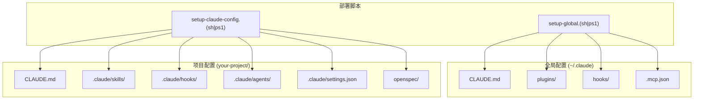
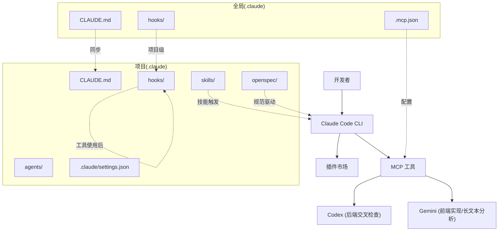
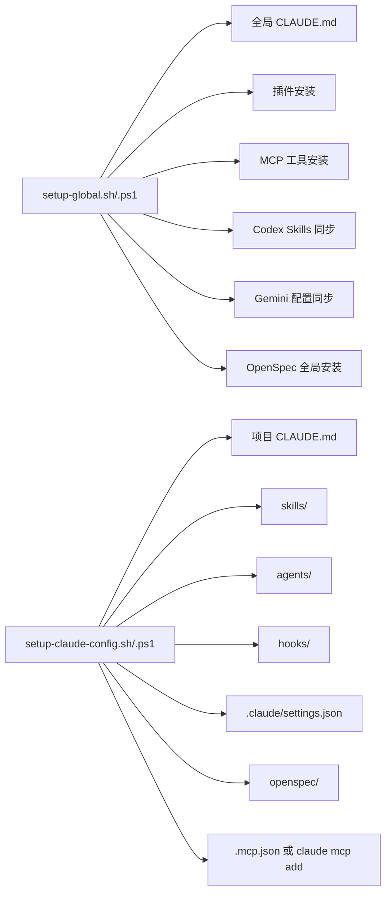

# 快速开始

<cite>
**本文引用的文件**
- [README.md](file://README.md)
- [setup-claude-config.sh](file://setup-claude-config.sh)
- [setup-claude-config.ps1](file://setup-claude-config.ps1)
- [setup-global.sh](file://setup-global.sh)
- [setup-global.ps1](file://setup-global.ps1)
- [settings.json](file://settings.json)
- [.mcp.json](file://.mcp.json)
- [CLAUDE.md](file://CLAUDE.md)
- [skills/skill-rules.json](file://skills/skill-rules.json)
- [hooks/skill-activation-prompt.sh](file://hooks/skill-activation-prompt.sh)
- [hooks/post-tool-use-tracker.sh](file://hooks/post-tool-use-tracker.sh)
- [agents/README.md](file://agents/README.md)
- [skills/dev-workflow/SKILL.md](file://skills/dev-workflow/SKILL.md)
</cite>

## 目录
1. [简介](#简介)
2. [项目结构](#项目结构)
3. [核心组件](#核心组件)
4. [架构总览](#架构总览)
5. [详细组件解析](#详细组件解析)
6. [依赖关系分析](#依赖关系分析)
7. [性能注意事项](#性能注意事项)
8. [故障排查指南](#故障排查指南)
9. [结论](#结论)
10. [附录](#附录)

## 简介
本指南面向新手开发者，帮助你在最短时间内完成 ontologyDevOS 的环境搭建与配置。内容覆盖 macOS/Linux 与 Windows 的完整部署流程，包含“新机器完整配置”和“仅部署到项目”两种场景，并逐项解释部署脚本的作用、参数与常见问题的解决方案。

## 项目结构
该仓库提供一套“模板化”的 Claude Code 配置与工作流基础设施，核心包括：
- 全局配置模板：全局 CLAUDE.md、插件、MCP 工具、全局 hooks
- 项目级配置模板：CLAUDE.md、skills、hooks、agents、OpenSpec 目录结构
- 部署脚本：macOS/Linux 与 Windows 的全局与项目级一键部署脚本

图表来源
- [setup-global.sh](file://setup-global.sh#L1-L471)
- [setup-claude-config.sh](file://setup-claude-config.sh#L1-L372)
- [setup-global.ps1](file://setup-global.ps1#L1-L470)
- [setup-claude-config.ps1](file://setup-claude-config.ps1#L1-L385)

章节来源
- [README.md](file://README.md#L71-L92)

## 核心组件
- 全局 CLAUDE.md：定义多 AI 协同与 SDD 工作流的主体规则
- 项目级 CLAUDE.md：结合 OpenSpec 的三阶段工作流与交叉检查规范
- 插件与 MCP：Claude Code 插件市场与 Codex/Gemini MCP 工具
- Skills 与 Hooks：技能触发规则、项目级 hooks 与工具使用跟踪
- Agents：可即用的专用 Agent 模板
- OpenSpec：规范驱动开发的提案-实现-归档工作流

章节来源
- [CLAUDE.md](file://CLAUDE.md#L1-L440)
- [README.md](file://README.md#L94-L139)

## 架构总览
下图展示了“全局配置”与“项目级配置”的关系，以及 MCP 工具如何被注入到 Claude Code 中：

图表来源
- [setup-global.sh](file://setup-global.sh#L223-L265)
- [setup-claude-config.sh](file://setup-claude-config.sh#L236-L283)
- [.mcp.json](file://.mcp.json#L1-L19)
- [settings.json](file://settings.json#L1-L37)

## 详细组件解析

### macOS/Linux 快速开始
- 新机器完整配置
  1) 克隆仓库到全局路径
  2) 运行全局配置脚本，安装插件、MCP、全局 CLAUDE.md 与 hooks
  3) 在目标项目中运行项目配置脚本，安装项目级 CLAUDE.md、skills、agents、hooks、OpenSpec 与 MCP
- 仅部署到项目
  1) 进入项目目录
  2) 运行项目配置脚本，按需选择安装内容

章节来源
- [README.md](file://README.md#L14-L38)
- [setup-global.sh](file://setup-global.sh#L1-L471)
- [setup-claude-config.sh](file://setup-claude-config.sh#L1-L372)

### Windows 快速开始
- 新机器完整配置
  1) 克隆仓库到用户目录
  2) 运行全局配置脚本（PowerShell）
  3) 在项目中运行项目配置脚本
- 仅部署到项目
  1) 进入项目目录
  2) 运行项目配置脚本（可传入 -TargetDir 参数）

章节来源
- [README.md](file://README.md#L40-L69)
- [setup-global.ps1](file://setup-global.ps1#L1-L470)
- [setup-claude-config.ps1](file://setup-claude-config.ps1#L1-L385)

### 部署脚本详解

#### setup-global.(sh|ps1)
作用
- 安装/校验 Node.js、Python、uv 等前置条件
- 安装 Claude Code、Codex、Gemini CLI
- 安装/同步全局 CLAUDE.md、插件、MCP 工具
- 同步 Codex Skills 与 Gemini 配置
- 可选安装 OpenSpec
- 安装全局 hooks 并验证

参数与交互
- 交互式选择插件与 MCP 工具安装
- 可选安装 OpenSpec

章节来源
- [setup-global.sh](file://setup-global.sh#L1-L471)
- [setup-global.ps1](file://setup-global.ps1#L1-L470)

#### setup-claude-config.(sh|ps1)
作用
- 在任意项目中一键部署 Claude Code 基础设施
- 创建 .claude 目录结构与 .devos 目录
- 安装 CLAUDE.md、hooks、skills、agents
- 可选安装 OpenSpec 并初始化
- 可选安装 MCP 工具（优先使用 .mcp.json 模板，否则回退到 claude mcp add）

参数与交互
- 交互式选择安装的 skills
- 交互式决定是否安装 agents、OpenSpec、MCP 工具
- Windows 版本支持 -TargetDir 指定目标目录

章节来源
- [setup-claude-config.sh](file://setup-claude-config.sh#L1-L372)
- [setup-claude-config.ps1](file://setup-claude-config.ps1#L1-L385)

### 全局与项目级配置要点

- 全局配置（~/.claude）
  - CLAUDE.md：定义多 AI 协同与 SDD 工作流的主体规则
  - 插件：claude-mem、superpowers、pyright-lsp、pinecone、commit-commands、code-review
  - MCP：codex、gemini-cli
  - 全局 hooks：技能激活提示与工具使用跟踪

- 项目级配置（your-project/.claude）
  - CLAUDE.md：结合 OpenSpec 的三阶段工作流与交叉检查
  - skills：dev-workflow、git-workflow、python-backend-guidelines、python-error-tracking、skill-developer、openspec-workflow
  - hooks：技能激活提示、工具使用后跟踪
  - agents：可即用的 Agent 模板
  - settings.json：权限、钩子与编辑/写入工具的自动化行为
  - openspec/：OpenSpec 规范与变更提案目录

章节来源
- [README.md](file://README.md#L197-L216)
- [CLAUDE.md](file://CLAUDE.md#L1-L440)
- [settings.json](file://settings.json#L1-L37)
- [skills/skill-rules.json](file://skills/skill-rules.json#L1-L250)
- [agents/README.md](file://agents/README.md#L1-L301)

### MCP 工具配置
- .mcp.json 模板：定义 codex 与 gemini-cli 的启动方式
- 项目级脚本优先复制 .mcp.json，否则回退到 claude mcp add 命令

章节来源
- [.mcp.json](file://.mcp.json#L1-L19)
- [setup-claude-config.sh](file://setup-claude-config.sh#L244-L282)
- [setup-claude-config.ps1](file://setup-claude-config.ps1#L253-L299)

### Hooks 机制
- 技能激活钩子：在用户提交提示时触发，调用 TypeScript 脚本进行技能匹配与提示
- 工具使用后跟踪：记录编辑文件、识别仓库、生成构建与类型检查命令，便于后续验证

章节来源
- [hooks/skill-activation-prompt.sh](file://hooks/skill-activation-prompt.sh#L1-L6)
- [hooks/post-tool-use-tracker.sh](file://hooks/post-tool-use-tracker.sh#L1-L178)
- [settings.json](file://settings.json#L13-L35)

### OpenSpec 集成
- 项目级脚本可选择安装 OpenSpec（Node.js >= 20）
- 自动初始化 openspec/ 目录，注入命令，提供 project.md 模板
- 与 CLAUDE.md 的三阶段工作流统一

章节来源
- [setup-claude-config.sh](file://setup-claude-config.sh#L196-L234)
- [setup-claude-config.ps1](file://setup-claude-config.ps1#L197-L243)
- [CLAUDE.md](file://CLAUDE.md#L285-L308)

### Skills 与触发规则
- skill-rules.json：定义技能类型、触发关键词、意图正则、文件路径与内容模式
- 项目级可按需选择安装多个技能，或全部安装

章节来源
- [skills/skill-rules.json](file://skills/skill-rules.json#L1-L250)
- [setup-claude-config.sh](file://setup-claude-config.sh#L98-L151)
- [setup-claude-config.ps1](file://setup-claude-config.ps1#L99-L142)

### Agents 使用
- agents/ 下提供多种专用 Agent 模板，可直接复制到项目使用
- 部分 Agent 需要定制（如截图路径、JWT 认证等）

章节来源
- [agents/README.md](file://agents/README.md#L1-L301)

## 依赖关系分析

图表来源
- [setup-global.sh](file://setup-global.sh#L130-L368)
- [setup-claude-config.sh](file://setup-claude-config.sh#L60-L283)
- [setup-global.ps1](file://setup-global.ps1#L111-L347)
- [setup-claude-config.ps1](file://setup-claude-config.ps1#L38-L301)

章节来源
- [setup-global.sh](file://setup-global.sh#L1-L471)
- [setup-claude-config.sh](file://setup-claude-config.sh#L1-L372)
- [setup-global.ps1](file://setup-global.ps1#L1-L470)
- [setup-claude-config.ps1](file://setup-claude-config.ps1#L1-L385)

## 性能注意事项
- 优先使用 .mcp.json 模板而非动态 claude mcp add，减少重复安装开销
- 仅在必要时安装 OpenSpec，避免不必要的 Node.js 依赖
- 合理选择 skills，避免过多触发规则导致不必要的计算
- hooks 中的工具使用后跟踪会生成缓存文件，定期清理可降低磁盘占用

## 故障排查指南

常见问题与解决
- Node.js 版本过低
  - 症状：全局/项目脚本报错，提示 Node.js >= 20
  - 解决：升级 Node.js 至 20+
- uv 未安装（Codex MCP）
  - 症状：安装 Codex MCP 失败
  - 解决：安装 uv（参考脚本内提示链接）
- Claude CLI 未找到
  - 症状：安装插件或 MCP 时报错
  - 解决：先安装 Claude Code CLI，再重试
- Windows 脚本执行策略限制
  - 症状：PowerShell 报错无法执行
  - 解决：执行 Set-ExecutionPolicy -ExecutionPolicy RemoteSigned -Scope CurrentUser
- OpenSpec 初始化失败
  - 症状：openspec init 报错
  - 解决：手动执行 openspec init，或检查 Node.js 版本
- JSON 校验失败
  - 症状：settings.json 或 skill-rules.json 语法错误
  - 解决：使用 Python3 的 json.tool 检查并修正

章节来源
- [setup-global.sh](file://setup-global.sh#L46-L76)
- [setup-claude-config.sh](file://setup-claude-config.sh#L197-L233)
- [setup-global.ps1](file://setup-global.ps1#L22-L51)
- [setup-claude-config.ps1](file://setup-claude-config.ps1#L198-L243)
- [README.md](file://README.md#L66-L69)

## 结论
通过本指南，你可以：
- 在新机器上快速完成全局配置（插件、MCP、CLAUDE.md、hooks、OpenSpec）
- 将基础设施一键部署到任意项目（CLAUDE.md、skills、agents、hooks、OpenSpec、MCP）
- 理解各组件职责与交互关系，定位并解决常见问题
- 基于 CLAUDE.md 与 OpenSpec 的三阶段工作流开展规范驱动开发

## 附录

### 术语表
- CLAUDE.md：Claude Code 的行为规则与工作流规范
- MCP：Model Context Protocol，用于将外部工具注入 Claude
- OpenSpec：规范驱动开发（SDD）工作流工具
- Skills：可复用的开发技能模板
- Agents：专用的多步任务代理

### 参考资料
- [OpenSpec](https://github.com/Fission-AI/OpenSpec)
- [Claude Code](https://github.com/anthropics/claude-code)
- [Codex MCP](https://github.com/GuDaStudio/codexmcp)
- [Gemini MCP](https://github.com/jamubc/gemini-mcp-tool)
- [Superpowers](https://github.com/obra/superpowers-marketplace)