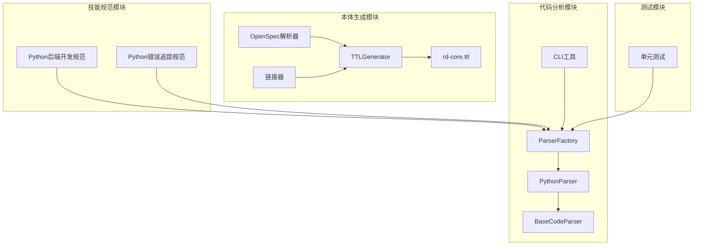
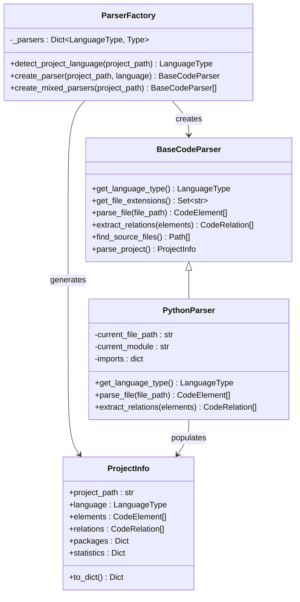
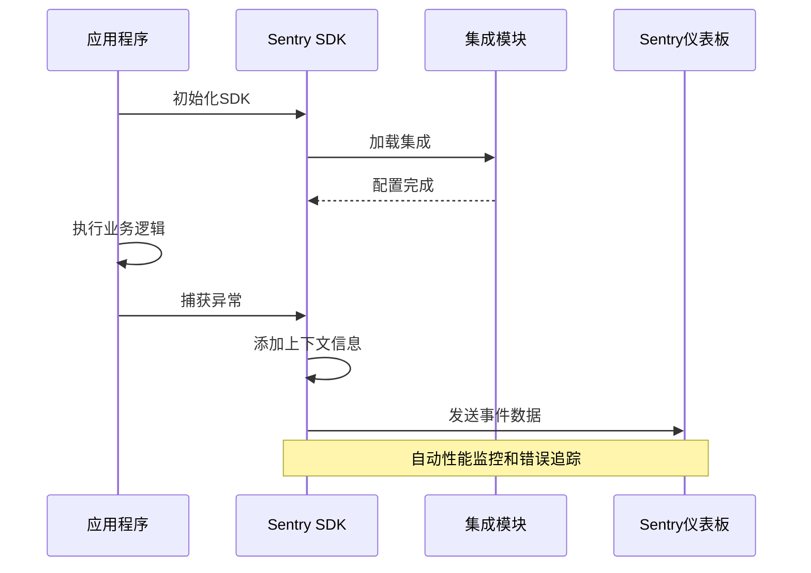
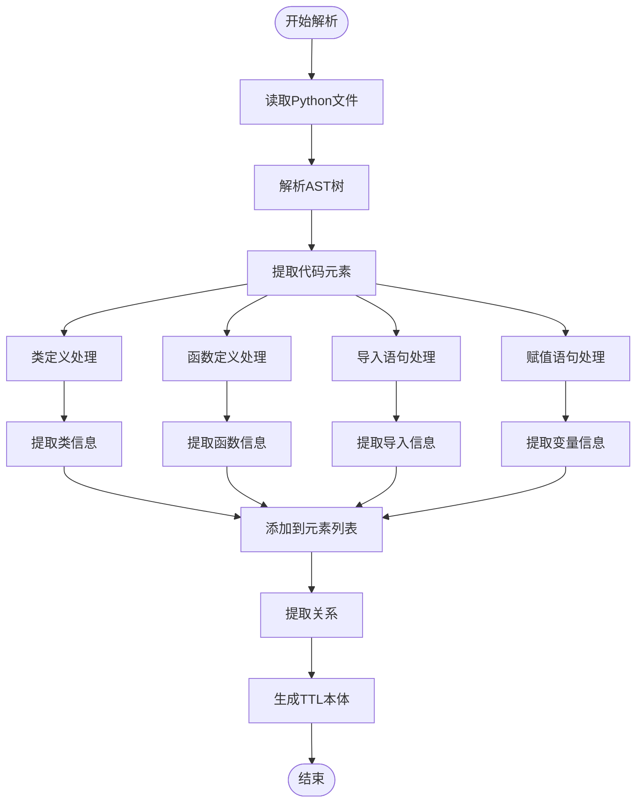
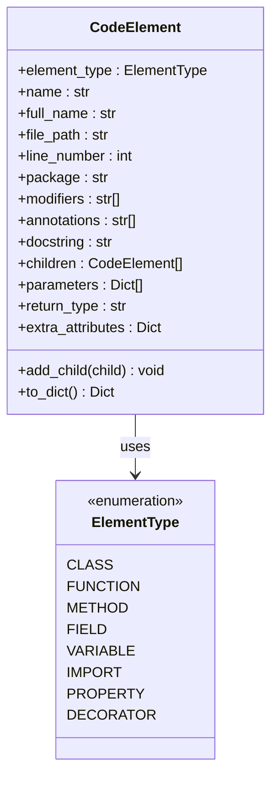
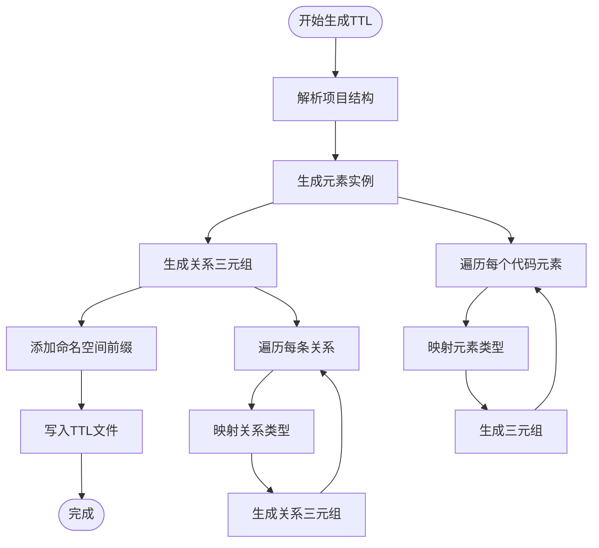
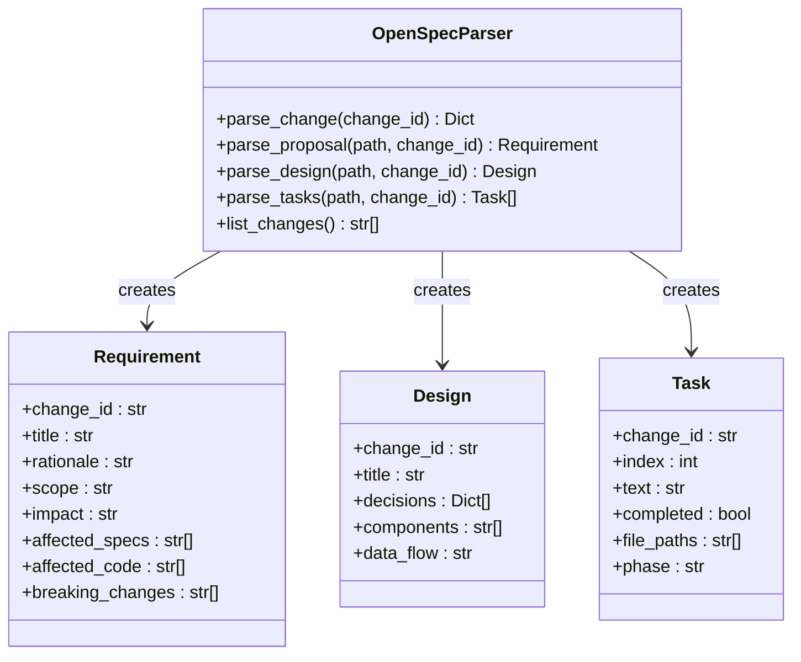
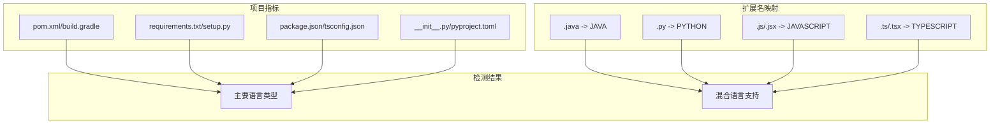

# 专业技能模块

<cite>
**本文档引用的文件**
- [skills/python-backend-guidelines/SKILL.md](file://skills/python-backend-guidelines/SKILL.md)
- [skills/python-error-tracking/SKILL.md](file://skills/python-error-tracking/SKILL.md)
- [code_processor/python_parser.py](file://code_processor/python_parser.py)
- [code_processor/base_parser.py](file://code_processor/base_parser.py)
- [code_processor/parser_factory.py](file://code_processor/parser_factory.py)
- [code_processor/cli.py](file://code_processor/cli.py)
- [code_processor/requirements.txt](file://code_processor/requirements.txt)
- [rd_ontology/ttl_generator.py](file://rd_ontology/ttl_generator.py)
- [rd_ontology/rd-core.ttl](file://rd_ontology/rd-core.ttl)
- [sdd_integration/openspec_parser.py](file://sdd_integration/openspec_parser.py)
- [sdd_integration/linker.py](file://sdd_integration/linker.py)
- [tests/test_code_processor.py](file://tests/test_code_processor.py)
- [skills/skill-rules.json](file://skills/skill-rules.json)
</cite>

## 目录
1. [引言](#引言)
2. [项目结构](#项目结构)
3. [核心组件](#核心组件)
4. [架构概览](#架构概览)
5. [详细组件分析](#详细组件分析)
6. [依赖关系分析](#依赖关系分析)
7. [性能考虑](#性能考虑)
8. [故障排除指南](#故障排除指南)
9. [结论](#结论)
10. [附录](#附录)

## 引言

本文件是针对"专业技能模块"的综合技术文档，重点涵盖Python后端开发规范和Python错误追踪规范两大核心技能领域。该模块旨在为开发者提供：

- **Python后端开发最佳实践**：包括分层架构设计、API设计模式、异步编程、数据库访问、数据验证、错误处理等
- **Sentry错误追踪系统**：涵盖安装配置、错误处理模式、性能监控、背景任务追踪、上下文设置等
- **代码分析与本体生成**：通过代码解析器提取代码结构，生成R&D本体数据

本指南结合实际代码实现，提供可操作的配置参数、故障排除方法和最佳实践建议。

## 项目结构

该项目采用模块化设计，主要包含以下核心模块：



**图表来源**
- [code_processor/parser_factory.py](file://code_processor/parser_factory.py#L20-L171)
- [code_processor/python_parser.py](file://code_processor/python_parser.py#L22-L148)
- [rd_ontology/ttl_generator.py](file://rd_ontology/ttl_generator.py#L18-L86)

**章节来源**
- [code_processor/parser_factory.py](file://code_processor/parser_factory.py#L1-L248)
- [code_processor/python_parser.py](file://code_processor/python_parser.py#L1-L455)
- [code_processor/base_parser.py](file://code_processor/base_parser.py#L1-L358)

## 核心组件

### Python后端开发规范

该规范定义了Python后端开发的完整指导原则，涵盖从架构设计到部署运维的各个方面：

#### 分层架构模式
- **路由层**：仅负责请求路由，不包含业务逻辑
- **视图层**：处理HTTP请求和响应
- **服务层**：封装核心业务逻辑
- **仓储层**：数据访问抽象（可选）
- **ORM层**：数据库交互

#### 最佳实践要点
- 使用类型提示确保代码健壮性
- 采用Pydantic进行数据验证
- 实现异步编程模式
- 建立完整的错误处理机制
- 集成Sentry进行错误追踪

**章节来源**
- [skills/python-backend-guidelines/SKILL.md](file://skills/python-backend-guidelines/SKILL.md#L40-L115)
- [skills/python-backend-guidelines/SKILL.md](file://skills/python-backend-guidelines/SKILL.md#L298-L596)

### Python错误追踪规范

该规范专注于Sentry集成和错误追踪的最佳实践：

#### 安装配置
```bash
# FastAPI集成
pip install sentry-sdk[fastapi]

# Django集成  
pip install sentry-sdk[django]

# Celery背景任务
pip install sentry-sdk[celery]
```

#### 错误处理模式
- **预期业务错误**：400级别错误，不发送到Sentry
- **意外异常**：捕获并发送到Sentry，添加上下文信息
- **性能监控**：使用自定义span跟踪关键操作

**章节来源**
- [skills/python-error-tracking/SKILL.md](file://skills/python-error-tracking/SKILL.md#L27-L75)
- [skills/python-error-tracking/SKILL.md](file://skills/python-error-tracking/SKILL.md#L78-L200)

## 架构概览

### 代码分析架构



**图表来源**
- [code_processor/base_parser.py](file://code_processor/base_parser.py#L206-L358)
- [code_processor/python_parser.py](file://code_processor/python_parser.py#L22-L148)
- [code_processor/parser_factory.py](file://code_processor/parser_factory.py#L20-L171)

### 错误追踪架构



**图表来源**
- [skills/python-error-tracking/SKILL.md](file://skills/python-error-tracking/SKILL.md#L35-L74)
- [skills/python-error-tracking/SKILL.md](file://skills/python-error-tracking/SKILL.md#L205-L248)

## 详细组件分析

### Python解析器组件

#### AST解析实现

Python解析器使用Python内置的AST模块进行深度代码分析：



**图表来源**
- [code_processor/python_parser.py](file://code_processor/python_parser.py#L37-L63)
- [code_processor/python_parser.py](file://code_processor/python_parser.py#L200-L313)

#### 关系提取算法

解析器能够识别多种代码关系：

| 关系类型 | 描述 | 示例 |
|---------|------|------|
| 继承关系(INHERITS) | 类继承其他类 | `class Child(Parent):` |
| 调用关系(CALLS) | 函数调用其他函数 | `func1()`调用`func2()` |
| 导入关系(IMPORTS) | 模块导入其他模块 | `import os` |
| 装饰关系(DECORATES) | 装饰器应用于元素 | `@property`装饰器 |

**章节来源**
- [code_processor/python_parser.py](file://code_processor/python_parser.py#L64-L136)
- [code_processor/python_parser.py](file://code_processor/python_parser.py#L436-L455)

### 代码元素数据模型

#### CodeElement结构



**图表来源**
- [code_processor/base_parser.py](file://code_processor/base_parser.py#L82-L139)
- [code_processor/base_parser.py](file://code_processor/base_parser.py#L26-L52)

**章节来源**
- [code_processor/base_parser.py](file://code_processor/base_parser.py#L82-L139)
- [code_processor/base_parser.py](file://code_processor/base_parser.py#L141-L171)

### TTL本体生成组件

#### 本体映射规则

TTL生成器将代码元素映射到R&D本体概念：

```mermaid
graph LR
subgraph "代码元素"
A[类(Class)]
B[方法(Method)]
C[字段(Field)]
D[函数(Function)]
E[模块(Module)]
F[导入(Import)]
end
subgraph "本体概念"
G[CodeClass]
H[CodeMethod]
I[CodeField]
J[CodeModule]
end
A --> G
B --> H
C --> I
D --> H
E --> J
F --> J
```

**图表来源**
- [rd_ontology/ttl_generator.py](file://rd_ontology/ttl_generator.py#L21-L40)
- [rd_ontology/rd-core.ttl](file://rd_ontology/rd-core.ttl#L41-L84)

#### TTL生成流程



**图表来源**
- [rd_ontology/ttl_generator.py](file://rd_ontology/ttl_generator.py#L176-L217)
- [rd_ontology/ttl_generator.py](file://rd_ontology/ttl_generator.py#L154-L175)

**章节来源**
- [rd_ontology/ttl_generator.py](file://rd_ontology/ttl_generator.py#L18-L86)
- [rd_ontology/ttl_generator.py](file://rd_ontology/ttl_generator.py#L176-L229)

### OpenSpec集成组件

#### 要求解析器



**图表来源**
- [sdd_integration/openspec_parser.py](file://sdd_integration/openspec_parser.py#L17-L50)
- [sdd_integration/openspec_parser.py](file://sdd_integration/openspec_parser.py#L51-L87)

**章节来源**
- [sdd_integration/openspec_parser.py](file://sdd_integration/openspec_parser.py#L17-L50)
- [sdd_integration/openspec_parser.py](file://sdd_integration/openspec_parser.py#L51-L198)

## 依赖关系分析

### 语言检测机制



**图表来源**
- [code_processor/parser_factory.py](file://code_processor/parser_factory.py#L34-L40)
- [code_processor/parser_factory.py](file://code_processor/parser_factory.py#L25-L32)

### 技能触发机制

基于技能规则的自动激活机制：

| 触发条件 | 关键词 | 文件模式 | 优先级 |
|---------|--------|----------|--------|
| Python后端开发 | route, view, service, repository | **/views.py, **/services.py | high |
| 错误追踪 | error handling, exception, sentry | **/views.py, **/tasks.py | high |
| 数据库操作 | sqlalchemy, database, orm | **/models.py, **/repositories.py | medium |
| API设计 | api, endpoint, router | **/api/**, **/routes.py | medium |

**章节来源**
- [skills/skill-rules.json](file://skills/skill-rules.json#L185-L212)

**章节来源**
- [code_processor/parser_factory.py](file://code_processor/parser_factory.py#L48-L88)
- [code_processor/parser_factory.py](file://code_processor/parser_factory.py#L122-L171)

## 性能考虑

### 解析性能优化

1. **文件过滤**：排除.git、node_modules、__pycache__等目录
2. **增量解析**：支持部分文件重新解析
3. **缓存机制**：元素IRI缓存避免重复计算
4. **内存管理**：及时释放大对象引用

### 错误追踪性能影响

- **采样率控制**：生产环境降低traces_sample_rate
- **异步捕获**：使用异步方式发送错误数据
- **上下文精简**：避免发送过大的上下文数据
- **批量发送**：合并多个事件一起发送

## 故障排除指南

### 常见问题及解决方案

#### Python解析失败
**症状**：解析器返回空元素列表
**可能原因**：
- 语法错误的Python文件
- 编码问题
- 权限不足

**解决步骤**：
1. 检查文件编码格式
2. 验证Python语法正确性
3. 确认文件读取权限

#### Sentry初始化失败
**症状**：应用程序启动时报错
**可能原因**：
- DSN配置错误
- 网络连接问题
- 权限不足

**解决步骤**：
1. 验证DSN格式正确
2. 检查网络连通性
3. 确认环境变量设置

#### TTL生成错误
**症状**：TTL文件生成失败或格式错误
**可能原因**：
- 元素名称冲突
- 特殊字符未转义
- 内存不足

**解决步骤**：
1. 检查元素名称唯一性
2. 验证字符串转义
3. 增加内存限制

**章节来源**
- [code_processor/python_parser.py](file://code_processor/python_parser.py#L57-L62)
- [skills/python-error-tracking/SKILL.md](file://skills/python-error-tracking/SKILL.md#L547-L562)

### 调试技巧

1. **启用详细日志**：使用`-v`参数查看详细输出
2. **单元测试**：运行测试套件验证功能正确性
3. **手动测试**：编写简单脚本验证特定功能
4. **性能分析**：使用profiler分析性能瓶颈

**章节来源**
- [code_processor/cli.py](file://code_processor/cli.py#L23-L29)
- [tests/test_code_processor.py](file://tests/test_code_processor.py#L1-L139)

## 结论

本专业技能模块提供了完整的Python后端开发和错误追踪解决方案：

### 主要成就
- **标准化开发流程**：建立了清晰的分层架构和开发规范
- **完善的错误追踪**：实现了全面的Sentry集成和监控
- **自动化代码分析**：提供了强大的代码结构分析能力
- **本体化知识管理**：支持R&D本体的数据生成和管理

### 技术优势
- **模块化设计**：各组件职责明确，易于维护和扩展
- **类型安全**：广泛使用类型提示确保代码质量
- **测试覆盖**：完整的单元测试保证功能可靠性
- **文档完善**：详细的配置说明和使用指南

### 应用价值
该模块适用于各种规模的Python项目，特别适合需要：
- 企业级后端开发的标准项目
- 需要完善监控体系的应用
- 追求代码质量和可维护性的团队

通过遵循这些规范和最佳实践，开发团队可以显著提升代码质量、开发效率和系统稳定性。

## 附录

### 配置参数参考

#### Python后端开发配置
- **类型提示**：使用标准类型注解
- **Pydantic验证**：定义数据模型和验证规则
- **异步支持**：合理使用async/await
- **错误处理**：建立统一的异常处理机制

#### Sentry配置参数
- **DSN**：Sentry项目标识符
- **环境**：开发/测试/生产环境标识
- **采样率**：性能监控数据采样比例
- **忽略错误**：不需要上报的异常类型

### 快速开始指南

1. **安装依赖**：运行`pip install -r requirements.txt`
2. **配置Sentry**：设置DSN和环境变量
3. **运行分析**：使用CLI工具分析项目结构
4. **生成本体**：转换代码分析结果为TTL格式

**章节来源**
- [code_processor/requirements.txt](file://code_processor/requirements.txt#L1-L8)
- [code_processor/cli.py](file://code_processor/cli.py#L167-L215)