# Hook 机制

<cite>
**本文档引用的文件**
- [settings.json](file://settings.json)
- [hooks/skill-activation-prompt.ts](file://hooks/skill-activation-prompt.ts)
- [hooks/skill-activation-prompt.sh](file://hooks/skill-activation-prompt.sh)
- [hooks/post-tool-use-tracker.sh](file://hooks/post-tool-use-tracker.sh)
- [hooks/package.json](file://hooks/package.json)
- [skills/skill-rules.json](file://skills/skill-rules.json)
- [skills/skill-developer/HOOK_MECHANISMS.md](file://skills/skill-developer/HOOK_MECHANISMES.md)
- [skills/skill-developer/TRIGGER_TYPES.md](file://skills/skill-developer/TRIGGER_TYPES.md)
- [skills/skill-developer/TROUBLESHOOTING.md](file://skills/skill-developer/TROUBLESHOOTING.md)
</cite>

## 目录
1. [简介](#简介)
2. [项目结构](#项目结构)
3. [核心组件](#核心组件)
4. [架构概览](#架构概览)
5. [详细组件分析](#详细组件分析)
6. [依赖关系分析](#依赖关系分析)
7. [性能考虑](#性能考虑)
8. [调试指南](#调试指南)
9. [结论](#结论)

## 简介

Hook 机制是 Claude Code 中实现智能技能自动激活的核心系统。该系统采用两阶段架构设计，通过 UserPromptSubmit Hook（主动建议）和 Post-Tool-Use Hook（工具使用后跟踪）实现完整的技能触发和执行流程。

该机制的核心价值在于：
- **智能化技能推荐**：基于用户提示词内容自动识别相关技能
- **强制性执行控制**：确保关键技能在特定操作前得到执行
- **无侵入式集成**：通过钩子机制无缝嵌入现有工作流程
- **可扩展的触发器系统**：支持关键词、意图模式、文件路径等多种触发方式

## 项目结构

Hook 机制的实现分布在多个关键目录中：

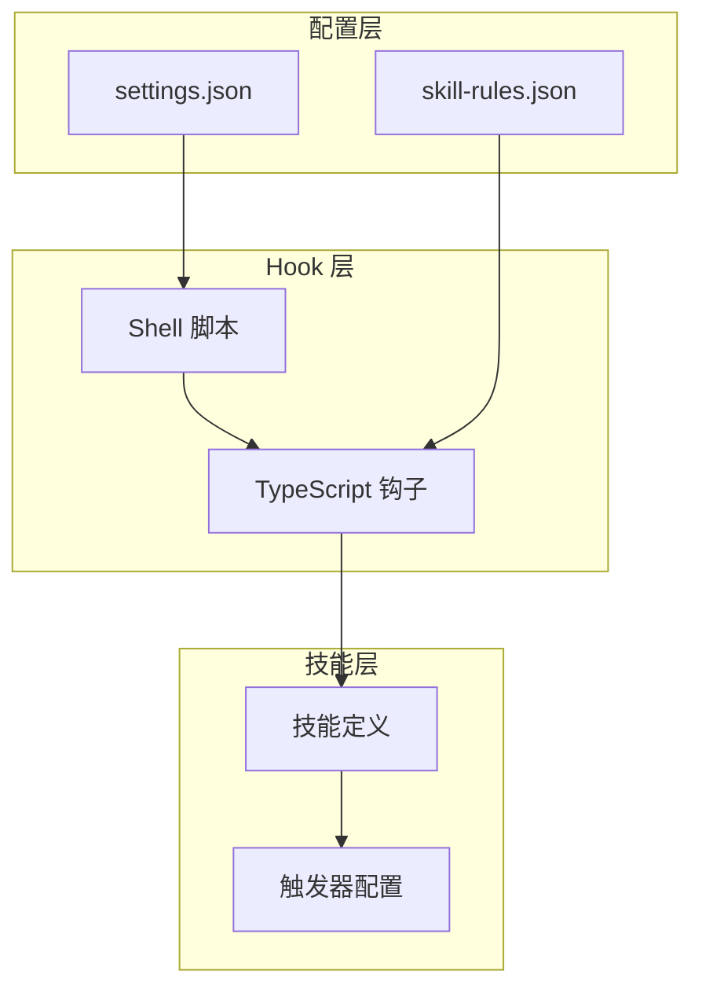

**图表来源**
- [settings.json](file://settings.json#L13-L35)
- [hooks/skill-activation-prompt.ts](file://hooks/skill-activation-prompt.ts#L1-L133)
- [skills/skill-rules.json](file://skills/skill-rules.json#L1-L250)

**章节来源**
- [settings.json](file://settings.json#L1-L37)
- [hooks/package.json](file://hooks/package.json#L1-L17)

## 核心组件

### 两阶段 Hook 架构

Hook 机制采用双阶段设计，确保技能触发的准确性和有效性：

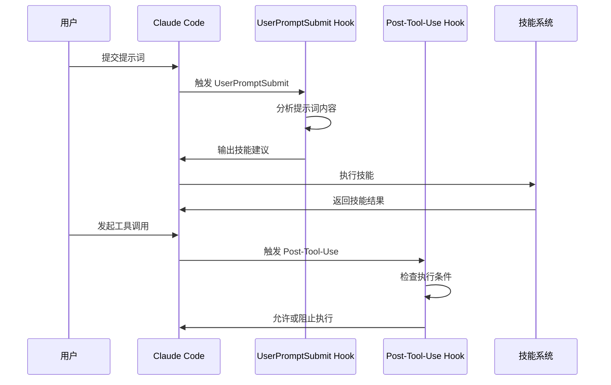

**图表来源**
- [skills/skill-developer/HOOK_MECHANISMS.md](file://skills/skill-developer/HOOK_MECHANISMS.md#L15-L120)

### 触发器类型系统

系统支持四种主要触发器类型，每种都有其特定的应用场景：

| 触发器类型 | 匹配方式 | 应用场景 | 性能特征 |
|------------|----------|----------|----------|
| 关键词触发器 | 字符串包含匹配 | 明确主题识别 | O(n) 时间复杂度 |
| 意图模式触发器 | 正则表达式匹配 | 隐含意图检测 | O(m) 正则匹配开销 |
| 文件路径触发器 | Glob 模式匹配 | 基于位置的激活 | O(p) 模式编译开销 |
| 内容模式触发器 | 文件内容正则匹配 | 技术栈识别 | O(f) 文件读取开销 |

**章节来源**
- [skills/skill-developer/TRIGGER_TYPES.md](file://skills/skill-developer/TRIGGER_TYPES.md#L15-L306)

## 架构概览

### 整体系统架构

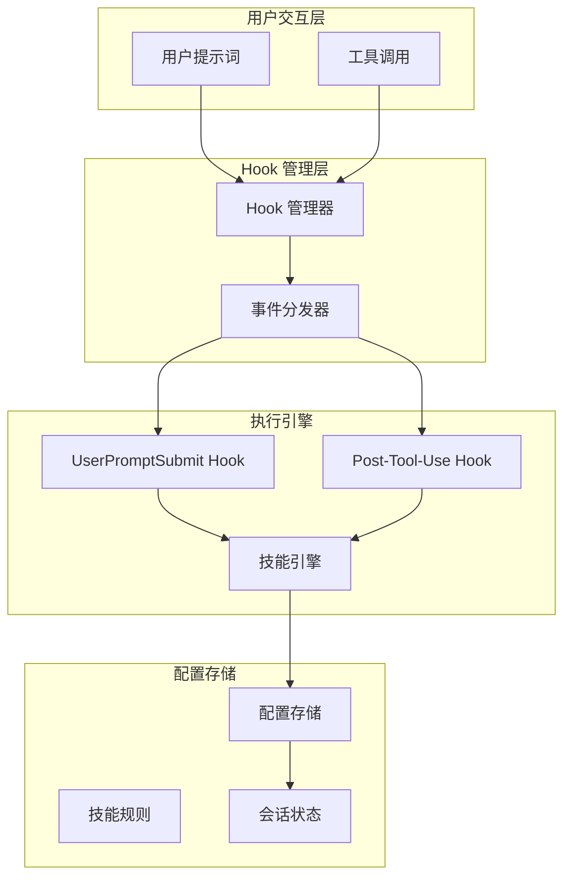

**图表来源**
- [settings.json](file://settings.json#L13-L35)
- [skills/skill-developer/HOOK_MECHANISMS.md](file://skills/skill-developer/HOOK_MECHANISMS.md#L1-L307)

### 数据流架构

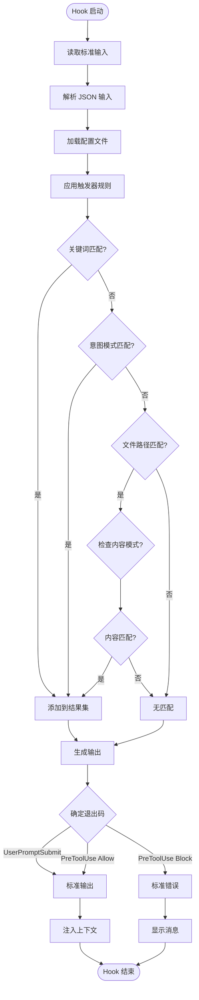

**图表来源**
- [hooks/skill-activation-prompt.ts](file://hooks/skill-activation-prompt.ts#L36-L127)
- [skills/skill-developer/HOOK_MECHANISMS.md](file://skills/skill-developer/HOOK_MECHANISMS.md#L170-L189)

## 详细组件分析

### UserPromptSubmit Hook 组件

UserPromptSubmit Hook 是两阶段 Hook 架构中的第一阶段，负责在用户提交提示词时提供技能建议。

#### 核心功能实现

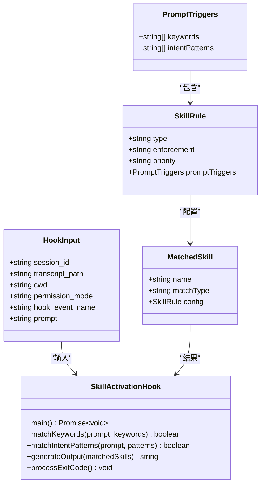

**图表来源**
- [hooks/skill-activation-prompt.ts](file://hooks/skill-activation-prompt.ts#L5-L34)

#### 执行流程详解

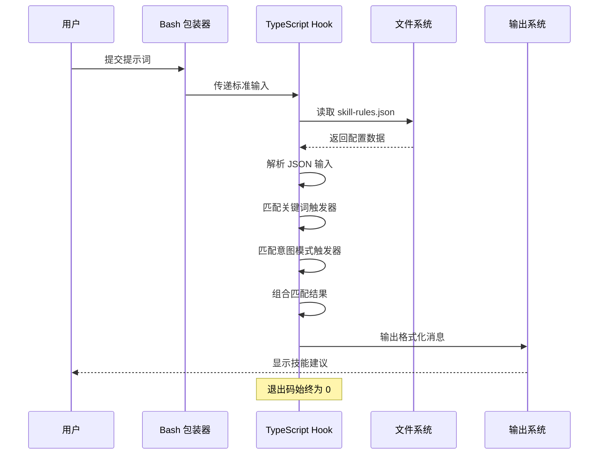

**图表来源**
- [hooks/skill-activation-prompt.sh](file://hooks/skill-activation-prompt.sh#L1-L6)
- [hooks/skill-activation-prompt.ts](file://hooks/skill-activation-prompt.ts#L36-L127)

#### 关键实现特性

1. **多级匹配策略**：同时支持关键词和意图模式匹配，提高识别准确性
2. **优先级分组**：按 critical → high → medium → low 顺序组织技能建议
3. **非阻塞设计**：始终返回退出码 0，确保不影响用户交互
4. **格式化输出**：提供统一的消息格式，便于 Claude 处理

**章节来源**
- [hooks/skill-activation-prompt.ts](file://hooks/skill-activation-prompt.ts#L1-L133)
- [hooks/skill-activation-prompt.sh](file://hooks/skill-activation-prompt.sh#L1-L6)

### Post-Tool-Use Hook 组件

Post-Tool-Use Hook 是第二阶段 Hook，负责在工具使用后进行跟踪和验证。

#### 核心功能实现

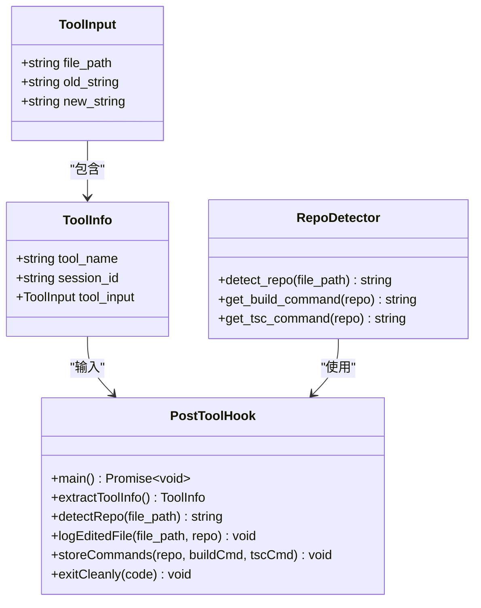

**图表来源**
- [hooks/post-tool-use-tracker.sh](file://hooks/post-tool-use-tracker.sh#L12-L141)

#### 执行流程详解

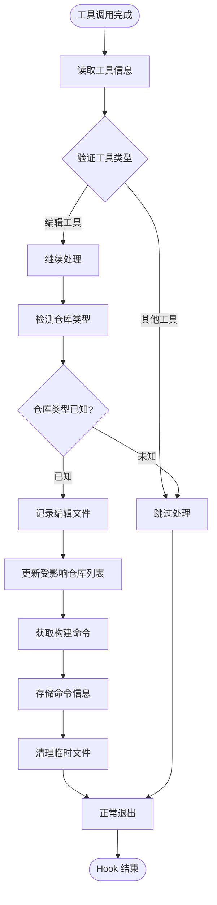

**图表来源**
- [hooks/post-tool-use-tracker.sh](file://hooks/post-tool-use-tracker.sh#L8-L178)

#### 关键实现特性

1. **智能仓库检测**：根据文件路径自动识别前端、后端、数据库等仓库类型
2. **构建命令管理**：自动检测并存储各仓库的构建和类型检查命令
3. **缓存机制**：使用会话 ID 创建独立的缓存目录，避免冲突
4. **多包管理**：支持 monorepo 结构，正确识别各个包的边界

**章节来源**
- [hooks/post-tool-use-tracker.sh](file://hooks/post-tool-use-tracker.sh#L1-L178)

### 触发器系统组件

触发器系统是 Hook 机制的核心，提供了灵活的技能激活策略。

#### 触发器配置结构

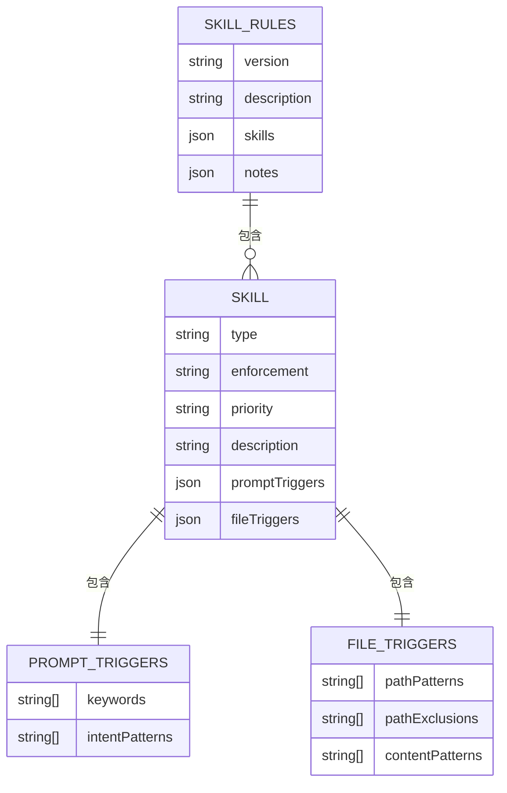

**图表来源**
- [skills/skill-rules.json](file://skills/skill-rules.json#L1-L250)

#### 触发器匹配算法

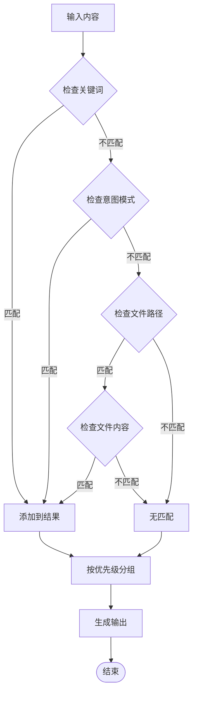

**图表来源**
- [hooks/skill-activation-prompt.ts](file://hooks/skill-activation-prompt.ts#L57-L78)

**章节来源**
- [skills/skill-rules.json](file://skills/skill-rules.json#L1-L250)
- [skills/skill-developer/TRIGGER_TYPES.md](file://skills/skill-developer/TRIGGER_TYPES.md#L1-L306)

## 依赖关系分析

### 外部依赖关系

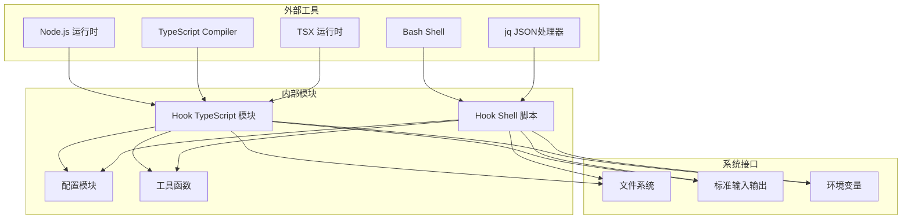

**图表来源**
- [hooks/package.json](file://hooks/package.json#L11-L15)
- [hooks/skill-activation-prompt.sh](file://hooks/skill-activation-prompt.sh#L1-L6)

### 内部模块依赖

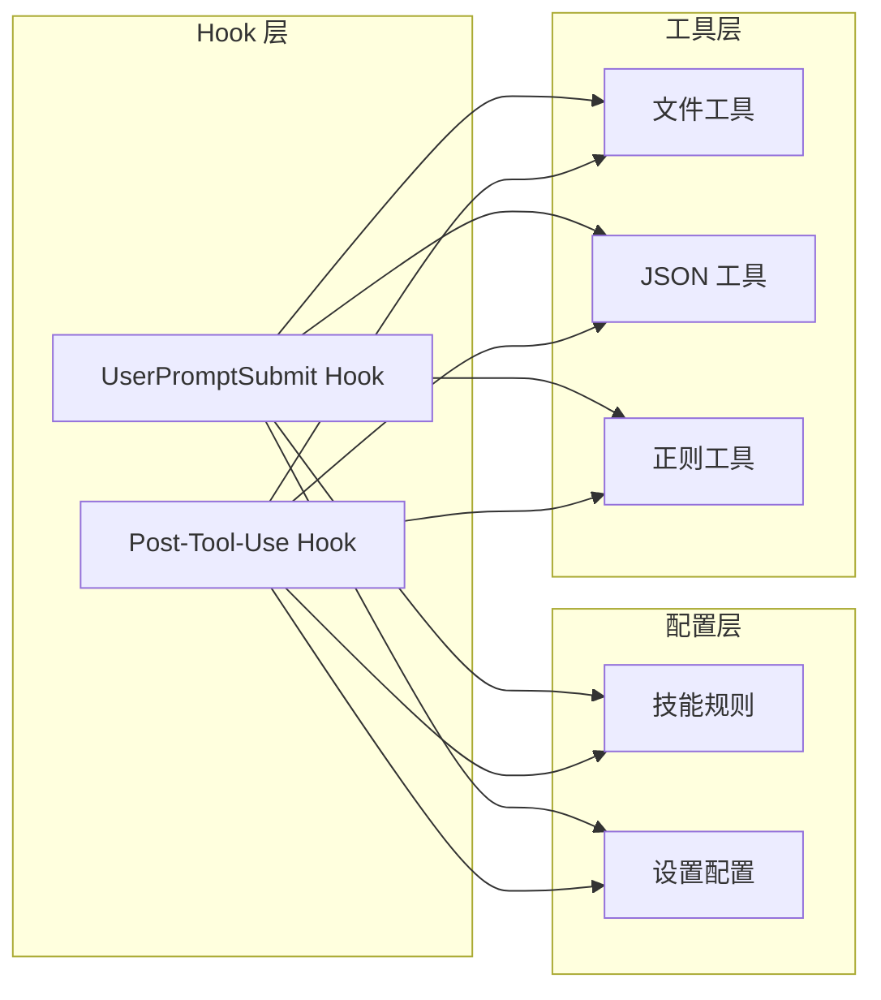

**图表来源**
- [settings.json](file://settings.json#L13-L35)
- [skills/skill-rules.json](file://skills/skill-rules.json#L1-L250)

**章节来源**
- [hooks/package.json](file://hooks/package.json#L1-L17)

## 性能考虑

### 性能基准指标

系统针对不同 Hook 类型设定了明确的性能目标：

| Hook 类型 | 性能目标 | 主要瓶颈 | 优化策略 |
|-----------|----------|----------|----------|
| UserPromptSubmit | < 100ms | JSON 解析、正则匹配 | 缓存编译后的正则表达式 |
| PreToolUse | < 200ms | 文件系统访问、正则匹配 | 懒加载、模式预编译 |
| Post-Tool-Use | < 50ms | I/O 操作 | 批量写入、异步处理 |

### 性能优化策略

#### 编译时优化

1. **正则表达式缓存**：将常用的正则表达式编译结果缓存到内存中
2. **文件路径预编译**：对 Glob 模式进行预编译，减少运行时开销
3. **配置文件缓存**：缓存 skill-rules.json 到内存，避免重复读取

#### 运行时优化

1. **短路求值**：在匹配失败时尽早退出，避免不必要的计算
2. **增量更新**：只在配置文件变化时重新加载
3. **并发处理**：对独立的匹配任务进行并行处理

#### 内存管理

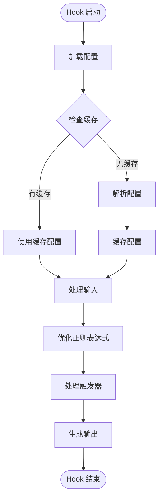

**图表来源**
- [skills/skill-developer/HOOK_MECHANISMS.md](file://skills/skill-developer/HOOK_MECHANISMS.md#L260-L301)

**章节来源**
- [skills/skill-developer/HOOK_MECHANISMS.md](file://skills/skill-developer/HOOK_MECHANISMS.md#L260-L301)

## 调试指南

### 常见问题诊断

#### UserPromptSubmit Hook 问题

| 问题症状 | 可能原因 | 诊断步骤 | 解决方案 |
|----------|----------|----------|----------|
| 无技能建议 | 关键词不匹配 | 检查 skill-rules.json 中的 keywords | 添加更多关键词变体 |
| 意图模式不工作 | 正则表达式过于严格 | 使用 regex101.com 测试模式 | 放宽模式范围 |
| JSON 解析错误 | 配置文件语法错误 | 使用 jq 验证 JSON 格式 | 修正 JSON 语法 |
| 性能问题 | 触发器过多 | 分析匹配模式复杂度 | 精简触发器配置 |

#### Post-Tool-Use Hook 问题

| 问题症状 | 可能原因 | 诊断步骤 | 解决方案 |
|----------|----------|----------|----------|
| 仓库识别错误 | 文件路径不匹配 | 检查 detect_repo 函数逻辑 | 调整仓库检测规则 |
| 构建命令缺失 | 缺少构建配置 | 检查 package.json 和 tsconfig.json | 添加缺失的配置文件 |
| 缓存目录权限问题 | 文件系统权限不足 | 检查 .claude 目录权限 | 修复目录权限设置 |
| 性能延迟 | I/O 操作过多 | 分析日志中的时间戳 | 实施异步写入 |

### 调试命令集合

#### UserPromptSubmit 调试

```bash
# 基础测试命令
echo '{"session_id":"test","prompt":"your test prompt"}' | \
  npx tsx .claude/hooks/skill-activation-prompt.ts

# 验证配置文件
cat .claude/skills/skill-rules.json | jq .

# 检查 Hook 注册状态
cat .claude/settings.json | jq '.hooks.UserPromptSubmit'

# 性能测试
time echo '{"prompt":"test"}' | npx tsx .claude/hooks/skill-activation-prompt.ts
```

#### Post-Tool-Use 调试

```bash
# 基础测试命令
cat <<'EOF' | npx tsx .claude/hooks/post-tool-use-tracker.sh
{
  "session_id": "test",
  "tool_name": "Edit",
  "tool_input": {"file_path": "/path/to/test/file.ts"}
}
EOF

# 检查缓存目录
ls -la .claude/tsc-cache/

# 查看编辑文件日志
cat .claude/tsc-cache/default/edited-files.log

# 性能测试
time cat <<'EOF' | npx tsx .claude/hooks/post-tool-use-tracker.sh
{"tool_name":"Edit","tool_input":{"file_path":"test.ts"}}
EOF
```

### 错误处理机制

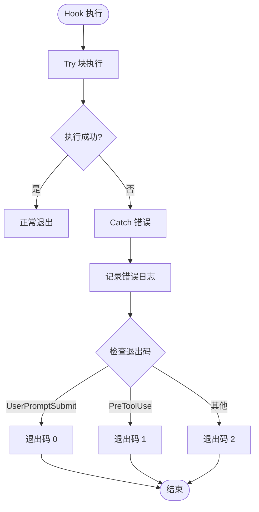

**图表来源**
- [hooks/skill-activation-prompt.ts](file://hooks/skill-activation-prompt.ts#L123-L132)

**章节来源**
- [skills/skill-developer/TROUBLESHOOTING.md](file://skills/skill-developer/TROUBLESHOOTING.md#L1-L515)

## 结论

Hook 机制通过精心设计的两阶段架构，实现了智能、高效且可扩展的技能自动激活系统。该系统的关键优势包括：

1. **智能化触发**：通过多种触发器类型实现精确的技能识别
2. **无侵入式设计**：保持与现有工作流程的完全兼容性
3. **可扩展性**：支持动态配置和未来功能增强
4. **性能优化**：针对不同 Hook 类型设定明确的性能目标

随着系统的持续演进，可以预期在以下方面获得进一步改进：
- 动态规则热重载
- 更智能的技能依赖管理
- 条件化执行控制
- 完善的使用统计分析

这套 Hook 机制为 Claude Code 的技能系统奠定了坚实的技术基础，为未来的 AI 协作开发提供了强大的支撑。