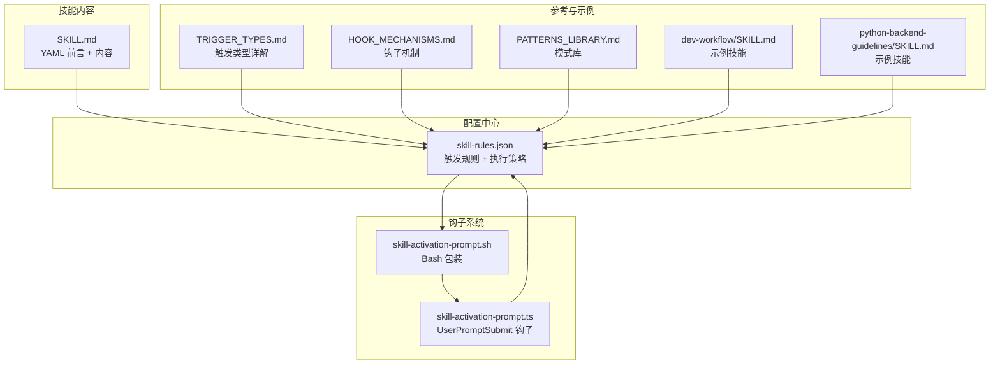
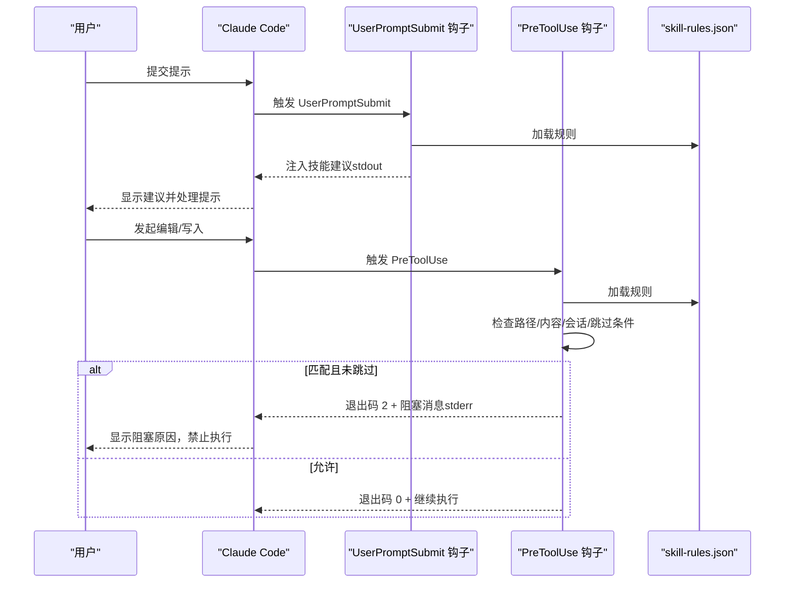
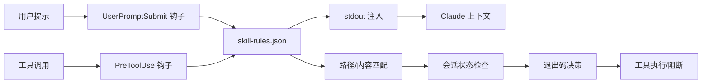

# 技能开发指南

<cite>
**本文档引用的文件**
- [SKILL.md](file://skills/skill-developer/SKILL.md)
- [skill-rules.json](file://skills/skill-rules.json)
- [TRIGGER_TYPES.md](file://skills/skill-developer/TRIGGER_TYPES.md)
- [HOOK_MECHANISMES.md](file://skills/skill-developer/HOOK_MECHANISMS.md)
- [ADVANCED.md](file://skills/skill-developer/ADVANCED.md)
- [TROUBLESHOOTING.md](file://skills/skill-developer/TROUBLESHOOTING.md)
- [PATTERNS_LIBRARY.md](file://skills/skill-developer/PATTERNS_LIBRARY.md)
- [skill-activation-prompt.ts](file://hooks/skill-activation-prompt.ts)
- [skill-activation-prompt.sh](file://hooks/skill-activation-prompt.sh)
- [dev-workflow/SKILL.md](file://skills/dev-workflow/SKILL.md)
- [python-backend-guidelines/SKILL.md](file://skills/python-backend-guidelines/SKILL.md)
- [CLAUDE.md](file://global/codex-skills/writing-skills/examples/CLAUDE_MD_TESTING.md)
</cite>

## 目录
1. [简介](#简介)
2. [项目结构](#项目结构)
3. [核心组件](#核心组件)
4. [架构总览](#架构总览)
5. [详细组件分析](#详细组件分析)
6. [依赖关系分析](#依赖关系分析)
7. [性能考虑](#性能考虑)
8. [故障排除指南](#故障排除指南)
9. [结论](#结论)
10. [附录](#附录)

## 简介
本指南面向希望在 Claude Code 中创建和管理高质量技能的开发者。内容涵盖技能 YAML 前言结构、资源文件组织、触发模式设计、技能测试方法，以及 skill-rules.json 的配置格式、触发条件设置与执行优先级管理。文档还提供最佳实践、调试技巧与性能优化建议，帮助你构建符合 Anthropic 最佳实践的自定义技能。

## 项目结构
该仓库采用“技能 + 规则 + 钩子”的分层组织方式：
- 技能内容：位于 `.claude/skills/{skill-name}/SKILL.md`，采用 YAML 前言定义元信息
- 触发规则：集中于 `.claude/skills/skill-rules.json`，统一管理所有技能的触发条件与执行策略
- 钩子机制：通过 Bash 包装脚本与 TypeScript 钩子实现自动激活与验证拦截
- 参考文档：技能开发指南、触发类型详解、钩子机制、高级特性、故障排除与模式库

图表来源
- [SKILL.md](file://skills/skill-developer/SKILL.md#L1-L427)
- [skill-rules.json](file://skills/skill-rules.json#L1-L250)
- [TRIGGER_TYPES.md](file://skills/skill-developer/TRIGGER_TYPES.md#L1-L306)
- [HOOK_MECHANISMS.md](file://skills/skill-developer/HOOK_MECHANISMS.md#L1-L307)
- [PATTERNS_LIBRARY.md](file://skills/skill-developer/PATTERNS_LIBRARY.md#L1-L153)
- [skill-activation-prompt.ts](file://hooks/skill-activation-prompt.ts#L1-L133)
- [skill-activation-prompt.sh](file://hooks/skill-activation-prompt.sh#L1-L6)
- [dev-workflow/SKILL.md](file://skills/dev-workflow/SKILL.md#L1-L397)
- [python-backend-guidelines/SKILL.md](file://skills/python-backend-guidelines/SKILL.md#L1-L596)

章节来源
- [SKILL.md](file://skills/skill-developer/SKILL.md#L1-L427)
- [skill-rules.json](file://skills/skill-rules.json#L1-L250)

## 核心组件
- 技能内容文件（SKILL.md）：使用 YAML 前言定义名称与描述，正文包含用途、使用场景与关键信息。遵循“500 行规则”与渐进披露原则，复杂内容通过参考文件展开。
- skill-rules.json：集中式配置，定义技能类型、强制级别、优先级、关键字触发、意图模式、文件路径模式、内容模式与跳过条件等。
- 钩子系统：UserPromptSubmit 钩子在用户提交提示前注入技能建议；PreToolUse 钩子在工具调用前进行验证拦截（退出码 2 阻止编辑）。
- 触发类型：关键词触发（显式主题）、意图模式（隐式动作）、文件路径触发（按位置）、内容模式（按文件内容）。
- 跳过条件：会话跟踪（同一会话不重复提醒）、文件标记（永久跳过）、环境变量（紧急禁用或特定技能禁用）。

章节来源
- [SKILL.md](file://skills/skill-developer/SKILL.md#L1-L427)
- [TRIGGER_TYPES.md](file://skills/skill-developer/TRIGGER_TYPES.md#L1-L306)
- [HOOK_MECHANISMS.md](file://skills/skill-developer/HOOK_MECHANISMS.md#L1-L307)
- [skill-rules.json](file://skills/skill-rules.json#L1-L250)

## 架构总览
技能系统的运行时交互由两阶段钩子驱动：UserPromptSubmit 在 Claude 处理提示之前注入技能建议；PreToolUse 在工具执行前进行验证拦截，确保关键守卫技能生效。

图表来源
- [HOOK_MECHANISMS.md](file://skills/skill-developer/HOOK_MECHANISMS.md#L15-L167)
- [skill-rules.json](file://skills/skill-rules.json#L1-L250)

## 详细组件分析

### 技能 YAML 前言结构与资源组织
- 前言字段：name（技能名，小写短横线命名）、description（包含全部触发关键词，最大 1024 字符）
- 内容组织：主 SKILL.md 控制在 500 行以内，复杂细节通过参考文件展开，并为超过 100 行的参考文件添加目录索引
- 渐进披露：使用子目录存放参考文件，避免深度嵌套，保持“一层引用”原则
- 测试先行：在编写详尽文档前，先完成 3+ 场真实场景评估

章节来源
- [SKILL.md](file://skills/skill-developer/SKILL.md#L115-L140)
- [SKILL.md](file://skills/skill-developer/SKILL.md#L183-L190)

### skill-rules.json 配置格式与触发条件
- 版本与描述：version、description 字段用于版本化与说明
- 技能条目结构：
  - type：guardrail 或 domain
  - enforcement：block（阻断）、suggest（建议）、warn（警告）
  - priority：critical、high、medium、low
  - description：技能简述
  - promptTriggers：keywords（关键词）、intentPatterns（意图正则）
  - fileTriggers：pathPatterns（路径模式，支持 glob）、pathExclusions（排除）、contentPatterns（内容正则）
- 说明注释：enforcement_types、priority_levels、customization 提供行为与定制建议

章节来源
- [skill-rules.json](file://skills/skill-rules.json#L1-L250)

### 触发模式设计与最佳实践
- 关键词触发：大小写不敏感的子串匹配，建议使用具体术语，避免泛化词汇
- 意图模式：使用非贪婪匹配（.*?），结合常见动词与领域名词，避免过于宽泛或过于具体
- 文件路径触发：使用 glob 模式，尽量窄化范围，避免匹配测试文件与无关目录
- 内容模式：对导入语句、类定义、异常处理等进行正则匹配，注意转义特殊字符，使用大小写不敏感标志

章节来源
- [TRIGGER_TYPES.md](file://skills/skill-developer/TRIGGER_TYPES.md#L15-L306)
- [PATTERNS_LIBRARY.md](file://skills/skill-developer/PATTERNS_LIBRARY.md#L1-L153)

### 钩子机制与执行优先级
- UserPromptSubmit 钩子：在 Claude 处理提示前运行，输出到 stdout 作为上下文注入，不影响工具执行
- PreToolUse 钩子：在工具执行前运行，根据规则决定是否阻断（退出码 2 + stderr），并进行会话状态管理
- 退出码行为：0 允许、2 阻断、其他值默认阻断（fail-open）
- 会话跟踪：同一会话内已使用的技能不会重复阻断，通过状态文件记录
- 跳过条件：文件标记（永久跳过）、环境变量（全局或特定技能禁用）

章节来源
- [HOOK_MECHANISMS.md](file://skills/skill-developer/HOOK_MECHANISMS.md#L15-L307)
- [SKILL.md](file://skills/skill-developer/SKILL.md#L224-L266)

### 示例技能：开发工作流与后端指南
- 开发工作流：严格阶段顺序（需求 → 设计 → 实施 → 审查 → 测试 → 完成），目录约定与前置校验
- Python 后端指南：FastAPI/Django 分层架构、Pydantic/序列化器、服务层与仓储层、Sentry 错误追踪、异步与缓存优化

章节来源
- [dev-workflow/SKILL.md](file://skills/dev-workflow/SKILL.md#L1-L397)
- [python-backend-guidelines/SKILL.md](file://skills/python-backend-guidelines/SKILL.md#L1-L596)

### TypeScript 钩子实现要点
- 输入解析：从 stdin 读取 JSON，包含 session_id、prompt 等字段
- 规则加载：从项目根目录读取 skill-rules.json
- 匹配逻辑：关键词子串匹配 + 意图正则匹配，区分大小写不敏感
- 输出格式：按优先级分组生成建议列表，注入 Claude 上下文

章节来源
- [skill-activation-prompt.ts](file://hooks/skill-activation-prompt.ts#L1-L133)

## 依赖关系分析
技能系统的关键依赖链路如下：
- 用户输入 → UserPromptSubmit 钩子 → skill-rules.json → stdout 注入 → Claude
- 工具调用 → PreToolUse 钩子 → skill-rules.json → 文件内容读取/路径匹配 → 会话状态检查 → 退出码控制
- Bash 包装脚本负责切换工作目录并调用 TypeScript 钩子

图表来源
- [HOOK_MECHANISMS.md](file://skills/skill-developer/HOOK_MECHANISMS.md#L15-L167)
- [skill-rules.json](file://skills/skill-rules.json#L1-L250)

章节来源
- [HOOK_MECHANISMS.md](file://skills/skill-developer/HOOK_MECHANISMS.md#L1-L307)
- [skill-rules.json](file://skills/skill-rules.json#L1-L250)

## 性能考虑
- 目标指标：UserPromptSubmit < 100ms，PreToolUse < 200ms
- 主要瓶颈：规则文件读取、内容模式文件读取、glob 正则编译、意图/内容正则匹配
- 优化策略：
  - 减少模式数量：合并相似模式、提高特异性
  - 窄化路径模式：避免匹配测试文件与无关目录
  - 简化正则：减少分支与回溯
  - 缓存与懒编译：未来可引入内存缓存与一次性编译结果复用

章节来源
- [HOOK_MECHANISMS.md](file://skills/skill-developer/HOOK_MECHANISMS.md#L260-L301)

## 故障排除指南
- 技能未触发：
  - 关键词不匹配、意图模式过严、技能名拼写错误、JSON 语法错误
  - 使用手动测试命令验证 UserPromptSubmit 与 PreToolUse
- 预期阻断未发生：
  - 路径不匹配、被排除、内容模式未命中、会话已使用、文件标记、环境变量覆盖
  - 检查会话状态文件与跳过标记，必要时重置状态或移除标记
- 假阳性问题：
  - 关键词/意图/路径/内容模式过于宽泛，调整为更具体表达
- 钩子未执行：
  - 未注册、Bash 包装不可执行、shebang 错误、npx/tsx 不可用、TypeScript 编译错误
  - 检查 .claude/settings.json、权限、依赖安装与编译

章节来源
- [TROUBLESHOOTING.md](file://skills/skill-developer/TROUBLESHOOTING.md#L1-L515)

## 结论
通过规范化技能内容结构、精细化触发规则配置与严格的钩子执行机制，可以构建高效、可维护且符合最佳实践的技能体系。建议在开发过程中坚持“测试先行、渐进披露、性能优先”的原则，并持续迭代以提升技能的准确性与实用性。

## 附录

### 快速开始：创建新技能（5 步法）
1. 创建 `.claude/skills/{name}/SKILL.md` 并填写 YAML 前言
2. 在 `.claude/skills/skill-rules.json` 中新增技能条目
3. 使用 npx tsx 命令测试 UserPromptSubmit 与 PreToolUse
4. 基于测试反馈优化触发模式
5. 保持 SKILL.md 不超过 500 行，复杂内容放入参考文件

章节来源
- [SKILL.md](file://skills/skill-developer/SKILL.md#L109-L191)

### 技能类型与强制级别
- Guardrail（守卫技能）：type=guardrail，enforcement=block，priority=critical/high，阻止编辑直到使用技能
- Domain（领域技能）：type=domain，enforcement=suggest/warn，priority=high/medium，提供指导性建议

章节来源
- [SKILL.md](file://skills/skill-developer/SKILL.md#L63-L106)
- [skill-rules.json](file://skills/skill-rules.json#L231-L235)

### 触发类型与模式库
- 关键词触发：显式主题匹配
- 意图模式：隐式动作检测（推荐使用非贪婪正则）
- 文件路径触发：glob 模式匹配
- 内容模式：基于文件内容的正则匹配

章节来源
- [TRIGGER_TYPES.md](file://skills/skill-developer/TRIGGER_TYPES.md#L15-L306)
- [PATTERNS_LIBRARY.md](file://skills/skill-developer/PATTERNS_LIBRARY.md#L1-L153)

### 钩子执行流程与退出码
- UserPromptSubmit：退出码 0，stdout 注入 Claude 上下文
- PreToolUse：退出码 0 允许，退出码 2 阻断（stderr → Claude），其他值默认阻断
- 会话跟踪：同一会话内已使用的技能不再阻断

章节来源
- [HOOK_MECHANISMS.md](file://skills/skill-developer/HOOK_MECHANISMS.md#L170-L209)

### 未来增强与高级特性
- 动态规则更新、技能依赖、条件强制、技能分析、版本管理、多语言支持、自动化测试框架
- 以上为概念性扩展，当前实现以静态配置为主

章节来源
- [ADVANCED.md](file://skills/skill-developer/ADVANCED.md#L1-L198)