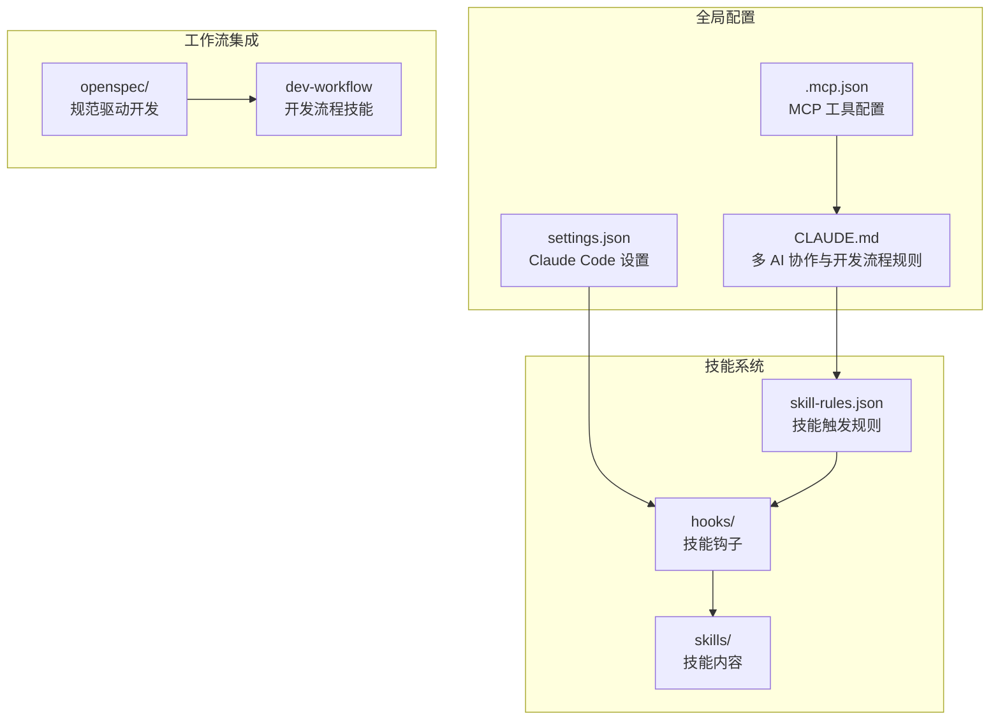
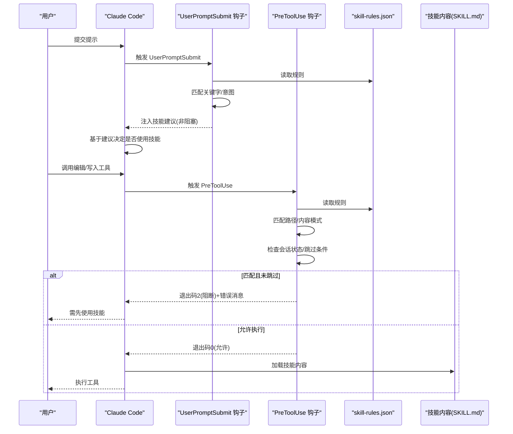
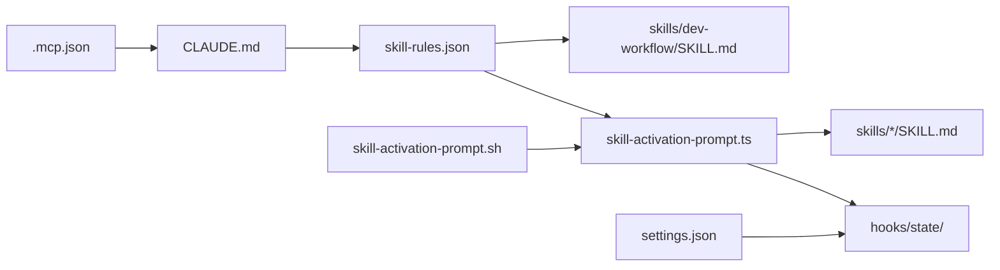

# 技能开发概述

<cite>
**本文档引用的文件**
- [README.md](file://README.md)
- [CLAUDE.md](file://CLAUDE.md)
- [skills/skill-developer/SKILL.md](file://skills/skill-developer/SKILL.md)
- [skills/skill-rules.json](file://skills/skill-rules.json)
- [hooks/skill-activation-prompt.ts](file://hooks/skill-activation-prompt.ts)
- [hooks/skill-activation-prompt.sh](file://hooks/skill-activation-prompt.sh)
- [skills/skill-developer/TRIGGER_TYPES.md](file://skills/skill-developer/TRIGGER_TYPES.md)
- [skills/skill-developer/HOOK_MECHANISMS.md](file://skills/skill-developer/HOOK_MECHANISMS.md)
- [global/codex-skills/writing-skills/SKILL.md](file://global/codex-skills/writing-skills/SKILL.md)
- [global/codex-skills/writing-skills/anthropic-best-practices.md](file://global/codex-skills/writing-skills/anthropic-best-practices.md)
- [global/codex-skills/systematic-debugging/SKILL.md](file://global/codex-skills/systematic-debugging/SKILL.md)
- [global/codex-skills/test-driven-development/SKILL.md](file://global/codex-skills/test-driven-development/SKILL.md)
- [skills/dev-workflow/SKILL.md](file://skills/dev-workflow/SKILL.md)
- [setup-claude-config.sh](file://setup-claude-config.sh)
</cite>

## 目录
1. [引言](#引言)
2. [项目结构](#项目结构)
3. [核心组件](#核心组件)
4. [架构总览](#架构总览)
5. [详细组件分析](#详细组件分析)
6. [依赖关系分析](#依赖关系分析)
7. [性能考量](#性能考量)
8. [故障排除指南](#故障排除指南)
9. [结论](#结论)
10. [附录](#附录)

## 引言
本文件系统性阐述技能开发的概念、设计思想与整体架构，重点说明如何通过 Claude Code 实现技能的自动化激活与管理，并与 Anthropic 最佳实践（尤其是 500 行规则与渐进式披露模式）相结合。文档还提供从概念设计到实现部署的完整生命周期指导，帮助读者快速上手并高质量地创建可复用的技能。

## 项目结构
该仓库围绕“技能系统”“多 AI 协作”“规范驱动开发（SDD）”三大支柱构建，提供可复用的技能模板、自动激活机制、钩子系统与 OpenSpec 集成工具链。

图表来源
- [CLAUDE.md](file://CLAUDE.md#L1-L440)
- [skills/skill-rules.json](file://skills/skill-rules.json#L1-L250)
- [hooks/skill-activation-prompt.ts](file://hooks/skill-activation-prompt.ts#L1-L133)
- [setup-claude-config.sh](file://setup-claude-config.sh#L1-L372)

章节来源
- [README.md](file://README.md#L71-L92)
- [setup-claude-config.sh](file://setup-claude-config.sh#L60-L184)

## 核心组件
- 技能触发规则（skill-rules.json）：集中定义技能类型、触发条件、执行级别与优先级，支持关键字、意图模式、文件路径与内容模式四类触发。
- 两阶段钩子系统：
  - UserPromptSubmit 钩子：在 Claude 处理用户提示前注入技能建议，非阻塞提醒。
  - PreToolUse 钩子：在编辑/写入工具执行前进行验证与阻断，关键守卫线。
- 技能内容（SKILL.md）：遵循 500 行规则与渐进式披露，通过参考文件承载细节。
- 多 AI 协作与 SDD 工作流：通过 CLAUDE.md 明确角色分工与交叉检查流程，结合 OpenSpec 实现提案-实现-归档闭环。

章节来源
- [skills/skill-rules.json](file://skills/skill-rules.json#L1-L250)
- [hooks/skill-activation-prompt.ts](file://hooks/skill-activation-prompt.ts#L36-L127)
- [skills/skill-developer/SKILL.md](file://skills/skill-developer/SKILL.md#L28-L58)

## 架构总览
技能系统的自动化激活与管理遵循“规则驱动 + 钩子执行 + 内容加载”的闭环：用户输入触发钩子，钩子读取规则匹配技能，随后以非阻塞或阻断方式影响 Claude 的后续行为，最终加载相应技能内容以指导实现。

图表来源
- [hooks/skill-activation-prompt.ts](file://hooks/skill-activation-prompt.ts#L36-L127)
- [skills/skill-rules.json](file://skills/skill-rules.json#L1-L250)
- [skills/skill-developer/HOOK_MECHANISMS.md](file://skills/skill-developer/HOOK_MECHANISMS.md#L15-L167)

## 详细组件分析

### 1) 技能触发规则与类型体系
- 规则文件（skill-rules.json）定义技能的类型（guardrail/domain）、执行级别（block/suggest/warn）、优先级（critical/high/medium/low），以及四类触发器：
  - 关键字触发（keywords）
  - 意图模式（intentPatterns，正则）
  - 文件路径触发（pathPatterns，glob）
  - 内容模式触发（contentPatterns，正则）
- 示例技能覆盖开发流程、Git 工作流、Python 后端规范、错误追踪等主题，体现领域化与可复用性。

章节来源
- [skills/skill-rules.json](file://skills/skill-rules.json#L4-L51)
- [skills/skill-rules.json](file://skills/skill-rules.json#L52-L107)
- [skills/skill-rules.json](file://skills/skill-rules.json#L108-L184)
- [skills/skill-rules.json](file://skills/skill-rules.json#L185-L228)

### 2) 两阶段钩子系统
- UserPromptSubmit 钩子（skill-activation-prompt.ts/sh）：
  - 在 Claude 处理提示前执行，读取 stdin 的 JSON 输入，解析 prompt，加载 skill-rules.json，匹配关键字与意图模式，按优先级输出格式化建议到 stdout，作为 Claude 的上下文。
  - 特点：非阻塞、建议性质、提前感知相关技能。
- PreToolUse 钩子（配套脚本）：
  - 在编辑/写入工具执行前执行，检查文件路径与内容模式，结合会话状态与跳过条件（文件标记、环境变量）决定是否阻断（退出码 2）。
  - 特点：阻断执行、向 Claude 反馈明确指令、失败开放（出错允许继续）。

章节来源
- [hooks/skill-activation-prompt.ts](file://hooks/skill-activation-prompt.ts#L36-L127)
- [hooks/skill-activation-prompt.sh](file://hooks/skill-activation-prompt.sh#L1-L6)
- [skills/skill-developer/HOOK_MECHANISMS.md](file://skills/skill-developer/HOOK_MECHANISMS.md#L15-L167)

### 3) 触发类型与最佳实践
- 关键字触发：显式主题匹配，适合用户明确提及的场景。
- 意图模式：隐式动作识别，使用非贪婪正则捕获常见动词与领域名词。
- 文件路径触发：基于 glob 模式定位编辑文件，避免误触发。
- 内容模式触发：基于文件内容（导入/函数/语法）识别技术栈，精准激活。
- 最佳实践：关键词具体化、意图模式非贪婪、路径模式窄化、内容模式转义特殊字符、测试与迭代。

章节来源
- [skills/skill-developer/TRIGGER_TYPES.md](file://skills/skill-developer/TRIGGER_TYPES.md#L15-L107)
- [skills/skill-developer/TRIGGER_TYPES.md](file://skills/skill-developer/TRIGGER_TYPES.md#L111-L185)
- [skills/skill-developer/TRIGGER_TYPES.md](file://skills/skill-developer/TRIGGER_TYPES.md#L189-L258)

### 4) 技能内容与渐进式披露
- SKILL.md 结构：YAML frontmatter（name/description），清晰的层次结构，配合参考文件承载细节。
- 500 行规则：限制主文档长度，通过参考文件组织复杂内容。
- 渐进式披露：主文档提供概览与导航，按需加载参考文件，避免一次性加载过多上下文。
- 写作最佳实践：描述字段聚焦触发条件而非流程总结、使用主动语态与动名词命名、Token 效率优先、跨引用而非强制加载。

章节来源
- [skills/skill-developer/SKILL.md](file://skills/skill-developer/SKILL.md#L109-L191)
- [global/codex-skills/writing-skills/anthropic-best-practices.md](file://global/codex-skills/writing-skills/anthropic-best-practices.md#L144-L234)
- [global/codex-skills/writing-skills/anthropic-best-practices.md](file://global/codex-skills/writing-skills/anthropic-best-practices.md#L235-L408)

### 5) 多 AI 协作与 SDD 工作流
- 角色分工：Claude 主体思考者与决策者，Codex 后端技术顾问，Gemini 前端主力。
- 交叉检查：后端实现-自检-Codex 审查-修复-验证；前端设计-Gemini 实现-Claude 审查-修正-验证。
- OpenSpec 集成：提案-实现-归档三阶段工作流，与 6 阶段开发流程统一。
- 开发流程：三阶段工作流与 6 阶段映射、目录结构与文档格式标准化。

章节来源
- [CLAUDE.md](file://CLAUDE.md#L128-L187)
- [CLAUDE.md](file://CLAUDE.md#L220-L307)

### 6) 开发流程技能（dev-workflow）
- 严格阶段顺序：requirement → design → implementation → review → testing → done。
- 目录规范：任务文档存放于 .devos/tasks/{task-id}/，源码与测试分别位于 devos/ 与 tests/。
- 质量保障：前置校验、评审清单、测试报告模板、进度跟踪。

章节来源
- [skills/dev-workflow/SKILL.md](file://skills/dev-workflow/SKILL.md#L28-L51)
- [skills/dev-workflow/SKILL.md](file://skills/dev-workflow/SKILL.md#L53-L92)

### 7) 测试与调试技能
- 系统化调试：四阶段根因调查、模式分析、假设与最小验证、实现与架构反思。
- 测试驱动开发：红-绿-重构循环、测试先于实现、避免“测试之后”陷阱。
- 技能测试：针对不同技能类型（纪律约束、技术方法、思维模式、参考文档）采用压力场景与多轮验证。

章节来源
- [global/codex-skills/systematic-debugging/SKILL.md](file://global/codex-skills/systematic-debugging/SKILL.md#L46-L232)
- [global/codex-skills/test-driven-development/SKILL.md](file://global/codex-skills/test-driven-development/SKILL.md#L47-L197)

## 依赖关系分析
技能系统的关键依赖链如下：

图表来源
- [skills/skill-rules.json](file://skills/skill-rules.json#L1-L250)
- [hooks/skill-activation-prompt.ts](file://hooks/skill-activation-prompt.ts#L43-L46)
- [hooks/skill-activation-prompt.sh](file://hooks/skill-activation-prompt.sh#L4-L5)
- [CLAUDE.md](file://CLAUDE.md#L1-L440)
- [setup-claude-config.sh](file://setup-claude-config.sh#L175-L184)

章节来源
- [skills/skill-rules.json](file://skills/skill-rules.json#L1-L250)
- [hooks/skill-activation-prompt.ts](file://hooks/skill-activation-prompt.ts#L43-L46)
- [setup-claude-config.sh](file://setup-claude-config.sh#L175-L184)

## 性能考量
- 钩子执行时间目标：UserPromptSubmit <100ms，PreToolUse <200ms。
- 性能瓶颈与优化：
  - 规则文件每次执行均需读取，未来可考虑内存缓存与变更监听。
  - 内容模式匹配仅在文件存在时读取，避免大文件 IO。
  - glob 与正则编译可惰性编译并缓存。
- 降低触发器数量与提高特异性，减少匹配开销。

章节来源
- [skills/skill-developer/HOOK_MECHANISMS.md](file://skills/skill-developer/HOOK_MECHANISMS.md#L260-L301)

## 故障排除指南
- UserPromptSubmit 未触发：
  - 检查 skill-activation-prompt.sh 是否可执行、settings.json 是否注册钩子、prompt 是否包含关键字/意图模式。
- PreToolUse 未阻断：
  - 检查 skill-rules.json 中 fileTriggers 是否配置 pathPatterns/contentPatterns、会话状态是否已记录、是否存在跳过条件（文件标记/环境变量）。
- 性能问题：
  - 减少触发器数量、使用更具体的 glob 模式、避免过于宽泛的正则、缓存编译后的正则。
- JSON 语法错误：
  - 使用 Python3 的 json.tool 验证 skill-rules.json 与 settings.json。

章节来源
- [skills/skill-developer/HOOK_MECHANISMS.md](file://skills/skill-developer/HOOK_MECHANISMS.md#L170-L208)
- [skills/skill-developer/TRIGGER_TYPES.md](file://skills/skill-developer/TRIGGER_TYPES.md#L281-L298)
- [setup-claude-config.sh](file://setup-claude-config.sh#L285-L315)

## 结论
该技能开发体系以“规则驱动 + 钩子执行 + 内容加载”为核心，结合 Anthropic 最佳实践（500 行规则、渐进式披露、Token 效率），实现了可复用、可测试、可演进的技能生态。通过多 AI 协作与 SDD 工作流的深度融合，技能不仅提升开发效率，更强化了质量与一致性。建议在实际项目中：
- 严格遵守 500 行规则与渐进式披露；
- 以 TDD 思想测试技能有效性；
- 持续优化触发器与性能；
- 将技能纳入 OpenSpec 规范化流程，实现从提案到归档的闭环。

## 附录

### A. 技能开发生命周期（从概念到部署）
- 概念设计：明确技能目的、触发条件、执行级别与优先级。
- 规则配置：在 skill-rules.json 中定义触发器与执行策略。
- 钩子验证：使用提供的测试命令验证 UserPromptSubmit 与 PreToolUse 行为。
- 内容编写：遵循 500 行规则与渐进式披露，SKILL.md 简洁概览，参考文件承载细节。
- 测试与迭代：以 TDD 方式验证技能在压力场景下的表现，持续优化触发器与描述。
- 部署与集成：通过 setup-claude-config.sh 部署至项目，验证 hooks 可执行与 JSON 语法正确。

章节来源
- [skills/skill-developer/SKILL.md](file://skills/skill-developer/SKILL.md#L109-L191)
- [global/codex-skills/writing-skills/SKILL.md](file://global/codex-skills/writing-skills/SKILL.md#L595-L633)
- [setup-claude-config.sh](file://setup-claude-config.sh#L60-L184)