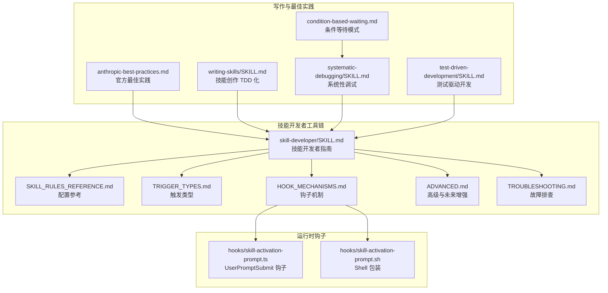
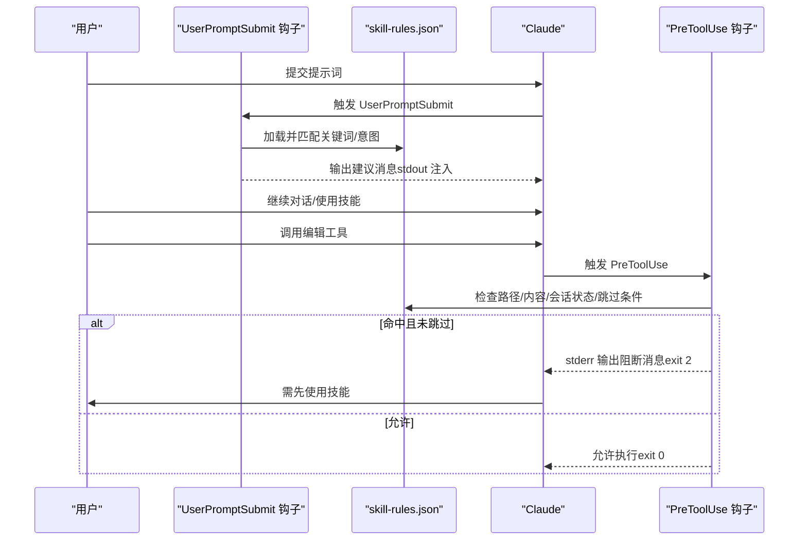
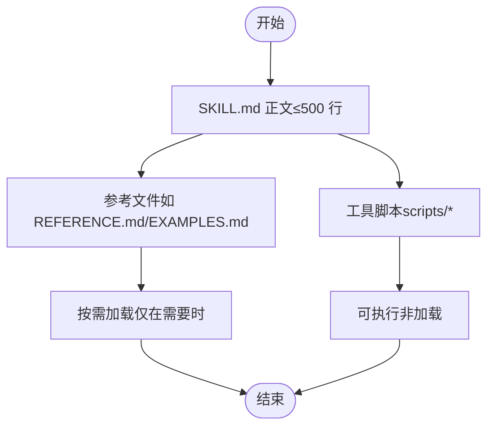
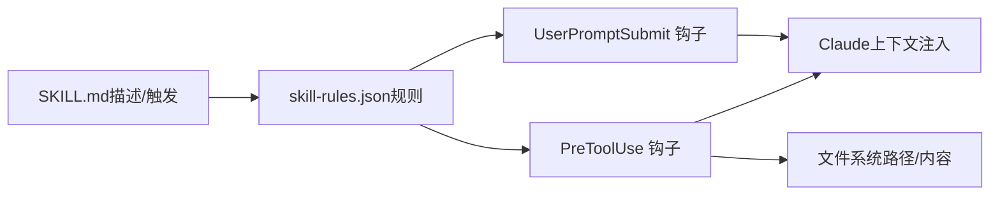

# 最佳实践

<cite>
**本文引用的文件**
- [anthropic-best-practices.md](file://global/codex-skills/writing-skills/anthropic-best-practices.md)
- [writing-skills/SKILL.md](file://global/codex-skills/writing-skills/SKILL.md)
- [skill-developer/SKILL.md](file://skills/skill-developer/SKILL.md)
- [skill-developer/SKILL_RULES_REFERENCE.md](file://skills/skill-developer/SKILL_RULES_REFERENCE.md)
- [skill-developer/TRIGGER_TYPES.md](file://skills/skill-developer/TRIGGER_TYPES.md)
- [skill-developer/HOOK_MECHANISMS.md](file://skills/skill-developer/HOOK_MECHANISMS.md)
- [skill-developer/ADVANCED.md](file://skills/skill-developer/ADVANCED.md)
- [skill-developer/TROUBLESHOOTING.md](file://skills/skill-developer/TROUBLESHOOTING.md)
- [systematic-debugging/SKILL.md](file://global/codex-skills/systematic-debugging/SKILL.md)
- [test-driven-development/SKILL.md](file://global/codex-skills/test-driven-development/SKILL.md)
- [condition-based-waiting-example.ts](file://global/codex-skills/systematic-debugging/condition-based-waiting-example.ts)
- [condition-based-waiting.md](file://global/codex-skills/systematic-debugging/condition-based-waiting.md)
- [testing-anti-patterns.md](file://global/codex-skills/test-driven-development/testing-anti-patterns.md)
- [CLAUDE.md](file://CLAUDE.md)
- [CLAUDE.md（全局）](file://global/CLAUDE.md)
- [hooks/skill-activation-prompt.ts](file://hooks/skill-activation-prompt.ts)
- [hooks/skill-activation-prompt.sh](file://hooks/skill-activation-prompt.sh)
</cite>

## 目录
1. [引言](#引言)
2. [项目结构](#项目结构)
3. [核心组件](#核心组件)
4. [架构总览](#架构总览)
5. [详细组件分析](#详细组件分析)
6. [依赖关系分析](#依赖关系分析)
7. [性能考量](#性能考量)
8. [故障排查指南](#故障排查指南)
9. [结论](#结论)
10. [附录](#附录)

## 引言
本指南面向在 Claude Code 环境中进行“技能”（Skill）开发与管理的工程师与技术作者，系统化梳理并落地 Anthropic 官方最佳实践，涵盖以下关键主题：
- 500 行规则与渐进式披露模式
- 目录结构规范与命名约定
- 质量标准、性能要求与用户体验
- 高级开发技巧与未来增强方向
- 技能版本管理策略
- 实战案例、参考路径与经验总结

本指南以仓库中的官方文档与实现为依据，结合图示帮助读者快速建立从“设计—实现—验证—迭代”的闭环。

## 项目结构
该仓库围绕“技能开发”形成两条主线：
- 写作与最佳实践：提供技能创作的通用原则、结构与测试方法
- 技能开发者工具链：提供自动激活系统、触发器配置、钩子机制与调试指南

图表来源
- [anthropic-best-practices.md](file://global/codex-skills/writing-skills/anthropic-best-practices.md#L1-L1151)
- [writing-skills/SKILL.md](file://global/codex-skills/writing-skills/SKILL.md#L1-L655)
- [skill-developer/SKILL.md](file://skills/skill-developer/SKILL.md#L1-L427)
- [hooks/skill-activation-prompt.ts](file://hooks/skill-activation-prompt.ts#L1-L133)
- [hooks/skill-activation-prompt.sh](file://hooks/skill-activation-prompt.sh#L1-L6)

章节来源
- [anthropic-best-practices.md](file://global/codex-skills/writing-skills/anthropic-best-practices.md#L1-L1151)
- [writing-skills/SKILL.md](file://global/codex-skills/writing-skills/SKILL.md#L1-L655)
- [skill-developer/SKILL.md](file://skills/skill-developer/SKILL.md#L1-L427)

## 核心组件
- 官方最佳实践（500 行规则、渐进式披露、命名与描述）
- 技能开发者指南（触发类型、执行级别、钩子机制）
- 配置参考（skill-rules.json 的字段与示例）
- 触发类型库（关键词、意图、路径、内容）
- 钩子机制（UserPromptSubmit 与 PreToolUse 的行为与性能）
- 故障排查（常见问题与诊断命令）
- 高级与未来增强（动态规则更新、依赖、条件执行、版本管理等）

章节来源
- [anthropic-best-practices.md](file://global/codex-skills/writing-skills/anthropic-best-practices.md#L235-L409)
- [skill-developer/SKILL.md](file://skills/skill-developer/SKILL.md#L183-L191)
- [skill-developer/SKILL_RULES_REFERENCE.md](file://skills/skill-developer/SKILL_RULES_REFERENCE.md#L24-L57)
- [skill-developer/TRIGGER_TYPES.md](file://skills/skill-developer/TRIGGER_TYPES.md#L1-L306)
- [skill-developer/HOOK_MECHANISMS.md](file://skills/skill-developer/HOOK_MECHANISMS.md#L15-L167)
- [skill-developer/TROUBLESHOOTING.md](file://skills/skill-developer/TROUBLESHOOTING.md#L16-L250)
- [skill-developer/ADVANCED.md](file://skills/skill-developer/ADVANCED.md#L7-L198)

## 架构总览
技能系统由“内容层 + 自动激活层 + 运行时钩子”构成：
- 内容层：每个技能以 SKILL.md 为核心，配合参考文件与可复用工具
- 自动激活层：通过 skill-rules.json 定义触发条件与执行级别
- 钩子层：UserPromptSubmit 注入建议；PreToolUse 在编辑前进行阻断或提醒

图表来源
- [hooks/skill-activation-prompt.ts](file://hooks/skill-activation-prompt.ts#L36-L127)
- [skill-developer/HOOK_MECHANISMS.md](file://skills/skill-developer/HOOK_MECHANISMS.md#L15-L167)
- [skill-developer/SKILL_RULES_REFERENCE.md](file://skills/skill-developer/SKILL_RULES_REFERENCE.md#L24-L57)

章节来源
- [hooks/skill-activation-prompt.ts](file://hooks/skill-activation-prompt.ts#L1-L133)
- [hooks/skill-activation-prompt.sh](file://hooks/skill-activation-prompt.sh#L1-L6)
- [skill-developer/HOOK_MECHANISMS.md](file://skills/skill-developer/HOOK_MECHANISMS.md#L15-L167)

## 详细组件分析

### 1) 500 行规则与渐进式披露
- 500 行规则：SKILL.md 正文建议不超过 500 行，以控制上下文窗口占用与加载成本
- 渐进式披露：将“参考文件”“示例”“脚本”等拆分到独立文件，按需加载
- 目录结构建议：主文件 + 参考文件 + 工具脚本，避免深层嵌套引用

图表来源
- [anthropic-best-practices.md](file://global/codex-skills/writing-skills/anthropic-best-practices.md#L235-L409)
- [skill-developer/SKILL.md](file://skills/skill-developer/SKILL.md#L183-L191)

章节来源
- [anthropic-best-practices.md](file://global/codex-skills/writing-skills/anthropic-best-practices.md#L235-L409)
- [skill-developer/SKILL.md](file://skills/skill-developer/SKILL.md#L183-L191)

### 2) 目录结构规范与命名约定
- 结构规范：技能根目录下至少包含 SKILL.md；重参考或可复用工具可拆分至单独文件
- 命名约定：优先使用“-ing”形式（如 processing-pdfs），保持一致性
- 描述字段：严格遵循“何时使用”，不总结流程；使用第三人称；包含关键词

章节来源
- [anthropic-best-practices.md](file://global/codex-skills/writing-skills/anthropic-best-practices.md#L155-L234)
- [writing-skills/SKILL.md](file://global/codex-skills/writing-skills/SKILL.md#L71-L136)
- [skill-developer/SKILL.md](file://skills/skill-developer/SKILL.md#L134-L140)

### 3) 质量标准与用户体验
- 质量标准
  - 描述字段聚焦“触发条件”，避免总结流程
  - 使用“搜索友好”的关键词覆盖
  - 小型工作流建议 <150 字，常用技能 <200 字
  - 避免冗余与重复，示例“一佳胜多劣”
- 用户体验
  - 建议在 SKILL.md 中提供“小 inline 流程图”用于非显而易见的决策点
  - 对复杂任务提供“清单式工作流”，便于跟踪进度

章节来源
- [writing-skills/SKILL.md](file://global/codex-skills/writing-skills/SKILL.md#L139-L276)
- [anthropic-best-practices.md](file://global/codex-skills/writing-skills/anthropic-best-practices.md#L410-L502)

### 4) 触发类型与执行级别
- 触发类型
  - 关键词触发：显式主题匹配
  - 意图模式：隐式动作检测（正则，非贪婪）
  - 文件路径触发：glob 匹配，建议窄化
  - 内容模式触发：基于文件内容的正则匹配
- 执行级别
  - BLOCK：PreToolUse 阻断（exit 2），仅用于关键守卫
  - SUGGEST：UserPromptSubmit 注入建议（非阻断）
  - WARN：低优先级提醒（较少使用）

章节来源
- [skill-developer/TRIGGER_TYPES.md](file://skills/skill-developer/TRIGGER_TYPES.md#L15-L306)
- [skill-developer/SKILL.md](file://skills/skill-developer/SKILL.md#L194-L221)

### 5) 钩子机制与会话状态
- UserPromptSubmit 钩子
  - 时机：提示提交前
  - 行为：输出 stdout 作为上下文注入
  - 性能：目标 <100ms
- PreToolUse 钩子
  - 时机：编辑/写入工具调用前
  - 行为：命中且未跳过时 exit 2 并输出 stderr
  - 会话状态：同一会话内已使用过的技能不再重复阻断
- 跳过条件
  - 会话跟踪、文件标记（如 @skip-validation）、环境变量覆盖

章节来源
- [skill-developer/HOOK_MECHANISMS.md](file://skills/skill-developer/HOOK_MECHANISMS.md#L15-L167)
- [skill-developer/SKILL.md](file://skills/skill-developer/SKILL.md#L224-L266)

### 6) 配置参考（skill-rules.json）
- 字段概览：version、skills（映射技能名到规则）、promptTriggers、fileTriggers、blockMessage、skipConditions
- 示例：守卫类技能（block）与领域类技能（suggest）的完整配置模板
- 校验清单：JSON 语法、关键字完整性、正则有效性、路径模式正确性

章节来源
- [skill-developer/SKILL_RULES_REFERENCE.md](file://skills/skill-developer/SKILL_RULES_REFERENCE.md#L24-L316)

### 7) 高级开发技巧与未来增强
- 动态规则更新：热重载配置（无需重启）
- 技能依赖：声明前置技能与加载顺序
- 条件执行：按环境（生产/开发/CI）调整执行级别
- 技能分析：触发频率、误报率、性能指标与效果评分
- 版本管理：语义化版本、最小模型版本、变更日志
- 多语言支持：多语言 SKILL.md 变体
- 自动化测试框架：测试用例、断言框架、CI 集成

章节来源
- [skill-developer/ADVANCED.md](file://skills/skill-developer/ADVANCED.md#L7-L198)

### 8) 实战案例与经验总结
- 条件等待（避免任意超时）
  - 用例：替换随机超时为事件计数等待，提升稳定性与性能
  - 参考实现与使用对比见示例文件
- 测试反模式
  - 不要测试“mock 行为”本身，应测试真实行为
  - 不要在生产类中添加仅测试方法
  - 不要无理解地 mock，应理解依赖链后做最小化隔离
- 系统性调试
  - 四阶段：根因调查 → 模式分析 → 假设与测试 → 实施修复
  - 严禁“症状修复”，必须定位根因

章节来源
- [condition-based-waiting-example.ts](file://global/codex-skills/systematic-debugging/condition-based-waiting-example.ts#L1-L159)
- [condition-based-waiting.md](file://global/codex-skills/systematic-debugging/condition-based-waiting.md#L1-L116)
- [testing-anti-patterns.md](file://global/codex-skills/test-driven-development/testing-anti-patterns.md#L1-L300)
- [systematic-debugging/SKILL.md](file://global/codex-skills/systematic-debugging/SKILL.md#L46-L232)

## 依赖关系分析
技能系统的关键依赖与耦合：
- 内容层对自动激活层的依赖：SKILL.md 的描述与触发关键词决定是否被 UserPromptSubmit 建议
- 自动激活层对钩子层的依赖：PreToolUse 依据 skill-rules.json 的 fileTriggers 与 skipConditions 决定是否阻断
- 钩子层对配置文件的依赖：每次执行均需加载 skill-rules.json，存在性能瓶颈风险

图表来源
- [skill-developer/SKILL.md](file://skills/skill-developer/SKILL.md#L141-L158)
- [skill-developer/SKILL_RULES_REFERENCE.md](file://skills/skill-developer/SKILL_RULES_REFERENCE.md#L24-L57)
- [hooks/skill-activation-prompt.ts](file://hooks/skill-activation-prompt.ts#L36-L78)

章节来源
- [skill-developer/SKILL.md](file://skills/skill-developer/SKILL.md#L141-L158)
- [skill-developer/SKILL_RULES_REFERENCE.md](file://skills/skill-developer/SKILL_RULES_REFERENCE.md#L24-L57)
- [hooks/skill-activation-prompt.ts](file://hooks/skill-activation-prompt.ts#L36-L78)

## 性能考量
- 目标性能
  - UserPromptSubmit：<100ms
  - PreToolUse：<200ms
- 性能瓶颈与优化
  - 配置加载：缓存/按需重载
  - glob 匹配：编译一次并缓存
  - 正则匹配：惰性编译与缓存
  - 内容模式匹配：仅在必要时读取文件，避免大文件扫描

章节来源
- [skill-developer/HOOK_MECHANISMS.md](file://skills/skill-developer/HOOK_MECHANISMS.md#L260-L301)

## 故障排查指南
- 技能未触发
  - 检查关键词/意图正则是否匹配
  - 校验 skill-rules.json 语法（jq 校验）
  - 使用手动命令测试钩子
- PreToolUse 未阻断
  - 检查路径/排除项/内容模式是否命中
  - 检查会话状态文件与跳过标记
  - 检查环境变量覆盖
- 性能问题
  - 减少模式数量与复杂度
  - 缩窄路径模式范围
  - 使用更具体的正则与更少的 alternations

章节来源
- [skill-developer/TROUBLESHOOTING.md](file://skills/skill-developer/TROUBLESHOOTING.md#L16-L508)

## 结论
- 严格遵循 500 行规则与渐进式披露，确保上下文高效利用
- 以“触发条件”为中心编写描述，配合关键词覆盖与命名约定
- 利用自动激活系统与钩子机制构建“建议 + 守卫”的双层保障
- 通过 TDD 化的技能创作与系统性调试，持续提升质量与稳定性
- 以高级特性（动态规则、依赖、条件执行、版本管理）为演进方向

## 附录
- 相关文件与参考路径
  - 官方最佳实践：[anthropic-best-practices.md](file://global/codex-skills/writing-skills/anthropic-best-practices.md)
  - 技能开发者指南：[skill-developer/SKILL.md](file://skills/skill-developer/SKILL.md)
  - 配置参考：[SKILL_RULES_REFERENCE.md](file://skills/skill-developer/SKILL_RULES_REFERENCE.md)
  - 触发类型：[TRIGGER_TYPES.md](file://skills/skill-developer/TRIGGER_TYPES.md)
  - 钩子机制：[HOOK_MECHANISMS.md](file://skills/skill-developer/HOOK_MECHANISMS.md)
  - 故障排查：[TROUBLESHOOTING.md](file://skills/skill-developer/TROUBLESHOOTING.md)
  - 高级与未来增强：[ADVANCED.md](file://skills/skill-developer/ADVANCED.md)
  - 系统性调试：[systematic-debugging/SKILL.md](file://global/codex-skills/systematic-debugging/SKILL.md)
  - 测试驱动开发：[test-driven-development/SKILL.md](file://global/codex-skills/test-driven-development/SKILL.md)
  - 条件等待模式：[condition-based-waiting.md](file://global/codex-skills/systematic-debugging/condition-based-waiting.md)
  - 测试反模式：[testing-anti-patterns.md](file://global/codex-skills/test-driven-development/testing-anti-patterns.md)
  - 钩子实现：[hooks/skill-activation-prompt.ts](file://hooks/skill-activation-prompt.ts), [hooks/skill-activation-prompt.sh](file://hooks/skill-activation-prompt.sh)
  - 全局 CLAUDE.md：[CLAUDE.md](file://CLAUDE.md), [CLAUDE.md（全局）](file://global/CLAUDE.md)