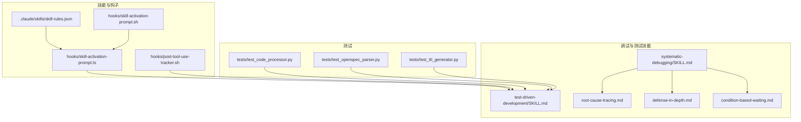
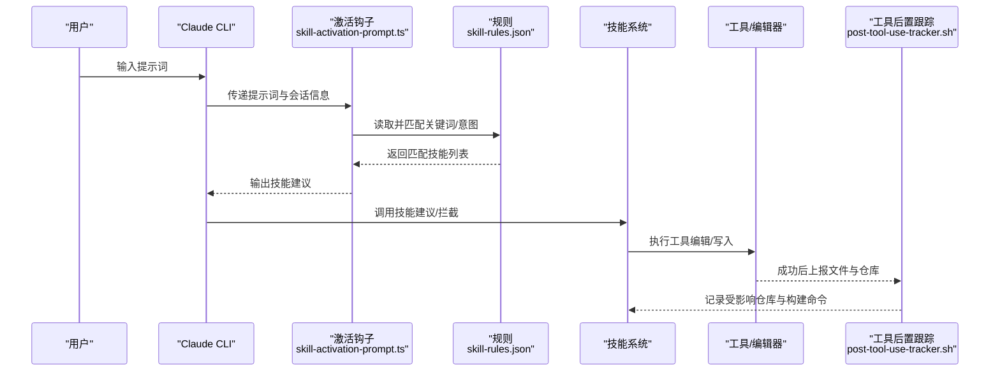
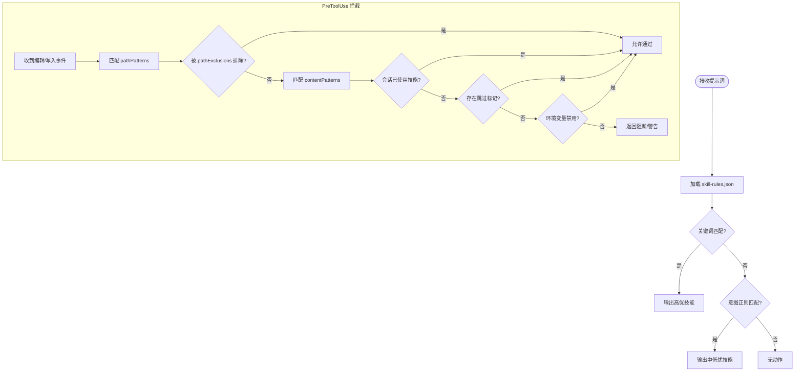
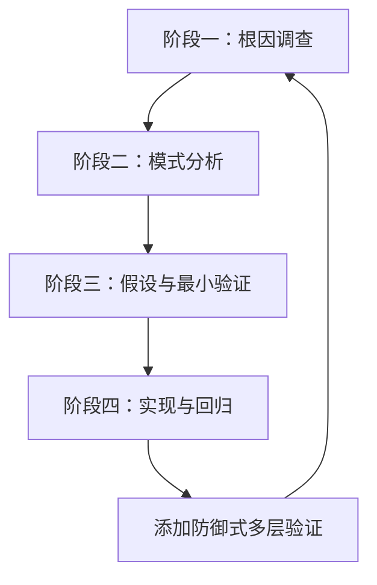
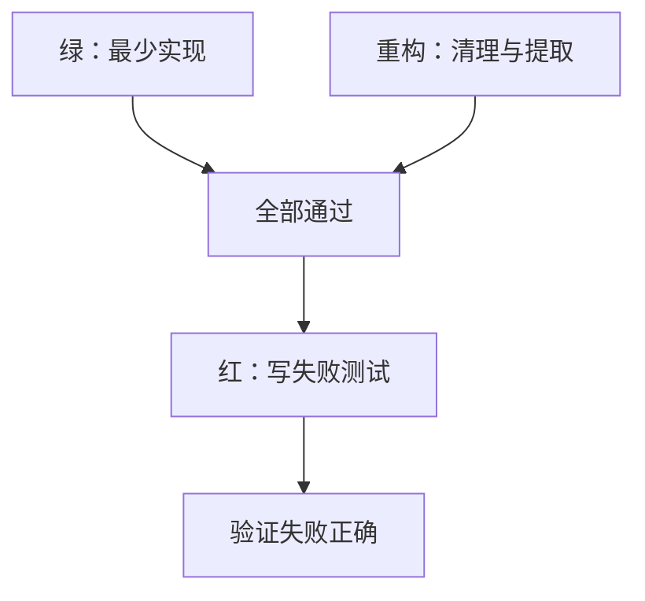
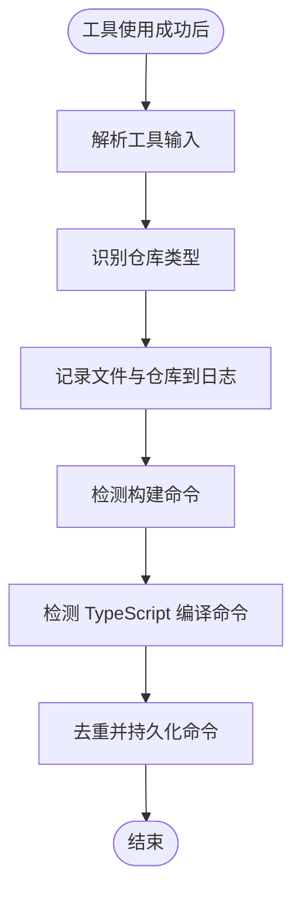
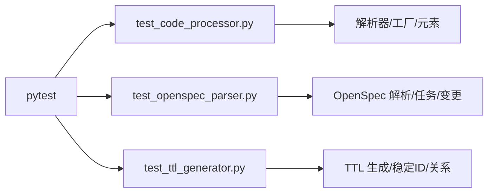
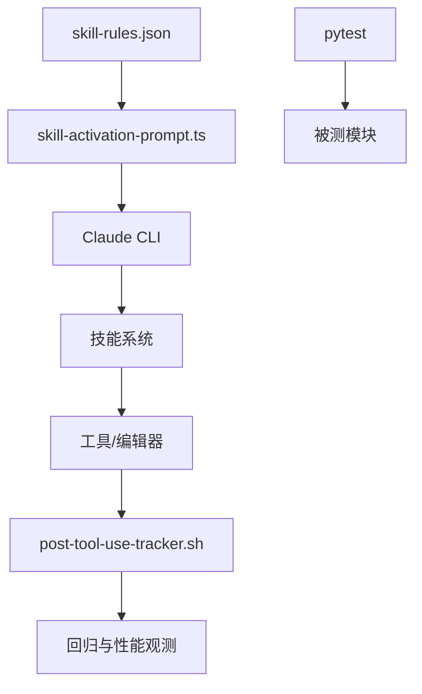

# 测试与调试

<cite>
**本文引用的文件**
- [README.md](file://README.md)
- [agents/README.md](file://agents/README.md)
- [skills/skill-developer/TROUBLESHOOTING.md](file://skills/skill-developer/TROUBLESHOOTING.md)
- [global/codex-skills/systematic-debugging/SKILL.md](file://global/codex-skills/systematic-debugging/SKILL.md)
- [global/codex-skills/systematic-debugging/root-cause-tracing.md](file://global/codex-skills/systematic-debugging/root-cause-tracing.md)
- [global/codex-skills/systematic-debugging/defense-in-depth.md](file://global/codex-skills/systematic-debugging/defense-in-depth.md)
- [global/codex-skills/systematic-debugging/condition-based-waiting.md](file://global/codex-skills/systematic-debugging/condition-based-waiting.md)
- [global/codex-skills/test-driven-development/SKILL.md](file://global/codex-skills/test-driven-development/SKILL.md)
- [global/codex-skills/test-driven-development/testing-anti-patterns.md](file://global/codex-skills/test-driven-development/testing-anti-patterns.md)
- [hooks/skill-activation-prompt.ts](file://hooks/skill-activation-prompt.ts)
- [hooks/skill-activation-prompt.sh](file://hooks/skill-activation-prompt.sh)
- [hooks/post-tool-use-tracker.sh](file://hooks/post-tool-use-tracker.sh)
- [skills/skill-rules.json](file://skills/skill-rules.json)
- [tests/test_code_processor.py](file://tests/test_code_processor.py)
- [tests/test_openspec_parser.py](file://tests/test_openspec_parser.py)
- [tests/test_ttl_generator.py](file://tests/test_ttl_generator.py)
- [global/codex-skills/writing-skills/examples/CLAUDE_MD_TESTING.md](file://global/codex-skills/writing-skills/examples/CLAUDE_MD_TESTING.md)
</cite>

## 目录
1. [简介](#简介)
2. [项目结构](#项目结构)
3. [核心组件](#核心组件)
4. [架构总览](#架构总览)
5. [详细组件分析](#详细组件分析)
6. [依赖关系分析](#依赖关系分析)
7. [性能考量](#性能考量)
8. [故障排查指南](#故障排查指南)
9. [结论](#结论)
10. [附录](#附录)

## 简介
本指南聚焦于“测试与调试”的实践路径，结合本仓库中的技能系统、钩子机制、自动化测试与调试技能，提供从手动测试命令、自动化测试策略到性能基准测试的完整方法论。同时覆盖调试技巧与常见问题诊断，如技能不触发、预工具使用不阻塞、误报过多等，并给出测试清单、调试工具使用指南与性能优化建议。

## 项目结构
本仓库围绕“多 AI 协同 + SDD 工作流”组织，测试与调试相关的关键位置包括：
- 技能系统与规则：skills/skill-rules.json、hooks 下的激活与验证钩子
- 系统化调试与测试驱动开发技能：global/codex-skills/systematic-debugging、global/codex-skills/test-driven-development
- 自动化测试：tests/ 下的单元测试
- 工具链钩子：post-tool-use-tracker.sh 等

图表来源
- [skills/skill-rules.json](file://skills/skill-rules.json#L1-L250)
- [hooks/skill-activation-prompt.ts](file://hooks/skill-activation-prompt.ts#L1-L133)
- [hooks/skill-activation-prompt.sh](file://hooks/skill-activation-prompt.sh#L1-L6)
- [hooks/post-tool-use-tracker.sh](file://hooks/post-tool-use-tracker.sh#L1-L178)
- [tests/test_code_processor.py](file://tests/test_code_processor.py#L1-L139)
- [tests/test_openspec_parser.py](file://tests/test_openspec_parser.py#L1-L97)
- [tests/test_ttl_generator.py](file://tests/test_ttl_generator.py#L1-L103)
- [global/codex-skills/systematic-debugging/SKILL.md](file://global/codex-skills/systematic-debugging/SKILL.md#L1-L297)
- [global/codex-skills/test-driven-development/SKILL.md](file://global/codex-skills/test-driven-development/SKILL.md#L1-L372)

章节来源
- [README.md](file://README.md#L71-L229)

## 核心组件
- 技能规则与触发器：通过 skill-rules.json 定义关键词、意图正则、文件路径与内容模式，驱动技能建议与拦截。
- 激活钩子：skill-activation-prompt.ts 读取规则匹配用户提示词，输出技能建议；配套 shell 包装脚本。
- 验证钩子：用于编辑/写入等工具调用前的拦截与校验（在技能开发排障文档中详述）。
- 自动化测试：pytest 驱动的单元测试，覆盖代码处理器、OpenSpec 解析器与 TTL 生成器。
- 系统化调试与 TDD 技能：提供四阶段调试流程、防御式多层验证、条件等待等方法论。
- 工具链钩子：post-tool-use-tracker.sh 记录编辑文件、影响仓库与构建命令，辅助回归与性能观测。

章节来源
- [skills/skill-rules.json](file://skills/skill-rules.json#L1-L250)
- [hooks/skill-activation-prompt.ts](file://hooks/skill-activation-prompt.ts#L1-L133)
- [hooks/skill-activation-prompt.sh](file://hooks/skill-activation-prompt.sh#L1-L6)
- [hooks/post-tool-use-tracker.sh](file://hooks/post-tool-use-tracker.sh#L1-L178)
- [tests/test_code_processor.py](file://tests/test_code_processor.py#L1-L139)
- [tests/test_openspec_parser.py](file://tests/test_openspec_parser.py#L1-L97)
- [tests/test_ttl_generator.py](file://tests/test_ttl_generator.py#L1-L103)
- [global/codex-skills/systematic-debugging/SKILL.md](file://global/codex-skills/systematic-debugging/SKILL.md#L1-L297)
- [global/codex-skills/test-driven-development/SKILL.md](file://global/codex-skills/test-driven-development/SKILL.md#L1-L372)

## 架构总览
技能激活与调试贯穿“提示词 → 规则匹配 → 技能建议/拦截 → 执行 → 工具链记录 → 测试验证”的闭环。

图表来源
- [hooks/skill-activation-prompt.ts](file://hooks/skill-activation-prompt.ts#L36-L127)
- [skills/skill-rules.json](file://skills/skill-rules.json#L1-L250)
- [hooks/post-tool-use-tracker.sh](file://hooks/post-tool-use-tracker.sh#L1-L178)

## 详细组件分析

### 组件A：技能激活与拦截（UserPromptSubmit 与 PreToolUse）
- UserPromptSubmit：基于关键词与意图正则匹配，输出技能优先级建议。
- PreToolUse：基于文件路径与内容模式进行拦截或放行，支持会话状态与环境变量控制。

图表来源
- [hooks/skill-activation-prompt.ts](file://hooks/skill-activation-prompt.ts#L36-L127)
- [skills/skill-rules.json](file://skills/skill-rules.json#L1-L250)
- [skills/skill-developer/TROUBLESHOOTING.md](file://skills/skill-developer/TROUBLESHOOTING.md#L116-L250)

章节来源
- [hooks/skill-activation-prompt.ts](file://hooks/skill-activation-prompt.ts#L1-L133)
- [hooks/skill-activation-prompt.sh](file://hooks/skill-activation-prompt.sh#L1-L6)
- [skills/skill-rules.json](file://skills/skill-rules.json#L1-L250)
- [skills/skill-developer/TROUBLESHOOTGING.md](file://skills/skill-developer/TROUBLESHOOTING.md#L16-L250)

### 组件B：系统化调试（四阶段流程）
- 阶段一：根因调查（错误、重现、变更、证据）
- 阶段二：模式分析（工作示例、对比、差异、依赖）
- 阶段三：假设与最小验证（单变量、验证）
- 阶段四：实现与回归（失败测试、单一修复、验证）

图表来源
- [global/codex-skills/systematic-debugging/SKILL.md](file://global/codex-skills/systematic-debugging/SKILL.md#L50-L214)

章节来源
- [global/codex-skills/systematic-debugging/SKILL.md](file://global/codex-skills/systematic-debugging/SKILL.md#L1-L297)

### 组件C：测试驱动开发（红-绿-重构循环）
- 写失败测试 → 观察失败 → 写最少实现 → 通过测试 → 重构
- 强调“先失败再实现”，避免测试后置与测试行为模拟。

图表来源
- [global/codex-skills/test-driven-development/SKILL.md](file://global/codex-skills/test-driven-development/SKILL.md#L47-L197)

章节来源
- [global/codex-skills/test-driven-development/SKILL.md](file://global/codex-skills/test-driven-development/SKILL.md#L1-L372)
- [global/codex-skills/test-driven-development/testing-anti-patterns.md](file://global/codex-skills/test-driven-development/testing-anti-patterns.md#L1-L300)

### 组件D：工具链钩子与回归观测
- post-tool-use-tracker.sh：记录编辑文件、识别仓库、收集构建命令，便于回归与性能观测。

图表来源
- [hooks/post-tool-use-tracker.sh](file://hooks/post-tool-use-tracker.sh#L1-L178)

章节来源
- [hooks/post-tool-use-tracker.sh](file://hooks/post-tool-use-tracker.sh#L1-L178)

### 组件E：自动化测试（pytest）
- 覆盖 Python 解析器、OpenSpec 解析器与 TTL 生成器，确保核心模块稳定性。

图表来源
- [tests/test_code_processor.py](file://tests/test_code_processor.py#L1-L139)
- [tests/test_openspec_parser.py](file://tests/test_openspec_parser.py#L1-L97)
- [tests/test_ttl_generator.py](file://tests/test_ttl_generator.py#L1-L103)

章节来源
- [tests/test_code_processor.py](file://tests/test_code_processor.py#L1-L139)
- [tests/test_openspec_parser.py](file://tests/test_openspec_parser.py#L1-L97)
- [tests/test_ttl_generator.py](file://tests/test_ttl_generator.py#L1-L103)

## 依赖关系分析
- 技能激活依赖 skill-rules.json 的配置，由 skill-activation-prompt.ts 读取并匹配。
- 验证钩子与技能规则中的 fileTriggers、pathExclusions、contentPatterns 紧密耦合。
- 工具链钩子与项目结构强相关，依赖仓库识别逻辑与包管理器脚本。
- 自动化测试依赖 pytest 与被测模块接口，确保变更不破坏核心功能。

图表来源
- [skills/skill-rules.json](file://skills/skill-rules.json#L1-L250)
- [hooks/skill-activation-prompt.ts](file://hooks/skill-activation-prompt.ts#L1-L133)
- [hooks/post-tool-use-tracker.sh](file://hooks/post-tool-use-tracker.sh#L1-L178)
- [tests/test_code_processor.py](file://tests/test_code_processor.py#L1-L139)

章节来源
- [skills/skill-rules.json](file://skills/skill-rules.json#L1-L250)
- [hooks/skill-activation-prompt.ts](file://hooks/skill-activation-prompt.ts#L1-L133)
- [hooks/post-tool-use-tracker.sh](file://hooks/post-tool-use-tracker.sh#L1-L178)
- [tests/test_code_processor.py](file://tests/test_code_processor.py#L1-L139)

## 性能考量
- 技能激活钩子性能目标：<100ms（UserPromptSubmit）、<200ms（PreToolUse），避免交互延迟。
- 优化建议：
  - 减少正则数量与复杂度，合并相似模式。
  - 限定文件扫描范围，避免全量扫描。
  - 对大文件避免内容模式匹配，必要时增加大小限制。
  - 使用缓存与去重（如 post-tool-use-tracker.sh 中的 commands.txt 去重）。

章节来源
- [skills/skill-developer/TROUBLESHOOTING.md](file://skills/skill-developer/TROUBLESHOOTING.md#L438-L508)
- [hooks/post-tool-use-tracker.sh](file://hooks/post-tool-use-tracker.sh#L163-L175)

## 故障排查指南

### 技能不触发
- 关键字不匹配：确认 skill-rules.json 中 keywords 是否出现在提示词中（大小写不敏感子串）。
- 意图正则过严：放宽 intentPatterns，使用更明确的上下文。
- 名称不一致：SKILL.md 与 skill-rules.json 中技能名必须完全一致。
- JSON 语法错误：使用 jq 校验 skill-rules.json。
- 调试命令：手动运行激活钩子以验证建议是否出现。

章节来源
- [skills/skill-developer/TROUBLESHOOTING.md](file://skills/skill-developer/TROUBLESHOOTING.md#L16-L114)
- [skills/skill-rules.json](file://skills/skill-rules.json#L1-L250)
- [hooks/skill-activation-prompt.ts](file://hooks/skill-activation-prompt.ts#L1-L133)

### 预工具使用不阻塞
- 文件路径不匹配：调整 pathPatterns 或排除项 pathExclusions。
- 内容模式未命中：确认文件包含期望内容，或调整 contentPatterns。
- 会话已使用技能：删除会话状态文件重置。
- 文件跳过标记：移除 @skip-validation。
- 环境变量禁用：unset 相关变量。
- 调试命令：手动触发 PreToolUse 钩子，观察退出码与输出。

章节来源
- [skills/skill-developer/TROUBLESHOOTING.md](file://skills/skill-developer/TROUBLESHOOTING.md#L116-L250)

### 误报过多
- 关键字过于通用：改为更具体的关键词组合。
- 意图正则过于宽泛：加入负向前瞻或上下文限定。
- 路径模式过宽：缩小到具体目录与文件类型。
- 内容模式捕获无关：使用更精确的正则（导入、方法调用等）。
- 降低强制级别：将 enforcement 从 block 调整为 suggest。

章节来源
- [skills/skill-developer/TROUBLESHOOTING.md](file://skills/skill-developer/TROUBLESHOOTING.md#L253-L347)

### Hook 不执行
- 未注册：检查 .claude/settings.json 中 hooks 字段。
- 权限问题：确保 .sh 可执行。
- shebang 错误：修正为正确的 shebang。
- 依赖缺失：安装 tsx、tsc 等依赖。
- 编译错误：修复 TypeScript 语法。

章节来源
- [skills/skill-developer/TROUBLESHOOTING.md](file://skills/skill-developer/TROUBLESHOOTING.md#L350-L436)

### 调试技巧与常见问题
- 根因追溯：从症状点回溯调用链，定位原始触发点。
- 防御式多层验证：在入口、业务、环境、调试四个层面分别加校验。
- 条件等待：替代任意超时，按条件轮询，带超时与清晰错误。
- 测试反模式：避免测试 mock 行为、添加测试专用方法、无理解地 mock、不完整的 mock。

章节来源
- [global/codex-skills/systematic-debugging/root-cause-tracing.md](file://global/codex-skills/systematic-debugging/root-cause-tracing.md#L1-L170)
- [global/codex-skills/systematic-debugging/defense-in-depth.md](file://global/codex-skills/systematic-debugging/defense-in-depth.md#L1-L123)
- [global/codex-skills/systematic-debugging/condition-based-waiting.md](file://global/codex-skills/systematic-debugging/condition-based-waiting.md#L1-L116)
- [global/codex-skills/test-driven-development/testing-anti-patterns.md](file://global/codex-skills/test-driven-development/testing-anti-patterns.md#L1-L300)

## 结论
通过“规则驱动的技能激活 + 系统化调试 + TDD 循环 + 工具链钩子观测”的组合，可以形成从问题发现、根因定位、最小修复到回归保障的闭环。建议在团队内统一技能文档风格与规则配置，持续优化正则与路径模式，减少误报与性能开销，并将自动化测试纳入日常开发流程。

## 附录

### 测试清单（手动）
- 技能激活
  - 关键字触发：在提示词中包含 skill-rules.json 中的关键词，确认技能建议出现。
  - 意图正则触发：使用意图表达，确认匹配并建议技能。
  - JSON 校验：使用 jq 检查 skill-rules.json 语法。
- 预工具使用拦截
  - 编辑受控文件：触发 fileTriggers，确认拦截/放行符合预期。
  - 会话状态：删除会话状态文件后再次触发，确认不再拦截。
  - 环境变量：设置禁用变量后，确认技能被跳过。
- 调试与 TDD
  - 系统化调试：按四阶段流程处理一次真实问题，记录每步结果。
  - TDD 循环：针对小功能写失败测试 → 最少实现 → 重构，验证通过。
- 工具链钩子
  - 编辑文件后，确认 post-tool-use-tracker.sh 正确记录仓库与命令。

章节来源
- [skills/skill-rules.json](file://skills/skill-rules.json#L1-L250)
- [skills/skill-developer/TROUBLESHOOTING.md](file://skills/skill-developer/TROUBLESHOOTING.md#L103-L250)
- [global/codex-skills/systematic-debugging/SKILL.md](file://global/codex-skills/systematic-debugging/SKILL.md#L1-L297)
- [global/codex-skills/test-driven-development/SKILL.md](file://global/codex-skills/test-driven-development/SKILL.md#L1-L372)
- [hooks/post-tool-use-tracker.sh](file://hooks/post-tool-use-tracker.sh#L1-L178)

### 自动化测试策略
- pytest 驱动的单元测试覆盖：
  - 代码处理器：类/函数/导入解析、工厂检测与创建、元素转字典与父子关系。
  - OpenSpec 解析器：提案解析、任务解析、变更列表。
  - TTL 生成器：稳定 ID、元素/关系/项目到 TTL 转换。
- 基准测试建议
  - 在 CI 中引入性能基线（如 UserPromptSubmit/PreToolUse 的耗时阈值）。
  - 使用 post-tool-use-tracker.sh 收集构建命令，评估变更对编译时间的影响。

章节来源
- [tests/test_code_processor.py](file://tests/test_code_processor.py#L1-L139)
- [tests/test_openspec_parser.py](file://tests/test_openspec_parser.py#L1-L97)
- [tests/test_ttl_generator.py](file://tests/test_ttl_generator.py#L1-L103)
- [hooks/post-tool-use-tracker.sh](file://hooks/post-tool-use-tracker.sh#L1-L178)

### 调试工具使用指南
- 根因追溯：使用 stack trace 日志与 bisection 脚本定位污染源。
- 防御式多层验证：在入口、业务、环境与调试层分别添加校验。
- 条件等待：替换任意超时，按条件轮询，带超时与清晰错误信息。
- 测试反模式：避免测试 mock 行为、添加测试专用方法、无理解地 mock、不完整的 mock。

章节来源
- [global/codex-skills/systematic-debugging/root-cause-tracing.md](file://global/codex-skills/systematic-debugging/root-cause-tracing.md#L1-L170)
- [global/codex-skills/systematic-debugging/defense-in-depth.md](file://global/codex-skills/systematic-debugging/defense-in-depth.md#L1-L123)
- [global/codex-skills/systematic-debugging/condition-based-waiting.md](file://global/codex-skills/systematic-debugging/condition-based-waiting.md#L1-L116)
- [global/codex-skills/test-driven-development/testing-anti-patterns.md](file://global/codex-skills/test-driven-development/testing-anti-patterns.md#L1-L300)

### 实际案例研究与最佳实践
- 文档风格测试：通过不同 CLAUDE.md 文档变体评估技能可见性与合规率，识别在压力下的理性化倾向。
- 系统化调试：通过五层回溯定位空字符串导致的错误操作，随后在四层添加防御，最终实现零污染。
- TDD 实践：以失败测试为起点，最小实现后重构，避免测试后置与过度设计。

章节来源
- [global/codex-skills/writing-skills/examples/CLAUDE_MD_TESTING.md](file://global/codex-skills/writing-skills/examples/CLAUDE_MD_TESTING.md#L1-L190)
- [global/codex-skills/systematic-debugging/root-cause-tracing.md](file://global/codex-skills/systematic-debugging/root-cause-tracing.md#L109-L129)
- [global/codex-skills/test-driven-development/SKILL.md](file://global/codex-skills/test-driven-development/SKILL.md#L290-L326)