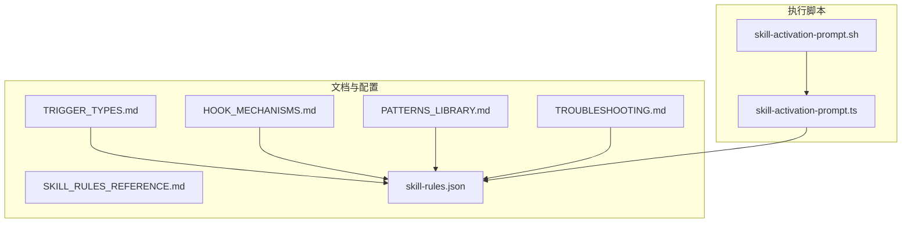
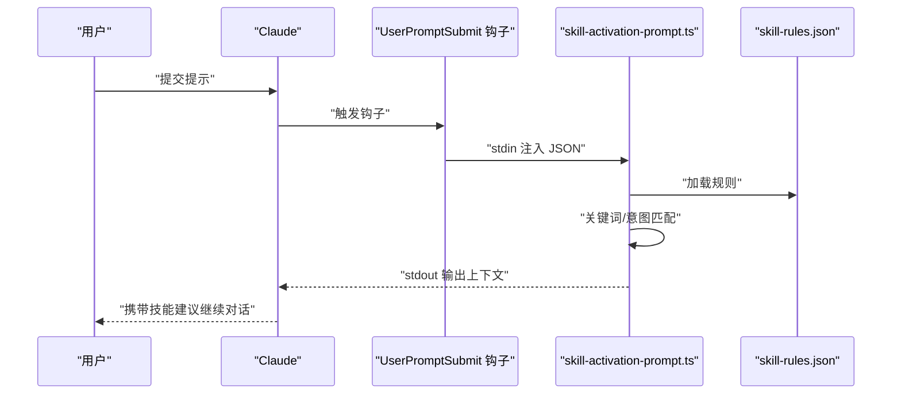
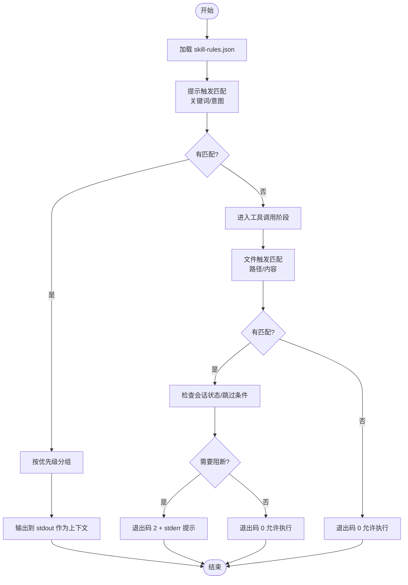
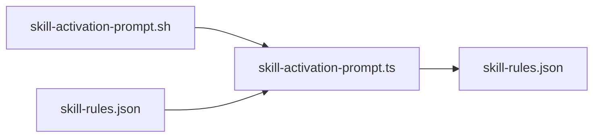

# 触发机制设计

<cite>
**本文引用的文件**
- [TRIGGER_TYPES.md](file://skills/skill-developer/TRIGGER_TYPES.md)
- [HOOK_MECHANISMS.md](file://skills/skill-developer/HOOK_MECHANISMS.md)
- [skill-rules.json](file://skills/skill-rules.json)
- [skill-activation-prompt.ts](file://hooks/skill-activation-prompt.ts)
- [skill-activation-prompt.sh](file://hooks/skill-activation-prompt.sh)
- [SKILL_RULES_REFERENCE.md](file://skills/skill-developer/SKILL_RULES_REFERENCE.md)
- [TROUBLESHOOTING.md](file://skills/skill-developer/TROUBLESHOOTING.md)
- [PATTERNS_LIBRARY.md](file://skills/skill-developer/PATTERNS_LIBRARY.md)
</cite>

## 目录
1. [引言](#引言)
2. [项目结构](#项目结构)
3. [核心组件](#核心组件)
4. [架构总览](#架构总览)
5. [详细组件分析](#详细组件分析)
6. [依赖分析](#依赖分析)
7. [性能考虑](#性能考虑)
8. [故障排查指南](#故障排查指南)
9. [结论](#结论)
10. [附录](#附录)

## 引言
本文件系统性阐述 Claude Code 技能自动激活系统的“触发机制设计”。围绕四种触发类型——关键词触发（keywords）、意图模式（intent patterns）、文件路径触发（file paths）与内容模式（content patterns），我们从设计原理、实现方式、匹配算法、正则表达式与最佳实践出发，结合配置样例、测试策略与性能优化建议，帮助读者在不同场景下正确编写与维护触发规则。

## 项目结构
该仓库将触发机制的文档与实现分层组织：
- 文档层：位于 skills/skill-developer 下，包含触发类型详解、钩子机制、规则参考、模式库与故障排查等。
- 配置层：位于 skills/skill-rules.json，定义各技能的触发规则与优先级。
- 执行层：位于 hooks/ 下，包含用户提示提交前的触发检测脚本与 shell 包装器。

图表来源
- [TRIGGER_TYPES.md](file://skills/skill-developer/TRIGGER_TYPES.md#L1-L306)
- [HOOK_MECHANISMS.md](file://skills/skill-developer/HOOK_MECHANISMS.md#L1-L307)
- [SKILL_RULES_REFERENCE.md](file://skills/skill-developer/SKILL_RULES_REFERENCE.md#L112-L183)
- [PATTERNS_LIBRARY.md](file://skills/skill-developer/PATTERNS_LIBRARY.md#L79-L153)
- [TROUBLESHOOTING.md](file://skills/skill-developer/TROUBLESHOOTING.md#L159-L245)
- [skill-rules.json](file://skills/skill-rules.json#L1-L250)
- [skill-activation-prompt.sh](file://hooks/skill-activation-prompt.sh#L1-L6)
- [skill-activation-prompt.ts](file://hooks/skill-activation-prompt.ts#L1-L133)

章节来源
- [TRIGGER_TYPES.md](file://skills/skill-developer/TRIGGER_TYPES.md#L1-L306)
- [HOOK_MECHANISMS.md](file://skills/skill-developer/HOOK_MECHANISMS.md#L1-L307)
- [skill-rules.json](file://skills/skill-rules.json#L1-L250)
- [skill-activation-prompt.ts](file://hooks/skill-activation-prompt.ts#L1-L133)
- [skill-activation-prompt.sh](file://hooks/skill-activation-prompt.sh#L1-L6)

## 核心组件
- 触发类型定义与使用场景：关键词触发用于显式主题词；意图模式用于隐式动作意图；文件路径触发基于编辑文件位置；内容模式基于文件内容特征。
- 规则配置中心：skill-rules.json 定义每个技能的 promptTriggers 与 fileTriggers，以及优先级与强制级别。
- 钩子执行流程：UserPromptSubmit 钩子在用户提交提示前运行，PreToolUse 钩子在工具调用前运行，二者通过 exit code 控制行为。
- 模式库与参考：TRIGGER_TYPES.md 提供模式编写指南；PATTERNS_LIBRARY.md 提供常用正则/通配符模板；SKILL_RULES_REFERENCE.md 提供完整 schema 示例。

章节来源
- [TRIGGER_TYPES.md](file://skills/skill-developer/TRIGGER_TYPES.md#L15-L306)
- [HOOK_MECHANISMS.md](file://skills/skill-developer/HOOK_MECHANISMS.md#L15-L307)
- [skill-rules.json](file://skills/skill-rules.json#L1-L250)
- [PATTERNS_LIBRARY.md](file://skills/skill-developer/PATTERNS_LIBRARY.md#L79-L153)
- [SKILL_RULES_REFERENCE.md](file://skills/skill-developer/SKILL_RULES_REFERENCE.md#L112-L183)

## 架构总览
下图展示了“提示提交前”与“工具调用前”的两条关键链路，以及它们如何读取 skill-rules.json 并输出上下文或阻断请求。

图表来源
- [HOOK_MECHANISMS.md](file://skills/skill-developer/HOOK_MECHANISMS.md#L15-L80)
- [skill-activation-prompt.ts](file://hooks/skill-activation-prompt.ts#L36-L127)
- [skill-rules.json](file://skills/skill-rules.json#L1-L250)

章节来源
- [HOOK_MECHANISMS.md](file://skills/skill-developer/HOOK_MECHANISMS.md#L15-L80)
- [skill-activation-prompt.ts](file://hooks/skill-activation-prompt.ts#L36-L127)

## 详细组件分析

### 关键词触发（keywords）
- 设计原理：对用户提示进行大小写不敏感的子串匹配，适合用户明确提及主题的场景。
- 实现要点：
  - 将提示转为小写后逐个检查关键词是否出现在提示中。
  - 命中即记录技能名称与匹配类型，参与后续分组与输出。
- 复杂度：O(K) 检查每个技能的关键词列表，K 为关键词数量。
- 最佳实践：
  - 使用具体、无歧义术语。
  - 包含常见变体，避免过于通用词汇。
  - 结合意图模式提升覆盖面。

章节来源
- [TRIGGER_TYPES.md](file://skills/skill-developer/TRIGGER_TYPES.md#L15-L45)
- [skill-activation-prompt.ts](file://hooks/skill-activation-prompt.ts#L57-L66)

### 意图模式（intent patterns）
- 设计原理：使用正则表达式检测用户意图，即使未直接提及主题也能识别动作需求。
- 实现要点：
  - 对每个技能的意图模式逐一编译正则（大小写不敏感），测试提示是否匹配。
  - 支持非贪婪匹配，降低误匹配风险。
- 复杂度：O(P) 编译与测试每个技能的意图模式，P 为意图模式数量。
- 最佳实践：
  - 动作动词与领域名词组合。
  - 使用非贪婪匹配。
  - 在测试平台验证后再上线。

章节来源
- [TRIGGER_TYPES.md](file://skills/skill-developer/TRIGGER_TYPES.md#L48-L107)
- [skill-activation-prompt.ts](file://hooks/skill-activation-prompt.ts#L68-L77)

### 文件路径触发（file paths）
- 设计原理：对当前编辑文件路径进行通配符匹配，按文件位置域激活技能。
- 实现要点（预工具调用阶段）：
  - 读取输入 JSON 中的 file_path。
  - 依次匹配 pathPatterns，命中后可进一步读取文件内容进行内容模式匹配。
  - 可配置 pathExclusions 排除测试文件等。
- 匹配算法：通配符 glob 匹配，支持 **（任意层级目录）与 *（单层通配）。
- 复杂度：O(F) 检查每个路径模式，F 为路径模式数量。
- 最佳实践：
  - 路径尽量具体，缩小扫描范围。
  - 使用排除项过滤测试文件。
  - 与内容模式配合，提高准确性。

章节来源
- [TRIGGER_TYPES.md](file://skills/skill-developer/TRIGGER_TYPES.md#L111-L185)
- [HOOK_MECHANISMS.md](file://skills/skill-developer/HOOK_MECHANISMS.md#L82-L167)
- [skill-rules.json](file://skills/skill-rules.json#L34-L50)

### 内容模式（content patterns）
- 设计原理：对文件内容进行正则匹配，识别技术栈或结构特征（如 Prisma、控制器、错误处理块等）。
- 实现要点（预工具调用阶段）：
  - 当配置了 contentPatterns 且文件存在时，读取文件内容进行匹配。
  - 正则默认大小写不敏感，需注意特殊字符转义。
- 匹配算法：逐条正则测试，命中即视为匹配。
- 复杂度：O(C) 测试每个内容模式，C 为内容模式数量；读取文件为 O(B)，B 为文件字节数。
- 最佳实践：
  - 匹配导入语句与类名等稳定特征。
  - 转义正则特殊字符。
  - 仅在必要时启用，避免大文件读取开销。

章节来源
- [TRIGGER_TYPES.md](file://skills/skill-developer/TRIGGER_TYPES.md#L189-L258)
- [HOOK_MECHANISMS.md](file://skills/skill-developer/HOOK_MECHANISMS.md#L82-L167)
- [skill-rules.json](file://skills/skill-rules.json#L145-L183)

### 触发匹配流程与优先级
- 用户提示提交前：关键词与意图模式匹配，按优先级分组输出建议。
- 工具调用前：路径与内容模式匹配，结合会话状态与跳过条件决定允许或阻断。

图表来源
- [HOOK_MECHANISMS.md](file://skills/skill-developer/HOOK_MECHANISMS.md#L82-L167)
- [skill-rules.json](file://skills/skill-rules.json#L1-L250)

章节来源
- [HOOK_MECHANISMS.md](file://skills/skill-developer/HOOK_MECHANISMS.md#L82-L167)
- [skill-rules.json](file://skills/skill-rules.json#L1-L250)

## 依赖分析
- 组件耦合：
  - skill-activation-prompt.ts 依赖 skill-rules.json 的结构与字段。
  - 钩子脚本通过 shell 包装器将 stdin 注入 TypeScript 脚本。
- 外部依赖：
  - Node/TS 运行时与正则引擎。
  - 文件系统读取（路径与内容模式）。
- 潜在循环依赖：无直接循环，但规则文件被多处读取，应避免频繁重载带来的性能问题。

图表来源
- [skill-activation-prompt.ts](file://hooks/skill-activation-prompt.ts#L43-L46)
- [skill-rules.json](file://skills/skill-rules.json#L1-L250)
- [skill-activation-prompt.sh](file://hooks/skill-activation-prompt.sh#L4-L5)

章节来源
- [skill-activation-prompt.ts](file://hooks/skill-activation-prompt.ts#L43-L46)
- [skill-rules.json](file://skills/skill-rules.json#L1-L250)
- [skill-activation-prompt.sh](file://hooks/skill-activation-prompt.sh#L4-L5)

## 性能考虑
- 目标指标：
  - UserPromptSubmit：<100ms
  - PreToolUse：<200ms
- 瓶颈与优化：
  - 规则加载：每次执行均读取 JSON，建议缓存或按变更重载。
  - 文件读取：仅在启用内容模式且文件存在时读取，注意大文件。
  - 正则编译：意图模式与内容模式逐条编译，建议惰性编译与缓存。
  - 路径匹配：glob 匹配次数与模式数成正比，尽量精简模式。

章节来源
- [HOOK_MECHANISMS.md](file://skills/skill-developer/HOOK_MECHANISMS.md#L260-L301)

## 故障排查指南
- 关键词/意图模式未命中：
  - 检查大小写与变体覆盖。
  - 使用正则测试工具验证模式。
- 路径模式未命中：
  - 确认文件路径与模式一致，注意通配符语义。
  - 检查是否被排除项覆盖。
- 内容模式未命中：
  - 确认文件内容包含所需特征。
  - 注意正则转义与大小写不敏感标志。
- 会话状态导致不再阻断：
  - 查看会话状态文件，确认技能已在本次会话中使用。
- 文件标记或环境变量导致跳过：
  - 检查文件内注释标记与环境变量开关。
- 手动调试命令：
  - 使用提供的测试命令模拟输入，观察输出与退出码。

章节来源
- [TROUBLESHOOTING.md](file://skills/skill-developer/TROUBLESHOOTING.md#L159-L245)
- [TRIGGER_TYPES.md](file://skills/skill-developer/TRIGGER_TYPES.md#L281-L298)

## 结论
该触发机制通过“关键词+意图+路径+内容”的多维组合，实现了对用户意图与上下文的精准感知，并在工具调用前提供阻断与建议能力。遵循本文的最佳实践与性能优化建议，可在保证准确性的同时提升响应速度与可维护性。

## 附录

### 触发类型与匹配算法速览
- 关键词触发：大小写不敏感子串匹配，复杂度 O(K)。
- 意图模式：正则匹配（大小写不敏感），复杂度 O(P)。
- 文件路径触发：glob 匹配，复杂度 O(F)。
- 内容模式：正则匹配文件内容，复杂度 O(C)+读取开销。

章节来源
- [TRIGGER_TYPES.md](file://skills/skill-developer/TRIGGER_TYPES.md#L15-L258)
- [HOOK_MECHANISMS.md](file://skills/skill-developer/HOOK_MECHANISMS.md#L82-L167)

### 常用模式参考
- 正则模式库（来自模式库文档）：
  - 数据库/Prisma：导入、服务类、查询方法等。
  - 控制器/路由：类名、Express 路由等。
  - 错误处理：try/catch/throw 等。
  - React 组件：函数组件、默认导出、Hooks 等。
- 通配符模式库（来自触发类型文档）：
  - 前端组件、后端服务、数据库、工作流、测试排除等。

章节来源
- [PATTERNS_LIBRARY.md](file://skills/skill-developer/PATTERNS_LIBRARY.md#L79-L153)
- [TRIGGER_TYPES.md](file://skills/skill-developer/TRIGGER_TYPES.md#L159-L185)

### 配置示例与参考
- Guardrail 技能示例（来自规则参考文档）：
  - 同时配置 promptTriggers 与 fileTriggers，包含路径、排除与内容模式。
  - 定义阻断消息与跳过条件（会话已用、文件标记、环境变量）。

章节来源
- [SKILL_RULES_REFERENCE.md](file://skills/skill-developer/SKILL_RULES_REFERENCE.md#L112-L183)