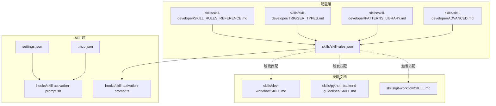
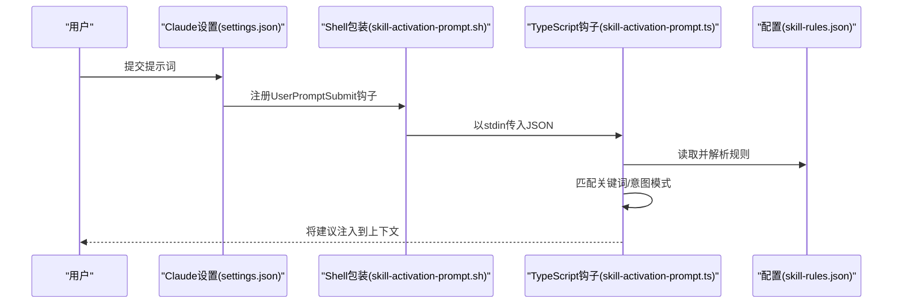
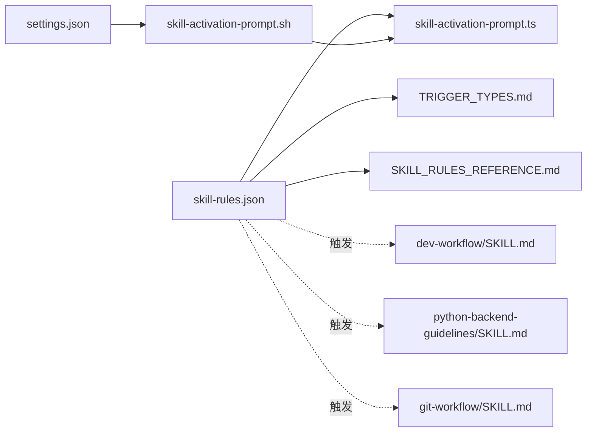

# 配置管理

<cite>
**本文引用的文件**
- [skill-rules.json](file://skills/skill-rules.json)
- [SKILL_RULES_REFERENCE.md](file://skills/skill-developer/SKILL_RULES_REFERENCE.md)
- [TRIGGER_TYPES.md](file://skills/skill-developer/TRIGGER_TYPES.md)
- [HOOK_MECHANISMS.md](file://skills/skill-developer/HOOK_MECHANISMS.md)
- [TROUBLESHOOTING.md](file://skills/skill-developer/TROUBLESHOOTING.md)
- [PATTERNS_LIBRARY.md](file://skills/skill-developer/PATTERNS_LIBRARY.md)
- [ADVANCED.md](file://skills/skill-developer/ADVANCED.md)
- [settings.json](file://settings.json)
- [.mcp.json](file://.mcp.json)
- [skill-activation-prompt.ts](file://hooks/skill-activation-prompt.ts)
- [skill-activation-prompt.sh](file://hooks/skill-activation-prompt.sh)
- [SKILL.md（开发工作流）](file://skills/dev-workflow/SKILL.md)
- [SKILL.md（Python后端指南）](file://skills/python-backend-guidelines/SKILL.md)
- [SKILL.md（Git工作流）](file://skills/git-workflow/SKILL.md)
</cite>

## 目录
1. [简介](#简介)
2. [项目结构](#项目结构)
3. [核心组件](#核心组件)
4. [架构总览](#架构总览)
5. [详细组件分析](#详细组件分析)
6. [依赖关系分析](#依赖关系分析)
7. [性能考量](#性能考量)
8. [故障排查指南](#故障排查指南)
9. [结论](#结论)
10. [附录](#附录)

## 简介
本文件系统化阐述技能自动激活系统的配置管理，重点围绕 skill-rules.json 的完整结构与字段定义，涵盖技能类型、执行级别、优先级、触发条件等，并结合实际实现文件说明 JSON Schema、验证规则与错误处理机制。同时提供最佳实践建议（版本控制、环境变量覆盖、动态更新策略），并给出完整配置示例与常见错误的解决方案。

## 项目结构
该配置体系由“配置文件 + 钩子脚本 + 设置文件 + 技能文档”构成，形成“声明式规则 + 运行时匹配 + 执行约束”的闭环。

图表来源
- [skill-rules.json](file://skills/skill-rules.json#L1-L250)
- [SKILL_RULES_REFERENCE.md](file://skills/skill-developer/SKILL_RULES_REFERENCE.md#L1-L316)
- [TRIGGER_TYPES.md](file://skills/skill-developer/TRIGGER_TYPES.md#L1-L306)
- [HOOK_MECHANISMS.md](file://skills/skill-developer/HOOK_MECHANISMS.md#L1-L307)
- [settings.json](file://settings.json#L1-L37)
- [.mcp.json](file://.mcp.json#L1-L19)
- [skill-activation-prompt.ts](file://hooks/skill-activation-prompt.ts#L1-L133)
- [skill-activation-prompt.sh](file://hooks/skill-activation-prompt.sh#L1-L6)
- [SKILL.md（开发工作流）](file://skills/dev-workflow/SKILL.md#L1-L397)
- [SKILL.md（Python后端指南）](file://skills/python-backend-guidelines/SKILL.md#L1-L596)
- [SKILL.md（Git工作流）](file://skills/git-workflow/SKILL.md#L1-L440)

章节来源
- [skill-rules.json](file://skills/skill-rules.json#L1-L250)
- [settings.json](file://settings.json#L1-L37)
- [.mcp.json](file://.mcp.json#L1-L19)

## 核心组件
- 配置文件：skills/skill-rules.json，定义技能规则、触发条件与执行策略。
- 规则参考：SKILL_RULES_REFERENCE.md，提供 TypeScript Schema 与字段说明。
- 触发类型：TRIGGER_TYPES.md，详解关键词、意图模式、路径与内容匹配。
- 钩子机制：HOOK_MECHANISMS.md，说明 UserPromptSubmit 与 PreToolUse 的执行流程与退出码语义。
- 故障排查：TROUBLESHOOTING.md，覆盖不触发、误报、钩子未执行、性能问题等。
- 模式库：PATTERNS_LIBRARY.md，提供可复用的正则与通配符模板。
- 高级主题：ADVANCED.md，讨论动态更新、依赖、条件执行、版本化等未来能力。
- 运行时设置：settings.json 定义钩子注册；.mcp.json 定义多 AI 协作服务器。

章节来源
- [SKILL_RULES_REFERENCE.md](file://skills/skill-developer/SKILL_RULES_REFERENCE.md#L1-L316)
- [TRIGGER_TYPES.md](file://skills/skill-developer/TRIGGER_TYPES.md#L1-L306)
- [HOOK_MECHANISMS.md](file://skills/skill-developer/HOOK_MECHANISMS.md#L1-L307)
- [TROUBLESHOOTING.md](file://skills/skill-developer/TROUBLESHOOTING.md#L1-L515)
- [PATTERNS_LIBRARY.md](file://skills/skill-developer/PATTERNS_LIBRARY.md#L1-L153)
- [ADVANCED.md](file://skills/skill-developer/ADVANCED.md#L1-L198)
- [settings.json](file://settings.json#L1-L37)
- [.mcp.json](file://.mcp.json#L1-L19)

## 架构总览
技能自动激活系统通过“声明式规则 + 运行时匹配 + 强制执行”三段式实现：

图表来源
- [settings.json](file://settings.json#L13-L23)
- [skill-activation-prompt.sh](file://hooks/skill-activation-prompt.sh#L1-L6)
- [skill-activation-prompt.ts](file://hooks/skill-activation-prompt.ts#L36-L127)
- [skill-rules.json](file://skills/skill-rules.json#L1-L250)

章节来源
- [HOOK_MECHANISMS.md](file://skills/skill-developer/HOOK_MECHANISMS.md#L15-L80)
- [settings.json](file://settings.json#L13-L23)
- [skill-activation-prompt.ts](file://hooks/skill-activation-prompt.ts#L36-L127)

## 详细组件分析

### skill-rules.json 结构与字段定义
- 版本与描述：version、description
- 技能映射：skills 对象，键为技能名，值为 SkillRule
- 备注说明：notes 中包含执行级别、优先级、自定义建议与多 AI 支持说明

SkillRule 字段要点
- type：guardrail（强制）或 domain（领域建议）
- enforcement：block（阻止）、suggest（建议）、warn（警告）
- priority：critical、high、medium、low
- promptTriggers：关键词与意图模式（正则）
- fileTriggers：路径模式、排除模式、内容模式、仅创建触发
- blockMessage：强制类技能的阻断消息（支持占位符）
- skipConditions：会话内跳过、文件标记、环境变量覆盖

章节来源
- [skill-rules.json](file://skills/skill-rules.json#L1-L250)
- [SKILL_RULES_REFERENCE.md](file://skills/skill-developer/SKILL_RULES_REFERENCE.md#L24-L56)
- [TRIGGER_TYPES.md](file://skills/skill-developer/TRIGGER_TYPES.md#L15-L107)

### JSON Schema 与验证规则
- 必填字段：version、skills
- 类型约束：字符串、枚举集合
- 关系约束：guardrail 必须有 blockMessage；若存在 fileTriggers 则 pathPatterns 必填
- 正则与通配符：意图模式需有效正则；路径模式使用 glob 语法
- 建议校验清单：jq 校验 JSON 语法；技能名与 SKILL.md 一致；正则在 regex101 测试；路径/内容模式正确转义

章节来源
- [SKILL_RULES_REFERENCE.md](file://skills/skill-developer/SKILL_RULES_REFERENCE.md#L24-L56)
- [SKILL_RULES_REFERENCE.md](file://skills/skill-developer/SKILL_RULES_REFERENCE.md#L265-L310)

### 触发条件配置
- 关键词触发（显式）：promptTriggers.keywords，大小写无关的子串匹配
- 意图模式触发（隐式）：promptTriggers.intentPatterns，正则表达式捕获用户意图
- 路径触发：fileTriggers.pathPatterns（glob），配合 pathExclusions 排除测试等目录
- 内容触发：fileTriggers.contentPatterns，正则匹配文件内容（大小写无关）
- 创建触发：createOnly 仅在新建文件时触发

章节来源
- [TRIGGER_TYPES.md](file://skills/skill-developer/TRIGGER_TYPES.md#L15-L286)

### 执行级别与优先级
- enforcement 与 type 的组合决定行为：
  - guardrail + block：PreToolUse 阻止编辑并返回阻断消息
  - domain + suggest/warn：UserPromptSubmit 提示建议
- priority 决定建议分组与呈现顺序（critical → high → medium → low）

章节来源
- [HOOK_MECHANISMS.md](file://skills/skill-developer/HOOK_MECHANISMS.md#L170-L208)
- [skill-rules.json](file://skills/skill-rules.json#L230-L247)

### 错误处理与会话状态
- PreToolUse 钩子在命中且未被跳过时，通过退出码 2 阻止工具执行，并向 Claude 输出阻断消息
- 会话状态：skills-used-{session_id}.json 记录已使用的技能，避免同一会话重复阻断
- 失败开路：钩子异常默认允许操作，不中断工作流

章节来源
- [HOOK_MECHANISMS.md](file://skills/skill-developer/HOOK_MECHANISMS.md#L82-L167)
- [HOOK_MECHANISMS.md](file://skills/skill-developer/HOOK_MECHANISMS.md#L211-L257)

### 配置示例与最佳实践
- 示例技能：数据库验证（guardrail）、项目目录开发者（domain）
- 最佳实践：关键词具体化、意图模式非贪婪、路径模式精确、内容模式转义特殊字符、添加测试排除、减少冗余模式

章节来源
- [SKILL_RULES_REFERENCE.md](file://skills/skill-developer/SKILL_RULES_REFERENCE.md#L112-L262)
- [TRIGGER_TYPES.md](file://skills/skill-developer/TRIGGER_TYPES.md#L262-L300)

## 依赖关系分析
- 配置依赖：skill-rules.json 依赖 TRIGGER_TYPES.md 的模式规范与 SKILL_RULES_REFERENCE.md 的 Schema 约束
- 运行时依赖：settings.json 注册钩子；skill-activation-prompt.sh 作为包装器；skill-activation-prompt.ts 实际匹配逻辑
- 技能文档依赖：各技能的 SKILL.md 描述了触发场景与使用时机，与 fileTriggers 的路径/内容模式相呼应

图表来源
- [skill-rules.json](file://skills/skill-rules.json#L1-L250)
- [TRIGGER_TYPES.md](file://skills/skill-developer/TRIGGER_TYPES.md#L1-L306)
- [SKILL_RULES_REFERENCE.md](file://skills/skill-developer/SKILL_RULES_REFERENCE.md#L1-L316)
- [settings.json](file://settings.json#L13-L23)
- [skill-activation-prompt.sh](file://hooks/skill-activation-prompt.sh#L1-L6)
- [skill-activation-prompt.ts](file://hooks/skill-activation-prompt.ts#L1-L133)
- [SKILL.md（开发工作流）](file://skills/dev-workflow/SKILL.md#L1-L397)
- [SKILL.md（Python后端指南）](file://skills/python-backend-guidelines/SKILL.md#L1-L596)
- [SKILL.md（Git工作流）](file://skills/git-workflow/SKILL.md#L1-L440)

章节来源
- [settings.json](file://settings.json#L13-L23)
- [skill-activation-prompt.ts](file://hooks/skill-activation-prompt.ts#L36-L127)

## 性能考量
- 目标阈值：<100ms（UserPromptSubmit）、<200ms（PreToolUse）
- 性能瓶颈：加载配置、glob 匹配、正则编译与匹配、读取文件内容
- 优化策略：减少模式数量、使用更具体的路径模式、简化正则、按需启用内容匹配

章节来源
- [HOOK_MECHANISMS.md](file://skills/skill-developer/HOOK_MECHANISMS.md#L260-L301)

## 故障排查指南
- 技能未触发
  - 关键词不匹配：检查 promptTriggers.keywords 是否出现在提示中
  - 意图模式过严：放宽正则范围，使用非贪婪匹配
  - 技能名不一致：确保 skill-rules.json 中的键与对应 SKILL.md 的 name 一致
  - JSON 语法错误：使用 jq 校验
- PreToolUse 未阻断
  - 路径不匹配：核对 fileTriggers.pathPatterns 与实际路径
  - 被排除：检查 pathExclusions 是否误伤
  - 内容模式未命中：确认文件是否包含 contentPatterns
  - 会话已使用：删除 skills-used-{session_id}.json 或更换会话
  - 文件标记/环境变量覆盖：移除 @skip-validation 或 unset 环境变量
- 钩子未执行
  - settings.json 缺少钩子注册或命令路径错误
  - Shell 包装器不可执行或 shebang 不正确
  - npx/tsx 缺失或 TypeScript 编译失败
- 性能问题
  - 减少模式数量与复杂度，缩小路径范围，避免大文件内容匹配

章节来源
- [TROUBLESHOOTING.md](file://skills/skill-developer/TROUBLESHOOTING.md#L16-L515)

## 结论
skill-rules.json 通过“类型-执行级别-优先级-触发条件”的组合，实现了面向领域的智能技能建议与强制性守卫。结合 settings.json 的钩子注册与 TypeScript 钩子的实际匹配逻辑，形成了稳定可靠的自动化工作流。遵循本文提供的验证规则、最佳实践与故障排查方法，可显著提升配置质量与系统稳定性。

## 附录

### JSON Schema（字段对照表）
- 顶层
  - version：字符串，必填
  - skills：对象，键为技能名，值为 SkillRule，必填
- SkillRule
  - type：guardrail/domain，必填
  - enforcement：block/suggest/warn，必填
  - priority：critical/high/medium/low，必填
  - promptTriggers：可选
  - fileTriggers：可选
  - blockMessage：可选（当 enforcement=block 时必填）
  - skipConditions：可选

章节来源
- [SKILL_RULES_REFERENCE.md](file://skills/skill-developer/SKILL_RULES_REFERENCE.md#L61-L109)

### 触发类型与模式库
- 关键词触发：适合明确主题的显式触发
- 意图模式：适合动作导向的隐式触发，推荐非贪婪匹配
- 路径模式：使用 glob 语法，注意排除测试文件
- 内容模式：匹配导入/调用等代码特征，需转义正则特殊字符

章节来源
- [TRIGGER_TYPES.md](file://skills/skill-developer/TRIGGER_TYPES.md#L15-L286)
- [PATTERNS_LIBRARY.md](file://skills/skill-developer/PATTERNS_LIBRARY.md#L1-L153)

### 多 AI 协作与环境集成
- .mcp.json 支持 Codex 与 Gemini MCP 服务器，实现多 AI 协作
- settings.json 注册钩子，确保 UserPromptSubmit 在提示提交前执行

章节来源
- [.mcp.json](file://.mcp.json#L1-L19)
- [settings.json](file://settings.json#L13-L35)