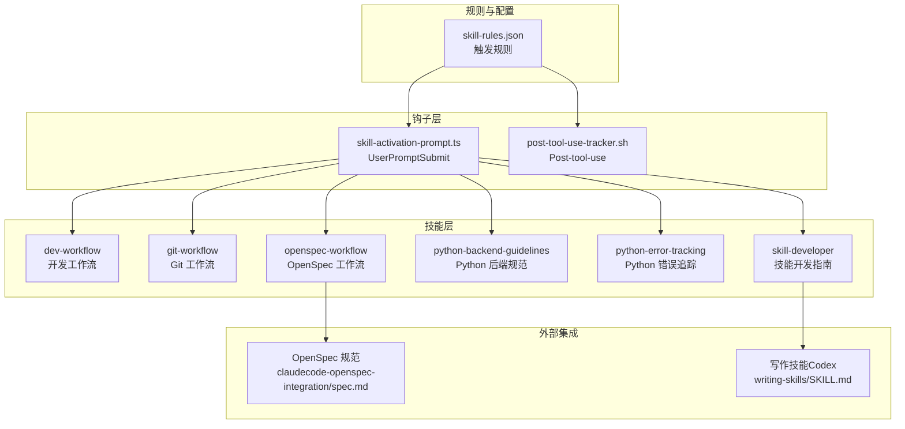
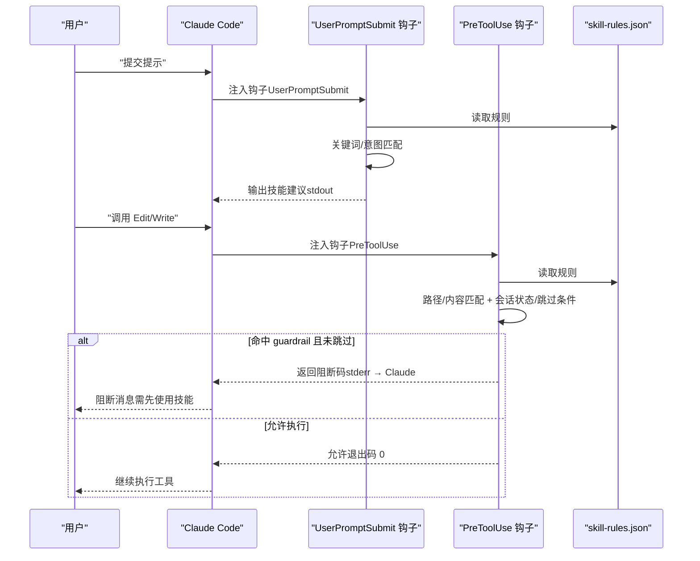
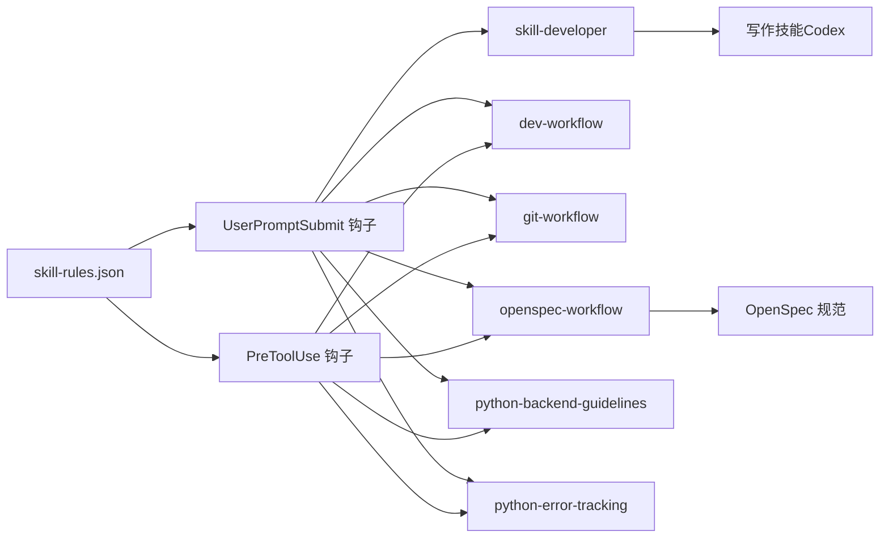

# 技能系统

<cite>
**本文引用的文件**
- [README.md](file://README.md)
- [skills/README.md](file://skills/README.md)
- [skills/skill-rules.json](file://skills/skill-rules.json)
- [skills/skill-developer/SKILL.md](file://skills/skill-developer/SKILL.md)
- [skills/skill-developer/HOOK_MECHANISMS.md](file://skills/skill-developer/HOOK_MECHANISMS.md)
- [skills/skill-developer/TRIGGER_TYPES.md](file://skills/skill-developer/TRIGGER_TYPES.md)
- [hooks/skill-activation-prompt.ts](file://hooks/skill-activation-prompt.ts)
- [hooks/post-tool-use-tracker.sh](file://hooks/post-tool-use-tracker.sh)
- [skills/dev-workflow/SKILL.md](file://skills/dev-workflow/SKILL.md)
- [skills/git-workflow/SKILL.md](file://skills/git-workflow/SKILL.md)
- [skills/openspec-workflow/SKILL.md](file://skills/openspec-workflow/SKILL.md)
- [skills/python-backend-guidelines/SKILL.md](file://skills/python-backend-guidelines/SKILL.md)
- [skills/python-error-tracking/SKILL.md](file://skills/python-error-tracking/SKILL.md)
- [openspec/specs/claudecode-openspec-integration/spec.md](file://openspec/specs/claudecode-openspec-integration/spec.md)
- [global/codex-skills/writing-skills/SKILL.md](file://global/codex-skills/writing-skills/SKILL.md)
</cite>

## 目录
1. [简介](#简介)
2. [项目结构](#项目结构)
3. [核心组件](#核心组件)
4. [架构总览](#架构总览)
5. [详细组件分析](#详细组件分析)
6. [依赖关系分析](#依赖关系分析)
7. [性能考量](#性能考量)
8. [故障排查指南](#故障排查指南)
9. [结论](#结论)
10. [附录](#附录)

## 简介
本技能系统围绕 Claude Code 的“技能”（Skills）与“钩子”（Hooks）机制构建，提供可自动激活的知识库，覆盖开发工作流、Git 工作流、OpenSpec 规范驱动开发、Python 后端规范与错误追踪等专业领域。系统通过 skill-rules.json 定义触发规则，结合 UserPromptSubmit 与 PreToolUse 两类钩子实现“建议 + 保护”的双轨控制：前者在用户提交提示前注入上下文提醒，后者在工具执行前进行守卫拦截，确保关键流程与最佳实践落地。

## 项目结构
- 核心技能目录：skills/
  - dev-workflow：SDD 开发工作流（严格阶段顺序与文档约定）
  - git-workflow：Git 分支与提交规范
  - openspec-workflow：OpenSpec 规范驱动开发工作流
  - python-backend-guidelines：Python/Django/FastAPI 后端开发规范
  - python-error-tracking：Sentry 错误追踪与性能监控
  - skill-developer：技能开发指南（含钩子机制、触发类型、最佳实践）
- 钩子目录：hooks/
  - skill-activation-prompt.ts：UserPromptSubmit 钩子，基于关键词与意图模式建议技能
  - post-tool-use-tracker.sh：工具使用后钩子，记录编辑文件与仓库信息
- 配置与规则：skills/skill-rules.json
- OpenSpec 规范：openspec/specs/claudecode-openspec-integration/spec.md
- 全局写作技能：global/codex-skills/writing-skills/SKILL.md（面向技能作者的 TDD 方法）

图表来源
- [skills/README.md](file://skills/README.md#L1-L369)
- [skills/skill-rules.json](file://skills/skill-rules.json#L1-L250)
- [hooks/skill-activation-prompt.ts](file://hooks/skill-activation-prompt.ts#L1-L133)
- [hooks/post-tool-use-tracker.sh](file://hooks/post-tool-use-tracker.sh#L1-L178)
- [openspec/specs/claudecode-openspec-integration/spec.md](file://openspec/specs/claudecode-openspec-integration/spec.md#L1-L54)
- [global/codex-skills/writing-skills/SKILL.md](file://global/codex-skills/writing-skills/SKILL.md#L1-L655)

章节来源
- [README.md](file://README.md#L1-L229)
- [skills/README.md](file://skills/README.md#L1-L369)

## 核心组件
- 技能（Skills）
  - 开发工作流（dev-workflow）：强制阶段顺序（需求→设计→实现→评审→测试→完成），严格的文档与目录约定。
  - Git 工作流（git-workflow）：分支命名、提交信息、预提交检查与合并流程。
  - OpenSpec 工作流（openspec-workflow）：提案创建、应用与归档，规范先行。
  - Python 后端规范（python-backend-guidelines）：分层架构、Pydantic/序列化、服务层、异步与错误处理。
  - Python 错误追踪（python-error-tracking）：Sentry 初始化、异常捕获、性能监控、背景信息与标签。
  - 技能开发指南（skill-developer）：两钩子架构、触发类型、执行机制、最佳实践与排障。
- 钩子（Hooks）
  - UserPromptSubmit（skill-activation-prompt.ts）：读取 skill-rules.json，匹配关键词/意图，输出建议清单。
  - Post-tool-use（post-tool-use-tracker.sh）：记录编辑文件、识别仓库、收集构建与类型检查命令。
- 规则（skill-rules.json）
  - 定义技能类型（guardrail/domain）、执行级别（block/suggest/warn）、优先级（critical/high/medium/low）与触发器（关键词、意图、路径、内容）。

章节来源
- [skills/README.md](file://skills/README.md#L1-L369)
- [skills/skill-rules.json](file://skills/skill-rules.json#L1-L250)
- [hooks/skill-activation-prompt.ts](file://hooks/skill-activation-prompt.ts#L1-L133)
- [hooks/post-tool-use-tracker.sh](file://hooks/post-tool-use-tracker.sh#L1-L178)

## 架构总览
技能系统采用“规则驱动 + 钩子执行”的双通道架构：
- 建议通道（UserPromptSubmit）：在 Claude 处理用户提示前，基于 skill-rules.json 的关键词与意图模式，向 Claude 注入技能建议上下文，提升相关技能的可见性与使用率。
- 保护通道（PreToolUse）：在 Claude 调用 Edit/Write 等工具前，依据路径与内容模式进行守卫判断；若命中 guardrail 且未跳过，返回阻断码，阻止工具执行，并提示使用相应技能。

图表来源
- [skills/skill-developer/HOOK_MECHANISMS.md](file://skills/skill-developer/HOOK_MECHANISMS.md#L1-L307)
- [hooks/skill-activation-prompt.ts](file://hooks/skill-activation-prompt.ts#L1-L133)
- [skills/skill-rules.json](file://skills/skill-rules.json#L1-L250)

章节来源
- [skills/skill-developer/HOOK_MECHANISMS.md](file://skills/skill-developer/HOOK_MECHANISMS.md#L1-L307)

## 详细组件分析

### 技能开发指南（skill-developer）
- 两钩子架构
  - UserPromptSubmit：在提示提交前注入技能建议，非阻断，仅提供上下文。
  - Post-tool-use：在工具使用后记录文件与仓库信息，辅助后续自动化。
- 触发类型
  - 关键词触发：大小写无关的子串匹配。
  - 意图模式触发：正则表达式匹配用户意图，支持非贪婪匹配。
  - 文件路径触发：glob 模式匹配被编辑文件路径，支持排除项。
  - 内容模式触发：正则匹配文件内容（如导入语句、类名等）。
- 执行机制
  - UserPromptSubmit：读取 skill-rules.json，按优先级分组输出建议清单。
  - PreToolUse：读取工具输入，匹配路径/内容，结合会话状态与跳过条件决定阻断或放行。
- 最佳实践
  - 500 行规则：主技能文档不超过 500 行，细节移至参考文件。
  - 渐进披露：复杂主题拆分为参考文件，配合目录索引。
  - 触发器精炼：关键词明确、意图模式合理、路径与内容模式精准，避免误报与漏报。

章节来源
- [skills/skill-developer/SKILL.md](file://skills/skill-developer/SKILL.md#L1-L427)
- [skills/skill-developer/HOOK_MECHANISMES.md](file://skills/skill-developer/HOOK_MECHANISMS.md#L1-L307)
- [skills/skill-developer/TRIGGER_TYPES.md](file://skills/skill-developer/TRIGGER_TYPES.md#L1-L306)

### 开发工作流（dev-workflow）
- 阶段顺序与前置条件
  - 需求 → 设计 → 实施 → 评审 → 测试 → 完成
  - 每个阶段必须具备前置文档，阶段过渡受控。
- 目录约定
  - 任务文档：.devos/tasks/{task-id}/requirement.md/design.md/review.md/test-report.md/progress.md
  - 源码与测试：devos/ 与 tests/ 下的模块化组织。
- 文档模板与命令
  - 要求文档、设计文档、评审报告、测试报告均有模板与保存命令。
- API 参考
  - 提供 Python API 以供外部代理调用，便于自动化集成。

章节来源
- [skills/dev-workflow/SKILL.md](file://skills/dev-workflow/SKILL.md#L1-L397)

### Git 工作流（git-workflow）
- 分支命名
  - feature/{task-id}-{description}、bugfix/{task-id}-{description}、hotfix/{task-id}-{description}、release/{version}
- 提交信息（Conventional Commits）
  - 类型（feat/fix/docs/style/refactor/test/chore/perf）+ 作用域 + 概述，支持正文与页脚。
- 预提交检查
  - 分支命名、冲突标记、lint、测试等检查清单与自动化脚本。
- 合并与冲突解决
  - 特性分支合并、热修复合并、冲突标记解析与回退操作。

章节来源
- [skills/git-workflow/SKILL.md](file://skills/git-workflow/SKILL.md#L1-L440)

### OpenSpec 工作流（openspec-workflow）
- 工作流三阶段
  - 创建提案（REQUIREMENT + DESIGN）
  - 实现变更（IMPLEMENTATION + REVIEW + TESTING）
  - 归档完成（DONE）
- OpenSpec 命令
  - /openspec:proposal、/openspec:apply、/openspec:archive
- 规范与实现一致性
  - 在任务完成后对照规范进行一致性检查，报告差异。

章节来源
- [skills/openspec-workflow/SKILL.md](file://skills/openspec-workflow/SKILL.md#L1-L231)
- [openspec/specs/claudecode-openspec-integration/spec.md](file://openspec/specs/claudecode-openspec-integration/spec.md#L1-L54)

### Python 后端规范（python-backend-guidelines）
- 分层架构
  - 路由 → 视图/端点 → 服务 → 仓储 → ORM → 数据库
- FastAPI 与 Django 最佳实践
  - Pydantic/序列化校验、依赖注入、异步/并发、类型提示、中间件与认证。
- 服务层与仓储层
  - 业务逻辑与数据访问分离，便于测试与维护。
- 数据库迁移
  - Alembic（SQLAlchemy/FastAPI）与 Django migrations。

章节来源
- [skills/python-backend-guidelines/SKILL.md](file://skills/python-backend-guidelines/SKILL.md#L1-L596)

### Python 错误追踪（python-error-tracking）
- Sentry 集成
  - FastAPI/Django/Celery 等框架集成，初始化与采样率配置。
- 异常捕获与上下文
  - 捕获未预期异常、设置用户与业务上下文、标签与面包屑。
- 性能监控
  - 自动跟踪数据库查询与手动跨度（spans）标注关键路径。
- 背景任务
  - Celery 与异步任务的事务与异常处理。

章节来源
- [skills/python-error-tracking/SKILL.md](file://skills/python-error-tracking/SKILL.md#L1-L574)

### 技能作者写作技能（Codex）
- 将 TDD 应用于技能创作：RED（基线失败）→ GREEN（最小技能）→ REFACTOR（关闭漏洞）
- CSO（Claude 搜索优化）：描述字段聚焦“何时使用”，关键词覆盖症状与工具，命名采用动名词形式，压缩篇幅。
- 测试策略：针对纪律约束型、技术型、模式型与参考型技能的不同测试方法。

章节来源
- [global/codex-skills/writing-skills/SKILL.md](file://global/codex-skills/writing-skills/SKILL.md#L1-L655)

## 依赖关系分析
- 规则到钩子
  - skill-rules.json 为钩子提供触发条件，UserPromptSubmit 与 PreToolUse 分别消费关键词/意图与路径/内容。
- 钩子到技能
  - 建议通道：UserPromptSubmit 输出建议，引导 Claude 使用相关技能。
  - 保护通道：PreToolUse 命中 guardrail 时阻断工具执行，要求先使用技能。
- 技能到外部
  - OpenSpec 工作流与 OpenSpec 规范耦合，确保实现与规范一致。
  - 写作技能（Codex）指导技能作者进行 TDD 式验证。

图表来源
- [skills/skill-rules.json](file://skills/skill-rules.json#L1-L250)
- [hooks/skill-activation-prompt.ts](file://hooks/skill-activation-prompt.ts#L1-L133)
- [hooks/post-tool-use-tracker.sh](file://hooks/post-tool-use-tracker.sh#L1-L178)
- [openspec/specs/claudecode-openspec-integration/spec.md](file://openspec/specs/claudecode-openspec-integration/spec.md#L1-L54)
- [global/codex-skills/writing-skills/SKILL.md](file://global/codex-skills/writing-skills/SKILL.md#L1-L655)

章节来源
- [skills/skill-rules.json](file://skills/skill-rules.json#L1-L250)

## 性能考量
- 钩子性能目标
  - UserPromptSubmit：<100ms；PreToolUse：<200ms
- 性能瓶颈与优化
  - 规则加载：每次执行均需读取 skill-rules.json，未来可考虑内存缓存与变更监听。
  - 文件内容匹配：仅在配置了 contentPatterns 且文件存在时读取，注意大文件开销。
  - glob/正则编译：可一次性编译并缓存，减少重复成本。
- 触发器优化
  - 路径模式尽量具体，减少扫描范围；
  - 内容模式仅在必要时启用，避免过度匹配。

章节来源
- [skills/skill-developer/HOOK_MECHANISMS.md](file://skills/skill-developer/HOOK_MECHANISMS.md#L260-L301)

## 故障排查指南
- 技能未激活
  - 检查技能目录是否存在、是否在 skill-rules.json 中列出、路径模式是否匹配、钩子是否可执行、settings.json 是否正确配置。
  - 手动测试钩子：验证 UserPromptSubmit 与 PreToolUse 的输入输出。
- 技能激活过于频繁
  - 提升触发器特异性：更精确的关键词、更窄的路径模式、更严格的意图正则。
- 技能从不激活
  - 增加关键词、放宽路径模式、补充意图正则。
- PreToolUse 未阻断
  - 确认技能类型为 guardrail、会话状态与跳过条件（文件标记、环境变量）未生效。
- 性能问题
  - 减少触发器数量与复杂度，优化 glob 与正则，避免不必要的文件读取。

章节来源
- [skills/README.md](file://skills/README.md#L302-L341)
- [skills/skill-developer/HOOK_MECHANISMS.md](file://skills/skill-developer/HOOK_MECHANISMS.md#L170-L209)

## 结论
该技能系统通过规则驱动与钩子执行，实现了“建议 + 保护”的双轨机制，既提升了技能的可见性与使用效率，又在关键节点提供了强制性的守卫。结合 SDD 与 OpenSpec 的规范驱动理念，系统能够稳定地支撑从需求到实现再到测试与归档的全生命周期开发。技能作者可借助写作技能（Codex）的 TDD 方法，持续迭代技能质量，确保其在真实压力下的可靠性。

## 附录
- 快速参考
  - UserPromptSubmit：基于关键词与意图模式输出技能建议。
  - PreToolUse：基于路径与内容模式进行守卫，命中 guardrail 时阻断并提示使用技能。
  - 触发器配置：keywords、intentPatterns、pathPatterns、contentPatterns。
- 最佳实践
  - 保持 SKILL.md 不超过 500 行，细节移至参考文件；
  - 使用渐进披露与目录索引；
  - 精炼触发器，避免误报与漏报；
  - 为每个技能提供明确的“何时使用”描述，聚焦触发条件而非流程总结。