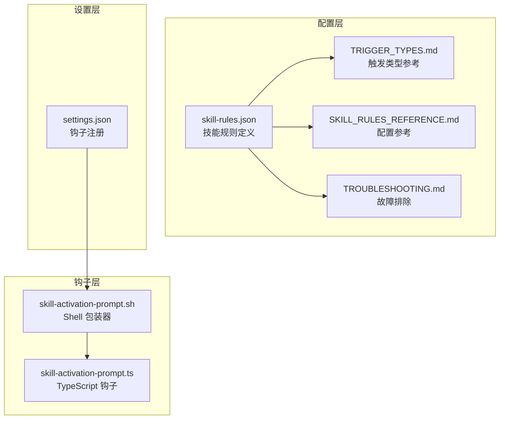
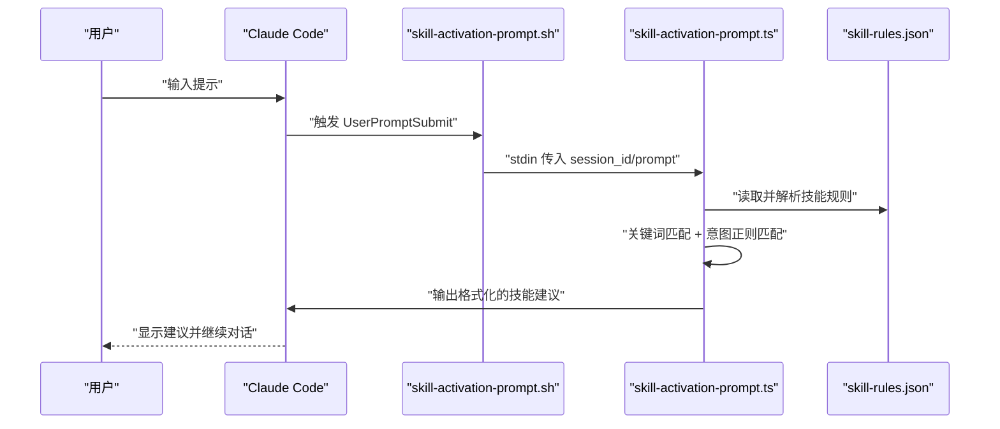
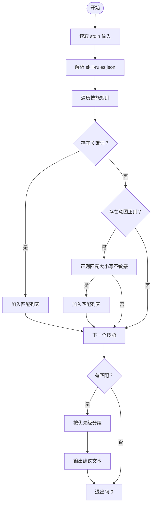
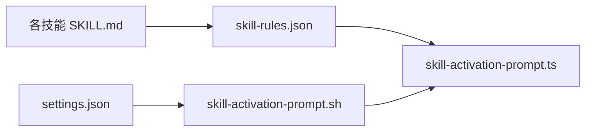

# 技能配置管理

<cite>
**本文引用的文件**
- [skills/skill-rules.json](file://skills/skill-rules.json)
- [skills/skill-developer/SKILL_RULES_REFERENCE.md](file://skills/skill-developer/SKILL_RULES_REFERENCE.md)
- [skills/skill-developer/TRIGGER_TYPES.md](file://skills/skill-developer/TRIGGER_TYPES.md)
- [skills/skill-developer/TROUBLESHOOTING.md](file://skills/skill-developer/TROUBLESHOOTING.md)
- [skills/README.md](file://skills/README.md)
- [skills/skill-developer/SKILL.md](file://skills/skill-developer/SKILL.md)
- [skills/dev-workflow/SKILL.md](file://skills/dev-workflow/SKILL.md)
- [hooks/skill-activation-prompt.ts](file://hooks/skill-activation-prompt.ts)
- [hooks/skill-activation-prompt.sh](file://hooks/skill-activation-prompt.sh)
- [settings.json](file://settings.json)
</cite>

## 目录
1. [简介](#简介)
2. [项目结构](#项目结构)
3. [核心组件](#核心组件)
4. [架构总览](#架构总览)
5. [详细组件分析](#详细组件分析)
6. [依赖关系分析](#依赖关系分析)
7. [性能考量](#性能考量)
8. [故障排除指南](#故障排除指南)
9. [结论](#结论)
10. [附录](#附录)

## 简介
本文件面向开发者与技术管理者，系统化阐述技能配置管理（skill-rules.json）的设计理念、配置语法与管理策略，覆盖关键词触发、意图模式、文件路径模式、内容模式等触发类型，并给出执行优先级、强制执行级别与技能类型的选择原则。同时提供配置优化技巧、故障排除方法与性能调优建议，帮助团队基于项目实际需求定制最优的技能配置方案。

## 项目结构
技能配置与自动激活系统由以下关键部分组成：
- 配置文件：skills/skill-rules.json 定义所有技能及其触发条件、执行策略与跳过条件
- 触发类型参考：TRIGGER_TYPES.md 提供关键词、意图、文件路径、内容模式的配置方法与最佳实践
- 配置参考：SKILL_RULES_REFERENCE.md 给出完整 schema 与字段说明
- 故障排除：TROUBLESHOOTING.md 提供常见问题定位与修复步骤
- 技能说明：各技能目录下的 SKILL.md 描述用途、触发场景与实现要点
- 钩子脚本：hooks/skill-activation-prompt.ts 与 hooks/skill-activation-prompt.sh 实现 UserPromptSubmit 钩子逻辑
- 设置文件：settings.json 注册钩子命令，确保系统正确加载

图表来源
- [skills/skill-rules.json](file://skills/skill-rules.json#L1-L250)
- [skills/skill-developer/TRIGGER_TYPES.md](file://skills/skill-developer/TRIGGER_TYPES.md#L1-L306)
- [skills/skill-developer/SKILL_RULES_REFERENCE.md](file://skills/skill-developer/SKILL_RULES_REFERENCE.md#L1-L316)
- [skills/skill-developer/TROUBLESHOOTING.md](file://skills/skill-developer/TROUBLESHOOTING.md#L1-L515)
- [hooks/skill-activation-prompt.sh](file://hooks/skill-activation-prompt.sh#L1-L6)
- [hooks/skill-activation-prompt.ts](file://hooks/skill-activation-prompt.ts#L1-L133)
- [settings.json](file://settings.json#L1-L37)

章节来源
- [skills/skill-rules.json](file://skills/skill-rules.json#L1-L250)
- [skills/skill-developer/TRIGGER_TYPES.md](file://skills/skill-developer/TRIGGER_TYPES.md#L1-L306)
- [skills/skill-developer/SKILL_RULES_REFERENCE.md](file://skills/skill-developer/SKILL_RULES_REFERENCE.md#L1-L316)
- [skills/skill-developer/TROUBLESHOOTING.md](file://skills/skill-developer/TROUBLESHOOTING.md#L1-L515)
- [hooks/skill-activation-prompt.ts](file://hooks/skill-activation-prompt.ts#L1-L133)
- [hooks/skill-activation-prompt.sh](file://hooks/skill-activation-prompt.sh#L1-L6)
- [settings.json](file://settings.json#L1-L37)

## 核心组件
- 技能规则文件（skill-rules.json）
  - 版本号、描述与技能映射
  - 每个技能包含类型（guardrail/domain）、强制执行级别（block/suggest/warn）、优先级（critical/high/medium/low）
  - 可选触发器：promptTriggers（关键词、意图模式）、fileTriggers（路径模式、内容模式、排除模式、仅创建）
  - 可选阻断消息与跳过条件（会话使用记录、文件标记、环境变量覆盖）
- 触发类型参考（TRIGGER_TYPES.md）
  - 关键词触发：显式主题匹配（大小写不敏感子串）
  - 意图模式：正则表达式检测用户意图（非贪婪匹配、避免过度宽泛或过于具体）
  - 文件路径触发：glob 模式匹配编辑文件路径
  - 内容模式：正则匹配文件内容（注意转义与大小写）
- 配置参考（SKILL_RULES_REFERENCE.md）
  - 完整 TypeScript 接口定义与字段说明
  - guardrail 与 domain 的示例与关键要点
  - 验证清单与常见 JSON 错误
- 钩子与设置
  - skill-activation-prompt.ts 执行 UserPromptSubmit 钩子，读取 skill-rules.json 并输出建议
  - skill-activation-prompt.sh 作为包装器调用 tsx
  - settings.json 注册钩子命令，确保系统加载

章节来源
- [skills/skill-rules.json](file://skills/skill-rules.json#L1-L250)
- [skills/skill-developer/TRIGGER_TYPES.md](file://skills/skill-developer/TRIGGER_TYPES.md#L1-L306)
- [skills/skill-developer/SKILL_RULES_REFERENCE.md](file://skills/skill-developer/SKILL_RULES_REFERENCE.md#L1-L316)
- [hooks/skill-activation-prompt.ts](file://hooks/skill-activation-prompt.ts#L1-L133)
- [hooks/skill-activation-prompt.sh](file://hooks/skill-activation-prompt.sh#L1-L6)
- [settings.json](file://settings.json#L1-L37)

## 架构总览
技能自动激活采用“两钩子”架构：
- UserPromptSubmit 钩子：在 Claude 看到用户提示前，基于关键词与意图模式建议相关技能
- PostToolUse 钩子：在工具使用后进行跟踪与提醒（本节聚焦 UserPromptSubmit）

图表来源
- [hooks/skill-activation-prompt.sh](file://hooks/skill-activation-prompt.sh#L1-L6)
- [hooks/skill-activation-prompt.ts](file://hooks/skill-activation-prompt.ts#L1-L133)
- [skills/skill-rules.json](file://skills/skill-rules.json#L1-L250)

章节来源
- [hooks/skill-activation-prompt.ts](file://hooks/skill-activation-prompt.ts#L1-L133)
- [hooks/skill-activation-prompt.sh](file://hooks/skill-activation-prompt.sh#L1-L6)
- [settings.json](file://settings.json#L1-L37)

## 详细组件分析

### 技能规则文件（skill-rules.json）结构与字段
- 版本与描述：用于版本演进与说明
- skills 映射：技能名 → 技能规则对象
- 技能规则对象字段
  - type：guardrail 或 domain
  - enforcement：block（阻断）、suggest（建议）、warn（警告）
  - priority：critical/high/medium/low
  - promptTriggers：关键词数组、意图正则数组
  - fileTriggers：路径模式数组、可选排除模式数组、可选内容模式数组、可选仅创建标志
  - blockMessage：当 enforcement 为 block 时的阻断消息（支持文件路径占位符）
  - skipConditions：会话使用记录、文件标记、环境变量覆盖

章节来源
- [skills/skill-rules.json](file://skills/skill-rules.json#L1-L250)
- [skills/skill-developer/SKILL_RULES_REFERENCE.md](file://skills/skill-developer/SKILL_RULES_REFERENCE.md#L24-L56)

### 触发器类型详解与配置方法

#### 关键词触发（显式主题）
- 工作原理：大小写不敏感的子串匹配
- 使用场景：用户明确提及主题时激活
- 配置要点：使用具体术语，包含常见变体；避免过于通用词汇
- 测试建议：用真实提示验证匹配效果

章节来源
- [skills/skill-developer/TRIGGER_TYPES.md](file://skills/skill-developer/TRIGGER_TYPES.md#L15-L45)

#### 意图模式触发（隐式动作）
- 工作原理：正则表达式检测用户意图，即使未直接提及主题
- 使用场景：用户描述要做什么而非具体主题
- 配置要点：捕获常见动词与领域名词，使用非贪婪匹配；避免过度宽泛或过于具体
- 常见模式示例：数据库操作、前端组件、错误处理、工作流操作等

章节来源
- [skills/skill-developer/TRIGGER_TYPES.md](file://skills/skill-developer/TRIGGER_TYPES.md#L48-L107)

#### 文件路径触发
- 工作原理：glob 模式匹配当前编辑文件路径
- 使用场景：按项目目录结构激活特定技能
- 配置要点：尽量具体，避免通配导致误触发；对测试文件添加排除
- 常见路径模式：前端组件、后端服务、数据库脚本、工作流定义等

章节来源
- [skills/skill-developer/TRIGGER_TYPES.md](file://skills/skill-developer/TRIGGER_TYPES.md#L111-L185)

#### 内容模式触发
- 工作原理：正则匹配文件内容（导入语句、类名、函数调用等）
- 使用场景：基于技术栈或代码特征激活
- 配置要点：注意转义特殊字符，使用大小写不敏感匹配；避免误匹配注释与字符串
- 常见内容模式：Prisma 导入、控制器类、try/catch、React 组件等

章节来源
- [skills/skill-developer/TRIGGER_TYPES.md](file://skills/skill-developer/TRIGGER_TYPES.md#L189-L258)

### 执行优先级、强制执行级别与技能类型选择原则
- 技能类型
  - guardrail：强制执行，通常用于防止破坏性变更或关键错误
  - domain：建议型，提供领域知识与最佳实践
- 强制执行级别
  - block：阻断工具执行，需先使用技能
  - suggest：注入上下文提醒，非强制
  - warn：低优先级建议，较少使用
- 优先级
  - critical：最高，严格触发
  - high：重要，多数情况下触发
  - medium：中等，清晰匹配时触发
  - low：较低，显式匹配时触发
- 选择原则
  - guardrail 适用于数据完整性、兼容性、安全等关键问题
  - domain 适用于一般性指导、最佳实践与如何做

章节来源
- [skills/skill-rules.json](file://skills/skill-rules.json#L230-L247)
- [skills/skill-developer/SKILL_RULES_REFERENCE.md](file://skills/skill-developer/SKILL_RULES_REFERENCE.md#L70-L81)
- [skills/skill-developer/SKILL.md](file://skills/skill-developer/SKILL.md#L61-L106)

### 钩子执行流程与控制流
- 输入：从 stdin 读取 session_id 与 prompt
- 解析：读取 skill-rules.json，遍历每个技能的 promptTriggers
- 匹配：关键词子串匹配；意图正则匹配（大小写不敏感）
- 输出：按优先级分组输出建议文本，注入 Claude 输入流
- 退出码：成功退出（0），异常退出（1）

图表来源
- [hooks/skill-activation-prompt.ts](file://hooks/skill-activation-prompt.ts#L36-L127)

章节来源
- [hooks/skill-activation-prompt.ts](file://hooks/skill-activation-prompt.ts#L1-L133)

### 配置示例与最佳实践
- 关键词与意图模式：结合领域术语与常见动词短语，使用非贪婪正则
- 路径与内容模式：尽量具体，避免通配；对测试文件添加排除；内容模式注意转义
- 优先级与强制级别：guardrail 使用 block，domain 使用 suggest；优先级与重要性匹配
- 跳过条件：合理使用会话记录、文件标记与环境变量覆盖，避免过度放宽

章节来源
- [skills/skill-rules.json](file://skills/skill-rules.json#L1-L250)
- [skills/skill-developer/TRIGGER_TYPES.md](file://skills/skill-developer/TRIGGER_TYPES.md#L262-L300)
- [skills/skill-developer/SKILL_RULES_REFERENCE.md](file://skills/skill-developer/SKILL_RULES_REFERENCE.md#L112-L194)

## 依赖关系分析
- skill-rules.json 是配置中心，被 skill-activation-prompt.ts 读取
- skill-activation-prompt.sh 作为包装器，调用 skill-activation-prompt.ts
- settings.json 注册 UserPromptSubmit 钩子，确保系统加载 shell 包装器
- 各技能目录下的 SKILL.md 描述技能用途与触发场景，辅助配置设计

图表来源
- [skills/skill-rules.json](file://skills/skill-rules.json#L1-L250)
- [hooks/skill-activation-prompt.ts](file://hooks/skill-activation-prompt.ts#L1-L133)
- [hooks/skill-activation-prompt.sh](file://hooks/skill-activation-prompt.sh#L1-L6)
- [settings.json](file://settings.json#L1-L37)

章节来源
- [skills/skill-rules.json](file://skills/skill-rules.json#L1-L250)
- [hooks/skill-activation-prompt.ts](file://hooks/skill-activation-prompt.ts#L1-L133)
- [hooks/skill-activation-prompt.sh](file://hooks/skill-activation-prompt.sh#L1-L6)
- [settings.json](file://settings.json#L1-L37)

## 性能考量
- 正则复杂度：减少长交替分支，使用非贪婪匹配，避免过度复杂正则
- 模式数量：合并相似模式，移除冗余，提升匹配速度
- 文件范围：缩小路径模式范围，避免扫描全项目
- 大文件内容匹配：谨慎使用内容模式，避免读取大文件造成延迟
- 目标指标：UserPromptSubmit < 100ms，PreToolUse < 200ms（若启用）

章节来源
- [skills/skill-developer/TROUBLESHOOTING.md](file://skills/skill-developer/TROUBLESHOOTING.md#L438-L508)

## 故障排除指南
- 技能未触发
  - 用户提示：检查关键词是否出现在提示中；调整意图正则以适配更广泛表达
  - 技能名称：确保 skill-rules.json 中技能名与 SKILL.md frontmatter 一致
  - JSON 语法：使用 jq 校验，修正尾随逗号、缺少引号、单引号等问题
  - 钩子执行：确认 settings.json 中钩子已注册，shell 包装器可执行，npx/tsx 可用，TypeScript 编译无错
- 预工具使用未阻断
  - 路径匹配：核对 fileTriggers.pathPatterns 是否覆盖目标文件；检查 pathExclusions 是否误排除
  - 内容匹配：确认文件包含预期内容模式；使用 grep 验证
  - 会话状态：检查会话使用记录文件，必要时清理以重置
  - 文件标记与环境变量：确认是否存在跳过标记或覆盖环境变量
- 误触发（假阳性）
  - 关键词与意图正则：提高特异性，使用负向前瞻等高级正则技巧
  - 路径与内容模式：缩小范围，避免通配；对内容模式增加限定
  - 强制级别：如频繁误触，考虑降级为 suggest
- 钩子未执行
  - 注册缺失：检查 settings.json 中 hooks.UserPromptSubmit 是否存在
  - 权限与可执行：确保 shell 包装器权限正常
  - shebang 与依赖：修正 shebang，安装依赖并确保 npx/tsx 可用
  - 编译错误：修复 TypeScript 语法错误

章节来源
- [skills/skill-developer/TROUBLESHOOTING.md](file://skills/skill-developer/TROUBLESHOOTING.md#L16-L515)
- [skills/skill-developer/SKILL_RULES_REFERENCE.md](file://skills/skill-developer/SKILL_RULES_REFERENCE.md#L265-L310)

## 结论
通过系统化配置 skill-rules.json，结合关键词、意图、路径与内容四类触发器，可以构建高精度、低误触的技能自动激活体系。遵循优先级与强制级别选择原则，配合钩子与设置的正确集成，能够有效提升开发效率与质量一致性。持续优化正则与模式范围、关注性能指标与故障排除流程，是实现稳定可靠的技能配置管理的关键。

## 附录
- 快速参考
  - 创建新技能：编写 SKILL.md，添加到 skill-rules.json，测试钩子，保持 SKILL.md 不超过 500 行
  - 触发类型：关键词（显式）、意图（隐式）、路径（位置）、内容（技术特征）
  - 强制级别：block（阻断）、suggest（建议）、warn（警告）
  - 跳过条件：会话记录、文件标记、环境变量覆盖
- 相关文件
  - 配置参考：SKILL_RULES_REFERENCE.md
  - 触发类型：TRIGGER_TYPES.md
  - 故障排除：TROUBLESHOOTING.md
  - 钩子与设置：skill-activation-prompt.ts、skill-activation-prompt.sh、settings.json