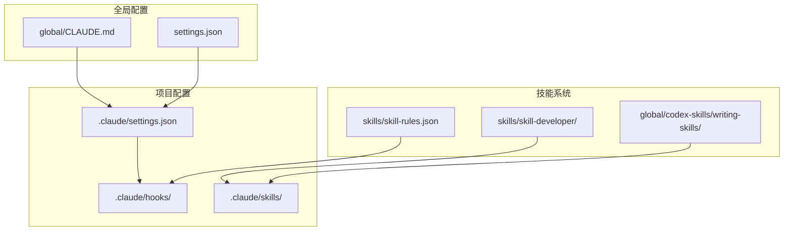
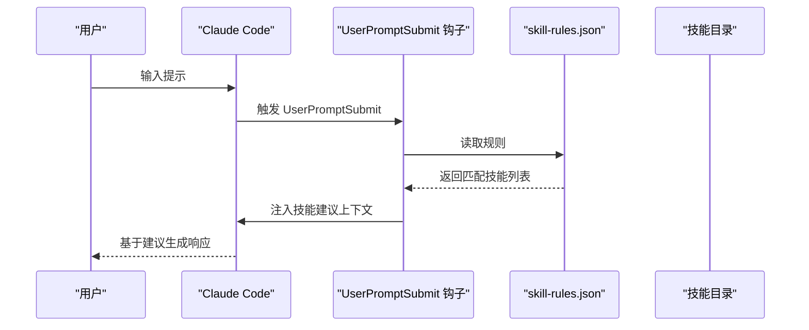
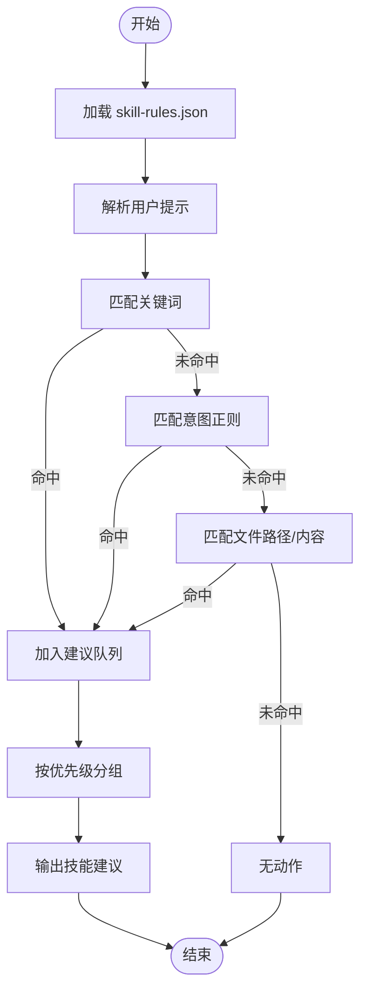
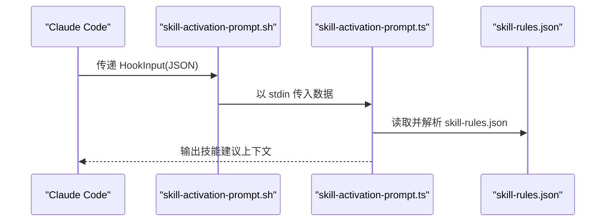
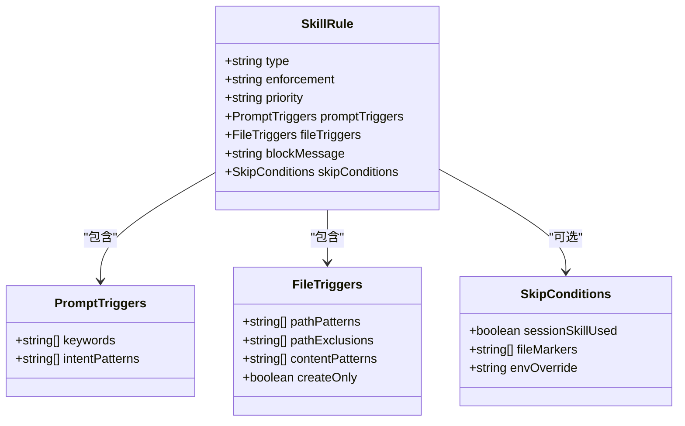
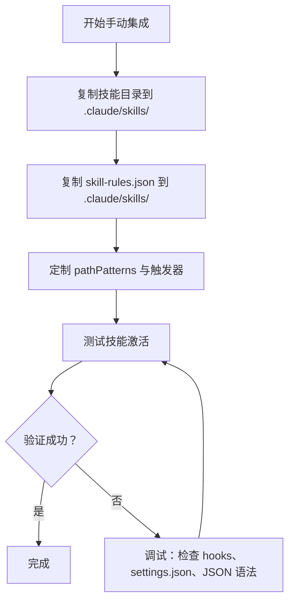

# 技能集成与部署

<cite>
**本文引用的文件**
- [skills/skill-rules.json](file://skills/skill-rules.json)
- [skills/README.md](file://skills/README.md)
- [skills/skill-developer/SKILL.md](file://skills/skill-developer/SKILL.md)
- [skills/skill-developer/SKILL_RULES_REFERENCE.md](file://skills/skill-developer/SKILL_RULES_REFERENCE.md)
- [hooks/skill-activation-prompt.ts](file://hooks/skill-activation-prompt.ts)
- [hooks/skill-activation-prompt.sh](file://hooks/skill-activation-prompt.sh)
- [settings.json](file://settings.json)
- [global/CLAUDE.md](file://global/CLAUDE.md)
- [README.md](file://README.md)
- [global/codex-skills/writing-skills/SKILL.md](file://global/codex-skills/writing-skills/SKILL.md)
- [global/codex-skills/brainstorming/SKILL.md](file://global/codex-skills/brainstorming/SKILL.md)
- [global/codex-skills/dispatching-parallel-agents/SKILL.md](file://global/codex-skills/dispatching-parallel-agents/SKILL.md)
</cite>

## 目录
1. [简介](#简介)
2. [项目结构](#项目结构)
3. [核心组件](#核心组件)
4. [架构总览](#架构总览)
5. [详细组件分析](#详细组件分析)
6. [依赖关系分析](#依赖关系分析)
7. [性能考虑](#性能考虑)
8. [故障排查指南](#故障排查指南)
9. [结论](#结论)
10. [附录](#附录)

## 简介
本技术文档面向希望在各类项目中稳定集成与部署 Claude Code 技能系统的工程师与技术负责人。文档覆盖技能添加的两种方式（快速集成与手动集成）、技能目录复制、skill-rules.json 更新与验证测试的完整流程，并提供项目结构适配指南、路径模式配置与自定义技能开发的集成方法。同时包含常见集成问题的解决方案、最佳实践建议与部署优化技巧，确保技能系统在不同项目环境中可靠运行。

## 项目结构
该项目采用“模板 + 项目级覆盖”的配置体系，核心目录与职责如下：
- skills：项目级技能集合与规则配置
- hooks：技能激活钩子（UserPromptSubmit、PostToolUse）
- settings.json：Claude Code 钩子注册与权限配置
- global/CLAUDE.md：全局多 AI 协同与工具使用规则
- README.md：模板项目说明与一键部署脚本

**图表来源**
- [settings.json](file://settings.json#L1-L37)
- [global/CLAUDE.md](file://global/CLAUDE.md#L1-L147)
- [skills/skill-rules.json](file://skills/skill-rules.json#L1-L250)
- [skills/skill-developer/SKILL.md](file://skills/skill-developer/SKILL.md#L1-L427)
- [global/codex-skills/writing-skills/SKILL.md](file://global/codex-skills/writing-skills/SKILL.md#L1-L655)

**章节来源**
- [README.md](file://README.md#L71-L92)
- [settings.json](file://settings.json#L1-L37)
- [global/CLAUDE.md](file://global/CLAUDE.md#L1-L147)

## 核心组件
- 技能规则引擎：基于 skill-rules.json 的触发条件匹配，支持关键字、意图正则、文件路径与内容模式四类触发器。
- 钩子系统：UserPromptSubmit 钩子在用户提交提示前进行技能建议；PostToolUse 钩子在工具使用后进行跟踪与提醒。
- 项目级技能目录：按技能名称组织的 SKILL.md 与资源文件，遵循 Anthropic 最佳实践（500 行限制、渐进披露）。
- 全局与项目级配置：global/CLAUDE.md 定义多 AI 协同与工具使用规则，settings.json 注册钩子与权限。

**章节来源**
- [skills/skill-rules.json](file://skills/skill-rules.json#L1-L250)
- [hooks/skill-activation-prompt.ts](file://hooks/skill-activation-prompt.ts#L1-L133)
- [settings.json](file://settings.json#L1-L37)
- [global/CLAUDE.md](file://global/CLAUDE.md#L1-L147)

## 架构总览
技能系统通过钩子在 Claude Code 生命周期的关键节点注入上下文与控制逻辑，形成“提示前建议 + 工具后跟踪”的双钩架构。

**图表来源**
- [hooks/skill-activation-prompt.ts](file://hooks/skill-activation-prompt.ts#L36-L127)
- [skills/skill-rules.json](file://skills/skill-rules.json#L1-L250)

## 详细组件分析

### 组件一：技能规则与触发机制
- 触发类型
  - 关键字触发：在用户提示中匹配关键词
  - 意图正则：使用大小写不敏感正则识别隐式意图
  - 文件路径触发：基于 glob 模式匹配编辑文件路径
  - 内容模式触发：基于正则匹配文件内容特征
- 规则字段
  - type：guardrail（强制）或 domain（建议）
  - enforcement：block（阻止）、suggest（建议）、warn（警告）
  - priority：critical/high/medium/low
  - promptTriggers：keywords、intentPatterns
  - fileTriggers：pathPatterns、pathExclusions、contentPatterns、createOnly
  - blockMessage：强制技能的阻断消息（需包含 {file_path} 占位符）
  - skipConditions：会话内跳过、文件标记、环境变量覆盖
- 验证与调试
  - 使用 jq 校验 JSON 语法
  - 通过 UserPromptSubmit 钩子命令行测试
  - 逐步细化 keywords/intentPatterns/fileTriggers/contentPatterns

**图表来源**
- [hooks/skill-activation-prompt.ts](file://hooks/skill-activation-prompt.ts#L36-L127)
- [skills/skill-rules.json](file://skills/skill-rules.json#L1-L250)

**章节来源**
- [skills/skill-rules.json](file://skills/skill-rules.json#L1-L250)
- [skills/skill-developer/SKILL_RULES_REFERENCE.md](file://skills/skill-developer/SKILL_RULES_REFERENCE.md#L1-L316)
- [hooks/skill-activation-prompt.ts](file://hooks/skill-activation-prompt.ts#L1-L133)

### 组件二：钩子系统与生命周期
- UserPromptSubmit 钩子
  - 触发时机：用户提交提示前
  - 功能：根据 skill-rules.json 生成技能建议并注入 Claude 输入
  - 实现：从 stdin 读取 HookInput，解析 prompt，匹配规则，输出建议
- PostToolUse 钩子
  - 触发时机：工具使用后（如 Edit/MultiEdit/Write）
  - 功能：跟踪与提醒（例如错误处理意识提醒）
- 钩子注册
  - settings.json 中 hooks.UserPromptSubmit 与 hooks.PostToolUse 指向相应脚本

**图表来源**
- [hooks/skill-activation-prompt.sh](file://hooks/skill-activation-prompt.sh#L1-L6)
- [hooks/skill-activation-prompt.ts](file://hooks/skill-activation-prompt.ts#L1-L133)
- [settings.json](file://settings.json#L13-L23)

**章节来源**
- [hooks/skill-activation-prompt.sh](file://hooks/skill-activation-prompt.sh#L1-L6)
- [hooks/skill-activation-prompt.ts](file://hooks/skill-activation-prompt.ts#L1-L133)
- [settings.json](file://settings.json#L13-L35)

### 组件三：项目级技能目录与自定义技能开发
- 目录结构
  - .claude/skills/{skill-name}/SKILL.md：主参考文件（遵循 500 行限制）
  - .claude/skills/{skill-name}/resource.*：重用工具或大型参考
- 自定义技能开发流程
  - 创建 SKILL.md（含 YAML frontmatter：name、description）
  - 在 skill-rules.json 中添加条目（type/enforcement/priority + 触发器）
  - 使用 npx tsx 命令行测试钩子与触发器
  - 逐步细化以减少误报、提升命中率
- 渐进披露与搜索优化
  - 将详细内容放入单独资源文件，SKILL.md 保持简洁
  - description 仅描述触发条件，避免总结技能流程
  - 使用丰富关键词覆盖症状、工具、错误信息等

**图表来源**
- [skills/skill-rules.json](file://skills/skill-rules.json#L24-L56)
- [skills/skill-developer/SKILL_RULES_REFERENCE.md](file://skills/skill-developer/SKILL_RULES_REFERENCE.md#L24-L57)

**章节来源**
- [skills/skill-developer/SKILL.md](file://skills/skill-developer/SKILL.md#L1-L427)
- [skills/skill-developer/SKILL_RULES_REFERENCE.md](file://skills/skill-developer/SKILL_RULES_REFERENCE.md#L1-L316)
- [global/codex-skills/writing-skills/SKILL.md](file://global/codex-skills/writing-skills/SKILL.md#L1-L655)

### 组件四：快速集成与手动集成流程
- 快速集成（面向 Claude Code）
  - 用户请求添加技能 → Claude 询问项目结构 → 自动复制技能目录 → 更新 skill-rules.json → 验证集成
  - 参考：CLAUDE_INTEGRATION_GUIDE.md（在仓库中提供）
- 手动集成（面向开发者）
  - 步骤 1：复制技能目录至 .claude/skills/
  - 步骤 2：复制 skill-rules.json 至 .claude/skills/ 并定制 pathPatterns
  - 步骤 3：测试技能自动激活
  - 步骤 4：验证钩子与 settings.json 配置

**图表来源**
- [skills/README.md](file://skills/README.md#L168-L220)
- [settings.json](file://settings.json#L13-L35)

**章节来源**
- [skills/README.md](file://skills/README.md#L168-L220)
- [settings.json](file://settings.json#L13-L35)

## 依赖关系分析
- 钩子依赖 skill-rules.json：UserPromptSubmit 钩子直接读取并解析规则
- 钩子依赖 settings.json：注册钩子命令与权限
- 技能内容依赖目录结构：SKILL.md 与资源文件按约定组织
- 全局规则影响项目行为：global/CLAUDE.md 定义多 AI 协同与工具使用策略

**图表来源**
- [settings.json](file://settings.json#L13-L35)
- [hooks/skill-activation-prompt.sh](file://hooks/skill-activation-prompt.sh#L1-L6)
- [hooks/skill-activation-prompt.ts](file://hooks/skill-activation-prompt.ts#L1-L133)
- [skills/skill-rules.json](file://skills/skill-rules.json#L1-L250)
- [global/CLAUDE.md](file://global/CLAUDE.md#L1-L147)

**章节来源**
- [settings.json](file://settings.json#L13-L35)
- [hooks/skill-activation-prompt.ts](file://hooks/skill-activation-prompt.ts#L1-L133)
- [skills/skill-rules.json](file://skills/skill-rules.json#L1-L250)
- [global/CLAUDE.md](file://global/CLAUDE.md#L1-L147)

## 性能考虑
- 触发器复杂度控制：避免过于宽泛的 pathPatterns 与 intentPatterns，减少不必要的匹配开销
- JSON 解析与 I/O：skill-rules.json 体积与嵌套深度应保持合理，避免频繁大文件读取
- 钩子执行时间：UserPromptSubmit 钩子应尽量短小，建议 <100ms
- 会话状态：利用 sessionSkillUsed 跳过同一会话内的重复提醒，降低重复计算

[本节为通用指导，无需特定文件来源]

## 故障排查指南
- 技能未激活
  - 检查 .claude/skills/ 下是否存在技能目录
  - 检查 skill-rules.json 是否列出该技能且 JSON 语法正确
  - 检查 hooks 是否可执行，settings.json 是否注册
  - 使用命令行测试钩子：npx tsx .claude/hooks/skill-activation-prompt.ts
- 技能激活过多
  - 缩窄 pathPatterns，提高 intentPatterns 精确度，减少 keywords 泛化
- 技能从不激活
  - 增加 keywords，放宽 pathPatterns，补充 intentPatterns
- 触发器调试清单
  - 使用 jq 校验 skill-rules.json
  - 检查文件路径与内容模式是否匹配实际项目结构
  - 验证会话状态文件与跳过标记（如 @skip-validation）

**章节来源**
- [skills/README.md](file://skills/README.md#L302-L342)
- [hooks/skill-activation-prompt.ts](file://hooks/skill-activation-prompt.ts#L1-L133)
- [settings.json](file://settings.json#L13-L35)

## 结论
通过规范化技能目录、精确配置 skill-rules.json 与正确注册钩子，可以在不同项目环境中稳定集成 Claude Code 技能系统。遵循渐进披露与搜索优化原则，结合严格的测试与调试流程，能够显著提升技能的命中准确性与用户体验。建议在团队内建立技能开发与验证的标准化流程，持续迭代触发器与内容质量。

[本节为总结，无需特定文件来源]

## 附录

### 项目结构适配指南
- 后端项目（Python/Django/FastAPI）
  - 更新 pathPatterns 以匹配 views.py、services.py、models.py 等
  - 添加 contentPatterns 以识别 FastAPI/Django 特征
- 前端项目（React/TypeScript）
  - 更新 pathPatterns 以匹配 src/**/*.tsx
  - 注意：前端技能配置为 guardrail，防止 MUI 版本不兼容
- 测试目录排除
  - 在 pathExclusions 中排除 tests、_test.py、__pycache__ 等

**章节来源**
- [skills/skill-rules.json](file://skills/skill-rules.json#L145-L183)
- [skills/README.md](file://skills/README.md#L63-L72)

### 路径模式配置示例
- 后端单应用：src/api/**/*.ts
- 后端目录：backend/**/*.ts
- 多服务 monorepo：services/*/src/**/*.ts
- 前端单应用：src/**/*.tsx
- 前端目录：frontend/src/**/*.tsx
- 多应用 monorepo：apps/web/**/*.tsx

**章节来源**
- [skills/README.md](file://skills/README.md#L63-L72)
- [skills/README.md](file://skills/README.md#L100-L109)

### 自定义技能开发集成方法
- 创建 .claude/skills/{name}/SKILL.md（含 frontmatter）
- 在 .claude/skills/skill-rules.json 中添加条目
- 使用 npx tsx 命令行测试 UserPromptSubmit 与 PreToolUse
- 保持 SKILL.md <500 行，细节移至资源文件
- 通过 writing-skills 技能进行 TDD 式验证

**章节来源**
- [skills/skill-developer/SKILL.md](file://skills/skill-developer/SKILL.md#L109-L191)
- [global/codex-skills/writing-skills/SKILL.md](file://global/codex-skills/writing-skills/SKILL.md#L394-L442)

### 最佳实践与部署优化
- 优先使用 suggest（建议）而非 block（阻止），除非涉及关键错误
- 为 guardrail 技能提供清晰的 blockMessage，并包含 {file_path} 占位符
- 使用会话状态与文件标记避免重复提醒
- 通过环境变量临时禁用技能（紧急情况）
- 保持 skill-rules.json 结构清晰，定期校验 JSON 语法

**章节来源**
- [skills/skill-rules.json](file://skills/skill-rules.json#L230-L248)
- [skills/skill-developer/SKILL.md](file://skills/skill-developer/SKILL.md#L224-L266)

### 示例技能参考
- Brainstorming：创意工作前置的引导流程
- Dispatching Parallel Agents：并行任务分发与协同
- Writing Skills：技能创作的 TDD 方法论

**章节来源**
- [global/codex-skills/brainstorming/SKILL.md](file://global/codex-skills/brainstorming/SKILL.md#L1-L55)
- [global/codex-skills/dispatching-parallel-agents/SKILL.md](file://global/codex-skills/dispatching-parallel-agents/SKILL.md#L1-L181)
- [global/codex-skills/writing-skills/SKILL.md](file://global/codex-skills/writing-skills/SKILL.md#L1-L655)