# Git 工作流技能

<cite>
**本文档引用的文件**
- [skills/git-workflow/SKILL.md](file://skills/git-workflow/SKILL.md)
- [skills/dev-workflow/SKILL.md](file://skills/dev-workflow/SKILL.md)
- [hooks/package.json](file://hooks/package.json)
- [hooks/skill-activation-prompt.sh](file://hooks/skill-activation-prompt.sh)
- [hooks/post-tool-use-tracker.sh](file://hooks/post-tool-use-tracker.sh)
- [setup-claude-config.sh](file://setup-claude-config.sh)
- [setup-global.sh](file://setup-global.sh)
- [settings.json](file://settings.json)
- [global/CLAUDE.md](file://global/CLAUDE.md)
- [README.md](file://README.md)
- [skills/skill-rules.json](file://skills/skill-rules.json)
- [global/codex-skills/subagent-driven-development/SKILL.md](file://global/codex-skills/subagent-driven-development/SKILL.md)
</cite>

## 目录
1. [简介](#简介)
2. [项目结构](#项目结构)
3. [核心组件](#核心组件)
4. [架构概览](#架构概览)
5. [详细组件分析](#详细组件分析)
6. [依赖关系分析](#依赖关系分析)
7. [性能考虑](#性能考虑)
8. [故障排除指南](#故障排除指南)
9. [结论](#结论)

## 简介

Git 工作流技能是 ontologyDevOS 项目中用于管理团队协作开发的核心技能模块。该技能基于规范化的分支管理、标准化的提交规范和严格的版本控制最佳实践，为多 AI 协同开发提供了完整的 Git 工作流解决方案。

该项目集成了 Claude Code、Codex 和 Gemini 三大 AI 代理，通过智能钩子系统和自动化检查机制，实现了从需求分析到代码实现的全生命周期 Git 工作流管理。技能特点包括：

- **标准化分支策略**：支持 feature、bugfix、hotfix、release 等多种分支类型
- **规范化提交消息**：采用 Conventional Commits 规范，确保提交信息的可读性和可追溯性
- **自动化质量门禁**：集成预提交检查、冲突检测和代码质量验证
- **多 AI 协同开发**：通过 Git 工作流确保代码质量和可追溯性
- **智能钩子系统**：自动触发技能激活和工具使用跟踪

## 项目结构

ontologyDevOS 项目采用模块化设计，围绕 Git 工作流技能构建了完整的开发生态系统：

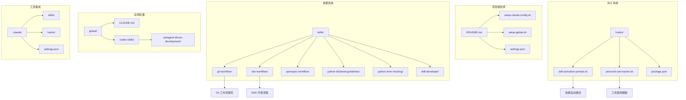

**图表来源**
- [README.md](file://README.md#L71-L92)
- [setup-claude-config.sh](file://setup-claude-config.sh#L60-L160)
- [hooks/package.json](file://hooks/package.json#L1-L17)

**章节来源**
- [README.md](file://README.md#L71-L92)
- [setup-claude-config.sh](file://setup-claude-config.sh#L60-L160)

## 核心组件

### Git 工作流技能核心功能

Git 工作流技能提供了完整的 Git 操作管理能力，包括分支管理、提交规范、合并流程和冲突解决：

#### 分支命名约定
- **feature/**: 新功能开发分支，格式为 `feature/{task-id}-{description}`
- **bugfix/**: 缺陷修复分支，格式为 `bugfix/{task-id}-{description}`
- **hotfix/**: 紧急生产修复分支，格式为 `hotfix/{task-id}-{description}`
- **release/**: 版本发布准备分支，格式为 `release/{version}`

#### 提交消息标准
采用 Conventional Commits 规范，确保提交信息的结构化和可读性：

```mermaid
flowchart TD
A[提交消息格式] --> B[类型(Type)]
A --> C[作用域(Scope)]
A --> D[主题(Subject)]
A --> E[正文(Body)]
A --> F[页脚(Footer)]
B --> G[feat: 新功能]
B --> H[fix: 缺陷修复]
B --> I[docs: 文档更新]
B --> J[style: 代码格式]
B --> K[refactor: 代码重构]
B --> L[test: 测试添加]
B --> M[chore: 构建工具]
B --> N[perf: 性能优化]
```

**图表来源**
- [skills/git-workflow/SKILL.md](file://skills/git-workflow/SKILL.md#L75-L121)

#### 预提交检查清单
在提交前执行的自动化检查，确保代码质量和一致性：

- [ ] 所有更改都已暂存
- [ ] 分支名称符合约定
- [ ] 代码中无冲突标记
- [ ] 本地测试通过
- [ ] 代码风格检查通过

**章节来源**
- [skills/git-workflow/SKILL.md](file://skills/git-workflow/SKILL.md#L125-L192)

### 多 AI 协同集成

Git 工作流技能与多 AI 协同系统深度集成，通过智能钩子实现自动化技能激活：

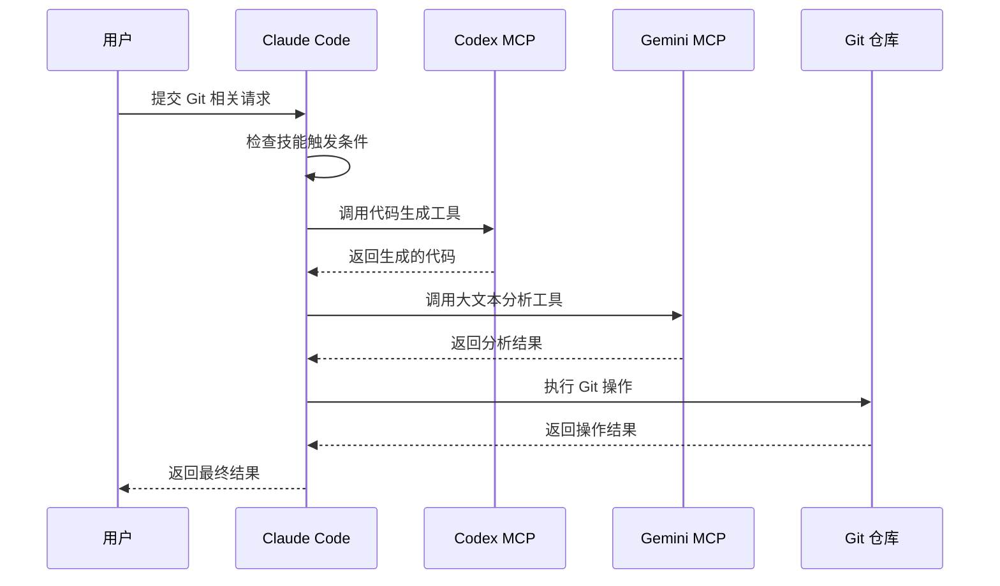

**图表来源**
- [global/CLAUDE.md](file://global/CLAUDE.md#L76-L95)
- [hooks/skill-activation-prompt.sh](file://hooks/skill-activation-prompt.sh#L1-L6)

**章节来源**
- [global/CLAUDE.md](file://global/CLAUDE.md#L76-L95)
- [hooks/skill-activation-prompt.sh](file://hooks/skill-activation-prompt.sh#L1-L6)

## 架构概览

### Git 工作流架构

Git 工作流技能采用分层架构设计，确保各组件间的松耦合和高内聚：

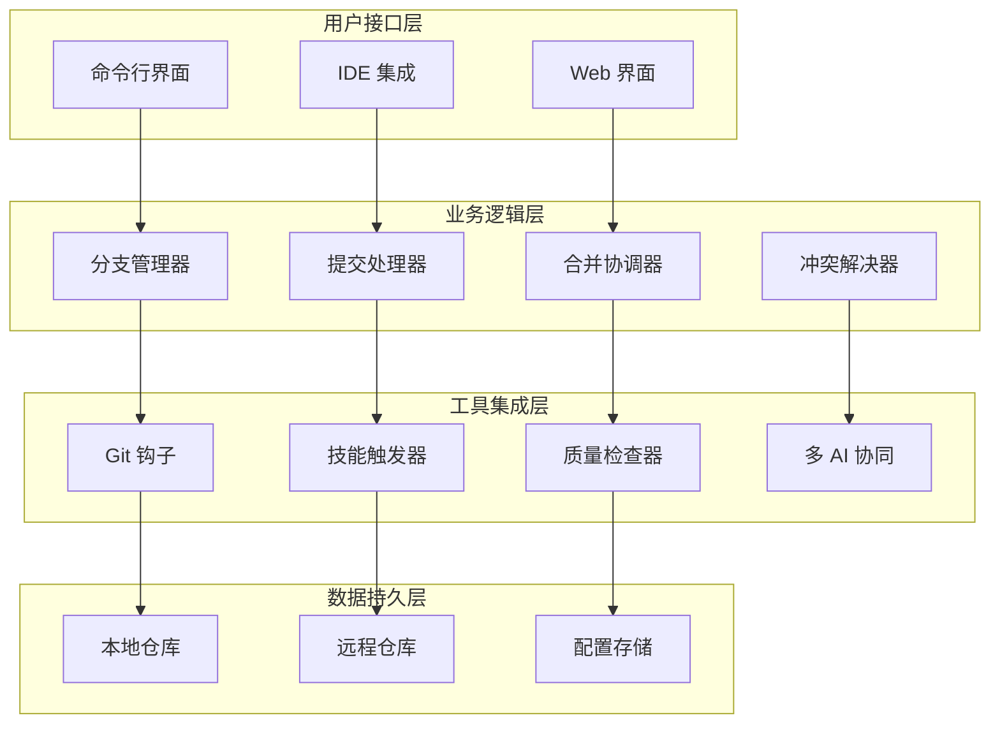

**图表来源**
- [skills/git-workflow/SKILL.md](file://skills/git-workflow/SKILL.md#L1-L25)
- [skills/skill-rules.json](file://skills/skill-rules.json#L1-L250)

### 技能触发机制

技能触发系统基于关键词匹配和意图识别，实现智能的技能激活：

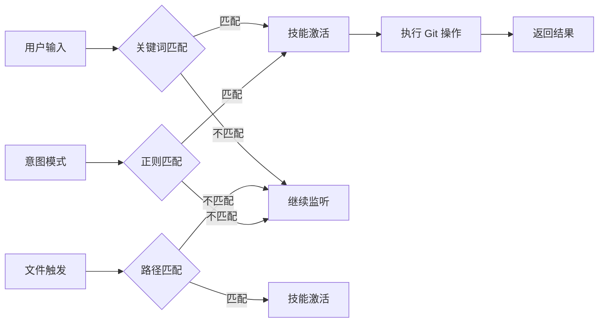

**图表来源**
- [skills/skill-rules.json](file://skills/skill-rules.json#L52-L84)

**章节来源**
- [skills/skill-rules.json](file://skills/skill-rules.json#L52-L84)

## 详细组件分析

### 分支管理组件

分支管理组件是 Git 工作流的核心，负责处理各种类型的分支操作：

#### 分支创建流程
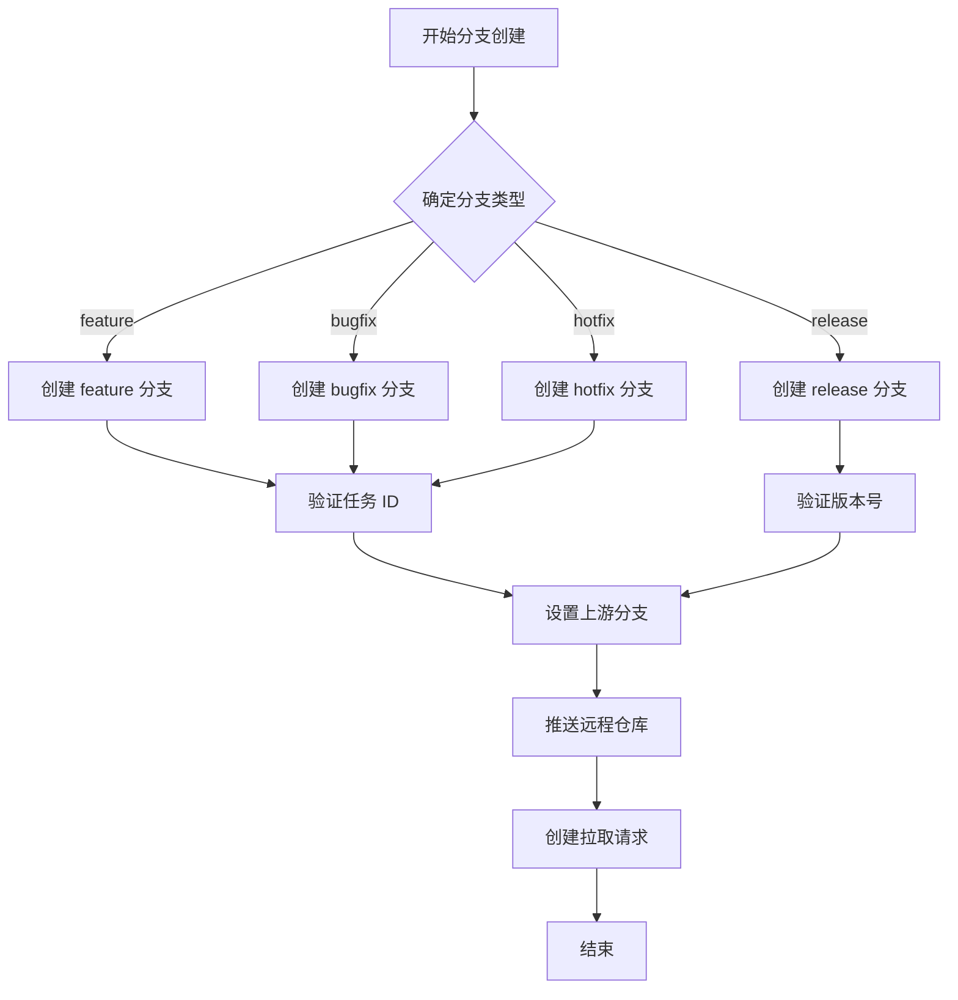

**图表来源**
- [skills/git-workflow/SKILL.md](file://skills/git-workflow/SKILL.md#L54-L71)

#### 分支命名规范
分支命名采用统一的约定格式，确保团队协作的一致性：

| 分支类型 | 命名模式 | 使用场景 | 示例 |
|---------|---------|---------|------|
| 功能分支 | `feature/{task-id}-{description}` | 新功能开发 | `feature/TASK-001-add-user-auth` |
| 缺陷修复 | `bugfix/{task-id}-{description}` | 缺陷修复 | `bugfix/TASK-002-fix-login-error` |
| 紧急修复 | `hotfix/{task-id}-{description}` | 生产紧急修复 | `hotfix/TASK-003-security-patch` |
| 版本发布 | `release/{version}` | 版本发布准备 | `release/v1.2.0` |

**章节来源**
- [skills/git-workflow/SKILL.md](file://skills/git-workflow/SKILL.md#L27-L52)

### 提交规范组件

提交规范组件确保所有提交都遵循统一的标准，提高代码库的可追溯性和可维护性：

#### 提交消息结构
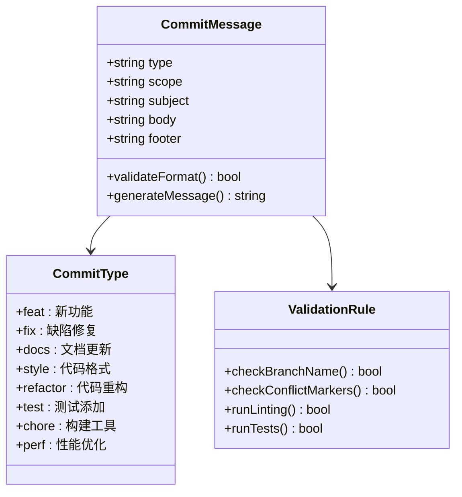

**图表来源**
- [skills/git-workflow/SKILL.md](file://skills/git-workflow/SKILL.md#L75-L121)

#### 提交验证流程
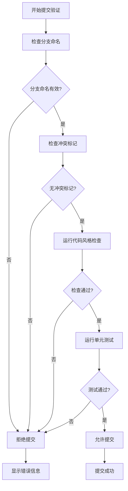

**图表来源**
- [skills/git-workflow/SKILL.md](file://skills/git-workflow/SKILL.md#L159-L192)

**章节来源**
- [skills/git-workflow/SKILL.md](file://skills/git-workflow/SKILL.md#L159-L192)

### 合并流程组件

合并流程组件管理分支到主分支的合并过程，确保代码质量和版本控制的完整性：

#### 功能分支合并流程
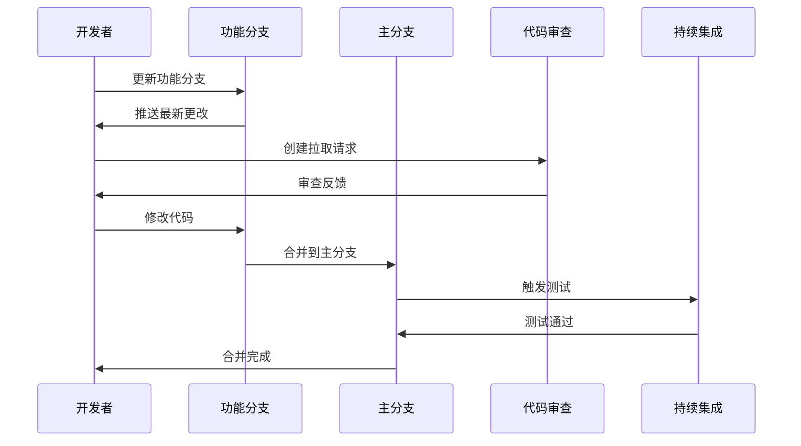

**图表来源**
- [skills/git-workflow/SKILL.md](file://skills/git-workflow/SKILL.md#L196-L237)

#### 热修复合并流程
热修复分支具有特殊的合并策略，需要同时合并到主分支和开发分支：

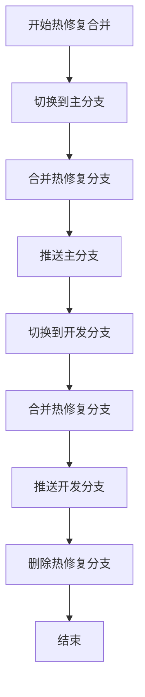

**图表来源**
- [skills/git-workflow/SKILL.md](file://skills/git-workflow/SKILL.md#L239-L254)

**章节来源**
- [skills/git-workflow/SKILL.md](file://skills/git-workflow/SKILL.md#L196-L254)

### 冲突解决组件

冲突解决组件提供系统化的冲突检测和解决机制，确保团队协作的顺畅进行：

#### 冲突解决流程
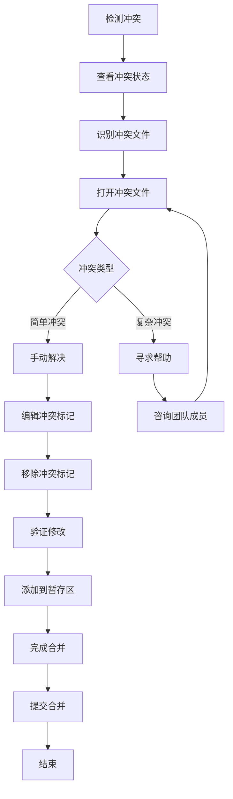

**图表来源**
- [skills/git-workflow/SKILL.md](file://skills/git-workflow/SKILL.md#L258-L303)

#### 冲突标记示例


**图表来源**
- [skills/git-workflow/SKILL.md](file://skills/git-workflow/SKILL.md#L268-L275)

**章节来源**
- [skills/git-workflow/SKILL.md](file://skills/git-workflow/SKILL.md#L258-L303)

### 钩子系统组件

钩子系统是 Git 工作流技能的重要组成部分，提供自动化技能激活和工具使用跟踪功能：

#### 技能激活钩子
技能激活钩子在用户提交技能请求时自动触发相应的技能：

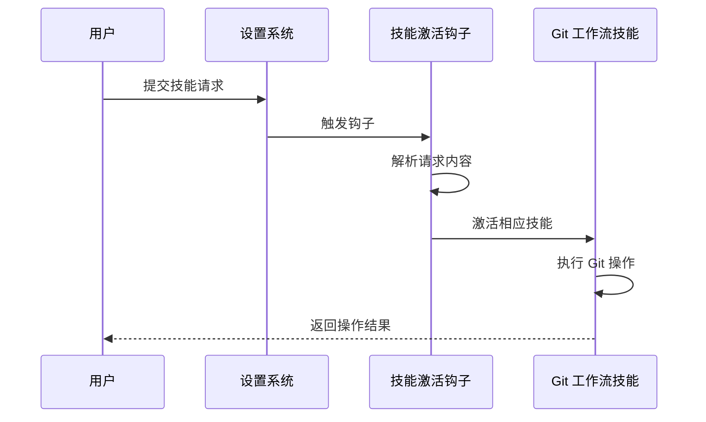

**图表来源**
- [settings.json](file://settings.json#L14-L23)
- [hooks/skill-activation-prompt.sh](file://hooks/skill-activation-prompt.sh#L1-L6)

#### 工具使用跟踪钩子
工具使用跟踪钩子监控编辑、多编辑和写入工具的使用情况：

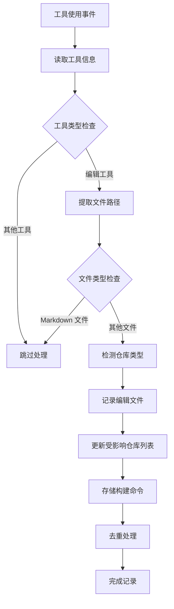

**图表来源**
- [hooks/post-tool-use-tracker.sh](file://hooks/post-tool-use-tracker.sh#L1-L178)

**章节来源**
- [settings.json](file://settings.json#L14-L35)
- [hooks/skill-activation-prompt.sh](file://hooks/skill-activation-prompt.sh#L1-L6)
- [hooks/post-tool-use-tracker.sh](file://hooks/post-tool-use-tracker.sh#L1-L178)

## 依赖关系分析

### 技能依赖关系

Git 工作流技能与其他技能和工具之间存在复杂的依赖关系：

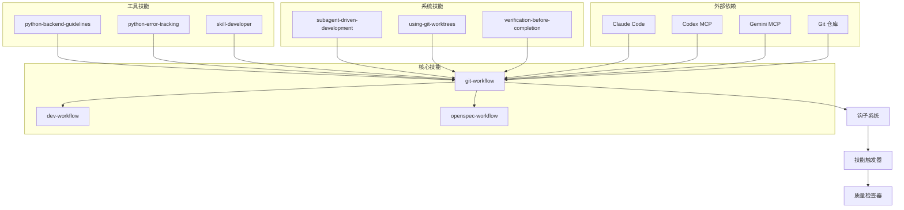

**图表来源**
- [skills/skill-rules.json](file://skills/skill-rules.json#L1-L250)
- [global/codex-skills/subagent-driven-development/SKILL.md](file://global/codex-skills/subagent-driven-development/SKILL.md#L229-L241)

### 配置依赖分析

Git 工作流技能的配置依赖关系体现了系统的层次化设计：

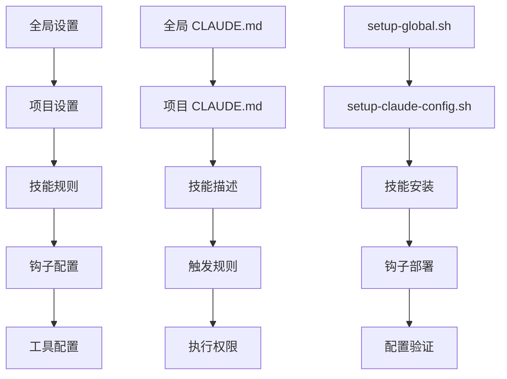

**图表来源**
- [setup-global.sh](file://setup-global.sh#L1-L471)
- [setup-claude-config.sh](file://setup-claude-config.sh#L1-L372)

**章节来源**
- [setup-global.sh](file://setup-global.sh#L1-L471)
- [setup-claude-config.sh](file://setup-claude-config.sh#L1-L372)

## 性能考虑

### Git 操作性能优化

Git 工作流技能在设计时充分考虑了性能优化，特别是在大规模项目中的表现：

#### 分支操作优化
- **增量更新**: 仅同步必要的分支信息，减少网络传输
- **并行处理**: 支持多个分支的并发操作
- **缓存机制**: 缓存常用查询结果，减少重复计算

#### 提交处理优化
- **批量验证**: 批量执行预提交检查，提高效率
- **智能跳过**: 跳过不必要的检查步骤
- **增量提交**: 仅提交变更的文件，减少存储空间

#### 合并操作优化
- **快速路径**: 对简单的合并操作使用快速路径
- **冲突预检**: 在合并前进行冲突预检，避免失败重试
- **并行测试**: 在合并过程中并行运行测试

### 多 AI 协同性能

多 AI 协同开发通过 Git 工作流技能实现了高效的资源利用：

#### 资源分配策略
- **负载均衡**: 在多个 AI 代理间均衡分配任务
- **优先级调度**: 根据任务重要性动态调整执行顺序
- **资源共享**: 共享计算资源和存储空间

#### 通信优化
- **异步处理**: 使用异步通信减少等待时间
- **批量处理**: 将相似任务批量处理以提高效率
- **缓存策略**: 缓存常用响应结果

## 故障排除指南

### 常见问题诊断

#### 技能激活问题
当 Git 工作流技能无法正确激活时，可以按以下步骤进行诊断：

1. **检查技能触发规则**
   - 验证 `skill-rules.json` 中的关键词匹配
   - 确认意图模式的正则表达式正确性
   - 检查文件触发器的路径模式

2. **验证钩子配置**
   - 检查 `settings.json` 中的钩子配置
   - 确认钩子脚本的可执行权限
   - 验证钩子脚本的路径正确性

3. **调试技能执行**
   - 查看技能执行日志
   - 检查技能参数传递
   - 验证技能返回值

#### 分支管理问题
分支操作失败的常见原因和解决方案：

1. **分支命名错误**
   - 检查分支名称是否符合约定格式
   - 验证任务 ID 的正确性
   - 确认描述部分的字符限制

2. **权限问题**
   - 检查 Git 仓库的访问权限
   - 验证远程仓库的推送权限
   - 确认分支保护规则

3. **网络连接问题**
   - 检查网络连接稳定性
   - 验证远程仓库可达性
   - 确认代理设置正确

#### 提交验证失败
提交验证失败的排查步骤：

1. **检查预提交检查**
   - 运行本地预提交检查
   - 验证代码风格检查结果
   - 确认测试覆盖率要求

2. **冲突标记处理**
   - 查找未解决的冲突标记
   - 检查冲突解决的完整性
   - 验证冲突解决后的代码质量

3. **提交消息格式**
   - 验证提交消息的结构
   - 检查类型字段的有效性
   - 确认主题和正文的完整性

#### 合并冲突解决
合并过程中出现冲突的处理方法：

1. **冲突检测**
   - 使用 `git status` 查看冲突状态
   - 识别冲突的文件和行号
   - 分析冲突的原因和影响范围

2. **冲突解决策略**
   - 选择保留的更改版本
   - 合并相关的更改内容
   - 验证解决后的功能完整性

3. **冲突验证**
   - 运行相关测试确保功能正常
   - 检查代码风格一致性
   - 验证提交历史的清晰性

### 调试工具和技巧

#### Git 工具使用
- **状态检查**: 使用 `git status` 和 `git log` 检查仓库状态
- **差异分析**: 使用 `git diff` 分析代码变更
- **历史查看**: 使用 `git log` 查看提交历史和作者信息

#### 技能调试
- **日志查看**: 检查技能执行日志和错误信息
- **参数验证**: 验证技能参数的正确性和完整性
- **返回值检查**: 分析技能返回值和状态码

#### 多 AI 协同调试
- **工具状态**: 检查 MCP 工具的可用性和状态
- **通信日志**: 查看 AI 代理间的通信记录
- **性能监控**: 监控资源使用和执行时间

**章节来源**
- [skills/git-workflow/SKILL.md](file://skills/git-workflow/SKILL.md#L307-L362)
- [hooks/post-tool-use-tracker.sh](file://hooks/post-tool-use-tracker.sh#L1-L178)

## 结论

Git 工作流技能为 ontologyDevOS 项目提供了一个完整、标准化且高度自动化的版本控制系统。通过规范化的分支管理、严格的提交规范和智能化的冲突解决机制，该技能确保了团队协作的高效性和代码质量的持续提升。

### 主要优势

1. **标准化流程**: 统一的分支命名、提交规范和合并流程，减少了团队协作中的摩擦
2. **自动化程度高**: 通过钩子系统和技能触发机制，实现了大部分操作的自动化
3. **质量保证**: 集成的预提交检查和冲突检测机制，确保代码质量的一致性
4. **多 AI 协同**: 与 Claude Code、Codex 和 Gemini 的深度集成，提供了强大的开发辅助能力
5. **可扩展性**: 模块化的架构设计，便于根据项目需求进行定制和扩展

### 最佳实践建议

1. **严格遵守规范**: 团队成员应严格遵守分支命名和提交规范
2. **定期同步**: 定期从主分支同步更新，减少后期合并冲突
3. **及时审查**: 及时进行代码审查，确保代码质量和知识共享
4. **文档维护**: 保持相关文档的及时更新，确保知识的可追溯性
5. **工具使用**: 充分利用提供的工具和钩子系统，提高开发效率

### 未来发展

随着项目的不断发展，Git 工作流技能将继续演进，可能的方向包括：

1. **智能化冲突解决**: 利用 AI 技术实现更智能的冲突检测和自动解决
2. **性能优化**: 进一步优化大规模项目中的操作性能
3. **集成扩展**: 扩展与其他开发工具和服务的集成能力
4. **用户体验改进**: 提供更友好的用户界面和交互体验

通过持续的改进和完善，Git 工作流技能将成为多 AI 协同开发的重要基础设施，为团队提供稳定可靠的技术支撑。