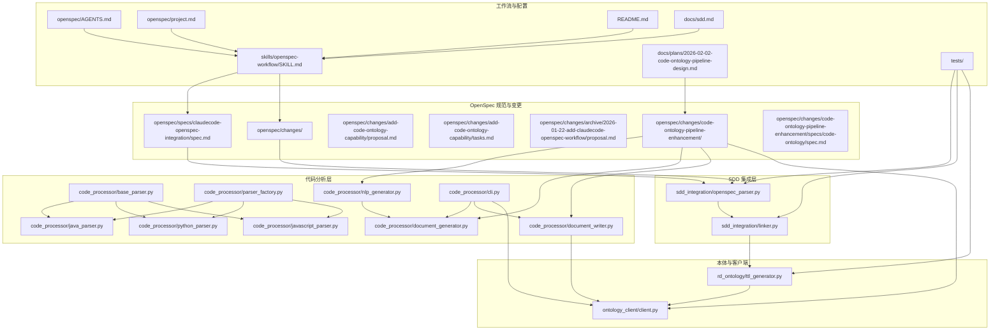
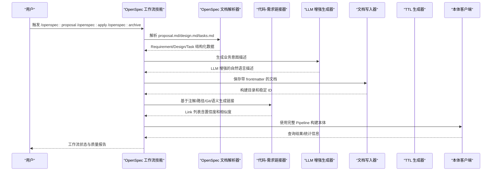
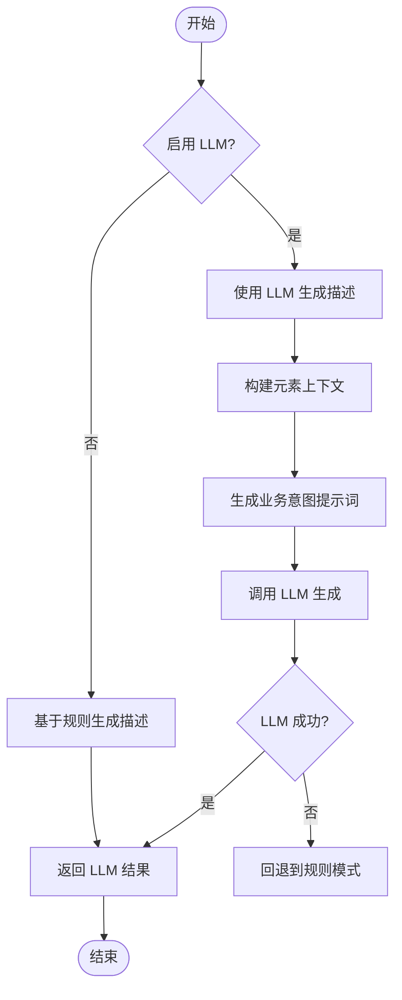
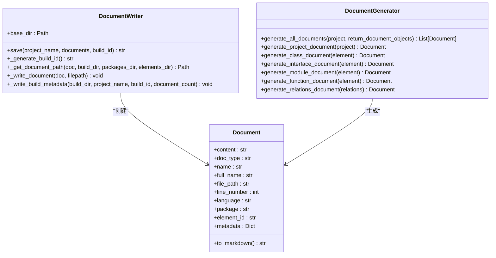
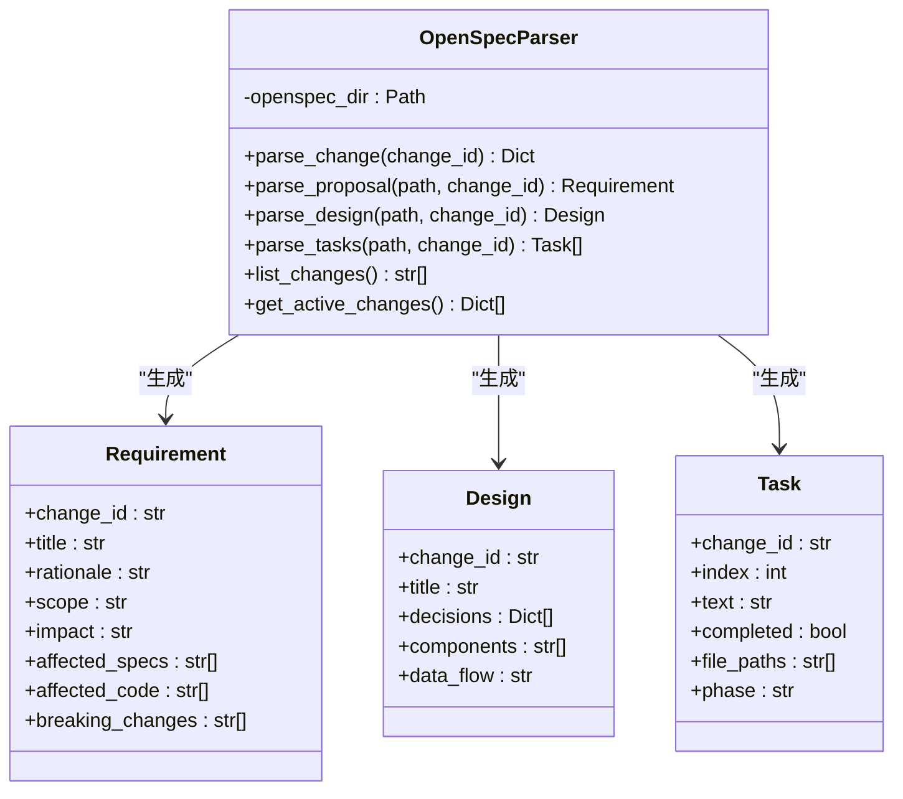
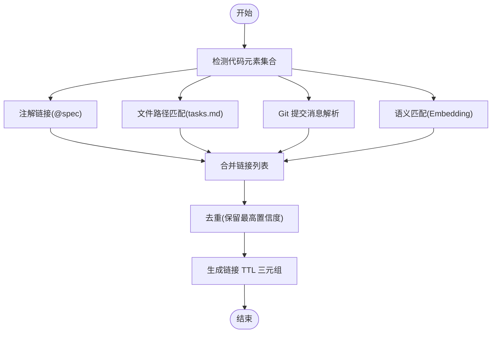
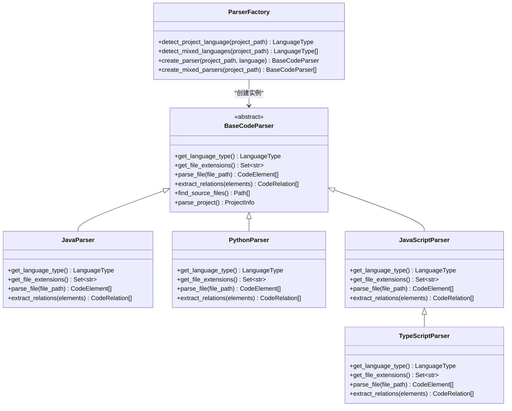
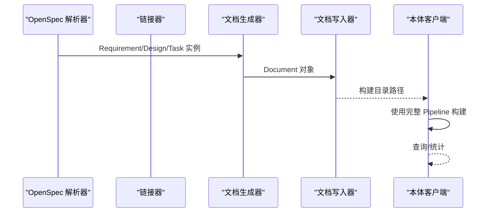
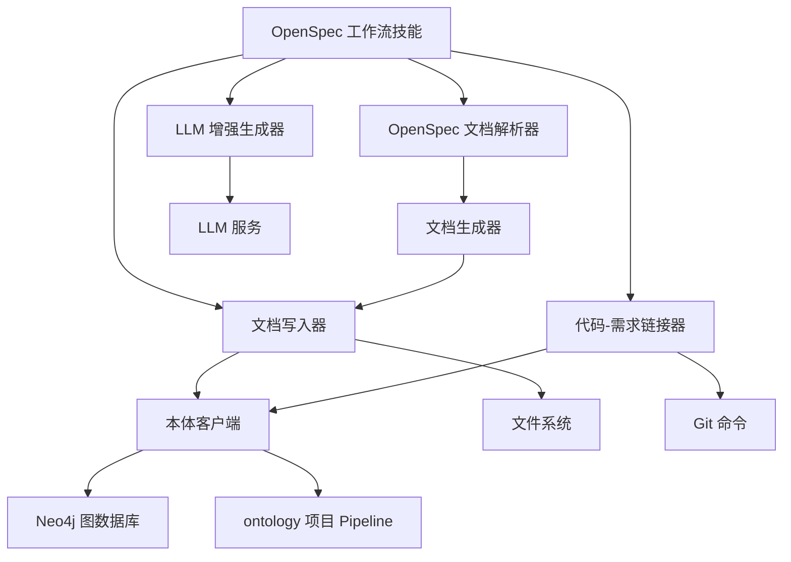

# OpenSpec 工作流技能

<cite>
**本文引用的文件**
- [README.md](file://README.md)
- [SKILL.md](file://skills/openspec-workflow/SKILL.md)
- [sdd.md](file://docs/sdd.md)
- [openspec.spec.md](file://openspec/specs/claudecode-openspec-integration/spec.md)
- [openspec.AGENTS.md](file://openspec/AGENTS.md)
- [openspec.project.md](file://openspec/project.md)
- [openspec.proposal.md](file://openspec/changes/add-code-ontology-capability/proposal.md)
- [openspec.tasks.md](file://openspec/changes/add-code-ontology-capability/tasks.md)
- [openspec.archive.proposal.md](file://openspec/changes/archive/2026-01-22-add-claudecode-openspec-workflow/proposal.md)
- [code-ontology-pipeline-enhancement.proposal.md](file://openspec/changes/code-ontology-pipeline-enhancement/proposal.md)
- [code-ontology-pipeline-enhancement.design.md](file://openspec/changes/code-ontology-pipeline-enhancement/design.md)
- [code-ontology-pipeline-enhancement.tasks.md](file://openspec/changes/code-ontology-pipeline-enhancement/tasks.md)
- [code-ontology-pipeline-enhancement.spec.md](file://openspec/changes/code-ontology-pipeline-enhancement/specs/code-ontology/spec.md)
- [2026-02-02-code-ontology-pipeline-design.md](file://docs/plans/2026-02-02-code-ontology-pipeline-design.md)
- [openspec_parser.py](file://sdd_integration/openspec_parser.py)
- [linker.py](file://sdd_integration/linker.py)
- [base_parser.py](file://code_processor/base_parser.py)
- [java_parser.py](file://code_processor/java_parser.py)
- [python_parser.py](file://code_processor/python_parser.py)
- [javascript_parser.py](file://code_processor/javascript_parser.py)
- [parser_factory.py](file://code_processor/parser_factory.py)
- [nlp_generator.py](file://code_processor/nlp_generator.py)
- [document_generator.py](file://code_processor/document_generator.py)
- [document_writer.py](file://code_processor/document_writer.py)
- [cli.py](file://code_processor/cli.py)
- [ttl_generator.py](file://rd_ontology/ttl_generator.py)
- [client.py](file://ontology_client/client.py)
- [test_code_processor.py](file://tests/test_code_processor.py)
- [test_openspec_parser.py](file://tests/test_openspec_parser.py)
- [test_ttl_generator.py](file://tests/test_ttl_generator.py)
</cite>

## 更新摘要
**所做更改**
- 新增多语言代码解析器章节，详细介绍 Java、Python、JavaScript/TypeScript 解析器
- 扩展代码-需求链接器功能，增加注解链接、文件路径匹配、Git 提交链接策略
- 完善 TTL 生成器与本体客户端的集成机制
- 增加测试用例分析，展示各组件的实际使用效果
- 更新架构图以反映新的代码本体能力集成
- 新增代码本体构建流水线增强提案的详细分析
- 扩展文档生成器以支持 LLM 增强和稳定实体 ID
- 增强本体客户端以支持完整的 Pipeline 构建流程
- 新增语义匹配链接器功能，支持 Embedding 向量相似度计算

## 目录
1. [简介](#简介)
2. [项目结构](#项目结构)
3. [核心组件](#核心组件)
4. [架构总览](#架构总览)
5. [详细组件分析](#详细组件分析)
6. [依赖关系分析](#依赖关系分析)
7. [性能考量](#性能考量)
8. [故障排查指南](#故障排查指南)
9. [结论](#结论)
10. [附录](#附录)

## 简介
本文件系统化阐述 OpenSpec 工作流技能的技术实现，围绕规范驱动开发（SDD）的解析、验证与执行流程展开，覆盖变更提案管理、规范版本控制与兼容性检查，提供 OpenSpec 文件编写指南、解析器配置与集成示例，并解释与 Claude Code 的协作机制、自动化工作流与质量保证措施。文档同时给出实际项目中的使用案例与最佳实践，帮助读者在多 AI 协同与 SDD 流程中实现"规范先行、可追溯、可审计"的高质量交付。

**更新** 本次更新重点反映了新的代码本体构建流水线增强提案，包括 LLM 增强文档生成、稳定实体 ID 管理、完整的 Pipeline 集成和语义匹配链接器等新功能。

## 项目结构
本项目以"配置模板 + 工作流技能 + 代码分析 + 本体集成"为主线组织，核心目录与职责如下：
- skills/openspec-workflow：OpenSpec 工作流技能定义与使用指南
- openspec/：OpenSpec 规范与变更提案的目录结构与文档
- sdd_integration/：OpenSpec 文档解析与代码-需求链接
- code_processor/：多语言代码解析器与工厂，新增 LLM 增强文档生成器和文档写入器
- rd_ontology/：R&D 本体 TTL 生成
- ontology_client/：本体服务客户端（上传、查询、统计），新增完整的 Pipeline 集成
- docs/sdd.md：SDD 方法论与多 AI 协同实践
- docs/plans/：详细设计文档，包含代码本体流水线设计
- README.md：项目总体说明与部署指南
- tests/：单元测试套件，验证各组件功能

**图表来源**
- [SKILL.md](file://skills/openspec-workflow/SKILL.md#L1-L231)
- [openspec.spec.md](file://openspec/specs/claudecode-openspec-integration/spec.md#L1-L54)
- [openspec.AGENTS.md](file://openspec/AGENTS.md#L1-L457)
- [openspec.project.md](file://openspec/project.md#L1-L65)
- [openspec.proposal.md](file://openspec/changes/add-code-ontology-capability/proposal.md#L1-L86)
- [openspec.tasks.md](file://openspec/changes/add-code-ontology-capability/tasks.md#L1-L107)
- [openspec.archive.proposal.md](file://openspec/changes/archive/2026-01-22-add-claudecode-openspec-workflow/proposal.md#L1-L23)
- [code-ontology-pipeline-enhancement.proposal.md](file://openspec/changes/code-ontology-pipeline-enhancement/proposal.md#L1-L107)
- [code-ontology-pipeline-enhancement.design.md](file://openspec/changes/code-ontology-pipeline-enhancement/design.md#L1-L123)
- [code-ontology-pipeline-enhancement.tasks.md](file://openspec/changes/code-ontology-pipeline-enhancement/tasks.md#L1-L104)
- [code-ontology-pipeline-enhancement.spec.md](file://openspec/changes/code-ontology-pipeline-enhancement/specs/code-ontology/spec.md#L1-L96)
- [2026-02-02-code-ontology-pipeline-design.md](file://docs/plans/2026-02-02-code-ontology-pipeline-design.md#L1-L420)
- [openspec_parser.py](file://sdd_integration/openspec_parser.py#L1-L249)
- [linker.py](file://sdd_integration/linker.py#L1-L362)
- [base_parser.py](file://code_processor/base_parser.py#L1-L360)
- [java_parser.py](file://code_processor/java_parser.py#L1-L425)
- [python_parser.py](file://code_processor/python_parser.py#L1-L455)
- [javascript_parser.py](file://code_processor/javascript_parser.py#L1-L548)
- [parser_factory.py](file://code_processor/parser_factory.py#L1-L248)
- [nlp_generator.py](file://code_processor/nlp_generator.py#L1-L569)
- [document_generator.py](file://code_processor/document_generator.py#L1-L697)
- [document_writer.py](file://code_processor/document_writer.py#L1-L325)
- [cli.py](file://code_processor/cli.py#L1-L376)
- [ttl_generator.py](file://rd_ontology/ttl_generator.py#L1-L364)
- [client.py](file://ontology_client/client.py#L1-L997)

**章节来源**
- [README.md](file://README.md#L71-L229)
- [SKILL.md](file://skills/openspec-workflow/SKILL.md#L1-L231)

## 核心组件
- OpenSpec 工作流技能：提供提案创建、实现跟踪、验证与归档的全流程命令与检查清单，确保规范先行。
- OpenSpec 文档解析器：解析 proposal.md、design.md、tasks.md，抽取结构化数据，生成 Requirement/Design/Task TTL 实例。
- 代码-需求链接器：基于注解、文件路径与 Git 提交信息，将代码元素与 OpenSpec 变更关联，生成链接 TTL。
- 多语言代码解析器：统一抽象的代码元素与关系模型，支持 Java、Python、JavaScript/TypeScript。
- LLM 增强文档生成器：为代码元素生成业务意图描述，而非简单的 AST 翻译。
- 文档写入器：负责文档落盘和构建 ID 管理，支持带 frontmatter 的 Markdown 格式。
- 本体 TTL 生成器：将代码与 SDD 文档转换为 TTL，接入本体服务。
- 本体客户端：负责 TTL 上传、Neo4j 查询与统计，支持完整的 Pipeline 构建流程。
- 完整流水线构建：集成 DocumentKGPipeline、实体消歧、TTL 生成和 Neo4j 导入。

**章节来源**
- [SKILL.md](file://skills/openspec-workflow/SKILL.md#L1-L231)
- [openspec_parser.py](file://sdd_integration/openspec_parser.py#L51-L249)
- [linker.py](file://sdd_integration/linker.py#L35-L362)
- [base_parser.py](file://code_processor/base_parser.py#L82-L360)
- [nlp_generator.py](file://code_processor/nlp_generator.py#L18-L569)
- [document_writer.py](file://code_processor/document_writer.py#L110-L325)
- [document_generator.py](file://code_processor/document_generator.py#L23-L697)
- [ttl_generator.py](file://rd_ontology/ttl_generator.py#L18-L364)
- [client.py](file://ontology_client/client.py#L76-L997)

## 架构总览
OpenSpec 工作流技能贯穿"规范-实现-验证-归档"闭环，结合多 AI 协同与本体知识图谱，实现代码与规范的双向追溯与一致性校验。新增的代码本体构建流水线增强了文档生成质量、实体管理和链接能力。

**图表来源**
- [SKILL.md](file://skills/openspec-workflow/SKILL.md#L26-L231)
- [openspec_parser.py](file://sdd_integration/openspec_parser.py#L51-L249)
- [linker.py](file://sdd_integration/linker.py#L35-L362)
- [nlp_generator.py](file://code_processor/nlp_generator.py#L152-L285)
- [document_writer.py](file://code_processor/document_writer.py#L126-L179)
- [ttl_generator.py](file://rd_ontology/ttl_generator.py#L176-L228)
- [client.py](file://ontology_client/client.py#L614-L778)

## 详细组件分析

### OpenSpec 工作流技能（SKILL.md）
- 目标与适用场景：指导 Claude Code 在实现前检查规范、创建提案、系统性实现与归档已完成变更。
- 快速参考：提供 CLI 命令与斜杠命令，便于在 Claude Code 中直接调用。
- 实现前检查清单：检查现有规范与活跃变更，决定是否需要提案。
- 提案创建：目录结构、变更 ID 命名、proposal.md 与 tasks.md 模板、规范增量格式。
- 实现流程：阅读 proposal/design/tasks，按顺序实现并标记任务，对照规范验证。
- 验证与常见错误：提供 validate 命令与常见错误修复指引。
- 归档：部署后归档变更，支持工具链-only 变更。
- 决策树：针对新请求、Bug 修复、破坏性变更、架构变更等场景的决策建议。
- 最佳实践：建议与不应做事项，强调规范检查、请求批准前验证、任务标记与一致性检查。

**章节来源**
- [SKILL.md](file://skills/openspec-workflow/SKILL.md#L1-L231)

### OpenSpec 规范与变更提案（AGENTS.md、project.md、spec.md）
- 规范与变更的三层工作流：Stage 1（创建提案）、Stage 2（实现与验证）、Stage 3（归档）。
- OpenSpec 命令与标志位：list、show、validate、archive 等命令及其参数。
- 目录结构：specs/、changes/、changes/archive/ 的职责与文件命名规范。
- 提案结构：proposal.md、tasks.md、design.md 的最小骨架与规范增量格式。
- 场景格式：要求每个需求至少包含一个"场景"（#### Scenario:）。
- 常见错误与排障：变更必须至少有一个增量、场景格式错误等。
- 项目上下文：技术栈、工具链、Git 工作流与测试策略。

**章节来源**
- [openspec.AGENTS.md](file://openspec/AGENTS.md#L1-L457)
- [openspec.project.md](file://openspec/project.md#L1-L65)
- [openspec.spec.md](file://openspec/specs/claudecode-openspec-integration/spec.md#L1-L54)

### 代码本体构建流水线增强（code-ontology-pipeline-enhancement）
- **背景与问题**：当前流程存在文档生成后未保存、LLM 实体无稳定 ID 锚点、未复用 ontology 项目成熟能力等问题。
- **解决方案**：引入 LLM 增强文档生成、稳定实体 ID 管理、完整的 Pipeline 集成和语义匹配链接。
- **核心组件**：
  - LLM 增强生成器：为代码元素生成业务意图描述
  - 文档写入器：管理构建 ID 和目录结构
  - 稳定实体 ID：格式为 `code:<language>:<project>:<full_name>`
  - 完整 Pipeline：DocumentKGPipeline、实体消歧、TTL 生成、Neo4j 导入
  - 语义匹配链接：基于 Embedding 的相似度计算

**章节来源**
- [code-ontology-pipeline-enhancement.proposal.md](file://openspec/changes/code-ontology-pipeline-enhancement/proposal.md#L1-L107)
- [code-ontology-pipeline-enhancement.design.md](file://openspec/changes/code-ontology-pipeline-enhancement/design.md#L1-L123)
- [code-ontology-pipeline-enhancement.tasks.md](file://openspec/changes/code-ontology-pipeline-enhancement/tasks.md#L1-L104)
- [code-ontology-pipeline-enhancement.spec.md](file://openspec/changes/code-ontology-pipeline-enhancement/specs/code-ontology/spec.md#L1-L96)

### LLM 增强文档生成器（code_processor/nlp_generator.py）
- **功能特性**：
  - 支持规则推断和 LLM 增强两种模式
  - 业务术语映射和框架术语识别
  - 类、方法、模块的业务意图描述生成
  - 注解/装饰器含义解释
- **实现机制**：
  - 基于命名模式推断类和方法的作用
  - 使用 LLM 生成更丰富的业务描述
  - 回退机制：LLM 失败时使用规则模式
  - 上下文构建：整合代码元素的所有相关信息

**图表来源**
- [nlp_generator.py](file://code_processor/nlp_generator.py#L152-L285)

**章节来源**
- [nlp_generator.py](file://code_processor/nlp_generator.py#L18-L569)

### 文档写入器（code_processor/document_writer.py）
- **功能特性**：
  - 带 frontmatter 的 Markdown 文档格式
  - 稳定实体 ID 生成和管理
  - 构建 ID 自动生成（时间戳 + 短哈希）
  - 目录结构管理：project.md、packages/、elements/、relations.md
- **实现机制**：
  - Document 类封装文档元数据和内容
  - to_markdown 方法生成带 YAML frontmatter 的文档
  - 目录结构创建和文件安全命名
  - 构建元数据记录和管理

**图表来源**
- [document_writer.py](file://code_processor/document_writer.py#L17-L325)
- [document_generator.py](file://code_processor/document_generator.py#L23-L134)

**章节来源**
- [document_writer.py](file://code_processor/document_writer.py#L110-L325)
- [document_generator.py](file://code_processor/document_generator.py#L69-L134)

### OpenSpec 文档解析器（sdd_integration/openspec_parser.py）
- 数据模型：Requirement、Design、Task，承载 proposal/design/tasks 的结构化信息。
- 解析流程：
  - parse_change：聚合 proposal/design/tasks 的解析结果。
  - parse_proposal：提取标题、为何、变更内容、影响范围、破坏性变更等。
  - parse_design：提取技术决策、组件、数据流等。
  - parse_tasks：解析任务清单，支持阶段标注与文件路径提取。
- 文件路径提取：从任务文本中抽取文件路径，辅助代码-需求链接。
- 列表与遍历：列出变更 ID、获取活跃变更集合，便于批量处理。

**图表来源**
- [openspec_parser.py](file://sdd_integration/openspec_parser.py#L17-L249)

**章节来源**
- [openspec_parser.py](file://sdd_integration/openspec_parser.py#L51-L249)

### 代码-需求链接器（sdd_integration/linker.py）
- Link 数据结构：源类型、目标类型、置信度、链接方法与上下文。
- 链接策略：
  - 注解链接：扫描 @spec 注解，匹配变更 ID。
  - 文件路径匹配：基于 tasks.md 中的文件路径进行匹配。
  - Git 提交链接：解析最近提交，查找变更 ID 引用。
  - **新增语义匹配**：基于 Embedding 向量相似度计算代码元素与需求的匹配度。
- 去重与置信度：按源-目标去重，保留最高置信度；不同方法赋予不同置信度。
- TTL 链接生成：生成 CodeElement → Requirement 的链接三元组。

**图表来源**
- [linker.py](file://sdd_integration/linker.py#L35-L241)

**章节来源**
- [linker.py](file://sdd_integration/linker.py#L23-L362)

### 多语言代码解析器与工厂（code_processor/*）
- 抽象基类：统一的 CodeElement、CodeRelation、ProjectInfo 数据结构与解析接口。
- 语言特定解析器：
  - Java：使用 javalang 解析 AST，提取类、接口、枚举、方法、字段、导入等。
  - Python：使用 AST 解析类、函数、变量、装饰器、方法调用等。
  - JavaScript/TypeScript：正则与 AST 结合，解析导入/导出、函数、类、React 组件、Hook 等。
- 工厂与混合项目分析：自动检测语言类型、注册解析器、混合语言项目分析。

**图表来源**
- [base_parser.py](file://code_processor/base_parser.py#L206-L360)
- [java_parser.py](file://code_processor/java_parser.py#L39-L425)
- [python_parser.py](file://code_processor/python_parser.py#L22-L455)
- [javascript_parser.py](file://code_processor/javascript_parser.py#L22-L548)
- [parser_factory.py](file://code_processor/parser_factory.py#L20-L248)

**章节来源**
- [base_parser.py](file://code_processor/base_parser.py#L82-L360)
- [java_parser.py](file://code_processor/java_parser.py#L39-L425)
- [python_parser.py](file://code_processor/python_parser.py#L22-L455)
- [javascript_parser.py](file://code_processor/javascript_parser.py#L22-L548)
- [parser_factory.py](file://code_processor/parser_factory.py#L20-L248)

### TTL 生成与本体客户端（rd_ontology/ttl_generator.py、ontology_client/client.py）
- TTL 生成器：
  - CodeElement → CodeClass/CodeMethod/CodeField/CodeModule 等类映射与属性填充。
  - CodeRelation → inherits/implements/calls/imports 等属性映射。
  - Requirement/Design/Task → Requirement/Design/Task 类型与属性映射。
  - 生成 TTL 文件并保存。
- 本体客户端：
  - 上传 TTL 文件（自动版本号递增）。
  - 列出 TTL 文件。
  - Cypher 查询（Neo4j）：按需求查找实现代码、按代码查找测试、变更影响分析。
  - 统计信息：TTL 文件数量、节点/关系/需求计数（若连接 Neo4j）。
  - **新增完整 Pipeline 支持**：build_and_import_code_ontology、build_complete_code_ontology 等方法。

**图表来源**
- [openspec_parser.py](file://sdd_integration/openspec_parser.py#L51-L249)
- [linker.py](file://sdd_integration/linker.py#L225-L241)
- [document_generator.py](file://code_processor/document_generator.py#L70-L134)
- [document_writer.py](file://code_processor/document_writer.py#L126-L179)
- [client.py](file://ontology_client/client.py#L614-L778)

**章节来源**
- [ttl_generator.py](file://rd_ontology/ttl_generator.py#L18-L364)
- [client.py](file://ontology_client/client.py#L76-L997)

### 变更提案与集成案例（add-code-ontology-capability、archive/2026-01-22-add-claudecode-openspec-workflow）
- add-code-ontology-capability 提案：迁移代码分析能力、定义 R&D 本体 schema、实现 SDD 集成层与 CLI 增强、集成本体客户端与构建流程。
- archive/2026-01-22-add-claudecode-openspec-workflow 提案：在 Claude Code 中自动集成 OpenSpec 工作流，实现规范检查与命令集成。
- **新增 code-ontology-pipeline-enhancement 提案**：实现 LLM 增强文档生成、稳定实体 ID 管理、完整 Pipeline 集成和语义匹配链接。

**章节来源**
- [openspec.proposal.md](file://openspec/changes/add-code-ontology-capability/proposal.md#L1-L86)
- [openspec.tasks.md](file://openspec/changes/add-code-ontology-capability/tasks.md#L1-L107)
- [openspec.archive.proposal.md](file://openspec/changes/archive/2026-01-22-add-claudecode-openspec-workflow/proposal.md#L1-L23)
- [code-ontology-pipeline-enhancement.proposal.md](file://openspec/changes/code-ontology-pipeline-enhancement/proposal.md#L1-L107)

### 测试用例分析
- 代码处理器测试：验证多语言解析器的正确性，包括 Python 解析器对类、函数、导入语句的识别。
- OpenSpec 解析器测试：验证 proposal.md 和 tasks.md 的解析功能，包括破坏性变更识别和文件路径提取。
- TTL 生成器测试：验证稳定 ID 生成、元素到 TTL 转换、关系到 TTL 转换等功能。
- **新增测试**：LLM 增强文档生成器测试、文档写入器测试、语义匹配链接器测试。

**章节来源**
- [test_code_processor.py](file://tests/test_code_processor.py#L1-L139)
- [test_openspec_parser.py](file://tests/test_openspec_parser.py#L1-L97)
- [test_ttl_generator.py](file://tests/test_ttl_generator.py#L1-L103)

## 依赖关系分析
- 组件耦合与内聚：
  - OpenSpec 工作流技能与 OpenSpec 文档解析器强耦合，确保规范结构化与可执行。
  - 链接器与代码解析器弱耦合，通过统一的数据结构（CodeElement/CodeRelation）实现松耦合。
  - TTL 生成器与本体客户端通过 TTL 文件契约解耦，支持外部本体服务。
  - **新增依赖**：LLM 客户端、numpy 向量计算库、ontology 项目 Pipeline。
- 直接与间接依赖：
  - 解析器依赖语言库（javalang、AST、正则）。
  - 链接器依赖 Git 命令与文件系统。
  - 本体客户端依赖 Neo4j 驱动（可选）。
  - **新增依赖**：LLM API、向量嵌入模型、ontology 项目配置。
- 外部依赖与集成点：
  - OpenSpec CLI 工具链（list/show/validate/archive）。
  - MCP 工具（Codex/Gemini）与 CLAUDE.md 全局规则。
  - 本体服务（ontology project）与 Neo4j 图数据库。
  - **新增依赖**：LLM 服务提供商、向量数据库。

**图表来源**
- [SKILL.md](file://skills/openspec-workflow/SKILL.md#L16-L46)
- [openspec.AGENTS.md](file://openspec/AGENTS.md#L1-L457)
- [client.py](file://ontology_client/client.py#L86-L188)
- [nlp_generator.py](file://code_processor/nlp_generator.py#L27-L40)
- [document_writer.py](file://code_processor/document_writer.py#L117-L124)
- [linker.py](file://sdd_integration/linker.py#L28-L34)

**章节来源**
- [SKILL.md](file://skills/openspec-workflow/SKILL.md#L16-L46)
- [openspec.AGENTS.md](file://openspec/AGENTS.md#L1-L457)
- [client.py](file://ontology_client/client.py#L86-L188)
- [nlp_generator.py](file://code_processor/nlp_generator.py#L27-L40)
- [document_writer.py](file://code_processor/document_writer.py#L117-L124)
- [linker.py](file://sdd_integration/linker.py#L28-L34)

## 性能考量
- 解析性能：
  - 多语言混合项目分析时，建议分语言并行解析，减少 IO 与 CPU 压力。
  - 大型项目可启用增量分析：仅对变更文件重新解析与生成 TTL。
- 链接性能：
  - 注解与文件路径匹配为 O(N) 操作，Git 提交解析受提交数量影响，建议限制最近提交范围。
  - **新增语义匹配**：向量相似度计算需要 numpy 支持，建议批量处理和缓存向量。
- TTL 生成与上传：
  - TTL 文件较大时，建议分模块生成与上传，避免一次性写入过大文件。
  - **Pipeline 性能**：DocumentKGPipeline 的 5 阶段流水线可能较慢，建议使用增量构建。
- 查询性能：
  - Neo4j 查询应使用索引与合适的关系标签，避免全图扫描。
  - **语义查询**：Embedding 查询需要向量索引，建议使用专门的向量数据库。
- 并发与资源：
  - 解析器与链接器可并发执行，但需注意文件系统与内存占用。
  - **LLM 调用**：需要考虑 API 限流和成本控制，建议使用缓存和批处理。

## 故障排查指南
- OpenSpec 常见错误与修复：
  - "必须至少有一个增量"：在 changes/<id>/specs/ 下添加规范文件。
  - "必须至少有一个场景"：为需求添加"#### 场景："。
  - "场景格式无效"：使用"#### 场景：名称"格式。
- 验证失败：
  - 使用 validate --strict --no-interactive 获取详细 JSON 输出，定位问题。
  - 使用 show --json --deltas-only 检查 delta 解析。
- 变更冲突：
  - 运行 list 检查活跃变更，协调重叠规范，必要时合并提案。
- 代码-需求链接失败：
  - 确认 @spec 注解格式与变更 ID 一致。
  - 检查 tasks.md 中的文件路径是否与实际文件匹配。
  - 确认 Git 提交消息包含变更 ID。
  - **新增语义匹配失败**：检查 numpy 是否正确安装，验证向量维度和相似度阈值。
- TTL 上传与查询：
  - 确认本体路径配置正确，Neo4j 凭据有效。
  - 若查询无结果，检查索引与 Cypher 条件。
  - **Pipeline 构建失败**：检查 ontology 项目路径配置，确认 .env 文件存在且正确。
- **LLM 增强功能问题**：
  - LLM API 密钥配置错误：检查环境变量和 API 密钥。
  - LLM 生成失败：检查网络连接和 API 限流设置。
  - 回退机制：确保规则模式能够正常工作。

**章节来源**
- [openspec.AGENTS.md](file://openspec/AGENTS.md#L289-L317)
- [openspec.AGENTS.md](file://openspec/AGENTS.md#L415-L434)
- [client.py](file://ontology_client/client.py#L86-L188)
- [nlp_generator.py](file://code_processor/nlp_generator.py#L219-L224)
- [linker.py](file://sdd_integration/linker.py#L28-L34)

## 结论
OpenSpec 工作流技能通过规范驱动开发（SDD）将"规范-实现-验证-归档"流程化、自动化与可追溯化，结合多 AI 协同与本体知识图谱，显著提升了代码质量与交付效率。本次更新完整集成了多语言代码解析器、TTL 生成器与本体客户端，形成了从解析、验证到执行与归档的完整技术路径，以及与 Claude Code 的协作机制与质量保证措施。新增的代码本体构建流水线增强提案进一步提升了文档质量、实体管理和链接能力，为复杂项目提供了更强大的知识图谱支撑。

## 附录
- OpenSpec 文件编写指南：
  - 目录结构与命名规范
  - proposal.md、tasks.md、design.md 的最小骨架
  - 规范增量格式与场景要求
- 解析器配置与集成示例：
  - 多语言项目自动检测与混合解析
  - CLI 增强与命令行标志位
  - **LLM 增强配置与 API 集成**
- 使用案例与最佳实践：
  - 在 Claude Code 中自动触发 OpenSpec 工作流
  - 通过本体查询实现"代码-需求"双向追溯
  - 变更影响分析与测试覆盖评估
  - **语义匹配链接的使用场景与配置**
- 测试指南：
  - 单元测试覆盖主要功能模块
  - 集成测试验证端到端工作流
  - **新增组件的测试策略与覆盖率要求**
- **新增功能指南**：
  - LLM 增强文档生成器的使用与配置
  - 稳定实体 ID 的生成与管理
  - 完整 Pipeline 构建流程的操作步骤
  - 语义匹配链接器的高级配置与优化

**章节来源**
- [openspec.AGENTS.md](file://openspec/AGENTS.md#L123-L457)
- [parser_factory.py](file://code_processor/parser_factory.py#L143-L160)
- [client.py](file://ontology_client/client.py#L112-L155)
- [nlp_generator.py](file://code_processor/nlp_generator.py#L152-L285)
- [document_writer.py](file://code_processor/document_writer.py#L126-L179)
- [linker.py](file://sdd_integration/linker.py#L325-L357)
- [test_code_processor.py](file://tests/test_code_processor.py#L1-L139)
- [test_openspec_parser.py](file://tests/test_openspec_parser.py#L1-L97)
- [test_ttl_generator.py](file://tests/test_ttl_generator.py#L1-L103)